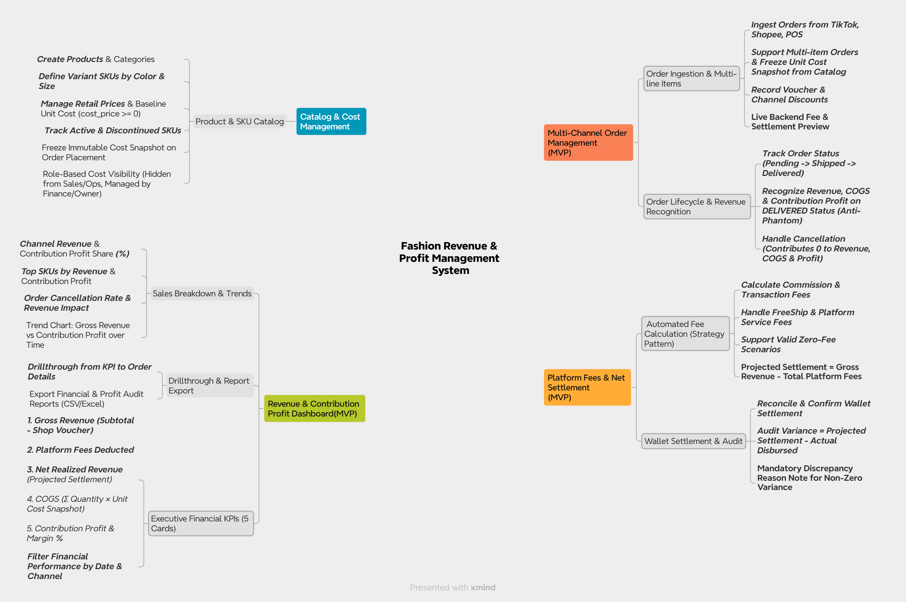
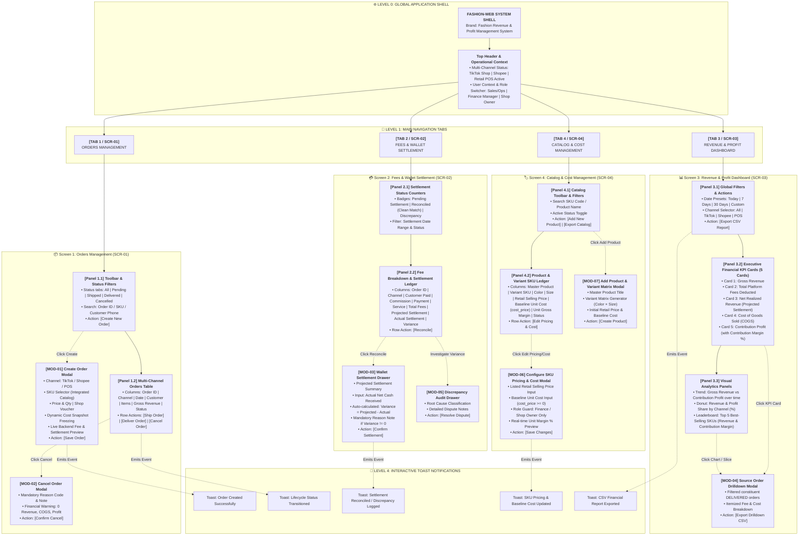
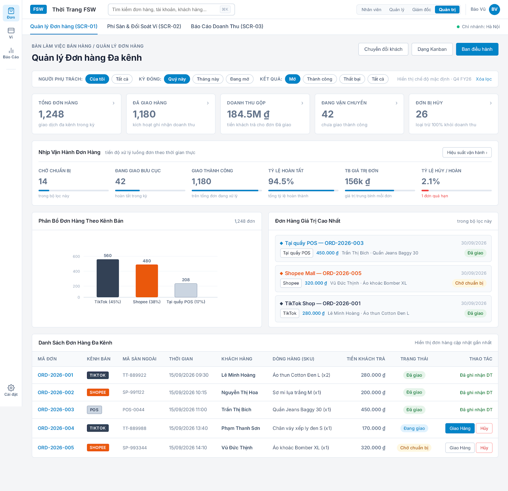
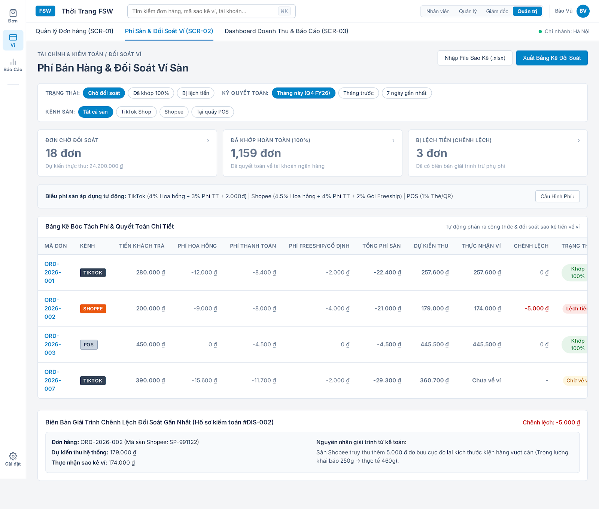
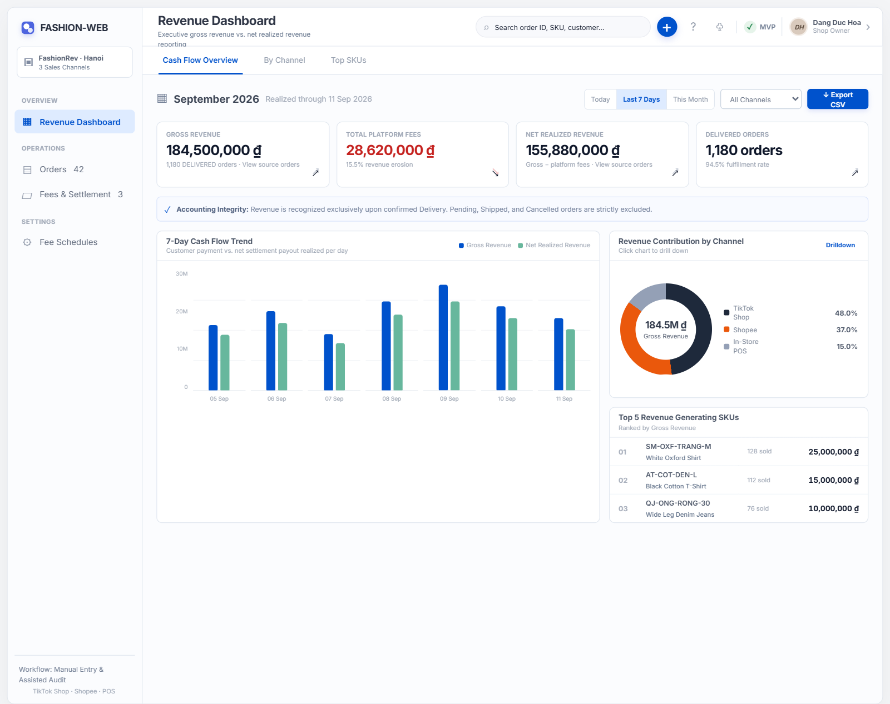

<div align="center">

# Fashion Revenue & Profit Management System

**Multi-Channel Revenue & Cash Flow Settlement Management Platform**

*Eradicate Phantom Revenue · Automate Marketplace Fee Deductions · Audit Wallet Settlements*

[](docs/architecture/arc42_en.md)
[](docs/requirements_invest.md)
[](docs/uiux_specifications.md)
[](docs/database/schema.dbml)
[](docs/stitch_prototype.html)

</div>

---

## 1. Project Overview

In multi-channel fashion retail (TikTok Shop, Shopee, In-Store POS), enterprises frequently suffer from the **"Paper Profit, Negative Cash Flow"** dilemma: Gross Merchandise Value (GMV) appears strong on sales dashboards, but actual bank balances fall short due to complex platform fee deductions, shipping weight penalties, customer returns, baseline merchandise costs, and premature revenue recognition.

The **Fashion Revenue & Profit Management System** is a purpose-built financial control platform designed to provide transparency into **channel-level contribution profitability**, automate itemized marketplace fee deductions, freeze baseline merchandise cost snapshots, and eliminate settlement discrepancies across sales channels.

> [!NOTE]
> **Canonical Profit Boundary:**
> *"Contribution Profit represents order/channel profitability after marketplace fees and COGS, but before corporate operating expenses and taxes."*
> The system strictly calculates **Contribution Profit** and does **not** calculate company-wide net income (corporate OPEX, store rent, administrative payroll, marketing campaigns, corporate income taxes, and depreciation are intentionally excluded from MVP scope).

### 1.1 System Mindmap (Functional Architecture)
Below is the core conceptual mindmap unbundling the four operational domains of the platform:



### 1.2 Screens Hierarchy Tree (Navigation Architecture)
The user interface is architected into 4 top-level workspaces (Level 1), interactive action panels (Level 2), and specialized modals / drawers (Level 3) for transactional control:



---

## 2. Business Problem & Accounting Principles

### 2.1 The Core Equations

#### Payout & Settlement Control:
$$\text{Gross Revenue} = \text{Subtotal} - \text{Shop Voucher}$$
$$\text{Projected Settlement} = \text{Gross Revenue} - \text{Total Platform Fees}$$
$$\text{Settlement Variance} = \text{Projected Settlement} - \text{Actual Settlement}$$

#### Commercial Contribution Profitability:
$$\text{COGS} = \sum (\text{Quantity} \times \text{Unit Cost Snapshot})$$
$$\text{Contribution Profit} = \text{Projected Settlement} - \text{COGS} = \text{Gross Revenue} - \text{Total Platform Fees} - \text{COGS}$$
$$\text{Contribution Margin \%} = \frac{\text{Contribution Profit}}{\text{Gross Revenue}} \times 100 \quad (\text{when } \text{Gross Revenue} > 0)$$

Where:
- $\text{Total Platform Fees} = \text{Commission Fee} + \text{Payment Processing Fee} + \text{Service Fee} + \text{Fixed Fee}$
- $\text{Unit Cost Snapshot}$ is the frozen baseline merchandise cost from the catalog at order placement time.
- Terminology Constraint: The term **Net Profit** is strictly prohibited; the canonical metric is **Contribution Profit**.

### 2.2 Core Financial Control Rules
1. **Anti-Phantom Revenue & Profit Invariant:** Orders in `PENDING`, `SHIPPED`, or `CANCELLED` status contribute **0 ₫** to recognized revenue, COGS, and contribution profit. Commercial financial metrics are officially recognized into reports if and only if the order reaches `DELIVERED`.
2. **Immutable Financial & Cost Snapshots:** Once an order is created, item baseline unit costs are frozen into `order_items.unit_cost_snapshot`. When an order is delivered, applied fee rates, deductions, and projected settlement are permanently frozen to preserve historical audit integrity.
3. **Canonical Variance Formula:** Discrepancy detection between expected and received payouts strictly follows `variance_amount = projected_settlement - actual_settlement`.
4. **Mandatory Discrepancy Justification:** Any non-zero settlement variance requires finance review notes before resolution.
5. **Cost Access Security:** Baseline unit cost (`cost_price`), COGS, and Contribution Profit are restricted to **Shop Owner** and **Finance Manager** roles; **Sales & Operations Staff** have read-only SKU selection without cost visibility.

---

## 3. Core Features & Workspaces

The platform provides four cohesive operational workspaces tailored to business roles:

### 3.1 Screen 1: Multi-Channel Orders Management (SCR-01)
- Records orders from TikTok Shop, Shopee, and In-Store POS channels.
- Product selector integrated with catalog SKUs, freezing item unit costs into immutable snapshots.
- Real-time backend fee preview during manual order composition.
- Governs lifecycle status progression (`Pending` $\rightarrow$ `Shipped` $\rightarrow$ `Delivered` / `Cancelled`).



### 3.2 Screen 2: Fees & Wallet Settlement (SCR-02)
- Granular itemization of commission fees, payment processing fees, and service charges.
- Two-way reconciliation matching internal delivered orders against payout statements.
- Slide-over audit drawer for investigating and resolving settlement discrepancies.



### 3.3 Screen 3: Revenue & Profit Dashboard (SCR-03)
- Executive KPI summary cards (Gross Revenue, Total Platform Fees, Net Realized Revenue, COGS, Contribution Profit).
- Comparative cash flow and contribution profit trend charts evaluating revenue against marketplace deductions and merchandise costs.
- Channel revenue share distribution and Top 5 SKU leaderboard by revenue and contribution profit.



### 3.4 Screen 4: Product Catalog & Cost Management (SCR-04)
- Centralized master product catalog and variant SKU management (Color, Size, SKU Code).
- Retail selling price and baseline unit merchandise cost configuration (`cost_price >= 0`).
- Role-gated interface: Cost baseline editing is strictly restricted to Shop Owner and Finance Manager.
- Real-time gross margin preview per SKU before channel-specific platform deductions.

---

## 4. Architecture Summary

The system follows a strict, decoupled three-tier architecture:

```
[ User / Operator ]
        │  (HTTPS / Browser)
        ▼
[ React Web SPA ]
        │  (HTTPS / REST / JSON)
        ▼
[ ASP.NET Core Backend API ]
        │  (TCP / SQL via EF Core 8 & Npgsql)
        ▼
[ PostgreSQL Database ]
```

- **React Web SPA:** Pure client-side presentation layer with zero canonical financial calculation logic.
- **ASP.NET Core Backend API:** Authoritative boundary enforcing state machine transitions, Strategy-based fee calculations, and transaction orchestration.
- **PostgreSQL Database:** Relational ACID transactional storage preserving immutable orders, fee schedules, snapshots, and reconciliation ledgers.

---

## 5. Technology Stack

| Layer | Technologies |
| :--- | :--- |
| **Frontend** | React 18, TypeScript, Vite, React Router 6, Axios |
| **Backend** | ASP.NET Core 8 (`net8.0`), C# 12, Entity Framework Core 8, Npgsql, Swagger / OpenAPI |
| **Database** | PostgreSQL 16+ (Normalized 3NF relational schema, UUID PKs, `numeric(15,2)` currency precision) |
| **Design System** | Salesforce Lightning B2B design tokens, tabular figures (`tnum`), English-only UI, VND currency |

---

## 6. Documentation Map

| Area | Document Path | Description |
| :--- | :--- | :--- |
| **Architecture Overview** | [`docs/architecture/arc42_en.md`](docs/architecture/arc42_en.md) | Standard arc42 comprehensive architecture documentation |
| **C4 Context (Level 1)** | [`docs/architecture/c4-context_en.md`](docs/architecture/c4-context_en.md) | System boundary, human actors, and external system relationships *(LOCKED)* |
| **C4 Container (Level 2)**| [`docs/architecture/c4-container_en.md`](docs/architecture/c4-container_en.md) | Deployable containers, communication protocols, and boundaries *(LOCKED)* |
| **C4 Backend Component** | [`docs/architecture/c4-component-backend_en.md`](docs/architecture/c4-component-backend_en.md) | Backend controllers, services, fee strategy engine, and repository ports *(LOCKED)* |
| **C4 Frontend Component**| [`docs/architecture/c4-component-frontend_en.md`](docs/architecture/c4-component-frontend_en.md) | Frontend layout, routing, feature modules, hooks, and shared foundation *(LOCKED)* |
| **Database Schema (DBML)**| [`docs/database/schema.dbml`](docs/database/schema.dbml) | Canonical source of truth for PostgreSQL database design |
| **Database Specification**| [`docs/database/database-design_en.md`](docs/database/database-design_en.md) | English relational schema design specification, ERD, and table catalog |
| **Database Constraints & Indexes** | [`docs/database/database-constraints-indexes_en.md`](docs/database/database-constraints-indexes_en.md) | PostgreSQL constraints, check integrity, index matrix, and ACID transactions |
| **User Stories & BDD** | [`docs/requirements_invest.md`](docs/requirements_invest.md) | INVEST user stories and Gherkin acceptance criteria |
| **Use Cases & RBAC** | [`docs/usecase.md`](docs/usecase.md) | Actor specifications, UML use cases, and role-based access matrix |
| **UI/UX Specifications** | [`docs/uiux_specifications.md`](docs/uiux_specifications.md) | Design tokens, color rules, layout grid, and screen hierarchy |

---

## 7. Repository Structure

```plaintext
Quanly_DoanhThu_LoiNhuan_DangDucHoa_VSF/
├── README.md                              # Main project landing page & overview
├── backend/                               # ASP.NET Core 8 Web API solution
│   ├── src/
│   │   ├── FashionWeb.Api/                # HTTP API Controllers, DI registration, Middlewares
│   │   ├── FashionWeb.Business/           # Domain entities, fee strategies, interfaces, DTOs
│   │   └── FashionWeb.Data/               # EF Core DbContext, PostgreSQL repositories, migrations
│   └── tests/
│       └── FashionWeb.Business.Tests/     # Automated domain & strategy unit tests
├── frontend/                              # React 18 / TypeScript SPA
│   ├── src/
│   │   ├── app/                           # App routing and application providers
│   │   ├── layouts/                       # Application shell, sidebar, topbar
│   │   ├── pages/                         # Route-bound view orchestrators (Orders, Settlement, Dashboard, Catalog)
│   │   ├── features/                      # Domain-specific UI, custom hooks, and API services (orders, settlement, analytics, catalog)
│   │   └── shared/                        # Primitives, API client, formatters, copy dictionaries
│   └── package.json
└── docs/                                  # Project architecture and technical specifications
    ├── architecture/                      # arc42 and C4 Level 1-3 specifications
    ├── database/                          # DBML schema and relational design specifications
    ├── references/                        # Architectural references and sample guides
    ├── screenshots/                       # Application UI screenshots and verified diagrams
    ├── archive/                           # Archived legacy assets
    ├── requirements_invest.md             # INVEST user stories
    ├── usecase.md                         # UML use cases and RBAC matrix
    ├── information_architecture.md        # Data dictionary and accounting control rules
    └── uiux_specifications.md             # Design tokens and visual specifications
```

---

