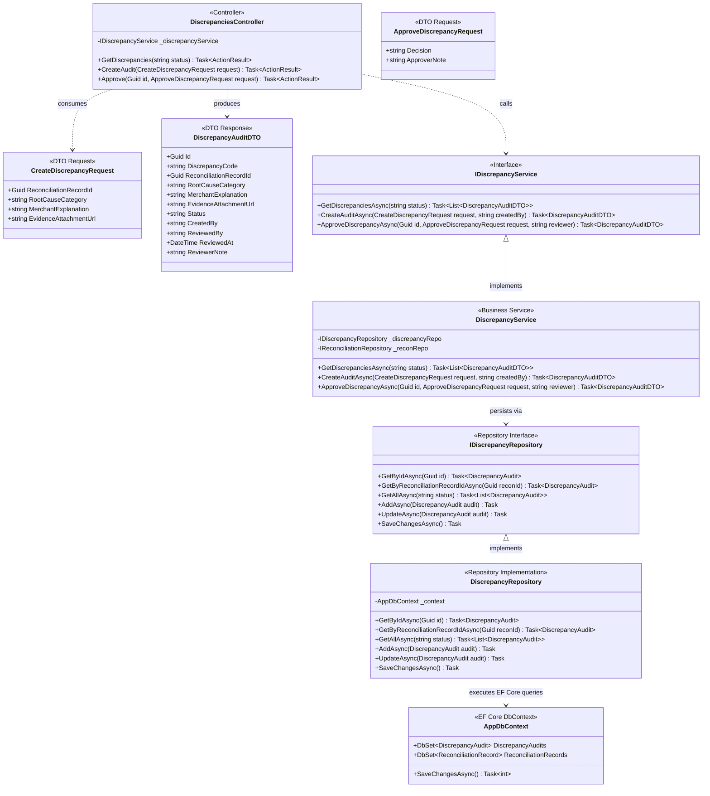
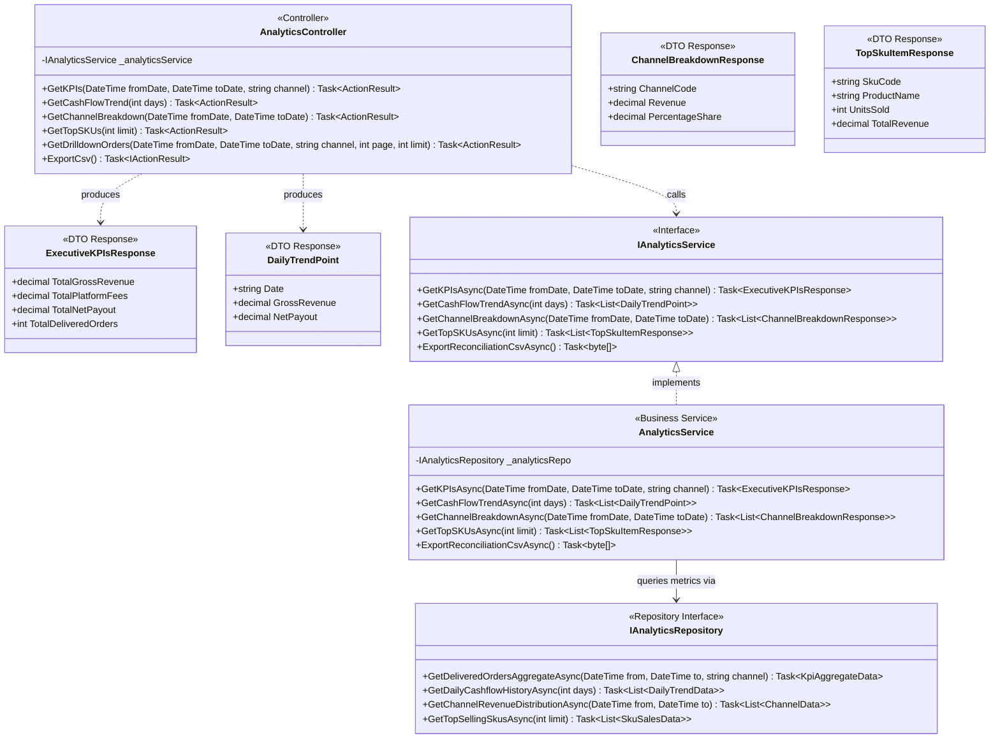
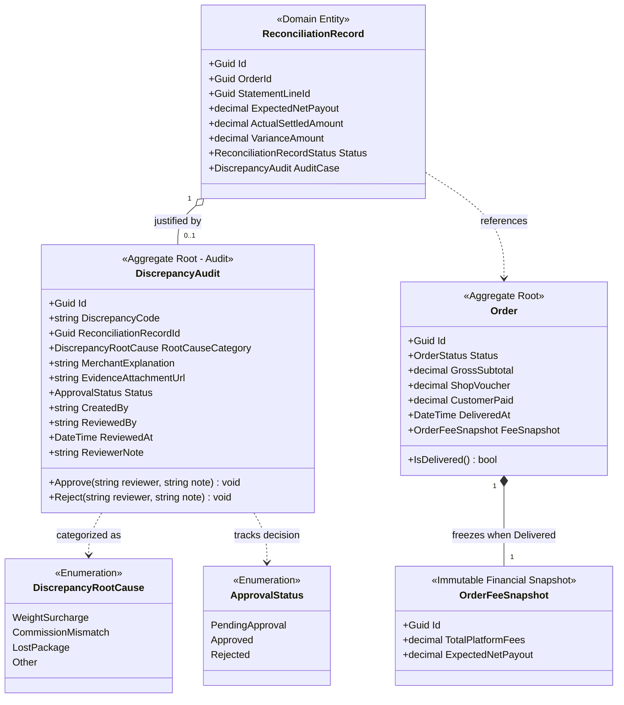

# 04 — Sơ Đồ Lớp: Kiểm Toán Sai Lệch & Báo Cáo Doanh Thu (Discrepancy Audit & Analytics)

> **Dự án:** FASHION-WEB — Nền Tảng Quản Lý Doanh Thu & Đối Soát Bán Hàng Đa Kênh  
> **Phân hệ:** Kiểm toán Sai lệch Dòng tiền (#DIS-002) & Dashboard Doanh thu Điều hành (SCR-03 / MOD-05)  
> **Phạm vi tầng:** Presentation (`FashionWeb.Api`), Business (`FashionWeb.Business`), Data (`FashionWeb.Data`)  
> **Mẫu kiến trúc:** Clean Architecture 3 Tầng, Mẫu Kiểm toán (Audit Trail), Tổng hợp chống Doanh thu ảo

---

## 1. Phân Rã Kiến Trúc Thành 3 Sơ Đồ Con

Phân hệ này đảm nhiệm vai trò kiểm soát dòng tiền và cung cấp số liệu phân tích tài chính phục vụ quyết định điều hành:
1. **Kiểm toán Sai lệch Dòng tiền (#DIS-002):** Cho phép kế toán lập hồ sơ giải trình nguyên nhân hụt tiền (phạt cân nặng, phụ phí sàn) và yêu cầu Chủ shop phê duyệt để chính thức khóa sổ.
2. **Dashboard Phân tích & Báo cáo Doanh thu:** Tổng hợp tức thời 4 thẻ KPI tài chính, biểu đồ xu hướng 7 ngày, tỷ trọng kênh và trích xuất tệp CSV kiểm toán.

Để đảm bảo tính trực quan, rõ ràng và dễ review, phân hệ được phân rã thành **3 sơ đồ con chuyên biệt**:
1. **Sơ đồ 4.1 — Luồng 3 Tầng Lập Hồ Sơ & Phê Duyệt Kiểm Toán (#DIS-002):** Tiếp nhận, đính kèm đường dẫn chứng từ và phân quyền phê duyệt RBAC.
2. **Sơ đồ 4.2 — Luồng Dịch Vụ Phân Tích & Báo Cáo Doanh Thu Điều Hành:** Tính toán 4 thẻ KPI, biểu đồ cột 7 ngày, tỷ trọng kênh và xuất tệp CSV.
3. **Sơ đồ 4.3 — Mô Hình Thực Thể Kiểm Toán & Tập Hợp Doanh Thu Chống Ảo:** Quan hệ bảng CSDL và các nguyên tắc kế toán bất biến.

---

## 2. Sơ Đồ 4.1: Luồng 3 Tầng Lập Hồ Sơ & Phê Duyệt Kiểm Toán (#DIS-002)



---

## 3. Sơ Đồ 4.2: Luồng Dịch Vụ Phân Tích & Báo Cáo Doanh Thu Điều Hành



---

## 4. Sơ Đồ 4.3: Mô Hình Thực Thể Kiểm Toán & Tập Hợp Doanh Thu Chống Ảo



---

## 5. Tóm Tắt Quy Tắc Nghiệp Vụ Cốt Lõi

1. **Bắt buộc giải trình chênh lệch tiền:**
   * Bất cứ khi nào $\text{VarianceAmount} \neq 0$, việc tạo hồ sơ `DiscrepancyAudit` là điều kiện bắt buộc để kết thúc kỳ đối soát kế toán.
   * Nguyên nhân gốc rễ được phân loại chuẩn hóa: `WeightSurcharge` (phạt kích thước/cân nặng của bên vận chuyển), `CommissionMismatch` (sàn trừ sai biểu phí), `LostPackage` (thất lạc hàng), hoặc `Other`.
2. **Phân tách thẩm quyền (RBAC):**
   * **Nhân viên bán hàng (Sales/Ops):** Không có quyền truy cập vào kiểm toán chênh lệch hoặc báo cáo tài chính.
   * **Kế toán viên (Finance Manager):** Được quyền lập hồ sơ giải trình (`CreateAuditAsync`) và đính kèm URL chứng từ.
   * **Chủ shop / Ban điều hành (Shop Owner):** Nắm độc quyền thẩm quyền phê duyệt (`Approve`) hoặc từ chối (`Reject`) để đóng hồ sơ.
3. **Nguyên tắc kế toán chống doanh thu ảo (Zero Phantom Revenue):**
   * Toàn bộ truy vấn tổng hợp trong `AnalyticsRepository` bắt buộc lọc:
     ```sql
     WHERE status = 'DELIVERED'
     ```
   * Đơn ở trạng thái `PENDING`, `SHIPPED`, `CANCELLED` bị loại trừ 100%, đóng góp đúng **0 VNĐ** vào các thẻ KPI và biểu đồ.
4. **Truy xuất tệp CSV dạng Stream:**
   * Hàm `ExportReconciliationCsvAsync()` truyền trực tiếp byte stream từ CSDL ra tệp CSV, tránh việc nạp toàn bộ lịch sử giao dịch vào bộ nhớ RAM gây tràn bộ nhớ.
