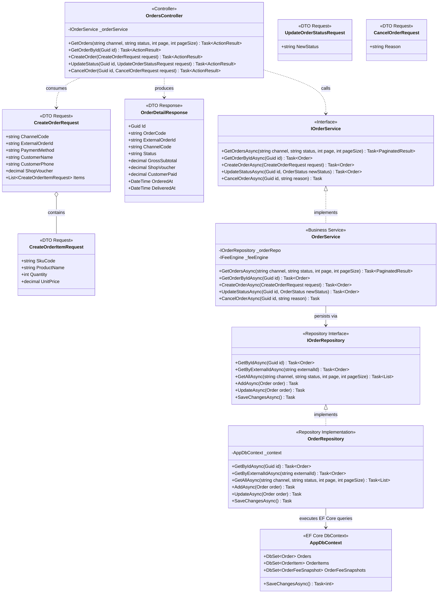
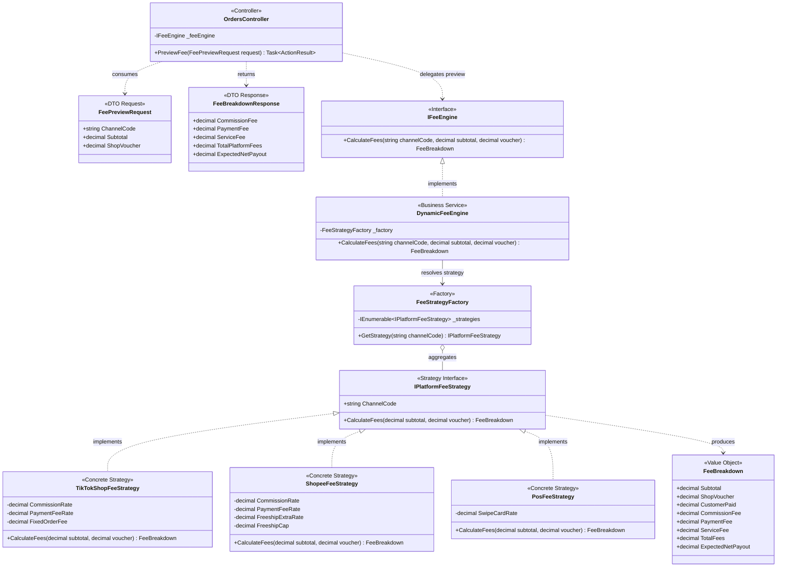
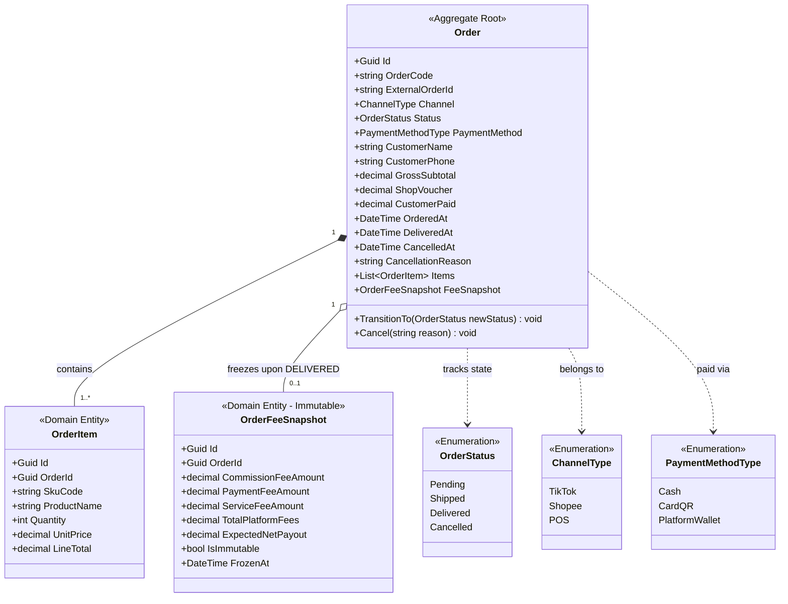

# 02 — Sơ Đồ Lớp: Quản Lý Đơn Hàng & Động Cơ Tính Phí Sàn (Orders & Fee Engine)

> **Dự án:** FASHION-WEB — Nền Tảng Quản Lý Doanh Thu & Đối Soát Bán Hàng Đa Kênh  
> **Phân hệ:** Quản lý Đơn hàng (SCR-01 / MOD-01 / MOD-02) & Tính phí sàn linh hoạt  
> **Phạm vi tầng:** Presentation (`FashionWeb.Api`), Business (`FashionWeb.Business`), Data (`FashionWeb.Data`)  
> **Mẫu kiến trúc:** Clean Architecture 3 Tầng, Strategy Pattern, Immutable Snapshot

---

## 1. Phân Rã Kiến Trúc Thành 3 Sơ Đồ Con

Để đảm bảo tính trực quan, rõ ràng và dễ review nhất, phân hệ này được phân rã thành **3 sơ đồ con chuyên biệt**:
1. **Sơ đồ 2.1 — Điều phối Dịch vụ & Luồng API 3 Tầng:** Thể hiện luồng Dependency Injection từ Controller qua Business Service đến Data Repository.
2. **Sơ đồ 2.2 — Động cơ Bóc tách Phí sàn (Strategy Pattern):** Đóng gói công thức chiết khấu của các sàn (TikTok, Shopee, POS) độc lập.
3. **Sơ đồ 2.3 — Mô hình Thực thể & Ảnh chụp Chi phí Bất biến:** Cấu trúc Aggregate Root `Order`, `OrderItem` và bản ghi snapshot chống doanh thu ảo.

---

## 2. Sơ Đồ 2.1: Điều Phối Dịch Vụ & Luồng API 3 Tầng

---

## 3. Sơ Đồ 2.2: Động Cơ Bóc Tách Phí Sàn (Strategy Pattern)

---

## 4. Sơ Đồ 2.3: Mô Hình Thực Thể & Ảnh Chụp Chi Phí Bất Biến

---

## 5. Tóm Tắt Quy Tắc Nghiệp Vụ Cốt Lõi

1. **Strategy Pattern:**
   - TikTok Shop: `Hoa hồng = 4.0% * Subtotal`, `Phí thanh toán = 3.0% * CustomerPaid`, `Phí cố định = 2.000 VNĐ`.
   - Shopee: `Hoa hồng = 4.5% * Subtotal`, `Phí thanh toán = 4.0% * CustomerPaid`, `Freeship Xtra = Min(2.0% * Subtotal, 20.000 VNĐ)`.
   - Cửa hàng POS: `Quẹt thẻ/QR = 1.0% * CustomerPaid`, `Tiền mặt = 0 VNĐ`.
2. **Chống doanh thu ảo (Zero Phantom Revenue):** Chỉ ghi nhận doanh thu khi `Order.Status == OrderStatus.Delivered`. Các đơn ở trạng thái Pending hoặc Shipped đóng góp đúng 0 VNĐ vào sổ cái.
3. **Bất biến sổ cái (Immutable Snapshot):** Ngay khi đơn hàng hoàn tất giao, `OrderFeeSnapshot` được tạo và khóa vĩnh viễn (`IsImmutable = true`). Mọi thay đổi chính sách biểu phí sau này không làm ảnh hưởng đến dữ liệu quá khứ.
4. **Độ chính xác tiền tệ:** 100% thuộc tính tiền tệ dùng kiểu `decimal` C# và lưu trữ dạng `NUMERIC(18,0)` VNĐ. Nghiêm cấm dùng số thực `float`, `double`.
