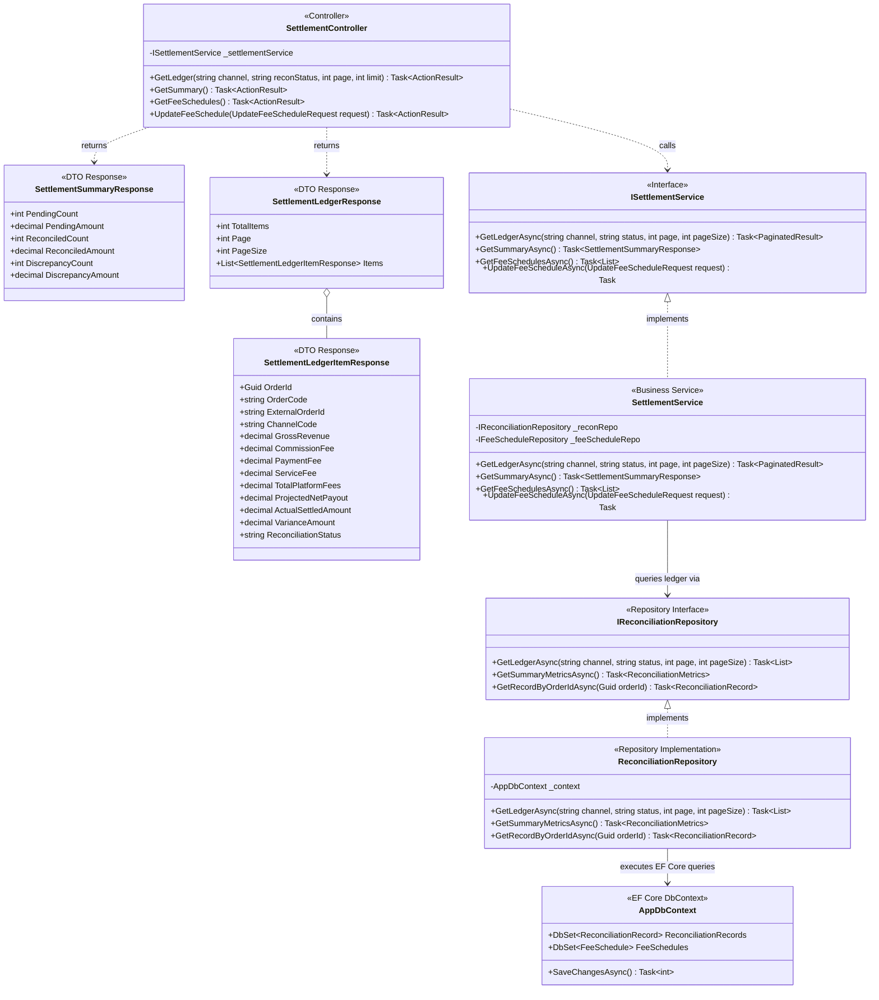
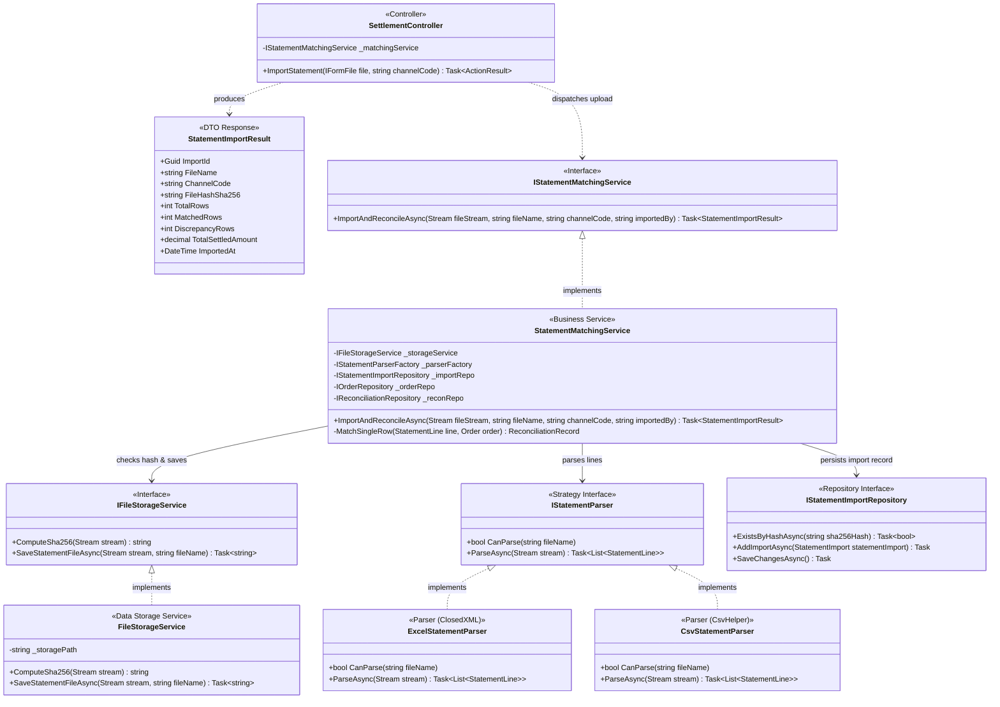
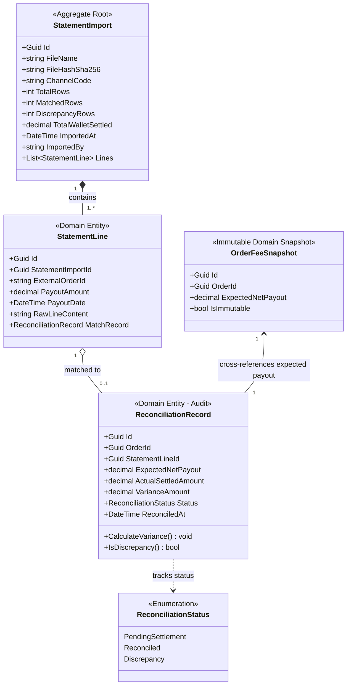

# 03 — Sơ Đồ Lớp: Quyết Toán & Đối Soát Ví Sàn (Settlement & Reconciliation)

> **Dự án:** FASHION-WEB — Nền Tảng Quản Lý Doanh Thu & Đối Soát Bán Hàng Đa Kênh  
> **Phân hệ:** Quyết toán & Đối soát Ví sàn (SCR-02 / MOD-03 / MOD-04)  
> **Phạm vi tầng:** Presentation (`FashionWeb.Api`), Business (`FashionWeb.Business`), Data (`FashionWeb.Data`)  
> **Mẫu kiến trúc:** Clean Architecture 3 Tầng, Chiến lược Parser & Storage, So khớp 2 chiều tự động

---

## 1. Phân Rã Kiến Trúc Thành 3 Sơ Đồ Con

Phân hệ này đảm nhiệm việc bóc tách biểu phí sàn, tiếp nhận file sao kê ngân hàng/ví sàn (`.xlsx`/`.csv`), tự động so khớp 2 chiều với số liệu đơn hàng nội bộ và kiểm toán các khoản chênh lệch tiền.

Để đảm bảo tính trực quan, rõ ràng và dễ review, phân hệ được phân rã thành **3 sơ đồ con chuyên biệt**:
1. **Sơ đồ 3.1 — Điều phối Sổ cái Quyết toán & Số liệu Tổng hợp 3 Tầng:** Truy vấn danh sách sổ cái, 3 thẻ số liệu tổng quan và cập nhật biểu phí sàn.
2. **Sơ đồ 3.2 — Tiếp nhận Bảng kê, Parser & Động cơ So khớp Tự động:** Tiếp nhận file upload multipart, băm mã SHA-256 chống trùng, trừu tượng hóa bộ đọc file Excel/CSV và thuật toán so khớp.
3. **Sơ đồ 3.3 — Mô hình Thực thể & Trạng thái Đối soát:** Cấu trúc bảng CSDL, phương trình bất biến kế toán và truy vết sai lệch.

---

## 2. Sơ Đồ 3.1: Điều Phối Sổ Cái Quyết Toán & Số Liệu Tổng Hợp 3 Tầng

---

## 3. Sơ Đồ 3.2: Tiếp Nhận Bảng Kê, Parser & Động Cơ So Khớp Tự Động

---

## 4. Sơ Đồ 3.3: Mô Hình Thực Thể & Trạng Thái Đối Soát

---

## 5. Tóm Tắt Quy Tắc Nghiệp Vụ Cốt Lõi

1. **Chống trùng tệp sao kê bằng mã băm SHA-256:**
   * Trước khi bóc tách dòng, hệ thống tính mã băm `SHA-256` của tệp sao kê. Nếu trùng lặp, chặn ngay lập tức với mã HTTP `409 Conflict` nhằm bảo vệ tính toàn vẹn của sổ cái.
2. **Phương trình kế toán đối soát:**
   $$\text{VarianceAmount} = \text{ActualSettledAmount} - \text{ExpectedNetPayout}$$
   * Nếu $\text{VarianceAmount} = 0$: Đơn đạt trạng thái `Reconciled` (Đã khớp 100%).
   * Nếu $\text{VarianceAmount} \neq 0$: Đơn bị đánh dấu `Discrepancy` (Lệch tiền) và lập tức sinh hồ sơ kiểm toán giải trình (`#DIS-002`). Giá trị âm thể hiện shop bị hụt tiền so với kỳ vọng (do bị phạt cân nặng vận chuyển hoặc phụ phí ẩn của sàn).
3. **Hiệu năng xử lý:**
   * Thuật toán so khớp tự động 2.000 dòng sao kê hoàn tất trong thời gian $\le 3,0$ giây nhờ cơ chế lập chỉ mục dictionary trên `external_order_id`.
4. **Chuẩn tiền tệ:**
   * 100% thuộc tính tiền tệ lưu trữ dạng `decimal` trong C# và ánh xạ sang `NUMERIC(18,0)` VNĐ trong PostgreSQL.
