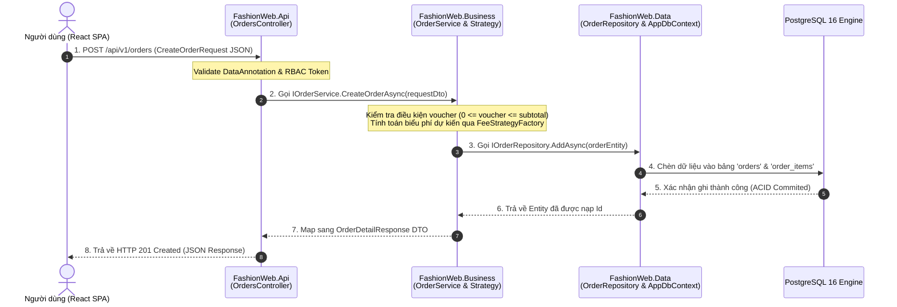

# 01 — Sơ Đồ Thành Phần Kiến Trúc .NET (Component & Layer Diagram)

> **Dự án:** FASHION-WEB — Nền Tảng Quản Lý Doanh Thu & Đối Soát Bán Hàng Đa Kênh  
> **Kiến trúc:** ReactJS (Feature-First) + ASP.NET Core Web API (.NET 8 - 3 Tiers) + EF Core + PostgreSQL 16  
> **Tài liệu căn cứ (Source of Truth):** [openapi_spec_vi.yaml](../../openapi_spec_vi.yaml) & [database_erd.md](../../database_erd.md)

---

## 1. Tổng Quan Kiến Trúc 3 Tầng (3-Tiers Architecture)

Hệ thống tuân thủ nghiêm ngặt **Mô hình 3 tầng phân rã độc lập (3-Tiers Architecture)** kết hợp nguyên lý **Đảo ngược phụ thuộc (Dependency Inversion Principle - DIP)** của Clean Architecture:

```mermaid
flowchart TD
    subgraph ClientLayer [" 🌐 CLIENT TIER (ReactJS Feature-First SPA) "]
        direction TB
        SPA_UI["React SPA Console (Vite + TS)<br/>AppShell · SCR-01 · SCR-02 · SCR-03 · 5 Modals"]
        SPA_API["Feature API Clients (Axios)<br/>ordersApi · feesApi · settlementsApi · analyticsApi"]
        SPA_UI --> SPA_API
    end

    subgraph ApiTier [" 🚀 TẦNG 1: TRÌNH DIỄN (FashionWeb.Api) "]
        direction TB
        CTRL["REST Controllers<br/>OrdersController · SettlementController<br/>DiscrepanciesController · AnalyticsController"]
        DTO["Contracts (Request / Response DTOs)<br/>Ánh xạ 100% theo openapi_spec_vi.yaml"]
        AUTH["Authorization & Security<br/>Roles (Sales, Finance, Owner) · Policies · RBAC"]
        MIDDLEWARE["Middleware Pipeline<br/>GlobalExceptionMiddleware · Logging · CORS"]
        PROG["Program.cs<br/>IoC Container · Dependency Injection Bootstrapper"]
        
        CTRL --> DTO
        CTRL --> AUTH
    end

    subgraph BusinessTier [" 💎 TẦNG 2: NGHIỆP VỤ LÕI (FashionWeb.Business) [TRUNG TÂM ĐỘC LẬP] "]
        direction TB
        SVC_INT["Service Interfaces (Hợp đồng nghiệp vụ)<br/>IOrderService · IFeeEngine · ISettlementService<br/>IDiscrepancyService · IAnalyticsService"]
        REPO_INT["Repository Interfaces (Hợp đồng truy xuất)<br/>IOrderRepository · IReconciliationRepository<br/>IFeeScheduleRepository · IDiscrepancyRepository"]
        SVC_IMPL["Service Implementations (Xử lý quy tắc nghiệp vụ)<br/>OrderService · StatementMatchingService<br/>DiscrepancyService · AnalyticsService"]
        STRAT["Strategy Pattern (Động cơ bóc tách phí sàn)<br/>IPlatformFeeStrategy · FeeStrategyFactory<br/>TikTokShopFeeStrategy · ShopeeFeeStrategy · POSFeeStrategy"]
        DOMAIN["Domain Model (Thực thể & Luật tài chính)<br/>Order · OrderItem · OrderFeeSnapshot · Money<br/>StatementImport · StatementLine · ReconciliationRecord"]
        
        SVC_IMPL -.->|implements| SVC_INT
        SVC_IMPL --> STRAT
        SVC_IMPL --> DOMAIN
        SVC_IMPL --> REPO_INT
    end

    subgraph DataTier [" 💾 TẦNG 3: TRUY XUẤT DỮ LIỆU (FashionWeb.Data) "]
        direction TB
        DBCONTEXT["AppDbContext (Entity Framework Core)<br/>DbSet & Quản lý Transaction ACID"]
        CONFIGS["Fluent API Configurations<br/>OrderConfiguration · SnapshotConfiguration<br/>HasPrecision(18,0) cho VNĐ"]
        REPO_IMPL["Repository Implementations<br/>OrderRepository · ReconciliationRepository<br/>FeeScheduleRepository · DiscrepancyRepository"]
        PARSERS["Statement Parsers & Storage<br/>ExcelStatementParser (ClosedXML) · CsvStatementParser<br/>FileStorageService (SHA-256 Deduplication)"]
        
        REPO_IMPL -.->|implements| REPO_INT
        REPO_IMPL --> DBCONTEXT
        DBCONTEXT --> CONFIGS
    end

    subgraph InfraTier [" 🗄️ TẦNG HẠ TẦNG VẬT LÝ "]
        PG[("PostgreSQL 16 Engine<br/>8 Bảng CSDL theo database_erd.md<br/>Chuẩn NUMERIC(18,0)")]
        FS[("Secure Local File Storage<br/>Lưu trữ tệp sao kê .xlsx/.csv gốc")]
    end

    %% Giao tiếp giữa các tầng
    SPA_API -->|"HTTPS / JSON (REST APIs)"| CTRL
    CTRL -->|"1. Gọi qua Service Interface"| SVC_INT
    DBCONTEXT -->|"SQL Statements"| PG
    PARSERS -->|"Lưu trữ file kèm băm hash"| FS

    %% Quy tắc phụ thuộc (Dependency Rules)
    ApiTier ==>|"Project Reference"| BusinessTier
    DataTier ==>|"Project Reference"| BusinessTier

    %% Styling
    style ClientLayer fill:#eff6ff,stroke:#3b82f6,stroke-width:2px;
    style ApiTier fill:#fef9c3,stroke:#ca8a04,stroke-width:2px;
    style BusinessTier fill:#dcfce7,stroke:#16a34a,stroke-width:3px;
    style DataTier fill:#fce7f3,stroke:#db2777,stroke-width:2px;
    style InfraTier fill:#f1f5f9,stroke:#475569,stroke-width:2px;
    style PG fill:#334155,stroke:#0f172a,color:#ffffff;
    style FS fill:#334155,stroke:#0f172a,color:#ffffff;
```



---

## 2. Quy Tắc Phụ Thuộc Bất Biến (Dependency Inversion Rule)

Cốt lõi của kiến trúc này là sự bảo vệ tối đa cho **Tầng Nghiệp Vụ (`FashionWeb.Business`)**:

```text
┌───────────────────────────┐         ┌───────────────────────────┐
│     FashionWeb.Api        │         │     FashionWeb.Data       │
│  (Tầng 1: Presentation)   │         │    (Tầng 3: Data Access)  │
└─────────────┬─────────────┘         └─────────────┬─────────────┘
              │                                     │
              │ phụ thuộc (Project Reference)       │ phụ thuộc (Project Reference)
              ▼                                     ▼
     ┌─────────────────────────────────────────────────────┐
     │                FashionWeb.Business                  │
     │   (Tầng 2: Nghiệp vụ lõi - ĐỘC LẬP TUYỆT ĐỐI)       │
     └─────────────────────────────────────────────────────┘
```

### Chi tiết quy tắc:
1. **`FashionWeb.Business` KHÔNG phụ thuộc vào bất kỳ project nào:**
   - Không reference `FashionWeb.Api`.
   - Không reference `FashionWeb.Data`.
   - Không phụ thuộc vào thư viện bên thứ ba của tầng dữ liệu (không chứa thư viện EF Core hay ClosedXML).
   - Chứa 100% Business Rules, Domain Entities, State Machine, Value Objects và các Interface (`IService`, `IRepository`).
2. **`FashionWeb.Api` chỉ phụ thuộc vào `FashionWeb.Business`:**
   - Đóng vai trò Ingress Gateway nhận HTTP Request, validate model, áp dụng filter RBAC và ủy quyền xử lý cho `Business.Interfaces.Services`.
   - Không được gọi trực tiếp `FashionWeb.Data` (ngoại trừ hàm mở rộng DI trong `Program.cs` lúc khởi động ứng dụng).
3. **`FashionWeb.Data` phụ thuộc vào `FashionWeb.Business`:**
   - Hiện thực hóa các interface `Business.Interfaces.Repositories` do tầng Business đặt ra.
   - Chịu trách nhiệm tương tác CSDL PostgreSQL qua EF Core `AppDbContext` và parse tệp Excel sao kê.

---

## 3. Ma Trận Phân Bổ Thành Phần & Thư Mục (Folder-to-Component Mapping)

| Tầng Kiến Trúc | Project C# tương ứng | Thư mục vật lý | Các Component & Trách nhiệm chính |
|---|---|---|---|
| **Client SPA** | N/A (Node.js/Vite) | `frontend/src/` | - `features/`: Các module SCR-01, SCR-02, SCR-03, Modals.<br>- `shared/api/`: Axios client & interceptors. |
| **Presentation** | `FashionWeb.Api.csproj` | `backend/src/FashionWeb.Api/` | - `Controllers/`: Tiếp nhận HTTP REST calls.<br>- `Contracts/`: DTOs Request/Response bám sát OpenAPI.<br>- `Authorization/`: RBAC Roles (Sales, Finance, Owner).<br>- `Middleware/`: Global Exception Handler trả về JSON RFC 7807.<br>- `Program.cs`: Đăng ký DI container, CORS, Swagger UI. |
| **Business** | `FashionWeb.Business.csproj` | `backend/src/FashionWeb.Business/` | - `Domain/Entities/`: 8 bảng CSDL (`Order`, `OrderFeeSnapshot`,...).<br>- `Domain/Enums/`: `OrderStatus`, `ReconciliationStatus`,...<br>- `Strategies/`: Mẫu Strategy tính phí sàn (TikTok, Shopee, POS).<br>- `Interfaces/Services/`: Hợp đồng cho tầng Presentation.<br>- `Interfaces/Repositories/`: Hợp đồng truy xuất cho tầng Data.<br>- `Services/`: Hiện thực xử lý nghiệp vụ, tính phí, đối soát. |
| **Data Access** | `FashionWeb.Data.csproj` | `backend/src/FashionWeb.Data/` | - `Context/AppDbContext.cs`: EF Core Context, Transaction.<br>- `Configurations/`: Cấu hình Fluent API `NUMERIC(18,0)`.<br>- `Repositories/`: Hiện thực hóa truy vấn CSDL PostgreSQL.<br>- `Parsers/`: Thư viện đọc file Excel/CSV sao kê ví.<br>- `Storage/`: Quản lý lưu file và tính mã băm SHA-256. |

---

## 4. Cơ Chế Đăng Ký Dependency Injection (`Program.cs`)

Để đảm bảo lỏng lẻo (Loose Coupling) và tuân thủ nguyên lý IoC (Inversion of Control), toàn bộ phụ thuộc được đăng ký tập trung tại `FashionWeb.Api/Program.cs`:

```csharp
// 1. Đăng ký CSDL PostgreSQL (Tầng Data)
builder.Services.AddDbContext<AppDbContext>(options =>
    options.UseNpgsql(builder.Configuration.GetConnectionString("DefaultConnection")));

// 2. Đăng ký Repositories (Tầng Data hiện thực Interface của Tầng Business)
builder.Services.AddScoped<IOrderRepository, OrderRepository>();
builder.Services.AddScoped<IFeeScheduleRepository, FeeScheduleRepository>();
builder.Services.AddScoped<IReconciliationRepository, ReconciliationRepository>();
builder.Services.AddScoped<IDiscrepancyRepository, DiscrepancyRepository>();

// 3. Đăng ký Storage & Parsers (Tầng Data)
builder.Services.AddScoped<IFileStorageService, FileStorageService>();
builder.Services.AddScoped<IStatementParser, ExcelStatementParser>();

// 4. Đăng ký Động cơ tính phí sàn Strategy Pattern (Tầng Business)
builder.Services.AddScoped<TikTokShopFeeStrategy>();
builder.Services.AddScoped<ShopeeFeeStrategy>();
builder.Services.AddScoped<POSFeeStrategy>();
builder.Services.AddScoped<FeeStrategyFactory>();
builder.Services.AddScoped<IFeeEngine, DynamicFeeEngine>();

// 5. Đăng ký Services Nghiệp vụ (Tầng Business)
builder.Services.AddScoped<IOrderService, OrderService>();
builder.Services.AddScoped<ISettlementService, SettlementService>();
builder.Services.AddScoped<IStatementMatchingService, StatementMatchingService>();
builder.Services.AddScoped<IDiscrepancyService, DiscrepancyService>();
builder.Services.AddScoped<IAnalyticsService, AnalyticsService>();
```

---

## 5. Luồng Điều Khiển Xuyên Suốt (End-to-End Control Flow)

Khi một yêu cầu nghiệp vụ được kích hoạt từ giao diện người dùng, luồng điều khiển đi tuần tự qua 3 tầng như sau:


