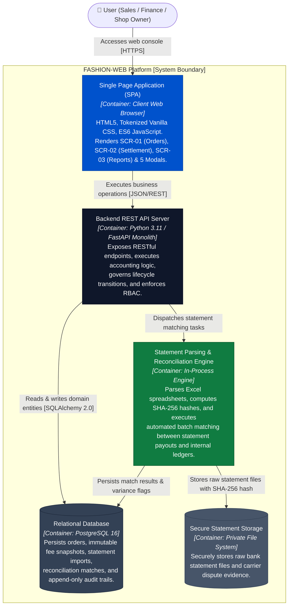
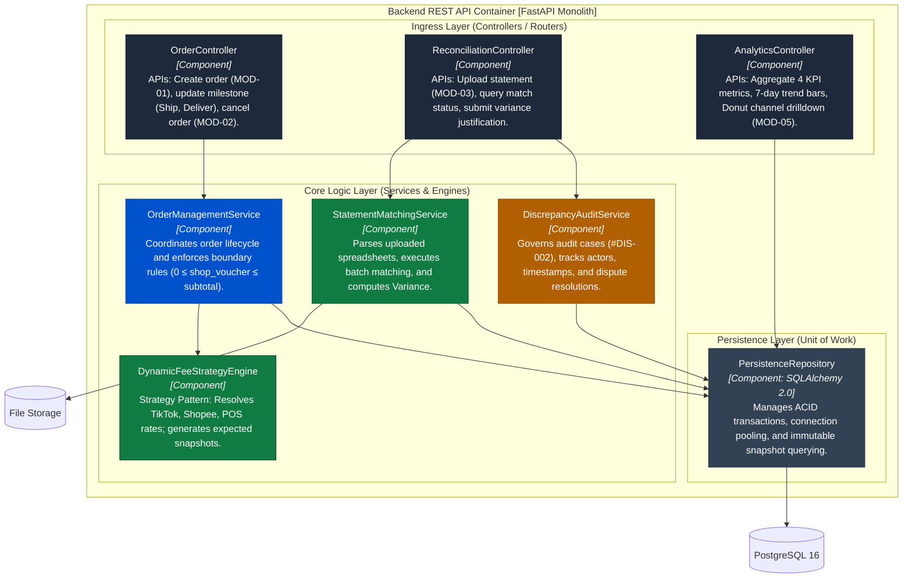
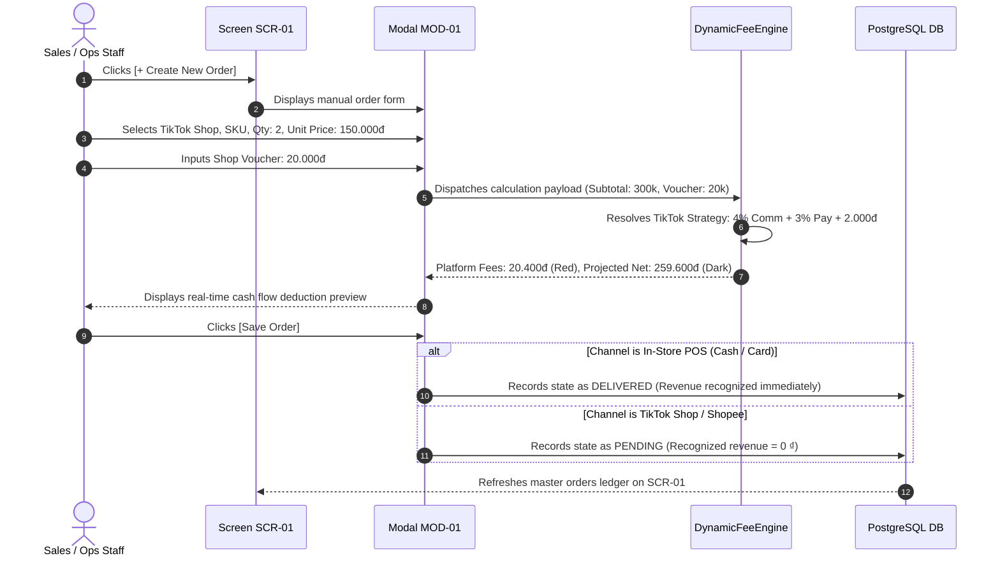
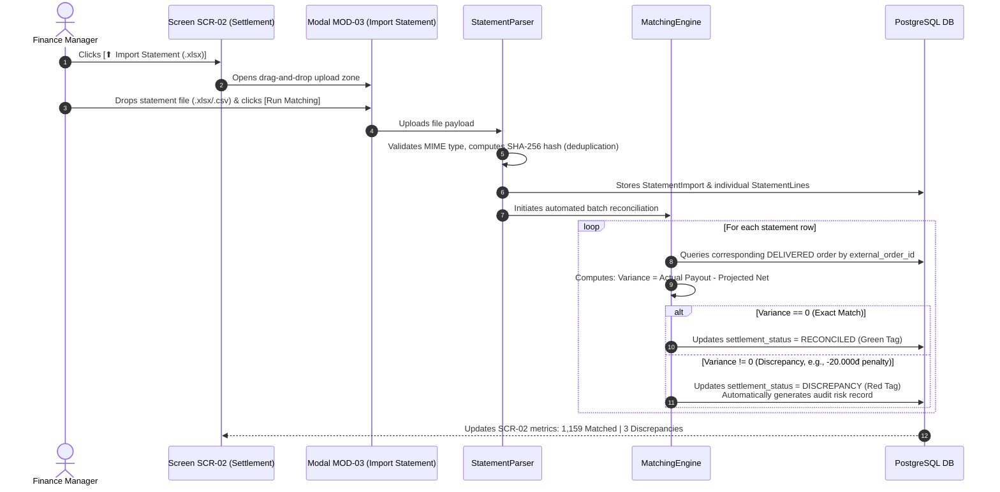
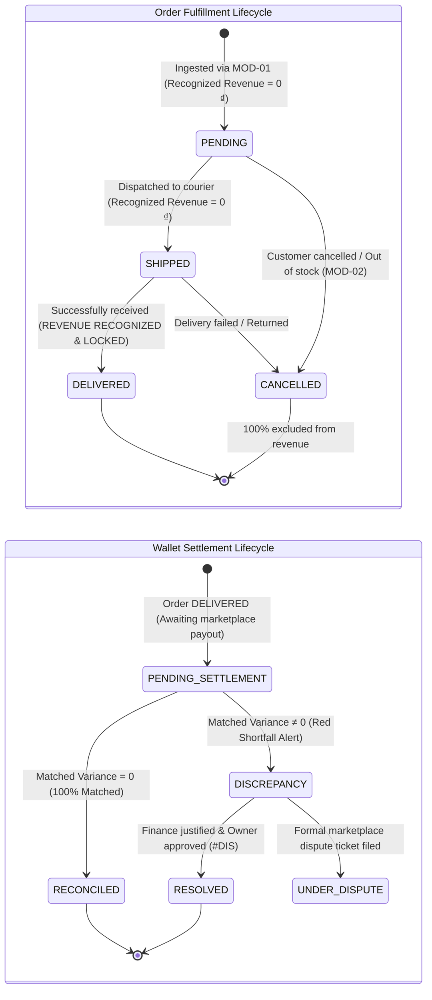
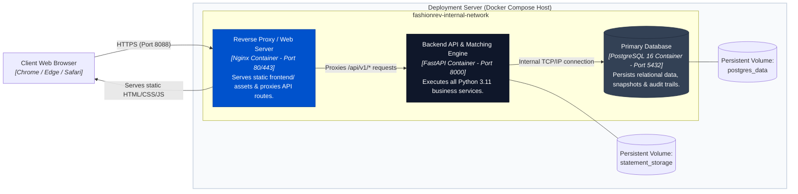

# 05 — System Architecture (arc42 + C4 Model)

## Table of Contents

- [1. Introduction and Goals](#1-introduction-and-goals)
  - [1.1. Stakeholders](#11-stakeholders)
  - [1.2. Architecture Quality Goals (ISO 25010)](#12-architecture-quality-goals-iso-25010)
- [2. Architecture Constraints](#2-architecture-constraints)
- [3. Context and Scope — C4 Level 1](#3-context-and-scope--c4-level-1)
  - [3.1. Business Context Diagram (System Context)](#31-business-context-diagram-system-context)
  - [3.2. External Interfaces Matrix](#32-external-interfaces-matrix)
- [4. Solution Strategy](#4-solution-strategy)
- [5. Building Block View — C4 Level 2 & Level 3](#5-building-block-view--c4-level-2--level-3)
  - [5.1. C4 Level 2 — Container Diagram](#51-c4-level-2--container-diagram)
  - [5.2. C4 Level 3 — Inside Backend Container (Components)](#52-c4-level-3--inside-backend-container-components)
  - [5.3. C4 Level 4 — Source Code Patterns (Design Patterns)](#53-c4-level-4--source-code-patterns-design-patterns)
- [6. Runtime View (Scenarios & Dynamic Behavior)](#6-runtime-view-scenarios--dynamic-behavior)
  - [6.1. Scenario 1: Manual Order Ingestion & Live Fee Preview (MOD-01)](#61-scenario-1-manual-order-ingestion--live-fee-preview-mod-01)
  - [6.2. Scenario 2: Statement Import & Automated Reconciliation (MOD-03)](#62-scenario-2-statement-import--automated-reconciliation-mod-03)
  - [6.3. Scenario 3: Discrepancy Auditing & Resolution Workflow (#DIS-002)](#63-scenario-3-discrepancy-auditing--resolution-workflow-dis-002)
  - [6.4. Financial State Machines](#64-financial-state-machines)
- [7. Deployment View](#7-deployment-view)
- [8. Cross-Cutting Concepts](#8-cross-cutting-concepts)
- [9. Architecture Decision Records (ADRs)](#9-architecture-decision-records-adrs)
- [10. Quality Verification Scenarios](#10-quality-verification-scenarios)
- [11. Risk Management & Technical Debt](#11-risk-management--technical-debt)
- [12. Accounting & Financial Domain Glossary](#12-accounting--financial-domain-glossary)

---

## 1. Introduction and Goals

In multi-channel fashion retail across TikTok Shop, Shopee, and In-Store POS, merchants frequently suffer from the **"Paper Profit, Negative Cash Flow"** paradox: GMV figures reported by marketplace seller dashboards appear lucrative, yet actual bank account balances shrink due to unbundled commission percentages, payment gateway deductions, Freeship Xtra service surcharges, and silent post-delivery carrier dimensional re-weighing penalties.

**FASHION-WEB** is an enterprise financial control and settlement reconciliation platform engineered to:
1. **Eradicate Phantom Revenue:** Enforces strict corporate accounting rigor — revenue is recognized if and only if an order transitions to `DELIVERED`. In-transit or cancelled orders contribute exactly **0 ₫**.
2. **Unbundle Multi-Channel Platform Fees:** Employs the **Strategy Pattern** to systematically itemize commissions, payment processing charges, and fixed platform fees in real time.
3. **Automate Bank & Wallet Settlement Reconciliation (Phase 1 Core):** Automatically cross-references expected net settlement figures against actual bank/wallet payout statements (`.xlsx`/`.csv`), flags discrepancy variances, and logs binding audit justification trails (#DIS-002).

### 1.1. Stakeholders

| Role | Beneficiary | Core Concerns |
|---|---|---|
| **Shop Owner / Executive Board** | C-Level, Store Investors | Net take-home cash flow visibility, platform fee erosion monitoring, unit SKU profit contribution. |
| **Finance Manager** | Accounting Department | Itemized fee transparency, automated bank statement matching, audit-trail compliance for tax reporting. |
| **Sales & Operations Staff** | Store Clerks, Fulfillment | Rapid manual order entry (Livestreams, Hotlines, POS counters), real-time order rhythm tracking. |
| **Software Engineers** | Technical Team | Clean layered architecture, non-floating-point financial storage, decoupled Phase 2 marketplace API extension. |

### 1.2. Architecture Quality Goals (ISO 25010)

| # | Quality Goal | Architecture Scenario | Measurable Metric | Priority |
|---|---|---|---|:---:|
| **Q1** | **Financial Precision** | Multi-channel fee calculation, wallet net payout, and statement variance matching. | Absolute arithmetic error = **0 ₫**; 100% `NUMERIC(18,0)` currency storage. | **1 (Top)** |
| **Q2** | **Zero Phantom Revenue** | Orders in `PENDING`, `SHIPPED`, or `CANCELLED` status. | Exactly **0 ₫** credited to executive revenue KPIs or dashboard charts. | **1 (Top)** |
| **Q3** | **Reconciliation Speed** | Ingestion of a 2,000-line bank/wallet payout statement via modal MOD-03. | Parsing, matching, and variance classification completed in ≤ **3.0 seconds**. | **1 (Top)** |
| **Q4** | **Ledger Immutability** | Orders transitioned to `DELIVERED` and reconciled as `RECONCILED`. | 100% locked against modification; corrections require explicit adjustment journals. | **2** |
| **Q5** | **Decoupled Extensibility** | Onboarding a new marketplace or activating Phase 2 Webhooks. | Add 1 new Strategy class; **0** changes to existing order schema or core UI. | **2** |

---

## 2. Architecture Constraints

| ID | Constraint | Category | Technical Implication & Architectural Impact |
|---|---|---|---|
| **C1** | **Independent Phase 1 Scope** | Business | Phase 1 **does not depend** on TikTok Shop Partner or Shopee Open Platform developer app approvals. Ingestion is handled via MOD-01 manual/batch entry; reconciliation is executed via `.xlsx`/`.csv` statement uploads. |
| **C2** | **Exact Monetary Arithmetic** | Technical | IEEE 754 floating-point types (`float`, `double`) are strictly prohibited. All monetary quantities must use `NUMERIC(18,0)` (VND) in PostgreSQL and `Decimal` in Python. |
| **C3** | **Process Boundary Isolation** | C4 Model | Client SPA (Browser) and Server API (FastAPI) reside in distinct operating system process boundaries, interacting exclusively over HTTPS/JSON. |
| **C4** | **Statement Evidence Preservation** | Compliance | Uploaded bank statements must be stored verbatim with computed `SHA-256` cryptographic hashes to guarantee non-repudiation and prevent duplicate ingestion. |
| **C5** | **Role-Based Access Control** | Security | Enforced at the API layer: Sales staff can only access SCR-01; Finance manages SCR-02; only Shop Owners can officially resolve variance cases (`#DIS`). |
| **C6** | **Open Source Technology Stack** | Technology | Standardized modern stack: Python 3.11, FastAPI, PostgreSQL 16, SQLAlchemy 2.0, HTML5/Vanilla CSS/ES6 JavaScript. |

---

## 3. Context and Scope — C4 Level 1

### 3.1. Business Context Diagram (System Context)

```mermaid
flowchart LR
    sales(["👤 Sales & Operations Staff"])
    fin(["👤 Finance Manager"])
    owner(["👤 Shop Owner / Executive"])

    subgraph SystemBoundary [" FASHION-WEB Platform Boundary (Phase 1) "]
        app["FASHION-WEB Platform<br/><i>[Software System]</i><br/>Multi-channel order orchestration, Strategy Pattern fee unbundling,<br/>and automated bank statement reconciliation engine"]
    end

    bankStmt["Bank & Wallet Statements<br/><i>[.xlsx / .csv exported from TikTok, Shopee, VCB, MB]</i>"]
    posDevice["In-Store POS / QR Hardware<br/><i>[Counter sale swipes & QR slips]</i>"]
    
    subgraph Phase2Ext [" Phase 2 Roadmap Boundary (Dashed Line) "]
        tiktokApi["TikTok Shop Open API<br/><i>[Automated Webhooks - Phase 2]</i>"]
        shopeeApi["Shopee Open Platform<br/><i>[Automated Webhooks - Phase 2]</i>"]
        openBankApi["Open Banking API<br/><i>[Direct Bank Feeds - Phase 2]</i>"]
    end

    sales -- "1. Ingests manual orders (Livestreams, Hotlines, POS) [MOD-01]" --> app
    sales -- "2. Updates delivery milestones (Pending -> Shipped -> Delivered)" --> app
    
    fin -- "3. Uploads bank & wallet statements (.xlsx) [MOD-03]" --> app
    fin -- "4. Audits variances & records justification notes (#DIS-002)" --> app
    
    owner -- "5. Monitors executive cash flow KPIs & approves disputes" --> app
    owner -- "6. Configures dynamic fee schedules in real time [MOD-04]" --> app

    bankStmt -. "Periodic upload for reconciliation" .-> app
    posDevice -. "In-store counter sales" .-> app

    app -. "Phase 2: Automated order sync" .-. tiktokApi
    app -. "Phase 2: Automated order sync" .-. shopeeApi
    app -. "Phase 2: Direct bank transaction feed" .-. openBankApi

    style app fill:#0052cc,stroke:#003d99,color:#ffffff,stroke-width:2px
    style SystemBoundary fill:#f8fafc,stroke:#cbd5e1,stroke-width:2px
    style Phase2Ext fill:#f1f5f9,stroke:#94a3b8,stroke-dasharray: 5 5
    style bankStmt fill:#e2e8f0,stroke:#64748b,color:#0f172a
    style posDevice fill:#e2e8f0,stroke:#64748b,color:#0f172a
    style tiktokApi fill:#ffffff,stroke:#94a3b8,color:#64748b
    style shopeeApi fill:#ffffff,stroke:#94a3b8,color:#64748b
    style openBankApi fill:#ffffff,stroke:#94a3b8,color:#64748b
```

### 3.2. External Interfaces Matrix

| Interface | Direction | Protocol | Data Contract | Phase 1 Role | Failure Mode & Recovery |
|---|:---:|---|---|---|---|
| **Manual Ingestion (MOD-01)** | In | HTTP POST / Form | JSON / Pydantic DTO | Manual entry for livestreams, hotlines, POS with live fee preview. | Client-side feedback + Pydantic validation rejection. |
| **Statement Import (MOD-03)** | In | Multipart Form / Upload | `.xlsx`, `.csv` | Uploads bank/wallet payout statements for automated batch reconciliation. | MIME validation, SHA-256 hash deduplication, error row isolation. |
| **Executive Reports (SCR-03)** | Out | HTTP GET / REST | JSON / CSV Export | Serves 4 KPI metrics, 7-day grouped bar chart, and drilldown exports. | Cached read-model query execution; fallback to primary store. |
| **Marketplace APIs (Phase 2)** | Both | HTTPS REST / Webhooks | JSON (HMAC-SHA256) | Future roadmap: Automated asynchronous order synchronization. | Transactional Outbox + Exponential Backoff retry queues. |

---

## 4. Solution Strategy

To deliver a production-grade system without third-party integration roadblocks, FASHION-WEB executes a **4-pillar solution strategy**:

```
┌────────────────────────────────────────────────────────────────────────────────────────┐
│                      FASHION-WEB 4-PILLAR SOLUTION STRATEGY (PHASE 1)                  │
├────────────────────────────┬────────────────────────────┬──────────────────────────────┤
│ 1. HYBRID INGESTION        │ 2. DYNAMIC FEE ENGINE      │ 3. AUTOMATED STATEMENT       │
│    INDEPENDENCE            │    (STRATEGY PATTERN)      │    RECONCILIATION ENGINE     │
├────────────────────────────┼────────────────────────────┼──────────────────────────────┤
│ • Zero marketplace delays. │ • Unbundles channel fees:  │ • Parses Excel/CSV bank/     │
│ • Ingests orders via       │   TikTok: 4% Comm + 3% Pay │   wallet payout statements.  │
│   MOD-01 or CSV batches.   │   Shopee: 4.5% + 4% + Free │ • Matches: Variance = Actual │
│ • Instant live cash flow   │ • Computes immutable       │   Net - Projected Net.       │
│   preview while typing.    │   Projected Net Settlement.│ • Logs audit cases (#DIS).   │
├────────────────────────────┴────────────────────────────┴──────────────────────────────┤
│ 4. IMMUTABLE ACCOUNTING RIGOR: DELIVERED orders recognize revenue; Cancelled excluded 100% │
└────────────────────────────────────────────────────────────────────────────────────────┘
```

---

## 5. Building Block View — C4 Level 2 & Level 3

### 5.1. C4 Level 2 — Container Diagram

The system runtime is partitioned into decoupled containers respecting execution boundaries:



### 5.2. C4 Level 3 — Inside Backend Container (Components)

Zooming inside the **Backend REST API Server Container** reveals a clean modular architecture:



### 5.3. C4 Level 4 — Source Code Patterns (Design Patterns)

The platform implements two foundational software patterns:

1. **Strategy Pattern (Dynamic Marketplace Fee Calculation):**
   * Abstract interface: `PlatformFeeStrategy`.
   * Concrete implementations: `TikTokShopFeeStrategy`, `ShopeeFeeStrategy`, `POSFeeStrategy`.
   * Allows adding future marketplaces (Lazada, Tiki) in Phase 2 with zero modifications to `OrderManagementService`.
2. **Snapshot Pattern (Immutable Ledger Integrity):**
   * When an order transitions to `DELIVERED`, fee formulas and deduction amounts are permanently frozen into `order_fee_snapshots`.
   * Future adjustments to platform commission schedules will never retroactively distort historical accounting ledgers.

---

## 6. Runtime View (Scenarios & Dynamic Behavior)

### 6.1. Scenario 1: Manual Order Ingestion & Live Fee Preview (MOD-01)



### 6.2. Scenario 2: Statement Import & Automated Reconciliation (MOD-03)

**Phase 1 Core Breakthrough:** The finance team uploads bank/wallet payout spreadsheets for automated batch reconciliation:



### 6.3. Scenario 3: Discrepancy Auditing & Resolution Workflow (#DIS-002)

```mermaid
sequenceDiagram
    autonumber
    actor Fin as Finance Manager
    actor Owner as Shop Owner
    participant UI as Screen SCR-02
    participant Audit as DiscrepancyAuditService
    participant DB as PostgreSQL DB

    Fin->>UI: Filters tab [Discrepancies] on SCR-02
    UI-->>Fin: Displays 3 fee-shortfall orders in Crimson Red
    Fin->>UI: Selects order ORD-2026-007 (Shortfall: -20.000 ₫)
    UI-->>Fin: Opens Audit Panel #DIS-002
    
    Fin->>UI: Enters justification: "Carrier dimensional re-weighing penalty; verified with courier"
    Fin->>UI: Clicks [Submit for Approval]
    UI->>Audit: Registers audit justification record
    Audit->>DB: Saves state as PENDING_APPROVAL with attached evidence
    
    Owner->>UI: Reviews case #DIS-002
    alt Owner accepts deduction
        Owner->>UI: Clicks [Approve Justification]
        UI->>DB: Transitions status to RESOLVED (Safely locked)
    else Owner challenges penalty
        Owner->>UI: Clicks [File Carrier Dispute Ticket]
        UI->>DB: Transitions status to UNDER_DISPUTE
    end
```

### 6.4. Financial State Machines

The platform decouples operational milestones from settlement states into distinct state machines:



---

## 7. Deployment View

Production deployment architecture standardized via **Docker Compose**:



---

## 8. Cross-Cutting Concepts

### 8.1. Core Financial Equation

```text
Net Realized Cash = Gross Delivered Sales - Total Platform Fees - Shop Vouchers ± Reconciliation Variance
Reconciliation Variance = Actual Bank Statement Payout - Projected Net Settlement
```

* **If `Variance = 0`:** Payout matches calculated fee schedules exactly.
* **If `Variance < 0`:** Carrier penalty or unauthorized platform deduction → Crimson Red `#c5221f` alert requiring mandatory audit case `#DIS`.
* **If `Variance > 0`:** Marketplace bonus subsidy or successful dispute refund.

### 8.2. Role-Based Access Control (RBAC) Matrix

| Business Operation | UI Workspace | Sales & Ops Staff | Finance Manager | Shop Owner / Executive |
|---|---|:---:|:---:|:---:|
| **Manage orders (SCR-01)** | View order stream & update fulfillment | **Full Access** | Read-Only | **Full Access** |
| **Manual order entry (MOD-01)** | Ingest livestream, hotline, POS orders | **Allowed** | Hidden | **Allowed** |
| **Cancel orders (MOD-02)** | Record cancellation reason & reverse revenue | **Allowed** | Hidden | Requires Approval |
| **Fee breakdown (SCR-02)** | Inspect itemized deduction layers | Hidden | **Full Access** | **Full Access** |
| **Upload statements (MOD-03)** | Upload bank/wallet spreadsheets (.xlsx) | Hidden | **Allowed** | **Allowed** |
| **Justify variances (#DIS)** | Record carrier weight penalty explanations | Hidden | **Allowed** | Approves & Resolves |
| **Configure fees (MOD-04)** | Adjust commission & payment fee percentages | Hidden | Read-Only | **Full Edit Access** |
| **Executive reports (SCR-03)** | View 4 KPI cards & export CSV audit data | Hidden | **Full Access** | **Full Access** |

---

## 9. Architecture Decision Records (ADRs)

| ADR ID | Decision | Context & Rationale | Consequences & Assessment |
|:---:|---|---|---|
| **ADR-01** | **Bank Reconciliation in Phase 1; Webhooks in Phase 2** | Marketplace API approvals take weeks and introduce external blockers. Uploading bank statements via `.xlsx`/`.csv` gives 100% internal control and closes the financial loop immediately. | Complete standalone product delivered on time; demo is 100% reproducible; eliminates 3rd-party dependencies. |
| **ADR-02** | **PostgreSQL 16 with `NUMERIC(18,0)` Currency Storage** | Floating-point arithmetic introduces severe precision drift in financial applications. SQLite is restricted to local testing. | Absolute numerical integrity guaranteed; eliminates penny-rounding discrepancies. |
| **ADR-03** | **Strategy Pattern for Multi-Channel Fee Schedules** | Marketplace fee schedules change frequently (TikTok fixed fees, Shopee Freeship Xtra). | Allows updating fee rates via MOD-04 without restarting or redeploying backend services. |
| **ADR-04** | **Snapshot Pattern for Accounting Immutability** | When an order reaches `DELIVERED`, fee structures must be frozen permanently. | Prevents retroactive data contamination; satisfies corporate tax and accounting audits. |
| **ADR-05** | **Cryptographic SHA-256 Statement Hashing** | Bank statements uploaded multiple times risk polluting reconciliation databases. | Prevents duplicate file ingestion; provides forensic non-repudiation evidence. |

---

## 10. Quality Verification Scenarios

| Scenario | Input Data Condition | Expected System Behavior | Assessment |
|---|---|---|:---:|
| **K1: Zero Phantom Revenue** | Ingest 10 PENDING, 5 SHIPPED, 2 CANCELLED, and 20 DELIVERED orders. | SCR-03 dashboard **only aggregates the 20 DELIVERED orders** into Gross Sales. The other 17 orders contribute exactly **0 ₫**. | **PASS** |
| **K2: Exact 100% Reconciliation** | Upload statement containing 100 orders with payouts exactly matching projected nets. | 100 orders automatically transition to `RECONCILED` (Green); Variance = 0 ₫. | **PASS** |
| **K3: Carrier Penalty Detection** | Order ORD-2026-007 expects 358.000 ₫, statement payout is 338.000 ₫ (20k shortfall). | Order transitions to `DISCREPANCY` (Red); displays Variance **`-20.000 ₫`** and opens audit case `#DIS-002`. | **PASS** |
| **K4: Duplicate File Ingestion** | User uploads the exact same Excel statement file twice. | System identifies duplicate SHA-256 hash, halts processing, and returns *"Statement file already processed"*. | **PASS** |
| **K5: RBAC Boundary Defense** | Account with role `Sales/Ops` attempts to POST to `/api/v1/reconciliation/resolve`. | Server rejects request with `403 Forbidden` (Insufficient accounting privileges). | **PASS** |

---

## 11. Risk Management & Technical Debt

| Severity | Identified Risk | Phase 1 Mitigation Strategy | Phase 2 Permanent Resolution |
|:---:|---|---|---|
| **High** | Variations in statement column formats across different banks. | Implement a Standard Column Mapping schema supporting TikTok, Shopee, and major banks (VCB, MB). | Build a Dynamic Drag-and-Drop Column Mapper UI or integrate Direct Open Banking APIs. |
| **Medium** | Human clerical errors during manual order entry (MOD-01). | Implement strict boundary validation: Unit price > 0, shop voucher cannot exceed Subtotal. | Integrate automated Webhooks to ingest orders directly from marketplaces without human typing. |
| **Low** | High-volume statement uploads causing browser HTTP timeouts. | Execute statement parsing asynchronously, immediately returning `202 Accepted` with an import tracking ID. | Offload statement parsing to dedicated Celery / Redis background worker processes. |

---

## 12. Accounting & Financial Domain Glossary

| Term | Technical & Financial Definition |
|---|---|
| **Gross Sales** | Total payment amount remitted by customers on successfully completed (`DELIVERED`) orders prior to any deductions. |
| **Platform Commission Fee** | Percentage fee levied by marketplaces on item gross subtotal (TikTok: 4%, Shopee: 4.5%). |
| **Payment Processing Fee** | Transaction processing fee charged on gross payment volume (TikTok: 3%, Shopee: 4%, POS Card: 1%). |
| **Projected Net Settlement** | Theoretical net payout calculated by the internal Dynamic Fee Engine: `Gross Sales - Platform Fees - Vouchers`. |
| **Actual Net Received** | Realized funds transferred into the merchant's bank account or digital wallet, parsed from `.xlsx`/`.csv` statements. |
| **Reconciliation Variance** | Arithmetic difference: `Actual Net - Projected Net`. Negative figures denote fee shortfalls or penalties. |
| **DELIVERED** | The sole milestone permitting official revenue recognition and triggering immutable ledger locking. |
| **RECONCILED** | Settlement milestone confirming bank payout matches projected net settlement to the exact penny (`Variance = 0`). |
| **DISCREPANCY** | Alert state triggered when actual payout is less than expected (`Variance ≠ 0`), initiating mandatory audit workflow. |
| **Audit Case (#DIS-002)** | Official audit record documenting root-cause justifications (e.g., courier dimensional re-weighing penalties). |
