# C4 Component Specification: ASP.NET Core Backend API

---

## 1. Target Component Scope & Context

### 1.1. Architectural Scope
This document specifies the **C4 Level 3: Component Architecture** for the **ASP.NET Core Backend API** container within the **Fashion Revenue & Profit Management System**. It decomposes the deployable backend container into its internal logical components, establishes architectural boundaries, and defines unidirectional dependency flow.

```
+----------------------------------------------------------------------------------------------------+
| ASP.NET Core Backend API Container (net8.0)                                                        |
|                                                                                                    |
|  [Presentation / Controllers]  ──>  [Application Services]  ──>  [Domain & Fee Strategy Engine]    |
|               │                              │                                                     |
|               │ (Cross-Cutting Middleware)   └──>  [Persistence Ports (Interfaces)]                |
|               ▼                                                     ▲                              |
|  [HTTP Boundary Validation & Auth]                                  │                              |
|                                                     [Persistence Adapters (EF Core / Npgsql)]      |
|                                                                     │                              |
|                                                                     ▼                              |
|                                                     [AppDbContext / Database Infrastructure]       |
+----------------------------------------------------------------------------------------------------+
```

### 1.2. Container Boundary & External Dependencies
- **Client Tier (External Caller):** `React Web SPA` communicates exclusively via HTTPS / REST / JSON.
- **Persistence Tier (External Store):** `PostgreSQL Database` receives relational SQL commands via TCP wire protocol.
- **Target MVP Objective:** Establishes a clean, loosely-coupled, testable modular monolith that eliminates prototype shortcuts and prepares the system for verified operational workflows.

---

## 2. Component Catalog

The backend is decomposed into logical component groups across architectural tiers:

| Component Name | Architectural Tier | Concrete Implementation | Primary Responsibility | Dependencies | Target Status |
|---|---|---|---|---|:---:|
| **Orders API** | Presentation | `OrdersController.cs` | Receives HTTP requests, validates boundary input, dispatches commands, returns HTTP status responses. | `IOrderService`, `IDynamicFeeEngine` | **Partial** |
| **Settlement API** | Presentation | `SettlementController.cs` | Exposes ledger query and statement import endpoints, delegating processing to service. | `ISettlementService` | **Partial** |
| **Discrepancy API** | Presentation | `DiscrepanciesController.cs` | Exposes dispute/variance query and audit update endpoints. | `IDiscrepancyService` | **Partial** |
| **Analytics API** | Presentation | `AnalyticsController.cs` | Exposes KPI cards, trend, channel share, top SKU, and CSV export endpoints. *(Prototype was named `DashboardController.cs`)*. | `IAnalyticsService` | **Partial** |
| **API Contracts & Mapping** | Presentation Boundary | `Contracts/**/*.cs` | Defines typed request/response DTOs, API contracts, and commands (`CreateOrderCommand`, `CreateDiscrepancyCommand`). | Domain Entities | **Partial** |
| **Order Application Service** | Application Service | `OrderService.cs` | Orchestrates order creation, lifecycle state machine (`Pending` $\rightarrow$ `Shipped` $\rightarrow$ `Delivered`), cancellation rules, and delivery fee snapshot generation. | `IOrderRepository`, `IDynamicFeeEngine` | **Partial** |
| **Dynamic Fee Engine** | Application Service | `DynamicFeeEngine.cs` | Authoritative calculation entry point for fee preview and delivery fee snapshots. Resolves strategies internally. | `FeeStrategySubsystem`, `IFeeScheduleRepository` | **Partial** |
| **Settlement Service** | Application Service | `StatementMatchingService.cs` | Executes two-way matching between delivered orders and wallet payout statements; calculates net variances. | `IReconciliationRepository` | **Prototype** |
| **Discrepancy Service** | Application Service | `DiscrepancyService.cs` | Manages variance audit records, reviewer notes, and operational status transitions (`Pending Review` $\rightarrow$ `Reviewed`). | `IDiscrepancyRepository` | **Partial** |
| **Analytics Service** | Application Service | `AnalyticsService.cs` | Calculates real-time financial KPIs, daily cash flow trends, channel share, and SKU rankings from persistent records. | `IAnalyticsRepository` *(Target Query Port)* | **Prototype** |
| **Fee Strategy Subsystem** | Domain & Rules | `Strategies/*.cs` | Channel-specific calculation formulas (TikTok Shop, Shopee, POS). `FeeStrategyFactory` serves as internal resolver. | `IPlatformFeeStrategy` | **Structurally defined; business-rule alignment pending** |
| **Domain Model** | Domain & Rules | `Domain/Entities/*.cs`, `Enums/*.cs`, `ValueObjects/*.cs` | Authoritative entities (`Order`, `OrderFeeSnapshot`, `DiscrepancyAudit`), enums (`OrderStatus`), and value objects (`FeeBreakdown`). | *None* | **Implemented** |
| **Order Repository Port** | Persistence Port | `IOrderRepository.cs` | Contract defining CRUD and query operations for orders and item line trees. | Domain Entities | **Implemented** |
| **Reconciliation Port** | Persistence Port | `IReconciliationRepository.cs` | Contract defining persistence for statement imports and reconciliation records. | Domain Entities | **Implemented** |
| **Discrepancy Port** | Persistence Port | `IDiscrepancyRepository.cs` | Contract defining persistence for discrepancy audit logs and notes. | Domain Entities | **Implemented** |
| **Fee Schedule Port** | Persistence Port | `IFeeScheduleRepository.cs` | Contract defining retrieval of active configurable fee schedules. | Domain Entities | **Target Only** |
| **Analytics Query Port** | Persistence Port | `IAnalyticsRepository.cs` | Target contract defining dynamic reporting and aggregation queries. | Domain Entities / DTOs | **Target Only** |
| **Persistence Adapters** | Persistence Adapter | `Repositories/*.cs` | Implements repository ports using EF Core 8 and LINQ queries in `FashionWeb.Data`. | Repository Ports, `AppDbContext` | **Partial** |
| **EF Core DbContext** | Infrastructure | `AppDbContext.cs` | Manages relational mapping, change tracking, and Npgsql PostgreSQL connectivity. | `Npgsql.EntityFrameworkCore.PostgreSQL` | **Implemented** |
| **Authorization / RBAC** | Cross-Cutting | ASP.NET Core Policy Middleware | Enforces role permissions (Sales/Ops, Finance, Shop Owner) at controller action boundaries. | ClaimsPrincipal / Roles | **Partial** |
| **Validation & Error Handling** | Cross-Cutting | Global Middleware Pipeline | Validates inbound payloads and converts domain exceptions into standardized `RFC 7807` problem details via centralized global error handling. | ASP.NET Core Middleware | **Partial** |

---

## 3. Target Backend Component Diagram

The diagram below specifies the **Target MVP Component Architecture** inside the `ASP.NET Core Backend API` container, illustrating strict layer decoupling and dependency inversion:

```mermaid
flowchart TB
    %% External Containers
    subgraph ClientTier [" 💻 Client Tier (External Caller) "]
        spa["💻 <b>React Web SPA</b><br/><i>[Client-Side Web Application]</i>"]
    end

    subgraph PersistenceTier [" 🗄️ Persistence Tier (External Data Store) "]
        db[("🗄️ <b>PostgreSQL Database</b><br/><i>[Relational Transactional DB]</i>")]
    end

    %% ASP.NET Core Backend API Container Boundary
    subgraph BackendContainer [" ⚙️ ASP.NET Core Backend API (Container Boundary) "]
        direction TB

        %% Tier 1: Presentation Layer
        subgraph PresentationLayer [" 🌐 Presentation Tier: REST API Controllers & Boundary "]
            ordersCtrl["Orders API<br/><i>(OrdersController)</i>"]
            settleCtrl["Settlement API<br/><i>(SettlementController)</i>"]
            discCtrl["Discrepancy API<br/><i>(DiscrepanciesController)</i>"]
            analyticsCtrl["Analytics API<br/><i>(AnalyticsController)</i>"]
            cmdMapping["API Contracts & Mapping<br/><i>(Typed Commands & DTOs)</i>"]
        end

        %% Cross-Cutting Infrastructure
        subgraph CrossCutting [" 🛡️ Cross-Cutting Pipeline "]
            direction LR
            authFilter["Authorization / RBAC<br/><i>(Role Policies)</i>"]
            valMiddleware["Global Error Handling<br/><i>(RFC 7807 Problem Details)</i>"]
        end

        %% Tier 2: Application Services Layer
        subgraph AppLayer [" ⚙️ Application Tier: Orchestration Services "]
            orderSvc["Order Application Service<br/><i>(OrderService)</i>"]
            feeEngine["Dynamic Fee Engine<br/><i>(DynamicFeeEngine)</i>"]
            settleSvc["Settlement / Reconciliation Service<br/><i>(StatementMatchingService)</i>"]
            discSvc["Discrepancy Service<br/><i>(DiscrepancyService)</i>"]
            analyticsSvc["Analytics Service<br/><i>(AnalyticsService)</i>"]
        end

        %% Tier 3: Domain Layer
        subgraph DomainLayer [" 🧩 Domain Tier: Enterprise Rules & Strategies "]
            direction LR
            feeStrategy["Fee Strategy Subsystem<br/><i>(TikTok, Shopee, POS Strategies)</i>"]
            domainModels["Domain Model<br/><i>(Order, OrderFeeSnapshot, Enums)</i>"]
        end

        %% Tier 4: Persistence Abstractions (Ports)
        subgraph PortsLayer [" 🔌 Persistence Ports (Business Interfaces) "]
            orderPort["IOrderRepository"]
            reconPort["IReconciliationRepository"]
            discPort["IDiscrepancyRepository"]
            feeSchedulePort["IFeeScheduleRepository"]
            analyticsPort["IAnalyticsRepository<br/><i>[Target Query Port]</i>"]
        end

        %% Tier 5: Persistence Implementations (Adapters)
        subgraph AdaptersLayer [" 🗄️ Persistence Adapters (Data Layer) "]
            repos["Persistence Repositories<br/><i>(OrderRepo, ReconRepo, DiscRepo, FeeScheduleRepo, AnalyticsRepo)</i>"]
            dbContext["EF Core DbContext<br/><i>(AppDbContext / Npgsql)</i>"]
        end
    end

    %% External Call Flow
    spa -->|"HTTPS / REST / JSON"| PresentationLayer
    CrossCutting -.->|"Enforces Security & Global Error Handling"| PresentationLayer

    %% Presentation to Application Layer
    ordersCtrl -->|"Dispatches Order Commands"| orderSvc
    ordersCtrl -->|"Requests Fee Preview"| feeEngine
    settleCtrl -->|"Dispatches Reconciliation"| settleSvc
    discCtrl -->|"Dispatches Dispute Notes"| discSvc
    analyticsCtrl -->|"Requests Dynamic Metrics"| analyticsSvc

    %% Application Layer to Domain & Ports
    orderSvc -->|"Freezes Fee on Delivery"| feeEngine
    orderSvc -->|"Persists Order Lifecycle"| orderPort
    feeEngine -->|"Resolves Channel Formula"| feeStrategy
    feeEngine -->|"Reads Configurable Rates"| feeSchedulePort
    settleSvc -->|"Persists Reconciled Ledger"| reconPort
    discSvc -->|"Persists Variance Audits"| discPort
    analyticsSvc -->|"Executes Aggregated Queries"| analyticsPort

    %% Data Layer Implementations
    repos -.->|"Implements"| orderPort
    repos -.->|"Implements"| reconPort
    repos -.->|"Implements"| discPort
    repos -.->|"Implements"| feeSchedulePort
    repos -.->|"Implements"| analyticsPort
    repos -->|"Executes LINQ Queries"| dbContext
    dbContext -->|"SQL Commands via TCP"| db

    %% Class Styling
    classDef clientStyle fill:#08427b,stroke:#052e56,color:#ffffff,stroke-width:2px;
    classDef apiStyle fill:#1168bd,stroke:#0b4884,color:#ffffff,stroke-width:2px;
    classDef serviceStyle fill:#0284c7,stroke:#0369a1,color:#ffffff,stroke-width:2px;
    classDef domainStyle fill:#0d9488,stroke:#0f766e,color:#ffffff,stroke-width:2px;
    classDef portStyle fill:#7c3aed,stroke:#6d28d9,color:#ffffff,stroke-width:2px;
    classDef adapterStyle fill:#4338ca,stroke:#3730a3,color:#ffffff,stroke-width:2px;
    classDef dbStyle fill:#1e40af,stroke:#172554,color:#ffffff,stroke-width:2px;
    classDef crossStyle fill:#64748b,stroke:#475569,color:#ffffff,stroke-width:2px;

    class spa clientStyle;
    class ordersCtrl,settleCtrl,discCtrl,analyticsCtrl,cmdMapping apiStyle;
    class orderSvc,feeEngine,settleSvc,discSvc,analyticsSvc serviceStyle;
    class feeStrategy,domainModels domainStyle;
    class orderPort,reconPort,discPort,feeSchedulePort,analyticsPort portStyle;
    class repos,dbContext adapterStyle;
    class db dbStyle;
    class authFilter,valMiddleware crossStyle;

    style BackendContainer fill:#f8fafc,stroke:#0b4884,stroke-width:2px;
    style ClientTier fill:#ffffff,stroke:#cbd5e1,stroke-width:1px;
    style PersistenceTier fill:#ffffff,stroke:#cbd5e1,stroke-width:1px;
```



---

## 4. Component Responsibilities & Boundaries

### 4.1. Presentation Components (Controllers & Boundary)
- **Scope of Ownership:** Serialization/deserialization of HTTP JSON payloads; model binding and boundary validation; delegating commands to application services; returning HTTP status responses (`200 OK`, `201 Created`, `204 NoContent`).
- **Centralized Error Handling:** Controllers do not catch or map business exceptions manually. A centralized Global Error Handling middleware intercepts all unhandled domain exceptions and formats them into standardized `RFC 7807 ProblemDetails`.
- **Strict Boundary Invariants:**
  - Controllers must **not** contain business logic, tax/fee math, or state transition validation.
  - Controllers must **never** inject repository interfaces or `AppDbContext`.
  - Controllers must **never** inject `FeeStrategyFactory` directly; fee previews are routed strictly through `IDynamicFeeEngine`.

### 4.2. Application Services Layer
- **Scope of Ownership:** Coordinates business workflows, enforces use-case preconditions, coordinates transactional use cases, and orchestrates domain operations.
  - `OrderService`: Enforces lifecycle transitions (`Pending` $\rightarrow$ `Shipped` $\rightarrow$ `Delivered` / `Cancelled`). Enforces cancellation guard clause (cancellation blocked if status is `Delivered`). On delivery, requests immutable `OrderFeeSnapshot` from `IDynamicFeeEngine`.
  - `DynamicFeeEngine`: Central calculation facade. Accepts subtotal, voucher, and channel code; resolves the appropriate strategy; reads configurable schedules via `IFeeScheduleRepository`; and returns canonical `FeeBreakdown`.
  - `StatementMatchingService`: Compares delivered order revenues against statement disbursements; flags variances (`variance_amount = projected_settlement - actual_settlement`).
  - `DiscrepancyService`: Records audit items, appends resolution notes, and updates review status.
  - `AnalyticsService`: Computes financial KPIs, trends, channel share distributions, and top SKUs via `IAnalyticsRepository`.
- **Strict Boundary Invariants:**
  - Services depend on **ports (interfaces)**, never on concrete repository adapters or EF Core infrastructure.
  - Services must receive strongly-typed application commands (e.g., `CreateOrderCommand`), never raw ASP.NET `HttpRequest` or untyped `object`.

### 4.3. Domain Tier & Fee Strategy Subsystem
- **Scope of Ownership:** Pure business logic. Entities enforce internal state consistency. `IPlatformFeeStrategy` defines the contract for channel fee mathematics (`TikTokShopFeeStrategy`, `ShopeeFeeStrategy`, `POSFeeStrategy`).
- **Strict Boundary Invariants:**
  - Domain entities and strategies have zero dependencies on external frameworks, databases, or HTTP libraries.
  - `FeeStrategyFactory` is internal to the calculation boundary and is not exposed as a public API boundary.

### 4.4. Persistence Ports & Adapters Tier
- **Scope of Ownership:**
  - **Ports (Business Layer):** Defines storage contracts (`IOrderRepository`, `IReconciliationRepository`, `IDiscrepancyRepository`, `IAnalyticsRepository`).
  - **Adapters (Data Layer):** Implements ports using EF Core 8 and Npgsql LINQ queries.
  - **DbContext:** Manages relational configuration, foreign keys, table mapping, and transaction commits.
- **Strict Boundary Invariants:**
  - Repositories must never contain business workflow logic, state machine decisions, or calculation algorithms.
  - Database types (`DbSet`, `IQueryable`) must not leak into business service interface signatures.

---

## 5. Architectural Invariants & Dependency Rules

The target component architecture strictly enforces ten inviolable dependency rules:

1. **Api $\rightarrow$ Business:** `FashionWeb.Api` references `FashionWeb.Business` to invoke application services.
2. **Data $\rightarrow$ Business (DIP):** `FashionWeb.Data` references `FashionWeb.Business` to implement repository port interfaces.
3. **Business Core Isolation:** `FashionWeb.Business` has **zero** references to `FashionWeb.Api` and **zero** references to `FashionWeb.Data`.
4. **Composition Root Confinement:** `FashionWeb.Api` references `FashionWeb.Data` **only** in `Program.cs` for DI registration. Controllers and business classes must never import `FashionWeb.Data` namespaces.
5. **Controller Layer Isolation:** Controllers communicate solely through application service interfaces. Direct repository or DbContext injection is forbidden.
6. **Fee Engine Mediation:** All fee previews and snapshot calculations must pass through `IDynamicFeeEngine`. Direct strategy or factory invocation from controllers is prohibited.
7. **Infrastructure Agnosticism:** Domain entities and business interfaces must never reference EF Core types or attributes.
8. **Stateless Business Services:** Application services must remain stateless, enabling thread-safe DI scoped lifetimes.
9. **Authoritative Server Calculations:** All financial figures (fees, discounts, net receivables) are computed exclusively on the server. Client-provided fee sums are never trusted.
10. **PostgreSQL Access Confinement:** Direct database access is restricted entirely to `FashionWeb.Data` persistence adapters.

---

## 6. Current Implementation Status & Codebase Strengths

### 6.1. Verified Codebase Strengths
The existing solution exhibits five verified architectural strengths:
- **Clean Separation of Concerns:** Controllers delegate to service interfaces (`IOrderService`, `ISettlementService`, `IAnalyticsService`, `IDiscrepancyService`).
- **Decoupled Business Layer:** `FashionWeb.Business` contains zero infrastructure or database dependencies.
- **Dependency Inversion Implemented:** `FashionWeb.Data` implements repository contracts defined in `FashionWeb.Business`.
- **Strategy Pattern Active:** Fee calculation formulas are cleanly isolated in strategy classes resolved via `FeeStrategyFactory`.
- **Centralized DI Configuration:** `Program.cs` cleanly configures scoped lifetimes, CORS, and Swagger/OpenAPI.

### 6.2. Component Maturity Assessment

| Component | Target Role in MVP | Active Codebase Implementation Status | Maturity |
|---|---|---|:---:|
| **Orders API** | Thin HTTP Controller | `OrdersController.cs` exists; currently injects `FeeStrategyFactory` directly for previews. | **Partial** |
| **Settlement API** | Thin HTTP Controller | `SettlementController.cs` exists; delegates to `ISettlementService`. | **Partial** |
| **Discrepancy API** | Thin HTTP Controller | `DiscrepanciesController.cs` exists; delegates to `IDiscrepancyService`. | **Partial** |
| **Analytics API** | Thin HTTP Controller | `AnalyticsController.cs` exists *(legacy prototype named `DashboardController.cs`)*; delegates to `IAnalyticsService`. | **Partial** |
| **Order Application Service** | State machine & order intake | `OrderService.cs` exists; `CreateOrderAsync` instantiates empty order; cancellation lacks `Delivered` check; injects factory directly. | **Partial** |
| **Dynamic Fee Engine** | Calculation facade | `DynamicFeeEngine.cs` exists and registered in DI, but bypassed in controller preview and service delivery snapshot. | **Partial** |
| **Settlement Service** | Two-way matching algorithm | `StatementMatchingService.cs` exists; `ImportStatementAsync` returns hardcoded report constants (`100/98/2`, `184.5M`). | **Prototype** |
| **Discrepancy Service** | Variance audit management | `DiscrepancyService.cs` exists; `CreateAuditAsync` instantiates blank record without mapping request payload. | **Partial** |
| **Analytics Service** | Dynamic KPI calculation | `AnalyticsService.cs` exists; returns hardcoded arrays and metrics; lacks persistence repository port. | **Prototype** |
| **Fee Strategy Subsystem** | Channel fee math | Implemented in `Strategies/*.cs`. Formula constants for TikTok require reconciliation with requirements. | **Structurally defined; business-rule alignment pending** |
| **Domain Model** | Entities, enums, value objects | Fully defined in `FashionWeb.Business/Domain`. | **Implemented** |
| **Repository Ports** | Business storage abstractions | `IOrderRepository`, `IReconciliationRepository`, `IDiscrepancyRepository` defined in Business interfaces. | **Implemented** |
| **Fee Schedule Port** | Configurable fee rates | `IFeeScheduleRepository` target interface for dynamic fee rules. | **Target Only** |
| **Analytics Query Port** | Reporting query abstraction | Not yet defined in `FashionWeb.Business`. | **Target Only** |
| **Persistence Adapters** | EF Core repository classes | Concrete repositories exist in `FashionWeb.Data/Repositories`. | **Partial** |
| **EF Core DbContext** | Database relational mapping | `AppDbContext.cs` configured with DbSets and Npgsql PostgreSQL provider. | **Implemented** |
| **Authorization / RBAC** | Role policy enforcement | `UseAuthorization()` active in `Program.cs`; controller action role attributes not yet configured. | **Partial** |
| **Validation Pipeline** | Centralized error handling | Basic model validation active; global `RFC 7807` exception mapping middleware is partial. | **Partial** |

---

## 7. Current vs. Target Gap Analysis

The table below catalogs the twelve technical gaps between current source code and the target component architecture, serving as actionable engineering specifications for subsequent implementation:

| Gap Identifier | Affected Component | Current Source Code State (AS-IS) | Target Architecture Requirement | Engineering Resolution Path |
|---|---|---|---|---|
| **GAP-COMP-01** | OrdersController | Injects `FeeStrategyFactory` directly and invokes `PreviewFee()`. | Must depend exclusively on `IDynamicFeeEngine`. | Inject `IDynamicFeeEngine` into `OrdersController` and remove `FeeStrategyFactory`. |
| **GAP-COMP-02** | OrderService | Injects `FeeStrategyFactory` directly to take snapshots on `Delivered`. | Must delegate fee calculation to `IDynamicFeeEngine`. | Refactor `OrderService` constructor to inject `IDynamicFeeEngine`. |
| **GAP-COMP-03** | Service Signatures | `CreateOrderAsync(object)` and `CreateAuditAsync(object)` accept raw `object`. | Service methods must require strongly-typed commands. | Define `CreateOrderCommand` and `CreateDiscrepancyCommand` in Business layer. |
| **GAP-COMP-04** | Order Creation | `CreateOrderAsync` instantiates empty `new Order()` without mapping lines. | Must validate lines, calculate subtotal, generate fee snapshot, and persist full tree. | Map command fields onto `Order` and `OrderItem` aggregate entities before save. |
| **GAP-COMP-05** | Cancellation Invariant | `CancelOrderAsync` mutates status to `Cancelled` without checking current status. | Must block cancellation if order status is `Delivered` (`US-ORD-03`). | Add guard clause: throw `InvalidOperationException` if `order.Status == OrderStatus.Delivered`. |
| **GAP-COMP-06** | TikTok Fee Formula | `TikTokShopFeeStrategy` applies 4% commission, 3% payment, and 2,000 VND fixed fee. | Must strictly match the approved specification in `requirements_invest.md`. | Review fee schedule parameters and synchronize calculation coefficients. |
| **GAP-COMP-07** | Settlement Matching | `ImportStatementAsync` returns hardcoded constants (`100/98/2`, `184.5M`). | Must execute actual two-way reconciliation against delivered orders. | Parse statement records, query delivered orders by external ID, and calculate variances. |
| **GAP-COMP-08** | Analytics Data Source | `AnalyticsService` returns hardcoded mock arrays and static financial figures. | Must aggregate metrics dynamically from persisted database records. | Implement dynamic LINQ/SQL queries computing revenue, fees, and margins from orders. |
| **GAP-COMP-09** | Discrepancy Creation | `CreateAuditAsync` instantiates a blank `DiscrepancyAudit` without mapping fields. | Must persist external order ID, variance amount, penalty reason, and user notes. | Map typed command properties onto `DiscrepancyAudit` entity. |
| **GAP-COMP-10** | Analytics Persistence Port | `AnalyticsService` lacks a repository interface and cannot query database cleanly. | Must establish `IAnalyticsRepository` in `FashionWeb.Business`. | Define `IAnalyticsRepository` interface and implement via `AnalyticsRepository` in Data. |
| **GAP-COMP-11** | RBAC Enforcement | Endpoints lack role attributes (`[Authorize(Roles = "...")]`). | Must enforce role boundaries (Sales/Ops, Finance Manager, Shop Owner). | Configure role policies in `Program.cs` and decorate controller actions. |
| **GAP-COMP-12** | Global Error Handling | Controller actions handle exceptions locally or leak unhandled 500 errors. | Unify exception mapping to `RFC 7807` problem details. | Implement global `ExceptionHandlingMiddleware` converting domain errors to HTTP codes. |

---

## 8. Architectural Decisions (ADR Summary)

### ADR-P03-01: Controllers as Thin HTTP Adapters
- **Context:** Business logic placed in controllers cannot be reused and complicates automated testing.
- **Decision:** Controllers are restricted to HTTP serialization, model validation, command dispatching, and status code mapping.
- **Consequences:** Controllers remain lightweight (< 60 lines), testable via integration tests, and strictly decoupled from business logic.

### ADR-P03-02: Application Services Own Use-Case Orchestration
- **Context:** Multiple domain steps (validation, calculation, persistence) must execute atomically per use case.
- **Decision:** Application services coordinate domain workflows and manage transaction boundaries.
- **Consequences:** Domain logic is fully unit-testable without HTTP context dependencies.

### ADR-P03-03: Dynamic Fee Engine as Sole Calculation Facade
- **Context:** Fee calculation logic was duplicated across controllers and services via direct factory access.
- **Decision:** All fee calculations (previews and delivery snapshots) must pass through `IDynamicFeeEngine`. Direct invocation of `FeeStrategyFactory` is prohibited outside the engine.
- **Consequences:** Centralizes fee logic, isolates strategy resolution, and guarantees identical calculations across all workflows.

### ADR-P03-04: Repository Interfaces in Business, Implementations in Data
- **Context:** Direct database dependencies in business logic violate the Dependency Inversion Principle.
- **Decision:** Repository port interfaces are defined in `FashionWeb.Business`; concrete EF Core implementations reside exclusively in `FashionWeb.Data`.
- **Consequences:** Preserves architectural purity and allows mock implementations during unit testing.

### ADR-P03-05: Absolute Infrastructure Independence of Business Domain
- **Context:** Coupling domain entities to ORM attributes creates persistence leakage.
- **Decision:** `FashionWeb.Business` contains zero references to `FashionWeb.Data`, EF Core, or database drivers.
- **Consequences:** Domain logic is 100% portable and executes entirely in-memory during tests.

### ADR-P03-06: Dedicated Analytics Query Port (`IAnalyticsRepository`)
- **Context:** `AnalyticsService` required database access but lacked a repository interface.
- **Decision:** Introduce a dedicated `IAnalyticsRepository` port rather than injecting `AppDbContext` into business services.
- **Consequences:** Enables optimized SQL aggregation queries while preserving strict layer separation.

### ADR-P03-07: Typed Application Commands Replacing Untyped Objects
- **Context:** Service interfaces accepting `object request` prevent compile-time type checking and induce runtime casting failures.
- **Decision:** All service methods must declare strongly-typed command contracts (e.g., `CreateOrderCommand`).
- **Consequences:** Eliminates reflection, guarantees type safety, and establishes explicit domain boundaries.

### ADR-P03-08: Cross-Cutting Centralization of RBAC and Exception Handling
- **Context:** Ad-hoc authorization checks and try-catch blocks produce repetitive boilerplate.
- **Decision:** Enforce role-based access control via ASP.NET Core authorization policies and handle exceptions via global middleware.
- **Consequences:** Uniform security and standardized `RFC 7807` error responses across all endpoints with zero boilerplate.

---

## 9. Requirements Traceability Matrix

The table below establishes complete traceability from project User Stories (`requirements_invest.md`) and Use Cases (`usecase.md`) through the component architecture:

| Requirement ID | Use Case ID | API Component | Application Service | Domain / Strategy Component | Persistence Port |
|---|---|---|---|---|---|
| **US-ORD-01** | `UC01` | Orders API | Order Application Service | Domain Model (`Order`, `OrderItem`) | `IOrderRepository` |
| **US-ORD-02** | `UC03` | Orders API | Order Application Service | Dynamic Fee Engine, Domain Model | `IOrderRepository` |
| **US-ORD-03** | `UC04` | Orders API | Order Application Service | Domain Model (`OrderStatus.Cancelled`) | `IOrderRepository` |
| **US-FEE-01** | `UC02` | Orders API | Dynamic Fee Engine | Fee Strategy Subsystem (`IPlatformFeeStrategy`) | `IFeeScheduleRepository` *(opt)* |
| **US-SET-01** | `UC05` | Settlement API | Settlement Service | Dynamic Fee Engine, `FeeBreakdown` | `IReconciliationRepository` |
| **US-SET-02** | `UC06` | Settlement API | Settlement Service | Domain Model (`StatementImport`, Record) | `IReconciliationRepository` |
| *Discrepancy* | `UC07` | Discrepancy API | Discrepancy Service | Domain Model (`DiscrepancyAudit`) | `IDiscrepancyRepository` |
| **US-DASH-01** | `UC08` | Analytics API | Analytics Service | Domain Aggregates | `IAnalyticsRepository` |
| **US-DASH-02** | `UC09` | Analytics API | Analytics Service | Domain Filter Queries | `IAnalyticsRepository` |
| **US-DASH-03** | `UC10` | Analytics API | Analytics Service | Channel Share & SKU Aggregates | `IAnalyticsRepository` |
| **US-DASH-04** | `UC11` | Analytics API | Analytics Service | CSV Serialization Stream | `IAnalyticsRepository` |
