# C4 Component Specification: React Web SPA

---

## 1. Target Component Scope & Boundary Definition

### 1.1. Architectural Scope
This document specifies the **C4 Level 3 Component Architecture** for the **React Web SPA** container within the **Fashion Revenue & Profit Management System**. The single-page application is decomposed into five logical groups, formalizing clean separation between layout composition, page routing, business feature presentation, feature data access, and shared foundation primitives.

```
+-----------------------------------------------------------------------------------------+
| React Web SPA Container (Vite / React 18 / TypeScript)                                  |
|                                                                                         |
|  [App & Routing]               ApplicationShell (Sidebar, Topbar) ──> AppRouter         |
|                                                                          │              |
|  [Pages Tier]                  OrdersPage | SettlementPage | RevenueDashboardPage       |
|                                            │                                            |
|  [Features Tier]               orders/ | settlements/ | discrepancies/ | analytics/     |
|                                     │                               │                   |
|                                     ▼                               ▼                   |
|  [Feature Data Access]        Feature Hooks ──> Feature Services   [Shared Foundation]  |
|                                                       │            (UI, Copy, Format,   |
|                                                       ▼             Tokens)             |
|                                                  ApiClient                              |
|                                                       │                                 |
+-------------------------------------------------------┼---------------------------------+
                                                        │ HTTPS / REST / JSON
                                                        ▼
                                       [ASP.NET Core Backend API]
```

### 1.2. Strict Architectural Boundaries & Invariants
1. **Presentation Boundary:** The SPA is strictly an interaction and workflow orchestration layer. It possesses **zero authoritative financial calculation logic**. All canonical fee formulas, voucher deductions, net settlements, and discrepancy evaluations are computed exclusively by the `ASP.NET Core Backend API`.
2. **External Container Relationship:** The SPA communicates with the Backend API exclusively over HTTPS / REST / JSON. Backend controllers, domain entities, and database repositories remain outside the frontend boundary.
3. **Database Isolation:** The frontend SPA has **zero direct connectivity** to PostgreSQL.
4. **Marketplace Isolation:** The frontend SPA has **zero direct integration** with third-party marketplace APIs (TikTok Shop, Shopee, or Bank APIs). All data ingestion is mediated by the Backend API.
5. **Presentation-Only RBAC & Simulation Aid:** Client-side role evaluation (`RoleAwareNavigation`) and the Topbar `Persona Switcher` are strictly **client-side UX simulation aids** to preview role-based views (`Sales/Ops`, `Finance Manager`, `Shop Owner`). They do not constitute actual authentication or security enforcement. Real security and operational authorization reside authoritatively on the Backend API.

---

## 2. Target Frontend Component Groups

The SPA is decomposed into five logical frontend component groups:

### 2.1. Group 1: App & Routing
- **`ApplicationShell` (`src/layouts/AppShell.tsx`):** Master layout frame composing the header (`Topbar`), collapsible navigation rail (`Sidebar`), active workspace viewport, and global notification toast container. Owns the global shell layout; individual pages do not own the navigation shell.
- **`AppRouter` (`src/app/AppRouter.tsx`):** Declarative route-based viewport resolution via `react-router-dom`:
  - `/orders`: Mounts `OrdersPage` (SCR-01).
  - `/settlement`: Mounts `SettlementPage` (SCR-02), encapsulating fee ledger, reconciliation, and embedded discrepancy review.
  - `/analytics`: Mounts `RevenueDashboardPage` (SCR-03), executive cash flow reporting.
  - `/`: Redirects immediately to `/orders`.
  - *Invariant:* `/discrepancies` is **not** a top-level route; discrepancy management is an embedded sub-feature within `/settlement`.
- **`RoleAwareNavigation` (`src/layouts/RoleAwareNavigation.tsx`):** Filters navigation tabs and action buttons based on active persona context.

### 2.2. Group 2: Pages Tier (Composition & Orchestration)
Page components reside in `src/pages/` and act strictly as high-level orchestrators. A page composes feature components and layouts for that route, but **never executes direct HTTP calls, never imports Axios, and never contains financial fee math**:
- **`OrdersPage` (`src/pages/orders/OrdersPage.tsx` / SCR-01):** Assembles order filters, metrics, data table, and modal dialogs.
- **`SettlementPage` (`src/pages/settlement/SettlementPage.tsx` / SCR-02):** Assembles fee ledger, reconciliation summary, period filters, fee schedule modal, and embedded discrepancy drawer.
- **`RevenueDashboardPage` (`src/pages/analytics/RevenueDashboardPage.tsx` / SCR-03):** Assembles KPI cards, cash flow trend chart, channel share donut, top SKU leaderboard, and source order drilldown modal.

### 2.3. Group 3: Features Tier (Business Capability UI)
Features reside in `src/features/` and are organized strictly by **business domain capability**:
- **`orders` (`src/features/orders/`):**
  - `OrderMetrics`: Operational volume counters and delivered gross revenue.
  - `OrderFilters`: Channel capsule pills and lifecycle status filters.
  - `OrderTable`: High-density master orders grid.
  - `OrderStatusActions`: Lifecycle action triggers (`[Ship]`, `[Mark as Delivered]`, `[Cancel]`).
  - `CreateOrderModal` (MOD-01): Multi-line order creation dialog with backend fee preview display.
  - `CancelOrderModal` (MOD-02): Cancellation confirmation capturing mandatory reason.
- **`settlements` (`src/features/settlements/`):**
  - `SettlementSummary`: Matched vs. variance summary cards.
  - `SettlementFilters`: Reconciliation status filter tabs and period selector.
  - `SettlementLedger`: Financial ledger displaying itemized platform fees, projected payout, actual payout, and variance.
  - `RecordSettlementModal` (MOD-03): Dialog capturing verified wallet payout and discrepancy notes.
  - `FeeScheduleModal` (MOD-04): Interface for configuring channel fee percentage schedules.
- **`discrepancies` (`src/features/discrepancies/` - Settlement Sub-Feature):**
  - `DiscrepancyPanel`: Slide-over audit drawer embedded inside `SettlementPage`.
  - `DiscrepancyDetails`: Itemized comparison between projected settlement and marketplace adjustments.
  - `DiscrepancyReviewAction`: Resolution input for saving authorized explanation notes.
- **`analytics` (`src/features/analytics/`):**
  - `KpiCards`: Executive metric cards for Gross Revenue, Platform Fees, Net Realized Revenue, Delivered Orders.
  - `RevenueTrendChart`: 7-day grouped bar visualization comparing customer gross payment against net realized payout.
  - `ChannelShareChart`: Donut visualization detailing revenue contribution share by channel.
  - `TopSkuTable`: Ranking table of Top 5 revenue-generating SKUs.
  - `SourceOrderDrilldown` (MOD-05): Itemized modal listing constituent delivered orders with CSV export trigger.

### 2.4. Group 4: Feature Data Access (API Services & Hooks)
To maintain high cohesion and domain autonomy, domain services and feature hooks are co-located within their respective feature directories, while `ApiClient` provides the single shared HTTP infrastructure:
- **Shared Infrastructure:**
  - `ApiClient` (`src/shared/api/ApiClient.ts`): Single shared Axios client instance handling base URL, default headers, and HTTP error normalization.
- **Feature Data Access Layer (Co-located):**
  - `useOrders` & `OrderService` (`src/features/orders/api/OrderService.ts`, `hooks/useOrders.ts`): Order queries, creation, and status transitions.
  - `useFeePreview` & `FeeService` (`src/features/orders/api/FeeService.ts`, `hooks/useFeePreview.ts`): Real-time backend fee calculation preview and fee schedule management.
  - `useSettlement` & `SettlementService` (`src/features/settlements/api/SettlementService.ts`, `hooks/useSettlement.ts`): Ledger queries, settlement submissions, and statement imports.
  - `useDiscrepancies` & `DiscrepancyService` (`src/features/discrepancies/api/DiscrepancyService.ts`, `hooks/useDiscrepancies.ts`): Discrepancy audits and review notes persistence.
  - `useAnalytics` & `AnalyticsService` (`src/features/analytics/api/AnalyticsService.ts`, `hooks/useAnalytics.ts`): Executive KPIs, trend data, channel share, and CSV export.

### 2.5. Group 5: Shared Foundation (Cross-Cutting & Design System)
Runs in parallel with features as a foundation layer, completely domain-agnostic and independent of API services:
- **`SharedUI` (`src/shared/ui/`):** Domain-agnostic UI primitives (`Button`, `Input`, `Select`, `Modal`, `Table`, `Badge`, `Card`, `Toast`, `ConfirmDialog`). Must possess **zero knowledge of business entities** (`Order`, `Settlement`, `TikTok`, `Shopee`).
- **`UICopy` (`src/shared/constants/uiCopy.ts`):** Centralized English-only string tokens implementing the **P03.5 English-Only Policy**.
- **`FormattingUtils` (`src/shared/lib/formatters.ts`):** Centralized formatting functions enforcing Vietnamese commercial locale under English UI:
  - Currency: `184,500,000 ₫` (`formatCurrency`).
  - Alphanumeric Date: `17 Sep 2026` (`formatDate`).
  - Datetime: `17 Sep 2026, 14:30` (`formatDateTime`).
  - Timezone: `Asia/Ho_Chi_Minh` (UTC+7).
  - Percentage: `15.5%` (`formatPercentage`).
- **`DesignTokens` (`src/styles/tokens.css`):** CSS custom properties enforcing corporate financial color and typography rules:
  - Uniform Dark Neutral (`#0f172a`): All standard numbers, gross revenue, net payout, and volume counts.
  - Crimson Red (`#c5221f`): Strictly reserved for active expenses, deductions, and shortfall variances where the shop loses money.
  - Neutral Muted Slate (`#64748b`): Applied to zero values (`0 ₫` / `0`), indicating zero incurred cost.
  - Tabular figures (`tnum`): Enforced across all financial columns for exact vertical alignment.

---

## 3. Component Catalog

| Component | Responsibility | Target Location | Depends On |
|---|---|---|---|
| **`ApplicationShell`** | Master layout frame (Sidebar rail, Topbar header, Omnisearch, Persona Switcher). | `src/layouts/AppShell.tsx` | `RoleAwareNavigation`, `tokens.css` |
| **`AppRouter`** | Route resolution for `/orders`, `/settlement`, `/analytics` via `react-router-dom`. | `src/app/AppRouter.tsx` | `OrdersPage`, `SettlementPage`, `RevenueDashboardPage` |
| **`RoleAwareNavigation`** | Filters navigation items and action buttons according to active user persona. | `src/layouts/RoleAwareNavigation.tsx` | `uiCopy`, persona context |
| **`OrdersPage`** | Page orchestrator for Screen 1: Orders Management (SCR-01). No direct Axios calls. | `src/pages/orders/OrdersPage.tsx` | `OrderMetrics`, `OrderFilters`, `OrderTable`, `CreateOrderModal` |
| **`SettlementPage`** | Page orchestrator for Screen 2: Fees & Settlement (SCR-02) and embedded Discrepancy drawer. | `src/pages/settlement/SettlementPage.tsx` | `SettlementSummary`, `SettlementLedger`, `DiscrepancyPanel` |
| **`RevenueDashboardPage`** | Page orchestrator for Screen 3: Revenue Dashboard (SCR-03) and drilldown modal. | `src/pages/analytics/RevenueDashboardPage.tsx` | `KpiCards`, `RevenueTrendChart`, `ChannelShareChart`, `TopSkuTable` |
| **`OrderMetrics`** | Displays operational volume counters and delivered gross revenue. | `src/features/orders/components/OrderMetrics.tsx` | `Card`, `formatters` |
| **`OrderFilters`** | Capsule filter pills for sales channels and order lifecycle statuses. | `src/features/orders/components/OrderFilters.tsx` | `Badge`, `uiCopy` |
| **`OrderTable`** | Master orders data grid with customer info, line items, and action triggers. | `src/features/orders/components/OrderTable.tsx` | `Table`, `Badge`, `OrderStatusActions`, `formatters` |
| **`CreateOrderModal`** | Multi-line order creation dialog with real-time backend fee preview (MOD-01). | `src/features/orders/components/CreateOrderModal.tsx` | `Modal`, `Input`, `Select`, `useFeePreview`, `formatters` |
| **`CancelOrderModal`** | Confirmation dialog capturing cancellation reason and note (MOD-02). | `src/features/orders/components/CancelOrderModal.tsx` | `Modal`, `Select`, `Input`, `useOrders` |
| **`OrderStatusActions`** | Inline lifecycle action buttons (`[Ship]`, `[Mark as Delivered]`, `[Cancel]`). | `src/features/orders/components/OrderStatusActions.tsx` | `Button`, `useOrders` |
| **`SettlementSummary`** | High-level status counters (`Pending Settlement`, `Reconciled`, `Discrepancy`). | `src/features/settlements/components/SettlementSummary.tsx` | `Card`, `formatters` |
| **`SettlementFilters`** | Status filter tabs and settlement period dropdown. | `src/features/settlements/components/SettlementFilters.tsx` | `Select`, `uiCopy` |
| **`SettlementLedger`** | Fee deduction audit table with itemized commission, payment, and service fees. | `src/features/settlements/components/SettlementLedger.tsx` | `Table`, `Badge`, `formatters`, `useSettlement` |
| **`RecordSettlementModal`** | Modal capturing verified wallet payout figures and explanation notes (MOD-03). | `src/features/settlements/components/RecordSettlementModal.tsx` | `Modal`, `Input`, `useSettlement`, `formatters` |
| **`FeeScheduleModal`** | Form for configuring channel-specific fee percentage schedules (MOD-04). | `src/features/settlements/components/FeeScheduleModal.tsx` | `Modal`, `Table`, `Input`, `useFeePreview` |
| **`DiscrepancyPanel`** | Slide-over drawer presenting audit discrepancies and resolution inputs. | `src/features/discrepancies/components/DiscrepancyPanel.tsx` | `Table`, `Input`, `Button`, `useDiscrepancies` |
| **`KpiCards`** | Executive cards for Gross Revenue, Platform Fees, Net Realized Revenue, Delivered Count.| `src/features/analytics/components/KpiCards.tsx` | `Card`, `formatters`, `SourceOrderDrilldown` |
| **`RevenueTrendChart`** | Grouped bar visualization comparing gross customer payment vs. net realized payout. | `src/features/analytics/components/RevenueTrendChart.tsx` | Pure SVG chart primitives, `formatters` |
| **`ChannelShareChart`** | Interactive donut chart detailing revenue contribution share by channel. | `src/features/analytics/components/ChannelShareChart.tsx` | Pure SVG donut primitive, `SourceOrderDrilldown` |
| **`TopSkuTable`** | Leaderboard table ranking Top 5 revenue-generating SKUs. | `src/features/analytics/components/TopSkuTable.tsx` | `Table`, `formatters` |
| **`SourceOrderDrilldown`** | Modal listing constituent delivered orders with CSV export trigger (MOD-05). | `src/features/analytics/components/SourceOrderDrilldown.tsx` | `Modal`, `Table`, `Button`, `useAnalytics` |
| **`ApiClient`** | Shared base Axios client instance with headers and error normalization. | `src/shared/api/ApiClient.ts` | `axios`, `ApiError` interface |
| **`OrderService`** | Feature service executing order queries, creation, and status transitions. | `src/features/orders/api/OrderService.ts` | `ApiClient`, `OrderDto` contracts |
| **`FeeService`** | Feature service requesting real-time fee calculation preview and fee schedules. | `src/features/orders/api/FeeService.ts` | `ApiClient`, `FeeBreakdownDto` contracts |
| **`SettlementService`** | Feature service executing ledger queries, settlement records, and statement imports. | `src/features/settlements/api/SettlementService.ts` | `ApiClient`, `SettlementDto` contracts |
| **`DiscrepancyService`** | Feature service querying discrepancy audits and persisting review notes. | `src/features/discrepancies/api/DiscrepancyService.ts` | `ApiClient`, `DiscrepancyDto` contracts |
| **`AnalyticsService`** | Feature service retrieving executive KPIs, trends, channel share, and CSV exports. | `src/features/analytics/api/AnalyticsService.ts` | `ApiClient`, `AnalyticsDto` contracts |
| **`useOrders` / `useFeePreview`** | Feature hooks managing order remote data, mutations, and fee preview calculations. | `src/features/orders/hooks/` | `OrderService`, `FeeService` |
| **`useSettlement`** | Feature hook managing settlement records, statement imports, and ledger caching. | `src/features/settlements/hooks/useSettlement.ts` | `SettlementService` |
| **`useDiscrepancies`** | Feature hook managing discrepancy audit queue and resolution note submission. | `src/features/discrepancies/hooks/useDiscrepancies.ts` | `DiscrepancyService` |
| **`useAnalytics`** | Feature hook managing executive KPI aggregations, cash flow charts, and CSV download. | `src/features/analytics/hooks/useAnalytics.ts` | `AnalyticsService` |
| **`SharedUI`** | Reusable domain-agnostic UI primitives (`Button`, `Input`, `Modal`, `Table`, `Badge`).| `src/shared/ui/` | *None* (Zero domain dependencies) |
| **`UICopy`** | Centralized English-only string tokens for all user-facing copy (P03.5). | `src/shared/constants/uiCopy.ts` | *None* |
| **`FormattingUtils`** | Pure formatting functions for VND currency (`184,500,000 ₫`), English dates, rates.| `src/shared/lib/formatters.ts` | Standard `Intl` API |
| **`DesignTokens`** | CSS custom properties enforcing corporate financial color and typography rules. | `src/styles/tokens.css` | *None* |

---

## 4. Target Frontend Component Diagram

The C4 Level 3 diagram below illustrates the internal component architecture of the `React Web SPA` and its unidirectional flow into the external `Backend API`:

```mermaid
C4Component
    title Component Diagram for React Web SPA (C4 Level 3 - Target Architecture)

    Container_Boundary(spa, "React Web SPA (Vite / React 18 / TypeScript)") {
        
        Boundary(app_boundary, "App & Routing") {
            Component(shell, "Application Shell", "React Component", "Master layout, Topbar header, Sidebar rail, Omnisearch, Persona Switcher simulation.")
            Component(router, "App Router", "React Router DOM", "Route resolution: /orders, /settlement, /analytics.")
            Component(rbac, "Role-Aware Navigation", "React / Context", "Filters navigation and action triggers by active persona context.")
        }

        Boundary(pages_boundary, "Pages Tier (Composition & Orchestration)") {
            Component(orders_page, "OrdersPage", "React Page (src/pages/orders/)", "Composes SCR-01 order metrics, capsule filters, table, and modals.")
            Component(settle_page, "SettlementPage", "React Page (src/pages/settlement/)", "Composes SCR-02 fee ledger, reconciliation summary, and discrepancy drawer.")
            Component(dash_page, "RevenueDashboardPage", "React Page (src/pages/analytics/)", "Composes SCR-03 executive KPIs, trend chart, channel donut, and drilldown.")
        }

        Boundary(features_boundary, "Features Tier (Business Capability UI)") {
            Component(orders_feat, "Orders Feature", "React Feature", "OrderMetrics, OrderFilters, OrderTable, CreateOrderModal, CancelOrderModal.")
            Component(settle_feat, "Settlement Feature", "React Feature", "SettlementSummary, SettlementFilters, SettlementLedger, RecordSettlementModal, FeeScheduleModal.")
            Component(disc_feat, "Discrepancy Feature", "React Sub-Feature", "DiscrepancyPanel, DiscrepancyDetails, DiscrepancyReviewAction.")
            Component(analytics_feat, "Analytics Feature", "React Feature", "KpiCards, RevenueTrendChart, ChannelShareChart, TopSkuTable, SourceOrderDrilldown.")
        }

        Boundary(access_boundary, "Feature Data Access (Co-located Services & Hooks)") {
            Component(orders_da, "Orders Data Access", "Hooks + Services", "useOrders, useFeePreview, OrderService, FeeService.")
            Component(settle_da, "Settlement Data Access", "Hooks + Services", "useSettlement, SettlementService.")
            Component(disc_da, "Discrepancy Data Access", "Hooks + Services", "useDiscrepancies, DiscrepancyService.")
            Component(analytics_da, "Analytics Data Access", "Hooks + Services", "useAnalytics, AnalyticsService.")
            Component(api_client, "ApiClient", "Shared Axios Client", "Single HTTP infrastructure: baseURL, headers, error normalization.")
        }

        Boundary(shared_boundary, "Shared Foundation (Parallel Layer)") {
            Component(shared_ui, "Shared UI Primitives", "React Presentation", "Domain-agnostic: Button, Input, Modal, Table, Badge, Toast, ConfirmDialog.")
            Component(ui_copy, "UI Copy Dictionary", "TypeScript Constants", "Centralized English-only string tokens (P03.5).")
            Component(formatters, "Formatting Utilities", "TypeScript Utilities", "VND currency (184,500,000 ₫), English dates (17 Sep 2026), percentages.")
            Component(tokens, "Design System Tokens", "CSS Variables", "Enterprise tokens: Dark Neutral #0f172a, Crimson Red #c5221f, Slate #64748b.")
        }
    }

    Container_Ext(backend_api, "ASP.NET Core Backend API", "External C4 Container", "Authoritative backend computing fee math, lifecycle validation, and persistence.")

    %% Wire flows: App -> Router -> Pages -> Features
    Rel(shell, router, "Mounts and triggers route changes")
    Rel(shell, rbac, "Evaluates persona visibility")
    Rel(router, orders_page, "Renders on /orders")
    Rel(router, settle_page, "Renders on /settlement")
    Rel(router, dash_page, "Renders on /analytics")

    Rel(orders_page, orders_feat, "Composes")
    Rel(settle_page, settle_feat, "Composes")
    Rel(settle_page, disc_feat, "Embeds as drawer")
    Rel(dash_page, analytics_feat, "Composes")

    %% Features -> Feature Data Access (Hook -> Service -> ApiClient)
    Rel(orders_feat, orders_da, "Invokes via hooks")
    Rel(settle_feat, settle_da, "Invokes via hooks")
    Rel(disc_feat, disc_da, "Invokes via hooks")
    Rel(analytics_feat, analytics_da, "Invokes via hooks")

    Rel(orders_da, api_client, "Dispatches HTTP")
    Rel(settle_da, api_client, "Dispatches HTTP")
    Rel(disc_da, api_client, "Dispatches HTTP")
    Rel(analytics_da, api_client, "Dispatches HTTP")

    %% Features -> Shared Foundation
    Rel(orders_feat, shared_ui, "Renders primitives")
    Rel(settle_feat, shared_ui, "Renders primitives")
    Rel(disc_feat, shared_ui, "Renders primitives")
    Rel(analytics_feat, shared_ui, "Renders primitives")

    Rel(orders_feat, formatters, "Formats currency & dates")
    Rel(settle_feat, formatters, "Formats currency & dates")
    Rel(analytics_feat, formatters, "Formats currency & dates")

    Rel(orders_feat, ui_copy, "Imports canonical copy")
    Rel(settle_feat, ui_copy, "Imports canonical copy")
    Rel(analytics_feat, ui_copy, "Imports canonical copy")

    %% ApiClient -> External Backend API
    Rel(api_client, backend_api, "HTTPS / REST / JSON", "HTTPS/JSON")
```



---

## 5. State Management & Unidirectional Dependency Rules

### 5.1. Unidirectional Dependency Invariants
```
[ApplicationShell] ───> [AppRouter] ───> [Pages] ───> [Features]
                                                         │
                        ┌────────────────────────────────┴────────────────────────────────┐
                        ▼                                                                 ▼
               [Feature Hooks]                                                   [Shared Foundation]
                        │                                                        (UI Primitives,
                        ▼                                                         Copy, Formatters,
               [Feature Services]                                                 Tokens)
                        │
                        ▼
                   [ApiClient]
                        │
                        ▼
            [ASP.NET Core Backend API]
```
1. **Shell $\rightarrow$ Router $\rightarrow$ Pages $\rightarrow$ Features:** The layout shell hosts the router, the router resolves pages, and pages compose business features. Pages never own the navigation shell, and features never import pages.
2. **Feature Components $\rightarrow$ Feature Hooks $\rightarrow$ Feature Services $\rightarrow$ ApiClient:** Business components invoke custom hooks. Hooks delegate to co-located services. Services dispatch HTTP through `ApiClient`. Pages and feature components **never** call `ApiClient` or Axios directly.
3. **Canonical Fee Preview Flow:**
   $$\text{CreateOrderModal} \longrightarrow \text{useFeePreview} \longrightarrow \text{FeeService} \longrightarrow \text{ApiClient} \longrightarrow \text{Backend API}$$
   The modal never computes fee math client-side; it submits line items to the backend Strategy Pattern engine and displays the returned breakdown.
4. **Shared Foundation Domain Ignorance:** Primitives in `shared/ui/` must **never** reference business concepts (`Order`, `Settlement`, `Commission`, `TikTok`, `Shopee`). If a badge formats an `OrderStatus`, it belongs to `features/orders/`, not `shared/ui/`.
5. **Services Independence from Shared UI:** Feature services contain API access and serialization logic only. Services **never** import or render React UI primitives, toasts, or modals.
6. **Feature Isolation & No Circular Coupling:** Features must **never** import internal components or state from other features (e.g., `analytics` never imports `OrderTable`). Shared data structures flow exclusively through shared contracts (`shared/types/`) or public feature APIs.

### 5.2. State Management Strategy: Server State vs. UI State
- **Server State (Remote Async Business Data):** Master orders, fee snapshots, settlement ledgers, and KPI aggregates. Managed via co-located Feature Hooks (`useOrders`, `useSettlement`, etc.) backed by feature services. Heavy state libraries (Redux, MobX, TanStack Query) are **deferred** for the initial MVP; the server-state library is implementation-selectable and can be introduced without breaking component boundaries.
- **UI State (Local Ephemeral State):** Modal visibility, active tab selection, and local form inputs. Managed via standard React `useState` within feature components.

---

## 6. Existing Prototype vs. Target State Mapping

| Architectural Concern | Existing Prototype (`frontend/src/`) | Target Architecture State | Refactoring Action Required |
|---|---|---|---|
| **Routing & Navigation** | `AppShell.tsx` uses `useState('orders')` tab switching. | Route-based navigation via `react-router-dom` (`/orders`, `/settlement`, `/analytics`). | Implement `src/app/AppRouter.tsx`; replace conditional rendering with `<Outlet />`. |
| **Page Directory Hierarchy** | Pages mixed inside feature directories. | Dedicated `src/pages/` orchestrators (`src/pages/orders/OrdersPage.tsx`, etc.). | Move page components to `src/pages/`; separate composition from capability UI. |
| **Discrepancy Workspace** | Top-level tab (`currentTab === 'discrepancies'`). | Embedded sub-feature / drawer inside `SettlementPage` (SCR-02). | Remove top-level route; nest `DiscrepancyPanel` inside `SettlementPage`. |
| **HTTP & Service Placement**| In-memory mock arrays (`sampleOrders`) hardcoded in components. | Co-located feature services (`features/*/api/`) backed by shared `ApiClient`. | Create `shared/api/ApiClient.ts` and feature services; eliminate inline sample arrays. |
| **Fee Calculation** | Inline JavaScript formulas inside modal inputs. | Real-time backend calculation via `POST /api/orders/preview-fee`. | Connect `CreateOrderModal` to `useFeePreview` and `FeeService.previewFee()`. |
| **UI Copy & Localization**| Hardcoded JSX literals with mixed English/Vietnamese. | 100% English-only copy imported from centralized `uiCopy.ts` (P03.5). | Consolidate strings into `src/shared/constants/uiCopy.ts`. |
| **Financial Typography** | Inline ad-hoc colors; occasional red zero figures. | Strict tokens: Neutral `#0f172a` for values, Red `#c5221f` only for losses, Slate `#64748b` for zero. | Enforce `tokens.css`, `.zero`, and `.negative` classes uniformly. |

---

## 7. Architectural Decision Records (ADRs)

- **ADR-FE-01: Feature-Oriented Structure with Co-located Services:** Organize code by business capability (`features/orders/`, `features/settlements/`, `features/analytics/`). Co-locate domain services and hooks within `features/*/api/` and `features/*/hooks/`, reserving `shared/api/` strictly for the generic `ApiClient`.
- **ADR-FE-02: Route-Based Navigation (`react-router-dom`):** Replace prototype `useState` page switching with canonical URLs (`/orders`, `/settlement`, `/analytics`) to support browser history, deep-linking, and bookmarking. Discrepancy is an embedded view within `/settlement`, not a top-level route.
- **ADR-FE-03: Backend Authority for Financial Rules & Fee Preview:** The frontend possesses zero authoritative fee math. All fee calculations and net settlement figures originate from the Backend API Strategy Pattern engine. `CreateOrderModal` requests previews through `useFeePreview -> FeeService -> ApiClient -> Backend API`.
- **ADR-FE-04: Feature Data Access Layer (Hooks + Services):** Encapsulate HTTP transport and DTO mapping within pure TypeScript service classes co-located with features, accessed by feature components through hooks. Isolate React UI components from Axios and REST contract changes.
- **ADR-FE-05: Domain-Agnostic Shared Foundation:** Components in `shared/ui/` must remain completely decoupled from business domain models to preserve reusable design system integrity. Services and Shared Foundation run in parallel and do not depend on each other.
- **ADR-FE-06: Strict English-Only UI Copy Policy:** All user-facing text is written exclusively in English and centralized in `shared/constants/uiCopy.ts` in compliance with P03.5.
- **ADR-FE-07: Vietnamese Commercial Locale Under English UI:** Reconcile English copy with Vietnamese market operations by standardizing on VND currency (`184,500,000 ₫`), alphanumeric dates (`17 Sep 2026`), and `Asia/Ho_Chi_Minh` timezone.
- **ADR-FE-08: Client-Side RBAC as Presentation-Only Simulation:** The Topbar Persona Switcher and `RoleAwareNavigation` are client-side UX simulation aids. Menu and button suppression is purely a usability concern; backend API authorization attributes (`[Authorize]`) enforce actual operational security.
- **ADR-FE-09: Lightweight Hooks with Selectable Server-State Implementation:** Use custom React hooks wrapping typed services for server state and local `useState` for UI state, deferring Redux or TanStack Query until system complexity justifies them.
- **ADR-FE-10: Single-Backend Gateway:** The frontend communicates exclusively with the Backend API, with zero direct connections to third-party marketplace APIs (TikTok Shop / Shopee / POS) or PostgreSQL.

---

## 8. Traceability Matrix: Requirements & UI/UX $\rightarrow$ Frontend Architecture

| Requirement / UI/UX Spec | Page Orchestrator | Feature Component | Feature Hook & Service | Shared Infrastructure / Foundation |
|---|---|---|---|---|
| **SCR-01: Orders Management** | `OrdersPage` (`src/pages/orders/`) | `OrderTable`, `OrderMetrics`, `OrderFilters` | `useOrders`, `OrderService` | `Table`, `Badge`, `formatters.ts` |
| **SCR-02: Fees & Settlement** | `SettlementPage` (`src/pages/settlement/`) | `SettlementLedger`, `SettlementSummary` | `useSettlement`, `SettlementService` | `Table`, `Badge`, `formatters.ts` |
| **SCR-02 Discrepancy Review** | `SettlementPage` (`src/pages/settlement/`) | `DiscrepancyPanel`, `DiscrepancyDetails` | `useDiscrepancies`, `DiscrepancyService` | `Modal`, `Button`, `uiCopy.ts` |
| **SCR-03: Revenue Dashboard** | `RevenueDashboardPage` (`src/pages/analytics/`) | `KpiCards`, `RevenueTrendChart`, `TopSkuTable` | `useAnalytics`, `AnalyticsService` | `Card`, `formatters.ts` |
| **MOD-01: Create Order Modal** | `OrdersPage` | `CreateOrderModal` | `useFeePreview`, `FeeService` | `Modal`, `Input`, `Select` |
| **MOD-02: Cancel Order Modal** | `OrdersPage` | `CancelOrderModal` | `useOrders`, `OrderService` | `Modal`, `Select`, `Input` |
| **MOD-03: Record Settlement Modal**| `SettlementPage` | `RecordSettlementModal` | `useSettlement`, `SettlementService` | `Modal`, `Input`, `formatters.ts` |
| **MOD-04: Fee Schedule Modal** | `SettlementPage` | `FeeScheduleModal` | `useFeePreview`, `FeeService` | `Modal`, `Table`, `Input` |
| **MOD-05: Source Order Drilldown** | `RevenueDashboardPage` | `SourceOrderDrilldown` | `useAnalytics`, `AnalyticsService` | `Modal`, `Table`, `Button` |
| **RBAC Persona Simulation** | `ApplicationShell` | `RoleAwareNavigation` | Persona Context | `uiCopy.ts`, Action Guards |
| **P03.5 English-Only Copy** | All Pages | All Features | — | `uiCopy.ts` (ADR-FE-06) |
| **P03.5 Commercial Locale (VND)** | All Pages | All Features | — | `formatters.ts` (`formatCurrency`) |
| **P03.5 Financial Colors** | All Pages | All Features | — | `tokens.css` (`#0f172a`, `#c5221f`, `#64748b`) |
| **P01 Anti-Phantom Revenue** | `RevenueDashboardPage` | `KpiCards`, `RevenueTrendChart` | `useAnalytics` | Displays recognized revenue exclusively from `DELIVERED` orders |
