# C4 Component Specification: React Web SPA

---

## 1. Target Component Scope & Boundary Definition

### 1.1. Architectural Scope
This document specifies the **C4 Level 3 Component Architecture** for the **React Web SPA** container within the **Fashion Revenue & Profit Management System**. The React Web SPA is decomposed into logical frontend component groups, formalizing clean separation between layout composition, page routing, business feature presentation, custom feature hooks, feature API services, and shared frontend foundation primitives:

1. **App & Routing:** Outer application frame, navigation rail, and route resolution (`/orders`, `/settlement`, `/analytics`, `/catalog`).
2. **Pages (Composition & Orchestration):** Route-bound view orchestrators composing features without direct network access (`OrdersPage`, `SettlementPage`, `RevenueDashboardPage`, `CatalogPage`).
3. **Features (Business Capability UI):** Domain-bounded visual components and interactive modals (`orders`, `settlements`, `discrepancies`, `analytics`, `catalog`).
4. **Feature Hooks:** Custom React hooks encapsulating server-state lifecycle and remote operations (`useOrders`, `useSettlement`, `useDiscrepancies`, `useAnalytics`, `useCatalog`).
5. **Feature API Services:** Domain-specific API clients mediating HTTP transport (`OrderService`, `SettlementService`, `DiscrepancyService`, `AnalyticsService`, `CatalogService`).
6. **Shared Frontend Foundation:** Domain-agnostic UI primitives, localization dictionaries, formatting utilities, design tokens, and the shared base HTTP client (`ApiClient`).

```
+-------------------------------------------------------------------------------------------------------------------------+
| React Web SPA Container (Vite / React 18 / TypeScript)                                                                  |
|                                                                                                                         |
|  [1. App & Routing]                    ApplicationShell (Topbar, Sidebar)                                               |
|                                                          │                                                              |
|                                                          ▼                                                              |
|  [App Router]                          AppRouter (/orders, /settlement, /analytics, /catalog)                           |
|                                                          │                                                              |
|  [2. Pages Layer]             ┌──────────────────────────┼──────────────────────────┬────────────────────────┐          |
|                               ▼                          ▼                          ▼                        ▼          |
|                          OrdersPage               SettlementPage          RevenueDashboardPage          CatalogPage     |
|                               │                          │                          │                        │          |
|  [3. Features UI]             ▼                          ▼                          ▼                        ▼          |
|                          orders/                    settlements/               analytics/               catalog/        |
|                               │                   (discrepancies/)                  │                        │          |
|  [4. Feature Hooks]           ▼                          ▼                          ▼                        ▼          |
|                          useOrders...               useSettlement...           useAnalytics...          useCatalog...   |
|                               │                          │                          │                        │          |
|  [5. Feature API Services]    ▼                          ▼                          ▼                        ▼          |
|                          OrderService...            SettlementService...       AnalyticsService...      CatalogService  |
|                               │                          │                          │                        │          |
|                               └──────────────────────────┼──────────────────────────┴────────────────────────┘          |
|                                                          ▼                                                              |
|  [Shared Infrastructure]                             ApiClient (src/shared/api/ApiClient.ts)                            |
+----------------------------------------------------------┼--------------------------------------------------------------+
                                                           │ HTTPS / REST / JSON
                                                           ▼
                                              [ASP.NET Core Backend API]
```

### 1.2. Strict Architectural Boundaries & Invariants
1. **Presentation & Interaction Boundary:** The SPA is strictly a presentation, interaction, and workflow orchestration layer. It possesses **zero authoritative financial calculation logic**. All canonical fee formulas, voucher deductions, net settlements, discrepancy evaluations, and contribution profits are computed exclusively by the `ASP.NET Core Backend API`. Frontend React code renders server-computed metrics; it never derives Contribution Profit independently.
2. **External Boundary & Database Isolation:** The frontend SPA communicates exclusively with the Backend API over HTTPS / REST / JSON. The frontend has **zero direct connectivity** to PostgreSQL and **zero direct integration** with third-party marketplace APIs (TikTok Shop, Shopee, or Bank APIs). All external interactions terminate authoritatively at the Backend API.
3. **Presentation-Only RBAC vs. Production Authenticated Session:**
   - **Persona Switcher:** Strictly a **prototype/demo role simulation aid** for evaluating role-specific UI visibility (`Sales/Ops`, `Finance Manager`, `Shop Owner`). It does not constitute actual authentication or security enforcement.
   - **Target Production Architecture:** Built upon `Authenticated User Session` $\rightarrow$ `RoleAwareNavigation`. Frontend RBAC strictly governs UI element visibility (e.g., hiding unit baseline costs and settlement drawer actions from Sales/Ops); actual authorization is authoritatively enforced by Backend API controller filters (`[Authorize]`).
4. **Single Shared HTTP Client:** All HTTP communications must route through the single shared `ApiClient` (`src/shared/api/ApiClient.ts`). Pages and feature components **must never call raw Axios directly**, and individual features are strictly prohibited from instantiating their own Axios instances.
5. **Shared Frontend Domain Agnosticism:** Components in `src/shared/ui/` (`Button`, `Input`, `Modal`, `Table`, `Badge`, `Card`) must remain completely domain-agnostic. They have **zero knowledge** of business entities, sales channels, order statuses, or unit cost prices (`cost_price`). Domain-specific selectors (e.g., `ProductSelector`) belong to their domain feature (`features/catalog/`), never to `shared/ui/`.
6. **Feature-Bounded Target Directory Structure:** Domain services, hooks, and components are co-located strictly within their respective feature directories to preserve modularity:
   ```
   src/features/
   ├── orders/
   │   ├── api/
   │   │   ├── OrderService.ts
   │   │   └── FeeService.ts
   │   ├── components/
   │   │   ├── CreateOrderModal.tsx
   │   │   ├── CancelOrderModal.tsx
   │   │   ├── OrderFilters.tsx
   │   │   ├── OrderMetrics.tsx
   │   │   ├── OrderStatusActions.tsx
   │   │   └── OrderTable.tsx
   │   └── hooks/
   │       ├── useOrders.ts
   │       └── useFeePreview.ts
   ├── settlements/
   │   ├── api/
   │   │   ├── SettlementService.ts
   │   │   └── FeeScheduleService.ts
   │   ├── components/
   │   │   ├── FeeScheduleModal.tsx
   │   │   ├── RecordSettlementModal.tsx
   │   │   ├── SettlementFilters.tsx
   │   │   ├── SettlementLedger.tsx
   │   │   └── SettlementSummary.tsx
   │   └── hooks/
   │       ├── useSettlement.ts
   │       └── useFeeSchedule.ts
   ├── discrepancies/
   │   ├── api/
   │   │   └── DiscrepancyService.ts
   │   ├── components/
   │   │   ├── DiscrepancyDetails.tsx
   │   │   ├── DiscrepancyPanel.tsx
   │   │   └── DiscrepancyReviewAction.tsx
   │   └── hooks/
   │       └── useDiscrepancies.ts
   ├── analytics/
   │   ├── api/
   │   │   └── AnalyticsService.ts
   │   ├── components/
   │   │   ├── ChannelShareChart.tsx
   │   │   ├── FinancialTrendChart.tsx
   │   │   ├── KpiCards.tsx
   │   │   ├── SourceOrderDrilldown.tsx
   │   │   └── TopSkuTable.tsx
   │   └── hooks/
   │       └── useAnalytics.ts
   └── catalog/
       ├── api/
       │   └── CatalogService.ts
       ├── components/
       │   ├── PricingCostEditor.tsx
       │   ├── ProductEditor.tsx
       │   ├── ProductSelector.tsx
       │   └── ProductTable.tsx
       └── hooks/
           └── useCatalog.ts
   ```

---

## 2. Target Frontend Component Groups

The React Web SPA is decomposed into logical frontend component groups. These represent six clear architectural responsibilities rather than a single rigid linear stack:

### 2.1. Group 1: App & Routing
- **`ApplicationShell` (`src/layouts/AppShell.tsx`):** Master layout frame that hosts the global layout grid. It composes the navigation header (`Topbar`), collapsible navigation rail (`Sidebar`), active route viewport (`<Outlet />`), and global toast container. It owns the outer navigation layout; pages never own or re-instantiate the navigation shell.
  - **`Topbar` (`src/layouts/components/Topbar.tsx`):** Layout header subcomponent containing global search, breadcrumbs, and the `Persona Switcher` simulation aid.
  - **`Sidebar` (`src/layouts/components/Sidebar.tsx`):** Collapsible navigation rail subcomponent rendering primary navigation links filtered by `RoleAwareNavigation`.
- **`AppRouter` (`src/app/AppRouter.tsx`):** Declarative route-based viewport resolution via `react-router-dom`:
  - `/orders`: Mounts `OrdersPage` (SCR-01), multi-channel order operations and lifecycle tracking.
  - `/settlement`: Mounts `SettlementPage` (SCR-02), fee ledger, manual payout reconciliation, and embedded discrepancy review.
  - `/analytics`: Mounts `RevenueDashboardPage` (SCR-03), executive revenue, COGS, contribution profit, and margin analytics.
  - `/catalog`: Mounts `CatalogPage` (SCR-04), master products, SKU variants, retail pricing, and baseline unit cost management.
  - `/`: Redirects immediately to `/orders`.
  - *Invariant:* `/discrepancies` is **not** a top-level route; discrepancy management is strictly an embedded sub-feature within `/settlement`.
- **`RoleAwareNavigation` (`src/layouts/RoleAwareNavigation.tsx`):** Evaluates user role permissions to conditionally render navigation links and action triggers. In prototype mode, it responds to the demo Persona Switcher; in production, it binds to the `Authenticated User Session`.

### 2.2. Group 2: Pages (Composition & Orchestration)
Page components reside in `src/pages/` and act strictly as high-level view orchestrators. A page composes feature components, filters, and dialogs for its bound route, but **never executes direct HTTP calls, never imports Axios, and never contains financial calculation formulas**:
- **Rule:** `Page = composition/orchestration`, `Feature = business capability UI`. A Page is never considered a Feature, and business capability components must never be placed in `src/pages/`.
- **`OrdersPage` (`src/pages/orders/OrdersPage.tsx` / SCR-01):** Assembles order metrics, channel filters, master orders table, and modal dialogs (`CreateOrderModal`, `CancelOrderModal`).
- **`SettlementPage` (`src/pages/settlement/SettlementPage.tsx` / SCR-02):** Assembles reconciliation summary cards, status filters, fee ledger table, period selector, fee schedule modal, and the embedded discrepancy review drawer (`DiscrepancyPanel`).
- **`RevenueDashboardPage` (`src/pages/analytics/RevenueDashboardPage.tsx` / SCR-03):** Assembles executive KPI cards (Gross Revenue, Total Platform Fees, Projected Settlement, COGS, Contribution Profit, Contribution Margin %), financial trend chart, channel share donut, top SKU leaderboard, and source order drilldown modal (`SourceOrderDrilldown`).
- **`CatalogPage` (`src/pages/catalog/CatalogPage.tsx` / SCR-04):** Composes the catalog feature only: master product catalog table, product creation/edit modals, and baseline cost/price management dialogs.

### 2.3. Group 3: Features (Business Capability UI)
Features reside in `src/features/` and are organized strictly by **business domain capability**:
- **`orders` (`src/features/orders/`):**
  - `OrderMetrics`: Operational volume counters and delivered gross revenue cards.
  - `OrderFilters`: Channel capsule pills and lifecycle status filters.
  - `OrderTable`: High-density master orders data grid with line item details and action buttons.
  - `OrderStatusActions`: Inline lifecycle action buttons (`[Ship]`, `[Mark as Delivered]`, `[Cancel]`).
  - `CreateOrderModal` (MOD-01): Multi-line order creation dialog with real-time backend fee preview. Consumes `ProductSelector` from `features/catalog/` to pick SKUs and retail prices. Strictly hides baseline cost prices from Sales/Ops.
  - `CancelOrderModal` (MOD-02): Cancellation confirmation dialog capturing mandatory reason notes.
- **`settlements` (`src/features/settlements/`):**
  - `SettlementSummary`: High-level reconciliation summary cards (Reconciled vs. Variance counters).
  - `SettlementFilters`: Reconciliation status filter tabs (`ALL`, `RECONCILED`, `DISCREPANCY`) and settlement period dropdown selector.
  - `SettlementLedger`: Financial ledger displaying itemized platform fees, projected payout, actual payout, and variance.
  - `RecordSettlementModal` (MOD-03: Wallet Settlement Drawer): Primary dialog capturing verified wallet payout figures from bank/wallet accounts, auto-computing variance against projected payout, and capturing mandatory explanation notes when variance $\neq 0$. Replaces prototype statement import modals in Target MVP.
  - `FeeScheduleModal` (MOD-04): Interface for configuring channel-specific fee percentage schedules.
- **`discrepancies` (`src/features/discrepancies/` - Settlement Sub-Feature):**
  - `DiscrepancyPanel`: Slide-over audit drawer embedded inside `SettlementPage`.
  - `DiscrepancyDetails` (internal subcomponent): Itemized comparison between projected settlement and marketplace adjustments.
  - `DiscrepancyReviewAction` (internal subcomponent): Resolution inputs for saving authorized explanation notes and recording `resolved_by`/`resolved_at` audit stamps.
- **`analytics` (`src/features/analytics/`):**
  - `KpiCards`: Executive metric cards presenting 5 core financial KPIs: **Gross Revenue**, **Total Platform Fees**, **Projected Settlement**, **Cost of Goods Sold (COGS)**, and **Contribution Profit** (`Projected Settlement - COGS`), alongside **Contribution Margin %** display.
  - `FinancialTrendChart` (formerly `RevenueTrendChart`): Multi-series bar/area visualization comparing Gross Revenue against Contribution Profit trends over time.
  - `ChannelShareChart`: Donut visualization detailing revenue contribution and profit share by sales channel.
  - `TopSkuTable`: Leaderboard table ranking Top 5 SKUs by Gross Revenue, COGS, Contribution Profit, and Contribution Margin %.
  - `SourceOrderDrilldown` (MOD-05): Itemized modal listing constituent delivered orders with CSV export trigger.
- **`catalog` (`src/features/catalog/`):**
  - `ProductTable`: Master data grid displaying products, SKU variants, retail prices, baseline costs (Finance/Owner only), and active/inactive status.
  - `ProductEditor`: Modal form for creating and editing parent products and child SKU variants (size, color, barcode).
  - `PricingCostEditor`: Specialized dialog for Finance Manager and Shop Owner to maintain retail selling prices and baseline unit costs (`cost_price` $\ge 0$).
  - `ProductSelector`: Domain-aware public feature component consumed by `CreateOrderModal`. Displays product title, SKU code, variant attributes, and retail price. Enforces domain security: strictly suppresses baseline unit cost from Sales/Ops personas.

### 2.4. Group 4: Feature Hooks
Feature hooks reside in `src/features/*/hooks/` and serve as the explicit intermediate orchestration layer between React components and API services. They manage asynchronous server-state lifecycle (fetching, caching, mutation state, loading, error handling):
- **`useOrders` (`src/features/orders/hooks/useOrders.ts`):** Manages order remote data queries, order creation mutations, status transitions, and cancellations (`useCancelOrder`) via `OrderService`.
- **`useFeePreview` (`src/features/orders/hooks/useFeePreview.ts`):** Manages real-time backend fee calculation preview requests during order composition via `FeeService.previewFee()`.
- **`useFeeSchedule` (`src/features/settlements/hooks/useFeeSchedule.ts`):** Manages fee schedule state lifecycle: loads active fee schedule versions via `FeeScheduleService.listFeeSchedules()` and creates a new fee schedule version via `FeeScheduleService.createFeeSchedule()`.
- **`useSettlement` (`src/features/settlements/hooks/useSettlement.ts`):** Manages settlement ledger queries, manual actual payout recording (`recordActualSettlement`), and payout reconciliation mutations (`reconcileSettlement`) via `SettlementService`. Wording of statement imports is completely removed from target MVP operations.
- **`useDiscrepancies` (`src/features/discrepancies/hooks/useDiscrepancies.ts`):** Manages discrepancy audit queries, explanation note submission, and resolution audit records via `DiscrepancyService`.
- **`useAnalytics` (`src/features/analytics/hooks/useAnalytics.ts`):** Manages queries for 5 executive KPIs (Gross Revenue, Total Platform Fees, Projected Settlement, COGS, Contribution Profit), Contribution Margin %, trend series, channel share distributions, and CSV export triggers via `AnalyticsService`.
- **`useCatalog` (`src/features/catalog/hooks/useCatalog.ts`):** Manages product queries, variant queries, product/SKU creation mutations, and pricing/cost mutations via `CatalogService`.
- *Server-State Policy:* The server-state library is an implementation decision, not yet fixed. Custom hooks provide a clean abstraction boundary, allowing future adoption of TanStack Query or SWR without altering presentation components.

### 2.5. Group 5: Feature API Services
Feature services reside in `src/features/*/api/` and encapsulate domain-specific HTTP endpoints, request payloads, and response DTO mappings. They depend strictly on `ApiClient` and **never depend on React UI components, custom hooks, or shared UI primitives**:
- **`OrderService` (`src/features/orders/api/OrderService.ts`):** Executes HTTP calls for order queries, summary metrics, creation, lifecycle status transitions, and cancellation (`GET /api/v1/orders`, `GET /api/v1/orders/summary`, `POST /api/v1/orders`, `PATCH /api/v1/orders/{id}/status`, `POST /api/v1/orders/{id}/cancel`).
- **`FeeService` (`src/features/orders/api/FeeService.ts`):** Executes HTTP calls for real-time backend fee calculation previews (`POST /api/v1/orders/preview-fee`).
- **`FeeScheduleService` (`src/features/settlements/api/FeeScheduleService.ts`):** Executes HTTP calls for channel fee schedule configurations (`GET /api/v1/fee-schedules`, `POST /api/v1/fee-schedules`).
- **`SettlementService` (`src/features/settlements/api/SettlementService.ts`):** Executes HTTP calls for settlement ledger queries (`GET /api/v1/settlements`), settlement summary counters (`GET /api/v1/settlements/summary`), and reconciling projected vs. actual settlement (`POST /api/v1/settlements/{orderId}/reconcile`). Does not include statement import endpoints in target MVP scope.
- **`DiscrepancyService` (`src/features/discrepancies/api/DiscrepancyService.ts`):** Executes HTTP calls for discrepancy audit records (`GET /api/v1/discrepancies`, `GET /api/v1/discrepancies/{id}`) and resolution notes (`PATCH /api/v1/discrepancies/{id}/resolve`).
- **`AnalyticsService` (`src/features/analytics/api/AnalyticsService.ts`):** Executes HTTP calls for executive revenue and profit KPIs (`GET /api/v1/analytics/kpis`), financial trends (`GET /api/v1/analytics/trend`), channel breakdown (`GET /api/v1/analytics/channel-breakdown`), top SKU profit leaderboard (`GET /api/v1/analytics/top-skus`), source order drilldown (`GET /api/v1/analytics/drilldown`), and CSV data export (`GET /api/v1/analytics/export-csv`).
- **`CatalogService` (`src/features/catalog/api/CatalogService.ts`):** Executes HTTP calls for selectable variant lookups without costs (`GET /api/v1/catalog/variants/selectable`), product queries (`GET /api/v1/catalog/products`), product creation/update (`POST /api/v1/catalog/products`, `PATCH /api/v1/catalog/products/{id}`), and price/cost maintenance (`PATCH /api/v1/catalog/variants/{id}`).

### 2.6. Group 6: Shared Frontend Foundation
The Shared Frontend Foundation runs in parallel with features and data access. It is completely domain-agnostic and provides universal UI primitives, localization dictionaries, formatting utilities, design tokens, and base network infrastructure:
- **`SharedUI` (`src/shared/ui/`):** Domain-agnostic UI primitives (`Button`, `Input`, `Select`, `Modal`, `Table`, `Badge`, `Card`, `Toast`, `EmptyState`, `ConfirmDialog`). Must possess **zero knowledge of business entities** (`Order`, `ProductVariant`, `Settlement`, `cost_price`, `TikTok`, `Shopee`). If a component knows `cost_price` or `OrderStatus`, it belongs to `features/catalog/` or `features/orders/`, not `shared/ui/`.
- **`UICopy` (`src/shared/constants/uiCopy.ts`):** Centralized dictionary of English-only UI strings and terminology enforcing the **P03.5 English-Only Policy**.
- **`FormattingUtils` (`src/shared/lib/formatters.ts`):** Pure formatting functions standardizing Vietnamese commercial locale under English UI:
  - Currency: `184,500,000 ₫` (`formatCurrency`).
  - Alphanumeric Date: `17 Sep 2026` (`formatDate`).
  - Datetime: `17 Sep 2026, 14:30` (`formatDateTime`).
  - Timezone: `Asia/Ho_Chi_Minh` (UTC+7).
  - Percentage: `15.5%` (`formatPercentage`).
- **`DesignTokens` (`src/styles/tokens.css`):** CSS custom properties enforcing corporate financial color and typography rules:
  - Uniform Dark Neutral (`#0f172a`): Standard numbers, gross revenue, net payout, and volume counts.
  - Crimson Red (`#c5221f`): Strictly reserved for active expenses, deductions, and negative variances where the shop loses money.
  - Neutral Muted Slate (`#64748b`): Applied to zero values (`0 ₫` / `0`), indicating zero incurred cost.
  - Tabular Figures (`tnum`): Enforced across all financial columns for exact vertical alignment.
- **`ApiClient` (`src/shared/api/ApiClient.ts`):** Universal HTTP client instance wrapping Axios with base URL, standard JSON headers, authentication token interceptors, and normalized error handling (`ApiError`).

---

## 3. Component Catalog

The React Web SPA is decomposed into logical frontend component groups. Only architecturally significant components are cataloged below:

| Component | Responsibility | Target Location | Depends On | Maturity |
|---|---|---|---|---|
| **`ApplicationShell`** | Master outer layout grid (Sidebar rail, Topbar header, Omnisearch, Toast container). | `src/layouts/AppShell.tsx` | `Topbar`, `Sidebar`, `AppRouter`, `tokens.css` | Implemented |
| **`Topbar`** | Header layout subcomponent composing breadcrumbs, search, and prototype Persona Switcher. | `src/layouts/components/Topbar.tsx` | `uiCopy`, `RoleAwareNavigation` | Implemented |
| **`Sidebar`** | Collapsible navigation rail subcomponent rendering filtered navigation links. | `src/layouts/components/Sidebar.tsx` | `uiCopy`, `RoleAwareNavigation` | Implemented |
| **`AppRouter`** | Route resolution for `/orders`, `/settlement`, `/analytics`, `/catalog` via `react-router-dom`. | `src/app/AppRouter.tsx` | `OrdersPage`, `SettlementPage`, `RevenueDashboardPage`, `CatalogPage` | Target Only |
| **`RoleAwareNavigation`** | Filters navigation links and action buttons based on active persona / user session. | `src/layouts/RoleAwareNavigation.tsx` | `uiCopy`, user session / persona context | Implemented |
| **`OrdersPage`** | Page orchestrator for Screen 1: Orders Management (SCR-01). Zero direct HTTP. | `src/pages/orders/OrdersPage.tsx` | `OrderMetrics`, `OrderFilters`, `OrderTable`, `CreateOrderModal`, `CancelOrderModal` | Implemented |
| **`SettlementPage`** | Page orchestrator for Screen 2: Fees & Settlement (SCR-02) and embedded Discrepancy drawer. | `src/pages/settlement/SettlementPage.tsx` | `SettlementSummary`, `SettlementFilters`, `SettlementLedger`, `RecordSettlementModal`, `FeeScheduleModal`, `DiscrepancyPanel` | Implemented |
| **`RevenueDashboardPage`** | Page orchestrator for Screen 3: Revenue & Profit Dashboard (SCR-03) and drilldown modal. | `src/pages/analytics/RevenueDashboardPage.tsx` | `KpiCards`, `FinancialTrendChart`, `ChannelShareChart`, `TopSkuTable`, `SourceOrderDrilldown` | Implemented |
| **`CatalogPage`** | Page orchestrator for Screen 4: Product Catalog & Cost Management (SCR-04). Zero direct HTTP. | `src/pages/catalog/CatalogPage.tsx` | `ProductTable`, `ProductEditor`, `PricingCostEditor` | Target Only |
| **`OrderMetrics`** | Displays operational volume counters and delivered gross revenue cards. | `src/features/orders/components/OrderMetrics.tsx` | `Card`, `formatters`, `useOrders` | Implemented |
| **`OrderFilters`** | Capsule filter pills for sales channels and order lifecycle statuses. | `src/features/orders/components/OrderFilters.tsx` | `Badge`, `uiCopy` | Implemented |
| **`OrderTable`** | Master orders data grid with line item details and action triggers. | `src/features/orders/components/OrderTable.tsx` | `Table`, `Badge`, `OrderStatusActions`, `formatters`, `useOrders` | Implemented |
| **`OrderStatusActions`** | Inline lifecycle action triggers (`[Ship]`, `[Mark as Delivered]`, `[Cancel]`). | `src/features/orders/components/OrderStatusActions.tsx` | `Button`, `useOrders` | Implemented |
| **`CreateOrderModal`** | Multi-line order creation dialog with real-time backend fee preview (MOD-01). Consumes `ProductSelector`. | `src/features/orders/components/CreateOrderModal.tsx` | `Modal`, `Input`, `Select`, `Button`, `ProductSelector`, `useFeePreview`, `formatters` | Implemented |
| **`CancelOrderModal`** | Confirmation dialog capturing cancellation reason and note (MOD-02). | `src/features/orders/components/CancelOrderModal.tsx` | `Modal`, `Select`, `Input`, `Button`, `useOrders` | Implemented |
| **`SettlementSummary`** | High-level reconciliation summary cards (Reconciled vs. Variance counters). | `src/features/settlements/components/SettlementSummary.tsx` | `Card`, `formatters`, `useSettlement` | Implemented |
| **`SettlementFilters`** | Status filter tabs (`ALL`, `RECONCILED`, `DISCREPANCY`) and settlement period dropdown. | `src/features/settlements/components/SettlementFilters.tsx` | `Select`, `uiCopy` | Implemented |
| **`SettlementLedger`** | Fee deduction audit table with itemized commission, payment, and service fees. | `src/features/settlements/components/SettlementLedger.tsx` | `Table`, `Badge`, `formatters`, `useSettlement` | Implemented |
| **`RecordSettlementModal`** | Modal capturing verified wallet payout figures and explanation notes (MOD-03: Wallet Settlement Drawer). | `src/features/settlements/components/RecordSettlementModal.tsx` | `Modal`, `Input`, `Button`, `useSettlement`, `formatters` | Implemented |
| **`FeeScheduleModal`** | Form for configuring channel-specific fee percentage schedules (MOD-04). | `src/features/settlements/components/FeeScheduleModal.tsx` | `Modal`, `Table`, `Input`, `Button`, `useFeeSchedule`, `formatters` | Implemented |
| **`DiscrepancyPanel`** | Slide-over drawer presenting audit discrepancies and resolution actions. | `src/features/discrepancies/components/DiscrepancyPanel.tsx` | `Modal`, `DiscrepancyDetails`, `DiscrepancyReviewAction`, `useDiscrepancies` | Implemented |
| **`DiscrepancyDetails`** | Subcomponent rendering itemized comparison between projected and actual values. | `src/features/discrepancies/components/DiscrepancyDetails.tsx` | `Table`, `Badge`, `formatters`, `useDiscrepancies` | Implemented |
| **`DiscrepancyReviewAction`** | Subcomponent capturing resolution explanation notes and save action. | `src/features/discrepancies/components/DiscrepancyReviewAction.tsx` | `Input`, `Button`, `useDiscrepancies` | Implemented |
| **`KpiCards`** | Executive cards for 5 KPIs: Gross Revenue, Total Platform Fees, Projected Settlement, COGS, Contribution Profit + Margin %. | `src/features/analytics/components/KpiCards.tsx` | `Card`, `formatters`, `useAnalytics`, `SourceOrderDrilldown` | Implemented |
| **`FinancialTrendChart`** | Multi-series bar/area visualization comparing Gross Revenue vs. Contribution Profit trend. | `src/features/analytics/components/FinancialTrendChart.tsx` | Pure SVG primitives, `formatters`, `useAnalytics` | Implemented |
| **`ChannelShareChart`** | Interactive donut chart detailing revenue contribution and profit share by channel. | `src/features/analytics/components/ChannelShareChart.tsx` | Pure SVG primitives, `formatters`, `useAnalytics` | Implemented |
| **`TopSkuTable`** | Leaderboard table ranking Top 5 SKUs by Gross Revenue, COGS, Contribution Profit, Margin %. | `src/features/analytics/components/TopSkuTable.tsx` | `Table`, `formatters`, `useAnalytics` | Implemented |
| **`SourceOrderDrilldown`** | Modal listing constituent delivered orders with CSV export trigger (MOD-05). | `src/features/analytics/components/SourceOrderDrilldown.tsx` | `Modal`, `Table`, `Button`, `formatters`, `useAnalytics` | Implemented |
| **`ProductTable`** | Master catalog table displaying products, SKU variants, prices, unit baseline costs, status. | `src/features/catalog/components/ProductTable.tsx` | `Table`, `Badge`, `formatters`, `useCatalog` | Target Only |
| **`ProductEditor`** | Modal dialog for creating and updating parent products and SKU variants. | `src/features/catalog/components/ProductEditor.tsx` | `Modal`, `Input`, `Button`, `useCatalog` | Target Only |
| **`PricingCostEditor`** | Modal dialog for maintaining retail selling price and baseline unit cost (`cost_price`). | `src/features/catalog/components/PricingCostEditor.tsx` | `Modal`, `Input`, `Button`, `formatters`, `useCatalog` | Target Only |
| **`ProductSelector`** | Domain component consumed by `CreateOrderModal` to select SKUs/prices (cost hidden). | `src/features/catalog/components/ProductSelector.tsx` | `Select`, `Input`, `Badge`, `useCatalog` | Target Only |
| **`useOrders`** | Feature hook managing order queries, mutations, and status transitions. | `src/features/orders/hooks/useOrders.ts` | `OrderService` | Target Only |
| **`useFeePreview`** | Feature hook managing real-time fee calculation preview for order creation. | `src/features/orders/hooks/useFeePreview.ts` | `FeeService` | Target Only |
| **`useFeeSchedule`** | Feature hook that loads active fee schedule versions and creates a new fee schedule version. | `src/features/settlements/hooks/useFeeSchedule.ts` | `FeeScheduleService` | Target Only |
| **`useSettlement`** | Feature hook managing settlement queries, actual payout recording, and reconciliation. | `src/features/settlements/hooks/useSettlement.ts` | `SettlementService` | Target Only |
| **`useDiscrepancies`** | Feature hook managing discrepancy audit queue and resolution note submission. | `src/features/discrepancies/hooks/useDiscrepancies.ts` | `DiscrepancyService` | Target Only |
| **`useAnalytics`** | Feature hook managing 5 executive KPIs, profit trend charts, and CSV download. | `src/features/analytics/hooks/useAnalytics.ts` | `AnalyticsService` | Target Only |
| **`useCatalog`** | Feature hook managing product/variant queries, creation mutations, and pricing/cost edits. | `src/features/catalog/hooks/useCatalog.ts` | `CatalogService` | Target Only |
| **`OrderService`** | Feature service executing order queries, creation, and status transitions. | `src/features/orders/api/OrderService.ts` | `ApiClient`, `OrderDto` contracts | Target Only |
| **`FeeService`** | Feature service requesting real-time fee preview calculations. | `src/features/orders/api/FeeService.ts` | `ApiClient`, `FeeBreakdownDto` contracts | Target Only |
| **`FeeScheduleService`** | Feature service executing fee schedule queries (`listFeeSchedules`) and versioning mutations (`createFeeSchedule`). | `src/features/settlements/api/FeeScheduleService.ts` | `ApiClient`, `FeeScheduleDto` contracts | Target Only |
| **`SettlementService`** | Feature service executing ledger queries, manual payout recording, and reconciliation. | `src/features/settlements/api/SettlementService.ts` | `ApiClient`, `SettlementDto` contracts | Target Only |
| **`DiscrepancyService`** | Feature service querying discrepancy audits and persisting review notes. | `src/features/discrepancies/api/DiscrepancyService.ts` | `ApiClient`, `DiscrepancyDto` contracts | Target Only |
| **`AnalyticsService`** | Feature service retrieving executive KPIs, trends, channel share, and CSV exports. | `src/features/analytics/api/AnalyticsService.ts` | `ApiClient`, `AnalyticsDto` contracts | Target Only |
| **`CatalogService`** | Feature service managing products, SKU variants, retail prices, and baseline unit costs. | `src/features/catalog/api/CatalogService.ts` | `ApiClient`, `CatalogDto` contracts | Target Only |
| **`ApiClient`** | Shared HTTP client instance wrapping Axios with headers, interceptors, and error handling. | `src/shared/api/ApiClient.ts` | `axios`, `ApiError` interface | Target Only |
| **`SharedUI`** | Domain-agnostic UI primitives (`Button`, `Input`, `Modal`, `Table`, `Badge`, `Card`, `Toast`, `EmptyState`). | `src/shared/ui/` | *None* (Zero domain dependencies) | Implemented |
| **`UICopy`** | Centralized English-only string tokens for all user-facing copy (P03.5). | `src/shared/constants/uiCopy.ts` | *None* | Implemented |
| **`FormattingUtils`** | Pure formatting functions for VND currency (`184,500,000 ₫`), English dates, rates. | `src/shared/lib/formatters.ts` | Standard `Intl` API | Implemented |
| **`DesignTokens`** | CSS custom properties enforcing corporate financial color and typography rules. | `src/styles/tokens.css` | *None* | Implemented |

---

## 4. Target Frontend Component Diagram

The C4 Level 3 diagram below illustrates the internal component architecture of the `React Web SPA` and its clean unidirectional flow into the external `ASP.NET Core Backend API`:

```mermaid
flowchart TB
    %% React Web SPA Container Boundary
    subgraph SpaContainer [" 💻 React Web SPA Container (Vite / React 18 / TypeScript) "]
        direction TB

        %% 1. App & Routing Layer
        subgraph AppRoutingLayer [" 🧭 1. App & Routing Layer "]
            direction TB
            shell["<b>Application Shell</b><br/><i>(AppShell.tsx)</i><br/>Master Layout, Sidebar Rail & Topbar Header"]
            
            subgraph ShellSubcomponents [" Shell Subcomponents & Persona Simulation "]
                direction LR
                topbar["<b>Topbar</b><br/><i>(Topbar.tsx)</i><br/>Breadcrumbs & Persona Switcher"]
                sidebar["<b>Sidebar</b><br/><i>(Sidebar.tsx)</i><br/>Collapsible Navigation Rail"]
                rbac["<b>Role-Aware Navigation</b><br/><i>(RoleAwareNavigation.tsx)</i><br/>Demo Persona Filter / Production RBAC"]
            end
            
            router["<b>App Router</b><br/><i>(AppRouter.tsx via react-router-dom)</i><br/>Route Resolution: /orders, /settlement, /analytics, /catalog"]
        end

        %% 2. Pages Layer
        subgraph PagesLayer [" 📄 2. Pages Layer (View Composition & Orchestration) "]
            direction LR
            ordersPage["<b>OrdersPage</b><br/><i>(src/pages/orders/)</i><br/>SCR-01 Orchestrator"]
            settlePage["<b>SettlementPage</b><br/><i>(src/pages/settlement/)</i><br/>SCR-02 & Discrepancy Drawer"]
            dashPage["<b>RevenueDashboardPage</b><br/><i>(src/pages/analytics/)</i><br/>SCR-03 & Drilldown Modal"]
            catalogPage["<b>CatalogPage</b><br/><i>(src/pages/catalog/)</i><br/>SCR-04 Catalog Orchestrator"]
        end

        %% 3. Features Layer
        subgraph FeaturesLayer [" 🧩 3. Features Layer: Business Capability UI "]
            direction LR
            
            subgraph OrdersFeature [" Orders Domain UI "]
                direction TB
                ordersUI["<b>Orders Feature Components</b><br/><i>(src/features/orders/components/)</i><br/>OrderTable, OrderMetrics, OrderFilters<br/>OrderStatusActions, CreateOrderModal, CancelOrderModal"]
            end

            subgraph SettlementFeature [" Settlement & Discrepancy Domain UI "]
                direction TB
                settleUI["<b>Settlement Feature Components</b><br/><i>(src/features/settlements/components/)</i><br/>SettlementSummary, SettlementFilters<br/>SettlementLedger, RecordSettlementModal, FeeScheduleModal"]
                discUI["<b>Discrepancy Sub-Feature Drawer</b><br/><i>(src/features/discrepancies/components/)</i><br/>DiscrepancyPanel, DiscrepancyDetails, DiscrepancyReviewAction"]
            end

            subgraph AnalyticsFeature [" Analytics Domain UI "]
                direction TB
                analyticsUI["<b>Analytics Feature Components</b><br/><i>(src/features/analytics/components/)</i><br/>KpiCards, FinancialTrendChart, ChannelShareChart<br/>TopSkuTable, SourceOrderDrilldown"]
            end

            subgraph CatalogFeature [" Catalog Domain UI "]
                direction TB
                catalogUI["<b>Catalog Feature Components</b><br/><i>(src/features/catalog/components/)</i><br/>ProductTable, ProductEditor, PricingCostEditor<br/>ProductSelector (Public Feature Export)"]
            end
        end

        %% 4. Feature Hooks Layer
        subgraph HooksLayer [" 🪝 4. Feature Hooks Layer: Server-State Lifecycle "]
            direction LR
            ordersHooks["<b>Orders Hooks</b><br/><i>(useOrders, useFeePreview)</i><br/>Remote state, mutations & fee preview"]
            settleHooks["<b>Settlement & Discrepancy Hooks</b><br/><i>(useSettlement, useFeeSchedule, useDiscrepancies)</i><br/>Ledger queries, fee schedule, manual payout & audit notes"]
            analyticsHooks["<b>Analytics Hooks</b><br/><i>(useAnalytics)</i><br/>5 KPIs, COGS, Contribution Profit & CSV export"]
            catalogHooks["<b>Catalog Hooks</b><br/><i>(useCatalog)</i><br/>Product/variant queries, SKU mutations & cost/pricing"]
        end

        %% 5. Feature API Services Layer
        subgraph ServicesLayer [" 🌐 5. Feature API Services Layer "]
            direction LR
            ordersServices["<b>Orders Services</b><br/><i>(OrderService, FeeService)</i><br/>Order lifecycle & backend fee preview"]
            settleServices["<b>Settlement & Discrepancy Services</b><br/><i>(SettlementService, FeeScheduleService, DiscrepancyService)</i><br/>Ledger records, fee schedules, actual payout & audit logs"]
            analyticsServices["<b>Analytics Service</b><br/><i>(AnalyticsService)</i><br/>KPIs, COGS, contribution profit & CSV download"]
            catalogServices["<b>Catalog Service</b><br/><i>(CatalogService)</i><br/>Products, SKU variants, retail prices & baseline cost"]
        end

        %% 6. Shared Frontend Foundation Layer
        subgraph SharedLayer [" 🏛️ 6. Shared Frontend Foundation (Cross-Cutting & Infrastructure) "]
            direction LR
            apiClient["🔌 <b>ApiClient (Shared Axios)</b><br/><i>(src/shared/api/ApiClient.ts)</i><br/>Single base HTTP client, auth & error handling"]
            sharedUI["🎨 <b>Shared UI Primitives</b><br/><i>(src/shared/ui/)</i><br/>Button, Input, Modal, Table, Badge, Card, Toast, EmptyState"]
            formatters["📐 <b>Formatting Utilities</b><br/><i>(src/shared/lib/formatters.ts)</i><br/>VND currency (184,500,000 ₫), English dates, Asia/Ho_Chi_Minh"]
            uiCopy["📖 <b>UI Copy Dictionary</b><br/><i>(src/shared/constants/uiCopy.ts)</i><br/>Centralized English copy (P03.5)"]
            tokens["🎛️ <b>Design System Tokens</b><br/><i>(src/styles/tokens.css)</i><br/>#0f172a values, #c5221f loss, #64748b zero, tabular numbers"]
        end
    end

    %% External Backend Container
    subgraph BackendTier [" ⚙️ External Backend Container "]
        backendApi["⚙️ <b>ASP.NET Core Backend API</b><br/><i>[Authoritative Backend Container]</i><br/>CatalogController, OrderService, Strategy Fee Engine, Profit Analytics, PostgreSQL"]
    end

    %% Wiring Flows: Top to Bottom
    shell -->|"Hosts Shell Layout"| ShellSubcomponents
    topbar -.->|"Evaluates Visibility"| rbac
    sidebar -.->|"Filters Nav Links"| rbac
    shell -->|"Mounts Viewport"| router

    router -->|"/orders"| ordersPage
    router -->|"/settlement"| settlePage
    router -->|"/analytics"| dashPage
    router -->|"/catalog"| catalogPage

    ordersPage -->|"Composes"| ordersUI
    settlePage -->|"Composes"| settleUI
    settlePage -->|"Embeds Drawer"| discUI
    dashPage -->|"Composes"| analyticsUI
    catalogPage -->|"Composes"| catalogUI

    ordersUI -.->|"Imports ProductSelector"| catalogUI

    ordersUI -->|"Invokes"| ordersHooks
    settleUI -->|"Invokes"| settleHooks
    discUI -->|"Invokes"| settleHooks
    analyticsUI -->|"Invokes"| analyticsHooks
    catalogUI -->|"Invokes"| catalogHooks

    ordersHooks -->|"Calls Domain APIs"| ordersServices
    settleHooks -->|"Calls Domain APIs"| settleServices
    analyticsHooks -->|"Calls Domain APIs"| analyticsServices
    catalogHooks -->|"Calls Domain APIs"| catalogServices

    ordersServices -->|"Dispatches HTTP"| apiClient
    settleServices -->|"Dispatches HTTP"| apiClient
    analyticsServices -->|"Dispatches HTTP"| apiClient
    catalogServices -->|"Dispatches HTTP"| apiClient

    FeaturesLayer -.->|"Consumes Primitives, Formatters & Tokens"| SharedLayer

    apiClient -->|"HTTPS / REST / JSON"| backendApi

    %% Class Styling
    classDef shellStyle fill:#0f172a,stroke:#020617,color:#ffffff,stroke-width:2px;
    classDef routerStyle fill:#1e293b,stroke:#0f172a,color:#ffffff,stroke-width:2px;
    classDef pageStyle fill:#1e3a8a,stroke:#172554,color:#ffffff,stroke-width:2px;
    classDef featStyle fill:#0284c7,stroke:#0369a1,color:#ffffff,stroke-width:2px;
    classDef hookStyle fill:#0d9488,stroke:#0f766e,color:#ffffff,stroke-width:2px;
    classDef svcStyle fill:#4338ca,stroke:#3730a3,color:#ffffff,stroke-width:2px;
    classDef clientStyle fill:#1168bd,stroke:#0b4884,color:#ffffff,stroke-width:2px;
    classDef sharedStyle fill:#64748b,stroke:#475569,color:#ffffff,stroke-width:2px;
    classDef backendStyle fill:#08427b,stroke:#052e56,color:#ffffff,stroke-width:2px;

    class shell,topbar,sidebar,rbac shellStyle;
    class router routerStyle;
    class ordersPage,settlePage,dashPage,catalogPage pageStyle;
    class ordersUI,settleUI,discUI,analyticsUI,catalogUI featStyle;
    class ordersHooks,settleHooks,analyticsHooks,catalogHooks hookStyle;
    class ordersServices,settleServices,analyticsServices,catalogServices svcStyle;
    class apiClient clientStyle;
    class sharedUI,formatters,uiCopy,tokens sharedStyle;
    class backendApi backendStyle;

    style SpaContainer fill:#f8fafc,stroke:#0b4884,stroke-width:2px;
    style AppRoutingLayer fill:#ffffff,stroke:#cbd5e1,stroke-width:1px;
    style PagesLayer fill:#ffffff,stroke:#cbd5e1,stroke-width:1px;
    style FeaturesLayer fill:#ffffff,stroke:#cbd5e1,stroke-width:1px;
    style HooksLayer fill:#ffffff,stroke:#cbd5e1,stroke-width:1px;
    style ServicesLayer fill:#ffffff,stroke:#cbd5e1,stroke-width:1px;
    style SharedLayer fill:#ffffff,stroke:#cbd5e1,stroke-width:1px;
    style BackendTier fill:#ffffff,stroke:#cbd5e1,stroke-width:1px;
```



---

## 5. State Management & Unidirectional Dependency Rules

### 5.1. Unidirectional Dependency Invariants
```
ApplicationShell
      │
      ▼
  AppRouter (/orders, /settlement, /analytics, /catalog)
      │
      ▼
    Pages (OrdersPage, SettlementPage, RevenueDashboardPage, CatalogPage)
      │
      ▼
   Features (orders, settlements, discrepancies, analytics, catalog)
   ├───► Feature Hooks (useOrders, useSettlement, useAnalytics, useCatalog)
   │          │
   │          ▼
   │     Feature Services (OrderService, SettlementService, AnalyticsService, CatalogService)
   │          │
   │          ▼
   │      ApiClient (src/shared/api/ApiClient.ts)
   │          │
   │          ▼
   │     ASP.NET Core Backend API
   │
   └───► Shared Frontend Foundation (Domain-Agnostic UI, Formatters, Tokens, UICopy)
```

1. **Outer Shell to Inner Features (`ApplicationShell` $\rightarrow$ `AppRouter` $\rightarrow$ `Pages` $\rightarrow$ `Features`):**
   - The `ApplicationShell` is the outer layout frame composing `Topbar` and `Sidebar`.
   - `ApplicationShell` hosts `AppRouter`, which resolves route URLs (`/orders`, `/settlement`, `/analytics`, `/catalog`) to `Pages`.
   - `Pages` act strictly as route orchestrators and compose domain `Features`.
   - **Strict prohibition:** Pages never own the navigation shell; features never import pages; and relationships like `Pages → AppShell` are strictly forbidden.
2. **Strict Component-to-Service Flow via Hooks:**
   $$\text{Feature Component} \longrightarrow \text{Feature Hook} \longrightarrow \text{Feature Service} \longrightarrow \text{ApiClient} \longrightarrow \text{Backend API}$$
   - Feature components must **never call feature services directly**.
   - Feature components must **never call `ApiClient` or raw Axios directly**.
   - No individual feature may create its own Axios instance.
   - Specific flow examples:
     - **Create Order & Product Selection:**
       $$\text{CreateOrderModal} \longrightarrow \text{ProductSelector (from features/catalog/)} \longrightarrow \text{useCatalog} \longrightarrow \text{CatalogService} \longrightarrow \text{ApiClient}$$
       *Security Invariant:* `ProductSelector` displays SKU code, title, and retail price. Sales/Ops personas **cannot view** baseline cost prices. The Backend API authoritatively looks up current `ProductVariant.cost_price` and freezes immutable `OrderItem.unit_cost_snapshot`. Frontend does **not** calculate or freeze historical cost snapshots.
     - **Fee Preview:**
       $$\text{CreateOrderModal} \longrightarrow \text{useFeePreview} \longrightarrow \text{FeeService} \longrightarrow \text{ApiClient} \longrightarrow \text{Backend Fee Preview API}$$
     - **Cancel Order:**
       $$\text{CancelOrderModal} \longrightarrow \text{useOrders} \longrightarrow \text{OrderService} \longrightarrow \text{ApiClient} \longrightarrow \text{Backend API}$$
     - **Manual Settlement Recording & Reconciliation:**
       $$\text{RecordSettlementModal} \longrightarrow \text{useSettlement} \longrightarrow \text{SettlementService} \longrightarrow \text{ApiClient} \longrightarrow \text{Backend Settlement API}$$
       *Target Flow:* Finance Manager inputs verified actual wallet payout. The modal auto-calculates variance ($\text{Projected Settlement} - \text{Actual Settlement}$). If variance $\neq 0$, a mandatory explanation note is captured. Status resolves to `RECONCILED` or `DISCREPANCY`. Statement batch import is removed from MVP target operations.
     - **Catalog & Pricing/Cost Maintenance:**
       $$\text{CatalogPage / PricingCostEditor} \longrightarrow \text{useCatalog} \longrightarrow \text{CatalogService} \longrightarrow \text{ApiClient} \longrightarrow \text{Backend Catalog API}$$
     - **Discrepancy Review & Audit Notes:**
       $$\text{DiscrepancyPanel / DiscrepancyReviewAction} \longrightarrow \text{useDiscrepancies} \longrightarrow \text{DiscrepancyService} \longrightarrow \text{ApiClient} \longrightarrow \text{Backend API}$$
     - **Analytics KPIs, Profit Charts & Drilldown:**
       $$\text{KpiCards / Charts / TopSkuTable} \longrightarrow \text{useAnalytics} \longrightarrow \text{AnalyticsService} \longrightarrow \text{ApiClient} \longrightarrow \text{Backend API}$$
       *Non-Derivation Rule:* React code **never computes** Contribution Profit or COGS. It purely renders the backend response (`Projected Settlement - COGS`).
3. **Canonical Authority for Financial Calculations:**
   The frontend possesses **zero canonical financial math**. All fee breakdowns, historical COGS snapshots, net payouts, variances, and contribution margins originate strictly from the Backend API.
4. **Shared Frontend Foundation Independence:**
   - Primitives in `src/shared/ui/` (`Button`, `Input`, `Modal`, `Table`, `Badge`, `Card`, `Toast`, `EmptyState`) must remain completely domain-agnostic and possess zero knowledge of business concepts (`Order`, `ProductVariant`, `Settlement`, `cost_price`, `TikTok`, `Shopee`, or `OrderStatus`).
   - If a component knows `OrderStatus`, it must be placed in `features/orders/`. If it knows `ProductVariant` or `SKU`, it belongs to `features/catalog/`.
   - **No reverse dependencies:** `Shared Foundation` never imports from `Features`, and `Feature Services` never import `SharedUI` primitives.
5. **No Deep Circular Feature Coupling:**
   - Features must never import private internal state from other features.
   - Cross-domain interactions are strictly mediated via well-defined public feature exports (e.g., `CreateOrderModal` consuming public `ProductSelector` from `features/catalog/components/ProductSelector.tsx`).

### 5.2. State Management Strategy: Server State vs. UI State
- **Server State (Remote Async Business Data):** Master orders, product catalog, fee schedules, settlement ledgers, discrepancy queues, and KPI aggregates.
  - Server state is acquired and mutated exclusively through co-located Feature Hooks (`useOrders`, `useFeePreview`, `useSettlement`, `useDiscrepancies`, `useAnalytics`, `useCatalog`) backed by feature services.
  - *Implementation Decision:* The server-state management library (e.g., TanStack Query, SWR, or lightweight React hooks) is an implementation detail and is not yet fixed. The architecture abstracts network state behind custom hooks, allowing future caching libraries to be introduced without modifying presentation components.
  - Hardcoded sample arrays (`sampleOrders`) are strictly prototype fixtures and do not form part of the target architecture.
- **UI State (Local Ephemeral State):** Modal open/closed state, active tabs, filter capsule selections, temporary form inputs, and sort toggles. Managed via standard React `useState` / `useReducer` within the component scope.

---

## 6. Existing Prototype Mapping

> **Reference Disclaimer:** The table below documents the delta between the existing initial prototype (`frontend/src/`) and the target architecture. This mapping serves as a roadmap for subsequent implementation phases. Architectural evaluation must assess the target design on its own structural merits and not penalize the specification for prototype code currently lacking real routers, hooks, or backend services.

| Architectural Concern | Existing Prototype (`frontend/src/`) | Target Architecture State | Implementation Roadmap Action |
|---|---|---|---|
| **Routing & Shell Layout** | `AppShell.tsx` manages `useState('orders')` tab switching; outer layout mixed with views. | `ApplicationShell` hosts `AppRouter` via `react-router-dom` (`/orders`, `/settlement`, `/analytics`, `/catalog`). | Implement `src/app/AppRouter.tsx`; replace conditional tab rendering with `<Outlet />`. |
| **Page Layer Separation** | Pages mixed directly inside feature directories. | Dedicated orchestrators in `src/pages/` (`OrdersPage.tsx`, `SettlementPage.tsx`, `RevenueDashboardPage.tsx`, `CatalogPage.tsx`). | Move route orchestrators to `src/pages/`; separate page composition from capability UI. |
| **Catalog & Cost Subsystem** | Entirely missing from prototype UI; no product or baseline cost management. | Dedicated feature in `src/features/catalog/` (`ProductTable`, `PricingCostEditor`, `ProductSelector`) and `CatalogPage`. | Implement `CatalogPage` (SCR-04) and `features/catalog/` components. |
| **Settlement Reconciliation** | Prototype references mock statement import CSV flow. | Manual wallet payout entry (`RecordSettlementModal` / MOD-03: Wallet Settlement Drawer); auto variance calculation against projected payout. | Replace statement file import UI with manual wallet settlement drawer; defer batch CSV/XLSX import to Future Scope. |
| **Discrepancy View Location** | Standalone top-level tab (`currentTab === 'discrepancies'`). | Embedded audit drawer (`DiscrepancyPanel`) inside `SettlementPage` (SCR-02). | Remove top-level `/discrepancies` tab; mount `DiscrepancyPanel` inside `SettlementPage`. |
| **Profit & Analytics Metrics** | Limited to Gross Revenue and Delivered counts. | 5 core financial KPIs: Gross Revenue, Total Platform Fees, Projected Settlement, COGS, Contribution Profit + Margin %. | Expand `KpiCards`, `FinancialTrendChart`, and `TopSkuTable` with COGS and Contribution Profit metrics. |
| **Data Access & Services** | Hardcoded in-memory arrays (`sampleOrders`) inline in components. | Co-located feature services (`features/*/api/`) backed by shared `ApiClient`. | Create `src/shared/api/ApiClient.ts` and domain services; eliminate inline sample data arrays. |
| **Feature Hooks** | State logic mixed directly inside JSX presentation components. | Dedicated hooks (`useOrders`, `useFeePreview`, `useSettlement`, `useDiscrepancies`, `useAnalytics`, `useCatalog`). | Extract asynchronous operations and state management into co-located `hooks/`. |
| **Fee Calculation** | Inline JavaScript formulas inside modal component inputs. | Canonical backend fee preview via Backend Fee Preview API. | Connect `CreateOrderModal` $\rightarrow$ `useFeePreview` $\rightarrow$ `FeeService` $\rightarrow$ `ApiClient`. |
| **UI Copy & Localization** | Hardcoded JSX literals with mixed English/Vietnamese strings. | 100% English-only string tokens centralized in `uiCopy.ts` (P03.5). | Consolidate all user-facing copy into `src/shared/constants/uiCopy.ts`. |
| **Financial Color Standards** | Ad-hoc CSS classes with red figures on zero amounts. | Strict tokens: `#0f172a` for values, `#c5221f` only for real loss, `#64748b` for zero. | Enforce `tokens.css` with `.negative` and `.zero` classes across all financial tables. |

---

## 7. Architectural Decision Records (ADRs)

- **ADR-FE-01: Feature-Oriented Structure with Co-located Services & Hooks:** Organize code by business capability (`features/orders/`, `features/settlements/`, `features/discrepancies/`, `features/analytics/`, `features/catalog/`). Co-locate domain services in `features/*/api/` and hooks in `features/*/hooks/`, reserving `shared/api/` strictly for the generic `ApiClient`.
- **ADR-FE-02: Route-Based Navigation with Embedded Discrepancy Drawer:** Replace prototype `useState` view switching with canonical routes (`/orders`, `/settlement`, `/analytics`, `/catalog`) using `react-router-dom`. Discrepancy management is an embedded audit drawer inside `/settlement`, not an independent top-level route.
- **ADR-FE-03: Backend Authority for Financial Calculations & Fee Preview:** The frontend possesses zero authoritative fee or profit math. All fee calculations, net settlements, historical COGS snapshots, and discrepancy evaluations originate from the Backend API Strategy Pattern engine. `CreateOrderModal` requests previews through `useFeePreview -> FeeService -> ApiClient -> Backend API`.
- **ADR-FE-04: Explicit Feature Hooks Architecture:** Introduce custom feature hooks as the mandatory bridge between UI components and domain API services. Feature components invoke hooks; hooks invoke services; services invoke `ApiClient`. No direct component-to-service calls.
- **ADR-FE-05: Domain-Agnostic Shared Frontend Foundation:** Components in `src/shared/ui/` must remain completely decoupled from business domain models (`Order`, `ProductVariant`, `Settlement`, `cost_price`). Shared Foundation runs in parallel with features; services never depend on shared UI. Domain components like `ProductSelector` reside within their feature domain.
- **ADR-FE-06: Strict English-Only UI Copy Policy:** All user-facing text is written exclusively in English and centralized in `shared/constants/uiCopy.ts` in compliance with P03.5.
- **ADR-FE-07: Vietnamese Commercial Locale Under English UI:** Standardize formatting on VND currency (`184,500,000 ₫`), alphanumeric dates (`17 Sep 2026`), and `Asia/Ho_Chi_Minh` timezone via `FormattingUtils`. Individual features are strictly prohibited from custom ad-hoc formatting.
- **ADR-FE-08: Prototype Persona Simulation vs. Production Authenticated Session:** The Topbar Persona Switcher is strictly a demo simulation aid. In production, role-based visibility is driven by `Authenticated User Session -> RoleAwareNavigation`. Real operational authorization is enforced authoritatively on the Backend API.
- **ADR-FE-09: Decoupled Server-State Management Strategy:** Encapsulate remote data fetching inside custom hooks. TanStack Query or SWR adoption is deferred as an implementation decision; the architecture maintains clean boundaries regardless of the caching library selected.
- **ADR-FE-10: Single-Backend Gateway & Strict Isolation:** The frontend communicates exclusively with the Backend API via `ApiClient`. It has zero direct connectivity to PostgreSQL, TikTok Shop APIs, Shopee APIs, or Bank APIs.
- **ADR-FE-11: Manual Settlement Entry over Batch Statement Importer:** MVP target reconciliation UI is designed for manual bank/wallet payout entry via `RecordSettlementModal` (MOD-03: Wallet Settlement Drawer). Direct marketplace file statement parsing is classified as prototype exploratory code and deferred to Future Scope.

---

## 8. Traceability Matrix: Requirements & UI/UX $\rightarrow$ Frontend Architecture

| Requirement / UI/UX Spec | Page Orchestrator | Feature Component | Feature Hook | Feature API Service | Shared Foundation & Invariants |
|---|---|---|---|---|---|
| **SCR-01: Orders Management** | `OrdersPage` (`src/pages/orders/`) | `OrderTable`, `OrderMetrics`, `OrderFilters`, `OrderStatusActions` | `useOrders` | `OrderService` | `Table`, `Badge`, `formatters.ts`, `uiCopy.ts` |
| **SCR-02: Fees & Settlement** | `SettlementPage` (`src/pages/settlement/`) | `SettlementLedger`, `SettlementSummary`, `SettlementFilters` | `useSettlement` | `SettlementService` | `Table`, `Badge`, `formatters.ts`, `uiCopy.ts` |
| **SCR-02 Discrepancy Review** | `SettlementPage` (`src/pages/settlement/`) | `DiscrepancyPanel`, `DiscrepancyDetails`, `DiscrepancyReviewAction` | `useDiscrepancies` | `DiscrepancyService` | `Modal`, `Table`, `Button`, `uiCopy.ts`, `formatters.ts` |
| **SCR-03: Revenue & Profit Dashboard** | `RevenueDashboardPage` (`src/pages/analytics/`) | `KpiCards`, `FinancialTrendChart`, `ChannelShareChart`, `TopSkuTable` | `useAnalytics` | `AnalyticsService` | `Card`, `formatters.ts`, `uiCopy.ts`, `tokens.css` |
| **SCR-04: Product Catalog & Cost** | `CatalogPage` (`src/pages/catalog/`) | `ProductTable`, `ProductEditor`, `PricingCostEditor` | `useCatalog` | `CatalogService` | `Table`, `Modal`, `Input`, `Badge`, `formatters.ts`, `tokens.css` |
| **US-CAT-01: Product & Cost Management** | `CatalogPage` | `ProductTable`, `PricingCostEditor`, `ProductSelector` | `useCatalog` | `CatalogService` | Validates `cost_price >= 0`, restricts baseline cost visibility to Finance/Owner |
| **US-ORD-01: Order Creation & Cost Freeze** | `OrdersPage` | `CreateOrderModal` | `useFeePreview` | `FeeService` | Consumes `ProductSelector` (SKU/price visible, unit cost hidden); Backend freezes `unit_cost_snapshot` |
| **US-PROFIT-01: Contribution Profit Analysis**| `RevenueDashboardPage` | `KpiCards`, `FinancialTrendChart`, `TopSkuTable` | `useAnalytics` | `AnalyticsService` | Displays 5 KPIs (Gross Revenue, Total Platform Fees, Projected Settlement, COGS, Contribution Profit) |
| **MOD-01: Create Order Modal** | `OrdersPage` | `CreateOrderModal` (consumes `ProductSelector`) | `useFeePreview` | `FeeService` | `Modal`, `Input`, `Select`, `Button`, `formatters.ts` |
| **MOD-02: Cancel Order Modal** | `OrdersPage` | `CancelOrderModal` | `useOrders` (`useCancelOrder`) | `OrderService` | `Modal`, `Select`, `Input`, `Button`, `uiCopy.ts` |
| **MOD-03: Wallet Settlement Drawer** | `SettlementPage` | `RecordSettlementModal` | `useSettlement` | `SettlementService` | `Modal`, `Input`, `Button`, `formatters.ts` (Manual wallet payout entry & variance auto-calc) |
| **MOD-04: Fee Schedule Modal** | `SettlementPage` | `FeeScheduleModal` | `useFeeSchedule` | `FeeScheduleService` | `Modal`, `Table`, `Input`, `Button`, `formatters.ts` |
| **MOD-05: Source Order Drilldown** | `RevenueDashboardPage` | `SourceOrderDrilldown` | `useAnalytics` | `AnalyticsService` | `Modal`, `Table`, `Button`, `formatters.ts` |
| **Persona Role Simulation** | `ApplicationShell` | `Topbar` (Persona Switcher) | Demo Persona Context | — | `uiCopy.ts` (Visibility simulation only; target production: Authenticated User Session) |
| **P03.5 English-Only Copy** | All Pages | All Features | — | — | `uiCopy.ts` (Centralized English terminology, ADR-FE-06) |
| **P03.5 Commercial Locale (VND)** | All Pages | All Features | — | — | `formatters.ts` (`formatCurrency` VND, `Asia/Ho_Chi_Minh`, alphanumeric dates) |
| **P03.5 Financial Colors** | All Pages | All Features | — | — | `tokens.css` (`#0f172a` values, `#c5221f` losses, `#64748b` zero amounts) |
| **P01 Anti-Phantom Revenue** | `RevenueDashboardPage` | `KpiCards`, `FinancialTrendChart` | `useAnalytics` | `AnalyticsService` | Authoritative `DELIVERED` status recognition enforced by Backend API |
