# C4 Component Specification: React Web SPA

---

## 1. Target Component Scope & Boundary Definition

### 1.1. Architectural Scope
This document specifies the **C4 Level 3 Component Architecture** for the **React Web SPA** container within the **Fashion Revenue & Profit Management System**. It decomposes the client-side single-page application into five logical tiers, formalizes component boundaries, and establishes unidirectional dependency flows.

```
+-----------------------------------------------------------------------------------------+
| React Web SPA Container (Vite / React 18 / TypeScript)                                  |
|                                                                                         |
|  Tier 1: App / Shell         [ ApplicationShell | AppRouter | RoleAwareNavigation ]     |
|                                         │                                               |
|  Tier 2: Pages               [ OrdersPage | SettlementPage | RevenueDashboardPage ]     |
|                                         │                                               |
|  Tier 3: Features            [ orders/ | settlements/ | discrepancies/ | analytics/ ]   |
|                                         │                                               |
|  Tier 4: Services            [ ApiClient | OrderService | FeeService | ... ]             |
|                                         │                                               |
|  Tier 5: Shared UI & Utils   [ SharedPrimitives | UICopy | FormattingUtils | Tokens ]   |
+-----------------------------------------------------------------------------------------+
```

### 1.2. Strict Architectural Boundaries & Invariants
1. **Presentation Boundary:** The SPA is strictly an interaction and workflow orchestration layer. It possesses **zero authoritative financial calculation logic**. All fee deductions, vouchers, net payouts, and discrepancy evaluations are computed exclusively by the `ASP.NET Core Backend API`.
2. **External Container Relationship:** The SPA communicates with the Backend API exclusively over HTTPS / REST / JSON. Backend controllers, domain entities, and database repositories remain outside the frontend boundary.
3. **Database Isolation:** The frontend SPA has **zero direct connectivity** to PostgreSQL.
4. **Marketplace Isolation:** The frontend SPA has **zero direct integration** with third-party marketplace APIs (TikTok Shop, Shopee, or Bank APIs). All data ingestion is mediated by the Backend API.
5. **Presentation-Only RBAC:** Client-side role evaluation governs menu and button visibility only; security enforcement resides authoritatively on the backend.

---

## 2. Component Catalog

The React Web SPA is structured into five logical tiers comprising 25 architectural components:

| Component Name | Tier | Concrete Path | Primary Responsibility | Direct Dependencies | Target Status |
|---|---|---|---|---|:---:|
| **`ApplicationShell`** | Tier 1: App/Shell | `src/layouts/AppShell.tsx` | Master console layout, Topbar, Sidebar rail, Omnisearch (`Ctrl+K`), Persona Switcher. | `Sidebar`, `Topbar`, `RoleAwareNavigation`, `tokens.css` | **Partial** |
| **`AppRouter`** | Tier 1: App/Shell | `src/app/AppRouter.tsx` | URL routing for `/orders`, `/settlement`, `/analytics` using `react-router-dom`. | `OrdersPage`, `SettlementPage`, `RevenueDashboardPage` | **Target Only** |
| **`RoleAwareNavigation`**| Tier 1: App/Shell | `src/layouts/RoleAwareNavigation.tsx` | Evaluates active persona (`Sales/Ops`, `Finance`, `Owner`) to filter navigation and actions. | `uiCopy`, persona context | **Target Only** |
| **`OrdersPage`** | Tier 2: Pages | `src/features/orders/OrdersPage.tsx` | Orchestrates Screen 1: Orders Management (SCR-01). No direct Axios calls. | `OrderMetrics`, `OrderFilters`, `OrderTable`, `CreateOrderModal` | **Partial** |
| **`SettlementPage`** | Tier 2: Pages | `src/features/settlements/SettlementPage.tsx` | Orchestrates Screen 2: Fees & Settlement (SCR-02) and embedded Discrepancy drawer. | `SettlementSummary`, `SettlementLedger`, `DiscrepancyPanel` | **Partial** |
| **`RevenueDashboardPage`**| Tier 2: Pages | `src/features/analytics/RevenueDashboardPage.tsx` | Orchestrates Screen 3: Revenue Dashboard (SCR-03) and drilldown modals. | `KpiCards`, `RevenueTrendChart`, `ChannelShareChart`, `TopSkuTable` | **Partial** |
| **`OrderMetrics`** | Tier 3: Features | `src/features/orders/components/OrderMetrics.tsx` | Displays operational volume counters and delivered gross revenue. | `Card`, `formatters` | **Implemented**|
| **`OrderFilters`** | Tier 3: Features | `src/features/orders/components/OrderFilters.tsx` | Capsule filter pills for sales channels and lifecycle statuses. | `Badge`, `uiCopy` | **Implemented**|
| **`OrderTable`** | Tier 3: Features | `src/features/orders/components/OrderTable.tsx` | Master orders data grid rendering codes, customer info, SKU items, and action triggers. | `Table`, `Badge`, `OrderStatusActions`, `formatters` | **Partial** |
| **`CreateOrderModal`** | Tier 3: Features | `src/features/orders/components/CreateOrderModal.tsx` | Multi-line order creation dialog requesting real-time fee preview (MOD-01). | `Modal`, `Input`, `Select`, `FeeService`, `formatters` | **Partial** |
| **`CancelOrderModal`** | Tier 3: Features | `src/features/orders/components/CancelOrderModal.tsx` | Confirmation dialog capturing cancellation reasons and notes (MOD-02). | `Modal`, `Select`, `Input`, `OrderService` | **Partial** |
| **`OrderStatusActions`**| Tier 3: Features | `src/features/orders/components/OrderStatusActions.tsx` | Contextual lifecycle action buttons (`[Ship]`, `[Mark as Delivered]`, `[Cancel]`). | `Button`, `OrderService` | **Implemented**|
| **`SettlementSummary`** | Tier 3: Features | `src/features/settlements/components/SettlementSummary.tsx` | High-level status cards (`Pending Settlement`, `Reconciled`, `Discrepancy`). | `Card`, `formatters` | **Implemented**|
| **`SettlementFilters`** | Tier 3: Features | `src/features/settlements/components/SettlementFilters.tsx` | Reconciliation status filter tabs and period selector dropdown. | `Select`, `uiCopy` | **Implemented**|
| **`SettlementLedger`** | Tier 3: Features | `src/features/settlements/components/SettlementLedger.tsx` | Fee deduction audit table with itemized commission, payment, and service fees. | `Table`, `Badge`, `formatters` | **Partial** |
| **`RecordSettlementModal`**| Tier 3: Features | `src/features/settlements/components/RecordSettlementModal.tsx` | Modal capturing verified wallet payout figures and explanation notes (MOD-03). | `Modal`, `Input`, `SettlementService`, `formatters` | **Partial** |
| **`FeeScheduleModal`** | Tier 3: Features | `src/features/settlements/components/FeeScheduleModal.tsx` | Form for configuring channel-specific fee percentage schedules (MOD-04). | `Modal`, `Table`, `Input`, `FeeService` | **Partial** |
| **`DiscrepancyPanel`** | Tier 3: Features | `src/features/discrepancies/components/DiscrepancyPanel.tsx` | Slide-over drawer displaying variance audit logs and resolution inputs. | `DiscrepancyDetails`, `DiscrepancyReviewAction` | **Partial** |
| **`KpiCards`** | Tier 3: Features | `src/features/analytics/components/KpiCards.tsx` | Executive cards for Gross Revenue, Platform Fees, Net Realized Revenue, Delivered Count.| `Card`, `formatters`, `SourceOrderDrilldown` | **Implemented**|
| **`RevenueTrendChart`**| Tier 3: Features | `src/features/analytics/components/RevenueTrendChart.tsx` | Grouped bar visualization comparing gross customer payment vs. net realized payout. | Pure SVG chart primitives, `formatters` | **Implemented**|
| **`ChannelShareChart`** | Tier 3: Features | `src/features/analytics/components/ChannelShareChart.tsx` | Donut chart detailing revenue contribution share by channel. | Pure SVG donut primitive, `SourceOrderDrilldown` | **Implemented**|
| **`TopSkuTable`** | Tier 3: Features | `src/features/analytics/components/TopSkuTable.tsx` | Leaderboard table ranking Top 5 revenue-generating SKUs. | `Table`, `formatters` | **Implemented**|
| **`SourceOrderDrilldown`**| Tier 3: Features | `src/features/analytics/components/SourceOrderDrilldown.tsx`| Modal listing constituent delivered orders with CSV export trigger (MOD-05). | `Modal`, `Table`, `Button`, `AnalyticsService` | **Partial** |
| **`ApiClient`** | Tier 4: Services | `src/shared/api/ApiClient.ts` | Centralized Axios instance with base URL, headers, and error normalization. | `axios`, `ApiError` interface | **Target Only** |
| **`OrderService`** | Tier 4: Services | `src/shared/api/OrderService.ts` | Pure TypeScript service executing order queries, creation, and status transitions. | `ApiClient`, `OrderDto` contracts | **Target Only** |
| **`FeeService`** | Tier 4: Services | `src/shared/api/FeeService.ts` | Service requesting real-time fee calculation preview and fee schedule management. | `ApiClient`, `FeeBreakdownDto` contracts | **Target Only** |
| **`SettlementService`** | Tier 4: Services | `src/shared/api/SettlementService.ts` | Service executing ledger queries, settlement recordings, and statement imports. | `ApiClient`, `SettlementDto` contracts | **Target Only** |
| **`DiscrepancyService`**| Tier 4: Services | `src/shared/api/DiscrepancyService.ts` | Service querying discrepancy audits and persisting review notes. | `ApiClient`, `DiscrepancyDto` contracts | **Target Only** |
| **`AnalyticsService`** | Tier 4: Services | `src/shared/api/AnalyticsService.ts` | Service retrieving aggregated KPI metrics, cash flow trends, and CSV audit downloads. | `ApiClient`, `AnalyticsDto` contracts | **Target Only** |
| **`SharedUI`** | Tier 5: Shared | `src/shared/ui/` | Reusable domain-agnostic UI primitives (`Button`, `Input`, `Modal`, `Table`, `Badge`).| *None* (Zero domain dependencies) | **Implemented**|
| **`UICopy`** | Tier 5: Shared | `src/shared/constants/uiCopy.ts` | Centralized English-only string tokens for user-facing copy (P03.5). | *None* | **Target Only** |
| **`FormattingUtils`** | Tier 5: Shared | `src/shared/lib/formatters.ts` | Pure formatting functions for VND currency (`184,500,000 ₫`), English dates, and rates.| Standard `Intl` API | **Partial** |
| **`DesignTokens`** | Tier 5: Shared | `src/styles/tokens.css` | CSS variables for financial semantics (Neutral `#0f172a`, Red `#c5221f`, Slate `#64748b`).| *None* | **Implemented**|

---

## 3. Target Frontend Component Diagram

The diagram below illustrates the internal component architecture of the `React Web SPA` and its single boundary relationship with the external `Backend API`:

```mermaid
C4Component
    title Component Diagram for React Web SPA (C4 Level 3 - Target Architecture)

    Container_Boundary(spa, "React Web SPA (Vite / React 18 / TypeScript)") {
        
        Component(shell, "Application Shell", "React Component", "Master layout, Topbar, Sidebar rail, Omnisearch, Persona Switcher.")
        Component(router, "App Router", "React Router DOM", "Route resolution: /orders, /settlement, /analytics.")
        Component(rbac, "Role-Aware Navigation", "React / Context", "Filters navigation and action triggers by active persona.")

        Boundary(pages_boundary, "Pages Tier (Page Orchestration)") {
            Component(orders_page, "OrdersPage", "React Page (SCR-01)", "Orchestrates order metrics, capsule filters, table, and order modals.")
            Component(settle_page, "SettlementPage", "React Page (SCR-02)", "Orchestrates fee ledger, reconciliation summary, and fee config.")
            Component(dash_page, "RevenueDashboardPage", "React Page (SCR-03)", "Orchestrates executive KPIs, cash flow trends, donut chart, and drilldown.")
        }

        Boundary(features_boundary, "Features Tier (Domain Capabilities)") {
            Component(orders_feat, "Orders Feature", "React Feature", "OrderMetrics, OrderFilters, OrderTable, CreateOrderModal, CancelOrderModal.")
            Component(settle_feat, "Settlement Feature", "React Feature", "SettlementSummary, SettlementFilters, SettlementLedger, RecordSettlementModal, FeeScheduleModal.")
            Component(disc_feat, "Discrepancy Feature", "React Sub-Feature", "DiscrepancyPanel, DiscrepancyDetails, DiscrepancyReviewAction.")
            Component(analytics_feat, "Analytics Feature", "React Feature", "KpiCards, RevenueTrendChart, ChannelShareChart, TopSkuTable, SourceOrderDrilldown.")
        }

        Boundary(services_boundary, "Services Tier (Backend API Gateway)") {
            Component(api_client, "ApiClient", "Axios Wrapper", "Centralized HTTP client with base URL, headers, and error normalization.")
            Component(order_srv, "OrderService", "TypeScript Service", "Executes order ingestion, status transitions, and cancellation endpoints.")
            Component(fee_srv, "FeeService", "TypeScript Service", "Requests real-time fee calculation preview and manages fee schedules.")
            Component(settle_srv, "SettlementService", "TypeScript Service", "Submits reconciliation records, statement imports, and ledger queries.")
            Component(disc_srv, "DiscrepancyService", "TypeScript Service", "Fetches discrepancy audits and persists operational review notes.")
            Component(analytics_srv, "AnalyticsService", "TypeScript Service", "Retrieves aggregated KPIs, cash flow trends, channel share, and audit exports.")
        }

        Boundary(shared_boundary, "Shared UI & Cross-Cutting Tier") {
            Component(shared_ui, "Shared UI Primitives", "React Presentation", "Domain-agnostic primitives: Button, Input, Modal, Table, Badge, Toast, ConfirmDialog.")
            Component(ui_copy, "UI Copy Dictionary", "TypeScript Constants", "Centralized English-only copy strings for navigation, headers, and system messages.")
            Component(formatters, "Formatting Utilities", "TypeScript Utilities", "Pure functions for VND currency (184,500,000 ₫), English dates (17 Sep 2026), and percentages.")
            Component(tokens, "Design System Tokens", "CSS Variables", "Enterprise balance-sheet tokens (Dark Neutral #0f172a, Crimson Red #c5221f, Slate #64748b).")
        }
    }

    Container_Ext(backend_api, "ASP.NET Core Backend API", "External C4 Container", "Authoritative backend computing fee math, lifecycle validation, and persistence.")

    %% Wire flows
    Rel(shell, router, "Mounts and navigates")
    Rel(shell, rbac, "Evaluates active persona")
    Rel(router, orders_page, "Renders on /orders")
    Rel(router, settle_page, "Renders on /settlement")
    Rel(router, dash_page, "Renders on /analytics")

    Rel(orders_page, orders_feat, "Composes")
    Rel(settle_page, settle_feat, "Composes")
    Rel(settle_page, disc_feat, "Embeds as drawer")
    Rel(dash_page, analytics_feat, "Composes")

    Rel(orders_feat, order_srv, "Calls via useOrders")
    Rel(orders_feat, fee_srv, "Requests fee preview")
    Rel(settle_feat, settle_srv, "Calls via useSettlement")
    Rel(disc_feat, disc_srv, "Calls via useDiscrepancies")
    Rel(analytics_feat, analytics_srv, "Calls via useAnalytics")

    Rel(order_srv, api_client, "Executes HTTP")
    Rel(fee_srv, api_client, "Executes HTTP")
    Rel(settle_srv, api_client, "Executes HTTP")
    Rel(disc_srv, api_client, "Executes HTTP")
    Rel(analytics_srv, api_client, "Executes HTTP")

    Rel(orders_feat, shared_ui, "Uses primitives")
    Rel(settle_feat, shared_ui, "Uses primitives")
    Rel(disc_feat, shared_ui, "Uses primitives")
    Rel(analytics_feat, shared_ui, "Uses primitives")

    Rel(orders_feat, formatters, "Formats currency & dates")
    Rel(settle_feat, formatters, "Formats currency & dates")
    Rel(analytics_feat, formatters, "Formats currency & dates")

    Rel(orders_feat, ui_copy, "Imports canonical copy")
    Rel(settle_feat, ui_copy, "Imports canonical copy")
    Rel(analytics_feat, ui_copy, "Imports canonical copy")

    Rel(api_client, backend_api, "HTTPS / REST / JSON", "HTTPS/JSON")
```



---

## 4. Logical Tier Responsibilities & Architecture Rules

### 4.1. Unidirectional Dependency Invariants
```
[Pages] ───> [Features] ───> [Services / Hooks] ───> [ApiClient] ───> [Backend API]
   │             │
   v             v
[AppShell]   [Shared UI / Primitives / Copy / Formatters / Tokens]
```
1. **Pages $\rightarrow$ Features:** `Pages` assemble `Features` and `Layouts`. Pages **never** call `ApiClient` or Axios directly and **never** execute fee math.
2. **Features $\rightarrow$ Services:** Features communicate with the backend exclusively via `Services` (wrapped in hooks).
3. **Domain-Agnostic Shared UI:** Components in `shared/ui/` must **never** reference business domain concepts (`Order`, `Settlement`, `Commission`, `TikTok`, `Shopee`).
4. **Feature Isolation:** Features must **never** import internal components from other features. Cross-feature data flows through shared contracts (`shared/types/`) or page orchestrators.
5. **Pure TypeScript Services:** `Services` contain **zero React code** (no JSX, no hooks, no component state, no toasts).
6. **Centralized HTTP Client:** No component may call `fetch()` or create Axios instances directly. All network traffic routes through `ApiClient`.

### 4.2. State Management Strategy: Server State vs. UI State
- **Server State (Remote Async Data):** Managed via typed Feature Hooks (`useOrders`, `useSettlement`, `useAnalytics`). Hooks execute service methods and expose `{ data, isLoading, error }` state. Heavy libraries (Redux, MobX, TanStack Query) are **deferred** for initial MVP to minimize dependency overhead.
- **UI State (Local Ephemeral Data):** Modal visibility, active tab selection, and local form buffers are managed via standard React `useState` inside feature components.

---

## 5. Existing Prototype vs. Target State Mapping

| Architectural Concern | Existing Prototype (`frontend/src/`) | Target Architecture (P04) | Refactoring Action Required |
|---|---|---|---|
| **Routing & Navigation** | `AppShell.tsx` uses `useState('orders')` tab switching. | Declarative route navigation via `react-router-dom` (`/orders`, `/settlement`, `/analytics`). | Implement `AppRouter.tsx`; replace conditional rendering with `<Outlet />`. |
| **Discrepancy Workspace** | Top-level tab (`currentTab === 'discrepancies'`). | Embedded sub-feature / drawer within `SettlementPage` (SCR-02). | Remove top-level route; nest `DiscrepancyPanel` inside `SettlementPage`. |
| **HTTP Transport** | Direct page-level state with inline mock arrays (`sampleOrders`). | Centralized `ApiClient` and domain services (`OrderService`, `FeeService`, etc.). | Implement `shared/api/` services; remove inline mock datasets. |
| **UI Copy & Localization**| Hard-coded JSX strings with occasional language mixing. | 100% English-only copy imported from centralized `uiCopy.ts` (P03.5). | Consolidate strings into `shared/constants/uiCopy.ts`. |
| **Fee Calculation** | Inline JavaScript formulas in modals. | Real-time backend calculation via `POST /api/orders/preview-fee`. | Delegate preview calculation to `FeeService.previewFee()`. |
| **Design Tokens & Numbers**| Ad-hoc inline CSS colors; occasional red zero figures. | Strict tokens: Neutral `#0f172a` for values, Red `#c5221f` only for fee losses, Slate `#64748b` for zero. | Adopt `tokens.css` and `.zero` / `.negative` classes uniformly. |

---

## 6. Architectural Decision Records (ADRs)

- **ADR-FE-01: Feature-Oriented Directory Structure:** Organize code by business capability (`features/orders/`, `features/settlements/`, `features/analytics/`) rather than technical type (`components/`, `containers/`) to maintain cohesion and prevent file scattering.
- **ADR-FE-02: Route-Based Navigation (`react-router-dom`):** Replace prototype `useState` page switching with canonical URLs (`/orders`, `/settlement`, `/analytics`) to support browser history, deep-linking, and bookmarking. Discrepancy is an embedded view within `/settlement`, not a top-level route.
- **ADR-FE-03: Backend Authority for Financial Rules:** The frontend possesses zero authoritative fee math. All fee calculations and net settlement figures originate from the Backend API Strategy Pattern engine.
- **ADR-FE-04: Isolated Services Layer:** Encapsulate HTTP transport and endpoint paths within pure TypeScript service classes (`OrderService`, `FeeService`, etc.), isolating React components from Axios and REST contract changes.
- **ADR-FE-05: Domain-Agnostic Shared UI:** Components in `shared/ui/` must remain completely decoupled from business domain models to maintain reusable design system integrity.
- **ADR-FE-06: Strict English-Only UI Copy:** All user-facing text is written exclusively in English and centralized in `shared/constants/uiCopy.ts` to maintain international enterprise presentation standards.
- **ADR-FE-07: Vietnamese Commercial Locale Under English UI:** Reconcile English copy with Vietnamese market operations by standardizing on VND currency (`184,500,000 ₫`), alphanumeric dates (`17 Sep 2026`), and `Asia/Ho_Chi_Minh` timezone.
- **ADR-FE-08: Client-Side RBAC is Presentation-Only:** Menu and button suppression (`RoleAwareNavigation`) is purely a UX concern; backend API authorization attributes (`[Authorize]`) enforce actual operational security.
- **ADR-FE-09: Lightweight Hooks Over Premature Global State:** Use custom React hooks wrapping typed services for server state and local `useState` for UI state, deferring Redux or TanStack Query until system complexity justifies them.
- **ADR-FE-10: Single-Backend Gateway:** The frontend communicates exclusively with the Backend API, with zero direct connections to third-party marketplace APIs (TikTok Shop / Shopee / POS) or PostgreSQL.

---

## 7. Traceability Matrix: Requirements & UI/UX $\rightarrow$ Frontend Architecture

| Requirement / UI/UX Specification | Frontend Target Component | Tier | Service / Utility Dependency |
|---|---|---|---|
| **SCR-01: Orders Management** | `OrdersPage` | Tier 2: Pages | `OrderService`, `useOrders` |
| **SCR-02: Fees & Settlement** | `SettlementPage` | Tier 2: Pages | `SettlementService`, `useSettlement` |
| **SCR-03: Revenue Dashboard** | `RevenueDashboardPage` | Tier 2: Pages | `AnalyticsService`, `useAnalytics` |
| **MOD-01: Create Order Modal** | `CreateOrderModal` | Tier 3: Features (`orders`) | `FeeService.previewFee()`, `OrderService.createOrder()` |
| **MOD-02: Cancel Order Modal** | `CancelOrderModal` | Tier 3: Features (`orders`) | `OrderService.cancelOrder()` |
| **MOD-03: Record Settlement Modal**| `RecordSettlementModal` | Tier 3: Features (`settlements`) | `SettlementService.reconcileOrder()` |
| **MOD-04: Fee Schedule Modal** | `FeeScheduleModal` | Tier 3: Features (`settlements`) | `FeeService.updateSchedule()` |
| **MOD-05: Source Order Drilldown** | `SourceOrderDrilldown` | Tier 3: Features (`analytics`) | `AnalyticsService.getSourceOrders()` |
| **Role Visibility Matrix (RBAC)** | `RoleAwareNavigation` | Tier 1: App/Shell | Persona Context, Action Guards (ADR-FE-08) |
| **P03.5 English-Only Policy** | `uiCopy.ts` | Tier 5: Shared | Centralized English string tokens (ADR-FE-06) |
| **P03.5 Business Locale (VND / ₫)**| `formatters.ts` | Tier 5: Shared | `formatCurrency()`, `formatDate()` (ADR-FE-07) |
| **P03.5 Financial Numerical Colors**| `tokens.css` | Tier 5: Shared | Dark Neutral `#0f172a`, Crimson Red `#c5221f`, Slate `#64748b` |
| **P01 Anti-Phantom Revenue Rule** | `RevenueDashboardPage`, `OrderMetrics` | Tier 2 / 3 | Displays recognized revenue exclusively from `DELIVERED` orders |

---

