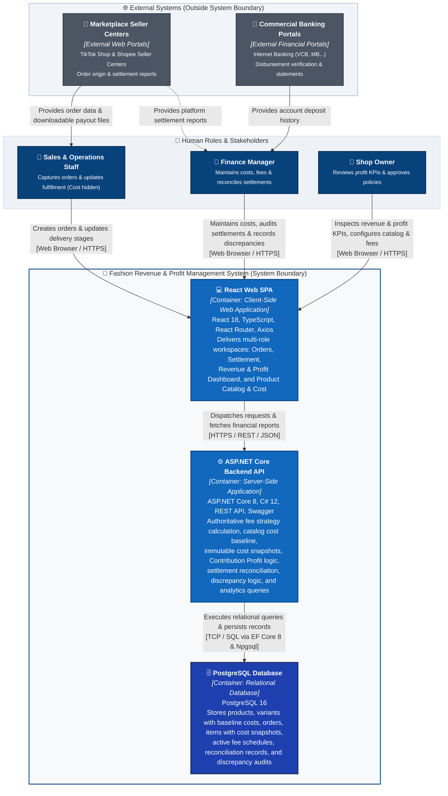

# C4 Container Specification: Fashion Revenue & Profit Management System

## 1. Target Container Scope (MVP Target)

### 1.1. Core MVP Containers
To satisfy the verified functional requirements of the MVP with minimum operational complexity, high cohesion, and low operational overhead, the target architecture establishes exactly **three deployable/executable containers**:

1. **React Web SPA:** Client-side Single Page Application serving the presentation and user interaction needs of all three human actors across Orders, Fees & Settlement, Revenue & Profit Dashboard, and Product Catalog & Cost.
2. **ASP.NET Core Backend API:** Server-side application exposing the RESTful HTTP API, enforcing canonical business workflows, managing catalog cost baselines, computing platform fees and Contribution Profit, and orchestrating transaction logic.
3. **PostgreSQL Database:** Relational database providing persistent, transactional, ACID-compliant storage for all operational, catalog, and financial records.

```
+-------------------------------------------------------------------------+
| Fashion Revenue & Profit Management System                              |
|                                                                         |
|   [React Web SPA]  --->  [ASP.NET Core Backend API]  --->  [PostgreSQL] |
|   (Presentation)         (Business Logic & Rules)          (Persistence)|
+-------------------------------------------------------------------------+
```

### 1.2. Architectural Exclusions (What is NOT a Container)
To maintain strict C4 modeling rigor, the following elements are explicitly defined as non-containers:

| Candidate Element | Current Codebase / Technology Reference | Reason for Exclusion from Container Status |
|---|---|---|
| **FashionWeb.Business** | `backend/src/FashionWeb.Business` (`net8.0` Class Library) | A .NET class library providing domain models and calculation logic. It compiles into a `.dll` linked directly into the Backend API; it cannot be deployed, scaled, or executed independently. Modeled in **P03: Component Diagram**. |
| **FashionWeb.Data** | `backend/src/FashionWeb.Data` (`net8.0` Class Library) | A .NET class library containing EF Core DbContext, entity configurations, and Npgsql mappings. Internal data access component loaded by the API container, not an independent runtime container. Modeled in **P03**. |
| **Swagger / OpenAPI** | `Swashbuckle.AspNetCore 6.5.0` (`UseSwagger()`, `UseSwaggerUI()`) | A contract and documentation capability hosted directly inside the ASP.NET Core Backend API process. An endpoint feature, not a standalone container. |
| **Vite** | `frontend/package.json` (`vite 5.4.2`) | Development and build tooling used to transpile and bundle TypeScript/React assets into static artifacts. At runtime, the browser executes the resulting bundle; Vite does not exist as a runtime container. |
| **Profit Microservice** | Excluded from MVP Scope | Contribution Profit calculation is an integral domain logic component within the monolithic Backend API. A separate profit microservice is not justified. |
| **Redis Cache** | Excluded from MVP Scope | Current read/write throughput requirements for MVP do not justify an in-memory caching layer. |
| **Message Queue / Broker** | RabbitMQ / Apache Kafka | The MVP workload is synchronous request-response. Asynchronous brokers are not justified by current requirements. |
| **Background Worker** | Scheduled Background Service | Marketplace ingestion is performed through user-assisted web workflows. Continuous background polling workers belong to future roadmap. |
| **API Gateway** | Reverse Proxy / Gateway | A single modular monolith Backend API serves the single frontend SPA. Adding an API gateway adds unnecessary network hops and latency. |

---

## 2. Container Catalog

| Container | Type | Technology | Primary Responsibilities | Data Ownership |
|---|---|---|---|---|
| **React Web SPA** | Client-Side Web Application | React 18, TypeScript, React Router 6, Axios *(Vite build tool)* | • Presents workspaces for Sales/Ops, Finance, and Shop Owner (Orders, Settlement, Dashboard, Catalog).<br>• Collects order details and displays fee previews calculated by the Backend API.<br>• Enforces role-based UI cost visibility (hides baseline costs from Sales & Ops).<br>• Renders settlement reconciliation workflows and discrepancy review drawers.<br>• Visualizes financial dashboards (Gross Revenue, Platform Fees, Net Revenue, COGS, Contribution Profit).<br>• Dispatches HTTP REST requests to the Backend API. | **Transient Presentation State Only.**<br>Does not own or persist authoritative business data. |
| **ASP.NET Core Backend API** | Server-Side Application | ASP.NET Core 8 (`net8.0`), C# 12, Microsoft.NET.Sdk.Web | • Exposes structured RESTful JSON endpoints.<br>• Manages product models, SKU variants, retail prices, and baseline unit costs (`cost_price`).<br>• Enforces role authorization boundaries (restricting cost data to Finance/Owner).<br>• Authoritatively computes platform fee deductions via Strategy logic.<br>• Snapshots immutable SKU baseline costs onto order line items at creation.<br>• Executes order state transitions (`Pending` $\rightarrow$ `Shipped` $\rightarrow$ `Delivered` / `Cancelled`).<br>• Computes canonical Contribution Profit (`Projected Settlement - COGS`) upon confirmed delivery.<br>• Manages settlement variance calculation and discrepancy audit workflows.<br>• Executes dynamic financial aggregation queries for analytics dashboards.<br>• Exposes interactive OpenAPI/Swagger contract. | **Authoritative Business Rules & Workflow State.**<br>Orchestrates data operations, but relies on PostgreSQL for physical persistence. |
| **PostgreSQL Database** | Relational Database Management System | PostgreSQL 16 *(Accessed via EF Core 8 & Npgsql provider)* | • Guarantees ACID transactional integrity for all enterprise operations.<br>• Stores relational schemas: products, product variants, orders, order items, fee schedules, settlement reconciliations, discrepancy records.<br>• Enforces referential integrity, foreign key constraints, and unique indices.<br>• Stores immutable unit price and unit cost snapshots on historical order items.<br>• Serves indexed queries for revenue and Contribution Profit analytics. | **Authoritative Transactional Source of Truth.**<br>Owns all persistent business, catalog, and financial records. |

---

## 3. Target Container Diagram



---

## 4. Container Responsibilities & Boundaries

### 4.1. Container 1: React Web SPA
- **What It Does:**
  - Renders user interfaces tailored to Sales & Operations Staff, Finance Manager, and Shop Owner.
  - Manages client-side routing across 4 main screens (`Orders`, `Settlement`, `Dashboard`, `Catalog`).
  - Enforces role-sensitive cost hiding (omits baseline unit costs from Sales & Ops).
  - Requests and displays fee previews calculated by the Backend API for immediate operator feedback.
  - Displays settlement audit discrepancy drawers and status badges (`Pending Settlement`, `Reconciled`, `Discrepancy`).
  - Renders financial KPI cards (Gross Revenue, Platform Fees, Net Revenue, COGS, Contribution Profit).
  - Communicates asynchronously with the Backend API via standardized HTTP REST calls.
- **What It MUST NOT Do:**
  - **No Direct Database Access:** Under no circumstance may the SPA establish a direct connection to PostgreSQL.
  - **No Canonical Business Rule Ownership:** The SPA must not be the authoritative decision-maker for financial calculations. Canonical commission deductions, COGS, Contribution Profit, and revenue recognition must be validated and determined by the Backend API.
  - **No Persistent State Storage:** Client-side local storage or memory state must not serve as the canonical source of truth for business transactions.

### 4.2. Container 2: ASP.NET Core Backend API
- **What It Does:**
  - Exposes RESTful API endpoints documented via OpenAPI/Swagger specifications.
  - Manages product catalog entities, SKU variants, retail prices, and baseline unit costs (`cost_price`).
  - Enforces role authorization boundaries (restricting cost data to Finance/Owner).
  - Validates request payloads (e.g., verifying line items exist and discounts do not exceed subtotal).
  - Snapshots immutable SKU baseline costs onto order line items at creation.
  - Enforces domain state machine lifecycles (`Pending` $\rightarrow$ `Shipped` $\rightarrow$ `Delivered` / `Cancelled`) and official revenue/profit recognition on `Delivered`.
  - Authoritatively calculates platform fee deductions using the Strategy pattern based on active fee schedules.
  - Computes canonical Contribution Profit (`Projected Settlement - COGS`) upon confirmed delivery.
  - Calculates settlement variances (`variance_amount = projected_settlement - actual_settlement`) and maintains discrepancy audit trails.
  - Executes dynamic aggregation queries for revenue and profit KPIs across filtered dates and channels.
  - Manages database transactions, connection lifetimes, and entity mapping via Entity Framework Core.
- **What It MUST NOT Do:**
  - **No Presentation Logic:** The API must not generate HTML, render UI views, or maintain browser layout logic.
  - **No Delegated Business Calculation:** The API must never trust client-computed totals for persistence; it must independently recalculate all financial values from canonical rates and frozen cost snapshots.
  - **No Direct External API Coupling (in MVP):** The API must not maintain synchronous blocking dependencies on external marketplace APIs that are outside the MVP scope.

### 4.3. Container 3: PostgreSQL Database
- **What It Does:**
  - Stores relational transactional tables: `products`, `product_variants`, `orders`, `order_items`, `fee_schedules`, `reconciliation_records`, `discrepancy_audits`.
  - Enforces schema integrity, data types, foreign keys, unique indexes, and audit timestamps.
  - Stores immutable unit price and unit cost snapshots on historical order items.
  - Executes ACID-compliant transactions to guarantee that order items, fee snapshots, cost snapshots, and audit logs are committed atomically.
  - Optimizes retrieval of historical orders and aggregated financial sums via indexed database queries.
- **What It MUST NOT Do:**
  - **No Presentation or View Formatting:** The database does not format currency strings, UI date labels, or layout structures.
  - **No Workflow Orchestration:** Complex domain state machines and business strategy selections belong to the application code in the Backend API, not in database triggers or stored procedures.

---

## 5. Container Communication Protocols

| Source | Destination | Protocol / Mechanism | Payload / Data Transferred | Architectural Purpose | Direction |
|---|---|---|---|---|:---:|
| **Human Actors** | **React Web SPA** | HTTPS / Web Browser | Mouse/keyboard events, form entries, page navigation, DOM rendering | Operator user interface interaction | Bidirectional |
| **React Web SPA** | **ASP.NET Core Backend API** | HTTPS / REST / JSON | JSON request payloads (Catalog edits, order entries, status updates, actual settlement amounts, date/channel filter parameters) and JSON responses (KPI metrics, order lists, fee breakdowns, profit summaries) | Client-to-server application API interaction | Bidirectional |
| **ASP.NET Core Backend API** | **PostgreSQL Database** | TCP / PostgreSQL Wire Protocol | SQL queries, parameterized statements, transactional commands via Entity Framework Core 8 and Npgsql driver | Relational persistence, transactional commits, and analytical queries | Bidirectional |
| **Marketplace Seller Centers** | **Sales & Operations Staff** | Web Browser / HTTPS | Visual order inspection, downloadable CSV/Excel settlement statements | Operational data capture into system | Inbound to Operator |
| **Commercial Banking Portals** | **Finance Manager** | Web Browser / HTTPS | Account balance views, credit transaction histories, bank statements | Independent financial verification of actual wallet deposits | Inbound to Operator |

> [!IMPORTANT]
> **Architectural Invariant:**  
> The system enforces a strict three-tier communication hierarchy:  
> **Actor $\rightarrow$ React Web SPA $\rightarrow$ ASP.NET Core Backend API $\rightarrow$ PostgreSQL Database.**  
> Neither actors nor the frontend SPA are permitted to communicate directly with PostgreSQL.

---

## 6. Traceability Matrix

| P01 System Context Element | Mapped P02 Container(s) | Architectural Realization in Container Architecture |
|---|---|---|
| **Sales & Operations Staff** | **React Web SPA** | Interacts with Order Management views, order creation modals (cost hidden), and lifecycle transition controls. |
| **Finance Manager** | **React Web SPA** | Interacts with Product Catalog & Cost management, Fee Breakdown tables, Settlement Reconciliation interfaces, discrepancy notes, and CSV export. |
| **Shop Owner** | **React Web SPA** | Interacts with Product Catalog & Cost, 5 Financial KPI cards, channel profit charts, top SKU leaderboards, and audit drilldowns. |
| **Fashion Revenue & Profit Management System** | **React Web SPA**<br>**ASP.NET Core Backend API**<br>**PostgreSQL Database** | Decomposed into the three core containers: presentation tier, business/orchestration tier, and persistence tier. |
| **Product Catalog & Cost Baseline Capability** | **ASP.NET Core Backend API**<br>*(Persisted in PostgreSQL)* | Handled via API catalog management and role authorization, committed to `products` and `product_variants` tables. |
| **Order Management Capability** | **ASP.NET Core Backend API**<br>*(Persisted in PostgreSQL)* | Handled via API order validation and lifecycle state progression, committed to `orders` and `order_items` tables. |
| **Fee Calculation & Strategy Capability** | **ASP.NET Core Backend API**<br>*(Persisted in PostgreSQL)* | Handled via API fee strategy calculation engine, referencing `fee_schedules` and freezing values upon delivery. |
| **Cost & Contribution Profit Capability** | **ASP.NET Core Backend API**<br>*(Persisted in PostgreSQL)* | Handled via API freezing `unit_cost_snapshot` at order creation and calculating `Contribution Profit = Projected Settlement - COGS` upon delivery. |
| **Settlement & Reconciliation Capability** | **ASP.NET Core Backend API**<br>*(Persisted in PostgreSQL)* | Handled via API reconciliation logic comparing projected amounts against actual deposits in `reconciliation_records`. |
| **Discrepancy Tracking Capability** | **ASP.NET Core Backend API**<br>*(Persisted in PostgreSQL)* | Handled via API discrepancy recording and status updates, stored in `discrepancy_audits`. |
| **Revenue & Profit Analytics Capability** | **ASP.NET Core Backend API**<br>*(Rendered in React SPA)* | Computed via dynamic aggregation queries in the Backend API and visualized in the React SPA. |
| **Marketplace Seller Centers** | *External System (P01)* | Remains outside container boundary. Operators access seller center web portals and enter data into React Web SPA. |
| **Commercial Banking Portals** | *External System (P01)* | Remains outside container boundary. Finance Manager accesses internet banking portals and inputs actual settlement into React Web SPA. |
