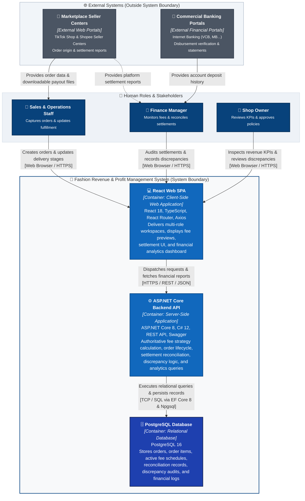

# C4 Container Specification: Fashion Revenue & Profit Management System

## 1. Target Container Scope (MVP Target)

### 1.1. Core MVP Containers
To satisfy the verified functional requirements of the MVP with minimum operational complexity, high cohesion, and low operational overhead, the target architecture establishes exactly **three deployable/executable containers**:

1. **React Web SPA:** Client-side Single Page Application serving the presentation and user interaction needs of all three human actors.
2. **ASP.NET Core Backend API:** Server-side application exposing the RESTful HTTP API, enforcing canonical business workflows, and orchestrating transaction logic.
3. **PostgreSQL Database:** Relational database providing persistent, transactional, ACID-compliant storage for all operational and financial records.

```
+-------------------------------------------------------------------------+
| Fashion Revenue & Profit Management System                              |
|                                                                         |
|   [React Web SPA]  --->  [ASP.NET Core Backend API]  --->  [PostgreSQL] |
|   (Presentation)         (Business Logic & Rules)          (Persistence)|
+-------------------------------------------------------------------------+
```

### 1.2. Architectural Exclusions (What is NOT a Container)
To maintain strict C4 modeling rigor, the following elements are explicitly defined as non-containers:

| Candidate Element | Current Codebase / Technology Reference | Reason for Exclusion from Container Status |
|---|---|---|
| **FashionWeb.Business** | `backend/src/FashionWeb.Business` (`net8.0` Class Library) | A .NET class library providing domain models and calculation logic. It compiles into a `.dll` linked directly into the Backend API; it cannot be deployed, scaled, or executed independently. It will be modeled in **P03: Component Diagram**. |
| **FashionWeb.Data** | `backend/src/FashionWeb.Data` (`net8.0` Class Library) | A .NET class library containing EF Core DbContext, entity configurations, and Npgsql mappings. It compiles into a `.dll` loaded by the API container; it is an internal data access component, not an independent runtime container. (Modeled in **P03**). |
| **Swagger / OpenAPI** | `Swashbuckle.AspNetCore 6.5.0` (`UseSwagger()`, `UseSwaggerUI()`) | A contract and interactive documentation capability hosted directly inside the ASP.NET Core Backend API process. It is an endpoint feature, not a standalone container. |
| **Vite** | `frontend/package.json` (`vite 5.4.2`) | Development and build tooling used to transpile and bundle TypeScript/React assets into static artifacts. At runtime, the browser executes the resulting JavaScript bundle; Vite does not exist as a runtime container. |
| **Docker / Containers Engine** | OCI Container Images | Docker is a packaging and runtime virtualization technology. In C4 terminology, a "Container" refers to a deployable software unit (an executable or data store), not an OS-level Docker container. |
| **FashionWeb.Business.Tests** | `backend/tests/FashionWeb.Business.Tests` | Automated unit/integration test project. Does not execute as a runtime production container. |
| **Redis Cache** | Excluded from MVP Scope | Current read/write throughput requirements for MVP do not justify an in-memory caching layer. Introducing Redis prematurely introduces cache invalidation complexity without verified NFR demand. |
| **Message Queue / Broker** | RabbitMQ / Apache Kafka | The MVP workload is synchronous request-response. Introducing distributed asynchronous message brokers is not justified by current requirements. |
| **Background Worker** | Scheduled Background Service | MVP marketplace ingestion is performed through user-assisted web workflows. Continuous automated background polling workers belong to the future roadmap. |
| **API Gateway** | Reverse Proxy / Gateway | A single modular monolith Backend API serves the single frontend SPA. Adding an API gateway adds unnecessary network hops and operational latency. |

---

## 2. Container Catalog

The following catalog defines each target container, its runtime type, technology foundation, core responsibilities, and data ownership:

| Container | Type | Technology | Primary Responsibilities | Data Ownership |
|---|---|---|---|---|
| **React Web SPA** | Client-Side Web Application | React 18, TypeScript, React Router 6, Axios *(Vite build tool)* | • Presents intuitive workspaces for Sales/Ops, Finance, and Shop Owner.<br>• Collects order details and requests and displays fee previews calculated by the Backend API.<br>• Renders settlement reconciliation workflows and discrepancy review drawers.<br>• Visualizes financial dashboards, channel share distributions, and top SKU charts.<br>• Dispatches HTTP REST requests to the Backend API. | **Transient Presentation State Only.**<br>Does not own or persist authoritative business data. |
| **ASP.NET Core Backend API** | Server-Side Application | ASP.NET Core 8 (`net8.0`), C# 12, Microsoft.NET.Sdk.Web | • Exposes structured RESTful JSON endpoints.<br>• Validates request payloads and enforces authorization boundaries.<br>• Authoritatively computes platform fee deductions via Strategy logic.<br>• Executes order state transitions (`Pending` $\rightarrow$ `Shipped` $\rightarrow$ `Delivered` / `Cancelled`).<br>• Enforces official revenue recognition upon verified delivery.<br>• Manages settlement variance calculation and discrepancy audit workflows.<br>• Executes dynamic financial aggregation queries for analytics dashboards.<br>• Exposes interactive OpenAPI/Swagger contract. | **Authoritative Business Rules & Workflow State.**<br>Orchestrates data operations, but relies on PostgreSQL for physical persistence. |
| **PostgreSQL Database** | Relational Database Management System | PostgreSQL 16 *(Accessed via EF Core 8 & Npgsql provider)* | • Guarantees ACID transactional integrity for all enterprise operations.<br>• Stores relational schemas: orders, order items, fee schedules, settlement reconciliations, discrepancy records.<br>• Enforces referential integrity, foreign key constraints, and unique indices.<br>• Serves indexed queries for financial analytics, channel distributions, and drilldowns. | **Authoritative Transactional Source of Truth.**<br>Owns all persistent business and financial records. |

---

## 3. Target Container Diagram

The diagram below represents the **Target Container Architecture** for the MVP. All user roles access the system strictly via the React Web SPA. In turn, the SPA communicates exclusively with the Backend API, which orchestrates persistence with the PostgreSQL Database. External systems operate via the user workflows defined in P01.



---

## 4. Container Responsibilities & Boundaries

To preserve clean separation of concerns, each container is governed by explicit operational boundaries defining what it **owns** and what it **must not do**.

### 4.1. Container 1: React Web SPA
- **What It Does:**
  - Renders user interfaces tailored to Sales & Operations Staff, Finance Manager, and Shop Owner.
  - Manages client-side routing, user input capture, form validation, and reactive view state.
  - Requests and displays fee previews calculated by the Backend API for immediate operator feedback during order creation.
  - Displays settlement audit discrepancy drawers and status badges (`Pending Review`, `Reviewed`).
  - Renders executive KPI summary cards, channel distribution pie charts, and top SKU performance bar charts.
  - Communicates asynchronously with the Backend API via standardized HTTP REST calls.
- **What It MUST NOT Do:**
  - **No Direct Database Access:** Under no circumstance may the SPA establish a direct connection to PostgreSQL.
  - **No Canonical Business Rule Ownership:** The SPA must not be the authoritative decision-maker for financial calculations. Canonical commission deductions, net revenue amounts, and revenue recognition must be validated and determined by the Backend API.
  - **No Persistent State Storage:** Client-side local storage or memory state must not serve as the canonical source of truth for business transactions.

### 4.2. Container 2: ASP.NET Core Backend API
- **What It Does:**
  - Exposes RESTful API endpoints documented via OpenAPI/Swagger specifications.
  - Validates request payloads (e.g., verifying that line items exist and discounts do not exceed item totals).
  - Enforces domain state machine lifecycles (`Pending` $\rightarrow$ `Shipped` $\rightarrow$ `Delivered` / `Cancelled`) and official revenue recognition on `Delivered`.
  - Authoritatively calculates platform fee deductions using the Strategy pattern based on active fee schedules.
  - Calculates settlement variances (`variance_amount = projected_settlement - actual_settlement`) and maintains discrepancy audit trails.
  - Executes dynamic aggregation queries for executive financial KPIs across filtered dates and channels.
  - Manages database transactions, connection lifetimes, and entity mapping via Entity Framework Core.
- **What It MUST NOT Do:**
  - **No Presentation Logic:** The API must not generate HTML, render UI views, or maintain browser layout logic.
  - **No Delegated Business Calculation:** The API must never trust client-computed totals for persistence; it must independently recalculate all financial values from canonical rates.
  - **No Direct External API Coupling (in MVP):** The API must not maintain synchronous blocking dependencies on external marketplace APIs that are outside the MVP scope.

### 4.3. Container 3: PostgreSQL Database
- **What It Does:**
  - Stores relational transactional tables: `Orders`, `OrderItems`, `FeeSchedules`, `ReconciliationRecords`, `DiscrepancyAudits`.
  - Enforces schema integrity, data types, foreign keys, unique indexes, and audit timestamps.
  - Executes ACID-compliant transactions to guarantee that order items, fee calculations, and audit logs are committed atomically.
  - Optimizes retrieval of historical orders and aggregated financial sums via indexed database queries.
- **What It MUST NOT Do:**
  - **No Presentation or View Formatting:** The database does not format currency strings, UI date labels, or layout structures.
  - **No Workflow Orchestration:** Complex domain state machines and business strategy selections belong to the application code in the Backend API, not in database triggers or stored procedures.

---

## 5. Container Communication Protocols

The table below catalogs all runtime communication paths between containers and actors within the MVP architecture:

| Source | Destination | Protocol / Mechanism | Payload / Data Transferred | Architectural Purpose | Direction |
|---|---|---|---|---|:---:|
| **Human Actors** | **React Web SPA** | HTTPS / Web Browser | Mouse/keyboard events, form entries, page navigation, DOM rendering | Operator user interface interaction | Bidirectional |
| **React Web SPA** | **ASP.NET Core Backend API** | HTTPS / REST / JSON | JSON request payloads (Order entries, status updates, actual settlement amounts, date/channel filter parameters) and JSON responses (KPI metrics, order lists, fee breakdowns) | Client-to-server application API interaction | Bidirectional |
| **ASP.NET Core Backend API** | **PostgreSQL Database** | TCP / PostgreSQL Wire Protocol | SQL queries, parameterized statements, transactional commands via Entity Framework Core 8 and Npgsql driver | Relational persistence, transactional commits, and analytical queries | Bidirectional |
| **Marketplace Seller Centers** | **Sales & Operations Staff** | Web Browser / HTTPS | Visual order inspection, downloadable CSV/Excel settlement statements | Operational data capture into system | Inbound to Operator |
| **Commercial Banking Portals** | **Finance Manager** | Web Browser / HTTPS | Account balance views, credit transaction histories, bank statements | Independent financial verification of actual wallet deposits | Inbound to Operator |

> [!IMPORTANT]
> **Architectural Invariant:**  
> The system enforces a strict three-tier communication hierarchy:  
> **Actor $\rightarrow$ React Web SPA $\rightarrow$ ASP.NET Core Backend API $\rightarrow$ PostgreSQL Database.**  
> Neither actors nor the frontend SPA are permitted to communicate directly with PostgreSQL.

---

## 6. Current Implementation Status

This section evaluates the active state of the repository codebase against the target container architecture.

### 6.1. Container Implementation Reality

| Container | Architectural Target | Active Repository Implementation State | Status |
|---|---|---|:---:|
| **React Web SPA** | Decoupled client-side SPA interacting with Backend API via Axios | • Single Page Application fully operational using React 18, TypeScript, and Vite.<br>• UI screens exist for Order Management, Settlement, and Revenue Dashboard.<br>• React Router 6 and Axios are installed and configured.<br>• *Current Gap:* Component views currently utilize local mock/seed state for certain operations rather than dispatching all requests to Backend API endpoints. | **Partial** |
| **ASP.NET Core Backend API** | Centralized REST API orchestrating business rules and database persistence | • Web API project exists (`FashionWeb.Api`, `net8.0`, `Microsoft.NET.Sdk.Web`).<br>• Controllers exist (`OrdersController`, `SettlementController`, `DashboardController`).<br>• Swagger/OpenAPI configured (`AddSwaggerGen()`, `UseSwagger()`, `UseSwaggerUI()`).<br>• Dependency Injection, CORS, and Class Library project references are established.<br>• *Current Gap:* Several service methods currently return prototype/hardcoded responses rather than fully executing database persistence. | **Partial** |
| **PostgreSQL Database** | Relational transactional database storing canonical operational and financial data | • Data access project exists (`FashionWeb.Data`) referencing `Npgsql.EntityFrameworkCore.PostgreSQL 8.0.0`.<br>• `AppDbContext` is defined with DbSets (`Orders`, `OrderItems`, `FeeSchedules`, `ReconciliationRecords`, `DiscrepancyAudits`).<br>• PostgreSQL connection string and `UseNpgsql(...)` registration configured in `Program.cs`.<br>• *Current Gap:* Database migrations and end-to-end relational data persistence are partially utilized across active runtime workflows. | **Partial** |

### 6.2. Inter-Container Relationship Reality

| Relationship Path | Target Protocol | Active Implementation Status | Current Technical Reality |
|---|---|:---:|---|
| **Actor $\rightarrow$ React Web SPA** | Web Browser / HTTPS | **Implemented** | All three user roles operate smoothly within the responsive web interface across desktop browsers. |
| **React Web SPA $\rightarrow$ Backend API** | HTTPS / REST / JSON | **Partial** | Axios HTTP client is installed and basic API endpoints exist, but frontend state transitions are partially handled in-memory pending end-to-end integration. |
| **Backend API $\rightarrow$ PostgreSQL** | EF Core 8 / Npgsql / SQL | **Partial** | Infrastructure (DbContext, DbSets, connection configuration) is established, but end-to-end CRUD persistence is not yet invoked by every controller action. |

---

## 7. Target vs. Current Gap Analysis

| Gap Identifier | Architecture Domain | Target State (MVP Container Architecture) | Current Codebase State (AS-IS) | Architectural Gap Resolution Path |
|---|---|---|---|---|
| **GAP-CONT-01** | Frontend-to-API Integration | React Web SPA functions strictly as a presentation layer, obtaining all data and state changes from Backend API. | Frontend uses local component state and demonstration seeds for certain order listings and metrics. | Complete Axios service integration across all frontend views, routing all user actions to Backend API endpoints. |
| **GAP-CONT-02** | Backend API Completeness | Backend API authoritatively enforces all business logic, order state validation, and fee strategy calculations. | Several API controller endpoints return preliminary mock responses or prototype calculations. | Implement full business validation, order lifecycle transitions, and Strategy pattern calculations within the service layer. |
| **GAP-CONT-03** | Database Persistence Continuity | Every business event (order creation, status update, settlement audit, discrepancy entry) commits to PostgreSQL. | Data access layer has defined entities and DbSets, but not all use cases persist their data to the database. | Execute database migrations and wire repository/DbContext calls through all API service methods. |
| **GAP-CONT-04** | Analytics Dynamic Querying | Dashboard KPIs, channel share distributions, and SKU leaderboards are dynamically aggregated from PostgreSQL. | Dashboard analytics rely partially on preset demonstration arrays combined with runtime memory states. | Write optimized EF Core / LINQ dynamic aggregation queries to compute metrics directly from persisted database records. |
| **GAP-CONT-05** | Fee Policy Authority | Backend API is the authoritative source of fee rules and frozen fee amounts upon confirmed delivery. | Preset fee formulas are maintained in frontend state alongside backend configuration. | Centralize all fee schedule management and calculation inside the backend Strategy engine. |

> [!NOTE]
> Resolving these implementation gaps is the focus of subsequent implementation plans and sprint tasks. These gaps reflect current development progress and do not alter the target container architecture defined in this document.

---

## 8. Architectural Decisions (ADR Summary)

The container architecture is governed by six foundational architectural decisions:

### ADR-01: Decoupling of Presentation (SPA) from Business Logic (API)
- **Decision:** Split the presentation tier and business logic into two independent containers: React Web SPA and ASP.NET Core Backend API.
- **Rationale:** Enables rapid iteration of responsive UI workflows without redeploying backend business rules. Allows the backend to serve as a reusable, headless REST API for future automated connectors.

### ADR-02: PostgreSQL as the Single Persistent Transactional Source of Truth
- **Decision:** Adopt PostgreSQL as the authoritative relational database for all transactional records.
- **Rationale:** Financial management demands strict ACID compliance, relational foreign key constraints, and robust aggregation capabilities. PostgreSQL provides mature, enterprise-grade data integrity via EF Core and Npgsql.

### ADR-03: Strict Tiered Invariant (SPA $\rightarrow$ API $\rightarrow$ Database)
- **Decision:** Enforce an uncompromised three-tier communication hierarchy where the React SPA communicates solely with the Backend API, and only the Backend API communicates with PostgreSQL.
- **Rationale:** Prevents security vulnerabilities, avoids exposing database connection credentials to the browser, and ensures all financial transactions pass through business validation rules.

### ADR-04: Class Library Modularization Instead of Multi-Container Decomposition
- **Decision:** Package `FashionWeb.Business` and `FashionWeb.Data` as internal .NET class libraries compiled directly into the Backend API process, rather than deploying them as separate microservices.
- **Rationale:** The MVP transaction volume does not warrant distributed microservice overhead (network latency, distributed transactions, independent CI/CD pipelines). A modular monolith achieves high separation of concerns with minimal operational cost.

### ADR-05: Manual Portal Workflow Accepted for MVP (APIs Deferred to Roadmap)
- **Decision:** External marketplace seller centers and commercial banking portals interact with the system via human user workflows; automated direct API webhooks are deferred to the Future Roadmap.
- **Rationale:** Securing production developer licenses and webhook certification from TikTok Shop, Shopee, and commercial banks requires extensive compliance lead time. The manual portal workflow delivers immediate business value for MVP.

### ADR-06: Provider / Adapter Extensibility for Future Direct Integrations
- **Decision:** Structure the Backend API internal architecture to accommodate future external API connectors via adapter interfaces without refactoring core domain entities.
- **Rationale:** Prepares the system for seamless transition from manual CSV/entry ingestion to direct automated API streaming (e.g., TikTok Open API, Shopee Open Platform API) in future phases.

---

## 9. Traceability Matrix

The table below demonstrates 100% traceability from the Level 1 System Context defined in [c4-context_en.md](c4-context_en.md) to the Level 2 Containers defined in this specification:

| P01 System Context Element | Mapped P02 Container(s) | Architectural Realization in Container Architecture |
|---|---|---|
| **Sales & Operations Staff** | **React Web SPA** | Interacts with Order Management views, order creation modals, and lifecycle transition controls. |
| **Finance Manager** | **React Web SPA** | Interacts with Fee Breakdown tables, Settlement Reconciliation interfaces, discrepancy notes, and CSV export. |
| **Shop Owner** | **React Web SPA** | Interacts with Top 3 KPI cards, channel revenue distribution charts, top SKU leaderboards, and audit drilldowns. |
| **Fashion Revenue & Profit Management System** *(Core System Boundary)* | **React Web SPA**<br>**ASP.NET Core Backend API**<br>**PostgreSQL Database** | Decomposed into the three core containers: presentation tier, business/orchestration tier, and persistence tier. |
| **Order Management Capability** | **ASP.NET Core Backend API**<br>*(Persisted in PostgreSQL)* | Handled via API order validation and lifecycle state progression, committed to `Orders` and `OrderItems` tables. |
| **Fee Calculation & Strategy Capability** | **ASP.NET Core Backend API**<br>*(Persisted in PostgreSQL)* | Handled via API fee strategy calculation engine, referencing `FeeSchedules` and freezing values upon delivery. |
| **Settlement & Reconciliation Capability** | **ASP.NET Core Backend API**<br>*(Persisted in PostgreSQL)* | Handled via API reconciliation logic comparing projected amounts against actual deposits in `ReconciliationRecords`. |
| **Discrepancy Tracking Capability** | **ASP.NET Core Backend API**<br>*(Persisted in PostgreSQL)* | Handled via API discrepancy recording and status updates, stored in `DiscrepancyAudits`. |
| **Revenue & Financial Analytics Capability** | **ASP.NET Core Backend API**<br>*(Rendered in React SPA)* | Computed via dynamic aggregation queries in the Backend API and visualized in the React SPA. |
| **Marketplace Seller Centers** | *External System (P01)* | Remains outside container boundary. Operators access seller center web portals and enter data into React Web SPA. |
| **Commercial Banking Portals** | *External System (P01)* | Remains outside container boundary. Finance Manager accesses internet banking portals and inputs actual settlement into React Web SPA. |

---

