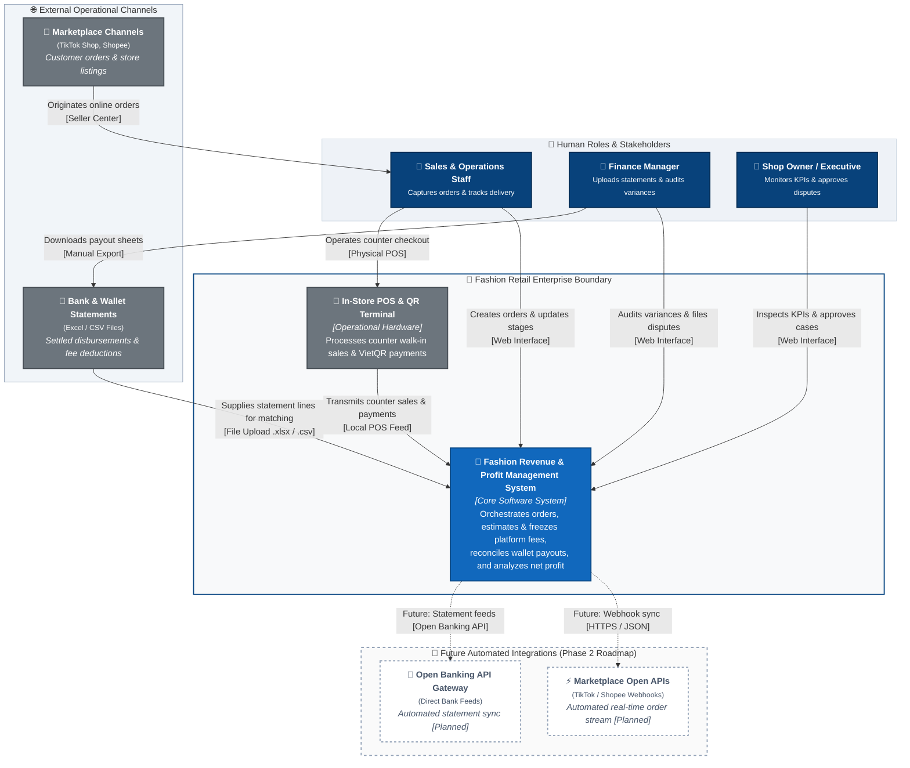

# C4 Context Diagram: Fashion Revenue & Profit Management System

---

## 1. System Name & Purpose

### 1.1. System Name
The official, standardized name of the system used consistently across all architectural diagrams, specifications, and documentation is:

**Fashion Revenue & Profit Management System**  
*(Vietnamese: Hệ Thống Quản Lý Doanh Thu & Lợi Nhuận Bán Hàng Đa Kênh Thời Trang)*

### 1.2. Purpose of the System
The **Fashion Revenue & Profit Management System** exists to resolve the critical "Paper Profit, Negative Cash Flow" problem faced by modern multi-channel fashion retail merchants. The system automates the ingestion and lifecycle tracking of multi-channel orders (TikTok Shop, Shopee, and In-Store POS), systematically unbundles complex marketplace fee deductions (commissions, payment gateway charges, service fees), automates settlement reconciliation against actual bank and platform wallet payout statements, resolves deduction variances through audit trails, and delivers real-time executive analytics on true net revenue and profitability.

---

## 2. Scope of the System

### 2.1. In-Scope Capabilities (P01)
The system boundary encompasses the following core operational capabilities:

1. **Multi-Channel Order Management:** Ingestion of customer orders across TikTok Shop, Shopee, and In-Store POS, tracking order lifecycle states (`Pending`, `Shipped`, `Delivered`, `Cancelled`), and enforcing strict revenue recognition upon verified delivery.
2. **Platform Fee Calculation & Policy Configuration:** Automated itemized estimation of sales channel fees (marketplace commission, payment processing, shipping subsidies/caps, fixed fees) and maintenance of active fee schedules.
3. **Wallet Settlement & Statement Reconciliation:** Automated two-way matching between delivered internal orders and uploaded bank/marketplace payout statements (`.xlsx`, `.csv`), mathematical variance isolation, and settlement ledger locking.
4. **Discrepancy Auditing & Dispute Governance (#DIS-002):** Structured filing of justification claims for platform over-deductions (e.g., carrier weight/dimension surcharge penalties) with documentary evidence, governed by role-based executive approval workflows.
5. **Revenue & Profit Analytics:** Consolidated executive KPI reporting (Gross Sales, Platform Fee Deductions, Net Realized Revenue, Delivered Order Counts), daily cash flow trend visualization, sales channel revenue distribution, best-performing SKU rankings, and itemized source order audit drilldowns.

### 2.2. Out-of-Scope (Deliberate System Exclusions)
To maintain an explicit, uncompromised system boundary, the following domains are strictly outside the system's ownership and responsibility:

- **Human Resource Management (HR) & Payroll:** Staff attendance, shift scheduling, and wage processing.
- **Customer Relationship Management (CRM) & Loyalty:** Direct consumer marketing campaigns, loyalty points, and post-sale messaging.
- **Full-Scale Warehouse Management (WMS):** Multi-warehouse bin/aisle tracking, wave picking, and automated inventory reordering.
- **Logistics Fleet Operations:** Fleet dispatch, delivery driver routing, and vehicle telematics.
- **Marketplace Seller Account Management:** Direct management of marketplace seller shop profiles, buyer customer support chat, and ad campaign bidding within TikTok/Shopee seller centers.
- **Manufacturing & Bill of Materials (BOM):** Raw material sourcing, garment manufacturing processes, and factory vendor procurement.

---

## 3. Human Actors & Responsibilities

All actors are strictly derived from verified project requirements (`requirements_invest.md`, `usecase.md`, and the RBAC security policy). No ad-hoc or unverified roles are introduced.

| Actor Name | Aliases in Repository | Business Goal | Main System Interactions & Boundaries |
|---|---|---|---|
| **Sales & Operations Staff** | `Sales / Ops`, `Store Clerk`, `Order Operator` | Accurately capture multi-channel orders, record order progress, and ensure timely fulfillment handover. | • Ingests orders from live streams, hotlines, and walk-in counter sales. • Previews estimated platform fee deductions before order submission. • Updates fulfillment delivery milestones (`Pending` $\rightarrow$ `Shipped` $\rightarrow$ `Delivered`). • Records customer cancellations before carrier dispatch. • *Restricted:* Cannot view wallet payouts, perform reconciliation, or approve financial variances. |
| **Finance Manager** | `Accountant`, `Finance Staff`, `Financial Auditor` | Verify wallet cash receipts against internal books, recover shortfall losses, and maintain tax-compliant records. | • Uploads external bank and marketplace payout statements (`.xlsx`, `.csv`). • Executes automated two-way statement reconciliation. • Investigates payment discrepancies and files `#DIS-002` audit justification cases. • Attaches documentary proof (carrier scale slips, packaging photos) for review. • Exports standardized CSV ledger files for corporate accounting and tax filing. • *Restricted:* Cannot approve own discrepancy claims; cannot input orders. |
| **Shop Owner / Executive** | `Business Owner`, `Store Owner`, `Managing Director` | Maximize take-home profit, prevent platform fee leakage, and ensure cash flow solvency. | • Evaluates top-level financial KPI cards and net cash flow trends. • Configures marketplace commission rates and operational fee schedules. • Reviews and signs off on discrepancy audit cases (`Approve` to accept variance as expense / `Reject` to remand for carrier claim). • Inspects underlying itemized source orders via audit drilldown views. |

---

## 4. Candidate External Systems (AS-IS vs. Planned)

The table below catalogs all external software and hardware systems interacting across the system boundary, categorized by their current implementation state (`Implemented`, `Manual / Operational`, `Planned`):

| External System | Interaction Classification | Data Exchanged | Current AS-IS Status | Architectural Justification |
|---|---|---|:---:|---|
| **In-Store POS & QR Terminal** | Point-of-Sale Hardware / Payment Provider | In-Store Sales Orders, Cash / Card Swipe Records, VietQR Payment Slips | **Implemented (Operational)** | Physical hardware located at retail counters. Transactions are immediately confirmed upon customer take-home. |
| **Marketplace & Bank Statement Files** | External Data Providers (TikTok, Shopee, VCB, MB) | Payout Statements (`.xlsx`, `.csv`), Order SNs, Settled Payout Amounts, Platform Surcharges | **Implemented (Manual Ingestion)** | Periodic settlement files exported manually by Finance from seller portals and uploaded into the system for batch matching. |
| **Marketplace Seller Centers (TikTok Shop, Shopee)** | E-Commerce Sales Channels | Customer Orders, Retail Prices, Voucher Subsidies, Delivery Tracking Numbers | **Operational (Manual / Batch)** | External sales platforms where shoppers place orders. Order data is captured into the system via manual order entry or exported spreadsheets. |
| **TikTok Shop Open API Webhooks** | Automated Platform Webhooks | Real-Time Order Feeds, Instant Fulfillment Status Sync, Live Return Notifications | **Planned (Future Scope)** | Direct bidirectional HTTP webhook integration to be enabled in Phase 2 once formal marketplace partner licenses are secured. |
| **Shopee Open Platform API** | Automated Platform Webhooks | Real-Time Marketplace Orders, Dynamic Shipping Fee Adjustments, Automated Settlement Feeds | **Planned (Future Scope)** | Direct open API connection planned for future release; not required for AS-IS core operation. |
| **Open Banking Core API** | Commercial Banking Gateway | Automated Direct Bank Feeds, Real-Time Deposit Notifications, Bank Statement Pulls | **Planned (Future Scope)** | Commercial bank direct host-to-host connectivity planned for enterprise scale. |

---

## 5. Current AS-IS Limitations & Assumptions

To maintain complete architectural integrity between documentation and working software, the following operating assumptions and limitations are explicitly recognized for the AS-IS baseline:

1. **No Live Marketplace Webhooks (Phase 1 Baseline):** The system does not depend on live developer app credentials from TikTok Shop Partner or Shopee Open Platform. Orders placed on online channels are ingested through operators using the system's order interface or bulk upload.
2. **Semi-Automated Statement Ingestion:** Payout statements from marketplaces and commercial banks are imported via user-uploaded `.xlsx` and `.csv` files rather than autonomous, scheduled background API pulls.
3. **Offline POS Independence:** Counter sales operate without proprietary POS vendor lock-in; counter operators record orders directly into the system with instant payment clearance.
4. **Fee Strategy Grounding:** Marketplace commission and service fee rates are configured inside the system's fee schedule repository, reflecting announced marketplace policies rather than dynamic rate query APIs.

---

## 6. C4 Level 1: System Context Diagram (AS-IS Architecture)

The following diagram defines the system boundary, primary human actors, active external systems, and future planned integrations:

---

## 7. System Boundary Definition (Narrative)

The system boundary demarcates the software capabilities owned, maintained, and operated within the **Fashion Revenue & Profit Management System**:

### Inside the Boundary (Owned by System):
- Maintaining internal canonical records of multi-channel orders (`orders`, `order_items`).
- Real-time algorithmic estimation and immutable freezing of channel-specific deductions (`order_fee_snapshots`).
- Cryptographic verification (SHA-256) and parsing of uploaded payout statements (`statement_imports`, `statement_lines`).
- Two-way reconciliation matching engine producing mathematical variance records (`reconciliation_records`).
- Executive dispute case management with role-based sign-off governance (`discrepancy_audits`).
- Aggregation and rendering of executive financial metrics (Gross Revenue, Total Deductions, Net Profit).

### Outside the Boundary (External to System):
- Customer card acquiring and banking settlement networks (Visa, Mastercard, NAPAS, VietQR).
- Logistics fulfillment, parcel warehousing, and physical courier transportation.
- Consumer-facing storefront checkout and cart experiences hosted by TikTok and Shopee.
- Enterprise general ledger accounting, tax declaration, and corporate auditing software.

---

## 8. C4 Elements Catalog

| Element Name | C4 Type | Responsibility & Business Function | Current Implementation Status |
|---|---|---|:---:|
| **Fashion Revenue & Profit Management System** | `Software System` | Core platform responsible for order intake, fee unbundling, statement reconciliation, dispute resolution, and profit analysis. | **Core System (In-Scope)** |
| **Sales & Operations Staff** | `Person` | Inputs orders, monitors delivery states, and ensures fulfillment handoff. | **Active Actor** |
| **Finance Manager** | `Person` | Reconciles bank/wallet payouts, analyzes fee discrepancies, and compiles audit evidence. | **Active Actor** |
| **Shop Owner / Executive** | `Person` | Sets fee schedule policies, evaluates store profitability, and approves financial dispute resolutions. | **Active Actor** |
| **In-Store POS & QR Terminal** | `External System` | Captures walk-in sales and payment receipts at physical retail counters. | **Implemented (Operational)** |
| **Marketplace & Bank Statement Files** | `External System` | Source of truth for actual net cash disbursed by e-commerce platforms and banks. | **Implemented (File-based)** |
| **Marketplace Seller Channels** | `External System` | External e-commerce platforms (TikTok Shop, Shopee) originating customer orders. | **Operational (External)** |
| **Marketplace Open APIs** | `External System` | Automated real-time order and escrow release webhooks. | **Planned (Future Scope)** |
| **Open Banking API Gateway** | `External System` | Direct automated bank feed for daily account statement synchronization. | **Planned (Future Scope)** |

---

## 9. External Systems Specification

| External System | Why External to Boundary? | Primary Data Exchanged | AS-IS Ingestion Protocol | Target Integration Protocol |
|---|---|---|---|---|
| **In-Store POS & QR Terminal** | Standalone commercial hardware device deployed at physical counter locations. | In-store customer purchases, cash slips, VietQR transaction identifiers. | Operator manual input via MOD-01 counter mode. | Direct local serial / LAN bridge (Optional Future). |
| **Marketplace & Bank Statement Files** | Unstructured third-party financial exports generated by external financial institutions. | Order transaction SNs, gross buyer payments, marketplace fees deducted, net disbursed amounts. | Multipart file upload (`.xlsx`, `.csv`) with SHA-256 cryptographic deduplication. | Automated SFTP / Webhook ingest (Phase 2). |
| **Marketplace Seller Channels** | Third-party multi-tenant e-commerce marketplaces with proprietary data models. | Buyer profile names, purchased apparel SKUs, applied promotion vouchers, carrier tracking numbers. | Operator entry or standardized CSV batch export from Seller Centers. | Fully automated REST Webhooks (Phase 2). |
| **Marketplace Open APIs** | Cloud platforms hosted by ByteDance (TikTok Shop Partner) and Sea Group (Shopee Open Platform). | Push notifications for new orders, customer delivery receipts, and platform return requests. | Not active in AS-IS baseline. | Bidirectional HTTPS REST webhooks with OAuth 2.0. |
| **Open Banking API Gateway** | Regulated banking infrastructure operated by commercial financial institutions. | Bank account balance updates, incoming wire deposits, payment clearing notifications. | Not active in AS-IS baseline. | Open Banking API standards (ISO 20022). |

---

## 10. Traceability Matrix: C4 Context to Requirements & Use Cases

| C4 Context Element | Target Requirement ID (`requirements_invest.md`) | Target Use Case (`usecase.md`) | Operational UI Screen / Modal |
|---|---|---|---|
| **Sales & Operations Staff** | `US-ORD-01`, `US-ORD-02`, `US-ORD-03` | `UC01: Ingest Multi-Channel Orders` `UC03: Update Order Status` `UC04: Cancel Order & Reverse Revenue` | `SCR-01: Order Management` `MOD-01: Create Order Modal` `MOD-02: Cancel Order Modal` |
| **Finance Manager** | `US-REC-01`, `US-REC-02`, `US-REC-03` | `UC05: View Fee Breakdown` `UC06: Reconcile & Confirm Settlement` `UC07: Generate Settlement Variance Report` | `SCR-02: Fees & Settlement` `MOD-03: Statement Import Modal` `#DIS-002: Discrepancy Filing Drawer` |
| **Shop Owner / Executive** | `US-ANA-01`, `US-ANA-02`, `US-ANA-03` | `UC08: View Top 3 Revenue KPI Cards` `UC09: Filter Revenue by Date & Channel` `UC10: View Channel Breakdown & Top SKUs` `UC11: Drillthrough Orders & Export CSV` | `SCR-03: Revenue Dashboard` `MOD-04: Fee Schedule Modal` `MOD-05: Source Order Drilldown Modal` |
| **In-Store POS & QR Terminal** | `US-ORD-01` (POS Channel Ingestion) | `UC01: Ingest Multi-Channel Orders` | `MOD-01: Create Order Modal (POS Mode)` |
| **Marketplace & Bank Statement Files** | `US-REC-01` (Statement Import) | `UC06: Reconcile & Confirm Settlement` | `MOD-03: Statement Import Modal` |
| **Fashion Revenue & Profit Management System** | All functional user stories (`US-ORD-*`, `US-REC-*`, `US-ANA-*`) | All core use cases (`UC01` through `UC11`) | All system screens (`SCR-01`, `SCR-02`, `SCR-03`) |

---
