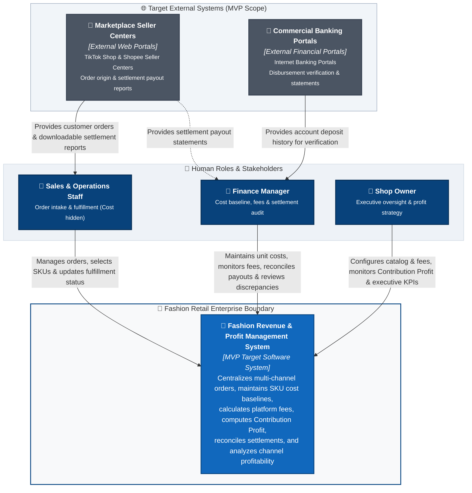

# C4 Context Specification: Fashion Revenue & Profit Management System

---

## 1. System Name & Target Purpose

### 1.1. System Name
- **Target Architecture Name:** **Fashion Revenue & Profit Management System**  
  *(Vietnamese: Hệ Thống Quản Lý Doanh Thu & Lợi Nhuận Bán Hàng Đa Kênh Thời Trang)*

### 1.2. Target Purpose
The **Fashion Revenue & Profit Management System** is designed to resolve the critical "Paper Profit, Negative Cash Flow" dilemma encountered by multi-channel fashion retail enterprises. When the MVP target is fully completed, the system achieves the following core objectives:
- Ingests and standardizes customer orders originating from multi-channel sales streams (TikTok Shop, Shopee, and in-store counter retail).
- Maintains product styles, SKU variants, retail prices, and baseline unit costs for COGS calculation.
- Governs order fulfillment lifecycle transitions (`Pending` $\rightarrow$ `Shipped` $\rightarrow$ `Delivered` / `Cancelled`) to guarantee that revenue, COGS, and Contribution Profit are recognized officially into financial periods only upon verified delivery.
- Systematically calculates, unbundles, and freezes complex sales channel fees (marketplace commissions, payment gateway transaction charges, service fees, fixed charges) based on configurable fee strategy schedules.
- Freezes immutable merchandise unit cost snapshots upon order placement to accurately calculate order-level **Contribution Profit**.
- Standardizes settlement reconciliation workflows to verify actual payouts received against expected net disbursements, recording and tracking settlement discrepancies.
- Delivers real-time executive visibility into **Gross Revenue**, **Platform Fees**, **Net Realized Revenue**, **COGS**, and **Contribution Profit**.

---

## 2. Target System Scope

### 2.1. In-Scope Capabilities (MVP Target)
The target system boundary for the MVP encompasses six core functional domains:

1. **Product Catalog & Cost Baseline:** Managing apparel models, SKU variants, retail selling prices, and baseline unit costs (`cost_price`) with role-sensitive cost visibility (`US-CAT-01`).
2. **Multi-Channel Order Management:** Ingesting multi-item orders across TikTok Shop, Shopee, and in-store retail, enforcing order lifecycle status progression, and officially recognizing revenue upon confirmed delivery (`US-ORD-01`, `US-ORD-02`, `US-ORD-03`).
3. **Platform Fee Calculation:** Automated estimation and freezing of channel-specific deductions (commissions, payment fees, service fees, fixed charges) at the time of delivery (`US-FEE-01`, `US-SET-01`).
4. **Cost & Contribution Profit Calculation:** Freezing immutable unit cost snapshots at order creation and calculating order-level Contribution Profit (`Projected Settlement - COGS`) upon delivery (`US-PROFIT-01`).
5. **Settlement Reconciliation:** Recording actual wallet/account disbursement amounts against delivered orders, calculating payout variances, and tracking discrepancy notes (`US-SET-02`).
6. **Revenue & Profit Analytics:** Computing core financial KPIs (Gross Revenue, Total Channel Fees, Net Realized Revenue, COGS, Contribution Profit), visualizing channel performance, ranking top-performing SKUs by profit, and providing source order audit drilldowns (`US-DASH-01` to `US-DASH-04`).

### 2.2. Out-of-Scope (Deliberate Architectural Exclusions)
The following domains are strictly outside the system's target ownership:

- **Enterprise General Ledger & Corporate Tax Filing:** Corporate balance sheets, asset depreciation, statutory tax filings, and enterprise chart of accounts.
- **Human Resources (HR) & Payroll:** Staff attendance tracking, scheduling, sales commission payroll, and wage distribution.
- **Advanced Inventory Cost Valuation:** Automated valuation engines such as Moving Weighted Average, FIFO, or LIFO costing based on continuous inventory receipts. *(Catalog uses a manually maintained baseline unit cost per SKU)*.
- **Full-Scale Warehouse Management (WMS):** Bin/aisle location routing, wave picking, and automated inventory replenishment.
- **Logistics Fleet Operations:** Vehicle telematics, courier dispatch, and last-mile delivery tracking.
- **Garment Manufacturing & Bill of Materials (BOM):** Fabric roll procurement, trim inventories, and garment factory cutting orders.

> [!NOTE]
> **Canonical Profit Definition:**
> The word "Profit" in the MVP specifically denotes **Contribution Profit** (`Gross Revenue - Platform Fees - COGS = Projected Settlement - COGS`). It represents order and channel commercial profitability after deducting marketplace fees and direct merchandise costs. It does **not** represent corporate accounting Net Profit, Net Income, or Operating Profit, as it excludes corporate overhead such as administrative payroll, store leases, central warehouse rent, corporate marketing OPEX, and corporate income taxes.

---

## 3. Human Actors & Responsibilities

| Actor Name | Business Goal | Target System Interactions |
|---|---|---|
| **Sales & Operations Staff** | Manage order intake, monitor fulfillment progress, and ensure timely dispatch. | • Manages multi-channel orders (TikTok Shop, Shopee, in-store sales). • Selects product SKUs and previews estimated platform fees. • Updates order fulfillment lifecycle (`Pending` $\rightarrow$ `Shipped` $\rightarrow$ `Delivered`). • Processes order cancellations prior to courier handover. • *Access Boundary:* Strictly restricted from viewing baseline unit costs, fee configurations, settlement audits, and profit dashboards. |
| **Finance Manager** | Protect cash flow, reconcile wallet payouts, maintain cost baselines, and audit margins. | • Maintains SKU baseline unit costs (`cost_price`) in catalog. • Monitors sales channel fees, deduction breakdowns, and COGS snapshots. • Records and reconciles actual settlement deposits from platform and bank statements. • Reviews settlement variances and records discrepancy notes. • Exports reconciled financial audit logs to CSV for external accounting. |
| **Shop Owner** | Direct store growth, evaluate channel profitability, and maintain executive oversight. | • Maintains master products, retail prices, and baseline unit costs. • Monitors executive financial KPI cards (Gross Revenue, Fees, Net Revenue, COGS, Contribution Profit). • Evaluates channel-level profitability and top-selling SKU leaderboards. • Configures marketplace commission rates and operational fee schedules. • Conducts authorized reviews of recorded settlement discrepancies. |

---

## 4. Target External Systems

| Target External System | System Nature | Target Business Role in MVP | Architectural Justification |
|---|---|---|---|
| **Marketplace Seller Centers** | External Web Portals | Official seller portals (TikTok Shop Seller Center, Shopee Seller Center) where consumers place orders and where merchants access downloadable settlement payout reports. | Users retrieve order records and official payout statements from these portals to input and reconcile within the system (`US-ORD-01`, `US-SET-01`). |
| **Commercial Banking Portals** | External Financial Web Portals | Internet banking web portals (e.g., Vietcombank, MB Bank) displaying merchant account balances, credited deposits, and bank transaction histories. | Finance Managers inspect incoming bank deposits to verify actual wallet payout receipts during settlement reconciliation (`US-SET-02`). |

---

## 5. Target System Context Diagram

---

## 6. Target Relationships (Business Level)

- **Sales & Operations Staff $\rightarrow$ System:**
  - Manages multi-channel customer orders (captures line items, external order IDs, promotional vouchers).
  - Selects SKUs from catalog (without visibility into baseline costs).
  - Updates order fulfillment lifecycle milestones (`Pending` $\rightarrow$ `Shipped` $\rightarrow$ `Delivered` / `Cancelled`).
  - Previews channel fee estimates prior to confirming order entry.
- **Finance Manager $\rightarrow$ System:**
  - Maintains product variant baseline unit costs (`cost_price`).
  - Monitors sales channel fee deductions and itemized breakdown policies.
  - Enters and reconciles actual settlement payout figures from platform statements.
  - Records settlement discrepancies and reviews variance status.
  - Exports reconciled financial audit logs for corporate reporting.
- **Shop Owner $\rightarrow$ System:**
  - Maintains catalog products, retail prices, and cost baselines.
  - Monitors revenue and Contribution Profit trends on executive financial KPI cards.
  - Evaluates channel-level financial performance and top SKU margin rankings.
  - Configures marketplace commission rates and fee schedule parameters.
  - Performs authorized reviews of recorded settlement discrepancies.
- **Marketplace Seller Centers $\rightarrow$ Operational Roles:**
  - Provides customer order data, product SKU details, and voucher subsidies to Sales & Operations Staff.
  - Supplies downloadable settlement payout reports to Finance Managers.
- **Commercial Banking Portals $\rightarrow$ Finance Manager:**
  - Provides bank account credit records and deposit histories to verify that platform wallet disbursements were received.

---

## 7. System Boundary Definition (Business Capability Level)

### Inside the System Boundary (Owned Responsibilities)
- **Product Catalog & Cost Baseline:** Storing product models, SKU variants, retail prices, and baseline unit costs.
- **Order Management:** Validating, storing, and tracking multi-channel orders, line items, and fulfillment states.
- **Fee Calculation:** Executing channel-specific fee deduction formulas and freezing calculated fees upon delivery.
- **Cost & Profit Tracking:** Freezing immutable unit cost snapshots upon order placement and computing Contribution Profit upon delivery.
- **Settlement Reconciliation:** Tracking projected receivables, recording actual wallet payouts, and computing variances.
- **Discrepancy Tracking:** Recording deduction variances, maintaining discrepancy status, and supporting authorized review.
- **Revenue & Profit Analytics:** Aggregating and visualizing financial metrics (Gross Revenue, Channel Fees, Net Realized Revenue, COGS, Contribution Profit).

### Outside the System Boundary (External Responsibilities)
- Customer-facing online storefront checkout and cart experiences hosted on TikTok Shop and Shopee.
- Credit/debit card processing, payment clearing, and interbank money transfers.
- Physical parcel sorting, warehousing, linehaul transport, and last-mile courier fulfillment.
- In-store retail register hardware maintenance.
- Enterprise general ledger accounting, tax declaration, and corporate auditing.

---

## 8. Current Implementation Status

| Target Capability | Target Architectural State | Current Implementation State | Implementation Status |
|---|---|---|:---:|
| **Product Catalog & Cost** | SKU pricing and baseline cost management with role-sensitive visibility | In-memory/mock catalog selection during order entry; cost baseline to be formalized | **In Progress** |
| **Order Management** | Multi-channel order ingestion, lifecycle tracking (`Pending` $\rightarrow$ `Shipped` $\rightarrow$ `Delivered`), delivery revenue recognition | Web order entry form with state transitions operational; orders stored in memory / local state | **Partial** |
| **Fee Calculation** | Automated channel-specific fee calculation via strategy formulas, frozen on confirmed delivery | Channel fee formulas applied dynamically on order creation; fee rates preset in application state | **Partial** |
| **Cost & Profit Tracking** | Freezing immutable unit cost snapshot and computing order Contribution Profit | Cost snapshot and contribution profit formulas formalized in target architecture | **Architecture Ready** |
| **Settlement & Reconciliation** | Formal reconciliation workflow matching delivered orders against settlement statement data | Prototype settlement view supporting manual input of actual received amount and variance display | **Prototype** |
| **Discrepancy Tracking** | Structured discrepancy recording with notes and authorized review status | Discrepancy drawer operational in UI allowing note entry and review status update | **Partial** |
| **Revenue & Profit Analytics** | Real-time calculation of 5 KPI cards, channel share charts, and SKU leaderboards from persisted orders | Top KPI cards, channel filters, and charts operational, driven by active orders and seed data | **Partial** |

---

## 9. Traceability Matrix: Elements to Requirements & Use Cases

| Architecture Element | Target Requirement ID (`requirements_invest.md`) | Target Use Case (`usecase.md`) | Scope of Traceability |
|---|---|---|---|
| **Sales & Operations Staff** | `US-ORD-01` `US-ORD-02` `US-ORD-03` | `UC01: Ingest Multi-Channel Orders` `UC03: Update Order Status` `UC04: Cancel Order & Reverse Revenue` | Primary actor for order creation, order lifecycle progression, and order cancellation. (SKU selection with cost hidden). |
| **Finance Manager** | `US-CAT-01` `US-FEE-01` `US-SET-01` `US-SET-02` `US-PROFIT-01` `US-DASH-02` `US-DASH-04` | `UC12: Maintain SKU Catalog & Cost` `UC05: View Fee Breakdown` `UC06: Reconcile & Confirm Settlement` `UC07: Track Settlement Discrepancy` `UC11: Drilldown Source Orders & Export CSV` | Primary actor for catalog unit cost maintenance, platform fee audit, wallet reconciliation, discrepancy review, and audit CSV export. |
| **Shop Owner** | `US-CAT-01` `US-FEE-01` `US-PROFIT-01` `US-DASH-01` `US-DASH-02` `US-DASH-03` `US-DASH-04` | `UC12: Maintain SKU Catalog & Cost` `UC08: View 5 Core Financial KPI Cards` `UC09: Filter Analytics by Date & Channel` `UC10: View Channel Breakdown & Top SKUs` `UC13: Analyze Contribution Profit & Margin` | Primary actor for catalog & fee policy oversight, executive KPI cards, channel profit distribution, and authorized discrepancy review. |
| **Marketplace Seller Centers** | `US-ORD-01` `US-SET-01` | `UC01: Ingest Multi-Channel Orders` `UC05: View Fee Breakdown` `UC06: Reconcile & Confirm Settlement` | External web source from which users obtain multi-channel order information and downloadable settlement reports. |
| **Commercial Banking Portals** | `US-SET-02` | `UC06: Reconcile & Confirm Settlement` | External financial web source accessed by Finance to verify actual wallet payout credits against bank accounts. |
| **Fashion Revenue & Profit Management System** | All Stories (`US-CAT-*`, `US-ORD-*`, `US-FEE-*`, `US-SET-*`, `US-PROFIT-*`, `US-DASH-*`) | All Use Cases (`UC01` through `UC13`) | Core MVP software system fulfilling end-to-end catalog, order, fee, profit, settlement, and reporting requirements. |
