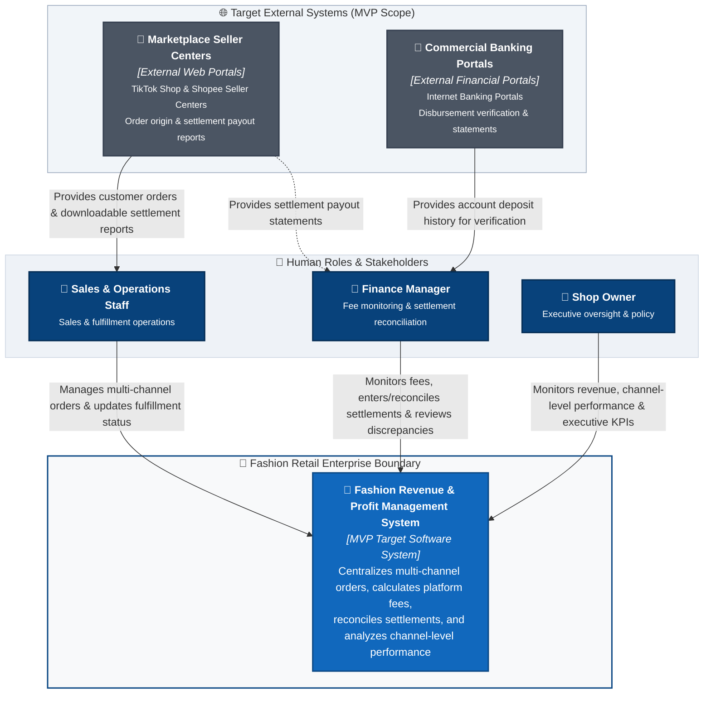

# C4 Context Specification: Fashion Revenue & Profit Management System

> **Status:** LOCKED (Target MVP Baseline)

---

## 1. System Name & Target Purpose

### 1.1. System Name
- **Target Architecture Name:** **Fashion Revenue & Profit Management System**  
  *(Vietnamese: Hệ Thống Quản Lý Doanh Thu & Lợi Nhuận Bán Hàng Đa Kênh Thời Trang)*
- **Legacy Document Notice:** Legacy project specifications (including `requirements_invest.md` and `usecase.md`) may still refer to the system by its working title: *Multi-Channel Revenue Management System*. Both titles refer to the same software system under design.

### 1.2. Target Purpose
The **Fashion Revenue & Profit Management System** is designed to resolve the critical "Paper Profit, Negative Cash Flow" dilemma encountered by multi-channel fashion retail enterprises. When the MVP target is fully completed, the system achieves the following core objectives:
- Ingests and standardizes customer orders originating from multi-channel sales streams (TikTok Shop, Shopee, and in-store counter retail).
- Governs order fulfillment lifecycle transitions (`Pending` $\rightarrow$ `Shipped` $\rightarrow$ `Delivered` / `Cancelled`) to guarantee that revenue is recognized officially into financial periods only upon verified delivery.
- Systematically calculates, unbundles, and freezes complex sales channel fees (marketplace commissions, payment gateway transaction charges, service/shipping vouchers, fixed fees) based on configurable fee strategy schedules.
- Standardizes settlement reconciliation workflows to verify actual payouts received against expected net disbursements, recording and tracking settlement discrepancies.
- Delivers real-time executive visibility into **net realized revenue**, **channel-level financial performance**, and top-selling apparel merchandise.

---

## 2. Target System Scope

### 2.1. In-Scope Capabilities (MVP Target)
The target system boundary for the MVP encompasses five core functional domains:

1. **Multi-Channel Order Management:** Ingesting multi-item orders across TikTok Shop, Shopee, and in-store retail, enforcing order lifecycle status progression, and officially recognizing revenue upon confirmed delivery.
2. **Platform Fee Calculation:** Automated estimation and freezing of channel-specific deductions (commissions, payment fees, service vouchers) at the time of delivery.
3. **Settlement Reconciliation:** Recording actual wallet/account disbursement amounts against delivered orders, calculating payout variances, and updating settlement status.
4. **Discrepancy Tracking:** Recording settlement discrepancies (such as courier weight penalties or unexpected platform deductions) and supporting authorized operational review.
5. **Revenue & Financial Analytics:** Computing core financial KPIs (Gross Sales, Total Channel Fees, Net Realized Revenue, Delivered Order Counts), visualizing channel revenue distribution, ranking top-performing SKUs, and providing source order audit drilldowns.

### 2.2. Out-of-Scope (Deliberate Architectural Exclusions)
The following domains are strictly outside the system's target ownership:

- **Enterprise General Ledger & Corporate Tax Filing:** Corporate balance sheets, asset depreciation, tax compliance filings, and enterprise chart of accounts.
- **Human Resources (HR) & Payroll:** Staff attendance tracking, scheduling, sales commission payroll, and wage distribution.
- **Customer Relationship Management (CRM):** Direct consumer marketing, loyalty reward schemes, and post-purchase consumer support chat.
- **Full-Scale Warehouse Management (WMS):** Bin/aisle location routing, wave picking, and automated inventory replenishment.
- **Logistics Fleet Operations:** Vehicle telematics, courier dispatch, and last-mile delivery tracking.
- **Garment Manufacturing & Bill of Materials (BOM):** Fabric roll procurement, trim inventories, and garment factory cutting orders.

> [!NOTE]
> **Important Clarification on "Profit" Scope:**  
> The word "Profit" in the system name does **not** represent full corporate accounting net profit. It specifically denotes **channel-level financial performance** and **net settlement after platform deductions** (Gross Sales minus platform commissions, transaction fees, service vouchers, and settlement variances). It does **not** include corporate overhead expenses such as Cost of Goods Sold (COGS), administrative payroll, store leases, central warehouse rent, or corporate income tax.

---

## 3. Human Actors & Responsibilities

The system defines three primary human actors, strictly derived from verified project requirements (`requirements_invest.md` and `usecase.md`):

| Actor Name | Business Goal | Target System Interactions |
|---|---|---|
| **Sales & Operations Staff** | Manage order intake, monitor fulfillment progress, and ensure timely dispatch. | • Manages multi-channel orders (TikTok Shop, Shopee, in-store sales). • Previews estimated platform fee deductions during order handling. • Updates order fulfillment lifecycle (`Pending` $\rightarrow$ `Shipped` $\rightarrow$ `Delivered`). • Processes order cancellations prior to courier handover. • *Access Boundary:* Restricted from settlement audits, fee configuration, and financial review. |
| **Finance Manager** | Protect cash flow, reconcile wallet payouts, and investigate deduction variances. | • Monitors sales channel fees and deduction breakdowns. • Records and reconciles actual settlement deposits from platform and bank statements. • Reviews settlement variances and records discrepancy notes. • Exports reconciled financial audit logs to CSV for external corporate accounting. • *Access Boundary:* Excluded from order creation. |
| **Shop Owner** | Direct store growth, evaluate channel performance, and maintain financial oversight. | • Monitors revenue and executive financial KPI cards (Gross Sales, Fees, Net Realized Revenue). • Evaluates channel-level financial performance and top-selling SKU leaderboards. • Configures marketplace commission rates and operational fee schedules. • Conducts authorized reviews of recorded settlement discrepancies. • Inspects itemized source orders via audit drilldown views. |

---

## 4. Target External Systems

For the MVP target architecture, external systems represent third-party software platforms with which users interact to obtain operational data and verify financial transactions:

| Target External System | System Nature | Target Business Role in MVP | Architectural Justification |
|---|---|---|---|
| **Marketplace Seller Centers** | External Web Portals | Official seller portals (TikTok Shop Seller Center, Shopee Seller Center) where consumers place orders and where merchants access downloadable settlement payout reports. | Users retrieve order records and official payout statements from these portals to input and reconcile within the system (`US-ORD-01`, `US-SET-01`). |
| **Commercial Banking Portals** | External Financial Web Portals | Internet banking web portals (e.g., Vietcombank, MB Bank) displaying merchant account balances, credited deposits, and bank transaction histories. | Finance Managers inspect incoming bank deposits to verify actual wallet payout receipts during settlement reconciliation (`US-SET-02`). |

> [!IMPORTANT]
> **Boundary Clarification on In-Store POS & Direct APIs:**
> 1. **In-Store Retail Sales (POS):** In the MVP scope, in-store POS is treated as an operational sales channel entered manually by Sales & Operations Staff via the system's order interface (`US-ORD-01`, `US-FEE-01`). No direct external POS hardware or standalone POS software integration is required for the MVP.
> 2. **Direct APIs:** Direct programmatic integrations (e.g., TikTok Shop Open API, Shopee Open Platform API, Open Banking Core API) are deliberately excluded from the MVP target and cataloged in the **Future Roadmap** section.

---

## 5. Target System Context Diagram

The diagram below represents the **Target System Context Diagram** for the MVP. It illustrates the three human actors, the core software system, and the target external software systems interacting through business workflows:

---

## 6. Target Relationships (Business Level)

All interactions across the system boundary are formulated strictly in business language:

- **Sales & Operations Staff $\rightarrow$ System:**
  - Manages multi-channel customer orders (captures line items, external order IDs, promotional vouchers).
  - Updates order fulfillment lifecycle milestones (`Pending` $\rightarrow$ `Shipped` $\rightarrow$ `Delivered` / `Cancelled`).
  - Previews channel fee estimates prior to confirming order entry.
- **Finance Manager $\rightarrow$ System:**
  - Monitors sales channel fee deductions and itemized breakdown policies.
  - Enters and reconciles actual settlement payout figures from platform statements.
  - Records settlement discrepancies and reviews variance status.
  - Exports reconciled financial audit logs for corporate reporting.
- **Shop Owner $\rightarrow$ System:**
  - Monitors revenue trends and top-level executive financial KPI cards.
  - Evaluates channel-level financial performance and top SKU rankings.
  - Configures marketplace commission rates and fee schedule parameters.
  - Performs authorized reviews of recorded settlement discrepancies.
- **Marketplace Seller Centers $\rightarrow$ Operational Roles:**
  - Provides customer order data, product SKU details, and voucher subsidies to Sales & Operations Staff.
  - Supplies downloadable settlement payout reports to Finance Managers.
- **Commercial Banking Portals $\rightarrow$ Finance Manager:**
  - Provides bank account credit records and deposit histories to verify that platform wallet disbursements were received.

---

## 7. System Boundary Definition (Business Capability Level)

The system boundary demarcates the business responsibilities owned by the **Fashion Revenue & Profit Management System**:

### Inside the System Boundary (Owned Responsibilities)
- **Order Management:** Validating, storing, and tracking multi-channel orders, line items, and fulfillment states.
- **Fee Calculation:** Executing channel-specific fee deduction formulas and freezing calculated fees upon delivery.
- **Settlement Reconciliation:** Tracking projected receivables, recording actual wallet payouts, and computing variances.
- **Discrepancy Tracking:** Recording deduction variances, maintaining discrepancy status, and supporting authorized review.
- **Revenue & Financial Analytics:** Aggregating and visualizing financial metrics (Gross Sales, Channel Fees, Net Realized Revenue).

### Outside the System Boundary (External Responsibilities)
- Customer-facing online storefront checkout and cart experiences hosted on TikTok Shop and Shopee.
- Credit/debit card processing, payment clearing, and interbank money transfers.
- Physical parcel sorting, warehousing, linehaul transport, and last-mile courier fulfillment.
- In-store retail register hardware maintenance.
- Enterprise general ledger accounting, tax declaration, and corporate auditing.

---

## 8. Current Implementation Status

This section documents the active implementation state of the codebase relative to the target MVP architecture.

### Target Capability vs. Implementation Status

| Target Capability | Target Architectural State | Current Implementation State | Implementation Status |
|---|---|---|:---:|
| **Order Management** | Multi-channel order ingestion, lifecycle tracking (`Pending` $\rightarrow$ `Shipped` $\rightarrow$ `Delivered`), delivery revenue recognition | Web order entry form with state transitions operational; orders stored in memory / local state | **Partial** |
| **Fee Calculation** | Automated channel-specific fee calculation via strategy formulas, frozen on confirmed delivery | Channel fee formulas applied dynamically on order creation; fee rates preset in application state | **Partial** |
| **Settlement & Reconciliation** | Formal reconciliation workflow matching delivered orders against settlement statement data | Prototype settlement view supporting manual input of actual received amount and variance display | **Prototype** |
| **Discrepancy Tracking** | Structured discrepancy recording with notes and authorized review status | Discrepancy drawer operational in UI allowing note entry and review status update | **Partial** |
| **Revenue & Financial Analytics** | Real-time calculation of top 3 KPI cards, channel share charts, and SKU leaderboards from persisted orders | Top 3 KPI cards, channel filters, and charts operational, driven by active orders and sample seed data | **Partial** |
| **Frontend / API Flow** | Modular single-page application interacting with structured backend API endpoints | Modern web UI operational; API integration partially mocked / in transition to unified backend | **Partial** |

---

## 9. Target vs. Current Gap Analysis

| Capability Domain | Target State (MVP Target) | Current State (AS-IS Codebase) | Gap to Complete Target |
|---|---|---|---|
| **Order Management** | Multi-channel orders fully persisted and retrievable end-to-end via relational database storage. | Orders captured via web UI modal and maintained in active application runtime memory. | Connect frontend order workflows to backend REST persistence services and database storage. |
| **Fee Calculation** | Dynamically configurable fee policy schedules with effective-date governance and persistence. | Hardcoded/preset fee deduction formulas (commission, payment, service fees) in frontend state. | Implement backend fee strategy engine with administrative configuration persistence. |
| **Settlement Reconciliation** | Standardized reconciliation engine comparing delivered orders against official settlement payout values. | Prototype interface allowing manual entry of actual deposit values to calculate variance. | Complete persistence of actual settlement amounts and formalized reconciliation audit trail. |
| **Discrepancy Tracking** | Audited discrepancy tracking supporting status lifecycle (`Pending Review` $\rightarrow$ `Reviewed`) and export. | Discrepancy drawer in UI supports recording variance details and local status toggles. | Persist discrepancy records and link them directly to reconciled settlement line items in database. |
| **Revenue Analytics** | KPI cards, channel share charts, and SKU leaderboards calculated dynamically from persisted records. | Dashboard aggregates calculated from active order state combined with sample initialization records. | Implement dynamic database aggregation queries for all dashboard metrics, charts, and drilldowns. |

---

## 10. Current Limitations

The following operational constraints characterize the current codebase and provide context for the Gap Analysis:

1. **Manual Data Entry:** Multi-channel orders and settlement deposit figures are transcribed or imported manually through UI forms rather than through automated connectors.
2. **Prototype Settlement Review:** Settlement reconciliation operates as an assisted manual workflow in the frontend rather than an automated backend matching process.
3. **Hybrid Data Runtime:** Financial analytics combine active runtime orders with preset demonstration seeds to illustrate reporting views prior to full database consolidation.

---

## 11. Future Roadmap (Future Integrations — Outside Current MVP Target)

The following external integrations are deliberately positioned outside the current MVP scope and represent planned enhancements for future architecture phases:

| Future Integration | Classification | Target Protocol & Mechanism | Architectural Scope |
|---|---|---|---|
| **TikTok Shop Open API** | Automated Platform Webhooks | Bidirectional REST API & Webhook events for real-time order synchronization and settlement ingestion. | Eliminates manual order transcription and automates TikTok Shop wallet statement import. |
| **Shopee Open Platform API** | Automated Platform Webhooks | Direct developer open API connection for automated order status feeds and escrow disbursement synchronization. | Eliminates manual order transcription and automates Shopee seller wallet statement import. |
| **Open Banking Core API** | Commercial Banking Gateway | Direct API integration with commercial banks for automated account statement polling and transaction matching. | Automates real-time verification of bank account deposits against platform disbursements. |
| **Direct POS Hardware / Software Connector** | Retail In-Store Integration | Local network / serial protocol integration with physical retail checkout terminals and barcode scanners. | Automates instant walk-in retail sales capture directly from store checkout registers. |

---

## 12. Traceability Matrix: Elements to Requirements & Use Cases

All architecture elements are mapped strictly to verified requirements in `requirements_invest.md` and use cases in `usecase.md`:

| Architecture Element | Target Requirement ID (`requirements_invest.md`) | Target Use Case (`usecase.md`) | Scope of Traceability |
|---|---|---|---|
| **Sales & Operations Staff** | `US-ORD-01` `US-ORD-02` `US-ORD-03` | `UC01: Ingest Multi-Channel Orders` `UC03: Update Order Status` `UC04: Cancel Order & Reverse Revenue` | Primary actor for order creation, order lifecycle progression, and order cancellation. (Fee preview in UI via `UC01`/`UC02`). |
| **Finance Manager** | `US-FEE-01` `US-SET-01` `US-SET-02` `US-DASH-02` `US-DASH-04` | `UC05: View Fee Breakdown` `UC06: Reconcile & Confirm Settlement` `UC07: Generate Settlement Variance Report` `UC11: Drillthrough Source Orders & Export CSV` | Primary actor for platform fee preview/audit, wallet settlement reconciliation, discrepancy review, and audit CSV export. |
| **Shop Owner** | `US-FEE-01` `US-DASH-01` `US-DASH-02` `US-DASH-03` | `UC08: View Top 3 Revenue KPI Cards` `UC09: Filter Revenue by Date & Channel` `UC10: View Channel Breakdown & Top SKUs` `UC05: View Fee Breakdown` `UC07: Review Settlement Variance` | Primary actor for fee policy oversight, executive KPI cards, channel revenue distribution, and authorized discrepancy review. |
| **Marketplace Seller Centers** | `US-ORD-01` `US-SET-01` | `UC01: Ingest Multi-Channel Orders` `UC05: View Fee Breakdown` `UC06: Reconcile & Confirm Settlement` | External web source from which users obtain multi-channel order information and downloadable settlement reports. |
| **Commercial Banking Portals** | `US-SET-02` | `UC06: Reconcile & Confirm Settlement` | External financial web source accessed by Finance to verify actual wallet payout credits against bank accounts. |
| **Fashion Revenue & Profit Management System** | All Stories (`US-ORD-*`, `US-FEE-*`, `US-SET-*`, `US-DASH-*`) | All Use Cases (`UC01` through `UC11`) | Core MVP software system fulfilling end-to-end order, fee, settlement, and reporting requirements. |
