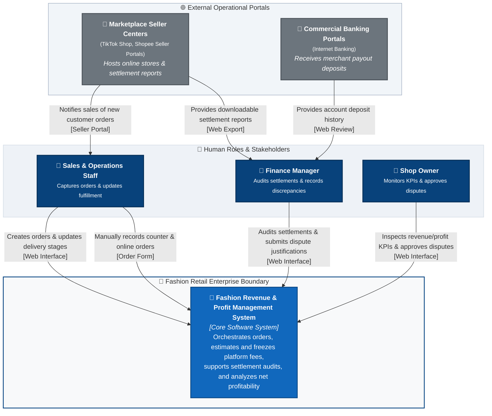

# C4 Context Diagram: Fashion Revenue & Profit Management System

---

## 1. System Name & Purpose

### 1.1. System Name
The official, standardized name of the system used consistently across all architectural diagrams, specifications, and documentation is:

**Fashion Revenue & Profit Management System**  
*(Vietnamese: Hệ Thống Quản Lý Doanh Thu & Lợi Nhuận Bán Hàng Đa Kênh Thời Trang)*

### 1.2. Purpose of the System
The **Fashion Revenue & Profit Management System** exists to resolve the critical "Paper Profit, Negative Cash Flow" problem faced by modern multi-channel fashion retail merchants. The system manages the ingestion and lifecycle tracking of multi-channel orders (TikTok Shop, Shopee, and In-Store POS), systematically unbundles complex marketplace fee deductions (commissions, payment gateway charges, service fees), supports manual and prototype settlement reconciliation against actual bank and platform wallet payout statements, records deduction variances through audit trails, and delivers executive analytics on true net revenue and profitability.

---

## 2. Scope of the System

### 2.1. In-Scope Capabilities (P01)
The system boundary encompasses the following core operational capabilities:

1. **Multi-Channel Order Management:** Ingestion of customer orders across TikTok Shop, Shopee, and In-Store POS, tracking order lifecycle states (`Pending`, `Shipped`, `Delivered`, `Cancelled`), and enforcing strict revenue recognition upon verified delivery.
2. **Platform Fee Calculation & Policy Configuration:** Itemized estimation of sales channel fees (marketplace commission, payment processing, shipping subsidies/caps, fixed fees) and maintenance of active fee schedules.
3. **Settlement Review & Variance Auditing (AS-IS Manual / Prototype):** Reviewing delivered orders, recording actual wallet payouts from platform/bank statements, identifying deduction variances, and updating settlement status.
4. **Discrepancy Auditing & Justification Governance:** Structured recording of justification claims for platform over-deductions (such as courier weight or dimensional surcharge penalties) with documentary evidence, governed by role-based executive approval workflows.
5. **Revenue & Profit Analytics:** Consolidated executive KPI reporting (Gross Sales, Platform Fee Deductions, Net Realized Revenue, Delivered Order Counts), daily cash flow trend visualization, sales channel revenue distribution, best-performing SKU rankings, and itemized source order audit drilldowns.

### 2.2. Out-of-Scope (Deliberate System Exclusions)
To maintain an explicit, uncompromised system boundary, the following domains are strictly outside the system's ownership and responsibility:

- **Human Resource Management (HR) & Payroll:** Staff attendance, shift scheduling, and wage processing.
- **Customer Relationship Management (CRM) & Loyalty:** Direct consumer marketing campaigns, loyalty points, and post-sale messaging.
- **Full-Scale Warehouse Management (WMS):** Multi-warehouse bin/aisle tracking, wave picking, and automated inventory reordering.
- **Logistics Fleet Operations:** Fleet dispatch, delivery driver routing, and vehicle telematics.
- **Marketplace Seller Account Management:** Direct management of marketplace seller shop profiles, buyer customer support chat, and ad campaign bidding within TikTok/Shopee seller centers.
- **Manufacturing & Bill of Materials (BOM):** Raw material sourcing, garment manufacturing processes, and factory vendor procurement.

---

## 3. Human Actors & Responsibilities

All actors are strictly derived from verified project requirements (`requirements_invest.md` and `usecase.md`). No unverified aliases are included.

| Actor Name | Business Goal | Main System Interactions & Boundaries |
|---|---|---|
| **Sales & Operations Staff** | Accurately capture multi-channel orders, record order progress, and ensure timely fulfillment handover. | • Ingests orders from live streams, hotlines, and walk-in counter sales. • Previews estimated platform fee deductions before order submission. • Updates fulfillment delivery milestones (`Pending` $\rightarrow$ `Shipped` $\rightarrow$ `Delivered`). • Records customer cancellations before carrier dispatch. • *Restricted:* Cannot view wallet payouts, perform settlement audits, or approve financial variances. |
| **Finance Manager** | Verify wallet cash receipts against internal books, recover shortfall losses, and maintain tax-compliant records. | • Reviews external bank and marketplace payout statements. • Records actual payout deposits and performs manual/prototype reconciliation. • Investigates payment discrepancies and files audit justification cases. • Attaches documentary proof (carrier scale slips, packaging photos) for review. • Exports standardized CSV ledger files for corporate accounting and tax filing. • *Restricted:* Cannot approve own discrepancy claims; cannot input orders. |
| **Shop Owner** | Maximize take-home profit, prevent platform fee leakage, and ensure cash flow solvency. | • Evaluates top-level financial KPI cards and net cash flow trends. • Configures marketplace commission rates and operational fee schedules. • Reviews and signs off on discrepancy audit cases (`Approve` to accept variance as expense / `Reject` to remand for carrier claim). • Inspects underlying itemized source orders via audit drilldown views. |

---

## 4. Candidate External Systems (AS-IS vs. Planned)

The table below catalogs external software systems interacting across the system boundary. Document files (such as `.xlsx` / `.csv` spreadsheets) and manual POS operations are categorized by their true nature rather than mislabeled as external software systems:

| External System / Channel | Classification | Data Exchanged | Current AS-IS Status | Architectural Justification |
|---|---|---|:---:|---|
| **Marketplace Seller Centers (TikTok Shop, Shopee)** | External Web Portals | Customer Orders, Retail Prices, Voucher Subsidies, Settlement Payout Reports | **Operational (Manual / Web Export)** | External seller portals where shoppers place orders and where merchants download payout reports. Order data is captured into the system via operator manual entry. |
| **In-Store POS (Counter Checkout)** | Operational Channel (No Direct System Integration) | Walk-In Counter Sales, Cash / Card Payments, QR Payment Confirmation | **Operational (Manual Entry)** | Walk-in counter sales. Operators input counter sales directly into the system's order interface; no direct hardware or external POS software integration exists in AS-IS. |
| **Commercial Banking Portals (VCB, MB)** | External Financial Web Portals | Payout Credit Entries, Account Statements | **Operational (Manual Review)** | Banking web portals accessed by Finance to inspect actual received funds; statements are downloaded and reviewed manually. |
| **TikTok Shop Open API Webhooks** | Automated Platform Webhooks | Real-Time Order Feeds, Instant Fulfillment Status Sync | **Planned (Future Scope)** | Direct bidirectional HTTP webhook integration to be enabled in a future phase once formal marketplace partner licenses are secured. |
| **Shopee Open Platform API** | Automated Platform Webhooks | Real-Time Marketplace Orders, Automated Settlement Feeds | **Planned (Future Scope)** | Direct open API connection planned for future release; not active in AS-IS. |
| **Open Banking Core API** | Commercial Banking Gateway | Automated Direct Bank Feeds, Real-Time Deposit Notifications | **Planned (Future Scope)** | Commercial bank direct connectivity planned for future enterprise scale. |

---

## 5. Current AS-IS Limitations & Assumptions

To maintain complete architectural integrity between documentation and working software, the following operating assumptions and limitations are explicitly recognized for the AS-IS baseline:

1. **No Live Marketplace Webhooks (AS-IS Baseline):** The system does not connect via live developer APIs to TikTok Shop or Shopee. Online orders are captured through operator manual entry.
2. **Manual / Prototype Settlement Review:** Payout statements from marketplaces and commercial banks are reviewed manually or uploaded through prototype settlement import views; reconciliation is an assisted manual audit rather than autonomous real-time bank matching.
3. **No Direct POS Hardware Integration:** Counter sales are recorded manually by sales staff through the web interface; no direct serial, network, or third-party POS software integration exists.
4. **Internal Fee Strategy Configuration:** Marketplace commission and service fee rates are configured inside the system's fee schedule settings based on published platform rules, without live external fee query APIs.

---

## 6. C4 Level 1: System Context Diagram (AS-IS Architecture)

The following diagram defines the active AS-IS system context, including human actors, the software system under development, and verified external operational systems:

---

## 7. System Boundary Definition (Narrative)

The system boundary demarcates the business capabilities owned, maintained, and operated within the **Fashion Revenue & Profit Management System**:

### Inside the Boundary (Owned by System):
- Maintaining canonical records of multi-channel orders and line items.
- Itemized estimation and immutable freezing of channel-specific fee deductions upon confirmed delivery.
- Recording actual settlement payouts and calculating variance between expected net payout and received funds.
- Discrepancy audit case management with role-based approval governance.
- Aggregation and rendering of executive financial metrics (Gross Sales, Total Fee Deductions, Net Realized Revenue).

### Outside the Boundary (External to System):
- Customer card acquiring and payment processing networks.
- Logistics fulfillment, parcel warehousing, and courier delivery fleet operations.
- Consumer-facing storefront checkout and cart experiences hosted on TikTok Shop and Shopee.
- Physical counter checkout hardware devices (operated via manual entry into system).
- Enterprise general ledger accounting and corporate tax filing software.

---

## 8. C4 Elements Catalog

| Element Name | C4 Type | Responsibility & Business Function | Current Implementation Status |
|---|---|---|:---:|
| **Fashion Revenue & Profit Management System** | `Software System` | Core platform responsible for order intake, fee estimation, settlement auditing, dispute recording, and profit analytics. | **Core System (In-Scope)** |
| **Sales & Operations Staff** | `Person` | Inputs orders, monitors delivery stages, and processes order cancellations. | **Active Actor** |
| **Finance Manager** | `Person` | Audits wallet payouts, records fee discrepancies, and compiles audit evidence. | **Active Actor** |
| **Shop Owner** | `Person` | Sets fee schedule policies, evaluates store profitability, and approves financial dispute resolutions. | **Active Actor** |
| **Marketplace Seller Centers** | `External System` | External seller portals (TikTok Shop, Shopee) originating customer orders and payout reports. | **Operational (External Web Portal)** |
| **Commercial Banking Portals** | `External System` | External internet banking portals displaying account balances and incoming deposits. | **Operational (External Web Portal)** |

---

## 9. External Systems Specification

| External System | Why External to Boundary? | Primary Data Exchanged | AS-IS Interaction Mode | Target Future Protocol |
|---|---|---|---|---|
| **Marketplace Seller Centers** | Third-party multi-tenant e-commerce platforms with proprietary data models. | Order identifiers, purchased apparel items, applied promotion vouchers, settlement payout reports. | Operator manual review and manual data entry / file download. | Automated REST Webhooks (Future Scope). |
| **Commercial Banking Portals** | Regulated external financial institution portals. | Payout deposit amounts, credit transaction references. | Finance manual review via web banking interface. | Automated Direct Bank Feed (Future Scope). |

---

## 10. Traceability Matrix: C4 Context to Requirements & Use Cases

| C4 Context Element | Target Requirement ID (`requirements_invest.md`) | Target Use Case (`usecase.md`) | Operational UI Screen / Modal |
|---|---|---|---|
| **Sales & Operations Staff** | `US-ORD-01` `US-ORD-02` `US-ORD-03` `US-FEE-01` | `UC01: Ingest Multi-Channel Orders` `UC02: Automated Platform Fee Estimation` `UC03: Update Order Status` `UC04: Cancel Order & Reverse Revenue` | `SCR-01: Order Management` `MOD-01: Create Order Modal` `MOD-02: Cancel Order Modal` |
| **Finance Manager** | `US-FEE-01` `US-SET-01` `US-SET-02` `US-DASH-02` `US-DASH-04` | `UC05: View Fee Breakdown` `UC06: Reconcile & Confirm Settlement` `UC07: Generate Settlement Variance Report` `UC11: Drillthrough Source Orders & Export CSV` | `SCR-02: Fees & Settlement` `MOD-03: Statement Import Modal` `Discrepancy Drawer (Settlement Audit)` `SCR-03: Revenue Dashboard` |
| **Shop Owner** | `US-FEE-01` `US-SET-01` `US-DASH-01` `US-DASH-02` `US-DASH-03` `US-DASH-04` | `UC08: View Top 3 Revenue KPI Cards` `UC09: Filter Revenue by Date & Channel` `UC10: View Channel Breakdown & Top SKUs` `UC11: Drillthrough Source Orders & Export CSV` | `SCR-03: Revenue Dashboard` `MOD-04: Fee Schedule Modal` `MOD-05: Source Order Drilldown Modal` |
| **Marketplace Seller Centers** | `US-ORD-01` `US-SET-01` `US-SET-02` | `UC01: Ingest Multi-Channel Orders` `UC06: Reconcile & Confirm Settlement` | `MOD-01: Create Order Modal` `MOD-03: Statement Import Modal` |
| **Commercial Banking Portals** | `US-SET-02` | `UC06: Reconcile & Confirm Settlement` | `SCR-02: Fees & Settlement` |
| **Fashion Revenue & Profit Management System** | All system user stories (`US-ORD-*`, `US-FEE-*`, `US-SET-*`, `US-DASH-*`) | All system use cases (`UC01` through `UC11`) | All system screens (`SCR-01`, `SCR-02`, `SCR-03`) |
