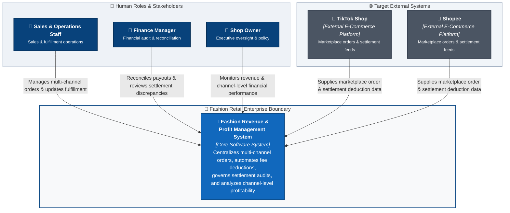

# C4 Context Specification: Fashion Revenue & Profit Management System

---

## 1. System Name & Target Purpose

### 1.1. System Name
The official, standardized name of the system used consistently across all architectural models, specifications, and project assets is:

**Fashion Revenue & Profit Management System**  
*(Vietnamese: Hệ Thống Quản Lý Doanh Thu & Lợi Nhuận Bán Hàng Đa Kênh Thời Trang)*

### 1.2. Target Purpose
The **Fashion Revenue & Profit Management System** is designed to resolve the critical "Paper Profit, Negative Cash Flow" dilemma encountered by multi-channel fashion retail enterprises. When fully realized, the system serves as the centralized financial and operational control platform that:
- Ingests and standardizes customer orders across online e-commerce marketplaces (TikTok Shop, Shopee) and in-store retail channels.
- Enforces rigorous order lifecycle transitions (`Pending` $\rightarrow$ `Shipped` $\rightarrow$ `Delivered` / `Cancelled`) to guarantee that revenue is recognized officially only upon confirmed delivery.
- Systematically unbundles and freezes complex sales channel fees (marketplace commissions, payment gateway surcharges, service/shipping vouchers, fixed fees) via configurable fee strategy policies.
- Governs settlement audit workflows to detect, investigate, and reconcile variances between projected net receivables and actual wallet deposits.
- Delivers real-time executive visibility into net realized revenue, channel-level financial performance, and top-selling merchandise.

---

## 2. Scope of the System

### 2.1. In-Scope Capabilities (Target Architecture)
The target system boundary encompasses the following core operational and financial capabilities:

1. **Multi-Channel Order Lifecycle Management:** Ingesting multi-item orders from TikTok Shop, Shopee, and in-store retail sales, maintaining full order state machines, and enforcing revenue recognition upon verified delivery.
2. **Platform Fee Calculation & Dynamic Policy Engine:** Itemized estimation and automated freezing of platform deductions based on channel-specific fee schedules and transaction terms.
3. **Settlement Reconciliation & Variance Auditing:** Matching delivered order revenue against external payout records, identifying net disbursement variances, and updating settlement status.
4. **Discrepancy Justification Governance:** Structured recording and role-based review of platform over-deductions (e.g., courier dimensional weight penalties) backed by audit proof.
5. **Channel-Level Revenue & Performance Analytics:** Real-time calculation of key financial metrics (Gross Sales, Total Channel Fees, Net Realized Revenue, Delivered Counts), channel share distribution, top-performing SKU rankings, and itemized source order drilldowns.

### 2.2. Out-of-Scope (Deliberate Architectural Exclusions)
To ensure high cohesion and maintain an uncompromised system boundary, the following domains are strictly outside the system's target ownership:

- **Enterprise General Ledger & Tax Accounting:** Corporate balance sheets, asset depreciation, tax compliance filing, and chart of accounts.
- **Human Resources (HR) & Payroll:** Staff scheduling, attendance tracking, commissions, and payroll disbursement.
- **Customer Relationship Management (CRM):** Direct consumer marketing, loyalty point programs, and pre-purchase customer service chat.
- **Full-Scale Warehouse Management (WMS):** Bin/aisle location routing, wave picking, and automated inventory replenishment.
- **Logistics Fleet Operations:** Vehicle fleet dispatch, courier routing, and physical package transit telematics.
- **Garment Manufacturing & Bill of Materials (BOM):** Raw fabric procurement, yarn costing, and factory production workflows.

> [!NOTE]
> **Clarification on "Profit" Scope:**  
> Within this system, "Profit" specifically denotes **Channel-Level Financial Performance** and **Net Realized Revenue** (Gross Sales minus platform commissions, transaction fees, service vouchers, and settlement variances). It does **not** represent full corporate net accounting profit, as corporate overhead (store lease, central warehouse rent, administrative payroll, and income taxes) is handled outside this system's boundary.

---

## 3. Human Actors & Business Responsibilities

All human actors are verified against the system requirements (`requirements_invest.md` and `usecase.md`):

| Actor Name | Business Responsibility | Target System Interactions |
|---|---|---|
| **Sales & Operations Staff** | Manage multi-channel order intake, monitor fulfillment progress, and handle order adjustments. | • Records multi-channel orders (TikTok Shop, Shopee, in-store sales). • Previews estimated platform fee deductions before order confirmation. • Advances order fulfillment milestones (`Pending` $\rightarrow$ `Shipped` $\rightarrow$ `Delivered`). • Processes customer order cancellations before dispatch. • *Access Boundary:* Excluded from wallet payout audits, fee configuration, and financial approval flows. |
| **Finance Manager** | Safeguard realized cash flow, reconcile wallet payouts, and investigate fee deductions. | • Reconciles actual marketplace wallet deposits against expected settlement totals. • Identifies payout shortfalls and compiles variance audit justifications with documentary proof. • Reviews channel fee deductions and monitors settlement compliance. • Exports reconciled financial transaction logs to standardized CSV/Excel formats for corporate accounting. • *Access Boundary:* Cannot approve own discrepancy claims; excluded from order creation. |
| **Shop Owner** | Direct store growth, evaluate multi-channel profitability, and enforce financial governance. | • Evaluates top-level executive KPI cards (Gross Sales, Platform Fees, Net Realized Revenue). • Analyzes sales channel revenue share and top-performing apparel SKUs. • Configures marketplace commission rates, service fee tiers, and operational policies. • Formally reviews and approves/rejects financial discrepancy justification cases. • Inspects underlying itemized source orders via audit drilldown views. |

---

## 4. Target External Systems

The target architecture defines the external software systems with which the system interacts to achieve end-to-end operational automation:

| Target External System | System Nature | Target Business Role & Data Exchanged | Architectural Justification |
|---|---|---|---|
| **TikTok Shop** | External E-Commerce Platform | Provides online order details (customer purchases, product SKUs, vouchers) and supplies official fee deduction and wallet settlement payout data. | Required by `US-ORD-01`, `US-ORD-02`, `US-FEE-01`, and `US-SET-01` to capture TikTok sales and reconcile TikTok Shop wallet disbursements. |
| **Shopee** | External E-Commerce Platform | Provides online order records (order items, transaction amounts, promotional discounts) and supplies official fee deduction and wallet settlement payout data. | Required by `US-ORD-01`, `US-ORD-02`, `US-FEE-01`, and `US-SET-01` to capture Shopee sales and reconcile Shopee seller wallet disbursements. |

> [!IMPORTANT]
> **Boundary Notes on In-Store POS & Banking Integration:**
> 1. **In-Store Retail Sales:** In-store POS transactions represent a sales channel operated directly by Sales & Operations Staff via the system's order interface (`US-ORD-01`, `US-FEE-01`). There is no requirement for an external standalone POS software system boundary.
> 2. **Commercial Banking:** Commercial bank statements and internet banking portals serve as external financial verification references used by the Finance Manager during settlement auditing (`US-SET-02`). Automated direct bank gateway APIs are deliberately excluded from scope.

---

## 5. Target System Context Diagram

The following diagram represents the **Target System Context**, depicting human actors, the central software system, and required target external software systems connected through business-level relationships:

---

## 6. System Boundary Definition (Business Responsibility)

The system boundary defines the operational and financial responsibilities owned by the **Fashion Revenue & Profit Management System**:

### Inside the System Boundary (Owned Responsibilities)
- Ingesting, validating, and cataloging multi-channel orders and itemized line items.
- Enforcing order fulfillment status lifecycles and officially recognizing revenue upon confirmed delivery.
- Maintaining active channel fee policies and calculating platform commission, payment, and service fees.
- Tracking expected net payouts, recording actual wallet settlements, and calculating financial variances.
- Managing discrepancy justification cases with role-based sign-off controls.
- Aggregating and visualizing financial metrics (Gross Revenue, Total Fees, Net Realized Revenue) and ranking SKU performance.

### Outside the System Boundary (External Responsibilities)
- Consumer e-commerce shopping storefronts, shopping carts, and consumer order placement hosted on marketplace platforms.
- Credit/debit card processing, payment gateway clearing, and commercial bank interbank transfers.
- Physical parcel sorting, warehousing, linehaul dispatch, and last-mile courier fulfillment.
- In-store retail register hardware maintenance.
- Corporate general ledger accounting, tax declaration, and annual auditing.

---

## 7. Target C4 Elements Catalog

| Element Name | C4 Type | Primary Business Responsibility | Role in Target Architecture |
|---|---|---|:---:|
| **Fashion Revenue & Profit Management System** | `Software System` | Central engine orchestrating multi-channel orders, fee policies, settlement audits, and profit analytics. | **Core System** |
| **Sales & Operations Staff** | `Person` | Creates orders, tracks order progress, and manages cancellations before shipment. | **Human Actor** |
| **Finance Manager** | `Person` | Reconciles wallet payouts, investigates deduction variances, and exports financial reports. | **Human Actor** |
| **Shop Owner** | `Person` | Sets fee strategy policies, evaluates store performance KPIs, and approves discrepancy justifications. | **Human Actor** |
| **TikTok Shop** | `External System` | External e-commerce marketplace providing online orders, fee schedules, and payout settlements. | **Target Integration** |
| **Shopee** | `External System` | External e-commerce marketplace providing online orders, fee schedules, and payout settlements. | **Target Integration** |

---

## 8. Target External Systems Specification

| Target System | Ownership & Domain | Primary Data Exchanged | Interaction Pattern | Target Justification |
|---|---|---|---|---|
| **TikTok Shop** | ByteDance Ltd. / Multi-Tenant E-Commerce Platform | Incoming customer orders, SKU line items, discount vouchers, platform fees, and wallet disbursement records. | Automated marketplace data ingestion and settlement synchronization. | Satisfies `US-ORD-01`, `US-ORD-02`, and `US-SET-01` by eliminating manual sales transcriptions from TikTok Shop. |
| **Shopee** | Sea Group / Multi-Tenant E-Commerce Platform | Incoming customer orders, SKU line items, discount vouchers, platform fees, and wallet disbursement records. | Automated marketplace data ingestion and settlement synchronization. | Satisfies `US-ORD-01`, `US-ORD-02`, and `US-SET-01` by eliminating manual sales transcriptions from Shopee. |

---

## 9. Traceability Matrix: Elements to Requirements & Use Cases

| Architecture Element | Target Requirement ID (`requirements_invest.md`) | Target Use Case (`usecase.md`) | Business Scope & Coverage |
|---|---|---|---|
| **Sales & Operations Staff** | `US-ORD-01` `US-ORD-02` `US-ORD-03` `US-FEE-01` | `UC01: Ingest Multi-Channel Orders` `UC02: Automated Platform Fee Estimation` `UC03: Update Order Status` `UC04: Cancel Order & Reverse Revenue` | Order capture across TikTok Shop, Shopee, and retail channels; fee preview; order lifecycle transitions. |
| **Finance Manager** | `US-FEE-01` `US-SET-01` `US-SET-02` `US-DASH-02` `US-DASH-04` | `UC05: View Fee Breakdown` `UC06: Reconcile & Confirm Settlement` `UC07: Generate Settlement Variance Report` `UC11: Drillthrough Source Orders & Export CSV` | Fee transparency; wallet settlement auditing; variance identification; source order drillthrough and CSV export. |
| **Shop Owner** | `US-FEE-01` `US-SET-01` `US-DASH-01` `US-DASH-02` `US-DASH-03` `US-DASH-04` | `UC08: View Top 3 Revenue KPI Cards` `UC09: Filter Revenue by Date & Channel` `UC10: View Channel Breakdown & Top SKUs` `UC11: Drillthrough Source Orders & Export CSV` | Executive dashboard; KPI cards (Gross, Fees, Net); channel share charts; SKU leaderboard; policy governance. |
| **TikTok Shop** | `US-ORD-01` `US-ORD-02` `US-FEE-01` `US-SET-01` | `UC01: Ingest Multi-Channel Orders` `UC02: Automated Platform Fee Estimation` `UC05: View Fee Breakdown` | Automated source of TikTok customer orders, channel fee deductions, and wallet payout statements. |
| **Shopee** | `US-ORD-01` `US-ORD-02` `US-FEE-01` `US-SET-01` | `UC01: Ingest Multi-Channel Orders` `UC02: Automated Platform Fee Estimation` `UC05: View Fee Breakdown` | Automated source of Shopee customer orders, channel fee deductions, and wallet payout statements. |
| **Fashion Revenue & Profit Management System** | All Stories (`US-ORD-*`, `US-FEE-*`, `US-SET-*`, `US-DASH-*`) | All Use Cases (`UC01` through `UC11`) | Core system fulfilling end-to-end multi-channel order, fee, settlement, and analytics requirements. |

---

## 10. Current Implementation Status

This section explicitly documents the **current implementation baseline (AS-IS)** and highlights the architectural progression required to reach the target architecture.

### 10.1. Target Elements vs. Current Status

| Target Element | Target Architectural Role | Current Implementation Status | Notes / Operational Reality |
|---|---|:---:|---|
| **Sales Workflows** | Multi-channel order creation & lifecycle management | **Operational (Partial)** | Staff manually enters orders via UI form; lifecycle transitions (`Pending` $\rightarrow$ `Shipped` $\rightarrow$ `Delivered` / `Cancelled`) are functional. |
| **Finance Workflows** | Settlement review, variance auditing, CSV export | **Operational (Partial)** | Settlement review and manual deposit entry are functional; dispute drawer is operational. |
| **Owner Workflows** | KPI oversight, fee policy management, dispute approval | **Operational (Partial)** | Top 3 KPI cards, channel filters, and dispute approval workflows are functional. |
| **TikTok Shop Integration** | Automated direct order & settlement ingestion | **Not Implemented (Manual)** | Current orders from TikTok Shop are transcribed manually by sales operators. |
| **Shopee Integration** | Automated direct order & settlement ingestion | **Not Implemented (Manual)** | Current orders from Shopee are transcribed manually by sales operators. |
| **Settlement Workflow** | End-to-end automated reconciliation | **Prototype** | Assisted manual reconciliation using uploaded/entered wallet statement values. |
| **Analytics Engine** | Real-time database-backed financial metrics | **Operational (Partial)** | Financial totals are calculated from active orders with partially preset sample baseline data. |

### 10.2. Capability Gap: Target vs. Current

| Capability Area | Target Architecture | Current Implementation (AS-IS) | Architectural Evolution Path |
|---|---|---|---|
| **Marketplace Orders** | Automated continuous marketplace order feed synchronization | Manual data entry by sales staff via web order modal | Implement secure marketplace connector services (P02/P03). |
| **Settlement & Audit** | Defined settlement audit matching against official payout feeds | Prototype settlement interface with manual deposit confirmation | Connect verified marketplace settlement statements to automated reconciliation logic. |
| **Analytics & Reporting** | Fully dynamic database-backed KPI calculation & drilldown | Partially hard-coded baseline data combined with active order aggregates | Complete end-to-end relational database persistence across all reporting views. |
| **Platform Fee Policy** | Dynamically configurable strategy engine with active versioning | Prototype fee schedules based on preset channel parameters | Support dynamic administrative fee rule editing and effective-date versioning. |

### 10.3. Architectural Conclusion
By clearly bifurcating the **Target System Context** (what the system will interact with upon full completion) from the **Current Implementation Status** (where current code stands today), the architecture establishes a clean, forward-compatible blueprint that guides subsequent container (P02) and component (P03) designs without confusing interim implementation constraints with architectural intent.
