# Class Diagram: Financial Analytics & Profitability Engine

> **Target Stack:** ASP.NET Core 8 (.NET 8 3-Tier Architecture) + PostgreSQL 16  
> **Source of Truth Hierarchy:** Requirements $\rightarrow$ Component Backend $\rightarrow$ Database $\rightarrow$ OpenAPI (6 Analytics Operations) $\rightarrow$ Folder Structure $\rightarrow$ Class Diagram  

---

## 1. Traceability & Scope Header

| Metadata Attribute | Authoritative Value |
|---|---|
| **Use Cases** | `UC08` (Financial KPIs Dashboard & Metric Aggregation)<br/>`UC09` (Revenue & Margin Time-Series Trend Analysis)<br/>`UC10` (Channel Performance & Fee Share Breakdown)<br/>`UC11` (Top SKU Profitability & Voucher Allocation) |
| **OpenAPI Operations** | `GET /analytics/kpis` (`getFinancialKpis`)<br/>`GET /analytics/trend` (`getFinancialTrend`)<br/>`GET /analytics/channel-breakdown` (`getChannelBreakdown`)<br/>`GET /analytics/top-skus` (`getTopSkus`)<br/>`GET /analytics/drilldown` (`getOrderDrilldown`)<br/>`GET /analytics/export-csv` (`exportFinancialDataCsv`) |
| **Source Files** | `FashionWeb.Api/Controllers/AnalyticsController.cs`<br/>`FashionWeb.Api/Contracts/Analytics/*`<br/>`FashionWeb.Business/Results/FinancialKpiResult.cs`, `FinancialTrendPointResult.cs`, `ChannelBreakdownResult.cs`, `TopSkuResult.cs`, `DrilldownOrderResult.cs`<br/>`FashionWeb.Business/Interfaces/Services/IAnalyticsService.cs`<br/>`FashionWeb.Business/Services/AnalyticsService.cs`<br/>`FashionWeb.Business/Interfaces/Repositories/IAnalyticsRepository.cs`<br/>`FashionWeb.Data/Repositories/AnalyticsRepository.cs` |
| **Database Tables** | Read-only aggregation over `orders`, `order_items`, `order_fee_snapshots` (Filtered strictly by `orders.status = 'DELIVERED'`) |
| **Actors & RBAC Permissions** | `Sales & Ops Staff` (No Access)<br/>`Finance Manager` (Full view & CSV export)<br/>`Shop Owner` (Full view & CSV export) |

---

## 2. Analytics Architecture & Separation of Concerns

The Analytics subsystem acts as an analytical query engine over operational data.

### Architectural Rules
1. **Delivered Orders Filter (`WHERE status = 'DELIVERED'`):** All analytical queries (KPIs, trend, channel share, top SKUs, drilldown) strictly filter for orders in `DELIVERED` status. Pending, Shipped, or Cancelled orders are excluded from financial recognition.
2. **5 Canonical KPIs:**
   - **Gross Revenue:** $\sum (\text{subtotal} - \text{shop\_voucher})$
   - **Total Platform Fees:** $\sum (\text{order\_fee\_snapshots.total\_platform\_fees})$
   - **Projected Settlement:** $\sum (\text{order\_fee\_snapshots.projected\_settlement})$
   - **COGS:** $\sum (\text{order\_items.quantity} \times \text{order\_items.unit\_cost\_snapshot})$
   - **Contribution Profit:** $\text{ProjectedSettlement} - \text{COGS}$
   *(Contribution Margin Percentage $\text{MarginPct} = \frac{\text{ContributionProfit}}{\text{GrossRevenue}} \times 100$ is a derived supplementary ratio).*
3. **DTO / Result Decoupling:** `FashionWeb.Business.Results` hosts domain analytical representations (`FinancialKpiResult`, etc.). `FashionWeb.Api.Contracts.Analytics` contains API contract representations (`FinancialKpiResponse`, etc.). The controller handles transformation.

```mermaid
classDiagram
    direction TB

    %% Presentation Tier
    class AnalyticsController {
        <<Controller>>
        -IAnalyticsService _analyticsService
        +GetKpis(AnalyticsFilterRequest filter) Task~ActionResult~FinancialKpiResponse~~
        +GetTrend(TrendFilterRequest filter) Task~ActionResult~List~FinancialTrendPointResponse~~~
        +GetChannelBreakdown(AnalyticsFilterRequest filter) Task~ActionResult~List~ChannelBreakdownResponse~~~
        +GetTopSkus(TopSkuFilterRequest filter) Task~ActionResult~List~TopSkuResponse~~~
        +GetDrilldown(DrilldownFilterRequest filter) Task~ActionResult~PagedDrilldownResponse~~
        +ExportCsv(AnalyticsFilterRequest filter) Task~IActionResult~
    }

    class FinancialKpiResponse {
        <<Response DTO>>
        +decimal GrossRevenue
        +decimal TotalPlatformFees
        +decimal ProjectedSettlement
        +decimal Cogs
        +decimal ContributionProfit
        +decimal ContributionMarginPct
        +int DeliveredOrderCount
    }

    class FinancialTrendPointResponse {
        <<Response DTO>>
        +DateTime Date
        +decimal GrossRevenue
        +decimal TotalPlatformFees
        +decimal ProjectedSettlement
        +decimal Cogs
        +decimal ContributionProfit
        +decimal ContributionMarginPct
    }

    class ChannelBreakdownResponse {
        <<Response DTO>>
        +SalesChannel Channel
        +decimal GrossRevenue
        +decimal TotalPlatformFees
        +decimal ProjectedSettlement
        +decimal ContributionProfit
        +decimal ContributionMarginPct
        +decimal FeeSharePct
        +int OrderCount
    }

    class TopSkuResponse {
        <<Response DTO>>
        +Guid ProductVariantId
        +string SkuCode
        +string ProductName
        +int UnitsSold
        +decimal LineSubtotal
        +decimal AllocatedVoucher
        +decimal LineGrossRevenue
        +decimal LineCogs
        +decimal AllocatedPlatformFees
        +decimal LineContributionProfit
        +decimal ContributionMarginPct
    }

    class DrilldownOrderResponse {
        <<Response DTO>>
        +Guid OrderId
        +string OrderCode
        +DateTime OrderDate
        +SalesChannel Channel
        +decimal GrossRevenue
        +decimal TotalPlatformFees
        +decimal ProjectedSettlement
        +decimal OrderCogs
        +decimal ContributionProfit
    }

    %% Application / Business Results
    class FinancialKpiResult {
        <<Result>>
        +decimal GrossRevenue
        +decimal TotalPlatformFees
        +decimal ProjectedSettlement
        +decimal Cogs
        +decimal ContributionProfit
        +decimal ContributionMarginPct
        +int DeliveredOrderCount
    }

    class FinancialTrendPointResult {
        <<Result>>
        +DateTime Date
        +decimal GrossRevenue
        +decimal TotalPlatformFees
        +decimal ProjectedSettlement
        +decimal Cogs
        +decimal ContributionProfit
        +decimal ContributionMarginPct
    }

    class ChannelBreakdownResult {
        <<Result>>
        +SalesChannel Channel
        +decimal GrossRevenue
        +decimal TotalPlatformFees
        +decimal ProjectedSettlement
        +decimal ContributionProfit
        +decimal ContributionMarginPct
        +decimal FeeSharePct
        +int OrderCount
    }

    class TopSkuResult {
        <<Result>>
        +Guid ProductVariantId
        +string SkuCode
        +string ProductName
        +int UnitsSold
        +decimal LineSubtotal
        +decimal AllocatedVoucher
        +decimal LineGrossRevenue
        +decimal LineCogs
        +decimal AllocatedPlatformFees
        +decimal LineContributionProfit
        +decimal ContributionMarginPct
    }

    class DrilldownOrderResult {
        <<Result>>
        +Guid OrderId
        +string OrderCode
        +DateTime OrderDate
        +SalesChannel Channel
        +decimal GrossRevenue
        +decimal TotalPlatformFees
        +decimal ProjectedSettlement
        +decimal OrderCogs
        +decimal ContributionProfit
    }

    %% Service Contracts
    class IAnalyticsService {
        <<Service Interface>>
        +GetKpisAsync(AnalyticsFilter filter) Task~FinancialKpiResult~
        +GetTrendAsync(TrendFilter filter) Task~List~FinancialTrendPointResult~~
        +GetChannelBreakdownAsync(AnalyticsFilter filter) Task~List~ChannelBreakdownResult~~
        +GetTopSkusAsync(TopSkuFilter filter) Task~List~TopSkuResult~~
        +GetDrilldownAsync(DrilldownFilter filter) Task~PagedResult~DrilldownOrderResult~~
        +ExportCsvAsync(AnalyticsFilter filter) Task~byte[]~
    }

    %% Business Service Implementations
    class AnalyticsService {
        <<Business Service>>
        -IAnalyticsRepository _analyticsRepo
        +GetKpisAsync(AnalyticsFilter filter) Task~FinancialKpiResult~
        +GetTrendAsync(TrendFilter filter) Task~List~FinancialTrendPointResult~~
        +GetChannelBreakdownAsync(AnalyticsFilter filter) Task~List~ChannelBreakdownResult~~
        +GetTopSkusAsync(TopSkuFilter filter) Task~List~TopSkuResult~~
        +GetDrilldownAsync(DrilldownFilter filter) Task~PagedResult~DrilldownOrderResult~~
        +ExportCsvAsync(AnalyticsFilter filter) Task~byte[]~
    }

    %% Persistence Ports & Adapters
    class IAnalyticsRepository {
        <<Repository Port>>
        +QueryKpisAsync(AnalyticsFilter filter) Task~FinancialKpiResult~
        +QueryTrendAsync(TrendFilter filter) Task~List~FinancialTrendPointResult~~
        +QueryChannelBreakdownAsync(AnalyticsFilter filter) Task~List~ChannelBreakdownResult~~
        +QueryTopSkusAsync(TopSkuFilter filter) Task~List~TopSkuResult~~
        +QueryDrilldownAsync(DrilldownFilter filter) Task~PagedResult~DrilldownOrderResult~~
        +QueryRawExportDataAsync(AnalyticsFilter filter) Task~List~DrilldownOrderResult~~
    }

    class AnalyticsRepository {
        <<Repository Adapter>>
        -AppDbContext _context
    }

    class AppDbContext {
        <<Infrastructure>>
    }

    %% Relationships
    AnalyticsController ..> IAnalyticsService : invokes
    AnalyticsController ..> FinancialKpiResponse : returns
    AnalyticsController ..> FinancialTrendPointResponse : returns
    AnalyticsController ..> ChannelBreakdownResponse : returns
    AnalyticsController ..> TopSkuResponse : returns
    AnalyticsController ..> DrilldownOrderResponse : returns

    IAnalyticsService <|.. AnalyticsService : implements
    AnalyticsService --> IAnalyticsRepository : queries analytical data

    IAnalyticsRepository <|.. AnalyticsRepository : implements
    AnalyticsRepository --> AppDbContext : executes read-only SQL aggregations
```



---

## 3. Top SKU Multi-Item Order Allocation Formulas

When orders contain multiple items with discounts and fees applied at the order level, `AnalyticsService` and `AnalyticsRepository` calculate item-level profitability using proportional allocation:

```
                      lineSubtotal
         lineShare = ──────────────
                     orderSubtotal

         allocatedVoucher = orderVoucher × lineShare

         lineGrossRevenue = lineSubtotal - allocatedVoucher

         allocatedPlatformFees = orderTotalPlatformFees × lineShare

         lineCOGS = lineQuantity × unitCostSnapshot

         lineContributionProfit = lineGrossRevenue - allocatedPlatformFees - lineCOGS

                                  lineContributionProfit
         contributionMarginPct = ──────────────────────── × 100%
                                     lineGrossRevenue
```

---

## 4. OpenAPI Operations Traceability Table

| Endpoint | Method | Controller Action | Parameters | Service Invocations | Database Query Behavior |
|---|---|---|---|---|---|
| `/analytics/kpis` | `GET` | `AnalyticsController.GetKpis` | `fromDate`, `toDate`, `channel` | `IAnalyticsService.GetKpisAsync` | Aggregates `orders`, `order_items`, `order_fee_snapshots` where `status = 'DELIVERED'` |
| `/analytics/trend` | `GET` | `AnalyticsController.GetTrend` | `fromDate`, `toDate`, `interval`, `channel` | `IAnalyticsService.GetTrendAsync` | Groups delivered orders by day/week/month intervals |
| `/analytics/channel-breakdown` | `GET` | `AnalyticsController.GetChannelBreakdown` | `fromDate`, `toDate` | `IAnalyticsService.GetChannelBreakdownAsync` | Groups delivered orders by `channel` to compare fees and margins |
| `/analytics/top-skus` | `GET` | `AnalyticsController.GetTopSkus` | `fromDate`, `toDate`, `channel`, `limit`, `sortBy` | `IAnalyticsService.GetTopSkusAsync` | Evaluates line-item proportional allocation for delivered orders |
| `/analytics/drilldown` | `GET` | `AnalyticsController.GetDrilldown` | `fromDate`, `toDate`, `channel`, `page`, `pageSize` | `IAnalyticsService.GetDrilldownAsync` | Paged listing of individual delivered orders with profit breakdowns |
| `/analytics/export-csv` | `GET` | `AnalyticsController.ExportCsv` | `fromDate`, `toDate`, `channel` | `IAnalyticsService.ExportCsvAsync` | Generates standard CSV payload with header `text/csv` |
