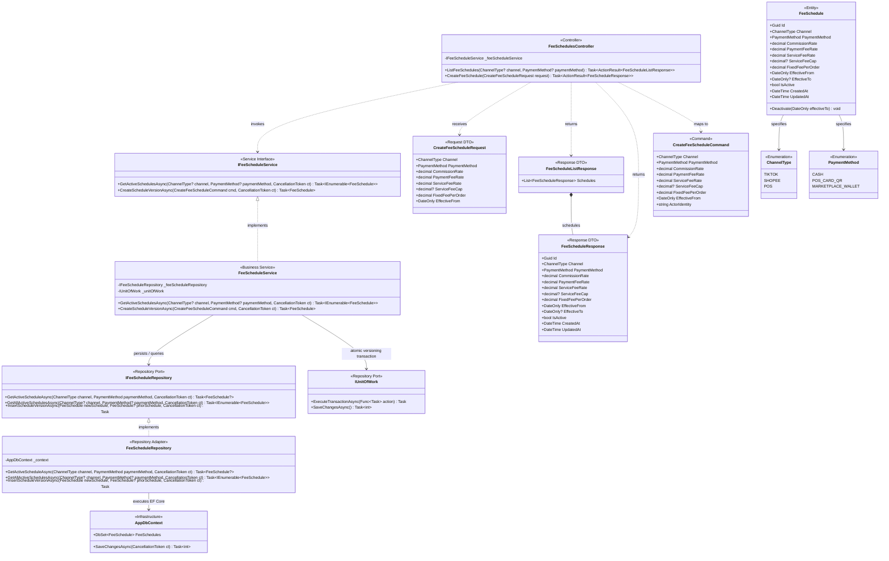

# Class Diagram: Product Catalog & Fee Schedules

> **Target Stack:** ASP.NET Core 8 (.NET 8 3-Tier Architecture) + PostgreSQL 16  
> **Source of Truth Hierarchy:** Requirements $\rightarrow$ Component Backend $\rightarrow$ Database $\rightarrow$ OpenAPI (8 Operations) $\rightarrow$ Folder Structure $\rightarrow$ Class Diagram  

---

## 1. Traceability & Scope Header

| Metadata Attribute | Authoritative Value |
|---|---|
| **Use Cases** | `UC12` (Maintain Baseline Unit Cost & Product Catalog), Supporting configuration for `UC02` (Fee Schedule Policy & Versioning) |
| **OpenAPI Operations** | `GET /catalog/variants/selectable` (`getSelectableVariants`) `GET /catalog/products` (`listProducts`) `POST /catalog/products` (`createProduct`) `GET /catalog/products/{id}` (`getProductById`) `PATCH /catalog/products/{id}` (`updateProduct`) `PATCH /catalog/variants/{id}` (`updateVariant`) `GET /fee-schedules` (`listFeeSchedules`) `POST /fee-schedules` (`createFeeSchedule`) |
| **Source Files** | `FashionWeb.Api/Controllers/CatalogController.cs`, `FeeSchedulesController.cs` `FashionWeb.Api/Contracts/Catalog/*`, `FeeSchedules/*` `FashionWeb.Business/Commands/CreateProductCommand.cs`, `UpdateProductCommand.cs`, `UpdateVariantCommand.cs`, `CreateFeeScheduleCommand.cs` `FashionWeb.Business/Interfaces/Services/ICatalogService.cs`, `IFeeScheduleService.cs` `FashionWeb.Business/Services/CatalogService.cs`, `FeeScheduleService.cs` `FashionWeb.Business/Interfaces/Repositories/IProductRepository.cs`, `IFeeScheduleRepository.cs` `FashionWeb.Business/Domain/Entities/Product.cs`, `ProductVariant.cs`, `FeeSchedule.cs` `FashionWeb.Data/Repositories/ProductRepository.cs`, `FeeScheduleRepository.cs` |
| **Database Tables** | `products`, `product_variants`, `fee_schedules` |
| **Actors & RBAC Permissions** | `Sales & Ops Staff` (`GET /catalog/variants/selectable` only; baseline cost stripped) `Finance Manager` (Full catalog read/write, fee schedule read-only) `Shop Owner` (Full catalog access, fee schedule versioning create) |

---

## 2. Catalog Management Class Diagram (`UC12`)

The Catalog subsystem manages master products, SKU variants, retail prices, and baseline Cost of Goods Sold (COGS). The diagram models strict **Dependency Inversion**, clean boundary mapping between **API DTOs** and **Business Commands**, and strict separation between master catalog baseline pricing and historical order snapshot data.

```mermaid
classDiagram
    direction TB

    %% Presentation Tier
    class CatalogController {
        <<Controller>>
        -ICatalogService _catalogService
        +GetSelectableVariants(string? search) Task~ActionResult~SelectableVariantListResponse~~
        +ListProducts(string? search, int page, int pageSize) Task~ActionResult~PagedProductListResponse~~
        +CreateProduct(CreateProductRequest request) Task~ActionResult~ProductResponse~~
        +GetProductById(Guid id) Task~ActionResult~ProductResponse~~
        +UpdateProduct(Guid id, UpdateProductRequest request) Task~ActionResult~ProductResponse~~
        +UpdateVariant(Guid id, UpdateVariantRequest request) Task~ActionResult~ProductVariantResponse~~
    }

    class CreateProductRequest {
        <<Request DTO>>
        +string Name
        +string? Category
        +List~CreateProductVariantRequest~ Variants
    }

    class CreateProductVariantRequest {
        <<Request DTO>>
        +string SkuCode
        +string? Color
        +string? Size
        +decimal RetailPrice
        +decimal CostPrice
    }

    class UpdateProductRequest {
        <<Request DTO>>
        +string? Name
        +string? Category
        +bool? IsActive
    }

    class UpdateVariantRequest {
        <<Request DTO>>
        +decimal? RetailPrice
        +decimal? CostPrice
        +bool? IsActive
    }

    class PagedProductListResponse {
        <<Response DTO>>
        +List~ProductResponse~ Items
        +int Page
        +int PageSize
        +int TotalItems
        +int TotalPages
    }

    class ProductResponse {
        <<Response DTO>>
        +Guid Id
        +string Name
        +string? Category
        +bool IsActive
        +List~ProductVariantResponse~ Variants
        +DateTime CreatedAt
        +DateTime UpdatedAt
    }

    class ProductVariantResponse {
        <<Response DTO>>
        +Guid Id
        +Guid ProductId
        +string SkuCode
        +string? Color
        +string? Size
        +decimal RetailPrice
        +decimal CostPrice
        +bool IsActive
        +DateTime CreatedAt
        +DateTime UpdatedAt
    }

    class SelectableVariantListResponse {
        <<Response DTO>>
        +List~SelectableVariantResponse~ Variants
    }

    class SelectableVariantResponse {
        <<Response DTO>>
        +Guid Id
        +string SkuCode
        +string ProductName
        +string? Color
        +string? Size
        +decimal RetailPrice
        +bool IsActive
    }

    %% Business Tier
    class ICatalogService {
        <<Service Interface>>
        +GetSelectableVariantsAsync(string? search, CancellationToken ct) Task~IEnumerable~SelectableVariantResult~~
        +ListProductsAsync(string? search, int page, int pageSize, CancellationToken ct) Task~PagedResult~Product~~
        +GetProductByIdAsync(Guid id, CancellationToken ct) Task~Product?~
        +CreateProductAsync(CreateProductCommand cmd, CancellationToken ct) Task~Product~
        +UpdateProductAsync(UpdateProductCommand cmd, CancellationToken ct) Task~Product~
        +UpdateVariantAsync(UpdateVariantCommand cmd, CancellationToken ct) Task~ProductVariant~
    }

    class CatalogService {
        <<Business Service>>
        -IProductRepository _productRepository
        +GetSelectableVariantsAsync(string? search, CancellationToken ct) Task~IEnumerable~SelectableVariantResult~~
        +ListProductsAsync(string? search, int page, int pageSize, CancellationToken ct) Task~PagedResult~Product~~
        +GetProductByIdAsync(Guid id, CancellationToken ct) Task~Product?~
        +CreateProductAsync(CreateProductCommand cmd, CancellationToken ct) Task~Product~
        +UpdateProductAsync(UpdateProductCommand cmd, CancellationToken ct) Task~Product~
        +UpdateVariantAsync(UpdateVariantCommand cmd, CancellationToken ct) Task~ProductVariant~
    }

    class CreateProductCommand {
        <<Command>>
        +string Name
        +string? Category
        +List~CreateVariantItem~ Variants
        +string ActorId
    }

    class UpdateProductCommand {
        <<Command>>
        +Guid Id
        +string? Name
        +string? Category
        +bool? IsActive
        +string ActorId
    }

    class UpdateVariantCommand {
        <<Command>>
        +Guid VariantId
        +decimal? RetailPrice
        +decimal? CostPrice
        +bool? IsActive
        +string ActorId
    }

    class Product {
        <<Entity>>
        +Guid Id
        +string Name
        +string? Category
        +bool IsActive
        +DateTime CreatedAt
        +DateTime UpdatedAt
        +List~ProductVariant~ Variants
        +Deactivate() void
        +UpdateMetadata(string name, string? category) void
    }

    class ProductVariant {
        <<Entity>>
        +Guid Id
        +Guid ProductId
        +string SkuCode
        +string? Color
        +string? Size
        +decimal RetailPrice
        +decimal CostPrice
        +bool IsActive
        +DateTime CreatedAt
        +DateTime UpdatedAt
        +Product Product
        +UpdatePricing(decimal retailPrice, decimal costPrice) void
    }

    class IProductRepository {
        <<Repository Port>>
        +GetSelectableVariantsAsync(string? search, CancellationToken ct) Task~IEnumerable~ProductVariant~~
        +GetPagedProductsAsync(string? search, int page, int pageSize, CancellationToken ct) Task~PagedResult~Product~~
        +GetByIdAsync(Guid id, CancellationToken ct) Task~Product?~
        +GetVariantByIdAsync(Guid variantId, CancellationToken ct) Task~ProductVariant?~
        +ExistsSkuCodeAsync(string skuCode, CancellationToken ct) Task~bool~
        +AddProductAsync(Product product, CancellationToken ct) Task
        +UpdateProductAsync(Product product, CancellationToken ct) Task
        +UpdateVariantAsync(ProductVariant variant, CancellationToken ct) Task
    }

    %% Data Tier
    class ProductRepository {
        <<Repository Adapter>>
        -AppDbContext _context
        +GetSelectableVariantsAsync(string? search, CancellationToken ct) Task~IEnumerable~ProductVariant~~
        +GetPagedProductsAsync(string? search, int page, int pageSize, CancellationToken ct) Task~PagedResult~Product~~
        +GetByIdAsync(Guid id, CancellationToken ct) Task~Product?~
        +GetVariantByIdAsync(Guid variantId, CancellationToken ct) Task~ProductVariant?~
        +ExistsSkuCodeAsync(string skuCode, CancellationToken ct) Task~bool~
        +AddProductAsync(Product product, CancellationToken ct) Task
        +UpdateProductAsync(Product product, CancellationToken ct) Task
        +UpdateVariantAsync(ProductVariant variant, CancellationToken ct) Task
    }

    class AppDbContext {
        <<Infrastructure>>
        +DbSet~Product~ Products
        +DbSet~ProductVariant~ ProductVariants
        +SaveChangesAsync(CancellationToken ct) Task~int~
    }

    %% Relationships
    CatalogController ..> ICatalogService : invokes
    CatalogController ..> CreateProductRequest : receives
    CatalogController ..> UpdateProductRequest : receives
    CatalogController ..> UpdateVariantRequest : receives
    CatalogController ..> SelectableVariantListResponse : returns
    CatalogController ..> PagedProductListResponse : returns
    CatalogController ..> ProductResponse : returns
    CatalogController ..> CreateProductCommand : maps to
    CatalogController ..> UpdateProductCommand : maps to
    CatalogController ..> UpdateVariantCommand : maps to

    CreateProductRequest *-- CreateProductVariantRequest : items
    SelectableVariantListResponse *-- SelectableVariantResponse : contains
    PagedProductListResponse *-- ProductResponse : items

    ICatalogService <|.. CatalogService : implements
    CatalogService --> IProductRepository : queries / persists
    IProductRepository <|.. ProductRepository : implements
    ProductRepository --> AppDbContext : executes EF Core

    Product "1" *-- "0..*" ProductVariant : owns variants
```

### 2.1. Architectural Invariants in Catalog Design
1. **Cost Privacy & Anti-Leakage:** `SelectableVariantResponse` returned for `Sales & Ops Staff` order entry strictly strips `CostPrice`. Only `Finance Manager` and `Shop Owner` can access `ProductVariantResponse.CostPrice`.
2. **Current Baseline vs Historical Snapshot:** `ProductVariant.CostPrice` represents the **current catalog baseline cost**. When an order is placed, `OrderService` reads `ProductVariant.CostPrice` and freezes it permanently into `OrderItem.UnitCostSnapshot`. Subsequent mutations in `ProductVariant.CostPrice` never mutate past orders.
3. **No Description Column:** Conforming to canonical P05 database table `products`, no `Description` property exists in `Product`, `CreateProductRequest`, `UpdateProductRequest`, or `ProductResponse`.

---

## 3. Fee Schedules Class Diagram (Supporting `UC02`)

The Fee Schedule subsystem models administrative policy rates for sales channels. Rate schedules are dynamically loaded into the Strategy Pattern fee engine, completely eliminating hard-coded rates or fee caps.

### 3.1. Versioning & Mathematical Invariants in Fee Schedule
1. **Dynamic Schedule Parameters:**
   - **TikTok Shop:** `CommissionRate` (4.0%), `PaymentFeeRate` (3.0%), `FixedFeePerOrder` (current schedule example 3,000 VND).
   - **Shopee:** `CommissionRate` (4.5%), `PaymentFeeRate` (4.0%), `ServiceFeeRate` (2.0%), `ServiceFeeCap` (dynamically configured via `FeeSchedule.ServiceFeeCap`; eliminating any legacy hard-coded caps).
   - **POS:** Cash (0 VND fees) vs `POS_CARD_QR` (`PaymentFeeRate` 1.0%).
2. **Immutable Versioning Semantics:**
   - When the `Shop Owner` creates a new rate schedule via `POST /fee-schedules`, `FeeScheduleService` deactivates the prior schedule for the matching `(Channel, PaymentMethod)` by setting `EffectiveTo = newSchedule.EffectiveFrom` and `IsActive = false`.
   - Historical orders already delivered reference frozen snapshots in `order_fee_snapshots` and remain completely untouched.
