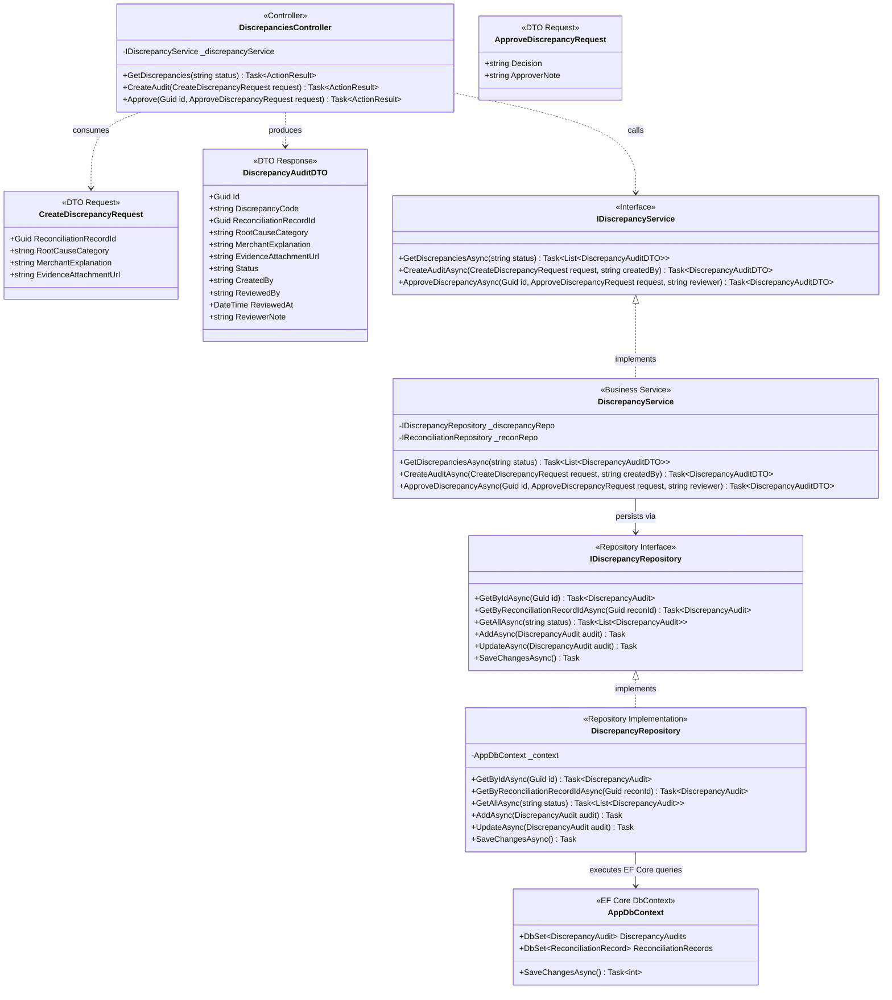
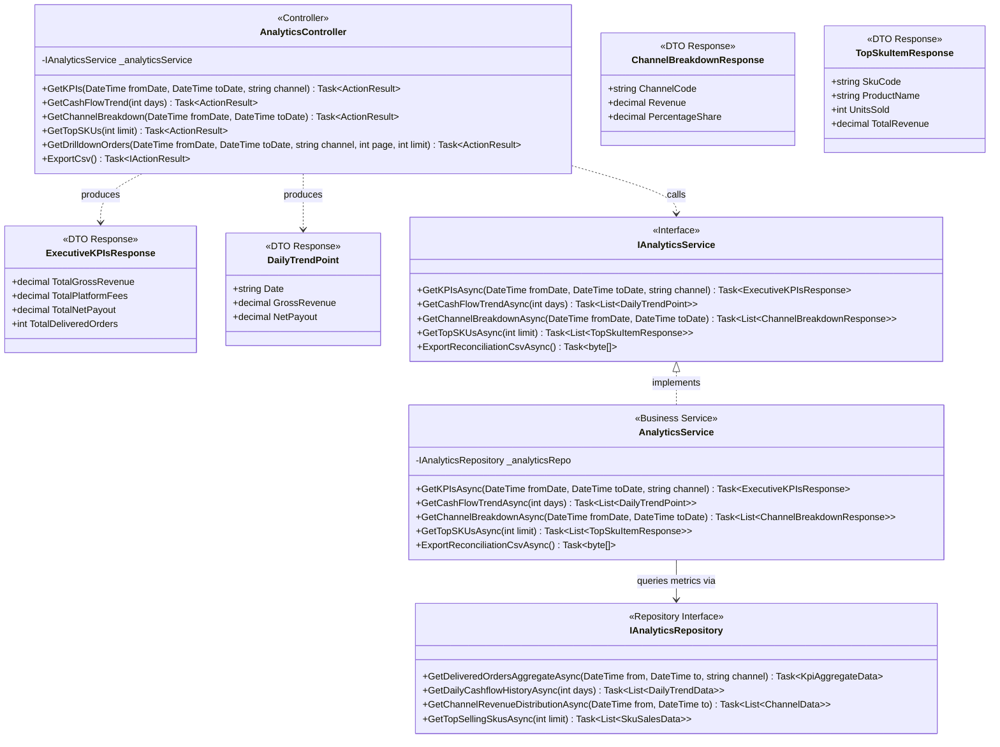
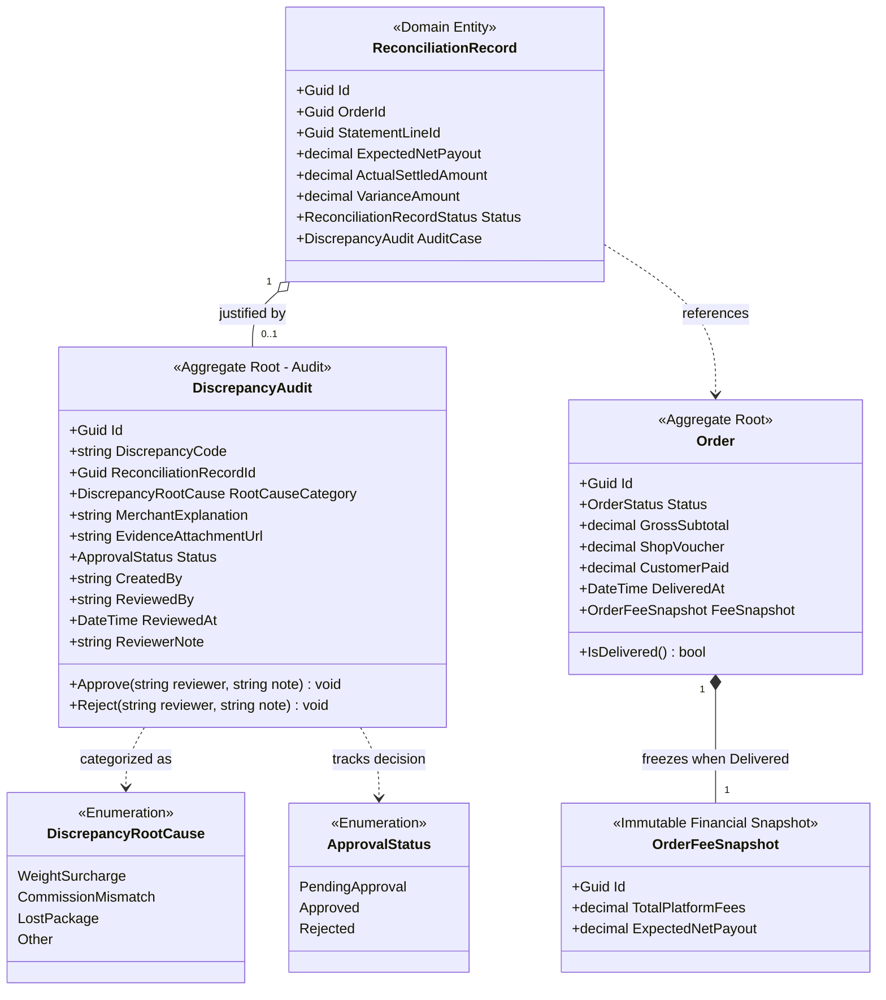

# 04 — Class Diagrams: Discrepancy Audit & Analytics Reporting

## 1. Architectural Scope & Decomposition

This module provides financial control governance and executive decision-making intelligence:
1. **Discrepancy Audit Workflow (#DIS-002):** Enables finance accountants to justify cash shortfalls (e.g., carrier weight penalties or hidden marketplace surcharges) and mandates executive board / shop owner approval.
2. **Executive Analytics & Reporting:** Aggregates real-time financial metrics, 7-day cash flow trends, channel revenue shares, and top SKU leaderboards with CSV export capabilities.

To maintain visual clarity, this bounded context is decomposed into **3 focused sub-diagrams**:
1. **Diagram 4.1 — Discrepancy Audit & Approval 3-Tier Workflow:** Creation, file evidence attachment, and RBAC-governed approval flow.
2. **Diagram 4.2 — Executive Analytics & Reporting Service Flow:** KPI metric computation, trend charting, drilldown tracking, and CSV streaming.
3. **Diagram 4.3 — Audit Domain Entities & Analytical Aggregation Model:** Entity relationships, status enumerations, and financial invariants.

---

## 2. Diagram 4.1: Discrepancy Audit & Approval 3-Tier Workflow

This diagram models the dispute resolution lifecycle where finance managers log audit claims and shop owners make binding approval decisions:



---

## 3. Diagram 4.2: Executive Analytics & Reporting Service Flow

This diagram illustrates how analytical queries strictly aggregate `DELIVERED` orders to prevent phantom revenue reporting:



---

## 4. Diagram 4.3: Audit Domain Entities & Analytical Aggregation Model

This diagram models the entities governing variance justifications and financial aggregation constraints:



---

## 5. Architectural & Financial Invariants Summary

1. **Mandatory Justification Rule for Variances:**
   * Whenever `ReconciliationRecord.VarianceAmount != 0`, creating a `DiscrepancyAudit` case is mandatory to close accounting periods.
   * Root causes are formally categorized into: `WeightSurcharge` (carrier dimensional re-weighing), `CommissionMismatch` (unexpected platform policy deduction), `LostPackage`, or `Other`.
2. **Separation of Duties (RBAC Compliance):**
   * **Sales/Ops:** No access to Discrepancy or Analytics modules.
   * **Finance Manager:** Can file dispute justifications (`CreateAuditAsync`) and view ledger metrics.
   * **Shop Owner / Executive Board:** Holds exclusive authority to execute `Approve` or `Reject` actions on audit cases.
3. **Zero Phantom Revenue Accounting Rule:**
   * In `AnalyticsRepository`, all SQL aggregate queries strictly filter:
     ```sql
     WHERE status = 'DELIVERED'
     ```
   * Orders in `PENDING`, `SHIPPED`, or `CANCELLED` states are 100% excluded, contributing exactly **0 VND** to revenue cards or trend graphs.
4. **CSV Export Streaming:**
   * `ExportReconciliationCsvAsync()` streams detailed audit trails directly from the database into `text/csv` bytes without loading entire historical tables into memory.
