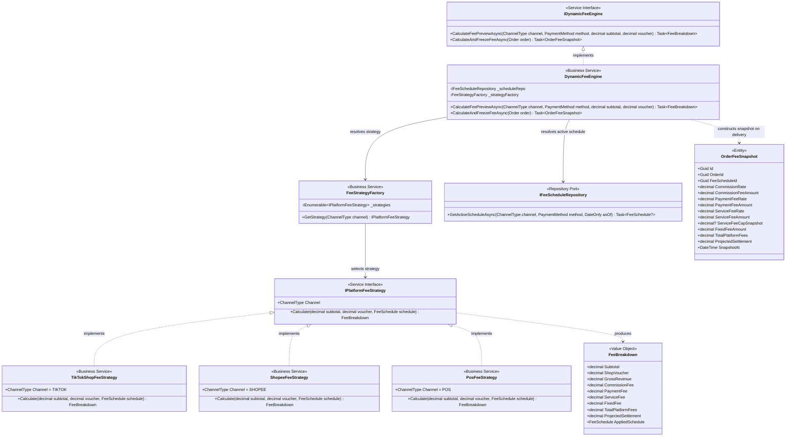
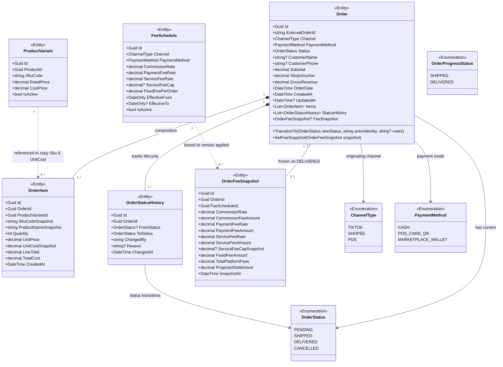

# Class Diagram: Orders Lifecycle & Dynamic Fee Engine

> **Target Stack:** ASP.NET Core 8 (.NET 8 3-Tier Architecture) + PostgreSQL 16  
> **Source of Truth Hierarchy:** Requirements $\rightarrow$ Component Backend $\rightarrow$ Database $\rightarrow$ OpenAPI (7 Orders & Fee Preview Operations) $\rightarrow$ Folder Structure $\rightarrow$ Class Diagram  

---

## 1. Traceability & Scope Header

| Metadata Attribute | Authoritative Value |
|---|---|
| **Use Cases** | `UC01` (Create Order & Baseline Cost Freezing) `UC02` (Real-Time Platform Fee Estimation & Preview) `UC03` (Order Status Progression & Fee Snapshot Freezing on Delivery) `UC04` (Cancel Order Lifecycle Boundary) |
| **OpenAPI Operations** | `POST /orders` (`createOrder`) `POST /orders/preview-fee` (`previewOrderFees`) `GET /orders` (`listOrders`) `GET /orders/summary` (`getOrderSummary`) `GET /orders/{id}` (`getOrderById`) `PATCH /orders/{id}/status` (`updateOrderStatus`) `POST /orders/{id}/cancel` (`cancelOrder`) |
| **Source Files** | `FashionWeb.Api/Controllers/OrdersController.cs` `FashionWeb.Api/Contracts/Orders/*` `FashionWeb.Business/Commands/CreateOrderCommand.cs`, `UpdateOrderStatusCommand.cs`, `CancelOrderCommand.cs` `FashionWeb.Business/Results/OrderListResult.cs`, `OrderDetailResult.cs`, `OrderSummaryResult.cs`, `FeeBreakdownResult.cs` `FashionWeb.Business/Interfaces/Services/IOrderService.cs`, `IDynamicFeeEngine.cs` `FashionWeb.Business/Services/OrderService.cs`, `DynamicFeeEngine.cs` `FashionWeb.Business/Strategies/FeeStrategyFactory.cs`, `IPlatformFeeStrategy.cs`, `TikTokShopFeeStrategy.cs`, `ShopeeFeeStrategy.cs`, `PosFeeStrategy.cs` `FashionWeb.Business/Interfaces/Repositories/IOrderRepository.cs`, `IProductRepository.cs`, `IFeeScheduleRepository.cs`, `IReconciliationRepository.cs`, `IUnitOfWork.cs` `FashionWeb.Business/Domain/Entities/Order.cs`, `OrderItem.cs`, `OrderStatusHistory.cs`, `OrderFeeSnapshot.cs`, `FeeSchedule.cs` `FashionWeb.Business/Domain/Enums/ChannelType.cs`, `PaymentMethod.cs`, `OrderStatus.cs`, `OrderProgressStatus.cs` `FashionWeb.Business/Domain/ValueObjects/FeeBreakdown.cs` `FashionWeb.Data/Repositories/OrderRepository.cs`, `FeeScheduleRepository.cs`, `UnitOfWork.cs` |
| **Target Database Tables** | `orders`, `order_items`, `order_status_history`, `order_fee_snapshots`, `fee_schedules`, `reconciliation_records` |
| **Actors & RBAC Permissions** | `Sales & Ops Staff` (Create order, preview fees, query orders, update status to SHIPPED/DELIVERED, cancel order) `Finance Manager` (Query orders, view audit trail and fee snapshots) `Shop Owner` (Full access across all order operations) |

---

## 2. Orders Orchestration & Application Architecture

This subsystem coordinates order creation, cost freeze, status transitions, fee calculation previews, and atomic persistence.

### Architectural Rules
1. **Dependency Inversion:** `OrdersController` depends strictly on abstractions (`IOrderService`, `IDynamicFeeEngine`). Concrete services depend on repository ports (`IOrderRepository`, `IProductRepository`, `IFeeScheduleRepository`, `IUnitOfWork`), never on `AppDbContext`.
2. **DTO & Command Separation:** Client JSON requests map to Request DTOs in `FashionWeb.Api`. The Controller extracts the authenticated user identity (`ActorIdentity`) as a string from JWT claims and builds a typed `Command` passed to `IOrderService`.
3. **Business Results:** `OrderService` returns typed Domain Entities or `Result` models from `FashionWeb.Business.Results`. The Controller maps these into OpenAPI Response DTOs.
4. **Transaction Abstraction (`IUnitOfWork`):** On order creation, delivery progression, or cancellation, multi-table persistence operations occur atomically within `IUnitOfWork.ExecuteTransactionAsync()`.

```mermaid
classDiagram
    direction TB

    %% Presentation Tier
    class OrdersController {
        <<Controller>>
        -IOrderService _orderService
        -IDynamicFeeEngine _feeEngine
        +CreateOrder(CreateOrderRequest request) Task~ActionResult~OrderDetailResponse~~
        +PreviewFee(FeePreviewRequest request) Task~ActionResult~FeeBreakdownResponse~~
        +ListOrders(OrderListFilterRequest filter) Task~ActionResult~PagedOrderListResponse~~
        +GetOrderSummary(DateTime? fromDate, DateTime? toDate) Task~ActionResult~OrderSummaryResponse~~
        +GetOrderById(Guid id) Task~ActionResult~OrderDetailResponse~~
        +UpdateOrderStatus(Guid id, UpdateOrderStatusRequest request) Task~ActionResult~OrderDetailResponse~~
        +CancelOrder(Guid id, CancelOrderRequest request) Task~ActionResult~OrderDetailResponse~~
    }

    class CreateOrderRequest {
        <<Request DTO>>
        +string ExternalOrderId
        +ChannelType Channel
        +PaymentMethod PaymentMethod
        +string? CustomerName
        +string? CustomerPhone
        +decimal ShopVoucher
        +List~CreateOrderItemRequest~ Items
    }

    class CreateOrderItemRequest {
        <<Request DTO>>
        +Guid ProductVariantId
        +int Quantity
        +decimal UnitPrice
    }

    class FeePreviewRequest {
        <<Request DTO>>
        +ChannelType Channel
        +PaymentMethod PaymentMethod
        +decimal Subtotal
        +decimal ShopVoucher
    }

    class UpdateOrderStatusRequest {
        <<Request DTO>>
        +OrderProgressStatus ToStatus
    }

    class CancelOrderRequest {
        <<Request DTO>>
        +string CancellationReason
    }

    class OrderDetailResponse {
        <<Response DTO>>
        +Guid Id
        +string ExternalOrderId
        +ChannelType Channel
        +PaymentMethod PaymentMethod
        +OrderStatus Status
        +string? CustomerName
        +string? CustomerPhone
        +decimal Subtotal
        +decimal ShopVoucher
        +decimal GrossRevenue
        +DateTime OrderDate
        +List~OrderItemResponse~ Items
        +List~OrderStatusHistoryResponse~ StatusHistory
        +OrderFeeSnapshotResponse? FeeSnapshot
    }

    class FeeBreakdownResponse {
        <<Response DTO>>
        +decimal Subtotal
        +decimal ShopVoucher
        +decimal GrossRevenue
        +decimal CommissionFee
        +decimal PaymentFee
        +decimal ServiceFee
        +decimal FixedFee
        +decimal TotalPlatformFees
        +decimal ProjectedSettlement
    }

    %% Application / Business Commands & Results
    class CreateOrderCommand {
        <<Command>>
        +string ExternalOrderId
        +ChannelType Channel
        +PaymentMethod PaymentMethod
        +string? CustomerName
        +string? CustomerPhone
        +decimal ShopVoucher
        +List~CreateOrderItemCommandItem~ Items
        +string ActorIdentity
    }

    class UpdateOrderStatusCommand {
        <<Command>>
        +Guid OrderId
        +OrderProgressStatus ToStatus
        +string ActorIdentity
    }

    class CancelOrderCommand {
        <<Command>>
        +Guid OrderId
        +string CancellationReason
        +string ActorIdentity
    }

    class FeeBreakdownResult {
        <<Result>>
        +decimal Subtotal
        +decimal ShopVoucher
        +decimal GrossRevenue
        +decimal CommissionFee
        +decimal PaymentFee
        +decimal ServiceFee
        +decimal FixedFee
        +decimal TotalPlatformFees
        +decimal ProjectedSettlement
    }

    %% Service Contracts
    class IOrderService {
        <<Service Interface>>
        +CreateOrderAsync(CreateOrderCommand command) Task~Order~
        +GetOrderByIdAsync(Guid id) Task~Order?~
        +ListOrdersAsync(OrderQueryFilter filter) Task~PagedResult~Order~~
        +GetSummaryAsync(DateTime? fromDate, DateTime? toDate) Task~OrderSummaryResult~
        +UpdateOrderStatusAsync(UpdateOrderStatusCommand command) Task~Order~
        +CancelOrderAsync(CancelOrderCommand command) Task~Order~
    }

    class IDynamicFeeEngine {
        <<Service Interface>>
        +CalculateFeePreviewAsync(ChannelType channel, PaymentMethod method, decimal subtotal, decimal voucher) Task~FeeBreakdown~
        +CalculateAndFreezeFeeAsync(Order order) Task~OrderFeeSnapshot~
    }

    %% Business Service Implementations
    class OrderService {
        <<Business Service>>
        -IOrderRepository _orderRepo
        -IProductRepository _productRepo
        -IReconciliationRepository _reconRepo
        -IDynamicFeeEngine _feeEngine
        -IUnitOfWork _unitOfWork
        +CreateOrderAsync(CreateOrderCommand command) Task~Order~
        +GetOrderByIdAsync(Guid id) Task~Order?~
        +ListOrdersAsync(OrderQueryFilter filter) Task~PagedResult~Order~~
        +GetSummaryAsync(DateTime? fromDate, DateTime? toDate) Task~OrderSummaryResult~
        +UpdateOrderStatusAsync(UpdateOrderStatusCommand command) Task~Order~
        +CancelOrderAsync(CancelOrderCommand command) Task~Order~
    }

    %% Persistence Ports & UnitOfWork
    class IOrderRepository {
        <<Repository Port>>
        +GetByIdAsync(Guid id) Task~Order?~
        +GetByExternalIdAsync(ChannelType channel, string externalOrderId) Task~Order?~
        +ListAsync(OrderQueryFilter filter) Task~PagedResult~Order~~
        +GetSummaryAsync(DateTime? fromDate, DateTime? toDate) Task~OrderSummaryResult~
        +AddAsync(Order order) Task
        +UpdateAsync(Order order) Task
        +AddStatusHistoryAsync(OrderStatusHistory history) Task
        +AddFeeSnapshotAsync(OrderFeeSnapshot snapshot) Task
    }

    class IProductRepository {
        <<Repository Port>>
        +GetVariantByIdAsync(Guid variantId) Task~ProductVariant?~
        +GetVariantsByIdsAsync(IEnumerable~Guid~ variantIds) Task~List~ProductVariant~~
    }

    class IUnitOfWork {
        <<Repository Port>>
        +ExecuteTransactionAsync(Func~Task~ action) Task
        +SaveChangesAsync() Task~int~
    }

    class OrderRepository {
        <<Repository Adapter>>
        -AppDbContext _context
    }

    class UnitOfWork {
        <<Repository Adapter>>
        -AppDbContext _context
        +ExecuteTransactionAsync(Func~Task~ action) Task
        +SaveChangesAsync() Task~int~
    }

    class AppDbContext {
        <<Infrastructure>>
    }

    %% Relationships
    OrdersController ..> IOrderService : invokes
    OrdersController ..> IDynamicFeeEngine : invokes preview
    OrdersController ..> CreateOrderRequest : binds
    OrdersController ..> FeePreviewRequest : binds
    OrdersController ..> UpdateOrderStatusRequest : binds
    OrdersController ..> CancelOrderRequest : binds
    OrdersController ..> OrderDetailResponse : returns
    OrdersController ..> FeeBreakdownResponse : returns
    OrdersController ..> CreateOrderCommand : maps to
    OrdersController ..> UpdateOrderStatusCommand : maps to
    OrdersController ..> CancelOrderCommand : maps to

    IOrderService <|.. OrderService : implements
    OrderService --> IOrderRepository : uses
    OrderService --> IProductRepository : queries baseline cost
    OrderService --> IDynamicFeeEngine : invokes on delivery
    OrderService --> IUnitOfWork : atomic operations

    IOrderRepository <|.. OrderRepository : implements
    IUnitOfWork <|.. UnitOfWork : implements
    OrderRepository --> AppDbContext : executes SQL
    UnitOfWork --> AppDbContext : manages transaction
```

---

## 3. Dynamic Fee Engine & Strategy Pattern Design

The Dynamic Fee Engine evaluates platform fee schedules dynamically based on the current active `FeeSchedule` stored in PostgreSQL.

### Key Strategy Invariants
1. **Controller Decoupling:** `OrdersController` communicates exclusively with `IDynamicFeeEngine`. It **never** instantiates or directly references `FeeStrategyFactory` or concrete strategies.
2. **Dynamic Rates from Database:** Neither the strategies nor the factory contain hard-coded fee percentages or hard-coded fee caps. They receive the configured `FeeSchedule` fetched by `DynamicFeeEngine` from `IFeeScheduleRepository`.
3. **Zero Mutation during Preview (`UC02`):** `CalculateFeePreviewAsync` performs an in-memory calculation using current fee schedules and writes nothing to the database.
4. **Canonical Financial Fields:** All calculations compute `Subtotal`, `ShopVoucher`, `GrossRevenue`, `CommissionFee`, `PaymentFee`, `ServiceFee`, `FixedFee`, `TotalPlatformFees`, and `ProjectedSettlement`.

### Strategy Formula Specification

| Platform Strategy | Formula Executed Against `FeeSchedule` Parameter |
|---|---|
| **TikTokShopFeeStrategy** | $\text{GrossRevenue} = \text{Subtotal} - \text{ShopVoucher}$ $\text{CommissionFee} = \text{Subtotal} \times \text{CommissionRate}$ $\text{PaymentFee} = \text{GrossRevenue} \times \text{PaymentFeeRate}$ $\text{ServiceFee} = 0$ $\text{FixedFee} = \text{FixedFeePerOrder}$ $\text{TotalPlatformFees} = \text{CommissionFee} + \text{PaymentFee} + \text{FixedFee}$ $\text{ProjectedSettlement} = \text{GrossRevenue} - \text{TotalPlatformFees}$ |
| **ShopeeFeeStrategy** | $\text{GrossRevenue} = \text{Subtotal} - \text{ShopVoucher}$ $\text{CommissionFee} = \text{Subtotal} \times \text{CommissionRate}$ $\text{PaymentFee} = \text{GrossRevenue} \times \text{PaymentFeeRate}$ $\text{UncappedServiceFee} = \text{Subtotal} \times \text{ServiceFeeRate}$ $\text{ServiceFee} = \min(\text{UncappedServiceFee}, \text{ServiceFeeCap} \text{ if configured else } \text{UncappedServiceFee})$ $\text{FixedFee} = \text{FixedFeePerOrder}$ $\text{TotalPlatformFees} = \text{CommissionFee} + \text{PaymentFee} + \text{ServiceFee} + \text{FixedFee}$ $\text{ProjectedSettlement} = \text{GrossRevenue} - \text{TotalPlatformFees}$ |
| **PosFeeStrategy** | $\text{GrossRevenue} = \text{Subtotal} - \text{ShopVoucher}$ $\text{CommissionFee} = 0$ $\text{PaymentFee} = \text{GrossRevenue} \times \text{PaymentFeeRate}$ (if `POS_CARD_QR`, else 0 for `CASH`) $\text{ServiceFee} = 0, \quad \text{FixedFee} = 0$ $\text{TotalPlatformFees} = \text{PaymentFee}$ $\text{ProjectedSettlement} = \text{GrossRevenue} - \text{TotalPlatformFees}$ |

---

## 4. Orders Domain Entity Model & Cardinalities

This domain model matches the canonical schema declared in `docs/database/schema.dbml` (P05) and enforces cost freezing and fee snapshot immutability.

### Invariant Rules on Order Domain
1. **P05 Snapshot Rule:** `OrderItem` freezes `SkuCodeSnapshot`, `ProductNameSnapshot`, and `UnitCostSnapshot` immediately upon order creation (`POST /orders`). If a Shop Owner edits baseline product costs in Catalog later (`UC12`), historical order costs and historical COGS remain unchanged.
2. **Client Request Sanitization:** `CreateOrderRequest` accepts `externalOrderId`, `channel`, `paymentMethod`, `customerName`, `customerPhone`, `shopVoucher`, and `items` (`productVariantId`, `quantity`, `unitPrice`). The client **cannot** supply `productName`, `skuCode`, or `costPrice`. These values are read directly from `ProductVariant` in the database.
3. **Canonical Field Names:** `Order` utilizes `ExternalOrderId`, `Subtotal`, `ShopVoucher`, `GrossRevenue`, and `OrderDate`. Non-existent fields such as legacy internal codes are strictly absent.
4. **Lifecycle Constraints:** All orders begin in status `PENDING`. Direct transition to `DELIVERED` on order creation is forbidden. Direct store POS orders must transition from `PENDING` $\rightarrow$ `DELIVERED`.
5. **Fee Snapshot Immutability:** `OrderFeeSnapshot` does not carry a dedicated immutability column in the database; immutability is an architectural invariant enforced because `OrderService` only creates a snapshot once upon reaching `DELIVERED` status and never issues SQL updates against `order_fee_snapshots`.
6. **Actor Tracking:** `changed_by` in `OrderStatusHistory` stores `string` (max 100 chars), matching the database column type.

---

## 5. OpenAPI Operations Traceability Table

| Endpoint | Method | Controller Action | Command / Parameter | Service Invocations | Database Operations |
|---|---|---|---|---|---|
| `/orders` | `POST` | `OrdersController.CreateOrder` | `CreateOrderCommand` | `IOrderService.CreateOrderAsync` `IProductRepository.GetVariantsByIdsAsync` `IUnitOfWork.ExecuteTransactionAsync` | Check unique `(channel, external_order_id)` Look up `product_variants` Atomic commit: Insert `orders`, `order_items`, `order_status_history` (`PENDING`) |
| `/orders/preview-fee` | `POST` | `OrdersController.PreviewFee` | `FeePreviewRequest` | `IDynamicFeeEngine.CalculateFeePreviewAsync` `IFeeScheduleRepository.GetActiveScheduleAsync` | Read `fee_schedules` **Zero database writes** |
| `/orders` | `GET` | `OrdersController.ListOrders` | `OrderQueryFilter` | `IOrderService.ListOrdersAsync` `IOrderRepository.ListAsync` | Read `orders`, `order_items`, `order_fee_snapshots` |
| `/orders/summary` | `GET` | `OrdersController.GetOrderSummary` | `fromDate`, `toDate` | `IOrderService.GetSummaryAsync` `IOrderRepository.GetSummaryAsync` | Read aggregated count/status metrics on `orders` |
| `/orders/{id}` | `GET` | `OrdersController.GetOrderById` | `Guid id` | `IOrderService.GetOrderByIdAsync` `IOrderRepository.GetByIdAsync` | Read `orders` + joins on `order_items`, `order_status_history`, `order_fee_snapshots` |
| `/orders/{id}/status` | `PATCH` | `OrdersController.UpdateOrderStatus` | `UpdateOrderStatusCommand` | `IOrderService.UpdateOrderStatusAsync` `IDynamicFeeEngine.CalculateAndFreezeFeeAsync` `IUnitOfWork.ExecuteTransactionAsync` | Update `orders.status` Insert `order_status_history` If `DELIVERED`: Insert `order_fee_snapshots` & Insert `reconciliation_records` (`PENDING_SETTLEMENT`) |
| `/orders/{id}/cancel` | `POST` | `OrdersController.CancelOrder` | `CancelOrderCommand` | `IOrderService.CancelOrderAsync` `IUnitOfWork.ExecuteTransactionAsync` | Guard checks: If `DELIVERED` $\rightarrow$ 422. If `PENDING`/`SHIPPED` $\rightarrow$ Atomic commit: Update `orders.status = 'CANCELLED'`, Insert `order_status_history` |
