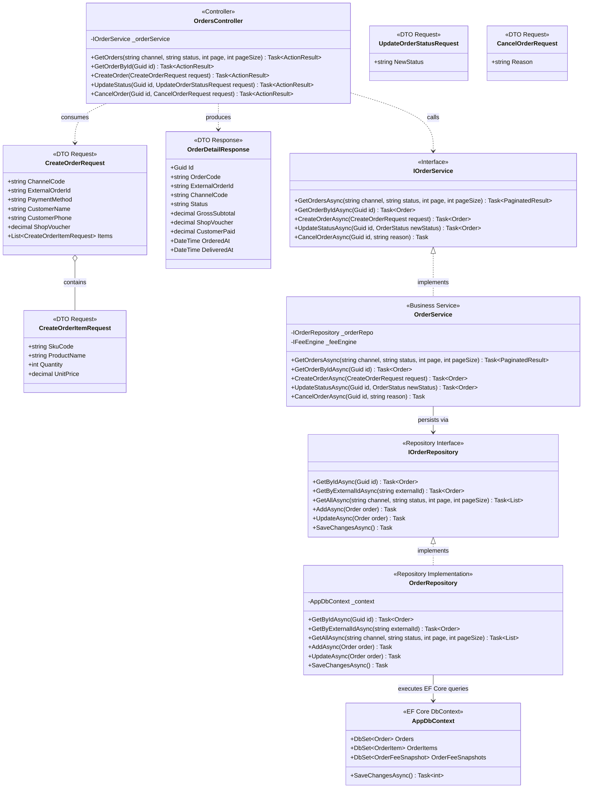
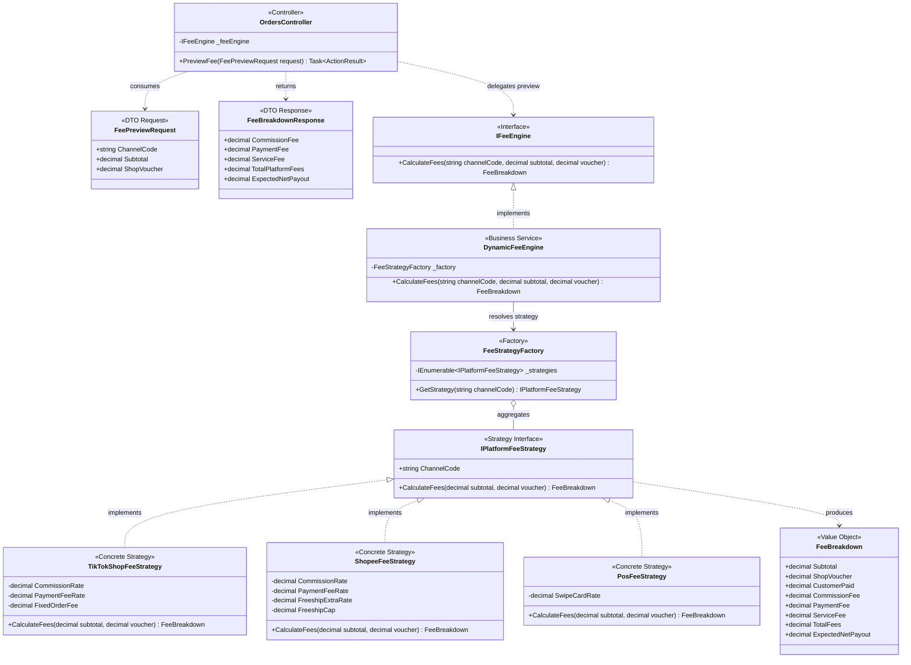
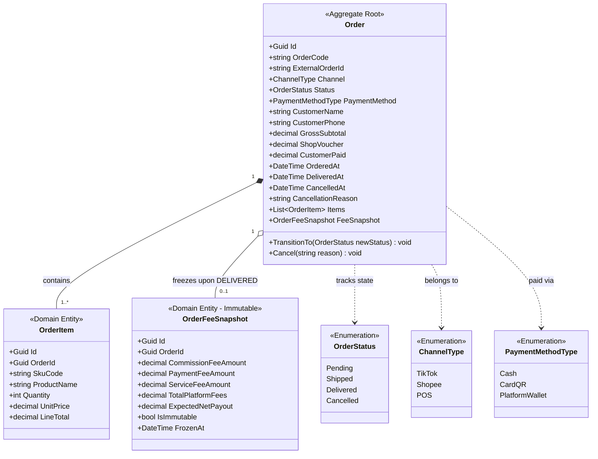

# 02 — Class Diagrams: Orders & Fee Engine

> **Project:** FASHION-WEB — Multi-Channel Revenue & Cash Flow Settlement Management  
> **Module:** Orders Management (SCR-01 / MOD-01 / MOD-02) & Dynamic Fee Engine  
> **Layer Scope:** Presentation (`FashionWeb.Api`), Business (`FashionWeb.Business`), Data (`FashionWeb.Data`)  
> **Architecture Pattern:** Clean Architecture 3-Tier, Strategy Pattern, Immutable Snapshot

---

## 1. Architectural Scope & Decomposition

To ensure optimal readability and maintainability, this module is decomposed into **3 focused sub-diagrams**:
1. **Diagram 2.1 — 3-Tier API & Service Orchestration:** End-to-end Dependency Injection flow from Controller through Business Service to Data Repository.
2. **Diagram 2.2 — Platform Fee Strategy Pattern Engine:** Decoupled calculation engine for marketplace deductions (TikTok, Shopee, POS).
3. **Diagram 2.3 — Domain Entities & Immutable Financial Snapshot:** Domain Aggregate Root, line items, and audit-proof frozen snapshots.

---

## 2. Diagram 2.1: 3-Tier API & Service Orchestration

This diagram illustrates how client HTTP requests flow across process and layer boundaries under Clean Architecture rules:

---

## 3. Diagram 2.2: Platform Fee Strategy Pattern Engine

This diagram encapsulates channel-specific deduction algorithms behind abstract contracts, satisfying the **Open/Closed Principle (OCP)**:

---

## 4. Diagram 2.3: Domain Entities & Immutable Snapshot Model

This diagram models the financial state machine and aggregate structure governing the **Zero Phantom Revenue** rule:

---

## 5. Architectural & Financial Invariants Summary

1. **Strategy Pattern Rules:**
   - TikTok Shop: `Commission = 4.0% * Subtotal`, `Payment = 3.0% * CustomerPaid`, `Fixed = 2,000 VND`.
   - Shopee: `Commission = 4.5% * Subtotal`, `Payment = 4.0% * CustomerPaid`, `Freeship Xtra = Min(2.0% * Subtotal, 20,000 VND)`.
   - In-Store POS: `Card/QR = 1.0% * CustomerPaid`, `Cash = 0 VND`.
2. **Zero Phantom Revenue:** Revenue is recognized if and only if `Order.Status == OrderStatus.Delivered`. Pending or Shipped orders contribute exactly 0 VND to financial ledgers.
3. **Immutable Snapshot Guarantee:** Upon transitioning to `DELIVERED`, `OrderFeeSnapshot` is created and locked with `IsImmutable = true`. Future platform fee policy changes will never alter historical settled orders.
4. **Monetary Precision:** 100% of currency fields use C# `decimal` mapped to PostgreSQL `NUMERIC(18,0)` VND. Floating-point types (`float`, `double`) are strictly prohibited.
