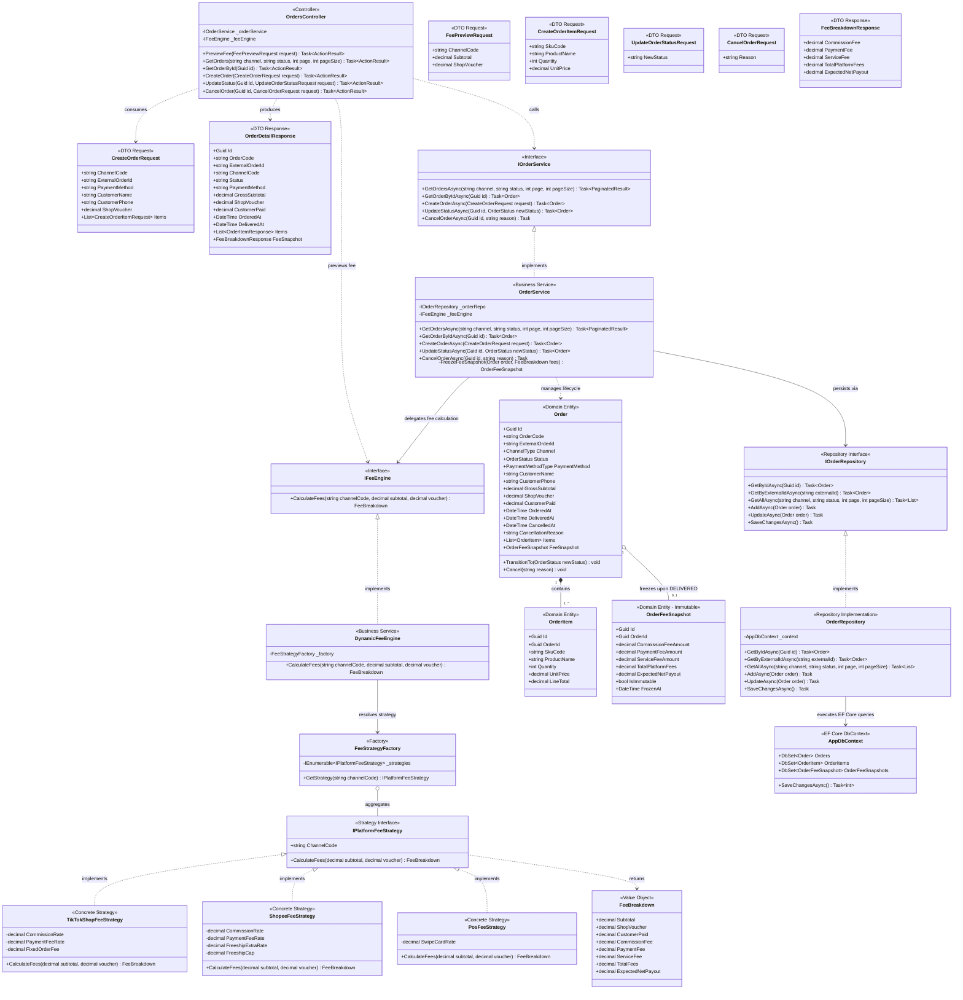

# 02 — Class Diagram: Orders & Fee Engine

> **Project:** FASHION-WEB — Multi-Channel Revenue & Cash Flow Settlement Management  
> **Module:** Orders Management (SCR-01 / MOD-01 / MOD-02) & Dynamic Fee Engine  
> **Layer Scope:** Presentation (`FashionWeb.Api`), Business (`FashionWeb.Business`), Data (`FashionWeb.Data`)

---

## 1. Architectural Role & Responsibilities

This bounded context governs multi-channel order ingestion, lifecycle state transitions, live fee unbundling, and immutable financial snapshotting:
1. **Zero Phantom Revenue:** Revenue is recognized strictly upon `DELIVERED` status.
2. **Strategy Pattern for Fees:** Channel deduction formulas (TikTok Shop, Shopee, POS) are decoupled behind `IPlatformFeeStrategy`.
3. **Immutable Snapshot Pattern:** When an order transitions to `DELIVERED`, computed fees are frozen forever into `OrderFeeSnapshot`.

---

## 2. Orders & Fee Engine Class Diagram

---

## 3. Core Design Patterns & Business Invariants

### 3.1. Strategy Pattern: Platform Fee Engine
* **Formula Isolation:**
  * **TikTok Shop:** `Commission = 4.0% * Subtotal`, `Payment = 3.0% * CustomerPaid`, `Fixed = 2,000 VND`.
  * **Shopee:** `Commission = 4.5% * Subtotal`, `Payment = 4.0% * CustomerPaid`, `Freeship Xtra = Min(2.0% * Subtotal, 20,000 VND)`.
  * **In-Store POS:** `Card/QR Swipe = 1.0% * CustomerPaid`, `Cash = 0 VND`.
* **Extensibility:** Onboarding a new channel (e.g., Lazada, Tiki) requires creating 1 new class implementing `IPlatformFeeStrategy` without modifying `OrderService` (Open/Closed Principle).

### 3.2. Immutable Snapshot Pattern
* When an order transitions to `DELIVERED`, `OrderService` calls `IFeeEngine`, instantiates `OrderFeeSnapshot`, and sets `IsImmutable = true`.
* Once saved, historical fee deductions remain permanent even if platform commission schedules change in the future.

### 3.3. Financial Arithmetic Constraint
* 100% of monetary properties use C# `decimal` mapped to PostgreSQL `NUMERIC(18,0)` VND. Floating-point types (`float`, `double`) are strictly prohibited.
