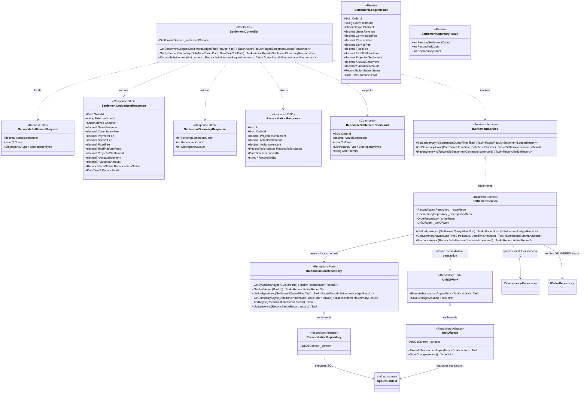
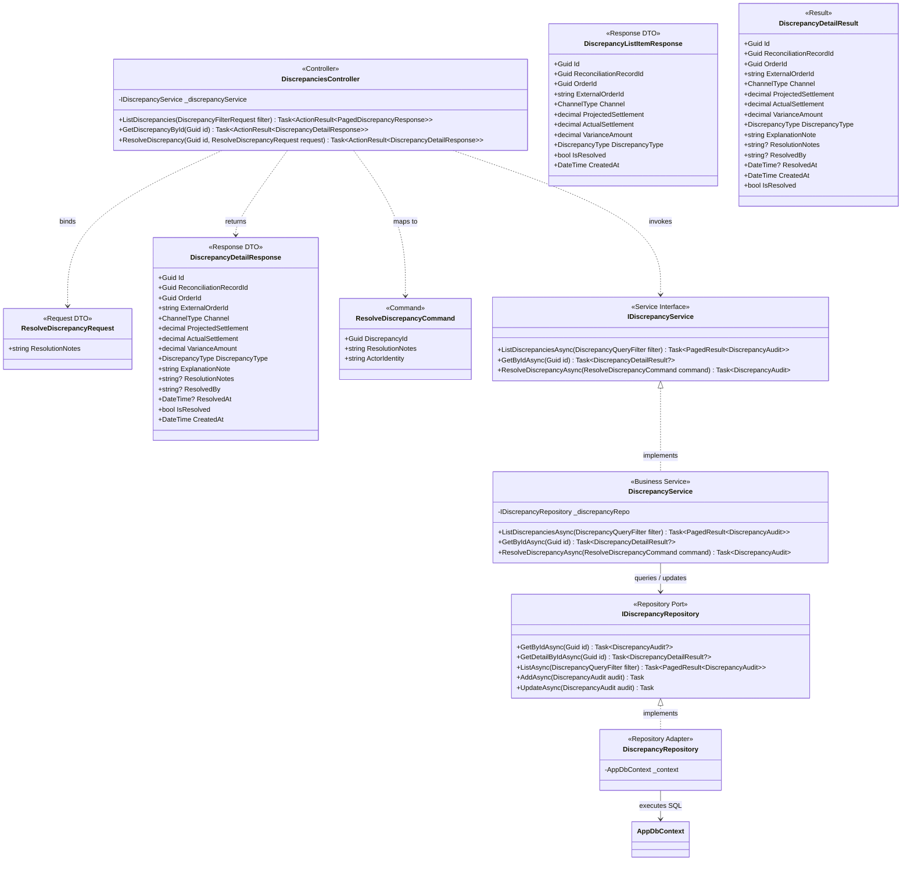
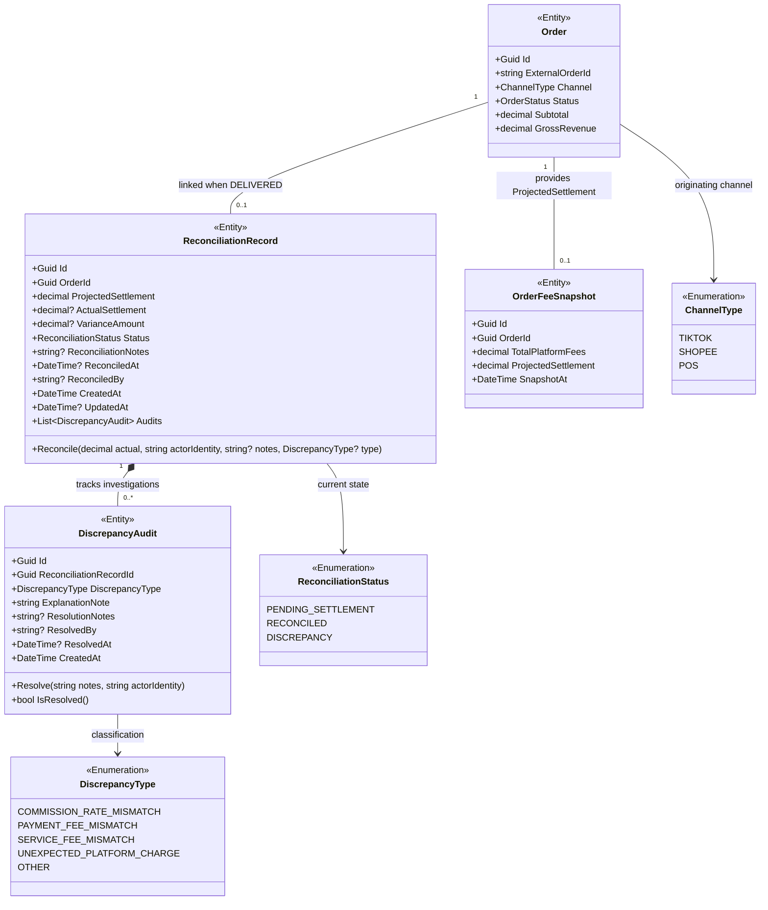

# Class Diagram: Settlement Reconciliation & Discrepancy Resolution

> **Target Stack:** ASP.NET Core 8 (.NET 8 3-Tier Architecture) + PostgreSQL 16  
> **Source of Truth Hierarchy:** Requirements $\rightarrow$ Component Backend $\rightarrow$ Database $\rightarrow$ OpenAPI (6 Operations) $\rightarrow$ Folder Structure $\rightarrow$ Class Diagram  

---

## 1. Traceability & Scope Header

| Metadata Attribute | Authoritative Value |
|---|---|
| **Use Cases** | `UC05` (Settlement Ledger & Reconciliation Status Ingestion) `UC06` (Manual Settlement Reconciliation & Variance Computation) `UC07` (Discrepancy Audit Investigation & Resolution) |
| **OpenAPI Operations** | `GET /settlements` (`getSettlementLedger`) `GET /settlements/summary` (`getSettlementSummary`) `POST /settlements/{orderId}/reconcile` (`reconcileSettlement`) `GET /discrepancies` (`listDiscrepancies`) `GET /discrepancies/{id}` (`getDiscrepancyById`) `PATCH /discrepancies/{id}/resolve` (`resolveDiscrepancy`) |
| **Source Files** | `FashionWeb.Api/Controllers/SettlementController.cs`, `DiscrepanciesController.cs` `FashionWeb.Api/Contracts/Settlement/*`, `Discrepancies/*` `FashionWeb.Business/Commands/ReconcileSettlementCommand.cs`, `ResolveDiscrepancyCommand.cs` `FashionWeb.Business/Results/SettlementLedgerResult.cs`, `SettlementSummaryResult.cs`, `DiscrepancyDetailResult.cs` `FashionWeb.Business/Interfaces/Services/ISettlementService.cs`, `IDiscrepancyService.cs` `FashionWeb.Business/Services/SettlementService.cs`, `DiscrepancyService.cs` `FashionWeb.Business/Interfaces/Repositories/IReconciliationRepository.cs`, `IDiscrepancyRepository.cs`, `IOrderRepository.cs`, `IUnitOfWork.cs` `FashionWeb.Business/Domain/Entities/ReconciliationRecord.cs`, `DiscrepancyAudit.cs` `FashionWeb.Business/Domain/Enums/ChannelType.cs`, `ReconciliationStatus.cs`, `DiscrepancyType.cs` `FashionWeb.Data/Repositories/ReconciliationRepository.cs`, `DiscrepancyRepository.cs`, `UnitOfWork.cs` |
| **Target Database Tables** | `reconciliation_records`, `discrepancy_audits`, `orders`, `order_fee_snapshots` |
| **Actors & RBAC Permissions** | `Sales & Ops Staff` (No Access) `Finance Manager` (Read ledger/summary, reconcile settlements, view discrepancies, resolve discrepancies) `Shop Owner` (Full access across settlements and discrepancies) |

---

## 2. Settlement Reconciliation Architecture (`UC05`, `UC06`)

Settlement management provides visibility into platform fees and handles manual payout reconciliation against projected settlements.

### Invariants & Design Rules
1. **Manual Entry Target:** There are no automated batch statement ingestion pipelines, hash deduplication mechanisms, or statement line parsing tables. Finance Managers inspect the frozen projected settlement and manually record the actual payout received from the channel.
2. **Canonical Variance Formula:**
   $$\text{VarianceAmount} = \text{ProjectedSettlement} - \text{ActualSettlement}$$
   *(A positive variance denotes an underpayment/unexpected deduction by the platform; a negative variance indicates an overpayment).*
3. **Reconciliation Outcomes:**
   - When $\text{VarianceAmount} == 0 \implies \text{Status} = \text{RECONCILED}$ (notes & discrepancyType optional)
   - When $\text{VarianceAmount} \ne 0 \implies \text{Status} = \text{DISCREPANCY}$ (`notes` and `discrepancyType` mandatory; automatically spawns a `DiscrepancyAudit` record using `notes` as `explanation_note`).
4. **Order State Invariance:** After reconciliation, the corresponding `Order` status remains `DELIVERED`. Reconciliation updates the settlement ledger and financial state, not the logistical order status.
5. **Transaction Boundary (`IUnitOfWork`):** Reconciling an order with a variance atomically updates `reconciliation_records` and inserts `discrepancy_audits`.

---

## 3. Discrepancy Investigation & Resolution Architecture (`UC07`)

When manual reconciliation encounters a difference between projected and actual payouts, the system captures a structured discrepancy audit log. Finance Managers and Shop Owners investigate and record corrective resolution notes.

### Invariants & Design Rules
1. **No Multi-Stage Approval Workflows:** Obsolete multi-stage governance statuses, two-man sign-off requests, and file attachment URLs from discarded drafts are completely eliminated. Both Finance Managers and Shop Owners possess direct operational authority to review and resolve discrepancies.
2. **Simplified RBAC Resolution:** Both Finance Managers and Shop Owners possess permissions to review and resolve discrepancies via `PATCH /discrepancies/{id}/resolve`.
3. **Resolution State Derivation:** The entity does not maintain an unnecessary `isResolved` boolean column. The resolution status is derived:
   $$\text{IsResolved} = (\text{ResolvedAt} \ne \text{null})$$
4. **Resolution Immutability:** Resolving a discrepancy updates `ResolutionNotes`, `ResolvedBy`, and `ResolvedAt`.

---

## 4. Settlement Domain Model & Canonical Relationships

---

## 5. OpenAPI Operations Traceability Table

| Endpoint | Method | Controller Action | Command / Parameter | Service Invocations | Database Operations |
|---|---|---|---|---|---|
| `/settlements` | `GET` | `SettlementController.GetSettlementLedger` | `SettlementLedgerFilterRequest` | `ISettlementService.GetLedgerAsync` | Joined read: `reconciliation_records`, `orders`, `order_fee_snapshots` |
| `/settlements/summary` | `GET` | `SettlementController.GetSettlementSummary` | `fromDate`, `toDate` | `ISettlementService.GetSummaryAsync` | Aggregated status count query over `reconciliation_records` |
| `/settlements/{orderId}/reconcile` | `POST` | `SettlementController.ReconcileSettlement` | `ReconcileSettlementCommand` | `ISettlementService.ReconcileAsync` `IUnitOfWork.ExecuteTransactionAsync` | Atomic transaction: Update `reconciliation_records` (`ActualSettlement`, `VarianceAmount`, `Status`, `ReconciledAt`, `ReconciledBy`). If variance != 0: Insert `discrepancy_audits` |
| `/discrepancies` | `GET` | `DiscrepanciesController.ListDiscrepancies` | `DiscrepancyFilterRequest` | `IDiscrepancyService.ListDiscrepanciesAsync` | Joined read: `discrepancy_audits`, `reconciliation_records`, `orders` |
| `/discrepancies/{id}` | `GET` | `DiscrepanciesController.GetDiscrepancyById` | `Guid id` | `IDiscrepancyService.GetByIdAsync` | Read `discrepancy_audits` with parent `reconciliation_records` & `orders` |
| `/discrepancies/{id}/resolve` | `PATCH` | `DiscrepanciesController.ResolveDiscrepancy` | `ResolveDiscrepancyCommand` | `IDiscrepancyService.ResolveDiscrepancyAsync` | Update `discrepancy_audits` (`ResolutionNotes`, `ResolvedBy`, `ResolvedAt`) |
