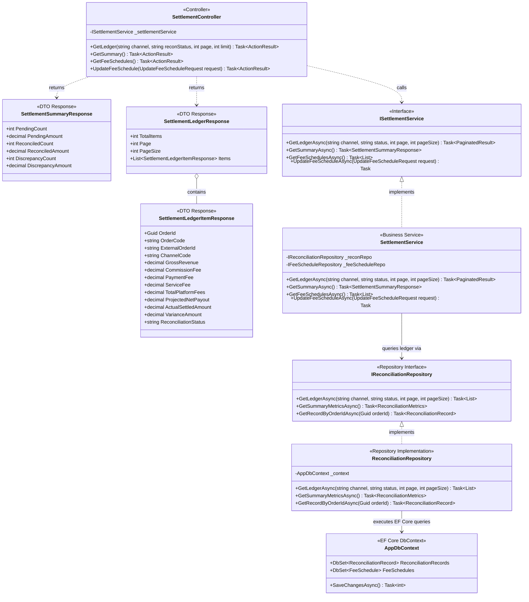
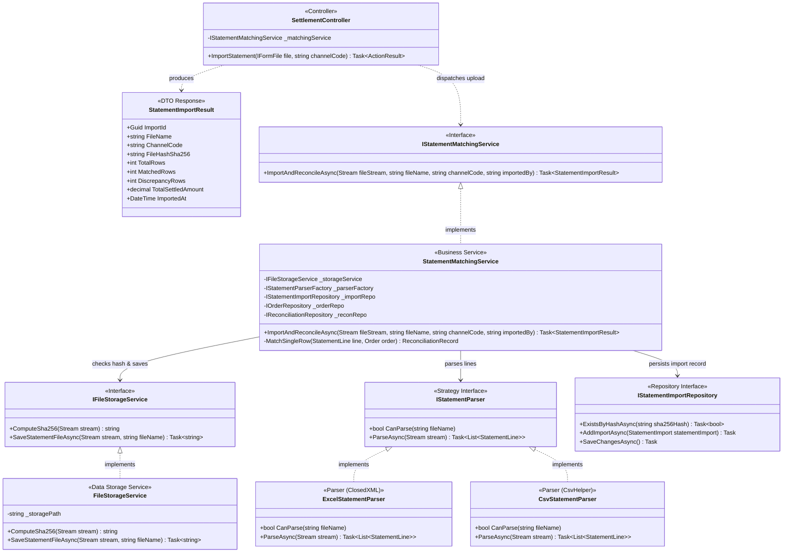
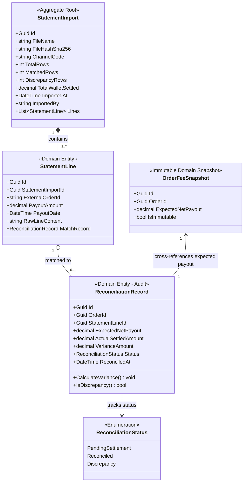

# 03 — Class Diagrams: Settlement & Reconciliation

## 1. Architectural Scope & Decomposition

This module unbundles platform deductions, ingests bank/marketplace payout spreadsheets (`.xlsx`/`.csv`), performs automated 2-way matching against internal delivery snapshots, and audits discrepancy variances.

To maintain visual clarity, this bounded context is decomposed into **3 focused sub-diagrams**:
1. **Diagram 3.1 — 3-Tier Settlement Ledger & Summary Orchestration:** Querying the settlement ledger, KPI summary cards, and active fee schedules.
2. **Diagram 3.2 — Statement Ingestion, Parsing & Automated Matching Engine:** Multipart upload, SHA-256 cryptographic deduplication, spreadsheet parsing, and two-way reconciliation algorithm.
3. **Diagram 3.3 — Domain Entities & Reconciliation State Model:** Relational schema, variance calculation invariant, and audit traceability.

---

## 2. Diagram 3.1: 3-Tier Settlement Ledger & Summary Orchestration

This diagram illustrates how finance managers query itemized deductions, net cash expectations, and KPI summary counters:

---

## 3. Diagram 3.2: Statement Ingestion, Parsing & Automated Matching Engine

This diagram captures the ingestion pipeline, SHA-256 duplicate detection, parser abstraction, and batch reconciliation algorithm:

---

## 4. Diagram 3.3: Domain Entities & Reconciliation State Model

This diagram details entity relationships and the mathematical invariant governing variance resolution:

---

## 5. Architectural & Financial Invariants Summary

1. **Cryptographic Deduplication (C4 Compliance):**
   * Before parsing, `FileStorageService` computes the `SHA-256` hash of the statement file.
   * `IStatementImportRepository.ExistsByHashAsync(hash)` blocks duplicate file uploads with HTTP `409 Conflict`, guaranteeing non-repudiation and idempotent ledgers.
2. **Reconciliation Invariant Equation:**
   $$\text{VarianceAmount} = \text{ActualSettledAmount} - \text{ExpectedNetPayout}$$
   * If $\text{VarianceAmount} = 0$: Marked as `Reconciled` (Green status tag).
   * If $\text{VarianceAmount} \neq 0$: Marked as `Discrepancy` (Red status tag) and immediately routed to the Discrepancy Audit module (`#DIS-002`). A negative variance indicates a merchant cash shortfall (e.g. carrier dimensional re-weighing fee or unexpected platform penalty).
3. **Execution SLA:**
   * Automated batch matching across a 2,000-line spreadsheet completes in $\le 3.0$ seconds via indexed in-memory dictionary lookups against `external_order_id`.
4. **Monetary Storage Rigor:**
   * All monetary quantities (`PayoutAmount`, `ExpectedNetPayout`, `ActualSettledAmount`, `VarianceAmount`) strictly employ C# `decimal` mapped to `NUMERIC(18,0)` VND in PostgreSQL.
