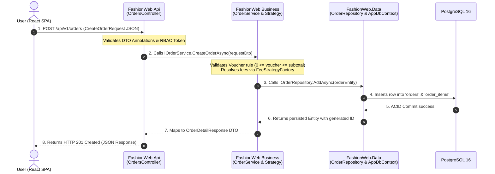

# 01 — .NET Architecture & Component Diagrams

> **Project:** FASHION-WEB — Multi-Channel Revenue & Cash Flow Settlement Management  
> **Target Architecture:** ReactJS (Feature-First) + ASP.NET Core Web API (.NET 8 - 3-Tier) + EF Core + PostgreSQL 16  
---

## 1. 3-Tier Architecture Overview

The backend follows a decoupled **3-Tier Architecture** governed by the **Dependency Inversion Principle (DIP)** to enforce corporate financial rigor and business rule isolation:

```mermaid
flowchart TD
    subgraph ClientLayer ["CLIENT TIER (ReactJS Feature-First SPA)"]
        direction TB
        SPA_UI["React SPA Console (Vite + TypeScript)<br/>AppShell · SCR-01 · SCR-02 · SCR-03 · 5 Modals"]
        SPA_API["Feature API Clients (Axios)<br/>ordersApi · feesApi · settlementsApi · analyticsApi"]
        SPA_UI --> SPA_API
    end

    subgraph ApiTier ["TIER 1: PRESENTATION (FashionWeb.Api)"]
        direction TB
        CTRL["REST Controllers<br/>OrdersController · SettlementController<br/>DiscrepanciesController · AnalyticsController"]
        DTO["Contracts (Request / Response DTOs)<br/>Strict OpenAPI 3.0 Contract Mapping"]
        AUTH["Authorization & Security<br/>Roles (SalesOps, FinanceManager, ShopOwner) · Policies"]
        MIDDLEWARE["Middleware Pipeline<br/>GlobalExceptionMiddleware · Logging · CORS"]
        PROG["Program.cs<br/>IoC Container Bootstrapper · Dependency Injection"]
        
        CTRL --> DTO
        CTRL --> AUTH
    end

    subgraph BusinessTier ["TIER 2: BUSINESS LOGIC (FashionWeb.Business) - INDEPENDENT CORE"]
        direction TB
        SVC_INT["Service Interfaces<br/>IOrderService · IFeeEngine · ISettlementService<br/>IDiscrepancyService · IAnalyticsService"]
        REPO_INT["Repository Interfaces<br/>IOrderRepository · IReconciliationRepository<br/>IFeeScheduleRepository · IDiscrepancyRepository"]
        SVC_IMPL["Business Services<br/>OrderService · StatementMatchingService<br/>DiscrepancyService · AnalyticsService"]
        STRAT["Strategy Pattern (Platform Fee Engine)<br/>IPlatformFeeStrategy · FeeStrategyFactory<br/>TikTokShopFeeStrategy · ShopeeFeeStrategy · PosFeeStrategy"]
        DOMAIN["Domain Model & Financial Invariants<br/>Order · OrderItem · OrderFeeSnapshot · Money<br/>StatementImport · StatementLine · ReconciliationRecord"]
        
        SVC_IMPL -.->|implements| SVC_INT
        SVC_IMPL --> STRAT
        SVC_IMPL --> DOMAIN
        SVC_IMPL --> REPO_INT
    end

    subgraph DataTier ["TIER 3: DATA ACCESS (FashionWeb.Data)"]
        direction TB
        DBCONTEXT["AppDbContext (Entity Framework Core)<br/>DbSets · ACID Transaction Management"]
        CONFIGS["Fluent API Configurations<br/>OrderConfiguration · SnapshotConfiguration<br/>HasPrecision(18,0) for Currency"]
        REPO_IMPL["Repository Implementations<br/>OrderRepository · ReconciliationRepository<br/>FeeScheduleRepository · DiscrepancyRepository"]
        PARSERS["Parsers & Storage<br/>ExcelStatementParser (ClosedXML) · CsvStatementParser<br/>FileStorageService (SHA-256 Deduplication)"]
        
        REPO_IMPL -.->|implements| REPO_INT
        REPO_IMPL --> DBCONTEXT
        DBCONTEXT --> CONFIGS
    end

    subgraph InfraTier ["INFRASTRUCTURE"]
        PG[("PostgreSQL 16 Engine<br/>8 Relational Tables<br/>Strict NUMERIC(18,0)")]
        FS[("Secure Statement Storage<br/>Raw .xlsx/.csv files + SHA-256 hashes")]
    end

    %% Cross-Tier Communication
    SPA_API -->|"HTTPS / JSON (REST APIs)"| CTRL
    CTRL -->|"1. Calls via Service Interface"| SVC_INT
    DBCONTEXT -->|"SQL Queries / Commands"| PG
    PARSERS -->|"Stores file payload & SHA-256"| FS

    %% Dependency Rules
    ApiTier ==>|"Project Reference"| BusinessTier
    DataTier ==>|"Project Reference"| BusinessTier

    %% Styles
    style ClientLayer fill:#eff6ff,stroke:#3b82f6,stroke-width:2px;
    style ApiTier fill:#fef9c3,stroke:#ca8a04,stroke-width:2px;
    style BusinessTier fill:#dcfce7,stroke:#16a34a,stroke-width:3px;
    style DataTier fill:#fce7f3,stroke:#db2777,stroke-width:2px;
    style InfraTier fill:#f1f5f9,stroke:#475569,stroke-width:2px;
    style PG fill:#334155,stroke:#0f172a,color:#ffffff;
    style FS fill:#334155,stroke:#0f172a,color:#ffffff;
```



---

## 2. Dependency Inversion Principle (DIP)

```text
┌───────────────────────────┐         ┌───────────────────────────┐
│     FashionWeb.Api        │         │     FashionWeb.Data       │
│  (Tier 1: Presentation)   │         │   (Tier 3: Data Access)   │
└─────────────┬─────────────┘         └─────────────┬─────────────┘
              │                                     │
              │ Depends on (Project Reference)      │ Depends on (Project Reference)
              ▼                                     ▼
     ┌─────────────────────────────────────────────────────┐
     │                FashionWeb.Business                  │
     │   (Tier 2: Business Core — ZERO DEPENDENCIES)       │
     └─────────────────────────────────────────────────────┘
```

### Core Invariants:
1. **`FashionWeb.Business` is strictly independent:**
   - Does **not** reference `FashionWeb.Api` or `FashionWeb.Data`.
   - Contains zero external ORM/Database references (no EF Core dependencies).
   - Encapsulates 100% of domain rules, lifecycle state machines, fee formulas, and interface contracts (`IService`, `IRepository`).
2. **`FashionWeb.Api` only depends on `FashionWeb.Business`:**
   - Ingress controller layer; validates request payloads, verifies RBAC roles, and dispatches to business service interfaces.
   - Never accesses `FashionWeb.Data` directly.
3. **`FashionWeb.Data` depends on `FashionWeb.Business`:**
   - Implements `IRepository` interfaces defined by the Business tier.
   - Manages EF Core `DbContext`, migrations, and file parsers.

---

## 3. Component & Folder Mapping

| Architecture Layer | Project Name | Directory | Primary Responsibilities |
|---|---|---|---|
| **Client SPA** | N/A (React 18) | `frontend/src/` | - `features/`: Domain workspaces (SCR-01, SCR-02, SCR-03, Modals)<br>- `shared/api/`: Axios HTTP client, error interceptors |
| **Presentation** | `FashionWeb.Api` | `backend/src/FashionWeb.Api/` | - `Controllers/`: HTTP REST endpoints<br>- `Contracts/`: Request/Response DTOs<br>- `Authorization/`: Role constants & authorization policies<br>- `Middleware/`: RFC 7807 global exception handling<br>- `Program.cs`: IoC bootstrapper, CORS, Swagger |
| **Business** | `FashionWeb.Business` | `backend/src/FashionWeb.Business/` | - `Domain/Entities/`: Core entities (`Order`, `OrderFeeSnapshot`, ...)<br>- `Strategies/`: Platform fee algorithms (TikTok, Shopee, POS)<br>- `Interfaces/`: `IService` and `IRepository` contracts<br>- `Services/`: Business workflows, state transitions, matching engine |
| **Data Access** | `FashionWeb.Data` | `backend/src/FashionWeb.Data/` | - `Context/`: EF Core `AppDbContext`<br>- `Configurations/`: Entity Fluent configurations (`NUMERIC(18,0)`)<br>- `Repositories/`: Repository implementations<br>- `Parsers/`: Excel / CSV statement reader (ClosedXML)<br>- `Storage/`: Local file storage with SHA-256 deduplication |

---

## 4. Inversion of Control (IoC) Registration (`Program.cs`)

All cross-tier dependencies are registered into the standard ASP.NET Core DI Container:

```csharp
// 1. Data Access & DbContext Registration
builder.Services.AddDbContext<AppDbContext>(options =>
    options.UseNpgsql(builder.Configuration.GetConnectionString("DefaultConnection")));

// 2. Repository Implementations (Data Tier -> Business Tier Interfaces)
builder.Services.AddScoped<IOrderRepository, OrderRepository>();
builder.Services.AddScoped<IFeeScheduleRepository, FeeScheduleRepository>();
builder.Services.AddScoped<IReconciliationRepository, ReconciliationRepository>();
builder.Services.AddScoped<IDiscrepancyRepository, DiscrepancyRepository>();

// 3. Statement Parsers & Storage Services
builder.Services.AddScoped<IFileStorageService, FileStorageService>();
builder.Services.AddScoped<IStatementParser, ExcelStatementParser>();

// 4. Platform Fee Engine (Strategy Pattern)
builder.Services.AddScoped<TikTokShopFeeStrategy>();
builder.Services.AddScoped<ShopeeFeeStrategy>();
builder.Services.AddScoped<PosFeeStrategy>();
builder.Services.AddScoped<FeeStrategyFactory>();
builder.Services.AddScoped<IFeeEngine, DynamicFeeEngine>();

// 5. Business Services
builder.Services.AddScoped<IOrderService, OrderService>();
builder.Services.AddScoped<ISettlementService, SettlementService>();
builder.Services.AddScoped<IStatementMatchingService, StatementMatchingService>();
builder.Services.AddScoped<IDiscrepancyService, DiscrepancyService>();
builder.Services.AddScoped<IAnalyticsService, AnalyticsService>();
```

---

## 5. End-to-End Control Flow Sequence


