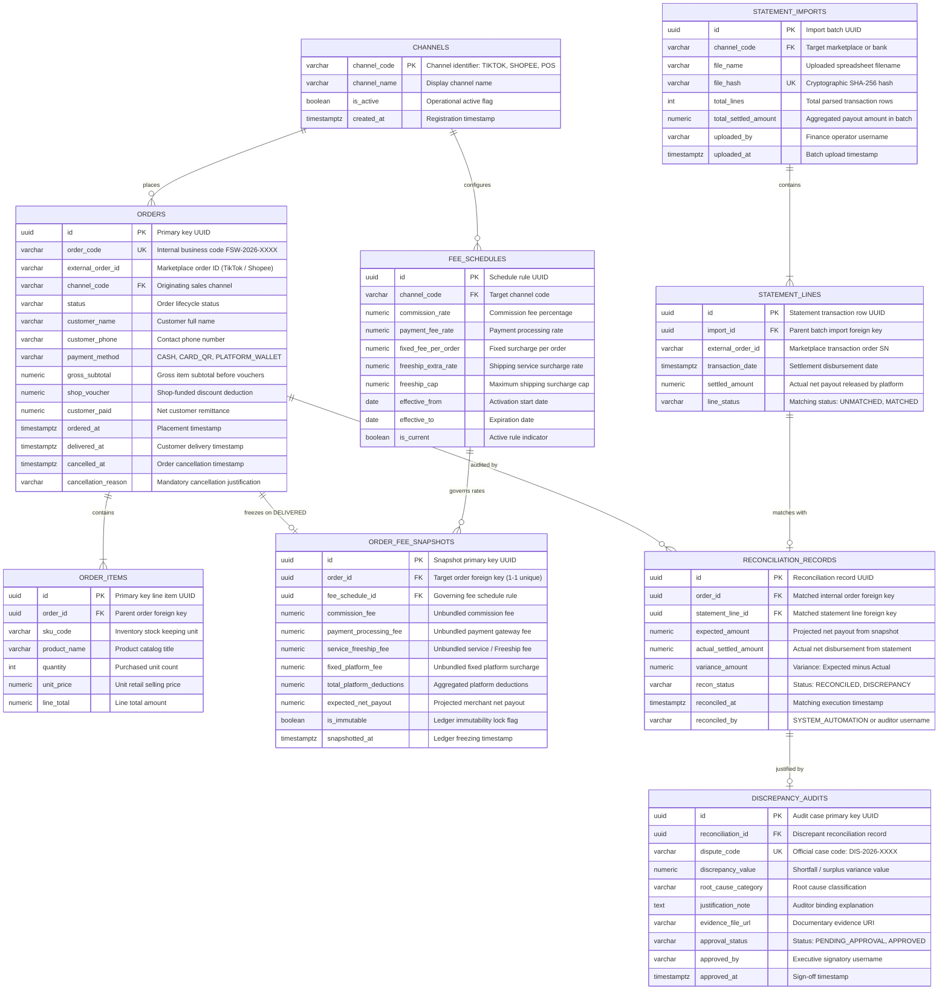

# 06 — Database Schema & Entity Relationship Diagram (ERD)

---

## 1. Entity Relationship Diagram (Mermaid ERD)

The following relational diagram models all 8 core entities, primary/foreign key relationships, and data flows from order ingestion and fee unbundling to automated bank/wallet payout reconciliation:



---

## 2. Granular Data Dictionary

### 2.1. Table `channels` (Sales Channel Catalog)
Maintains connected multi-channel retail integrations.

| Column | Data Type | Constraints | Business Description |
|---|---|---|---|
| `channel_code` | `VARCHAR(20)` | **PRIMARY KEY** | Unique channel key: `TIKTOK`, `SHOPEE`, `POS`. |
| `channel_name` | `VARCHAR(100)` | `NOT NULL` | Display title: "TikTok Shop", "Shopee Mall", "In-Store POS". |
| `is_active` | `BOOLEAN` | `DEFAULT TRUE` | Toggles channel availability for order creation. |
| `created_at` | `TIMESTAMPTZ` | `DEFAULT CURRENT_TIMESTAMP` | Channel provisioning timestamp. |

---

### 2.2. Table `orders` (Multi-Channel Order Master)
Central entity governing order lifecycles and gross commercial transaction volume.

| Column | Data Type | Constraints | Business Description |
|---|---|---|---|
| `id` | `UUID` | **PRIMARY KEY** | System-generated UUID v4 identifier. |
| `order_code` | `VARCHAR(30)` | **UNIQUE, NOT NULL** | Standardized internal business code (e.g., `FSW-2026-001`). |
| `external_order_id`| `VARCHAR(60)` | `NULLABLE` | Marketplace identifier (TikTok Order ID / Shopee Order SN). |
| `channel_code` | `VARCHAR(20)` | **FOREIGN KEY (`channels`)** | Sales channel origin. |
| `status` | `VARCHAR(20)` | `NOT NULL` | Lifecycle milestone: `PENDING`, `SHIPPED`, `DELIVERED`, `CANCELLED`. |
| `customer_name` | `VARCHAR(100)` | `NOT NULL` | Customer full name. |
| `customer_phone` | `VARCHAR(20)` | `NULLABLE` | Contact telephone number. |
| `payment_method` | `VARCHAR(30)` | `NOT NULL` | Tender type: `CASH`, `CARD_QR`, `PLATFORM_WALLET`. |
| `gross_subtotal` | `NUMERIC(18,0)` | `CHECK (gross_subtotal >= 0)` | Catalog gross value before seller vouchers (VND). |
| `shop_voucher` | `NUMERIC(18,0)` | `CHECK (shop_voucher >= 0)` | Seller-funded promotional voucher deduction. |
| `customer_paid` | `NUMERIC(18,0)` | `NOT NULL` | Net customer tender: `gross_subtotal - shop_voucher`. |
| `ordered_at` | `TIMESTAMPTZ` | `NOT NULL` | Order placement timestamp. |
| `delivered_at` | `TIMESTAMPTZ` | `NULLABLE` | Milestone trigger for official revenue recognition. |
| `cancelled_at` | `TIMESTAMPTZ` | `NULLABLE` | Order cancellation timestamp. |
| `cancellation_reason` | `VARCHAR(255)` | `NULLABLE` | Audit reason: "Customer Cancelled", "Out of Stock", "Invalid Address". |

---

### 2.3. Table `order_items` (Order Product Line Items)
Tracks constituent SKU items to power top-selling product analytics (Leaderboard on SCR-03).

| Column | Data Type | Constraints | Business Description |
|---|---|---|---|
| `id` | `UUID` | **PRIMARY KEY** | Line item UUID. |
| `order_id` | `UUID` | **FOREIGN KEY (`orders`) ON DELETE CASCADE** | Reference to parent order. |
| `sku_code` | `VARCHAR(50)` | `NOT NULL` | Inventory catalog SKU (e.g., `TSHIRT-COTTON-BLK-L`). |
| `product_name` | `VARCHAR(200)` | `NOT NULL` | Product catalog title: "Cotton T-Shirt Black Size L". |
| `quantity` | `INTEGER` | `CHECK (quantity > 0)` | Purchased item count. |
| `unit_price` | `NUMERIC(18,0)` | `CHECK (unit_price >= 0)` | Selling unit price (VND). |
| `line_total` | `NUMERIC(18,0)` | `NOT NULL` | Extended line sum: `quantity * unit_price`. |

---

### 2.4. Table `fee_schedules` (Channel Fee Schedules — Strategy Pattern)
Configures dynamic rate parameters utilized by the `DynamicFeeStrategyEngine`.

| Column | Data Type | Constraints | Business Description |
|---|---|---|---|
| `id` | `UUID` | **PRIMARY KEY** | Policy record identifier. |
| `channel_code` | `VARCHAR(20)` | **FOREIGN KEY (`channels`)** | Target sales channel (`TIKTOK`, `SHOPEE`, `POS`). |
| `commission_rate`| `NUMERIC(6,4)` | `NOT NULL` | Marketplace commission percentage (TikTok: `0.0400`, Shopee: `0.0450`). |
| `payment_fee_rate`| `NUMERIC(6,4)` | `NOT NULL` | Transaction payment processing fee rate. |
| `fixed_fee_per_order` | `NUMERIC(18,0)` | `DEFAULT 0` | Fixed per-order platform surcharge (TikTok: `2,000` VND/order). |
| `freeship_extra_rate` | `NUMERIC(6,4)` | `DEFAULT 0` | Optional shipping service surcharge (Shopee Freeship Xtra: `0.0200`). |
| `freeship_cap` | `NUMERIC(18,0)` | `DEFAULT 0` | Maximum cap on shipping surcharge (`20,000` VND). |
| `effective_from` | `DATE` | `NOT NULL` | Rate activation start date. |
| `effective_to` | `DATE` | `NULLABLE` | Rate expiry date (`NULL` = indefinitely current). |
| `is_current` | `BOOLEAN` | `DEFAULT TRUE` | Flags active schedule rule for calculation. |

---

### 2.5. Table `order_fee_snapshots` (Immutable Fee Snapshots — Snapshot Pattern)
Enforces corporate accounting rigor. Freezes calculation formulas permanently upon transition to `DELIVERED`.

| Column | Data Type | Constraints | Business Description |
|---|---|---|---|
| `id` | `UUID` | **PRIMARY KEY** | Snapshot primary key. |
| `order_id` | `UUID` | **FOREIGN KEY (`orders`), UNIQUE** | One-to-one strict relation to completed order. |
| `fee_schedule_id`| `UUID` | **FOREIGN KEY (`fee_schedules`)** | Reference to governing fee schedule at completion. |
| `commission_fee` | `NUMERIC(18,0)` | `NOT NULL` | Unbundled marketplace commission amount (VND). |
| `payment_processing_fee` | `NUMERIC(18,0)` | `NOT NULL` | Unbundled payment gateway transaction fee (VND). |
| `service_freeship_fee` | `NUMERIC(18,0)` | `NOT NULL` | Unbundled service package fee (VND). |
| `fixed_platform_fee` | `NUMERIC(18,0)` | `NOT NULL` | Unbundled fixed order processing fee (VND). |
| `total_platform_deductions` | `NUMERIC(18,0)` | `NOT NULL` | Total deductions sum of all 4 itemized fees. |
| `expected_net_payout` | `NUMERIC(18,0)` | `NOT NULL` | Expected settlement: `customer_paid - total_platform_deductions`. |
| `is_immutable` | `BOOLEAN` | `DEFAULT TRUE` | Permanent ledger write-lock flag. |
| `snapshotted_at` | `TIMESTAMPTZ` | `DEFAULT CURRENT_TIMESTAMP` | Immutability lock timestamp. |

---

### 2.6. Table `statement_imports` (Bank & Wallet Statement Ingestion Batches)
Manages file uploads for automated batch reconciliation (`.xlsx`, `.csv`).

| Column | Data Type | Constraints | Business Description |
|---|---|---|---|
| `id` | `UUID` | **PRIMARY KEY** | Statement import batch identifier. |
| `channel_code` | `VARCHAR(20)` | **FOREIGN KEY (`channels`)** | Payout institution or wallet provider. |
| `file_name` | `VARCHAR(255)` | `NOT NULL` | Uploaded document file name. |
| `file_hash` | `VARCHAR(64)` | **UNIQUE, NOT NULL** | SHA-256 cryptographic hash preventing duplicate ingestion. |
| `total_lines` | `INTEGER` | `NOT NULL` | Parsed settlement transaction line count. |
| `total_settled_amount` | `NUMERIC(18,0)` | `NOT NULL` | Total disbursement amount across all rows in spreadsheet. |
| `uploaded_by` | `VARCHAR(100)` | `NOT NULL` | Finance operator username. |
| `uploaded_at` | `TIMESTAMPTZ` | `DEFAULT CURRENT_TIMESTAMP` | Batch ingestion timestamp. |

---

### 2.7. Table `statement_lines` (Parsed Statement Transaction Lines)
Stores granular disbursement records parsed from bank/wallet spreadsheets.

| Column | Data Type | Constraints | Business Description |
|---|---|---|---|
| `id` | `UUID` | **PRIMARY KEY** | Transaction row UUID. |
| `import_id` | `UUID` | **FOREIGN KEY (`statement_imports`) ON DELETE CASCADE** | Parent statement batch reference. |
| `external_order_id`| `VARCHAR(60)` | `NOT NULL, INDEX` | Marketplace reference key used for two-way JOIN. |
| `transaction_date` | `TIMESTAMPTZ` | `NOT NULL` | Payout settlement execution timestamp. |
| `settled_amount` | `NUMERIC(18,0)` | `NOT NULL` | Actual net disbursement transferred to merchant bank account. |
| `line_status` | `VARCHAR(20)` | `DEFAULT 'UNMATCHED'` | Match milestone: `UNMATCHED`, `MATCHED`. |

---

### 2.8. Table `reconciliation_records` (Two-Way Reconciliation Ledger)
Records mathematical comparisons between internal projections and actual statements.

| Column | Data Type | Constraints | Business Description |
|---|---|---|---|
| `id` | `UUID` | **PRIMARY KEY** | Reconciliation ledger identifier. |
| `order_id` | `UUID` | **FOREIGN KEY (`orders`), INDEX** | Internal audited order. |
| `statement_line_id`| `UUID` | **FOREIGN KEY (`statement_lines`), UNIQUE** | External matched settlement line. |
| `expected_amount` | `NUMERIC(18,0)` | `NOT NULL` | Projected payout from frozen `order_fee_snapshots`. |
| `actual_settled_amount` | `NUMERIC(18,0)` | `NOT NULL` | Disbursed figure from verified `statement_lines`. |
| `variance_amount` | `NUMERIC(18,0)` | `NOT NULL` | Mathematical variance: `expected_amount - actual_settled_amount`. |
| `recon_status` | `VARCHAR(20)` | `NOT NULL, INDEX` | Result state: `RECONCILED` (Variance = 0) or `DISCREPANCY` (Variance ≠ 0). |
| `reconciled_at` | `TIMESTAMPTZ` | `DEFAULT CURRENT_TIMESTAMP` | Matching execution timestamp. |
| `reconciled_by` | `VARCHAR(50)` | `DEFAULT 'SYSTEM_AUTOMATION'` | Automation engine or auditor user ID. |

---

### 2.9. Table `discrepancy_audits` (Variance Audit Justifications — Case #DIS)
Mandatory audit trail triggered whenever `variance_amount ≠ 0`.

| Column | Data Type | Constraints | Business Description |
|---|---|---|---|
| `id` | `UUID` | **PRIMARY KEY** | Audit case record UUID. |
| `reconciliation_id`| `UUID` | **FOREIGN KEY (`reconciliation_records`), UNIQUE** | Direct link to flagged reconciliation discrepancy. |
| `dispute_code` | `VARCHAR(30)` | **UNIQUE, NOT NULL** | Standard audit case code (e.g., `DIS-2026-002`). |
| `discrepancy_value`| `NUMERIC(18,0)` | `NOT NULL` | Financial shortfall value (e.g., `-20,000` VND penalty). |
| `root_cause_category`| `VARCHAR(50)` | `NOT NULL` | Classification: `CARRIER_WEIGHT_PENALTY`, `PLATFORM_FEE_SURCHARGE`. |
| `justification_note` | `TEXT` | `NOT NULL` | Written auditor explanation cross-referenced with carrier slips. |
| `evidence_file_url` | `VARCHAR(500)` | `NULLABLE` | URI link to weight slip scan or stamped carrier receipt. |
| `approval_status` | `VARCHAR(20)` | `DEFAULT 'PENDING_APPROVAL'` | Status: `PENDING_APPROVAL`, `APPROVED`, `REJECTED`. |
| `approved_by` | `VARCHAR(100)` | `NULLABLE` | Shop Owner or Chief Accountant approver. |
| `approved_at` | `TIMESTAMPTZ` | `NULLABLE` | Formal sign-off timestamp. |

---

## 3. Performance Indexes & Integrity Constraints

### 3.1. High-Performance Indexes
Engineered to satisfy sub-3-second batch reconciliation (**Quality Goal Q3**):

```sql
-- 1. Accelerated two-way reconciliation joins
CREATE INDEX idx_orders_external_id ON orders(external_order_id);
CREATE INDEX idx_statement_lines_external_id ON statement_lines(external_order_id);

-- 2. Executive revenue dashboard filter (DELIVERED only)
CREATE INDEX idx_orders_status_delivered ON orders(status) WHERE status = 'DELIVERED';

-- 3. Rapid settlement status lookups
CREATE INDEX idx_recon_status ON reconciliation_records(recon_status);

-- 4. Multi-channel chronological timeline partitioning
CREATE INDEX idx_orders_channel_time ON orders(channel_code, ordered_at DESC);
```

### 3.2. Financial Integrity Constraints
```sql
-- Enforce non-negative financial values
ALTER TABLE orders ADD CONSTRAINT chk_orders_amounts_positive 
    CHECK (gross_subtotal >= 0 AND shop_voucher >= 0 AND customer_paid >= 0);

-- Prevent promotional vouchers from exceeding item gross subtotal
ALTER TABLE orders ADD CONSTRAINT chk_voucher_not_exceed_subtotal 
    CHECK (shop_voucher <= gross_subtotal);

-- Enforce strict mathematical net customer remittance
ALTER TABLE orders ADD CONSTRAINT chk_customer_paid_math 
    CHECK (customer_paid = (gross_subtotal - shop_voucher));
```
