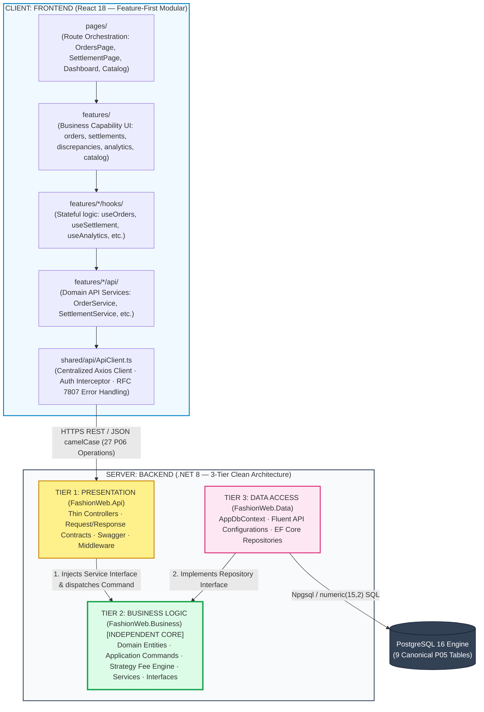

# System Folder Structures & Tiered Architecture Specification

---

## 1. Scope & Architectural Topology

### 1.1. Objectives & Boundary
Phase P07 formally defines:
1. Complete folder structures for both **Backend (.NET 8 3-Tiers)** and **Frontend (React 18 Feature-First)**.
2. Responsibilities of every directory and sub-directory.
3. Strict dependency flow and architectural isolation boundaries.
4. Comprehensive mapping of all **27 OpenAPI operations** and **9 PostgreSQL tables** into concrete source tree artifacts.
5. Distinction between **Current Prototype Implementation** and **Target Production Architecture**.

> [!IMPORTANT]
> **P07 Architectural Boundaries:**
> - P07 designs directory structures, component locations, responsibilities, and dependency rules.
> - Detailed Class Diagrams, Sequence Diagrams, and method-level signatures belong to **Phase P08**.
> - Code implementation, refactoring, and test writing belong to **Phase P09**.

---

### 1.2. 3-Tier Backend & Modular Frontend Topology



---

### 1.3. Dependency Inversion & Architectural Rules

```text
FashionWeb.Api      ──► depends on ──► FashionWeb.Business
FashionWeb.Data     ──► depends on ──► FashionWeb.Business
FashionWeb.Business ──► PURE & INDEPENDENT (Zero dependencies on Api, Data, EF Core, ASP.NET Core, Npgsql)
```

1. **Pure Business Core:** `FashionWeb.Business` contains zero references to web frameworks, transport formats, ORM libraries, or database drivers. All financial strategies, fee calculations, and invariant validations are isolated and purely unit-testable.
2. **Composition Root Exception:** `FashionWeb.Api` references `FashionWeb.Data` **exclusively within `Program.cs`** to register `AppDbContext` and repository implementations into the ASP.NET Core Dependency Injection (DI) container. Controllers are strictly prohibited from referencing or injecting `AppDbContext` or repository types directly.
3. **Repository Port Interface:** Repository interfaces (`IOrderRepository`, etc.) live in `FashionWeb.Business/Interfaces/Repositories/`. The Data tier (`FashionWeb.Data/Repositories/`) implements these interfaces.

---

## 2. Backend Solution Structure (`backend/`)

### 2.1. Complete Backend Directory Tree

```text
backend/
├── FashionWeb.sln                               # Visual Studio / .NET 8 Solution
│
├── src/
│   ├── FashionWeb.Api/                          # [TIER 1: PRESENTATION TIER]
│   │   ├── Controllers/                         # Thin HTTP adapters (6 domain controllers + 1 shared BaseApiController)
│   │   │   ├── BaseApiController.cs             # Shared controller conventions only; canonical routes are declared explicitly per controller.
│   │   │   ├── CatalogController.cs             # [Target] Route: /api/v1/catalog (UC12: Products, SKU variants, baseline costs)
│   │   │   ├── OrdersController.cs              # Route: /api/v1/orders (UC01-UC04: Order entry, preview fees, status, cancel)
│   │   │   ├── FeeSchedulesController.cs        # [Target] Route: /api/v1/fee-schedules (Supporting configuration for UC02 fee calculation capability)
│   │   │   ├── SettlementController.cs          # Route: /api/v1/settlements (UC05-UC06: Manual settlement ledger, payout reconcile)
│   │   │   ├── DiscrepanciesController.cs       # Route: /api/v1/discrepancies (UC07: Discrepancy audits, resolution notes)
│   │   │   └── AnalyticsController.cs           # Route: /api/v1/analytics (UC08-UC11, UC13: 5 KPIs, trends, channel, top SKUs, CSV)
│   │   │
│   │   ├── Contracts/                           # Strongly typed HTTP transport DTOs (API module isolated)
│   │   │   ├── Catalog/                         # Catalog & SKU contracts
│   │   │   │   ├── CreateProductRequest.cs      # Product creation payload
│   │   │   │   ├── UpdateProductRequest.cs      # Metadata update (name, category, isActive)
│   │   │   │   ├── UpdateVariantRequest.cs      # Variant pricing update (retailPrice, costPrice)
│   │   │   │   ├── ProductResponse.cs           # Master product detail with variants
│   │   │   │   ├── ProductVariantResponse.cs    # SKU variant detail
│   │   │   │   └── SelectableVariantResponse.cs # Lightweight SKU selector (costPrice stripped)
│   │   │   ├── Orders/                          # Order & Fee Preview contracts
│   │   │   │   ├── CreateOrderRequest.cs        # Customer, voucher, order lines input
│   │   │   │   ├── CreateOrderItemRequest.cs    # Order line item input
│   │   │   │   ├── FeePreviewRequest.cs         # Dynamic fee estimate input
│   │   │   │   ├── FeeBreakdownResponse.cs      # Estimated fee breakdown
│   │   │   │   ├── UpdateOrderStatusRequest.cs  # Progression target (SHIPPED, DELIVERED)
│   │   │   │   ├── CancelOrderRequest.cs        # Cancellation reason
│   │   │   │   ├── OrderListItemResponse.cs     # Lightweight table item (no cost leak)
│   │   │   │   ├── PagedOrderListResponse.cs    # Paginated orders wrapper
│   │   │   │   ├── OrderResponse.cs             # Order lifecycle response
│   │   │   │   ├── OrderDetailResponse.cs       # Full order details with frozen fee snapshot
│   │   │   │   ├── OrderItemResponse.cs         # Order item line response
│   │   │   │   ├── OrderStatusHistoryResponse.cs# State transition history log item
│   │   │   │   ├── FeeSnapshotResponse.cs       # Frozen platform fee snapshot response
│   │   │   │   └── OrderSummaryResponse.cs      # Operational counters & recognized gross revenue
│   │   │   ├── FeeSchedules/                    # Fee Schedule contracts
│   │   │   │   ├── CreateFeeScheduleRequest.cs  # Shop Owner rate versioning payload
│   │   │   │   └── FeeScheduleResponse.cs       # Active schedule rates & caps
│   │   │   ├── Settlements/                     # Settlement & Reconciliation contracts
│   │   │   │   ├── SettlementLedgerItemResponse.cs# Ledger item with 4 frozen fee breakdowns
│   │   │   │   ├── PagedSettlementLedgerResponse.cs# Paginated settlement ledger wrapper
│   │   │   │   ├── SettlementSummaryResponse.cs # Audit counters (pending, reconciled, discrepancy)
│   │   │   │   ├── ReconcileSettlementRequest.cs# Actual bank/wallet payout input
│   │   │   │   └── ReconciliationResponse.cs    # Single order reconciliation state
│   │   │   ├── Discrepancies/                   # Discrepancy & Dispute contracts
│   │   │   │   ├── DiscrepancyResponse.cs       # Variance investigation record
│   │   │   │   ├── DiscrepancyDetailResponse.cs # Full discrepancy audit trail
│   │   │   │   ├── PagedDiscrepancyListResponse.cs# Paginated discrepancy list wrapper
│   │   │   │   └── ResolveDiscrepancyRequest.cs # Resolution notes payload
│   │   │   ├── Analytics/                       # Executive Analytics contracts
│   │   │   │   ├── FinancialKpiResponse.cs      # 5 Core Financial KPIs & margin %
│   │   │   │   ├── FinancialTrendResponse.cs    # Trend response wrapper with points
│   │   │   │   ├── FinancialTrendPoint.cs       # Daily time-series data point
│   │   │   │   ├── ChannelBreakdownResponse.cs  # Multi-channel revenue/profit distribution
│   │   │   │   ├── TopSkuResponse.cs            # SKU contribution profit ranking
│   │   │   │   ├── PagedDrilldownOrderResponse.cs# Paginated drilldown orders wrapper
│   │   │   │   └── DrilldownOrderItem.cs        # Itemized delivered order backing KPIs
│   │   │   └── Common/                          # Transport concerns only
│   │   │       └── PaginationResponse.cs        # Generic paginated wrapper (page, pageSize, totals)
│   │   │
│   │   ├── Authorization/                       # Role-Based Access Control policies
│   │   │   ├── Roles.cs                         # SalesOps, FinanceManager, ShopOwner constants
│   │   │   └── Policies.cs                      # RequireFinanceManager, RequireShopOwner, RequireSalesOps
│   │   │
│   │   ├── Middleware/                          # ASP.NET Core HTTP pipeline middlewares
│   │   │   └── ExceptionHandlingMiddleware.cs   # Global unhandled exception to RFC 7807 mapper
│   │   │
│   │   ├── Program.cs                           # Composition Root: DI, DbContext, Auth, Swagger, CORS
│   │   ├── appsettings.json                     # Database connection strings & logging config
│   │   ├── appsettings.Development.json
│   │   └── FashionWeb.Api.csproj
│   │
│   ├── FashionWeb.Business/                     # [TIER 2: BUSINESS LOGIC TIER - INDEPENDENT CORE]
│   │   ├── Domain/                              # Domain layer
│   │   │   ├── Entities/                        # 9 Canonical P05 Database Entity models
│   │   │   │   ├── Product.cs                   # Master product (id, name, category, is_active)
│   │   │   │   ├── ProductVariant.cs            # SKU variant (sku_code, retail_price, cost_price)
│   │   │   │   ├── Order.cs                     # Commercial order (order_date, status, gross_revenue)
│   │   │   │   ├── OrderItem.cs                 # Frozen line snapshot (unit_cost_snapshot, total_cost)
│   │   │   │   ├── OrderStatusHistory.cs        # State machine audit trail
│   │   │   │   ├── FeeSchedule.cs               # Channel rate configuration & versioning
│   │   │   │   ├── OrderFeeSnapshot.cs          # Frozen platform fees upon delivery
│   │   │   │   ├── ReconciliationRecord.cs      # Payout settlement & variance tracking
│   │   │   │   └── DiscrepancyAudit.cs          # Root-cause audit & resolution tracking
│   │   │   ├── Enums/                           # Canonical Domain Enumerations
│   │   │   │   ├── ChannelType.cs               # TIKTOK, SHOPEE, POS
│   │   │   │   ├── PaymentMethod.cs             # CASH, POS_CARD_QR, MARKETPLACE_WALLET
│   │   │   │   ├── OrderStatus.cs               # PENDING, SHIPPED, DELIVERED, CANCELLED
│   │   │   │   ├── ReconciliationStatus.cs      # PENDING_SETTLEMENT, RECONCILED, DISCREPANCY
│   │   │   │   └── DiscrepancyType.cs           # COMMISSION_RATE_MISMATCH, PAYMENT_FEE_MISMATCH, SERVICE_FEE_MISMATCH, UNEXPECTED_PLATFORM_CHARGE, OTHER
│   │   │   └── ValueObjects/                    # Domain Value Objects
│   │   │       └── FeeBreakdown.cs              # Immutable calculation result (commission, payment, etc.)
│   │   │
│   │   ├── Commands/                            # Strongly typed Application Commands (decoupled from HTTP)
│   │   │   ├── CreateProductCommand.cs          # Command to create master product + variants
│   │   │   ├── UpdateProductCommand.cs          # Command to update product metadata
│   │   │   ├── UpdateVariantCommand.cs          # Command to update variant pricing & cost
│   │   │   ├── CreateOrderCommand.cs            # Command to create order & freeze cost snapshot
│   │   │   ├── UpdateOrderStatusCommand.cs      # Command to progress order lifecycle
│   │   │   ├── CancelOrderCommand.cs            # Command to cancel active order
│   │   │   ├── CreateFeeScheduleCommand.cs      # Supporting administrative command for fee policy configuration
│   │   │   ├── ReconcileSettlementCommand.cs    # Command to record actual payout
│   │   │   └── ResolveDiscrepancyCommand.cs     # Command to resolve discrepancy audit
│   │   │
│   │   ├── Results/                             # Typed Application Query & Computation Results (decoupled from API DTOs)
│   │   │   ├── OrderListResult.cs               # Paged order list representation
│   │   │   ├── OrderDetailResult.cs             # Complete order view with items, history, snapshot
│   │   │   ├── OrderSummaryResult.cs            # Operational order counters & recognized gross revenue
│   │   │   ├── FeeBreakdownResult.cs            # Calculated platform fee breakdown values
│   │   │   ├── SettlementLedgerResult.cs        # Ledger records with frozen fee breakdowns
│   │   │   ├── SettlementSummaryResult.cs       # Reconciliation status counters (pending, reconciled, discrepancy)
│   │   │   ├── DiscrepancyDetailResult.cs       # Audit record with joined order details
│   │   │   ├── FinancialKpiResult.cs            # 5 Core Financial KPIs & margin %
│   │   │   ├── FinancialTrendPointResult.cs     # Daily time-series metrics point
│   │   │   ├── ChannelBreakdownResult.cs        # Multi-channel revenue/profit distribution
│   │   │   ├── TopSkuResult.cs                  # Top SKU contribution profit derivation result
│   │   │   └── DrilldownOrderResult.cs          # Itemized delivered order backing KPIs
│   │   │
│   │   ├── Interfaces/                          # Ports & Contracts for Inversion of Control
│   │   │   ├── Services/                        # Application Service contracts
│   │   │   │   ├── ICatalogService.cs           # Catalog management operations
│   │   │   │   ├── IOrderService.cs             # Order lifecycle, recording, cancellation
│   │   │   │   ├── IFeeScheduleService.cs       # Active schedules & versioning operations
│   │   │   │   ├── ISettlementService.cs        # Ledger queries & manual reconciliation
│   │   │   │   ├── IDiscrepancyService.cs       # Discrepancy investigation & resolution
│   │   │   │   ├── IAnalyticsService.cs         # 5 KPIs, trends, channel breakdown, top SKUs, CSV
│   │   │   │   └── IDynamicFeeEngine.cs         # Fee preview & snapshot calculation facade
│   │   │   └── Repositories/                    # Repository Port interfaces
│   │   │       ├── IProductRepository.cs        # Products & Variants persistence port
│   │   │       ├── IOrderRepository.cs          # Orders, Items, Status History & Delivery Fee Snapshot persistence port
│   │   │       ├── IFeeScheduleRepository.cs    # Fee Schedule rates persistence port
│   │   │       ├── IReconciliationRepository.cs # Reconciliation persistence/query port; may read fee snapshots for settlement views
│   │   │       ├── IDiscrepancyRepository.cs    # Discrepancy Audit persistence port
│   │   │       ├── IAnalyticsRepository.cs      # Financial Aggregations & Query port
│   │   │       └── IUnitOfWork.cs               # Transaction boundary port for multi-entity atomic commits (e.g. delivery)
│   │   │
│   │   ├── Services/                            # Concrete Application Domain Services
│   │   │   ├── CatalogService.cs                # [Target] Manages product catalog & cost maintenance
│   │   │   ├── OrderService.cs                  # Order creation: freezes unit_cost_snapshot; Delivery: freezes order_fee_snapshot, creates pending reconciliation
│   │   │   ├── FeeScheduleService.cs            # [Target] Manages rate schedule versioning
│   │   │   ├── SettlementService.cs             # Computes variance, enforces manual match rules
│   │   │   ├── DiscrepancyService.cs            # Handles resolution notes & sets resolved_at
│   │   │   ├── AnalyticsService.cs              # Derives 5 Core KPIs & SKU profit allocations
│   │   │   └── DynamicFeeEngine.cs              # Facade invoking FeeStrategyFactory
│   │   │
│   │   ├── Strategies/                          # Strategy Pattern: Multi-Channel Platform Fee Calculation
│   │   │   ├── IPlatformFeeStrategy.cs          # Fee strategy contract
│   │   │   ├── TikTokShopFeeStrategy.cs         # 4% Subtotal + 3% Gross Revenue + Configured Fixed (current schedule 3,000 VND)
│   │   │   ├── ShopeeFeeStrategy.cs             # 4.5% Subtotal + 4% Gross Revenue + Service Fee with Configured Cap
│   │   │   ├── PosFeeStrategy.cs                # 0 VND Cash / 1% Card/QR fee
│   │   │   └── FeeStrategyFactory.cs            # Channel-to-Strategy resolver
│   │   │
│   │   └── FashionWeb.Business.csproj
│   │
│   └── FashionWeb.Data/                         # [TIER 3: DATA ACCESS TIER]
│       ├── Context/
│       │   └── AppDbContext.cs                  # EF Core DbContext managing all 9 canonical DbSets
│       │
│       ├── Configurations/                      # Fluent API PostgreSQL schema mappings (numeric(15,2))
│       │   ├── ProductConfiguration.cs          # [Target] products table mapping
│       │   ├── ProductVariantConfiguration.cs   # [Target] product_variants table & price constraints
│       │   ├── OrderConfiguration.cs            # orders table, order_date, channel & payment enums
│       │   ├── OrderItemConfiguration.cs        # [Target] order_items table & frozen unit_cost_snapshot
│       │   ├── OrderStatusHistoryConfiguration.cs# [Target] order_status_history audit log
│       │   ├── FeeScheduleConfiguration.cs      # fee_schedules table, rates & service_fee_cap
│       │   ├── OrderFeeSnapshotConfiguration.cs # order_fee_snapshots table (immutability policy)
│       │   ├── ReconciliationRecordConfiguration.cs# reconciliation_records table & variance
│       │   └── DiscrepancyAuditConfiguration.cs # discrepancy_audits table, resolved_at
│       │
│       ├── Repositories/                        # EF Core Repository Implementations (Persistence Ports)
│       │   ├── ProductRepository.cs             # [Target] Implements IProductRepository
│       │   ├── OrderRepository.cs               # Implements IOrderRepository; persists orders, items, status history and delivery fee snapshots
│       │   ├── FeeScheduleRepository.cs         # Implements IFeeScheduleRepository
│       │   ├── ReconciliationRepository.cs      # Implements IReconciliationRepository; reconciliation records and settlement query joins
│       │   ├── DiscrepancyRepository.cs         # Implements IDiscrepancyRepository
│       │   ├── AnalyticsRepository.cs           # [Target] Implements IAnalyticsRepository
│       │   └── UnitOfWork.cs                    # [Target] Implements IUnitOfWork via EF Core DbContext execution strategy & transaction
│       │
│       ├── Migrations/                          # EF Core code-first database migrations
│       └── FashionWeb.Data.csproj
│
└── tests/
    └── FashionWeb.Business.Tests/               # Automated Unit Tests (xUnit + Moq)
        ├── DynamicFeeEngineTests.cs             # Verifies Strategy Pattern dispatch & fee accuracy
        ├── OrderLifecycleTests.cs               # Verifies PENDING -> SHIPPED -> DELIVERED progression
        ├── RevenueRecognitionTests.cs           # Verifies Zero Phantom Revenue invariant
        ├── SettlementVarianceTests.cs           # Verifies Projected - Actual = Variance derivation
        └── FashionWeb.Business.Tests.csproj
```

---

### 2.2. Tier Responsibilities & Constraints

#### Tier 1: Presentation Tier (`FashionWeb.Api`)
- **Role:** Thin HTTP adapter and transport serializer.
- **Structure:** 6 domain controllers + 1 shared `BaseApiController`.
- **Responsibilities:**
  - Route HTTP requests using explicit canonical paths defined by P06 OpenAPI.
  - Validate HTTP request contracts (`ModelState`, DataAnnotations).
  - Enforce RBAC authorization attributes (`[Authorize(Roles = ...)]`).
  - Map incoming API Request DTOs into strongly typed `FashionWeb.Business.Commands`.
  - Invoke `FashionWeb.Business.Interfaces.Services` methods.
  - Return standardized HTTP responses (`200 OK`, `201 Created`, `204 NoContent`, `400 BadRequest`, `404 NotFound`, `409 Conflict`, `422 UnprocessableEntity`).
  - Serialize business exceptions into standard RFC 7807 `ProblemDetails` via `ExceptionHandlingMiddleware`.
- **Strict Prohibitions:**
  - **NEVER** calculate platform fees or financial KPIs.
  - **NEVER** inject or query `AppDbContext` directly.
  - **NEVER** write or execute direct LINQ database queries.
  - **NEVER** pass `HttpRequest` or ASP.NET Core objects into the Business tier.

#### Tier 2: Business Logic Tier (`FashionWeb.Business`)
- **Role:** Independent, pure core containing all business rules, invariants, and domain logic.
- **Responsibilities:**
  - Enforce the **Zero Phantom Revenue Invariant** (revenue is recognized if and only if order status is `DELIVERED`).
  - Execute multi-channel fee strategies via `DynamicFeeEngine` and the Strategy Pattern.
  - Freeze baseline unit cost snapshots upon order item recording (`unit_cost_snapshot`).
  - Freeze immutable fee snapshots upon delivery (`order_fee_snapshots`).
  - Derive **Contribution Profit** ($\text{Projected Settlement} - \text{COGS}$) and prohibit Net Profit.
  - Derive settlement variance ($\text{Projected Settlement} - \text{Actual Settlement}$).
  - Enforce status progression state machine rules (`PENDING` $\rightarrow$ `SHIPPED` $\rightarrow$ `DELIVERED`).
  - Prohibit cancellation of `DELIVERED` orders.
- **Strict Prohibitions:**
  - **NEVER** reference `FashionWeb.Api`, `FashionWeb.Data`, EF Core, ASP.NET Core, or Npgsql.
  - **NEVER** accept raw HTTP DTOs; receive exclusively strongly typed `Commands` or primitive domain types.

#### Tier 3: Data Access Tier (`FashionWeb.Data`)
- **Role:** Relational persistence adapter for PostgreSQL 16.
- **Responsibilities:**
  - Manage database connection and transactions via `AppDbContext`.
  - Enforce database precision `numeric(15,2)` on all monetary columns via Fluent API configurations.
  - Execute CRUD queries and aggregations implementing `FashionWeb.Business.Interfaces.Repositories`.
  - Primary write ownership for `order_fee_snapshots` is held by `OrderRepository` upon delivery completion; `ReconciliationRepository` queries/joins snapshots for settlement views.
  - Generate and apply EF Core database migrations.
- **Strict Prohibitions:**
  - **NEVER** determine business workflows or legal order state transitions.
  - **NEVER** calculate marketplace fee strategies.
  - **NEVER** evaluate reconciliation status (`RECONCILED` vs `DISCREPANCY`); the Business service decides the status and passes the entity to the repository.

---

## 3. Frontend Solution Structure (`frontend/src/`)

### 3.1. Complete Frontend Directory Tree

```text
frontend/
├── package.json                                 # React 18, TypeScript, Vite, Axios
├── tsconfig.json
├── index.html
│
└── src/
    ├── app/                                     # Global application bootstrap
    │   ├── App.tsx                              # Root application bootstrap, providers, and AppShell
    │   └── AppRouter.tsx                        # react-router-dom route definitions for /orders, /settlement, /analytics, /catalog
    │
    ├── layouts/                                 # Shell and structure layouts
    │   ├── AppShell.tsx                         # Master responsive wrapper (Sidebar + Topbar + Content area)
    │   ├── Sidebar.tsx                          # Primary navigation rail (Orders, Settlement, Analytics, Catalog)
    │   └── Topbar.tsx                           # Header: Global search, current authenticated user and role indicator, system status
    │
    ├── pages/                                   # Route Orchestration Pages (Thin Composers)
    │   ├── orders/
    │   │   └── OrdersPage.tsx                   # Route /orders: Composes OrderMetrics, OrderFilters, OrderTable
    │   ├── settlement/
    │   │   └── SettlementPage.tsx               # Route /settlement: Composes SettlementSummary, Ledger, Discrepancies
    │   ├── analytics/
    │   │   └── RevenueDashboardPage.tsx         # Route /analytics: Composes KpiCards, TrendChart, TopSkuTable
    │   └── catalog/
    │       └── CatalogPage.tsx                  # [Target] Route /catalog: Composes ProductTable, ProductEditor
    │
    ├── features/                                # Domain Business Modules (Feature-First)
    │   ├── orders/                              # Feature: Commercial Order Management
    │   │   ├── components/                      # P04 Component implementations
    │   │   │   ├── OrderTable.tsx               # Orders table displaying OrderListItemResponse (no cost leak; detail opened via row interaction)
    │   │   │   ├── OrderMetrics.tsx             # 5 operational order metrics (total, delivered, revenue, inTransit, cancelled)
    │   │   │   ├── OrderFilters.tsx             # Channel pills, status dropdown, date range, search input
    │   │   │   ├── OrderStatusActions.tsx       # Action buttons for Ship, Deliver, Cancel progression
    │   │   │   ├── CreateOrderModal.tsx         # Order entry modal embedding FeePreviewWidget & ProductSelector
    │   │   │   └── CancelOrderModal.tsx         # Confirmation modal capturing cancellationReason
    │   │   ├── hooks/                           # Custom React state & mutation hooks
    │   │   │   ├── useOrders.ts                 # Queries orders list, handles status transitions & cancellations
    │   │   │   └── useFeePreview.ts             # Debounced real-time fee calculation hook
    │   │   ├── api/                             # Feature API HTTP service
    │   │   │   ├── OrderService.ts              # Calls GET/POST /orders, /orders/summary, /status, /cancel
    │   │   │   └── FeeService.ts                # Calls POST /orders/preview-fee (fee preview only)
    │   │   └── types/
    │   │       └── order.types.ts               # Client-side Order contracts & enums
    │   │
    │   ├── catalog/                             # Feature: Master Catalog & SKU Management
    │   │   ├── components/
    │   │   │   ├── ProductTable.tsx             # Master product and SKU variant matrix
    │   │   │   ├── ProductEditor.tsx            # Add/Edit master product modal
    │   │   │   ├── PricingCostEditor.tsx        # Edit retailPrice and baseline costPrice modal
    │   │   │   └── ProductSelector.tsx          # Autocomplete SKU dropdown for CreateOrderModal (costPrice stripped)
    │   │   ├── hooks/
    │   │   │   └── useCatalog.ts                # Queries catalog products & selectable variants
    │   │   ├── api/
    │   │   │   └── CatalogService.ts            # Calls /catalog/products, /variants, /selectable
    │   │   └── types/
    │   │       └── catalog.types.ts             # Product & Variant client interfaces
    │   │
    │   ├── settlements/                         # Feature: Manual Settlement & Payout Reconciliation
    │   │   ├── components/
    │   │   │   ├── SettlementSummary.tsx        # Summary cards: pendingSettlement, reconciled, discrepancy
    │   │   │   ├── SettlementFilters.tsx        # Status pills (All, Pending, Reconciled, Discrepancy), date range
    │   │   │   ├── SettlementLedger.tsx         # Reconciliation ledger table with 4 fee breakdown columns
    │   │   │   ├── RecordSettlementModal.tsx    # Manual bank/wallet actual settlement entry modal
    │   │   │   └── FeeScheduleModal.tsx         # Fee schedule inspection & versioning modal
    │   │   ├── hooks/
    │   │   │   ├── useSettlement.ts             # Queries ledger, summary counters, records actual payout
    │   │   │   └── useFeeSchedule.ts            # Queries active schedules, submits new schedule version via FeeScheduleService
    │   │   ├── api/
    │   │   │   ├── SettlementService.ts         # Calls GET /settlements, GET /summary, POST /reconcile
    │   │   │   └── FeeScheduleService.ts        # Calls GET /fee-schedules, POST /fee-schedules (fee schedule read/versioning only)
    │   │   └── types/
    │   │       └── settlement.types.ts          # Ledger item & Reconciliation client interfaces
    │   │
    │   ├── discrepancies/                       # Feature: Discrepancy Investigation & Audit Trail
    │   │   ├── components/
    │   │   │   ├── DiscrepancyPanel.tsx         # Discrepancy table embedded in Settlement workspace
    │   │   │   ├── DiscrepancyDetails.tsx       # Investigation audit drawer showing variance details
    │   │   │   └── DiscrepancyReviewAction.tsx  # Modal capturing resolutionNotes to resolve variance
    │   │   ├── hooks/
    │   │   │   └── useDiscrepancies.ts          # Queries discrepancy audits, resolves discrepancies
    │   │   ├── api/
    │   │   │   └── DiscrepancyService.ts        # Calls GET /discrepancies, GET /{id}, PATCH /resolve
    │   │   └── types/
    │   │       └── discrepancy.types.ts         # Discrepancy audit client interfaces
    │   │
    │   └── analytics/                           # Feature: 5-KPI Analytics & Executive Dashboard
    │       ├── components/
    │       │   ├── KpiCards.tsx                 # 5 Core KPIs: Gross Revenue, Fees, Projected, COGS, Profit
    │       │   ├── FinancialTrendChart.tsx      # Time-series chart of Gross Revenue vs Contribution Profit
    │       │   ├── ChannelShareChart.tsx        # Multi-channel breakdown distribution (TikTok, Shopee, POS)
    │       │   ├── TopSkuTable.tsx              # Top SKU ranking by Contribution Profit, Revenue, or Units
    │       │   └── SourceOrderDrilldown.tsx     # Modal listing itemized delivered orders backing KPI totals & triggering CSV export
    │       ├── hooks/
    │       │   └── useAnalytics.ts              # Queries KPIs, trends, channel share, top SKUs, triggers CSV export
    │       ├── api/
    │       │   └── AnalyticsService.ts          # Calls 6 /analytics endpoints (/kpis, /trend, /channel-breakdown, /top-skus, /drilldown, /export-csv)
    │       └── types/
    │           └── analytics.types.ts           # Financial analytics client interfaces
    │
    ├── shared/                                  # Common Infrastructure & Design System
    │   ├── api/                                 # Centralized HTTP Infrastructure
    │   │   └── ApiClient.ts                     # Single Axios client: baseURL, Bearer auth, RFC 7807 interceptor
    │   │
    │   ├── ui/                                  # Atomic Reusable UI Primitives
    │   │   ├── Button.tsx                       # Enterprise button primitive
    │   │   ├── Badge.tsx                        # Status & channel badge indicators
    │   │   ├── Modal.tsx                        # Accessible modal dialog wrapper
    │   │   ├── Table.tsx                        # Standardized data table styling
    │   │   ├── Card.tsx                         # Container card wrapper
    │   │   └── Input.tsx                        # Text, number, and select input components
    │   │
    │   ├── lib/                                 # Shared Formatting Utilities
    │   │   └── formatters.ts                    # formatMoney, formatDate only; no financial calculations (commission, COGS, profit, variance)
    │   │
    │   ├── constants/                           # Shared Business Constants
    │   │   └── channels.ts                      # display labels/colors only; no financial rate logic. Authoritative fee rates originate from backend fee_schedules
    │   │
    │   └── types/                               # Technical Generic Types
    │       └── common.types.ts                  # ApiResponse<T>, PagedResult<T>, ProblemDetails
    │
    └── styles/                                  # Global Styles & Design Tokens
        ├── tokens.css                           # Color palette, elevation, spacing tokens
        └── globals.css                          # CSS reset, typography, tabular-nums font features
```

---

### 3.2. Frontend Dependency Rules

```text
pages/ ──► features/ ──► hooks/ ──► api/ ──► shared/api/ApiClient.ts ──► ASP.NET API
```

1. **Pages are Thin Orchestrators:** `pages/` components only compose feature components and manage layout positioning. They contain zero direct business algorithms and zero direct HTTP calls.
2. **Feature Isolation:** Feature components and hooks live inside their respective feature directory (`features/<name>/`). Cross-feature direct imports are strictly avoided, except for intentional shared composition boundaries:
   - `CreateOrderModal.tsx` in `features/orders/` imports `ProductSelector.tsx` from `features/catalog/`.
   - `SettlementPage.tsx` in `pages/settlement/` composes `SettlementLedger.tsx` (`features/settlements/`) and `DiscrepancyPanel.tsx` (`features/discrepancies/`).
   - `features/analytics` does **not** import business components directly from `features/settlements` or `features/orders`.
3. **No Direct Axios Imports:** Components and pages **must NEVER import Axios directly**. All network calls traverse:
   $$\text{Component} \longrightarrow \text{Hook} \longrightarrow \text{Feature Service} \longrightarrow \text{ApiClient} \longrightarrow \text{Backend API}$$
4. **Pure Shared Directory:** `shared/` must never import from `features/` or `pages/`. Reusable UI components in `shared/ui/` are atomic primitives (`Button`, `Badge`, `Modal`, `Input`); domain tables (`OrderTable`, `SettlementLedger`) belong strictly inside their domain feature directories.
5. **Display Formatters Only:** `shared/lib/formatters.ts` provides display formatting (`formatMoney`, `formatDate`) and contains zero business financial calculation logic.

---

## 4. Current Prototype Implementation vs. Target Architecture

The repository currently contains early prototype code. The table below delineates the **Current Implementation State** versus the **Target Architecture (Phase P07)** to provide a clear refactoring roadmap for Phase P09:

| Area | Current Prototype State | Target Production Architecture (P07) | Status / Refactoring Directive |
|---|---|---|:---:|
| **Backend Controllers** | 4 domain controllers + BaseApiController (`Analytics`, `BaseApi`, `Discrepancies`, `Orders`, `Settlement`). | 6 domain controllers + 1 shared BaseApiController (`Catalog`, `Orders`, `FeeSchedules`, `Settlement`, `Discrepancies`, `Analytics`). | **Add `CatalogController`, `FeeSchedulesController`** [Target] |
| **API Contracts** | 4 Folders (`Analytics`, `Discrepancies`, `Orders`, `Settlement`). | 7 Folders: grouped by API module (`Catalog`, `Orders`, `FeeSchedules`, `Settlements`, `Discrepancies`, `Analytics`, `Common`). | **Reorganize into 7 contract modules** [Target] |
| **Backend Commands** | No `Commands/` folder; controllers pass DTOs directly into services. | Explicit `FashionWeb.Business/Commands/` decouples API DTOs from application domain services. | **Add `Commands/` directory** [Target] |
| **Application Services** | Contains legacy `StatementMatchingService.cs`. Missing `CatalogService`, `FeeScheduleService`. | Clean services: `OrderService`, `CatalogService`, `FeeScheduleService`, `SettlementService`, `DiscrepancyService`, `AnalyticsService`, `DynamicFeeEngine`. | **Remove StatementMatchingService; Add CatalogService, FeeScheduleService** |
| **Data Parsers** | `FashionWeb.Data/Parsers/` (`CsvStatementParser.cs`, `ExcelStatementParser.cs`). | Zero statement file parsers. Manual bank/wallet actual payout entry is the target MVP. | **Purge `Parsers/` during P09 refactor** |
| **File Storage** | `FashionWeb.Data/Storage/FileStorageService.cs`. | Zero local file storage service required for MVP. | **Purge `Storage/` during P09 refactor** |
| **EF Configurations** | 5 entity configurations. | 9 complete Fluent API configurations mapping all 9 P05 tables with `numeric(15,2)` precision. | **Add remaining 4 configurations** [Target] |
| **Data Repositories** | 4 repositories. Missing `ProductRepository`, `AnalyticsRepository`. | 6 repositories implementing domain port interfaces. | **Add `ProductRepository`, `AnalyticsRepository`** [Target] |
| **Frontend Root** | `OrdersPage.tsx`, `SettlementsPage.tsx`, `AnalyticsDashboardPage.tsx`, `DiscrepanciesPage.tsx` inside `features/`. | Clean separation: `pages/` (route orchestration) vs `features/` (business capability UI). | **Create `pages/` and move page composers** |
| **Frontend Catalog** | Missing `features/catalog/`. | Full `features/catalog/` with `ProductTable`, `ProductEditor`, `PricingCostEditor`, `ProductSelector`, `useCatalog`, `CatalogService`. | **Add `features/catalog/`** [Target] |
| **Frontend Hooks** | Ad-hoc hook usage inside components. | Standardized feature hooks: `useOrders`, `useFeePreview`, `useSettlement`, `useFeeSchedule`, `useDiscrepancies`, `useAnalytics`, `useCatalog`. | **Standardize feature hooks** [Target] |
| **Frontend HTTP** | Dual files `httpClient.ts` and `apiEndpoints.ts` in `shared/api/`. | Single unified `ApiClient.ts` in `shared/api/`; domain routes defined in feature services. | **Consolidate into `ApiClient.ts`** [Target] |

---

## 5. End-to-End Folder Traceability across 7 Core Flows

Every business flow executes across a strictly defined traversal path connecting Frontend, Presentation, Business Core, Data Persistence, and PostgreSQL tables:

### Flow 1: Multi-Channel Order Creation (`UC01`)
```
[CreateOrderModal.tsx] (`features/orders/components/`)
       │
       ▼ (invokes mutation)
[useOrders.ts] (`features/orders/hooks/`)
       │
       ▼ (dispatches HTTP POST /api/v1/orders)
[OrderService.ts] (`features/orders/api/`)
       │
       ▼ (HTTPS REST / JSON)
[OrdersController.cs] (`FashionWeb.Api/Controllers/`)
       │ (maps CreateOrderRequest -> CreateOrderCommand)
       ▼ (invokes service interface)
[IOrderService.cs] (`FashionWeb.Business/Interfaces/Services/`)
       │
       ▼ (executes business rules: freezes product_variants.cost_price into unit_cost_snapshot)
[OrderService.cs] (`FashionWeb.Business/Services/`)
       │
       ▼ (invokes repository ports)
[IOrderRepository.cs & IProductRepository.cs] (`FashionWeb.Business/Interfaces/Repositories/`)
       │
       ▼ (executes EF Core entity insertions)
[OrderRepository.cs & ProductRepository.cs] (`FashionWeb.Data/Repositories/`)
       │
       ▼ (PostgreSQL INSERT)
[orders, order_items, order_status_history] (P05 Tables)
```

### Flow 2: Real-Time Strategy Fee Preview (`UC02`)
```
[CreateOrderModal.tsx] (`features/orders/components/`)
       │
       ▼ (debounced fee preview calculation)
[useFeePreview.ts] (`features/orders/hooks/`)
       │
       ▼ (dispatches HTTP POST /api/v1/orders/preview-fee)
[FeeService.ts] (`features/orders/api/`)
       │
       ▼ (HTTPS REST / JSON)
[OrdersController.cs] (`FashionWeb.Api/Controllers/`)
       │
       ▼ (invokes fee engine facade)
[IDynamicFeeEngine.cs] (`FashionWeb.Business/Interfaces/Services/`)
       │
       ▼ (resolves active rates & dispatches to TikTok, Shopee, or POS Strategy)
[DynamicFeeEngine.cs] (`FashionWeb.Business/Services/`)
       │
       ▼ (IFeeScheduleRepository performs read-only DB lookup; fee calculation itself is in-memory with zero database writes)
[IFeeScheduleRepository.cs] (`FashionWeb.Business/Interfaces/Repositories/`)
       │
       ▼ (in-memory fee breakdown return — ZERO database write)
[FeeBreakdownResponse] (`FashionWeb.Api/Contracts/Orders/`)
```

### Flow 3: Order Status Progression & Delivery Fee Freezing (`UC03`)
```
[OrderStatusActions.tsx] (`features/orders/components/`)
       │
       ▼ (invokes status mutation to DELIVERED)
[useOrders.ts] (`features/orders/hooks/`)
       │
       ▼ (dispatches HTTP PATCH /api/v1/orders/{id}/status)
[OrderService.ts] (`features/orders/api/`)
       │
       ▼ (HTTPS REST / JSON)
[OrdersController.cs] (`FashionWeb.Api/Controllers/`)
       │ (maps UpdateOrderStatusRequest -> UpdateOrderStatusCommand)
       ▼
[OrderService.cs] (`FashionWeb.Business/Services/`)
       │ (evaluates fee strategy, recognizes gross revenue & COGS, creates PENDING_SETTLEMENT record)
       ├─► [IOrderRepository.cs]
       │    └─► [OrderRepository.cs] ──► orders, order_status_history, order_fee_snapshots (P05 Tables)
       │
       └─► [IReconciliationRepository.cs]
            └─► [ReconciliationRepository.cs] ──► reconciliation_records (P05 Table)
```

### Flow 4: Manual Actual Settlement & Reconciliation (`UC05`, `UC06`)
```
[RecordSettlementModal.tsx] (`features/settlements/components/`)
       │
       ▼ (submits actual bank/wallet payout)
[useSettlement.ts] (`features/settlements/hooks/`)
       │
       ▼ (dispatches HTTP POST /api/v1/settlements/{orderId}/reconcile)
[SettlementService.ts] (`features/settlements/api/`)
       │
       ▼ (HTTPS REST / JSON)
[SettlementController.cs] (`FashionWeb.Api/Controllers/`)
       │ (maps ReconcileSettlementRequest -> ReconcileSettlementCommand)
       ▼
[SettlementService.cs] (`FashionWeb.Business/Services/`)
       │ (derives: varianceAmount = projectedSettlement - actualSettlement)
       │ (if variance == 0: RECONCILED; if variance != 0: DISCREPANCY, requires explanation)
       ▼
[IReconciliationRepository.cs & IDiscrepancyRepository.cs]
       │
       ▼
[ReconciliationRepository.cs & DiscrepancyRepository.cs]
       │
       ▼
[reconciliation_records, discrepancy_audits] (P05 Tables)
```

### Flow 5: Discrepancy Investigation & Resolution (`UC07`)
```
[DiscrepancyReviewAction.tsx] (`features/discrepancies/components/`)
       │
       ▼ (submits resolutionNotes min 5 chars)
[useDiscrepancies.ts] (`features/discrepancies/hooks/`)
       │
       ▼ (dispatches HTTP PATCH /api/v1/discrepancies/{id}/resolve)
[DiscrepancyService.ts] (`features/discrepancies/api/`)
       │
       ▼ (HTTPS REST / JSON)
[DiscrepanciesController.cs] (`FashionWeb.Api/Controllers/`)
       │ (maps ResolveDiscrepancyRequest -> ResolveDiscrepancyCommand with authenticated ActorIdentity from JWT)
       ▼
[DiscrepancyService.cs] (`FashionWeb.Business/Services/`)
       │ (sets resolvedAt = current UTC timestamp, resolvedBy = authenticated actor identity supplied by command; derives isResolved = true)
       ▼
[DiscrepancyRepository.cs] (`FashionWeb.Data/Repositories/`)
       │
       ▼
[discrepancy_audits] (P05 Table)
```

### Flow 6: Executive 5-KPI Analytics & CSV Export (`UC08`, `UC11`, `UC13`)
```
[KpiCards.tsx & FinancialTrendChart.tsx] (`features/analytics/components/`)
       │
       ▼ (queries financial analytics for date range & channel)
[useAnalytics.ts] (`features/analytics/hooks/`)
       │
       ▼ (dispatches HTTP GET /api/v1/analytics/kpis, /trend, /channel-breakdown, /top-skus, /drilldown, /export-csv)
[AnalyticsService.ts] (`features/analytics/api/`)
       │
       ▼ (HTTPS REST / JSON)
[AnalyticsController.cs] (`FashionWeb.Api/Controllers/`)
       │
       ▼
[AnalyticsService.cs] (`FashionWeb.Business/Services/`)
       │ (aggregates ONLY DELIVERED orders; derives Contribution Profit = Projected - COGS)
       │ (allocates line platform fees & vouchers for Top SKUs proportional to line subtotal)
       ▼
[AnalyticsRepository.cs] (`FashionWeb.Data/Repositories/`)
       │
       ▼
[orders, order_fee_snapshots, order_items, product_variants] (P05 Tables)
```

### Flow 7: Product Catalog & Baseline Cost Maintenance (`UC12`)
```
[PricingCostEditor.tsx] (`features/catalog/components/`)
       │
       ▼ (submits updated retailPrice and baseline costPrice)
[useCatalog.ts] (`features/catalog/hooks/`)
       │
       ▼ (dispatches HTTP PATCH /api/v1/catalog/variants/{id})
[CatalogService.ts] (`features/catalog/api/`)
       │
       ▼ (HTTPS REST / JSON)
[CatalogController.cs] (`FashionWeb.Api/Controllers/`)
       │ (maps UpdateVariantRequest -> UpdateVariantCommand)
       ▼
[CatalogService.cs] (`FashionWeb.Business/Services/`)
       │ (enforces non-negative prices; does NOT alter historical order snapshots)
       ▼
[ProductRepository.cs] (`FashionWeb.Data/Repositories/`)
       │
       ▼
[products, product_variants] (P05 Tables)
```

---

## 6. Comprehensive P06 OpenAPI & P05 Entity Mapping

### 6.1. Mapping 27 OpenAPI Operations to Source Tree Responsibilities

| # | P06 Operation | Operation ID | Target Controller | Target Business Service | Target Repository | Target UI Component / Hook |
|:---:|---|---|---|---|---|---|
| **01** | `GET /catalog/variants/selectable` | `getSelectableVariants` | `CatalogController` | `CatalogService` | `ProductRepository` | `ProductSelector.tsx` / `useCatalog` |
| **02** | `GET /catalog/products` | `listProducts` | `CatalogController` | `CatalogService` | `ProductRepository` | `ProductTable.tsx` / `useCatalog` |
| **03** | `POST /catalog/products` | `createProduct` | `CatalogController` | `CatalogService` | `ProductRepository` | `ProductEditor.tsx` / `useCatalog` |
| **04** | `GET /catalog/products/{id}` | `getProductById` | `CatalogController` | `CatalogService` | `ProductRepository` | `ProductEditor.tsx` / `useCatalog` |
| **05** | `PATCH /catalog/products/{id}` | `updateProduct` | `CatalogController` | `CatalogService` | `ProductRepository` | `ProductEditor.tsx` / `useCatalog` |
| **06** | `PATCH /catalog/variants/{id}` | `updateVariant` | `CatalogController` | `CatalogService` | `ProductRepository` | `PricingCostEditor.tsx` / `useCatalog` |
| **07** | `GET /orders` | `listOrders` | `OrdersController` | `OrderService` | `OrderRepository` | `OrderTable.tsx` / `useOrders` |
| **08** | `POST /orders` | `createOrder` | `OrdersController` | `OrderService` | `OrderRepository`, `ProductRepository` | `CreateOrderModal.tsx` / `useOrders` |
| **09** | `GET /orders/summary` | `getOrderSummary` | `OrdersController` | `OrderService` | `OrderRepository` | `OrderMetrics.tsx` / `useOrders` |
| **10** | `POST /orders/preview-fee` | `previewOrderFees` | `OrdersController` | `DynamicFeeEngine` | `FeeScheduleRepository` | `CreateOrderModal.tsx` / `useFeePreview` |
| **11** | `GET /orders/{id}` | `getOrderById` | `OrdersController` | `OrderService` | `OrderRepository` | `OrderTable.tsx` / `useOrders` *(detail opened via table interaction)* |
| **12** | `PATCH /orders/{id}/status` | `updateOrderStatus` | `OrdersController` | `OrderService` | `OrderRepository`, `ReconciliationRepository` | `OrderStatusActions.tsx` / `useOrders` |
| **13** | `POST /orders/{id}/cancel` | `cancelOrder` | `OrdersController` | `OrderService` | `OrderRepository` | `CancelOrderModal.tsx` / `useOrders` |
| **14** | `GET /fee-schedules` | `listFeeSchedules` | `FeeSchedulesController` | `FeeScheduleService` | `FeeScheduleRepository` | `FeeScheduleModal.tsx` / `useFeeSchedule` |
| **15** | `POST /fee-schedules` | `createFeeSchedule` | `FeeSchedulesController` | `FeeScheduleService` | `FeeScheduleRepository` | `FeeScheduleModal.tsx` / `useFeeSchedule` |
| **16** | `GET /settlements` | `getSettlementLedger` | `SettlementController` | `SettlementService` | `ReconciliationRepository` | `SettlementLedger.tsx` / `useSettlement` |
| **17** | `GET /settlements/summary` | `getSettlementSummary` | `SettlementController` | `SettlementService` | `ReconciliationRepository` | `SettlementSummary.tsx` / `useSettlement` |
| **18** | `POST /settlements/{orderId}/reconcile`| `reconcileSettlement` | `SettlementController` | `SettlementService` | `ReconciliationRepository`, `DiscrepancyRepository` | `RecordSettlementModal.tsx` / `useSettlement` |
| **19** | `GET /discrepancies` | `listDiscrepancies` | `DiscrepanciesController` | `DiscrepancyService` | `DiscrepancyRepository` | `DiscrepancyPanel.tsx` / `useDiscrepancies` |
| **20** | `GET /discrepancies/{id}` | `getDiscrepancyById` | `DiscrepanciesController` | `DiscrepancyService` | `DiscrepancyRepository` | `DiscrepancyDetails.tsx` / `useDiscrepancies` |
| **21** | `PATCH /discrepancies/{id}/resolve` | `resolveDiscrepancy` | `DiscrepanciesController` | `DiscrepancyService` | `DiscrepancyRepository` | `DiscrepancyReviewAction.tsx` / `useDiscrepancies` |
| **22** | `GET /analytics/kpis` | `getFinancialKpis` | `AnalyticsController` | `AnalyticsService` | `AnalyticsRepository` | `KpiCards.tsx` / `useAnalytics` |
| **23** | `GET /analytics/trend` | `getFinancialTrend` | `AnalyticsController` | `AnalyticsService` | `AnalyticsRepository` | `FinancialTrendChart.tsx` / `useAnalytics` |
| **24** | `GET /analytics/channel-breakdown` | `getChannelBreakdown` | `AnalyticsController` | `AnalyticsService` | `AnalyticsRepository` | `ChannelShareChart.tsx` / `useAnalytics` |
| **25** | `GET /analytics/top-skus` | `getTopSkus` | `AnalyticsController` | `AnalyticsService` | `AnalyticsRepository` | `TopSkuTable.tsx` / `useAnalytics` |
| **26** | `GET /analytics/drilldown` | `getDrilldownOrders` | `AnalyticsController` | `AnalyticsService` | `AnalyticsRepository` | `SourceOrderDrilldown.tsx` / `useAnalytics` |
| **27** | `GET /analytics/export-csv` | `exportReconciliationCsv` | `AnalyticsController` | `AnalyticsService` | `AnalyticsRepository` | `SourceOrderDrilldown.tsx` / `useAnalytics` *(CSV export trigger)* |

---

### 6.2. Mapping 9 Canonical P05 Database Tables to Source Tree Artifacts

| Canonical P05 Table | Domain Entity (`Business/Domain/Entities/`) | EF Configuration (`Data/Configurations/`) | Repository Port & Implementation | Target DB Table Role |
|---|---|---|---|---|
| `products` | `Product.cs` | `ProductConfiguration.cs` | `IProductRepository` / `ProductRepository.cs` | Master merchandise definition; soft deactivation via `is_active`. |
| `product_variants` | `ProductVariant.cs` | `ProductVariantConfiguration.cs` | `IProductRepository` / `ProductRepository.cs` | SKU variants, retail prices, baseline COGS unit cost prices. |
| `orders` | `Order.cs` | `OrderConfiguration.cs` | `IOrderRepository` / `OrderRepository.cs` | Commercial order header, `order_date`, recognized gross revenue. |
| `order_items` | `OrderItem.cs` | `OrderItemConfiguration.cs` | `IOrderRepository` / `OrderRepository.cs` | Frozen baseline cost snapshot (`unit_cost_snapshot`, `total_cost`). |
| `order_status_history` | `OrderStatusHistory.cs` | `OrderStatusHistoryConfiguration.cs` | `IOrderRepository` / `OrderRepository.cs` | Immutable state transition audit trail (`PENDING` $\rightarrow$ `SHIPPED` $\rightarrow$ `DELIVERED`). |
| `fee_schedules` | `FeeSchedule.cs` | `FeeScheduleConfiguration.cs` | `IFeeScheduleRepository` / `FeeScheduleRepository.cs` | Channel fee rates, configured `service_fee_cap`, and rate versioning. |
| `order_fee_snapshots` | `OrderFeeSnapshot.cs` | `OrderFeeSnapshotConfiguration.cs` | `IOrderRepository` / `OrderRepository.cs` | Frozen platform fee deductions upon `DELIVERED` status (business immutability). Settlement queries may join/read through `ReconciliationRepository`. |
| `reconciliation_records`| `ReconciliationRecord.cs` | `ReconciliationRecordConfiguration.cs` | `IReconciliationRepository` / `ReconciliationRepository.cs` | Actual payout tracking, variance calculation, settlement audit. |
| `discrepancy_audits` | `DiscrepancyAudit.cs` | `DiscrepancyAuditConfiguration.cs` | `IDiscrepancyRepository` / `DiscrepancyRepository.cs` | Variance investigation trail; `isResolved` derived as `resolved_at != null`. |

---

## 7. Eliminated Legacy Concepts & Target Standards

The following legacy concepts from previous exploratory iterations have been completely purged from the P07 specification:

| Legacy Concept (Eliminated) | Authoritative Target Standard (P07) | Architectural Rationale |
|---|---|---|
| `NUMERIC(18,0)` precision | PostgreSQL `numeric(15,2)`, C# `decimal` | Enforces exact 2-decimal-place monetary precision without rounding distortion. |
| TikTok fixed fee 2,000 VND | Configured rate schedule (current example 3,000 VND) | Dynamically loaded from `fee_schedules` via Strategy Pattern. |
| Shopee fee cap hardcoded 20,000 VND | Configured cap (`fee_schedules.service_fee_cap`) | Dynamic database configuration; zero hard-coded fee caps in codebase. |
| Bank statement spreadsheet upload (`statement_imports`, `statement_lines`, `CsvStatementParser`, `ExcelStatementParser`, `FileStorageService`) | Manual settlement entry (`POST /settlements/{orderId}/reconcile`) | Direct manual bank/wallet payout reconciliation is the official Target MVP scope. |
| Multi-level approval workflow (`PENDING_APPROVAL`, `APPROVED`, `REJECTED`) | Direct discrepancy resolution (`PATCH /discrepancies/{id}/resolve` capturing `resolutionNotes`) | Lean, audited operational workflow without bureaucratic approval bottlenecks. |
| Auto-assigning discrepancy to `UNEXPECTED_PLATFORM_CHARGE` | Neutral flag: $\text{variance} \ne 0 \longrightarrow \text{DISCREPANCY} \longrightarrow \text{requires explanation}$ | Preserves objective auditing; requires human auditor classification. |
| "Net Profit" misuse | **Contribution Profit** ($\text{Projected Settlement} - \text{COGS}$) | Transparent e-commerce unit economics; excludes unmodeled corporate OPEX. |
| 4-KPI dashboard legacy | **5 Core Financial KPIs** (Gross Revenue, Platform Fees, Projected Settlement, COGS, Contribution Profit) | Authoritative executive metrics matching P01, P05, and P06. |

---


