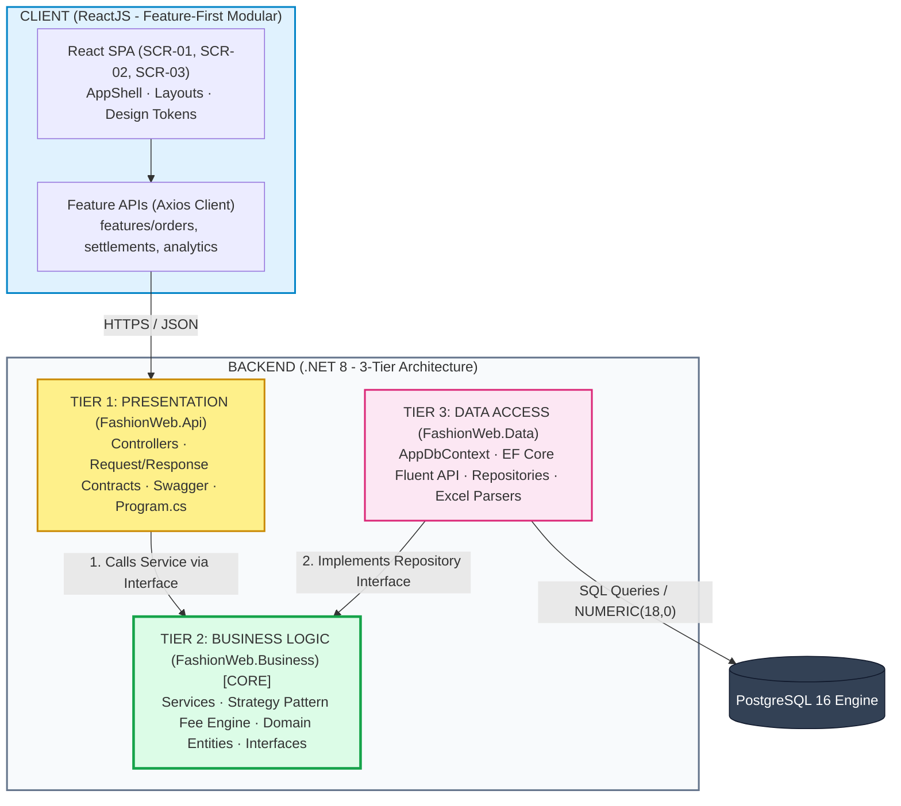

# System Folder Structures & Tiered Architecture Specification

> **Project:** FASHION-WEB — Multi-Channel Revenue & Settlement Management Platform  
> **Target Stack:** ReactJS (Feature-First) + ASP.NET Core Web API (.NET 8 3-Tiers) + EF Core + PostgreSQL 16  

## 1. Architectural Topology & Dependency Inversion

The system enforces strict decoupled separation between **Client-Side SPA** and **Server-Side API**, communicating exclusively via standard **RESTful HTTPS / JSON**:



### Invariant Dependency Inversion Rule:
```text
FashionWeb.Api      --> depends on --> FashionWeb.Business
FashionWeb.Data     --> depends on --> FashionWeb.Business
FashionWeb.Business --> PURE & INDEPENDENT (Zero dependency on Api or Data)
```
* **Architectural Rationale:** The `Business` tier is the system's independent heart. Fee calculation logic (Strategy Pattern), virtual revenue prevention, and immutable ledger rules remain completely decoupled from transport protocols (HTTP/REST) and database persistence mechanisms (EF Core / SQL).

---

## 2. Directory Layouts

### 2.1. Backend Solution (`backend/` — .NET 8 3-Tier Architecture)

```text
backend/
├── FashionWeb.sln                               # Visual Studio Solution binding all projects
│
├── src/
│   ├── FashionWeb.Api/                          # [TIER 1: PRESENTATION TIER]
│   │   ├── Controllers/                         # REST Controllers mapped to OpenAPI 3.0
│   │   │   ├── BaseApiController.cs             # Route prefix: /api/v1/[controller]
│   │   │   ├── OrdersController.cs              # POST /preview-fee, POST /orders, PATCH /status
│   │   │   ├── SettlementController.cs          # GET /ledger, POST /statements/import
│   │   │   ├── DiscrepanciesController.cs       # GET /discrepancies, POST /audit, PATCH /approve
│   │   │   └── AnalyticsController.cs           # GET /kpis, GET /trend, GET /export-csv
│   │   ├── Contracts/                           # Strongly typed Request & Response DTOs
│   │   │   ├── Orders/                          # CreateOrderRequest, FeePreviewRequest, OrderResponse
│   │   │   ├── Settlement/                      # StatementImportResponse, SettlementLedgerResponse
│   │   │   ├── Discrepancies/                   # CreateDiscrepancyRequest, DiscrepancyAuditResponse
│   │   │   └── Analytics/                       # ExecutiveKpisResponse, DailyTrendPointResponse
│   │   ├── Authorization/                       # Roles (SalesOps, FinanceManager, ShopOwner) & Policies
│   │   ├── Middleware/                          # GlobalExceptionMiddleware (standardized error responses)
│   │   ├── Program.cs                           # Composition Root: DI registration, CORS, Swagger
│   │   ├── appsettings.json                     # PostgreSQL connection string & config
│   │   └── FashionWeb.Api.csproj
│   │
│   ├── FashionWeb.Business/                     # [TIER 2: BUSINESS LOGIC TIER - INDEPENDENT CORE]
│   │   ├── Domain/
│   │   │   ├── Entities/                        # Order, OrderItem, OrderFeeSnapshot, FeeSchedule,
│   │   │   │                                    # StatementImport, ReconciliationRecord, DiscrepancyAudit
│   │   │   ├── Enums/                           # OrderStatus, ChannelType, PaymentMethod, ReconciliationStatus
│   │   │   └── ValueObjects/                    # Money (NUMERIC 18,0), FeeBreakdown
│   │   ├── Strategies/                          # STRATEGY PATTERN: Multi-Channel Platform Fee Calculation
│   │   │   ├── IPlatformFeeStrategy.cs          # Common interface: CalculateFees(subtotal, voucher)
│   │   │   ├── TikTokShopFeeStrategy.cs         # 4% Commission + 3% Payment + 2,000 VND Fixed Fee
│   │   │   ├── ShopeeFeeStrategy.cs             # 4.5% Commission + 4% Payment + 2% Freeship (max 20k)
│   │   │   ├── POSFeeStrategy.cs                # 1% Card/QR Fee - 0 VND Cash
│   │   │   └── FeeStrategyFactory.cs            # Channel code -> Strategy dispatcher
│   │   ├── Interfaces/
│   │   │   ├── Services/                        # IOrderService, IDynamicFeeEngine, ISettlementService,
│   │   │   │                                    # IDiscrepancyService, IAnalyticsService
│   │   │   └── Repositories/                    # IOrderRepository, IReconciliationRepository,
│   │   │                                        # IFeeScheduleRepository, IDiscrepancyRepository
│   │   ├── Services/                            # Concrete domain services implementing business rules
│   │   └── FashionWeb.Business.csproj
│   │
│   └── FashionWeb.Data/                         # [TIER 3: DATA ACCESS TIER]
│       ├── Context/
│       │   └── AppDbContext.cs                  # EF Core DbContext managing all entity sets
│       ├── Configurations/                      # Fluent API PostgreSQL mappings
│       │   ├── OrderConfiguration.cs            # Check constraints, sub-3s index, HasPrecision(18,0)
│       │   ├── OrderFeeSnapshotConfiguration.cs # Financial snapshot immutability
│       │   └── ReconciliationRecordConfiguration.cs
│       ├── Repositories/                        # EF Core repository implementations
│       ├── Parsers/                             # Excel/CSV statement parsers (ClosedXML / CsvHelper)
│       ├── Storage/                             # FileStorageService (SHA-256 deduplication)
│       └── FashionWeb.Data.csproj
│
└── tests/
    └── FashionWeb.Business.Tests/               # Automated Unit Tests (xUnit + Moq)
        ├── TikTokShopFeeStrategyTests.cs        # Verifies fee breakdown calculation against test cases
        └── FashionWeb.Business.Tests.csproj
```

---

### 2.2. Frontend Application (`frontend/` — ReactJS Feature-First Architecture)

```text
frontend/
├── package.json                                 # React 18, TypeScript, Vite, TanStack Query, Axios
├── tsconfig.json
├── index.html
│
└── src/
    ├── app/                                     # Global application bootstrap
    │   ├── App.tsx                              # Root layout mounting AppShell
    │   └── router.tsx                           # Route definitions (/orders, /settlements, /analytics)
    │
    ├── layouts/                                 # Shell layouts
    │   ├── AppShell.tsx                         # Global responsive wrapper (Sidebar + Topbar + Main)
    │   ├── Sidebar.tsx                          # Icon-rail navigation (Orders, Settlements, Analytics)
    │   └── Topbar.tsx                           # Header: Search, Current Role, System Status
    │
    ├── features/                                # DOMAIN BUSINESS MODULES (FEATURE-FIRST)
    │   ├── orders/                              # SCR-01: Multi-channel order management
    │   │   ├── api/ordersApi.ts                 # Axios calls: GET/POST /orders, PATCH /status
    │   │   ├── components/                      # Feature-specific UI components
    │   │   │   ├── RhythmStrip.tsx              # Order lifecycle pipeline cards
    │   │   │   └── OrderFilterPills.tsx         # Channel filter pills (TikTok, Shopee, POS)
    │   │   ├── types/order.types.ts             # Order, OrderItem, OrderStatus interfaces
    │   │   └── OrdersPage.tsx                   # Screen SCR-01 entry point
    │   │
    │   ├── settlements/                         # SCR-02: Platform fee & wallet reconciliation
    │   │   ├── api/settlementsApi.ts            # GET /ledger, POST /statements/import
    │   │   ├── types/settlement.types.ts        # Settlement ledger lines, import results
    │   │   └── SettlementsPage.tsx              # Screen SCR-02 entry point
    │   │
    │   ├── discrepancies/                       # Discrepancy dispute & audit management
    │   │   ├── api/discrepanciesApi.ts          # GET /discrepancies, POST /audit, PATCH /approve
    │   │   ├── types/discrepancy.types.ts       # Audit record types
    │   │   └── DiscrepanciesPage.tsx            # Dispute audit log screen
    │   │
    │   └── analytics/                           # SCR-03: Executive revenue & cash flow dashboard
    │       ├── api/analyticsApi.ts              # GET /kpis, GET /trend, GET /export-csv
    │       ├── types/analytics.types.ts         # KPI summaries, daily cashflow trend points
    │       └── AnalyticsDashboardPage.tsx       # Screen SCR-03 entry point
    │
    ├── shared/                                  # REUSABLE ACROSS ALL FEATURES
    │   ├── ui/                                  # Atomic UI components
    │   │   ├── Button.tsx                       # Enterprise pill-style button
    │   │   ├── Badge.tsx                        # Channel badges (TikTok, Shopee, POS) & status badges
    │   │   └── MoneyText.tsx                    # Tabular figures formatted currency (VNĐ)
    │   ├── api/                                 # Shared HTTP client & centralized endpoint URLs
    │   │   ├── httpClient.ts                    # Axios instance with auth headers & error interceptor
    │   │   └── apiEndpoints.ts                  # Centralized URL constants
    │   ├── lib/                                 # Shared utilities: formatters.ts (formatMoney, formatDate)
    │   ├── constants/channels.ts                # Channel codes, brand colors, labels
    │   └── types/common.types.ts                # Generic ApiResponse<T>, PaginatedResult<T>
    │
    └── styles/
        ├── tokens.css                           # Design tokens: palette, spacing, typography
        └── globals.css                          # CSS reset & .tabular-nums configuration
```

---

## 3. End-to-End Architectural Traceability Matrix

Every business feature traverses a unified, strictly typed path across Client, API, Business Core, and Data tiers:

| Business Feature | Frontend Component (React) | API Controller (`FashionWeb.Api`) | Business Service / Strategy (`FashionWeb.Business`) | Data Access (`FashionWeb.Data`) | Target Database Table |
|---|---|---|---|---|---|
| **Real-time Fee Preview** | `orders/CreateOrderModal.tsx` | `OrdersController.PreviewFee()` | `DynamicFeeEngine` $\rightarrow$ `IPlatformFeeStrategy` | `FeeScheduleRepository` | `fee_schedules` |
| **Multi-Channel Order Creation** | `orders/OrdersPage.tsx` | `OrdersController.CreateOrder()` | `OrderService.CreateOrderAsync()` | `OrderRepository.AddAsync()` | `orders`, `order_items` |
| **Delivery & Revenue Recognition** | `orders/OrdersPage.tsx` | `OrdersController.UpdateStatus()` | `OrderService.UpdateStatusAsync()` *(Takes immutable snapshot)* | `OrderRepository.UpdateAsync()` | `order_fee_snapshots` |
| **Order Cancellation** | `orders/OrdersPage.tsx` | `OrdersController.CancelOrder()` | `OrderService.CancelOrderAsync()` *(Excludes from revenue)* | `OrderRepository.UpdateAsync()` | `orders` |
| **Statement File Import & Match** | `settlements/SettlementsPage.tsx` | `SettlementController.ImportStatement()` | `StatementMatchingService.ImportStatementAsync()` | `ExcelStatementParser`, `ReconciliationRepo` | `statement_imports`, `reconciliation_records` |
| **Dispute Audit Logging** | `discrepancies/DiscrepanciesPage.tsx` | `DiscrepanciesController.CreateAudit()` | `DiscrepancyService.CreateAuditAsync()` | `DiscrepancyRepository` | `discrepancy_audits` |
| **Dispute Approval** | `discrepancies/DiscrepanciesPage.tsx` | `DiscrepanciesController.ApproveAudit()` | `DiscrepancyService.ApproveAuditAsync()` | `DiscrepancyRepository` | `discrepancy_audits` |
| **Executive 4-KPI Dashboard** | `analytics/AnalyticsDashboardPage.tsx` | `AnalyticsController.GetKpis()` | `AnalyticsService.GetKpisAsync()` *(Only `DELIVERED` orders)* | `OrderRepository`, `ReconciliationRepo` | `orders`, `order_fee_snapshots` |
| **Reconciliation CSV Export** | `analytics/AnalyticsDashboardPage.tsx` | `AnalyticsController.ExportCsv()` | `AnalyticsService.ExportReconciliationCsvAsync()` | `ReconciliationRepository` | `reconciliation_records` |

---

## 4. Architectural Invariants & Engineering Standards

1. **Strict Financial Precision:**
   - All financial attributes use `decimal` in C# and `NUMERIC(18,0)` in PostgreSQL.
   - EF Core Fluent API explicitly declares `.HasPrecision(18, 0)`.
   - `float` and `double` are strictly prohibited to prevent floating-point rounding discrepancies.
2. **Immutable Financial Snapshots:**
   - Upon order transition to `Delivered`, the system captures an immutable `OrderFeeSnapshot` recording exact commission, payment, and fixed fees at delivery time, isolating historical revenue from future fee rate adjustments.
3. **Revenue Recognition Invariant:**
   - Revenue is recognized **if and only if** order status is `DELIVERED`. `Pending`, `Shipped`, and `Cancelled` orders are strictly excluded from gross revenue and net cashflow calculations.
4. **Clean Code Separation:**
   - `FashionWeb.Business` contains zero references to EF Core, ASP.NET Core, or database drivers, ensuring pure testability via standard unit tests (`FashionWeb.Business.Tests`).
