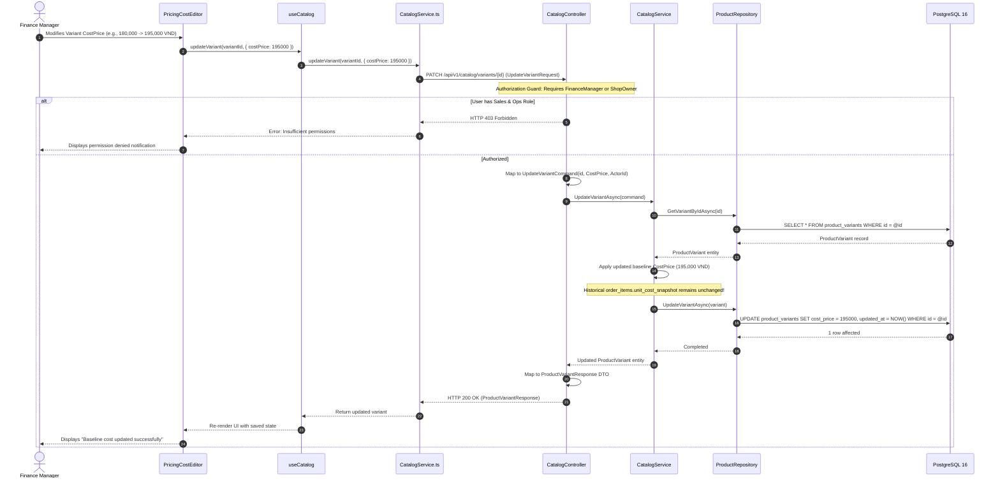
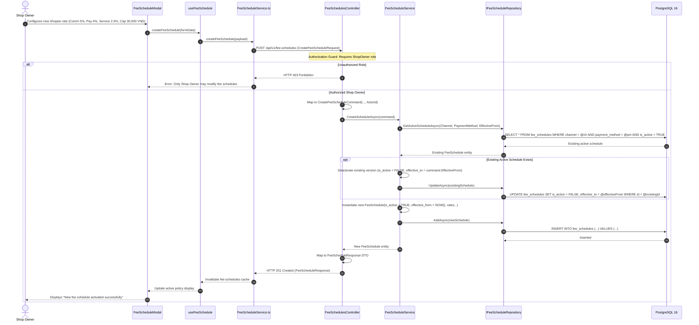
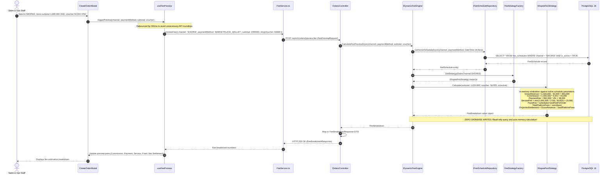
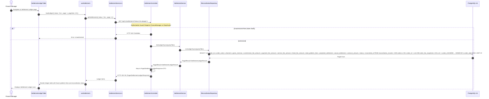
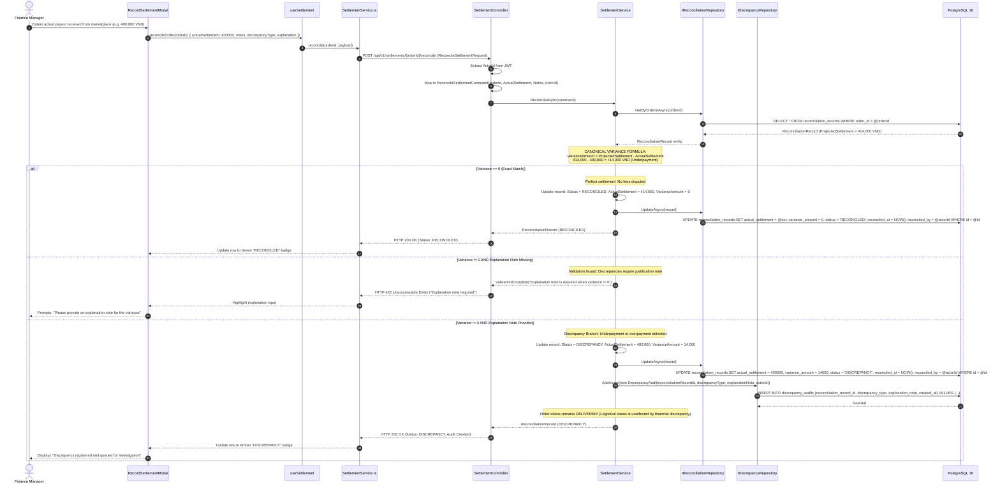

# Sequence Diagrams: Core API Workflows & Execution Lifelines

> **Target Stack:** React 18 SPA (TypeScript) $\rightarrow$ ASP.NET Core 8 Web API $\rightarrow$ PostgreSQL 16  
> **Source of Truth Hierarchy:** Requirements / Use Cases $\rightarrow$ Component Backend $\rightarrow$ Component Frontend $\rightarrow$ Database $\rightarrow$ OpenAPI (27 Operations) $\rightarrow$ Folder Structure $\rightarrow$ Sequences  

---

## Overview of 10 Core Workflows

This document establishes the authoritative sequence models for the 10 end-to-end workflows across the 3 backend tiers and React frontend feature modules:
1. **Sequence 1:** Catalog Maintenance & Baseline Cost Update (`UC12`)
2. **Sequence 2:** Fee Schedule Policy Versioning (`UC02` Configuration)
3. **Sequence 3:** Real-Time Zero-Persistence Fee Preview (`UC02`)
4. **Sequence 4:** Multi-Channel Order Creation & Baseline Cost Freezing (`UC01`)
5. **Sequence 5:** Order Delivery Progression & Atomic Fee Snapshot Freezing (`UC03`)
6. **Sequence 6:** Order Lifecycle Cancellation Boundary (`UC04`)
7. **Sequence 7:** Settlement Ledger Query & Platform Fee Audit (`UC05`)
8. **Sequence 8:** Manual Settlement Reconciliation & Variance Branching (`UC06`)
9. **Sequence 9:** Discrepancy Investigation & Resolution (`UC07`)
10. **Sequence 10:** 5-KPI Financial Analytics Aggregation & CSV Export (`UC08`–`UC11`)

---

## 1. Sequence 1: Catalog Maintenance & Baseline Cost Update (UC12)

> **Use Case:** `UC12` (Maintain Baseline Unit Cost & Product Catalog)  
> **Endpoint:** `PATCH /catalog/variants/{id}` (`updateVariant`)  
> **Source Files:** `features/catalog/components/PricingCostEditor.tsx`, `hooks/useCatalog.ts`, `api/CatalogService.ts` $\rightarrow$ `CatalogController.cs` $\rightarrow$ `CatalogService.cs` $\rightarrow$ `ProductRepository.cs`  
> **Tables:** `product_variants`, `products`  
> **Actors:** `Finance Manager` or `Shop Owner` (Sales & Ops Staff forbidden)  



---

## 2. Sequence 2: Fee Schedule Policy Versioning (UC02 Configuration)

> **Use Case:** Supporting configuration for `UC02` (Fee Schedule Policy & Versioning)  
> **P06 Endpoint:** `POST /fee-schedules` (`createFeeSchedule`)  
> **P07 Source Files:** `features/orders/components/FeeScheduleModal.tsx`, `hooks/useFeeSchedule.ts`, `api/FeeScheduleService.ts` $\rightarrow$ `FeeSchedulesController.cs` $\rightarrow$ `FeeScheduleService.cs` $\rightarrow$ `FeeScheduleRepository.cs`  
> **P05 Tables:** `fee_schedules`  
> **Actors:** `Shop Owner` only (Finance Manager has Read-Only access; Sales Staff has No Access)  



---

## 3. Sequence 3: Real-Time Zero-Persistence Fee Preview (UC02)

> **Use Case:** `UC02` (Real-Time Platform Fee Estimation & Preview)  
> **Endpoint:** `POST /orders/preview-fee` (`previewOrderFee`)  
> **Source Files:** `features/orders/components/CreateOrderModal.tsx`, `hooks/useFeePreview.ts`, `api/FeeService.ts` $\rightarrow$ `OrdersController.cs` $\rightarrow$ `IDynamicFeeEngine.cs` $\rightarrow$ `DynamicFeeEngine.cs` $\rightarrow$ `FeeStrategyFactory.cs` $\rightarrow$ `IPlatformFeeStrategy.cs`  
> **Tables:** `fee_schedules` (Read-only lookup; ZERO database writes)  
> **Actors:** `Sales & Ops Staff`, `Finance Manager`, `Shop Owner`  



---

## 4. Sequence 4: Multi-Channel Order Creation & Baseline Cost Freezing (UC01)

> **Use Case:** `UC01` (Create Order & Baseline Cost Freezing)  
> **P06 Endpoint:** `POST /orders` (`createOrder`)  
> **P07 Source Files:** `features/orders/components/CreateOrderModal.tsx`, `hooks/useOrders.ts`, `api/OrderService.ts` $\rightarrow$ `OrdersController.cs` $\rightarrow$ `OrderService.cs` $\rightarrow$ `ProductRepository.cs` $\rightarrow$ `OrderRepository.cs`  
> **P05 Tables:** `orders`, `order_items`, `order_status_history`, `product_variants`  
> **Actors:** `Sales & Ops Staff`, `Shop Owner`  

```mermaid
sequenceDiagram
    autonumber
    actor Staff as Sales & Ops Staff
    participant UI as CreateOrderModal
    participant Hook as useOrders
    participant ApiClient as OrderService.ts
    participant Ctrl as OrdersController
    participant Svc as OrderService
    participant ProdRepo as IProductRepository
    participant OrderRepo as IOrderRepository
    participant DB as PostgreSQL 16

    Staff->>UI: Submits Order (channel, paymentMethod, externalOrderCode, voucher, variant items)
    UI->>Hook: createOrder(requestPayload)
    Hook->>ApiClient: createOrder(requestPayload)
    ApiClient->>Ctrl: POST /api/v1/orders (CreateOrderRequest)

    Ctrl->>Ctrl: Extract ActorId from JWT Claims
    Ctrl->>Ctrl: Map to CreateOrderCommand(..., ActorId)
    Ctrl->>Svc: CreateOrderAsync(command)

    opt ExternalOrderCode is provided
        Svc->>OrderRepo: GetByExternalCodeAsync(command.Channel, command.ExternalOrderCode)
        OrderRepo->>DB: SELECT id FROM orders WHERE channel = @ch AND external_order_code = @ext
        DB-->>OrderRepo: Match found (if duplicate)
        alt Duplicate External Order Detected
            OrderRepo-->>Svc: Existing Order
            Svc-->>Ctrl: DuplicateOrderException("External order already registered")
            Ctrl-->>ApiClient: HTTP 409 Conflict ("Order code already exists for this channel")
            ApiClient-->>UI: Highlight duplicate error
            UI-->>Staff: Displays duplicate conflict notification
        end
    end

    Svc->>ProdRepo: GetVariantsByIdsAsync(itemVariantIds)
    ProdRepo->>DB: SELECT * FROM product_variants JOIN products ... WHERE id IN (...)
    DB-->>ProdRepo: ProductVariant rows (sku_code, product_name, cost_price)
    ProdRepo-->>Svc: ProductVariant entities

    Note over Svc: Server-Side Baseline Cost & Snapshot Freezing:<br/>- Read current SkuCode, ProductName, and CostPrice from catalog<br/>- LineTotal = Quantity * UnitPrice<br/>- TotalCost = Quantity * UnitCostSnapshot<br/>- Subtotal = sum(LineTotal)<br/>- GrossRevenue = Subtotal - ShopVoucher<br/>- Initial Status = PENDING (Applies to all channels, including POS)

    Svc->>OrderRepo: AddAsync(newOrder)
    Note over OrderRepo, DB: Persist in PostgreSQL:<br/>1. INSERT INTO orders (status = 'PENDING', subtotal, gross_revenue...)<br/>2. INSERT INTO order_items (sku_code_snapshot, product_name_snapshot, unit_cost_snapshot...)<br/>3. INSERT INTO order_status_history (from = NULL, to = 'PENDING', changed_by = ActorId)
    OrderRepo->>DB: INSERT INTO orders ...; INSERT INTO order_items ...; INSERT INTO order_status_history ...;
    DB-->>OrderRepo: Success
    OrderRepo-->>Svc: Order persisted
    Svc-->>Ctrl: Order entity
    Ctrl->>Ctrl: Map to OrderDetailResponse DTO
    Ctrl-->>ApiClient: HTTP 201 Created (OrderDetailResponse)
    ApiClient-->>Hook: New Order Data
    Hook-->>UI: Close modal & refresh orders list
    UI-->>Staff: Displays "Order created successfully in PENDING status"
```

---

## 5. Sequence 5: Order Delivery Progression & Atomic Fee Snapshot Freezing (UC03)

> **Use Case:** `UC03` (Order Status Progression & Fee Snapshot Freezing on Delivery)  
> **Endpoint:** `PATCH /orders/{id}/status` (`updateOrderStatus`)  
> **Source Files:** `features/orders/components/OrderStatusActions.tsx`, `hooks/useOrders.ts`, `api/OrderService.ts` $\rightarrow$ `OrdersController.cs` $\rightarrow$ `OrderService.cs` $\rightarrow$ `IDynamicFeeEngine.cs` $\rightarrow$ `IUnitOfWork.cs`  
> **Tables:** `orders`, `order_status_history`, `order_fee_snapshots`, `reconciliation_records`  
> **Actors:** `Sales & Ops Staff`, `Shop Owner`  

```mermaid
sequenceDiagram
    autonumber
    actor Staff as Sales & Ops Staff
    participant UI as OrderStatusActions
    participant ApiClient as OrderService.ts
    participant Ctrl as OrdersController
    participant Svc as OrderService
    participant Engine as IDynamicFeeEngine
    participant Uow as IUnitOfWork
    participant DB as PostgreSQL 16

    Note over Staff, UI: Progression Stage 1: PENDING -> SHIPPED
    Staff->>UI: Clicks "Mark as Shipped"
    UI->>ApiClient: updateOrderStatus(orderId, { targetStatus: 'SHIPPED' })
    ApiClient->>Ctrl: PATCH /api/v1/orders/{id}/status (UpdateOrderStatusRequest)
    Ctrl->>Svc: UpdateOrderStatusAsync(UpdateOrderStatusCommand(orderId, SHIPPED, ActorId))
    Svc->>DB: UPDATE orders SET status = 'SHIPPED'; INSERT INTO order_status_history (PENDING -> SHIPPED);
    Ctrl-->>UI: HTTP 200 OK (Status: SHIPPED)

    Note over Staff, UI: Progression Stage 2: SHIPPED -> DELIVERED (Revenue & Fee Recognition Boundary)
    Staff->>UI: Clicks "Confirm Delivery"
    UI->>ApiClient: updateOrderStatus(orderId, { targetStatus: 'DELIVERED' })
    ApiClient->>Ctrl: PATCH /api/v1/orders/{id}/status (UpdateOrderStatusRequest)
    Ctrl->>Svc: UpdateOrderStatusAsync(UpdateOrderStatusCommand(orderId, DELIVERED, ActorId))

    Svc->>Svc: Validate valid transition (SHIPPED -> DELIVERED)
    Svc->>Engine: CalculateAndFreezeFeeAsync(order)
    Note over Engine: Resolves active FeeSchedule and executes Platform Strategy.<br/>Generates OrderFeeSnapshot with applied rates and exact fee amounts.
    Engine-->>Svc: OrderFeeSnapshot instance

    Note over Svc, Uow: ATOMIC TRANSACTION BOUNDARY (IUnitOfWork)<br/>All 4 operations must succeed or rollback together:
    Svc->>Uow: ExecuteTransactionAsync()
    Uow->>DB: 1. UPDATE orders SET status = 'DELIVERED', updated_at = NOW() WHERE id = @id
    Uow->>DB: 2. INSERT INTO order_status_history (order_id, from_status = 'SHIPPED', to_status = 'DELIVERED', changed_by = @actorId)
    Uow->>DB: 3. INSERT INTO order_fee_snapshots (order_id, fee_schedule_id, commission_fee_amount, payment_fee_amount, service_fee_amount, total_platform_fees, projected_settlement...)
    Uow->>DB: 4. INSERT INTO reconciliation_records (order_id, projected_settlement = @proj, status = 'PENDING_SETTLEMENT')
    Uow->>DB: COMMIT TRANSACTION
    DB-->>Uow: Transaction Committed Successfully
    Uow-->>Svc: Completed

    Svc-->>Ctrl: Updated Order entity with FeeSnapshot
    Ctrl->>Ctrl: Map to OrderDetailResponse DTO
    Ctrl-->>ApiClient: HTTP 200 OK (OrderDetailResponse)
    ApiClient-->>UI: Refresh UI
    UI-->>Staff: Order marked DELIVERED; Fee Snapshot & Settlement Ledger initialized
```

---

## 6. Sequence 6: Order Lifecycle Cancellation Boundary (UC04)

> **Use Case:** `UC04` (Cancel Order Lifecycle Boundary)  
> **P06 Endpoint:** `PATCH /orders/{id}/status` (`updateOrderStatus` with `CANCELLED`)  
> **P07 Source Files:** `features/orders/components/CancelOrderModal.tsx`, `hooks/useOrders.ts`, `api/OrderService.ts` $\rightarrow$ `OrdersController.cs` $\rightarrow$ `OrderService.cs` $\rightarrow$ `OrderRepository.cs`  
> **P05 Tables:** `orders`, `order_status_history`  
> **Actors:** `Sales & Ops Staff`, `Shop Owner`  

```mermaid
sequenceDiagram
    autonumber
    actor Staff as Sales & Ops Staff
    participant UI as CancelOrderModal
    participant ApiClient as OrderService.ts
    participant Ctrl as OrdersController
    participant Svc as OrderService
    participant Repo as IOrderRepository
    participant DB as PostgreSQL 16

    Staff->>UI: Submits cancellation with reason: "Customer requested cancellation before shipment"
    UI->>ApiClient: updateOrderStatus(orderId, { targetStatus: 'CANCELLED', changeReason: 'Customer requested' })
    ApiClient->>Ctrl: PATCH /api/v1/orders/{id}/status (UpdateOrderStatusRequest)
    Ctrl->>Svc: UpdateOrderStatusAsync(UpdateOrderStatusCommand)
    Svc->>Repo: GetByIdAsync(orderId)
    Repo->>DB: SELECT * FROM orders WHERE id = @id
    DB-->>Repo: Order record
    Repo-->>Svc: Order entity

    alt Order status is DELIVERED
        Note over Svc: Terminal State Guard: Delivered orders cannot be cancelled via standard lifecycle
        Svc-->>Ctrl: InvalidOrderStateException("Delivered orders cannot be cancelled; returns/refunds out-of-scope")
        Ctrl-->>ApiClient: HTTP 422 Unprocessable Entity ("Cannot cancel delivered order")
        ApiClient-->>UI: Error: Delivered orders cannot be cancelled
        UI-->>Staff: Displays error banner
    else Order status is PENDING or SHIPPED
        Svc->>Svc: Transition status to CANCELLED
        Svc->>Repo: UpdateAsync(order)
        Repo->>DB: UPDATE orders SET status = 'CANCELLED', updated_at = NOW() WHERE id = @id
        Svc->>Repo: AddStatusHistoryAsync(history)
        Repo->>DB: INSERT INTO order_status_history (from_status = @prev, to_status = 'CANCELLED', change_reason = @reason, changed_by = @actorId)
        DB-->>Repo: Committed
        Repo-->>Svc: Success
        Note over Svc: Anti-Phantom Revenue Rule: No fee snapshot is created.<br/>Financial Analytics excludes this order.
        Svc-->>Ctrl: Order entity (CANCELLED)
        Ctrl-->>ApiClient: HTTP 200 OK (OrderDetailResponse)
        ApiClient-->>UI: Update status badge to CANCELLED
        UI-->>Staff: Confirms order cancellation
    end
```

---

## 7. Sequence 7: Settlement Ledger Query & Platform Fee Audit (UC05)

> **Use Case:** `UC05` (Settlement Ledger & Reconciliation Status Ingestion)  
> **P06 Endpoint:** `GET /settlements` (`listSettlementLedger`), `GET /settlements/summary` (`getSettlementSummary`)  
> **P07 Source Files:** `features/settlements/components/SettlementLedgerTable.tsx`, `hooks/useSettlement.ts`, `api/SettlementService.ts` $\rightarrow$ `SettlementController.cs` $\rightarrow$ `SettlementService.cs` $\rightarrow$ `ReconciliationRepository.cs`  
> **P05 Tables:** `reconciliation_records`, `orders`, `order_fee_snapshots`  
> **Actors:** `Finance Manager`, `Shop Owner` (Sales & Ops Staff forbidden)  



---

## 8. Sequence 8: Manual Settlement Reconciliation & Variance Branching (UC06)

> **Use Case:** `UC06` (Manual Settlement Reconciliation & Variance Computation)  
> **Endpoint:** `POST /settlements/{orderId}/reconcile` (`reconcileSettlement`)  
> **Source Files:** `features/settlements/components/RecordSettlementModal.tsx`, `hooks/useSettlement.ts`, `api/SettlementService.ts` $\rightarrow$ `SettlementController.cs` $\rightarrow$ `SettlementService.cs` $\rightarrow$ `ReconciliationRepository.cs`, `DiscrepancyRepository.cs`  
> **Tables:** `reconciliation_records`, `discrepancy_audits`, `orders`  
> **Actors:** `Finance Manager`, `Shop Owner`  



---

## 9. Sequence 9: Discrepancy Investigation & Resolution (UC07)

> **Use Case:** `UC07` (Discrepancy Audit Investigation & Resolution)  
> **Endpoint:** `PATCH /discrepancies/{id}/resolve` (`resolveDiscrepancy`)  
> **Source Files:** `features/discrepancies/components/DiscrepancyReviewAction.tsx`, `hooks/useDiscrepancies.ts`, `api/DiscrepancyService.ts` $\rightarrow$ `DiscrepanciesController.cs` $\rightarrow$ `DiscrepancyService.cs` $\rightarrow$ `DiscrepancyRepository.cs`  
> **Tables:** `discrepancy_audits`  
> **Actors:** `Finance Manager` or `Shop Owner` (Both possess direct resolution authority; no multi-step executive board approval)  

```mermaid
sequenceDiagram
    autonumber
    actor Fin as Finance Manager
    participant UI as DiscrepancyReviewAction
    participant Hook as useDiscrepancies
    participant ApiClient as DiscrepancyService.ts
    participant Ctrl as DiscrepanciesController
    participant Svc as DiscrepancyService
    participant Repo as IDiscrepancyRepository
    participant DB as PostgreSQL 16

    Fin->>UI: Enters resolution findings: "Platform adjusted shipping fee subsidy retrospectively; verified with ticket #SHP-9921"
    UI->>Hook: resolveDiscrepancy(discrepancyId, { resolutionNotes: 'Platform adjusted shipping fee...' })
    Hook->>ApiClient: resolve(discrepancyId, payload)
    ApiClient->>Ctrl: PATCH /api/v1/discrepancies/{id}/resolve (ResolveDiscrepancyRequest)

    Note over Ctrl: Authorization Guard: Requires FinanceManager or ShopOwner
    Ctrl->>Ctrl: Extract ActorId from JWT
    Ctrl->>Ctrl: Map to ResolveDiscrepancyCommand(id, ResolutionNotes, ActorId)
    Ctrl->>Svc: ResolveDiscrepancyAsync(command)

    Svc->>Repo: GetByIdAsync(command.DiscrepancyId)
    Repo->>DB: SELECT * FROM discrepancy_audits WHERE id = @id
    DB-->>Repo: DiscrepancyAudit record
    Repo-->>Svc: DiscrepancyAudit entity

    Svc->>Svc: Apply resolution:<br/>resolutionNotes = command.ResolutionNotes<br/>resolvedBy = command.ActorId<br/>resolvedAt = DateTime.UtcNow
    Note over Svc: isResolved is derived dynamically: (resolvedAt != null)
    Svc->>Repo: UpdateAsync(audit)
    Repo->>DB: UPDATE discrepancy_audits SET resolution_notes = @notes, resolved_by = @actorId, resolved_at = NOW() WHERE id = @id
    DB-->>Repo: 1 row affected
    Repo-->>Svc: Completed

    Svc-->>Ctrl: Updated DiscrepancyAudit entity
    Ctrl->>Ctrl: Map to DiscrepancyDetailResponse DTO (isResolved = true)
    Ctrl-->>ApiClient: HTTP 200 OK (DiscrepancyDetailResponse)
    ApiClient-->>Hook: Invalidate discrepancies query cache
    Hook-->>UI: Update status badge to "Resolved" with resolver timestamp
    UI-->>Fin: Displays "Discrepancy resolved and closed"
```

---

## 10. Sequence 10: 5-KPI Financial Analytics Aggregation & CSV Export (UC08–UC11)

> **Use Case:** `UC08` (Financial KPIs Dashboard), `UC09` (Trend Analysis), `UC10` (Channel Performance), `UC11` (Top SKU Profitability)  
> **Endpoints:** `GET /analytics/kpis`, `GET /analytics/trend`, `GET /analytics/channel-breakdown`, `GET /analytics/top-skus`, `GET /analytics/drilldown`, `GET /analytics/export-csv`  
> **Source Files:** `features/analytics/components/KpiCards.tsx`, `SourceOrderDrilldown.tsx`, `hooks/useAnalytics.ts`, `api/AnalyticsService.ts` $\rightarrow$ `AnalyticsController.cs` $\rightarrow$ `AnalyticsService.cs` $\rightarrow$ `AnalyticsRepository.cs`  
> **Tables:** `orders`, `order_items`, `order_fee_snapshots` (Filtered strictly by `orders.status = 'DELIVERED'`)  
> **Actors:** `Finance Manager`, `Shop Owner` (Sales & Ops Staff forbidden)  

```mermaid
sequenceDiagram
    autonumber
    actor Owner as Shop Owner
    participant UI as KpiCards & SourceOrderDrilldown
    participant Hook as useAnalytics
    participant ApiClient as AnalyticsService.ts
    participant Ctrl as AnalyticsController
    participant Svc as IAnalyticsService
    participant Repo as IAnalyticsRepository
    participant DB as PostgreSQL 16

    Note over Owner, UI: Sub-workflow A: Executive Dashboard Load (5 Canonical KPIs)
    Owner->>UI: Opens Financial Analytics Dashboard (Filter: This Month)
    UI->>Hook: fetchKpis({ fromDate, toDate, channel: 'ALL' })
    Hook->>ApiClient: getFinancialKpis(params)
    ApiClient->>Ctrl: GET /api/v1/analytics/kpis?fromDate=...&toDate=...

    Ctrl->>Svc: GetKpisAsync(filter)
    Svc->>Repo: QueryKpisAsync(filter)
    Note over Repo, DB: Canonical Filter Applied in SQL:<br/>WHERE orders.status = 'DELIVERED' AND orders.order_date BETWEEN @from AND @to
    Repo->>DB: SELECT SUM(o.subtotal - o.shop_voucher) AS gross_revenue, SUM(s.total_platform_fees) AS total_platform_fees, SUM(s.projected_settlement) AS projected_settlement, SUM(i.quantity * i.unit_cost_snapshot) AS cogs, COUNT(DISTINCT o.id) AS delivered_count FROM orders o JOIN order_fee_snapshots s ON o.id = s.order_id JOIN order_items i ON o.id = i.order_id WHERE o.status = 'DELIVERED' AND o.order_date >= @from AND o.order_date <= @to
    DB-->>Repo: Aggregate metric columns
    Note over Repo: Computes ContributionProfit = projected_settlement - cogs<br/>Computes ContributionMarginPct = (ContributionProfit / gross_revenue) * 100
    Repo-->>Svc: FinancialKpiResult (5 KPIs + margin ratio)
    Svc-->>Ctrl: FinancialKpiResult
    Ctrl->>Ctrl: Map to FinancialKpiResponse DTO
    Ctrl-->>ApiClient: HTTP 200 OK (FinancialKpiResponse: Gross Revenue, Platform Fees, Projected Settlement, COGS, Contribution Profit)
    ApiClient-->>Hook: 5 KPI values
    Hook-->>UI: Update KPI Summary Cards

    Note over Owner, UI: Sub-workflow B: CSV Audit Export
    Owner->>UI: Clicks [Export Financial Data (CSV)]
    UI->>ApiClient: exportCsv({ fromDate, toDate })
    ApiClient->>Ctrl: GET /api/v1/analytics/export-csv?fromDate=...&toDate=...
    Ctrl->>Svc: ExportCsvAsync(filter)
    Svc->>Repo: QueryRawExportDataAsync(filter)
    Repo->>DB: SELECT o.order_code, o.order_date, o.channel, o.gross_revenue, s.total_platform_fees, s.projected_settlement, SUM(i.quantity * i.unit_cost_snapshot) AS cogs, (s.projected_settlement - SUM(i.quantity * i.unit_cost_snapshot)) AS contribution_profit FROM orders o JOIN order_fee_snapshots s ON o.id = s.order_id JOIN order_items i ON o.id = i.order_id WHERE o.status = 'DELIVERED' GROUP BY o.id, s.id ORDER BY o.order_date DESC
    DB-->>Repo: Export raw recordset
    Repo-->>Svc: List<DrilldownOrderResult>
    Svc->>Svc: Format CSV byte stream with UTF-8 BOM & header columns
    Svc-->>Ctrl: byte[] csvBytes
    Ctrl-->>ApiClient: HTTP 200 OK (Content-Type: text/csv, Content-Disposition: attachment; filename="financial_export.csv")
    ApiClient-->>UI: Triggers browser file download
    UI-->>Owner: File "financial_export.csv" downloaded
```
