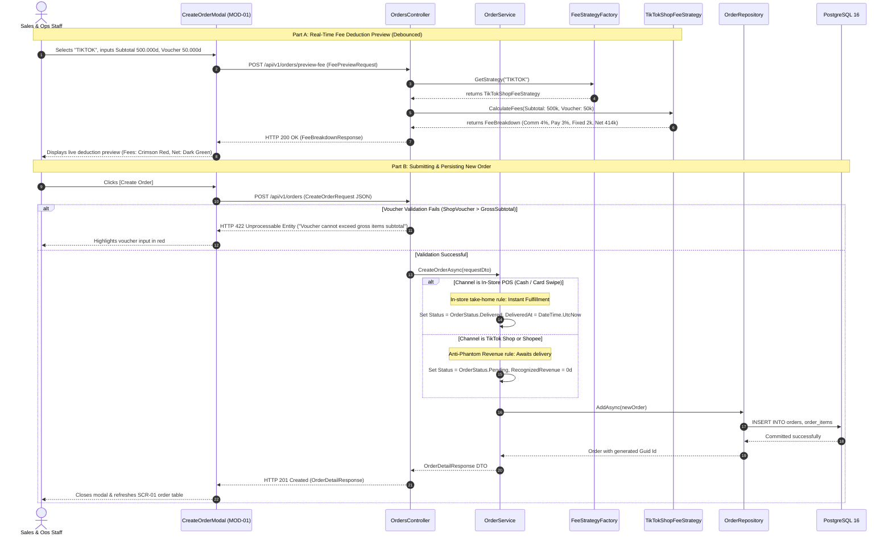
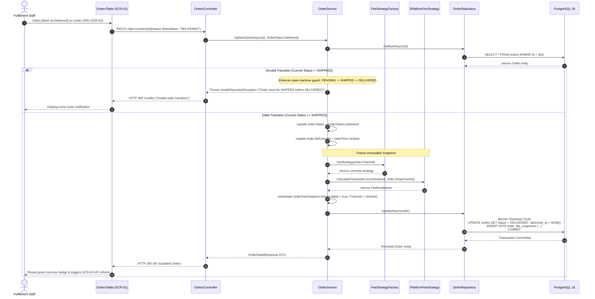
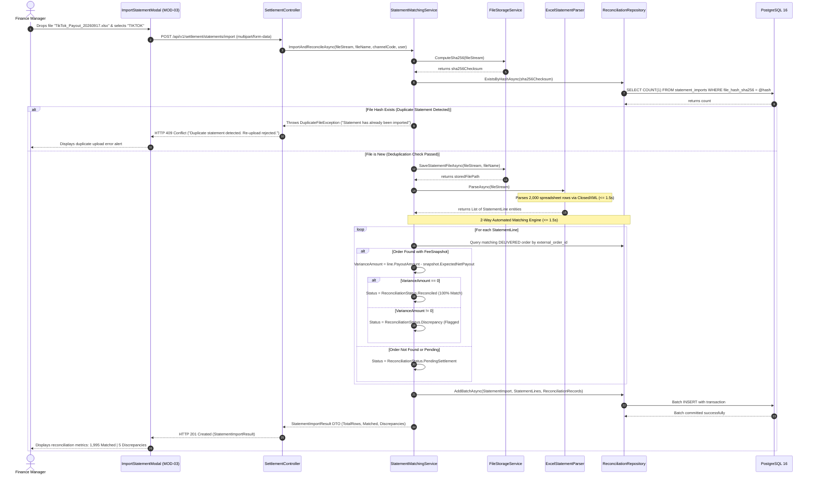
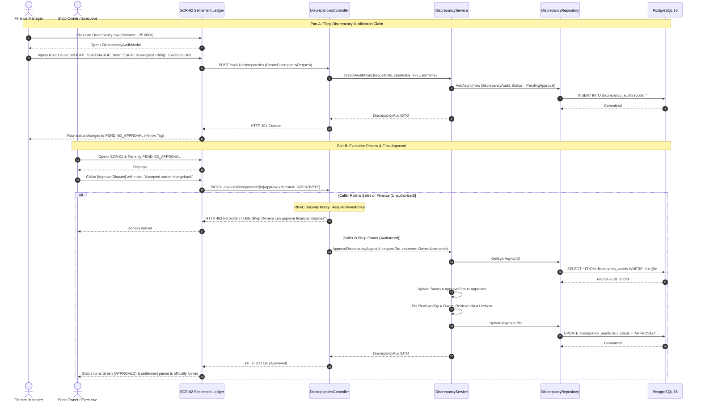

# 05 — Sequence Diagrams: Core API Workflows

---

## 1. Scope & Execution Scenarios

This document details the exact sequence of cross-tier calls, validation guards, and error responses for the 6 core operational workflows:
1. **Scenario 1:** Real-Time Fee Preview & Multi-Channel Order Creation (`MOD-01`)
2. **Scenario 2:** Order Lifecycle State Transitions & Immutable Snapshot Freezing (`SCR-01`)
3. **Scenario 3:** Order Cancellation & Zero Phantom Revenue Enforcement (`MOD-02`)
4. **Scenario 4:** Statement Ingestion, SHA-256 Deduplication & 2-Way Batch Reconciliation (`MOD-03`)
5. **Scenario 5:** Discrepancy Auditing & Executive Board Approval (`#DIS-002`)
6. **Scenario 6:** Executive KPI Aggregation & Streaming CSV Audit Export (`SCR-03`)

---

## 2. Scenario 1: Real-Time Fee Preview & Multi-Channel Order Creation (MOD-01)

This scenario demonstrates live fee calculation while typing, voucher boundary verification, and initial order state assignment:



---

## 3. Scenario 2: Order Lifecycle Transitions & Immutable Snapshot Freezing

This scenario enforces the **Zero Phantom Revenue** invariant — revenue is recognized and platform fees are immutably frozen if and only if an order transitions to `DELIVERED`:



---

## 4. Scenario 3: Order Cancellation & Phantom Revenue Exclusion (MOD-02)

This scenario demonstrates order cancellation handling and blocks cancellation for already finalized accounting ledgers:

```mermaid
sequenceDiagram
    autonumber
    actor Staff as Sales & Ops Staff
    participant UI as CancelOrderModal (MOD-02)
    participant API as OrdersController
    participant Svc as OrderService
    participant Repo as OrderRepository
    participant DB as PostgreSQL 16

    Staff->>UI: Selects reason "Out of Stock" & clicks [Confirm Cancel]
    UI->>API: POST /api/v1/orders/{id}/cancel (CancelOrderRequest)

    API->>Svc: CancelOrderAsync(id, reason)
    Svc->>Repo: GetByIdAsync(id)
    Repo->>DB: SELECT * FROM orders WHERE id = @id
    DB-->>Repo: returns Order entity

    alt Order is Already DELIVERED
        Note over Svc: Financial Immutability rule: Finalized ledgers cannot be cancelled
        Svc-->>API: Throws BusinessRuleException ("Delivered orders cannot be cancelled")
        API-->>UI: HTTP 422 Unprocessable Entity ("Cannot cancel finalized delivery; requires formal refund journal")
        UI-->>Staff: Blocks action with warning modal
    else Order is PENDING or SHIPPED
        Svc->>Svc: Update order.Status = OrderStatus.Cancelled
        Svc->>Svc: Record order.CancellationReason & CancelledAt
        Svc->>Repo: UpdateAsync(order)
        Repo->>DB: UPDATE orders SET status = 'CANCELLED', cancellation_reason = @reason
        DB-->>Repo: Success
        Svc-->>API: Completed
        API-->>UI: HTTP 204 No Content
        UI-->>Staff: Displays cancellation confirmation toast
        Note over DB: Cancelled order contributes 0 VND to all financial revenue analytics
    end
```

---

## 5. Scenario 4: Statement Ingestion, SHA-256 Deduplication & 2-Way Batch Reconciliation (MOD-03)

This scenario models the automated spreadsheet ingestion, cryptographic duplicate detection, and two-way reconciliation pipeline:



---

## 6. Scenario 5: Discrepancy Auditing & Executive Board Approval (#DIS-002)

This scenario models the audit justification workflow where finance staff logs dispute claims and only the shop owner holds binding approval authority:



---

## 7. Scenario 6: Executive KPI Aggregation & Streaming CSV Export (SCR-03)

This scenario models real-time analytics aggregation over `DELIVERED` orders and high-volume CSV streaming:

```mermaid
sequenceDiagram
    autonumber
    actor Owner as Shop Owner / Executive
    participant UI as RevenueDashboard (SCR-03)
    participant API as AnalyticsController
    participant Svc as AnalyticsService
    participant Repo as AnalyticsRepository
    participant DB as PostgreSQL 16

    Owner->>UI: Selects Filter: "This Month", Channel: "ALL"
    UI->>API: GET /api/v1/analytics/kpis?from=2026-09-01&to=2026-09-30&channel=ALL

    API->>Svc: GetKPIsAsync(fromDate, toDate, channel)
    Svc->>Repo: GetDeliveredOrdersAggregateAsync(fromDate, toDate, channel)
    
    Note over Repo, DB: Zero Phantom Revenue: Filters strictly by DELIVERED
    Repo->>DB: SELECT SUM(gross_subtotal - shop_voucher) as Gross,<br/>SUM(total_platform_fees) as Fees,<br/>SUM(expected_net_payout) as Net<br/>FROM orders o JOIN order_fee_snapshots s ON o.id = s.order_id<br/>WHERE o.status = 'DELIVERED' AND o.delivered_at BETWEEN @from AND @to
    DB-->>Repo: returns aggregate row
    Repo-->>Svc: KpiAggregateData
    Svc-->>API: ExecutiveKPIsResponse DTO
    API-->>UI: HTTP 200 OK (ExecutiveKPIsResponse)
    UI-->>Owner: Renders 4 KPI cards (Total Sales, Total Fees, Net Cash, Delivered Count)

    %% CSV Streaming Export
    Note over Owner, DB: Streaming CSV Export
    Owner->>UI: Clicks [Export CSV Audit Report]
    UI->>API: GET /api/v1/analytics/export-csv
    API->>Svc: ExportReconciliationCsvAsync()
    Svc->>Repo: StreamReconciliationRecordsAsync()
    Repo->>DB: Open read-only cursor on reconciliation_records
    DB-->>Repo: Stream row chunks
    Repo-->>Svc: Yield line records
    Svc-->>API: Byte array stream (text/csv)
    API-->>UI: HTTP 200 OK with Content-Disposition: attachment; filename="Reconciliation_Report_20260917.csv"
    UI-->>Owner: Triggers browser file download (Zero RAM blowup)
```
