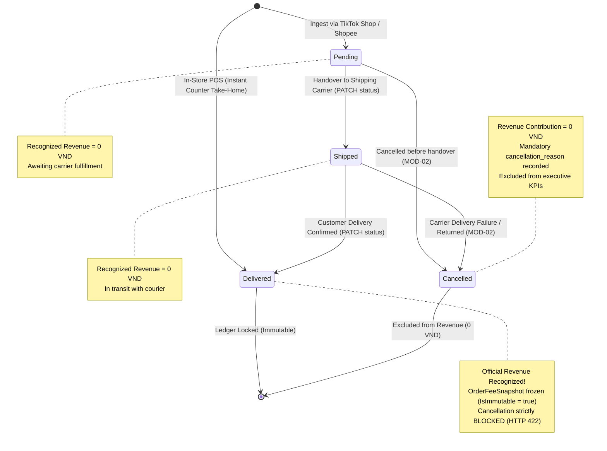
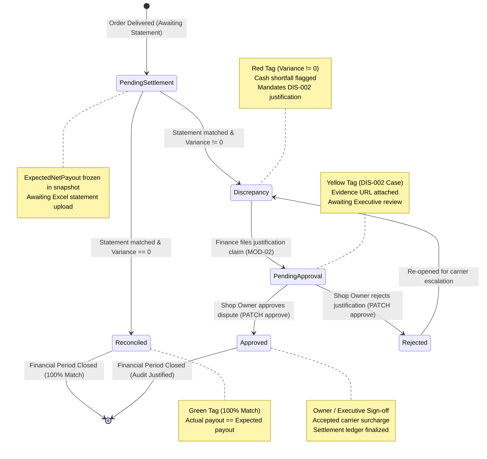

# 06 — State Diagrams: Financial Lifecycle State Machines

---

## 1. Scope & State Machine Overview

Financial rigor requires determinism. In FASHION-WEB, money never moves without explicit state machine transitions governed by 2 core state models:
1. **State Machine 1 — Order Lifecycle State Machine:** Governs order progression across fulfillment stages and guarantees that revenue is recognized if and only if an order reaches `DELIVERED`.
2. **State Machine 2 — Settlement & Discrepancy Audit State Machine:** Governs wallet payout reconciliation against bank statements, variance isolation, and executive dispute sign-off.

---

## 2. State Machine 1: Multi-Channel Order Lifecycle

This state machine implements the **Zero Phantom Revenue** rule:

### Transition Guard Conditions:

| Source State | Target State | Triggering API / Event | Guard Condition / Validation Rule | Architectural Impact |
|---|---|---|---|---|
| `[*] (None)` | `PENDING` | `POST /orders` | Channel is `TIKTOK` or `SHOPEE`. Voucher $\le$ Subtotal. | Order saved with recognized revenue = **0 VND**. |
| `[*] (None)` | `DELIVERED` | `POST /orders` | Channel is `POS` (Cash or Card/QR Swipe). | Instant counter take-home; revenue recognized immediately. |
| `PENDING` | `SHIPPED` | `PATCH /orders/{id}/status` | Order must currently be in `PENDING`. | Handover recorded; revenue remains **0 VND**. |
| `SHIPPED` | `DELIVERED` | `PATCH /orders/{id}/status` | Order must currently be in `SHIPPED`. Transition from `PENDING` directly to `DELIVERED` is blocked with HTTP `409 Conflict`. | **Official Revenue Recognized.** Computes fees via Strategy and creates immutable `OrderFeeSnapshot`. |
| `PENDING` or `SHIPPED` | `CANCELLED` | `POST /orders/{id}/cancel` | Mandatory non-empty `cancellation_reason`. | Order excluded 100% from financial reports. |
| `DELIVERED` | `CANCELLED` | *Prohibited* | **Strictly Forbidden:** Finalized delivery cannot be cancelled via standard API. Returns HTTP `422 Unprocessable Entity`. | Preserves audit trail integrity. Requires formal return/refund journal. |

---

## 3. State Machine 2: Wallet Settlement & Discrepancy Auditing

This state machine governs payout reconciliation, variance detection, and executive resolution (#DIS-002):

### Reconciliation State Matrix:

| Status Code | Badge Color | Triggering Event | Mathematical Invariant | Actor Authority | Next Permitted Action |
|---|:---:|---|---|:---:|---|
| `PendingSettlement` | Grey | Order transitions to `DELIVERED`. | $\text{ActualSettledAmount} = \text{null}$ | System Automated | Upload bank/wallet statement via `MOD-03`. |
| `Reconciled` | Green | Statement row matched with external order ID. | $\text{VarianceAmount} = \text{Actual} - \text{Expected} = \mathbf{0 \text{ VND}}$ | System Automated | Ledger row locked; period closed. |
| `Discrepancy` | Red | Statement row matched with non-zero variance. | $\text{VarianceAmount} \neq \mathbf{0 \text{ VND}}$ (e.g. $-25,000 \text{ VND}$) | System Automated | Finance manager must file `#DIS-002` audit case. |
| `PendingApproval` | Yellow | Finance manager submits dispute claim with evidence. | `#DIS-XXXX` generated with Root Cause and Evidence URL. | Finance Manager | Awaiting Shop Owner review. |
| `Approved` | Green | Shop Owner reviews and signs off on variance. | Surcharge formally accepted as legitimate business expense. | **Shop Owner Only (RBAC)** | Settlement period locked and archived. |
| `Rejected` | Red | Shop Owner rejects justification note. | Dispute remanded for carrier re-investigation or clawback. | **Shop Owner Only (RBAC)** | Finance manager must re-negotiate with logistics carrier. |
