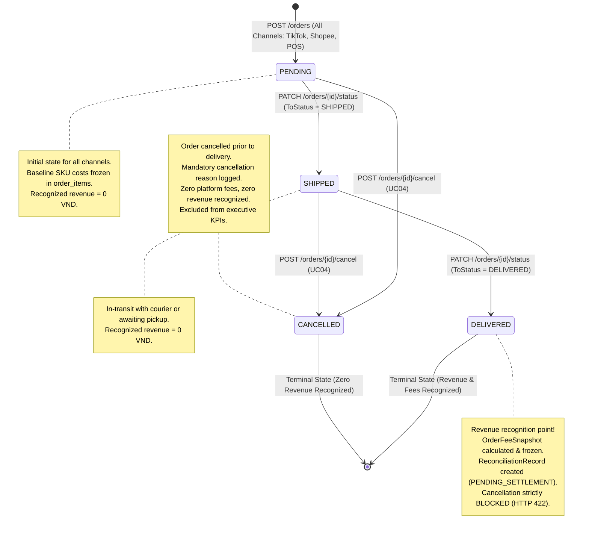
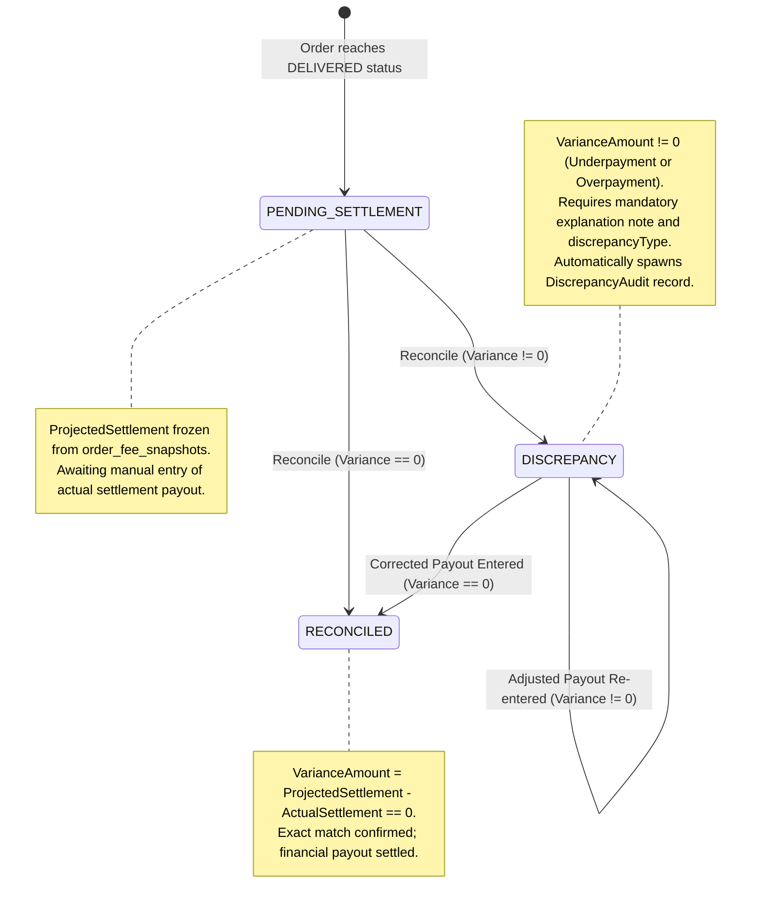

# State Diagrams: Order Lifecycle & Financial Audit State Machines

> **Target Stack:** ASP.NET Core 8 Web API + PostgreSQL 16  
> **Source of Truth Hierarchy:** Requirements / Use Cases $\rightarrow$ Component Backend $\rightarrow$ Database $\rightarrow$ OpenAPI (27 Operations) $\rightarrow$ Folder Structure $\rightarrow$ State Diagrams  

---

## 1. Scope & State Machine Overview

Financial accuracy requires deterministic lifecycle management. In FASHION-WEB, financial recognition and state progression are governed by 3 distinct state machines:
1. **State Machine 1 — Order Lifecycle State Machine:** Governs operational order fulfillment across all channels and guarantees zero phantom revenue by recognizing revenue if and only if an order reaches `DELIVERED`.
2. **State Machine 2 — Settlement Reconciliation State Machine:** Governs platform payout verification, variance evaluation against frozen projected settlements, and discrepancy isolation.
3. **State Machine 3 — Discrepancy Audit Resolution State Machine:** Governs the audit investigation lifecycle from open discrepancy to resolution sign-off.

---

## 2. State Machine 1: Multi-Channel Order Lifecycle

> **Use Cases:** `UC01` (Create Order), `UC03` (Order Delivery), `UC04` (Cancel Order)  
> **Endpoints:** `POST /orders`, `PATCH /orders/{id}/status`, `POST /orders/{id}/cancel`  
> **Source Files:** `FashionWeb.Business/Domain/Entities/Order.cs`, `FashionWeb.Business/Domain/Enums/OrderStatus.cs`, `FashionWeb.Business/Services/OrderService.cs`  
> **Tables:** `orders`, `order_status_history`, `order_fee_snapshots`, `reconciliation_records`  
> **Actors:** `Sales & Ops Staff`, `Shop Owner`  



### Transition Guards & Business Rules (Order Lifecycle)

| Source State | Target State | Triggering API | Guard Condition / Validation Rule | Architectural & Financial Impact |
|---|---|---|---|---|
| `[*] (None)` | `PENDING` | `POST /orders` | Valid items list ($>0$); `ShopVoucher` $\le$ `Subtotal`. | Ingests order for all channels (including Direct Store POS). Copies catalog baseline costs to `order_items.unit_cost_snapshot`. Recognized Revenue = **0 VND**. |
| `PENDING` | `SHIPPED` | `PATCH /orders/{id}/status` | `ToStatus = SHIPPED`. Current state must be `PENDING`. | Appends record to `order_status_history`. Recognized Revenue = **0 VND**. |
| `PENDING` | `CANCELLED` | `POST /orders/{id}/cancel` | Mandatory `cancellationReason` provided. | Appends record to `order_status_history`. Order becomes terminal. Zero revenue recognized. |
| `SHIPPED` | `DELIVERED` | `PATCH /orders/{id}/status` | `ToStatus = DELIVERED`. Current state must be `SHIPPED`. | **Revenue Recognition Point**: Executes `IDynamicFeeEngine`, freezes `OrderFeeSnapshot`, creates `ReconciliationRecord` (`PENDING_SETTLEMENT`) in an atomic transaction (`IUnitOfWork`). |
| `SHIPPED` | `CANCELLED` | `POST /orders/{id}/cancel` | Courier return or pre-delivery failure. Mandatory reason code. | Order terminated prior to settlement initiation. No fees evaluated. |
| `DELIVERED` | `CANCELLED` | `POST /orders/{id}/cancel` | **BLOCKED** | Returns **HTTP 422 Unprocessable Entity**. Delivered orders cannot be cancelled via the standard order lifecycle (returns/refunds out-of-scope). |

---

## 3. State Machine 2: Settlement Reconciliation State Machine

> **Use Cases:** `UC05` (Settlement Ledger), `UC06` (Manual Settlement Reconciliation)  
> **Endpoints:** `GET /settlements`, `POST /settlements/{orderId}/reconcile`  
> **Source Files:** `FashionWeb.Business/Domain/Entities/ReconciliationRecord.cs`, `FashionWeb.Business/Domain/Enums/ReconciliationStatus.cs`, `FashionWeb.Business/Services/SettlementService.cs`  
> **Tables:** `reconciliation_records`, `discrepancy_audits`  
> **Actors:** `Finance Manager`, `Shop Owner`  



### Transition Guards & Business Rules (Settlement Reconciliation)

| Source State | Target State | Triggering API | Guard Condition / Validation Rule | Architectural & Financial Impact |
|---|---|---|---|---|
| `[*] (None)` | `PENDING_SETTLEMENT` | Atomic trigger on order delivery | `Order.Status` transitions to `DELIVERED`. | Inserts `reconciliation_records` row with `projected_settlement = OrderFeeSnapshot.ProjectedSettlement`, `actual_settlement = NULL`, `variance_amount = NULL`. |
| `PENDING_SETTLEMENT` | `RECONCILED` | `POST /settlements/{orderId}/reconcile` | `ProjectedSettlement - ActualSettlement == 0`. | Updates `actual_settlement`, sets `variance_amount = 0`, sets `reconciled_at = NOW()`, sets `reconciled_by = @actorIdentity`. |
| `PENDING_SETTLEMENT` | `DISCREPANCY` | `POST /settlements/{orderId}/reconcile` | `ProjectedSettlement - ActualSettlement != 0`. `notes` and `discrepancyType` must be provided. | Sets `status = 'DISCREPANCY'`. Calculates `variance_amount`. In atomic transaction, automatically inserts a child row in `discrepancy_audits`. Order status remains `DELIVERED`. |
| `PENDING_SETTLEMENT` | `PENDING_SETTLEMENT` | `POST /settlements/{orderId}/reconcile` | `variance != 0` AND (`notes` missing OR `discrepancyType` missing). | **BLOCKED**: Returns **HTTP 422 Unprocessable Entity**. State does not advance. |
| `DISCREPANCY` | `RECONCILED` | `POST /settlements/{orderId}/reconcile` | Corrected actual payout entered such that `variance == 0`. | Payout correction overrides previous discrepancy. State transitions to `RECONCILED`. |
| `DISCREPANCY` | `DISCREPANCY` | `POST /settlements/{orderId}/reconcile` | Re-entered payout still results in `variance != 0`. | Updates `actual_settlement` and `variance_amount`. Adds or updates discrepancy audit trail. |

---

## 4. State Machine 3: Discrepancy Audit Investigation & Resolution State Machine

> **Use Case:** `UC07` (Discrepancy Audit Investigation & Resolution)  
> **Endpoints:** `GET /discrepancies`, `GET /discrepancies/{id}`, `PATCH /discrepancies/{id}/resolve`  
> **Source Files:** `FashionWeb.Business/Domain/Entities/DiscrepancyAudit.cs`, `FashionWeb.Business/Domain/Enums/DiscrepancyType.cs`, `FashionWeb.Business/Services/DiscrepancyService.cs`  
> **Tables:** `discrepancy_audits`  
> **Actors:** `Finance Manager`, `Shop Owner`  

```mermaid
stateDiagram-v2
    direction LR

    [*] --> OPEN : Spawned by Discrepancy Reconciliation

    OPEN --> RESOLVED : PATCH /discrepancies/{id}/resolve (Resolution Notes Provided)
    RESOLVED --> [*] : Audit Investigation Closed

    note top of OPEN
        Derived State:
        ResolvedAt IS NULL
        Requires investigation by Finance Manager or Shop Owner
    end note

    note top of RESOLVED
        Derived State:
        ResolvedAt IS NOT NULL
        Resolution notes and resolver identity recorded
    end note
```

### Transition Guards & Business Rules (Discrepancy Audit)

| Source State | Target State | Triggering API | Guard Condition / Validation Rule | Architectural & Financial Impact |
|---|---|---|---|---|
| `[*] (None)` | `OPEN` | Child creation on discrepancy | Spawned automatically when `ReconciliationRecord` status transitions to `DISCREPANCY`. | Row inserted into `discrepancy_audits` with `reconciliation_record_id`, `discrepancy_type`, `explanation_note = notes`, `created_at = NOW()`, `resolved_at = NULL`. |
| `OPEN` | `RESOLVED` | `PATCH /discrepancies/{id}/resolve` | `resolutionNotes` must not be empty. Actor must possess `FinanceManager` or `ShopOwner` role. | Updates `resolution_notes = @notes`, `resolved_by = @actorIdentity`, `resolved_at = NOW()`. Dynamic property `IsResolved` evaluates to `true`. |
| `RESOLVED` | Any | `PATCH /discrepancies/{id}/resolve` | Already resolved audit record. | RESOLVED is terminal for the target state model. |
