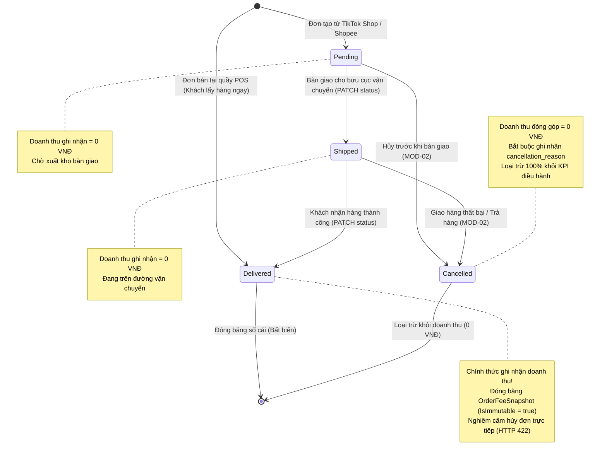
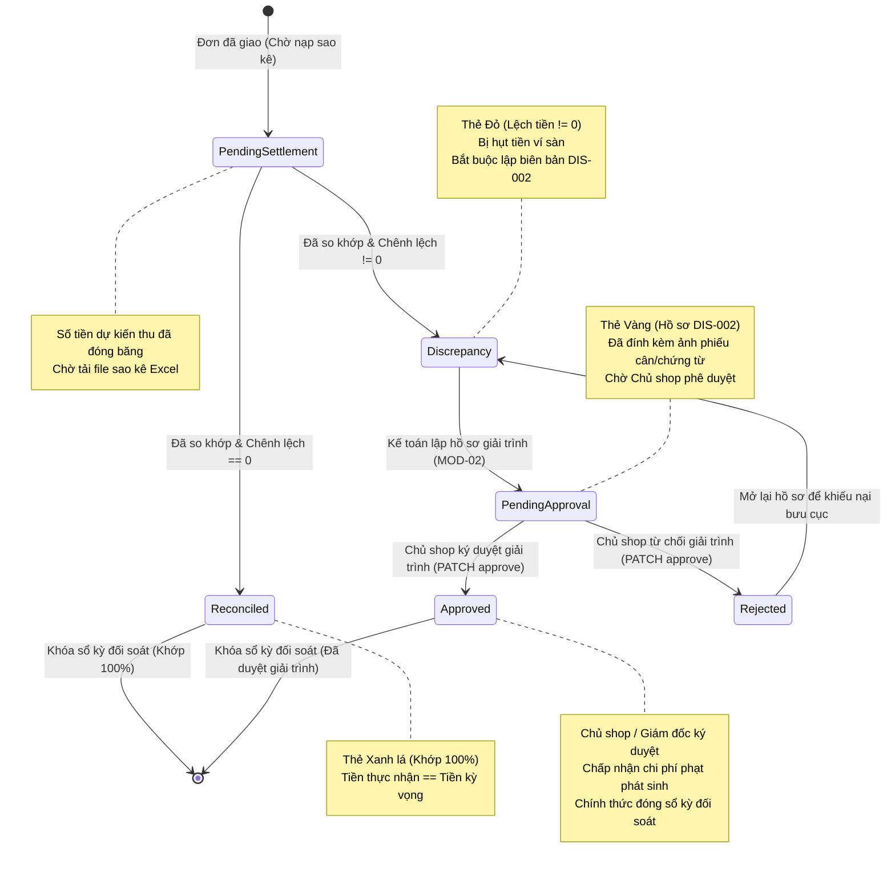

# 06 — Sơ Đồ Trạng Thái: Các Máy Trạng Thái Tài Chính Bất Biến (State Diagrams)

> **Phạm vi tầng:** Các máy trạng thái miền nghiệp vụ (`FashionWeb.Business.Domain`)  
> **Nguyên tắc quản trị:** Chống doanh thu ảo (Zero Phantom Revenue), Bất biến sổ cái, Phân quyền phê duyệt RBAC

---

## 1. Tổng Quan Về Các Máy Trạng Thái Tài Chính

Trong kế toán tài chính, mọi sự dịch chuyển của dòng tiền đều phải được kiểm soát chặt chẽ bằng trạng thái xác định. FASHION-WEB được quản trị bởi 2 máy trạng thái cốt lõi:
1. **Máy trạng thái 1 — Vòng đời Đơn hàng Đa kênh (Order Lifecycle State Machine):** Điều phối các giai đoạn thực hiện đơn và đảm bảo doanh thu chỉ được ghi nhận khi đơn đạt trạng thái `DELIVERED`.
2. **Máy trạng thái 2 — Quyết toán Ví & Kiểm toán Sai lệch (Settlement & Discrepancy State Machine):** Điều phối quy trình so khớp tiền về từ bảng kê ngân hàng, phát hiện lệch tiền và phê duyệt đóng sổ đối soát.

---

## 2. Máy Trạng Thái 1: Vòng Đời Đơn Hàng Đa Kênh

Sơ đồ này hiện thực hóa nguyên tắc **Chống Doanh Thu Ảo (Zero Phantom Revenue)**:

### Điều Kiện Chuyển Trạng Thái:

| Trạng thái gốc | Trạng thái đích | API / Sự kiện kích hoạt | Ràng buộc kiểm tra (Guard Condition) | Ý nghĩa kiến trúc |
|---|---|---|---|---|
| `[*] (Chưa có)` | `PENDING` | `POST /orders` | Kênh bán là `TIKTOK` hoặc `SHOPEE`. Voucher $\le$ Tiền hàng. | Lưu đơn với doanh thu ghi nhận = **0 VNĐ**. |
| `[*] (Chưa có)` | `DELIVERED` | `POST /orders` | Kênh bán là `POS` (Tiền mặt hoặc Quẹt thẻ/QR). | Lấy hàng tại quầy; ghi nhận doanh thu ngay tức thì. |
| `PENDING` | `SHIPPED` | `PATCH /orders/{id}/status` | Đơn hàng bắt buộc đang ở trạng thái `PENDING`. | Ghi nhận bàn giao bưu cục; doanh thu vẫn = **0 VNĐ**. |
| `SHIPPED` | `DELIVERED` | `PATCH /orders/{id}/status` | Đơn hàng bắt buộc đang ở `SHIPPED`. Nghiêm cấm nhảy cóc từ `PENDING` sang `DELIVERED` (trả về HTTP `409 Conflict`). | **Chính thức ghi nhận doanh thu.** Tính phí sàn qua Strategy và tạo ảnh chụp `OrderFeeSnapshot` bất biến. |
| `PENDING` hoặc `SHIPPED` | `CANCELLED` | `POST /orders/{id}/cancel` | Bắt buộc phải có lý do hủy `cancellation_reason`. | Loại trừ 100% đơn hàng khỏi toàn bộ báo cáo tài chính. |
| `DELIVERED` | `CANCELLED` | *Bị nghiêm cấm* | **Tuyệt đối cấm hủy:** Đơn đã giao không được hủy trực tiếp qua API. Trả về mã lỗi HTTP `422 Unprocessable Entity`. | Bảo toàn tính bất biến của sổ cái. Muốn trả hàng phải lập chứng từ hoàn tiền/nhập trả riêng biệt. |

---

## 3. Máy Trạng Thái 2: Quyết Toán Ví & Kiểm Toán Sai Lệch

Sơ đồ này điều phối việc kiểm tra dòng tiền bảng kê thực tế và quy trình ký duyệt giải trình chênh lệch (#DIS-002):

### Bảng Ma Trận Trạng Thái Đối Soát:

| Mã trạng thái | Màu hiển thị | Sự kiện kích hoạt | Ràng buộc toán học | Thẩm quyền thực hiện | Thao tác tiếp theo |
|---|:---:|---|---|:---:|---|
| `PendingSettlement` | Xám | Đơn chuyển sang `DELIVERED`. | $\text{ActualSettledAmount} = \text{null}$ | Hệ thống tự động | Tải lên file sao kê ví sàn qua `MOD-03`. |
| `Reconciled` | Xanh lá | Dòng sao kê khớp mã đơn sàn. | $\text{VarianceAmount} = \text{Thực nhận} - \text{Kỳ vọng} = \mathbf{0 \text{ VNĐ}}$ | Hệ thống tự động | Dòng sổ cái được khóa; kỳ đối soát hoàn tất. |
| `Discrepancy` | Đỏ | Dòng sao kê có chênh lệch tiền. | $\text{VarianceAmount} \neq \mathbf{0 \text{ VNĐ}}$ (ví dụ: $-25.000 \text{ VNĐ}$) | Hệ thống tự động | Kế toán viên bắt buộc phải lập biên bản giải trình `#DIS-002`. |
| `PendingApproval` | Vàng | Kế toán nộp hồ sơ kèm chứng từ. | Mã hồ sơ `#DIS-XXXX` được sinh ra kèm nguyên nhân và link ảnh. | Kế toán viên | Chờ Chủ shop kiểm tra và phê duyệt. |
| `Approved` | Xanh lá | Chủ shop đồng ý với giải trình. | Chấp nhận khoản hụt tiền là chi phí hoạt động hợp lệ. | **Chỉ Chủ Shop (RBAC)** | Kỳ đối soát được khóa chính thức và lưu trữ. |
| `Rejected` | Đỏ | Chủ shop bác bỏ lý do giải trình. | Trả hồ sơ để tiếp tục khiếu nại bưu cục đòi tiền bồi thường. | **Chỉ Chủ Shop (RBAC)** | Kế toán viên phải làm việc lại với bên đơn vị vận chuyển. |
