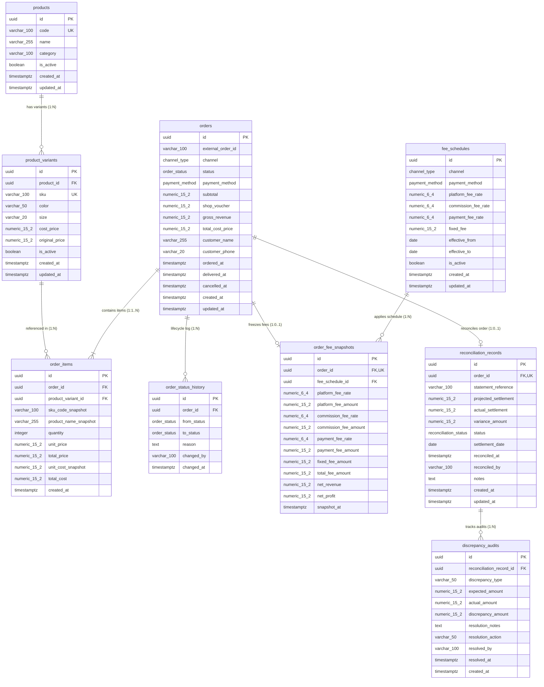

# Database Design Specification: Target MVP Relational Schema

---

## 1. Architectural Overview & Engineering Standards

### 1.1 Purpose & Scope
This document specifies the **Target MVP Database Architecture** for the Fashion Multi-Channel Revenue and Profit Management System. 

> [!IMPORTANT]
> **Independent Target Specification:** The schema defined in `schema.dbml` and detailed herein represents an independent, clean-room target relational design optimized for ACID transaction integrity, strict financial auditing, and multi-channel reconciliation. 
### 1.2 Core Standards & Architectural Invariants
- **Target RDBMS:** **PostgreSQL 16+** with native transactional ACID guarantees.
- **Naming Conventions:** Strict `snake_case` across all tables, columns, indexes, and constraints.
- **Primary Key Standard:** Universal `uuid` (UUID v4 via `gen_random_uuid()`) for all business entity tables to prevent enumeration attacks and support distributed ingestion.
- **Monetary Precision:** All monetary amounts are typed as `numeric(15, 2)`. Floating-point types (`float`, `double`, `real`) are strictly prohibited to prevent IEEE 754 precision issues.
- **Timestamp Standard:** All temporal fields are stored as `timestamptz` in **UTC**. Conversion to local business timezone (`Asia/Ho_Chi_Minh`, UTC+7) is handled exclusively at presentation/query boundaries.
- **Fee Rate Conventions:** Percentage rates are stored as fractional decimals (`numeric(6, 4)`), where `0.0400` represents 4.00% and `0.0100` represents 1.00%.
- **Core Scope:** Exactly **9 core transactional tables** organized into 4 cohesive functional domains.

---

## 2. Target Entity-Relationship Diagram (ERD)

The following diagram reflects the canonical structure declared in [`schema.dbml`](file:///c:/AI_thuc_chien_khoa_3/VSF/Quanly_DoanhThu_LoiNhuan_DangDucHoa_VSF/docs/database/schema.dbml):



---

## 3. Database Enumerations

| Enum Name | Allowed Values | Description |
| :--- | :--- | :--- |
| `channel_type` | `TIKTOK`, `SHOPEE`, `POS` | Multi-channel sales origination source. |
| `payment_method` | `CASH`, `POS_CARD_QR`, `MARKETPLACE_WALLET` | Settlement instrument used by the customer. |
| `order_status` | `PENDING`, `SHIPPED`, `DELIVERED`, `CANCELLED`, `RETURNED` | Unified order operational lifecycle status. |
| `reconciliation_status`| `PENDING`, `MATCHED`, `DISCREPANCY`, `RESOLVED` | Audit status between internal books and channel payout statements. |

---

## 4. Core Table Catalog

### 4.1 Group: Catalog & Pricing

#### Table: `products`
Root product entity representing the master fashion style/model.
- **Primary Key:** `id` (`uuid`, default: `gen_random_uuid()`).
- **Natural Key:** `code` (`varchar(100)` unique, not null).
- **Core Columns:** `name` (`varchar(255)`), `category` (`varchar(100)`), `is_active` (`boolean`, default: `true`).
- **Audit Columns:** `created_at`, `updated_at` (`timestamptz`).
- **Key Constraints:** `UNIQUE (code)`, `CHECK (length(code) >= 2)`.

#### Table: `product_variants`
Specific sellable stock-keeping units (SKUs) defined by color and size combinations.
- **Primary Key:** `id` (`uuid`).
- **Foreign Key:** `product_id` -> `products(id)` ON DELETE RESTRICT.
- **Natural Key:** `sku` (`varchar(100)` unique, not null).
- **Financial Baseline:**
  - `cost_price` (`numeric(15,2)`): Cost of goods sold (COGS) base. Must be `>= 0`.
  - `original_price` (`numeric(15,2)`): Listed retail price. Must be `>= cost_price`.
- **Attributes:** `color` (`varchar(50)`), `size` (`varchar(20)`), `is_active` (`boolean`).
- **Indexes:** `idx_product_variants_product_id`, `idx_product_variants_sku`.

---

### 4.2 Group: Orders & Lifecycle Management

#### Table: `orders`
Master sales order entity recording multi-channel commercial transactions.
- **Primary Key:** `id` (`uuid`).
- **Channel Identity:**
  - `channel` (`channel_type`, not null).
  - `external_order_id` (`varchar(100)`): External order identifier from marketplace or POS.
  - **Constraint:** `UNIQUE (channel, external_order_id)` ensures idempotent order ingestion.
- **Financial Columns:**
  - `subtotal` (`numeric(15,2)`): Gross item sum before discounts.
  - `shop_voucher` (`numeric(15,2)`): Merchant-funded discount.
  - `gross_revenue` (`numeric(15,2)`): Realized sales revenue (`subtotal - shop_voucher`).
  - `total_cost_price` (`numeric(15,2)`): Aggregated COGS for all line items.
- **Lifecycle & Temporal Columns:**
  - `status` (`order_status`, default: `PENDING`).
  - `ordered_at` (`timestamptz`, not null).
  - `delivered_at` (`timestamptz`, nullable, populated upon successful customer delivery).
  - `cancelled_at` (`timestamptz`, nullable, populated if cancelled/returned).
- **Check Constraints:**
  - `CHECK (gross_revenue = subtotal - shop_voucher)`
  - `CHECK (delivered_at IS NULL OR delivered_at >= ordered_at)`
- **Key Indexes:**
  - `idx_orders_channel_external (channel, external_order_id)`
  - `idx_orders_status_delivered (status, delivered_at)` (for anti-phantom revenue queries)
  - `idx_orders_ordered_at (ordered_at)`

#### Table: `order_items`
Detailed line items for each order, maintaining an immutable historical audit snapshot.
- **Primary Key:** `id` (`uuid`).
- **Foreign Keys:**
  - `order_id` -> `orders(id)` ON DELETE CASCADE.
  - `product_variant_id` -> `product_variants(id)` ON DELETE RESTRICT.
- **Immutable Snapshots:**
  - `sku_code_snapshot` (`varchar(100)`): SKU text at purchase time.
  - `product_name_snapshot` (`varchar(255)`): Product name at purchase time.
  - `unit_cost_snapshot` (`numeric(15,2)`): Unit COGS frozen at order placement.
- **Line Calculations:**
  - `quantity` (`integer`, check `> 0`).
  - `unit_price` (`numeric(15,2)`, check `>= 0`).
  - `total_price` (`numeric(15,2)`, check `= quantity * unit_price`).
  - `total_cost` (`numeric(15,2)`, check `= quantity * unit_cost_snapshot`).

#### Table: `order_status_history`
Append-only chronological state machine audit log.
- **Primary Key:** `id` (`uuid`).
- **Foreign Key:** `order_id` -> `orders(id)` ON DELETE CASCADE.
- **Columns:** `from_status` (`order_status`), `to_status` (`order_status`), `reason` (`text`), `changed_by` (`varchar(100)`), `changed_at` (`timestamptz`).
- **Immutability:** Strictly append-only. Updates and deletes are prohibited by policy/triggers.

---

### 4.3 Group: Fees & Financial Snapshots

#### Table: `fee_schedules`
Configurable fee policy matrix keyed by channel and payment method.
- **Primary Key:** `id` (`uuid`).
- **Lookup Dimensions:**
  - `channel` (`channel_type`).
  - `payment_method` (`payment_method`).
- **Fee Rate Columns (`numeric(6,4)` fractional decimal):**
  - `platform_fee_rate` (e.g., `0.0400` for 4.00%).
  - `commission_fee_rate` (e.g., `0.0250` for 2.50%).
  - `payment_fee_rate` (e.g., `0.0100` for 1.00% card/QR; `0.0000` for cash).
  - `fixed_fee` (`numeric(15,2)`, flat fee per order).
- **Temporal Validity:**
  - `effective_from` (`date`, not null).
  - `effective_to` (`date`, nullable; null denotes open-ended validity).
- **Constraints:**
  - `CHECK (effective_to IS NULL OR effective_to >= effective_from)`
  - Partial unique index ensures no overlapping active policies per channel/payment combination.

#### Table: `order_fee_snapshots`
Frozen financial and fee snapshot created when an order transitions to `DELIVERED`.
- **Primary Key:** `id` (`uuid`).
- **Cardinality:** Exactly `1:0..1` with `orders`.
  - `order_id` (`uuid`, UNIQUE, FK -> `orders(id)` ON DELETE RESTRICT).
  - `fee_schedule_id` (`uuid`, FK -> `fee_schedules(id)` ON DELETE RESTRICT).
- **Fee Calculations:**
  - `platform_fee_amount = gross_revenue * platform_fee_rate`
  - `commission_fee_amount = gross_revenue * commission_fee_rate`
  - `payment_fee_amount = gross_revenue * payment_fee_rate`
  - `total_fee_amount = platform_fee_amount + commission_fee_amount + payment_fee_amount + fixed_fee_amount`
- **Net Performance Metrics:**
  - `net_revenue = gross_revenue - total_fee_amount`
  - `net_profit = net_revenue - total_cost_price`
- **Audit:** `snapshot_at` (`timestamptz`).

---

### 4.4 Group: Settlement & Reconciliation

#### Table: `reconciliation_records`
Financial settlement comparison between expected payouts and actual marketplace/bank disbursements.
- **Primary Key:** `id` (`uuid`).
- **Cardinality:** Exactly `1:0..1` with `orders`.
  - `order_id` (`uuid`, UNIQUE, FK -> `orders(id)` ON DELETE RESTRICT).
- **Settlement Amounts:**
  - `projected_settlement` (`numeric(15,2)`): Expected payout (`net_revenue` from snapshot).
  - `actual_settlement` (`numeric(15,2)`): Actual cash/wallet disbursement reported by the channel.
  - `variance_amount` (`numeric(15,2)`): Mathematical discrepancy.
- **Canonical Variance Formula:**
  ```text
  variance_amount = projected_settlement - actual_settlement
  ```
  - `variance_amount > 0`: Underpayment / channel under-disbursement (shortfall).
  - `variance_amount = 0`: Clean match (`reconciliation_status = 'MATCHED'`).
  - `variance_amount < 0`: Overpayment / unexpected reimbursement.
- **Status & Reference:**
  - `statement_reference` (`varchar(100)`): Batch or payout statement code.
  - `status` (`reconciliation_status`, default: `PENDING`).
  - `settlement_date` (`date`).
  - `reconciled_at` (`timestamptz`), `reconciled_by` (`varchar(100)`).

#### Table: `discrepancy_audits`
Detailed investigation log for reconciliation records flagged with `status = 'DISCREPANCY'`.
- **Primary Key:** `id` (`uuid`).
- **Foreign Key:** `reconciliation_record_id` -> `reconciliation_records(id)` ON DELETE CASCADE.
- **Investigation Fields:**
  - `discrepancy_type` (`varchar(50)`): e.g., `COMMISSION_RATE_MISMATCH`, `EXTRA_SHIPPING_CHARGE`, `RETURN_FEE_DISPUTE`.
  - `expected_amount` (`numeric(15,2)`).
  - `actual_amount` (`numeric(15,2)`).
  - `discrepancy_amount` (`numeric(15,2)`).
  - `resolution_action` (`varchar(50)`): e.g., `CLAIM_CHANNEL`, `ADJUST_BOOK`, `WAIVE`.
  - `resolution_notes` (`text`).
  - `resolved_by` (`varchar(100)`), `resolved_at` (`timestamptz`).

---

## 5. Relationship Matrix & Cardinality Standards

| Parent Table | Child Table | Relationship | Foreign Key Column | Delete Rule | Rationale |
| :--- | :--- | :---: | :--- | :--- | :--- |
| `products` | `product_variants` | `1:N` | `product_id` | `RESTRICT` | Master product cannot be deleted if variants exist. |
| `product_variants` | `order_items` | `1:N` | `product_variant_id` | `RESTRICT` | SKUs with historical transactions cannot be deleted. |
| `orders` | `order_items` | `1:1..N` | `order_id` | `CASCADE` | Items are intrinsic components of their parent order. |
| `orders` | `order_status_history` | `1:N` | `order_id` | `CASCADE` | Status history belongs exclusively to the order lifecycle. |
| `orders` | `order_fee_snapshots` | `1:0..1` | `order_id` (UK) | `RESTRICT` | Financial snapshot preserves immutable audit integrity. |
| `fee_schedules` | `order_fee_snapshots` | `1:N` | `fee_schedule_id` | `RESTRICT` | Master fee rules referenced by historical orders are locked. |
| `orders` | `reconciliation_records`| `1:0..1` | `order_id` (UK) | `RESTRICT` | Financial reconciliation records must be preserved. |
| `reconciliation_records`| `discrepancy_audits` | `1:N` | `reconciliation_record_id` | `CASCADE` | Audit investigations cascade with the parent reconciliation record. |

---

## 6. Financial Integrity Rules & Business Invariants

### 6.1 Canonical Gross Revenue (BR-01)
Gross Revenue is standardized across all multi-channel orders as:
```text
gross_revenue = subtotal - shop_voucher
```
- Platform-subsidized vouchers and buyer shipping fees do not alter the merchant's gross revenue baseline.
- Preserved via `CHECK (gross_revenue = subtotal - shop_voucher)` in `orders`.

### 6.2 Anti-Phantom Revenue Invariant (BR-04, NFR-02)
Revenue is recognized strictly upon successful delivery:
```sql
Recognized Revenue = SUM(gross_revenue) WHERE status = 'DELIVERED' AND delivered_at IS NOT NULL
```
- No separate mutable `recognized_revenue` column exists in the schema.
- Orders in `PENDING`, `SHIPPED`, `CANCELLED`, or `RETURNED` states are strictly excluded from revenue metrics.

### 6.3 Financial Snapshot Immutability (BR-02, BR-03)
- When an order transitions to `DELIVERED`, the system identifies the matching active `fee_schedules` record where `ordered_at >= effective_from AND (effective_to IS NULL OR ordered_at <= effective_to)`.
- Fee amounts, net revenue, and net profit are calculated and frozen into `order_fee_snapshots`.
- Any subsequent modifications to `fee_schedules` or `product_variants.cost_price` will never alter previously created snapshots.

### 6.4 Canonical Reconciliation Variance (BR-05, BR-06)
Discrepancy detection uses the canonical accounting formula:
```text
variance_amount = projected_settlement - actual_settlement
```
- If `variance_amount == 0.00`, the record is marked `MATCHED`.
- If `variance_amount != 0.00`, the record is flagged `DISCREPANCY` and linked to `discrepancy_audits`.

---

## 7. Data Lifecycle, Soft Deletes & Auditing Policies

1. **Transactional Immutability:**
   - Financial tables (`order_fee_snapshots`, `reconciliation_records`, `order_status_history`) do not permit un-audited in-place `UPDATE` or `DELETE` operations.
2. **Master Catalog Deletion:**
   - `products` and `product_variants` use active flags (`is_active = false`) for operational deactivation. Physical hard deletion is blocked by `ON DELETE RESTRICT` whenever historical order items reference the entity.
3. **Audit Trails:**
   - All master and transaction tables contain `created_at` and `updated_at` timestamps managed automatically via database triggers (`moddatetime`).

---

## 8. Analytics & Aggregation Strategy

To maintain transactional performance while delivering instant multi-channel reporting:
- **OLTP / Transactional Design:** The core 9 tables are normalized (3NF) to eliminate update anomalies and maximize transactional write throughput.
- **Reporting Queries:** Analytical dashboards (Daily Sales, Channel Profitability, COGS Summaries) query transactional data dynamically using indexed filtering:
  ```sql
  -- Example: Recognizing multi-channel net revenue and net profit
  SELECT
      o.channel,
      date_trunc('day', o.delivered_at) AS delivery_date,
      SUM(o.gross_revenue) AS total_gross_revenue,
      SUM(s.total_fee_amount) AS total_fees,
      SUM(s.net_revenue) AS total_net_revenue,
      SUM(s.net_profit) AS total_net_profit
  FROM orders o
  JOIN order_fee_snapshots s ON s.order_id = o.id
  WHERE o.status = 'DELIVERED'
    AND o.delivered_at >= '2026-09-01 00:00:00+00'
  GROUP BY o.channel, date_trunc('day', o.delivered_at);
  ```
- **Read Scalability:** For large volumes, PostgreSQL Materialized Views refreshed concurrently (`REFRESH MATERIALIZED VIEW CONCURRENTLY`) provide cached aggregations without locking transactional tables.

---

## 9. Future Schema Extensions (Post-MVP Scope)

The following tables are documented for future scalability and are kept outside the MVP transactional core:
1. **`statement_imports`:** Batch tracking table for bulk channel settlement uploads (Excel/CSV parse status, raw disbursement summaries).
2. **`users` & `user_roles`:** Fine-grained internal authentication and role-based access control (RBAC) persistence (Admin, Accountant, Store Manager).

---

## 10. Traceability Matrix

| Requirement ID | Requirement Summary | Architectural Implementation |
| :--- | :--- | :--- |
| **BR-01** | Multi-channel gross revenue tracking | `orders.gross_revenue`, `orders.channel`, `orders.shop_voucher` |
| **BR-02** | Automatic fee calculation by channel/payment | `fee_schedules`, `order_fee_snapshots` |
| **BR-03** | Net profit calculation after COGS & fees | `order_items.total_cost`, `order_fee_snapshots.net_profit` |
| **BR-04** | Anti-phantom revenue recognition rule | `orders.status = 'DELIVERED'`, `orders.delivered_at IS NOT NULL` |
| **BR-05** | Payout reconciliation against channel statements | `reconciliation_records.projected_settlement`, `actual_settlement` |
| **BR-06** | Discrepancy investigation and dispute audit | `reconciliation_records.variance_amount`, `discrepancy_audits` |
| **FR-01** | POS & Marketplace multi-channel order ingestion | `orders.external_order_id`, `UNIQUE (channel, external_order_id)` |
| **NFR-01** | Sub-second transactional query latency | B-Tree indexing on `(channel, external_order_id)`, `ordered_at`, `status` |
| **NFR-02** | Zero rounding error in financial reporting | Mandatory `numeric(15,2)` and `numeric(6,4)` precision standards |
