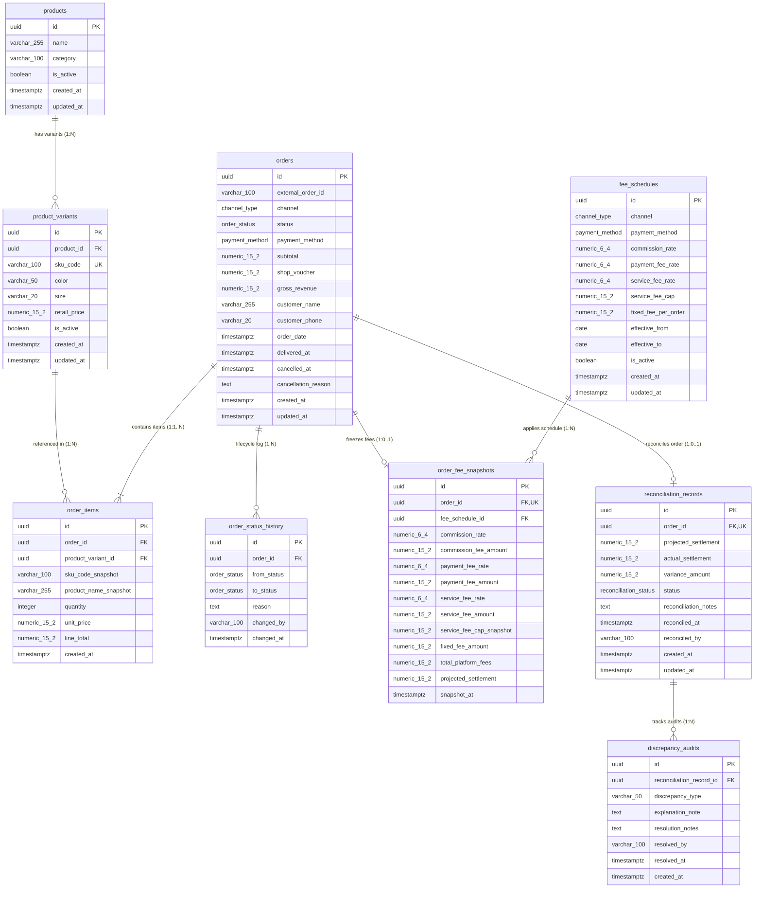

# Database Design Specification: Target MVP Relational Schema

---

## 1. Architectural Overview & Engineering Standards

### 1.1 Purpose & Scope
This document specifies the **Target MVP Database Architecture** for the Fashion Multi-Channel Revenue Management System. 

> [!IMPORTANT]
> **Independent Target Specification:** The schema defined in `schema.dbml` and detailed herein represents an independent, clean-room target relational design optimized for ACID transaction integrity, strict platform fee auditing, and multi-channel reconciliation. It strictly adheres to current MVP requirements without incorporating out-of-scope accounting abstractions.

### 1.2 Core Standards & Architectural Invariants
- **Target RDBMS:** **PostgreSQL 16+** with native transactional ACID guarantees.
- **Naming Conventions:** Strict `snake_case` across all tables, columns, indexes, and constraints.
- **Primary Key Standard:** Universal `uuid` (UUID v4 via `gen_random_uuid()`) for all business entity tables to prevent enumeration attacks and support distributed ingestion.
- **Monetary Precision:** All monetary amounts are typed as `numeric(15, 2)`. Floating-point types (`float`, `double`, `real`) are strictly prohibited to eliminate IEEE 754 rounding inaccuracies.
- **Timestamp Standard:** All temporal fields are stored as `timestamptz` in **UTC**. Conversion to local business timezone (`Asia/Ho_Chi_Minh`, UTC+7) is handled exclusively at presentation/query boundaries.
- **Fee Rate Conventions:** Percentage rates are stored as fractional decimals (`numeric(6, 4)`), where `0.0400` represents 4.00%, `0.0200` represents 2.00%, `0.0100` represents 1.00%, and `0.0000` represents 0.00%.
- **Core Scope:** Exactly **9 core transactional tables** organized into 4 cohesive functional domains.
- **No Cost of Goods Sold (COGS) / Net Profit:** In strict compliance with current MVP requirements, cost accounting, COGS tracking, and net profit calculations are excluded from this core schema. The financial analysis baseline focuses strictly on **Gross Revenue**, **Platform Fees**, and **Projected Settlement (Net Realized Revenue)**.

---

## 2. Target Entity-Relationship Diagram (ERD)

The following diagram reflects the canonical structure declared in [`schema.dbml`](file:///c:/AI_thuc_chien_khoa_3/VSF/Quanly_DoanhThu_LoiNhuan_DangDucHoa_VSF/docs/database/schema.dbml):



---

## 3. Database Enumerations

| Enum Name | Allowed Values | Description |
| :--- | :--- | :--- |
| `channel_type` | `TIKTOK`, `SHOPEE`, `POS` | Multi-channel sales origination source. |
| `payment_method` | `CASH`, `POS_CARD_QR`, `MARKETPLACE_WALLET` | Settlement instrument used by the customer. Differentiates 0% cash fee vs 1% card/QR fee at POS. |
| `order_status` | `PENDING`, `SHIPPED`, `DELIVERED`, `CANCELLED` | Core operational lifecycle status. Revenue is recognized strictly at `DELIVERED`. |
| `reconciliation_status`| `PENDING_SETTLEMENT`, `RECONCILED`, `DISCREPANCY` | Canonical accounting audit status between projected settlement and actual disbursement. |

> [!NOTE]
> **No RETURNED Status in Core MVP:** The operational status `RETURNED` / `REFUNDED` is excluded from the core state machine to prevent un-scoped return workflow complexity in MVP. It is deferred to Future Extensions.

---

## 4. Core Table Catalog

### 4.1 Group: Catalog & Pricing

#### Table: `products`
Root product entity representing the master fashion style/model.
- **Primary Key:** `id` (`uuid`, default: `gen_random_uuid()`).
- **Core Columns:** `name` (`varchar(255)`, not null), `category` (`varchar(100)`), `is_active` (`boolean`, default: `true`).
- **Audit Columns:** `created_at`, `updated_at` (`timestamptz`).

#### Table: `product_variants`
Specific sellable stock-keeping units (SKUs) defined by color and size combinations.
- **Primary Key:** `id` (`uuid`, default: `gen_random_uuid()`).
- **Foreign Key:** `product_id` -> `products(id)` ON DELETE RESTRICT.
- **Natural Key:** `sku_code` (`varchar(100)` unique, not null).
- **Pricing:** `retail_price` (`numeric(15, 2)`, check `>= 0`).
- **Attributes:** `color` (`varchar(50)`), `size` (`varchar(20)`), `is_active` (`boolean`, default: `true`).
- **Audit Columns:** `created_at`, `updated_at` (`timestamptz`).
- **Uniqueness & Indexes:** Unique index on `sku_code`; index on `product_id`.

---

### 4.2 Group: Orders & Lifecycle Management

#### Table: `orders`
Master sales order entity recording multi-channel commercial transactions.
- **Primary Key:** `id` (`uuid`, default: `gen_random_uuid()`).
- **Channel Identity:**
  - `channel` (`channel_type`, not null).
  - `external_order_id` (`varchar(100)`): External order identifier from marketplace or POS receipt.
  - `UNIQUE (channel, external_order_id)` ensures idempotent order ingestion.
- **Financial Baseline:**
  - `subtotal` (`numeric(15, 2)`, not null): Sum of item quantities × unit selling prices.
  - `shop_voucher` (`numeric(15, 2)`, default: `0.00`): Merchant-funded discount.
  - `gross_revenue` (`numeric(15, 2)`, not null): Customer payable amount (`subtotal - shop_voucher`).
- **Lifecycle & Temporal Columns:**
  - `status` (`order_status`, default: `PENDING`).
  - `order_date` (`timestamptz`, not null).
  - `delivered_at` (`timestamptz`, nullable): Populated strictly upon customer delivery.
  - `cancelled_at` (`timestamptz`, nullable): Populated if order transitions to `CANCELLED`.
  - `cancellation_reason` (`text`, nullable): Mandatory explanation note upon cancellation.
- **Customer Information:** `customer_name` (`varchar(255)`), `customer_phone` (`varchar(20)`).
- **Audit Columns:** `created_at`, `updated_at` (`timestamptz`).

#### Table: `order_items`
Detailed line items for each order, maintaining an immutable historical audit snapshot.
- **Primary Key:** `id` (`uuid`, default: `gen_random_uuid()`).
- **Foreign Keys:**
  - `order_id` -> `orders(id)` ON DELETE CASCADE.
  - `product_variant_id` -> `product_variants(id)` ON DELETE RESTRICT.
- **Immutable Purchase Snapshots:**
  - `sku_code_snapshot` (`varchar(100)`, not null): SKU text at purchase time.
  - `product_name_snapshot` (`varchar(255)`, not null): Product title at purchase time.
- **Line Calculations:**
  - `quantity` (`integer`, check `> 0`).
  - `unit_price` (`numeric(15, 2)`, check `>= 0`).
  - `line_total` (`numeric(15, 2)`, check `= quantity * unit_price`): Stored/derived line item total.
- **Audit Columns:** `created_at` (`timestamptz`).

> [!IMPORTANT]
> **Cardinality Invariant (Order 1 -> 1..* OrderItems):** A commercial order must contain at least one line item. Because standard relational foreign keys cannot enforce non-empty child sets, this invariant is validated in the application command handler prior to transaction commit.

#### Table: `order_status_history`
Append-only chronological state machine audit log.
- **Primary Key:** `id` (`uuid`, default: `gen_random_uuid()`).
- **Foreign Key:** `order_id` -> `orders(id)` ON DELETE CASCADE.
- **Columns:** `from_status` (`order_status`), `to_status` (`order_status`), `reason` (`text`), `changed_by` (`varchar(100)`), `changed_at` (`timestamptz`).
- **Purpose:** Full audit traceability. `orders.status` tracks current state; `order_status_history` records historical transitions.

---

### 4.3 Group: Fees & Financial Snapshots

#### Table: `fee_schedules`
Configurable fee policy matrix keyed by channel and payment method.
- **Primary Key:** `id` (`uuid`, default: `gen_random_uuid()`).
- **Lookup Dimensions:**
  - `channel` (`channel_type`, not null).
  - `payment_method` (`payment_method`, not null).
- **Fee Configuration:**
  - `commission_rate` (`numeric(6, 4)`, default: `0.0000`): Marketplace commission rate (e.g., `0.0400` = 4.00%).
  - `payment_fee_rate` (`numeric(6, 4)`, default: `0.0000`): Payment gateway rate (e.g., `0.0100` = 1.00%).
  - `service_fee_rate` (`numeric(6, 4)`, default: `0.0000`): Percentage service fee (e.g., `0.0200` = 2.00% on Shopee).
  - `service_fee_cap` (`numeric(15, 2)`, nullable): Maximum monetary cap for service fees.
  - `fixed_fee_per_order` (`numeric(15, 2)`, default: `0.00`): Fixed processing charge per order (e.g., 3,000 VND on TikTok Shop).
- **Temporal Validity:**
  - `effective_from` (`date`, not null).
  - `effective_to` (`date`, nullable; null denotes ongoing validity).
  - `is_active` (`boolean`, default: `true`).
- **Channel Policy Representation:**
  - **TikTok Shop:** `commission_rate` (commission), `payment_fee_rate` (payment), `fixed_fee_per_order` (fixed service), `service_fee_rate = 0`, `service_fee_cap = null`.
  - **Shopee:** `commission_rate` (commission), `payment_fee_rate` (payment), `service_fee_rate` (2%), `service_fee_cap` (capped maximum), `fixed_fee_per_order = 0`.
  - **POS:** Differentiates `CASH` (0% fees across all categories) vs `POS_CARD_QR` (`payment_fee_rate = 0.0100`, others 0).

#### Table: `order_fee_snapshots`
Frozen financial and fee snapshot created when an order transitions to `DELIVERED`.
- **Primary Key:** `id` (`uuid`, default: `gen_random_uuid()`).
- **Cardinality:** Exactly `1:0..1` with `orders`.
  - `order_id` (`uuid`, UNIQUE, FK -> `orders(id)` ON DELETE RESTRICT).
  - `fee_schedule_id` (`uuid`, FK -> `fee_schedules(id)` ON DELETE RESTRICT).
- **Applied Rates & Calculated Amounts:**
  - `commission_rate` (`numeric(6, 4)`), `commission_fee_amount` (`numeric(15, 2)`).
  - `payment_fee_rate` (`numeric(6, 4)`), `payment_fee_amount` (`numeric(15, 2)`).
  - `service_fee_rate` (`numeric(6, 4)`), `service_fee_amount` (`numeric(15, 2)`).
  - `service_fee_cap_snapshot` (`numeric(15, 2)`, nullable).
  - `fixed_fee_amount` (`numeric(15, 2)`).
- **Aggregated Deductions & Net Settlement:**
  - `total_platform_fees` (`numeric(15, 2)`): Sum of all platform deductions.
  - `projected_settlement` (`numeric(15, 2)`): Net amount expected to be disbursed (`gross_revenue - total_platform_fees`). Represents Net Realized Revenue.
- **Audit Timestamp:** `snapshot_at` (`timestamptz`).

---

### 4.4 Group: Settlement & Reconciliation

#### Table: `reconciliation_records`
Financial settlement record comparing expected net payouts against actual channel/bank cash disbursements.
- **Primary Key:** `id` (`uuid`, default: `gen_random_uuid()`).
- **Cardinality:** Exactly `1:0..1` with `orders`.
  - `order_id` (`uuid`, UNIQUE, FK -> `orders(id)` ON DELETE RESTRICT).
- **Settlement Amounts:**
  - `projected_settlement` (`numeric(15, 2)`): Copied from `order_fee_snapshots.projected_settlement`.
  - `actual_settlement` (`numeric(15, 2)`, nullable): Net cash disbursed into merchant wallet by platform/bank.
  - `variance_amount` (`numeric(15, 2)`, nullable): Mathematical discrepancy (`projected_settlement - actual_settlement`).
- **Status & Explanations:**
  - `status` (`reconciliation_status`, default: `PENDING_SETTLEMENT`).
  - `reconciliation_notes` (`text`, nullable): Explanation notes. **Mandatory whenever `variance_amount != 0`**.
- **Audit Columns:**
  - `reconciled_at` (`timestamptz`), `reconciled_by` (`varchar(100)`).
  - `created_at`, `updated_at` (`timestamptz`).

#### Table: `discrepancy_audits`
Detailed investigation log tracking root cause analysis and resolution notes for reconciliation variances.
- **Primary Key:** `id` (`uuid`, default: `gen_random_uuid()`).
- **Foreign Key:** `reconciliation_record_id` -> `reconciliation_records(id)` ON DELETE CASCADE.
- **Investigation Fields:**
  - `discrepancy_type` (`varchar(50)`, not null): Classification (e.g., `COMMISSION_RATE_MISMATCH`, `EXTRA_SHIPPING_CHARGE`, `RETURN_FEE_DISPUTE`, `OTHER`).
  - `explanation_note` (`text`, not null): Detailed documentation of the root cause.
  - `resolution_notes` (`text`, nullable): Settlement/dispute resolution outcome.
  - `resolved_by` (`varchar(100)`, nullable), `resolved_at` (`timestamptz`, nullable).
- **Audit Timestamp:** `created_at` (`timestamptz`).

---

## 5. Relationship Matrix & Cardinality Standards

| Parent Table | Child Table | Relationship | Foreign Key Column | Delete Rule | Rationale |
| :--- | :--- | :---: | :--- | :--- | :--- |
| `products` | `product_variants` | `1:N` | `product_id` | `RESTRICT` | Master product cannot be deleted if variants exist. |
| `product_variants` | `order_items` | `1:N` | `product_variant_id` | `RESTRICT` | SKUs with historical transactions cannot be deleted. |
| `orders` | `order_items` | `1:1..N` | `order_id` | `CASCADE` | Items are intrinsic components of their parent order. |
| `orders` | `order_status_history` | `1:N` | `order_id` | `CASCADE` | Status history belongs exclusively to the order lifecycle. |
| `orders` | `order_fee_snapshots` | `1:0..1` | `order_id` (UK) | `RESTRICT` | Financial snapshot preserves immutable audit integrity. |
| `fee_schedules` | `order_fee_snapshots` | `1:N` | `fee_schedule_id` | `RESTRICT` | Fee schedule referenced by historical orders cannot be deleted. |
| `orders` | `reconciliation_records`| `1:0..1` | `order_id` (UK) | `RESTRICT` | Reconciliation ledger records must be preserved. |
| `reconciliation_records`| `discrepancy_audits` | `1:N` | `reconciliation_record_id` | `CASCADE` | Audit investigations cascade with parent reconciliation record. |

---

## 6. Financial Integrity Rules & Business Invariants

### 6.1 Canonical Gross Revenue
Gross Revenue is standardized across all sales channels as:
```text
gross_revenue = subtotal - shop_voucher
```
- `subtotal`: Sum of quantity × unit selling price before merchant voucher.
- `shop_voucher`: Merchant-funded discount.
- `gross_revenue`: Net customer payable amount. It serves as the baseline for payment fees.

### 6.2 Anti-Phantom Revenue Invariant
Revenue is recognized strictly upon successful delivery:
```sql
Recognized Gross Revenue = SUM(gross_revenue) 
WHERE status = 'DELIVERED' AND delivered_at IS NOT NULL;
```
- No separate mutable `recognized_revenue` column exists.
- Orders in `PENDING`, `SHIPPED`, or `CANCELLED` contribute 0 to recognized revenue.

### 6.3 Fee Calculation Formulas
When an order transitions to `DELIVERED`, fee calculation proceeds as follows:
1. **Commission Fee:**
   ```text
   commission_fee_amount = subtotal * commission_rate
   ```
2. **Payment Fee:**
   ```text
   payment_fee_amount = gross_revenue * payment_fee_rate
   ```
3. **Service Fee:**
   - For percentage-based service fee (e.g., Shopee):
     ```text
     raw_service_fee = subtotal * service_fee_rate
     service_fee_amount = min(raw_service_fee, service_fee_cap) -- if capped
     service_fee_amount = raw_service_fee                       -- if uncapped
     ```
   - For fixed service fee (e.g., TikTok Shop):
     ```text
     fixed_fee_amount = fixed_fee_per_order
     ```
4. **Total Platform Fees:**
   ```text
   total_platform_fees = commission_fee_amount + payment_fee_amount + service_fee_amount + fixed_fee_amount
   ```
5. **Projected Settlement (Net Realized Revenue):**
   ```text
   projected_settlement = gross_revenue - total_platform_fees
   ```

> [!CAUTION]
> **No Double Deduction of Voucher:**
> Because `gross_revenue` already deducts `shop_voucher`, subtracting `total_platform_fees` from `gross_revenue` correctly yields the net payout without double-deducting the merchant voucher.

### 6.4 Canonical Reconciliation Variance
Discrepancy detection between expected settlement and bank/wallet disbursement uses:
```text
variance_amount = projected_settlement - actual_settlement
```
- `variance_amount > 0`: **Shortfall / Underpayment** (platform disbursed less than expected; merchant loss). Flagged as `DISCREPANCY`.
- `variance_amount = 0`: **Clean Match** (`RECONCILED`).
- `variance_amount < 0`: **Overpayment / Reimbursement** (platform disbursed more than expected).

### 6.5 Clarification: Net Realized Revenue vs Net Profit
- **`Net Realized Revenue = Projected Settlement`**: The net commercial cash realized after deducting platform commissions, payment processing charges, and service fees from gross revenue.
- **`Net Realized Revenue != Net Profit`**: Net Profit requires deducting Cost of Goods Sold (COGS) and operational overhead. Because COGS is explicitly excluded from MVP scope, **Net Profit is not computed or stored in P05**.

---

## 7. Persisted vs Derived Fields Summary

| Field | Source / Formula | Storage Strategy | Architectural Rationale |
| :--- | :--- | :---: | :--- |
| `orders.subtotal` | Sum of `order_items` line amounts | **Persisted** | Captures agreed merchandise subtotal upon order placement. |
| `orders.gross_revenue` | `subtotal - shop_voucher` | **Persisted** | Fundamental financial baseline for customer payment. |
| `order_items.line_total` | `quantity * unit_price` | **Persisted / Derived** | Stored to ensure line-item integrity. |
| `order_fee_snapshots.*_amount` | Applied rate × monetary base | **Persisted** | Immutable snapshot; protects against historical fee rule modifications. |
| `order_fee_snapshots.total_platform_fees` | Sum of platform fee components | **Persisted** | Aggregate fee deduction per order. |
| `order_fee_snapshots.projected_settlement` | `gross_revenue - total_platform_fees` | **Persisted** | Freezes expected payout for manual reconciliation. |
| `reconciliation_records.actual_settlement` | Manual entry from bank/wallet statement | **Persisted** | Actual cash disbursed. |
| `reconciliation_records.variance_amount` | `projected_settlement - actual_settlement`| **Persisted / Derived** | Financial discrepancy; triggers mandatory explanation notes when non-zero. |

---

## 8. Data Retention, Soft Deletes & Auditing Policies

1. **Financial Transaction Immutability:**
   - Delivered orders and finalized `order_fee_snapshots` are read-only.
   - Physical hard deletion of delivered commercial records is strictly prohibited.
2. **Master Catalog Soft Deletes:**
   - `products` and `product_variants` use active flags (`is_active = false`) for operational deactivation, preserving foreign key integrity for historical orders.
3. **Restrict vs Cascade Deletions:**
   - Deletion of master records with historical references is blocked (`ON DELETE RESTRICT`).
   - Cascade deletion is restricted to strictly owned child components (`order_items`, `order_status_history`, `discrepancy_audits`).

---

## 9. Analytics & Reporting Strategy (No Duplicate Report Tables)

To avoid redundant data synchronization and stale aggregation tables, all analytical views query the transactional tables dynamically:
- **No Static Report Tables:** Tables such as `dashboard_kpi`, `daily_revenue`, or `channel_summary` are intentionally omitted. PostgreSQL 16+ indexes support sub-50ms analytical queries for MVP volume ($< 500{,}000$ orders).
- **Approved Analytics Terminology:**
  - *Gross Revenue by Channel*
  - *Fee Burden by Channel*
  - *Settlement Variance Analysis*
  - *Top SKU by Gross Revenue*
  - *Net Realized Revenue Trend*
- **Example Dynamic Query (Executive Summary):**
  ```sql
  SELECT
      COALESCE(SUM(o.gross_revenue), 0) AS total_gross_revenue,
      COALESCE(SUM(s.total_platform_fees), 0) AS total_platform_fees,
      COALESCE(SUM(s.projected_settlement), 0) AS total_net_realized_revenue,
      COUNT(o.id) AS delivered_orders_count
  FROM orders o
  JOIN order_fee_snapshots s ON s.order_id = o.id
  WHERE o.status = 'DELIVERED'
    AND o.delivered_at IS NOT NULL;
  ```

---

## 10. Traceability Matrix

The schema directly traces to approved business user stories:

| Requirement ID | Requirement Summary | Relational Schema Implementation | Invariants & Constraints |
| :--- | :--- | :--- | :--- |
| **US-ORD-01** | Create Multi-Item Commercial Orders | `products`, `product_variants`, `orders`, `order_items` | `subtotal`, `shop_voucher`, `gross_revenue`; item snapshots. Minimum 1 item rule enforced in application layer. |
| **US-ORD-02** | Transition Order Lifecycle States | `orders`, `order_status_history` | `status` (`PENDING`, `SHIPPED`, `DELIVERED`, `CANCELLED`); append-only audit trail. |
| **US-ORD-03** | Order Cancellation with Reason | `orders`, `order_status_history` | `cancelled_at`, mandatory `cancellation_reason`. Blocked if order is already `DELIVERED`. |
| **US-FEE-01** | Channel & Payment Fee Schedules | `fee_schedules`, `order_fee_snapshots` | Keyed by `(channel, payment_method)`. Distinguishes POS Cash (0%) vs POS Card/QR (1%). |
| **US-SET-01** | Projected Settlement Freezing | `order_fee_snapshots` | Snapshot created upon delivery; frozen `total_platform_fees` and `projected_settlement`. |
| **US-SET-02** | Manual Payout Reconciliation & Variance | `reconciliation_records`, `discrepancy_audits` | `variance_amount = projected_settlement - actual_settlement`. Mandatory explanation when variance != 0. |
| **US-DASH-01** | Executive Revenue KPIs | `orders`, `order_fee_snapshots` | Dynamic aggregation of `gross_revenue`, `total_platform_fees`, `projected_settlement`. |
| **US-DASH-02** | 7-Day Realized Revenue Trend | `orders`, `order_fee_snapshots`, `reconciliation_records` | Aggregation grouped by `DATE(delivered_at)`. |
| **US-DASH-03** | Top 5 SKUs by Gross Revenue | `order_items`, `product_variants`, `products` | Dynamic aggregation of item line totals for delivered orders. |
| **US-DASH-04** | Order Detail Export Capability | `orders`, `order_items`, `order_fee_snapshots` | Transactional data joins filtered by date range. |

---

## 11. Cross-Plan Action Items & Future Extensions

### 11.1 Cross-Plan Synchronizations
1. **Catalog Subsystem Alignment (P03/P04):**
   - Because P05 formalizes `products` and `product_variants`, P03 Backend Component Architecture will incorporate `ProductRepository` and `CatalogService`.
   - P04 Frontend Component Architecture will incorporate `ProductSelector` and `useCatalog`.
2. **Manual Settlement Alignment (P04):**
   - Reconciliations in MVP are performed manually by Finance entering actual disbursed amounts.
   - P04 screens and services will reflect direct manual entry rather than automated file parser imports.

### 11.2 Future Scope (Post-MVP)
The following capabilities are excluded from the MVP core schema:
- **`statement_imports`:** Batch CSV/Excel file parser tables for bulk automated settlement reconciliation.
- **Refund & Return Workflows:** Dedicated `RETURNED` / `REFUNDED` statuses, reverse fee adjustments, and return shipping deductions.
- **Cost of Goods Sold (COGS) & Net Profit:** Inventory valuation tables, weighted-average cost tracking, and operating profit accounting.
- **`users` & RBAC:** Persistent identity and role management.

### 11.3 Deferred to P06 (Database Implementation)
- Detailed partial indexes, B-tree configuration, and storage tuning.
- Trigger implementations (`moddatetime` automated timestamp updates).
- Materialized views and concurrent refresh strategies for high-volume read scale.

---

## 12. Financial Glossary

- **Gross Revenue:** The total customer payable amount for an order (`subtotal - shop_voucher`).
- **Platform Commission:** The percentage fee charged by the marketplace based on the order merchandise subtotal.
- **Payment Fee:** The payment processing charge assessed against the gross revenue collected.
- **Service Fee:** Additional platform fees, either percentage-based (with optional monetary cap) or flat per order.
- **Projected Settlement:** The net amount expected to be disbursed into the merchant wallet (`gross_revenue - total_platform_fees`). Represents Net Realized Revenue.
- **Actual Settlement:** The net cash amount disbursed by the platform or bank statement.
- **Settlement Variance:** The mathematical discrepancy between expected and actual payouts (`projected_settlement - actual_settlement`).
- **Net Realized Revenue:** Equivalent to Projected Settlement; represents commercial net revenue realized after platform fee deductions.
