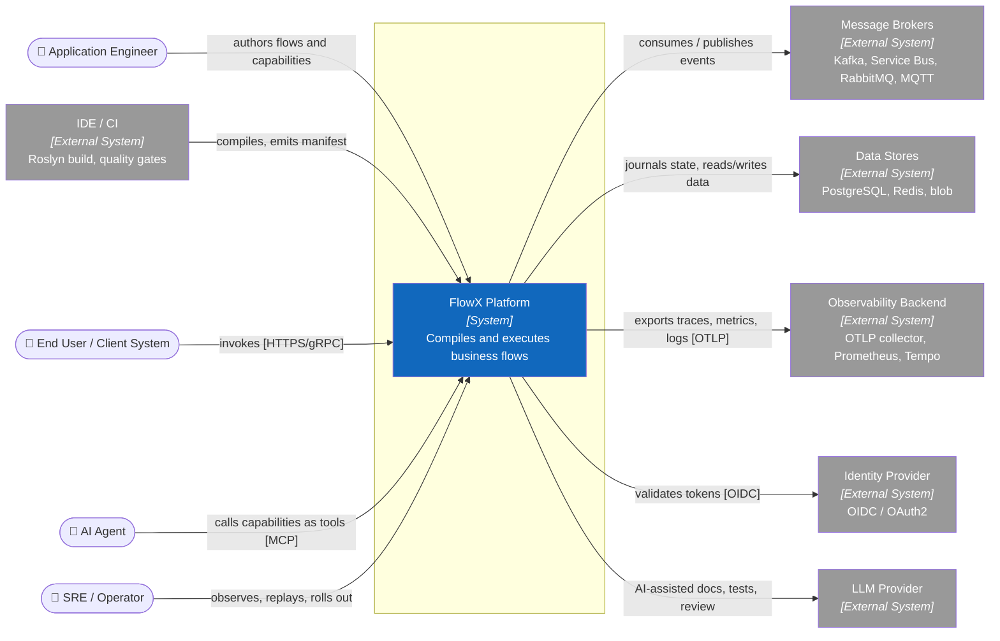
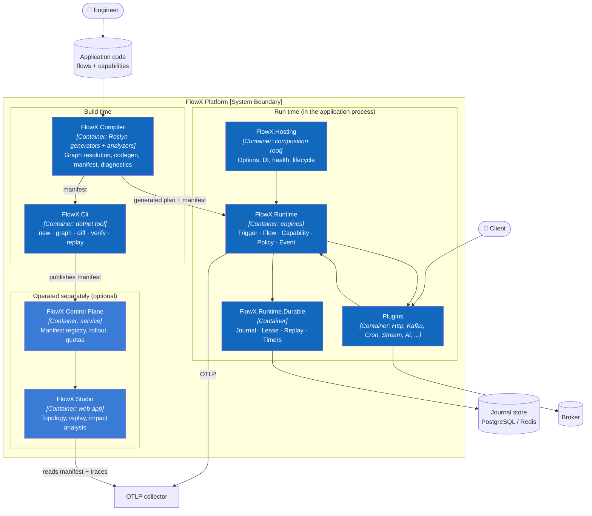
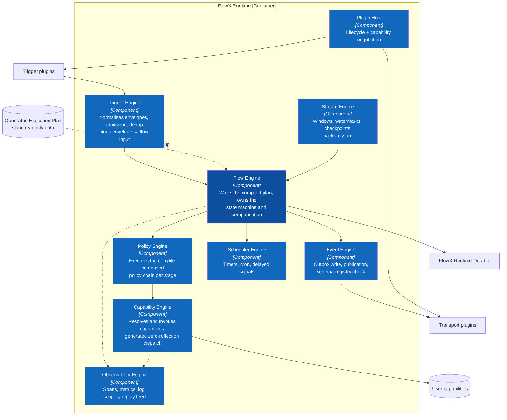
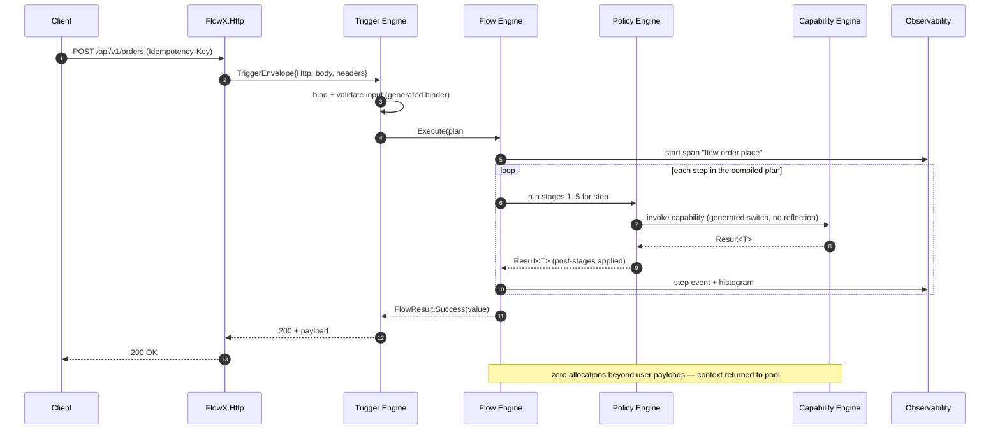
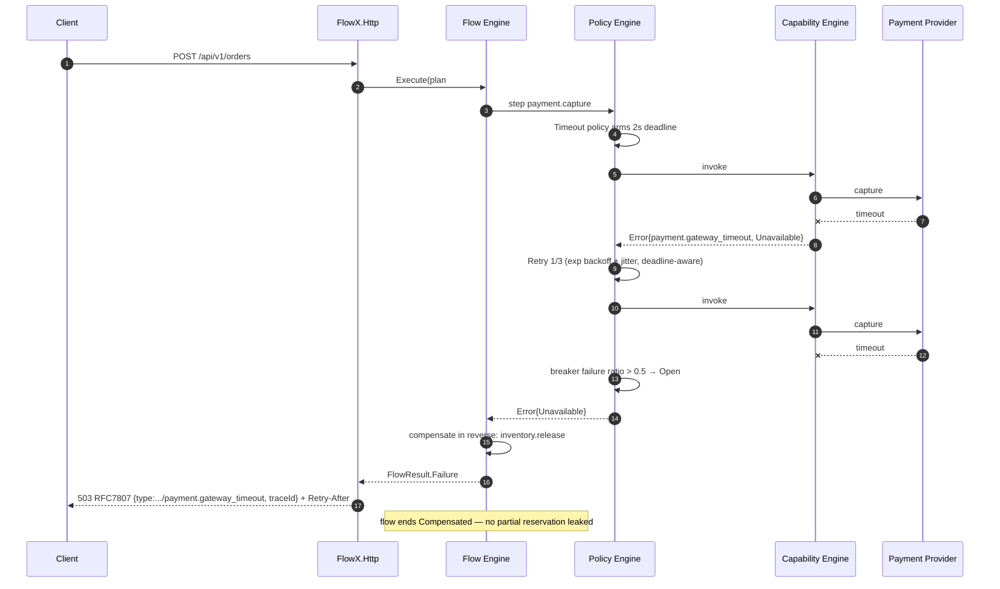
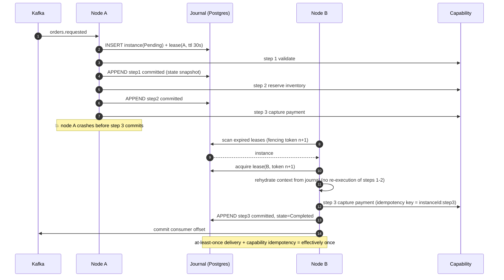
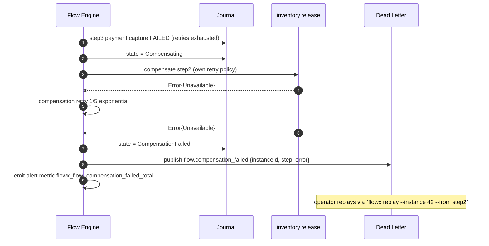
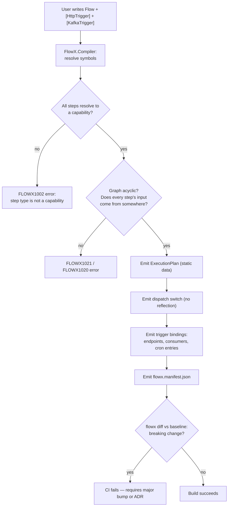
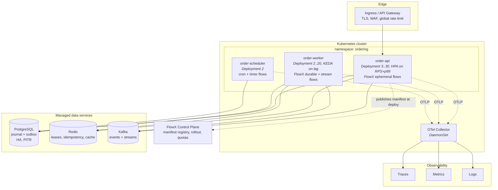

# 05 — Architecture (arc42 + C4)

> **Status:** Accepted · **Audience:** architects, contributors, reviewers
> **This is the primary design document.** Every other document in `docs/`
> elaborates one building block described here.

---

## 1. Introduction and Goals

FlowX is a .NET application platform that executes business flows. It provides a
single programming model for request/response APIs, event-driven integration,
stream processing, scheduled work and AI-agent actions, and it resolves the
orchestration graph at compile time.

### 1.1 Stakeholders

| Role | Concern |
|---|---|
| Application engineer | express a use case in minutes, test it without infrastructure |
| Principal architect | prevent drift between design and implementation |
| SRE | uniform operability across every service in the estate |
| Security engineer | provable authorisation at the business-operation boundary |
| Platform team | extend transports and stores without forking |
| AI/agent engineer | typed, policy-guarded action surface |

### 1.2 Quality goals (measurable — arc42 §1.2)

| # | Quality goal | Scenario | Measure | Priority |
|---|---|---|---|---|
| Q1 | **Predictable low latency** | 4-step ephemeral flow, warm process, single node | p99 platform overhead ≤ **5 µs**, ≤ **1 alloc/step** | 1 |
| Q2 | **Durable correctness** | node killed mid-flow at any step boundary | flow resumes on another node, **zero duplicate side effects** for idempotent capabilities, p99 checkpoint ≤ **15 ms** @ 5 000 flows/s/node | 1 |
| Q3 | **Static knowability** | any build | **100 %** of flows/capabilities/policies/events present in manifest; breaking contract change fails CI | 1 |
| Q4 | **Transport portability** | move a chain from HTTP to a broker, an outbox feed or a schedule | **1** adapter step; **0** lines of the chain below it changed | 2 |
| Q5 | **Operational uniformity** | any FlowX service | golden signals + trace + replay available with **no user instrumentation** | 2 |
| Q6 | **Extensibility** | add a new transport | implemented against public contracts, **0** changes to `FlowX.Runtime` | 2 |
| Q7 | **Startup & footprint** | container cold start, NativeAOT | ≤ **200 ms** to ready, ≤ **60 MB** RSS idle | 3 |
| Q8 | **Multi-tenant isolation** | one tenant saturates its quota | other tenants' p99 degrades ≤ **10 %** | 3 |

Q1–Q3 are the *architecture-defining* goals. Where a design choice trades one of
them away, an ADR must record it.

---

## 2. Constraints

| # | Constraint | Type | Implication |
|---|---|---|---|
| C1 | .NET 10+, C# 14 | Technical | Roslyn incremental generators; `ref struct` interfaces available |
| C2 | Must run under NativeAOT | Technical | No reflection, no dynamic codegen, no `System.Text.Json` reflection mode |
| C3 | Must host inside ASP.NET Core | Technical | Cannot own the process lifecycle or the DI container |
| C4 | No 2-phase commit | Technical | Consistency is saga-based; outbox for atomic publish. **The constraint now describes the system.** `.Emit<T>()` on a `Durable` flow stages its event in the same transaction as the step row, a refused commit discards it, and `PostgresOutboxPublisher` delivers it at-least-once in per-`partition_key` order. The far end is no longer missing: `plugins/FlowX.Redis` implements `IEventPublisher` over Redis Streams (WP-56b), one stream per `partition_key`, and `PublisherConformance` holds it and the recording double to one contract. [FLOWX1024](diagnostics/FLOWX1024.md) survives, narrowed to an `Ephemeral` flow and to a contract no serialiser context declares |
| C5 | OpenTelemetry is the only telemetry API | Technical | No proprietary metrics interface |
| C6 | Apache-2.0, no copyleft dependencies | Legal | Vets every transitive dependency ([ADR-0012](adr/ADR-0012-apache-2-license.md)) |
| C7 | Public contracts follow SemVer with a 2-minor deprecation window | Organisational | Breaking changes are batched into majors |
| C8 | Documentation-first: no feature merges without its doc section and ADR | Organisational | This repository is the spec |

---

## 3. Context and Scope

### 3.1 Business context (C4 Level 1)



### 3.2 External interfaces

| Interface | Direction | Protocol | Contract owner | Failure mode |
|---|---|---|---|---|
| HTTP ingress | in | HTTP/1.1, HTTP/2, HTTP/3 | FlowX.Http plugin | RFC 7807 + `Retry-After` |
| gRPC ingress | in | HTTP/2 | FlowX.Grpc plugin | status codes per §4 mapping |
| Bus ingress/egress | both | Kafka, AMQP, MQTT | transport plugin | dead-letter + poison queue |
| Journal | both | ADO.NET / Redis / custom | `FlowX.Abstractions/Durability/`; store plugins implement it (`FlowX.Postgres` is the first) | lease loss → instance re-leased |
| Telemetry | out | OTLP gRPC | OpenTelemetry SDK | drop, never block the flow |
| Identity | in | OIDC discovery + JWKS | ASP.NET Core auth | fail closed |
| Agent surface | in | MCP over stdio/HTTP | FlowX.Ai plugin | policy denial → structured refusal |

---

## 4. Solution Strategy

| Quality goal | Strategy | Where |
|---|---|---|
| Q1 latency | Compile the flow graph into a static execution plan; pooled context; struct step frames; listener-gated telemetry | [ADR-0002](adr/ADR-0002-compile-time-orchestration.md), [06](06-Execution-Engine.md) |
| Q2 durability | Per-flow execution profile; append-only journal with step-boundary checkpoints; lease-based ownership; deterministic replay | [ADR-0003](adr/ADR-0003-execution-profiles.md), [ADR-0006](adr/ADR-0006-journal-and-leases.md), [11](11-Distributed-Runtime.md) |
| Q3 knowability | Source generator emits `flowx.manifest.json`; `flowx diff` gates CI; architecture fitness tests | [ADR-0005](adr/ADR-0005-manifest-as-build-artifact.md), [13](13-AI-Native.md) |
| Q4 portability | Trigger attributes are metadata only; flows are transport-free by analyzer rule; the claim is stated over the capability chain, one adapter step in | [ADR-0004](adr/ADR-0004-universal-trigger-model.md), [ADR-0062](adr/ADR-0062-transport-portability-is-a-property-of-the-capability-chain.md), [09](09-Trigger-Model.md) |
| Q5 uniformity | Runtime owns spans/metrics because it owns the graph; replay from journal | [12](12-Observability.md) |
| Q6 extensibility | Everything above `FlowX.Core` is a plugin against published contracts | [ADR-0009](adr/ADR-0009-plugin-contracts.md), [17](17-Plugin-System.md) |
| Q7 startup | Zero reflection; generated registration; AOT smoke test in CI | [ADR-0002](adr/ADR-0002-compile-time-orchestration.md) |
| Q8 isolation | Tenant is ambient in context; admission-stage quotas; partitioned durable state | [16](16-Multi-Tenant.md) |

**The one-sentence strategy:** *move orchestration from run time to build time, and
make the build's output — the manifest — the thing everything else is derived from.*

### 4.1 The strategy in one picture

![FlowX platform map. Ten numbered areas: core philosophy (flow first, capability
first, trigger agnostic, compile-time intelligence, policy everywhere, AI native,
observable everything, cloud native); the unified trigger layer spanning HTTP,
events, streaming, schedule, polling, webhook, file storage, IoT, AI agent, CLI
and SignalR; the runtime platform's eight engines; the six core abstractions of
the programming model — flow, capability, context, policy, event, compensation;
infrastructure connectors; platform capabilities including observability,
security, multi-tenancy, AI, marketplace, versioning, governance and monitoring;
the deployment and runtime environment; the AI and intelligence layer; an
end-to-end order flow example; and the ten quality attributes.](assets/flowx-platform-map.png)

This is the same strategy the table above states, drawn. Read it top-down: anything
can trigger a flow, one runtime executes it, six abstractions are all a developer
learns, and everything touching infrastructure is a plugin. The precise structure
follows in §5 — this picture is orientation, the diagrams below are the specification.

---

## 5. Building Block View


### 5.1 C4 Level 2 — containers



**Container responsibilities and reference direction**

```
FlowX.Abstractions  ←  FlowX.Core  ←  FlowX.Runtime  ←  FlowX.Runtime.Durable
        ↑                   ↑              ↑                     ↑
        └───────── FlowX.Compiler ─────────┘              FlowX.Hosting
        ↑                                                        ↑
     plugins ────────────────────────────────────────────────────┘
```

- `FlowX.Abstractions` — contracts only. **Zero package dependencies.** This is
  what user code references, and what plugin authors implement.
- `FlowX.Core` — graph model, `Result<T>`, `FlowContext`, policy model. No I/O.
- `FlowX.Runtime` — the engines. No transport knowledge.
- `FlowX.Runtime.Durable` — replay and timers. Optional package, and unbuilt. *This
  read "journal, leases, replay, timers", and the first two went elsewhere: the
  contracts are in `FlowX.Abstractions/Durability/` (WP-51), the store that implements
  them is `plugins/FlowX.Postgres` (WP-53), and the lease a node executes under is
  `DurableLease` in `FlowX.Runtime` (WP-55). [§5.3](#53-target-code-structure) has the
  reasoning.*
- `FlowX.Compiler` — analyzers + incremental source generators. Ships as an
  analyzer package; never a runtime dependency.
- `FlowX.Hosting` — the single composition root.
- Plugins — reference `Abstractions` only, never `Runtime` internals.

### 5.2 C4 Level 3 — inside FlowX.Runtime



Engine contracts are detailed in [06-Execution-Engine](06-Execution-Engine.md).
Each engine is independently testable and has exactly one reason to change.

### 5.3 Target code structure

```
src/
├── FlowX.Abstractions/           # ICapability, IFlow, attributes, Result<T>, contracts
│   ├── Durability/               # IFlowJournal, ILeaseStore, FencingToken, record shapes
│   └── (zero package references)
├── FlowX.Core/                   # StepGraph, FlowContext, PolicyModel, Error taxonomy
├── FlowX.Compiler/
│   ├── Analyzers/                # FLOWX1001..1099 diagnostics
│   ├── Generators/               # FlowPlanGenerator, DispatchGenerator, ManifestGenerator
│   └── Model/                    # compile-time graph, symbol resolution
├── FlowX.Runtime/
│   ├── Trigger/  Flow/  Policy/  Capability/  Event/  Scheduler/  Stream/  Observability/
├── FlowX.Runtime.Durable/        # planned — does not exist; see the note below
│   └── Replay/                   # deterministic re-execution — WP-61
├── FlowX.Hosting/                # AddFlowX(), options, health checks, graceful drain
├── FlowX.Cli/                    # new · graph · diff · verify · replay · bench
└── plugins/
    ├── FlowX.Http/  FlowX.Postgres/  FlowX.Grpc/  FlowX.Kafka/  FlowX.RabbitMq/
    ├── FlowX.AzureServiceBus/  FlowX.Cron/  FlowX.Stream/  FlowX.SignalR/  FlowX.GraphQL/  FlowX.Ai/
tests/
├── FlowX.Architecture.Tests/     # fitness functions — written FIRST (see §12)
├── FlowX.Compiler.Tests/         # generator snapshot + diagnostic tests
├── FlowX.Runtime.Tests/          # engine unit + integration (Testcontainers)
├── FlowX.Conformance.Tests/      # the suite every plugin must pass
└── FlowX.Benchmarks/             # CI-gated budgets from docs/14-Performance.md
```

> [!IMPORTANT]
> **This tree put `IFlowJournal` and `ILeaseStore` in `FlowX.Runtime.Durable`, and that
> was wrong — not merely out of date.** It contradicted
> [ADR-0009](adr/ADR-0009-plugin-contracts.md): a plugin may reference
> `FlowX.Abstractions` and nothing else, so a store author who can only see
> `FlowX.Abstractions` could not have implemented a contract declared one layer up.
> Either the contracts move down or the plugin rule is a fiction. The contracts shipped
> in `FlowX.Abstractions/Durability/` (WP-51) and the tree above now says so.
>
> **The first adapter did not land in `FlowX.Runtime.Durable` either.** This box said
> that project "keeps what it was always for — the adapters". WP-53 shipped the
> PostgreSQL journal and lease store as `plugins/FlowX.Postgres`, referencing
> `FlowX.Abstractions` and nothing else — which is the same argument one paragraph up,
> applied one layer further: a store that needs nothing from `Core`, `Runtime` or
> `Hosting` is a plugin, and putting it under `src/` would claim a coupling that is not
> there. Lease *renewal* and fencing-token issue did not land there either — they are
> `DurableLease` and `LeasePolicy` in `FlowX.Runtime` (WP-55), because they are how the
> engine holds a lease rather than how a store issues one. So `FlowX.Runtime.Durable`
> **does not exist** and the only thing left in it is deterministic re-execution, which is
> WP-61; the layering rule still carries a row for it as a forward declaration, described
> in [§12](#12-architecture-fitness-functions).
>
> `tests/FlowX.Conformance.Tests` exists and is a **test project, not a package**. *This
> box said it was "deliberately not packable until a second store exists to be held to
> it"; that store exists (WP-53) and the project is still not packable.* The condition the
> csproj actually states is the second **and third** — WP-53 and WP-54 — so a shape that
> one adapter has pushed back on is not yet a shape two have agreed on. Redis is WP-54.

Where do I add a use case? `src/<App>.Application/<FlowName>/` — one folder
containing the flow, its capabilities, its contracts and its tests. Nothing else.

---

## 6. Runtime View

### 6.1 Ephemeral flow over HTTP — happy path



### 6.2 Ephemeral flow over HTTP — failure twin



### 6.3 Durable flow, node failure mid-execution



### 6.4 Durable flow — compensation and dead-lettering



Compensation failure is the one case FlowX cannot resolve automatically. The
design makes it **loud** — dedicated metric, dead letter, and a CLI recovery
path — rather than silently retrying forever.

### 6.5 Trigger-to-flow binding (build time)



---

## 7. Deployment View



**Deployment rules**

| Rule | Reason |
|---|---|
| API and worker are separate deployments of the *same* image | Different scaling signals; identical code and manifest |
| ~~Scheduler runs leader-elected, replica ≥ 2~~ **A scheduled flow needs no separate deployment and no leader.** Every replica sweeps; a firing is named by its occurrence, so the lease store and the journal's primary key make it exclusive ([ADR-0031](adr/ADR-0031-an-occurrence-names-the-instance-it-starts.md)) | *The rule as written was a design, and its second clause did not follow from its first: a leader that has lost its lease and not noticed fires anyway, and a leader that dies at 01:59 takes the 02:00 firing with it until a successor is elected. The `order-scheduler` box above remains a legitimate deployment shape — a schedule that fires heavy work is worth isolating — but it is a **capacity** decision now, not a correctness one, and `replica ≥ 2` buys availability rather than exclusivity* |
| `terminationGracePeriodSeconds` ≥ max flow step budget + 10 s | Graceful drain: stop accepting, finish in-flight, release leases |
| Journal DB is regional, not global | Cross-region durable flows need explicit design ([11](11-Distributed-Runtime.md)) |
| Manifest is published at deploy, not at build | The registry records what is *running*, not what was compiled |

Rollout strategy, KEDA scalers and drain semantics in
[18-Cloud-Native](18-Cloud-Native.md).

---

## 8. Crosscutting Concepts

| Concept | Rule | Detail |
|---|---|---|
| **Error handling** | Expected outcomes are `Result<T>`; exceptions mean defects or infrastructure faults. The runtime never converts an exception into a business error silently — it records `Internal` and logs the exception with its trace ID | [04 §8](04-Core-Concepts.md#8-result-and-error) |
| **Validation** | Input validation is stage 3 (Integrity), generated from contract annotations; business rules are the first flow step | [10](10-Policy-Framework.md) |
| **Logging** | Structured only. Data as fields, never interpolated. `flow.id`, `flow.instance_id`, `step.id`, `capability.id`, `tenant.id`, `trace_id` on every record | [12](12-Observability.md) |
| **Persistence** | FlowX owns only journal + outbox + idempotency store. Business persistence is inside capabilities and is none of FlowX's business | [11](11-Distributed-Runtime.md) |
| **Serialisation** | `System.Text.Json` source-generated contexts only (C2 AOT). Journal payloads carry a schema version | [ADR-0008](adr/ADR-0008-serialization-and-schema.md) |
| **Time** | Capabilities must obtain time from `ctx.UtcNow`, never `DateTime.UtcNow` — replay determinism. **Enforced since WP-58** by [`FLOWX1007`](diagnostics/FLOWX1007.md): Warning, and Error where the compilation shows the code on a durable flow's replay path. *This row read "**Unenforced:** `FLOWX1007` does not exist".* The property name is `UtcNow`, not `Clock` | [06 §5](06-Execution-Engine.md#5-the-determinism-boundary) |
| **Randomness / IDs** | `ctx.NewId()` and `ctx.Random` are journaled on first use so replay reproduces them. **The journalling exists since WP-52 and is persisted since WP-53; the rule exists since WP-58.** A `Durable` flow captures the ids minted and `Random`'s seed per step boundary, and [`FLOWX1008`](diagnostics/FLOWX1008.md) reports the ambient alternatives. *This row said `FLOWX1008` did not exist and that no store persisted a capture; both have expired.* What still holds: nothing replays a capture back into execution (WP-61), so the reproduction is specified and unproven | [06 §5](06-Execution-Engine.md#5-the-determinism-boundary) |
| **Configuration** | Selects adapters and tunes policy *parameters*. It can never change the graph | Manifesto §"What we refuse" |
| **Security** | Deny-by-default at the capability boundary; STRIDE per trust boundary | [15](15-Security.md) |
| **Tenancy** | `TenantId` is ambient in `FlowContext`, enforced at admission and at the journal partition key | [16](16-Multi-Tenant.md) |
| **Versioning** | Flows and capabilities carry SemVer; running instances pin the version they started with | [07](07-Capability-Model.md) |

---

## 9. Architecture Decisions (ADR index)

| ADR | Decision | Status |
|---|---|---|
| [0001](adr/ADR-0001-flow-and-capability-as-primitives.md) | Flow + Capability as the only two user primitives | Accepted |
| [0002](adr/ADR-0002-compile-time-orchestration.md) | Compile-time orchestration via Roslyn generators, no runtime reflection | Accepted |
| [0003](adr/ADR-0003-execution-profiles.md) | Per-flow execution profiles instead of always-durable | Accepted |
| [0004](adr/ADR-0004-universal-trigger-model.md) | One trigger abstraction for all transports | Accepted |
| [0005](adr/ADR-0005-manifest-as-build-artifact.md) | Manifest is a first-class build artifact | Accepted |
| [0006](adr/ADR-0006-journal-and-leases.md) | Journal + fenced leases for durable execution | Accepted |
| [0007](adr/ADR-0007-result-over-exceptions.md) | `Result<T>` for business outcomes, exceptions for defects | Accepted |
| [0008](adr/ADR-0008-serialization-and-schema.md) | Source-generated STJ + versioned schemas | Accepted |
| [0009](adr/ADR-0009-plugin-contracts.md) | Plugins depend only on `FlowX.Abstractions`, with a conformance suite | Accepted |
| [0010](adr/ADR-0010-csharp-dsl-over-yaml.md) | C# fluent DSL as the source of truth; YAML is export only | Accepted |
| [0011](adr/ADR-0011-fixed-policy-stage-order.md) | Fixed policy stage order, not user-composed pipelines | Accepted |
| [0012](adr/ADR-0012-apache-2-license.md) | Apache-2.0 licence | Accepted |
| [0013](adr/ADR-0013-dsl-vocabulary-over-ca1716.md) | DSL vocabulary takes precedence over CA1716 | Accepted |
| [0014](adr/ADR-0014-derived-error-catalogue-vs-build-budget.md) | Keep the derived error catalogue; re-express the build-overhead budget | **Proposed** |

*This index stopped at 0012 while two more ADRs were written. The authoritative
list, with each record's "Revisit when", is [adr/README.md](adr/README.md); this
table is a convenience copy and drifted because nothing checks that the two
agree.*

---

## 10. Quality Requirements (stimulus → response → measure)

| # | Source | Stimulus | Environment | Response | Measure |
|---|---|---|---|---|---|
| QR1 | Client | 10 000 req/s to a 4-step ephemeral flow | 4-core pod, warm | Flow executes | platform overhead p99 ≤ 5 µs; 0 alloc/step |
| QR2 | Chaos | `SIGKILL` a worker mid-flow | 3 nodes, durable profile | Flow resumes elsewhere | resume p99 ≤ 45 s (lease TTL 30 s); 0 duplicate non-idempotent effects |
| QR3 | Engineer | Adds a step with an incompatible contract | build | Build fails | `FLOWX1020` with symbol + fix, < 1 s added build time |
| QR4 | Engineer | Changes a capability's output shape | CI | `flowx diff` fails | breaking change detected 100 % for removed/retyped members |
| QR5 | Operator | Needs to know why instance 42 failed | production | Full causal replay available | every step's input/output/error retrievable for the retention window |
| QR6 | Tenant B | Tenant A floods its quota | shared cluster | Tenant A throttled at admission | tenant B p99 degradation ≤ 10 % |
| QR7 | Platform team | Adds an MQTT trigger | dev | Works without touching runtime | 0 files changed in `FlowX.Runtime`; conformance suite passes |
| QR8 | Ops | Cold-starts a pod | AOT image | Ready to serve | ≤ 200 ms; ≤ 60 MB RSS idle |
| QR9 | Security | Reviews who can run `payment.capture` | audit | Single answer from the manifest | 100 % of capabilities have an explicit authorisation stance |

---

## 11. Risks and Technical Debt

| # | Risk | Impact | Likelihood | Mitigation | Owner |
|---|---|---|---|---|---|
| R1 | **Source-generator complexity becomes the platform's own legacy** — generators are hard to debug and slow builds | High | High | Generators emit *readable* C# to `obj/generated`; snapshot tests on every emitted file; build-time budget gate (≤ 8 %); generator logic kept in a pure, unit-testable model layer separate from Roslyn plumbing | Compiler team |
| R2 | **Determinism leaks in durable flows** — a capability uses `DateTime.UtcNow`, `Guid.NewGuid()` or ambient statics, so replay diverges | High | High | **Live since WP-52, and mitigated since WP-61 — see below.** All three named mitigations now exist: the journal records non-deterministic values on first use, `FLOWX1007/1008/1009` are raised, and `ReplayDeterminismTests` replays a corpus of eight shapes against their own journals and compares them row for row. **Three residual gaps are measured rather than assumed**, each pinned by a test that goes red when it is closed: an overlapping `Parallel` does not replay, a compensation's ambient reads are captured by nothing, and the engine's own deadline check is not replayed. Replay of *control flow* still rests additionally on `FLOWX1011`'s coverage | Runtime team |
| R3 | **Abstraction leak under real transports** — a universal trigger model cannot express Kafka rebalance, HTTP streaming, MQTT QoS | Medium | High | **Untested: there is one transport.** Planned escape hatch: `ITriggerSource` exposes transport-specific options *outside* the flow — *the interface is not declared anywhere in `src/`* — plus a conformance suite defining the minimum semantics. A conformance *project* now exists (WP-51), but its three suites — `JournalConformance`, `LeaseStoreConformance`, `RecoveryIndexConformance` — are all durability contracts and none is a trigger suite, so this mitigation is untouched. What holds today: documented non-goals per transport ([09 §12](09-Trigger-Model.md#12-known-limits-of-the-abstraction)). The risk cannot be evaluated until P3 adds a second transport | Plugin team |
| R4 | **Adoption cliff** — teams must rewrite to gain value | High | Medium | Incremental adoption path: FlowX hosts inside existing ASP.NET Core apps; a capability can wrap an existing service; `MediatR` bridge plugin for step-by-step migration | DevRel |
| R5 | **Journal becomes the bottleneck** at high durable throughput | High | Medium | **Reachable since WP-53, and unmeasured.** `Ephemeral` remains the default, so durability is opt-in, and that is the only one of these mitigations that exists. `plugins/FlowX.Postgres` writes one step row, one instance update and its outbox rows in one transaction per step, with **no** group commit and no partitioning; the benchmark gate QR2 is B7, which has no harness (WP-50), so the ceiling quoted in [14 §5](14-Performance.md#5-scaling-characteristics) and [ADR-0006](adr/ADR-0006-journal-and-leases.md) is still a literature figure | Runtime team |
| R6 | **Fixed policy stage order is too rigid** for a legitimate case | Medium | Medium | Documented escape: a capability may declare `PolicyStage.Custom` handlers within its own stage; revisit ADR-0011 after 3 real counterexamples | Architecture |
| R7 | **Manifest drift between build and deploy** (config changes behaviour) | Medium | Low | Configuration is structurally forbidden from changing the graph; control plane records the deployed manifest hash; `flowx verify --runtime` compares | Platform |
| R8 | **Ecosystem thinness** — a platform is only as good as its plugins | High | Medium | Ship 8 first-party plugins at v1; publish the conformance suite as a NuGet package so third parties can self-certify. **Begun, and not yet a mitigation:** two of the six suites are written, and WP-53 showed the mechanism travels — `tests/FlowX.Postgres.Tests` inherits both unmodified from another assembly and runs them against PostgreSQL 16.13. The project is still deliberately **not packable**: *this cell gave the condition as "until a second store exists", and that store now does*; the csproj's condition is the second **and** third (WP-53, WP-54), one adapter's push-back not being agreement. So there is still nothing published and nothing outside this repository can self-certify against anything | DevRel |

> [!IMPORTANT]
> **R2 went live at WP-52 (2026-07-31); its third and last named mitigation landed at
> WP-61, the same day.** *This box said the mitigations "did not" land — that a risk
> whose mitigation is fictional is an unmitigated risk that has stopped being reviewed
> — and then that "prevention and proof are different claims, and only the first of
> them exists". All three rows below have now changed, and the second claim has one.*
> The table is kept because what a mitigation covers is narrower than its name, and
> the residual is worth more than the tick.
>
> | Named mitigation | State | Evidence |
> |---|---|---|
> | Analyzers `FLOWX1007/1008/1009` as errors in durable flows | **exists** — WP-58 | *This row said "does not exist": none of the three was a descriptor `FlowXDiagnostics` declared, because the catalogue holds only ids something reports. All three are now declared and raised — `DeterminismAnalyzer` and `AmbientReads` in `src/FlowX.Compiler/Analysis/`, both directions pinned by `DeterminismAnalyzerTests`.* Not quite "as errors in durable flows": the stance was re-decided for the whole determinism set as **Warning by default, Error where the compilation can prove the code is on a durable flow's replay path**, and a capability reached only from a referenced assembly gets the Warning. Reasoning on [the diagnostics index](diagnostics/README.md#the-severity-of-the-determinism-set) |
> | Replay conformance test asserting byte-identical outputs | **exists** — WP-61 | *This row said "does not exist: no test in the solution named `ReplayDeterminismTest` or anything like it; no test replays anything", and called itself the row that had not moved. It has.* `ReplayDeterminismTests` runs each of eight shapes twice — once against the world, once against the journal the first run wrote, on a clock a hundred days away so a fresh read cannot be mistaken for a replayed one — and compares every action the flow took against every row the journal holds, capture included. Six of its tests exist only to prove the comparison can go red, because a determinism gate that cannot fail is worth nothing |
> | Journal records non-deterministic values on first use | **exists** — written by WP-52, read by WP-61 | *This row said "there is no journal type in the solution", then "nothing writes one", then that the only journal was an in-memory reference that had never met a database. All three have stopped being true, in that order.* WP-51 added `IFlowJournal` and `NondeterminismCapture`; **WP-52 writes one** — a `Durable` flow captures `ctx.UtcNow`, the ids `ctx.NewId()` minted and `Random`'s seed per step boundary — and **WP-53 persists it**, in `plugins/FlowX.Postgres` against PostgreSQL 16.13. *This row also said "written, never read" and "nothing replays a capture back into execution".* **WP-61 added the read half** — `FlowExecutionContext.ReplayNondeterminism` — so a step can be handed the instant, the ids and the seed its row records. Inside a `Parallel` the attribution is still best-effort: one pooled context is shared by every branch, so a captured id can land on a sibling's row. It is no longer harmless, because something replays it now: WP-61 pinned the exact interleaving and measured the consequence rather than buying the per-branch context, so a fork whose branches overlap does not replay |
>
> **The risk was previously *unreachable* rather than mitigated**, because
> `FlowX.Runtime` never read `ExecutionProfile` and a flow declared `Durable` ran
> the identical ephemeral path, so a determinism leak had nowhere to diverge.
> *That is no longer the case.* A `Durable` flow now journals, persists and can be
> resumed, which means a leak can produce a divergence. R2 has moved from
> *unreachable* through **live and unmitigated** and **live and partly mitigated** to
> **live and mitigated**: the analyzers stop the ordinary ways a leak is written, and
> WP-61's corpus detects one that got past them — through a capability whose durable
> caller is in another assembly, through a suppression, or through anything
> `FLOWX1011` provably cannot see — for any shape the corpus covers.
>
> **What is left is three measured gaps rather than an unknown.** A `Parallel` whose
> branches genuinely overlap does not replay, because one pooled context is shared by
> every branch; a compensation's ambient reads are captured by nothing, so an undo that
> reads the clock cannot be replayed at all; and the engine's own deadline check reads
> the replaying node's clock, because the step loop offers no per-step hook a replay
> driver could use. Each is pinned by a test that goes red the day it is closed, which
> is the only form of "known limitation" note that survives contact with a codebase.
> The first is the per-branch context
> [ADR-0015](adr/ADR-0015-journal-schema-and-durable-execution.md)#what-wp-52-landed-and-what-it-did-not)
> named as WP-61's to buy; WP-61 measured its absence instead, and said so.
>
> The analyzers were
> supposed to land *with* the journal rather than six work packages after it:
> [20-Roadmap §3](20-Roadmap.md#3-increment-detail) lists them in P2's **Must** and
> [§6](20-Roadmap.md#6-standing-risk-review) makes any replay divergence a
> stop-the-phase trigger.
>
> [`FLOWX1028`](diagnostics/FLOWX1028.md) no longer covers this. It warned on every
> flow declaring a profile the runtime does not implement — removing the false
> comfort rather than mitigating anything — and WP-52 **narrowed it to
> `Streaming`**, because `Durable` became implemented. *This paragraph then said the
> author of a durable flow "is now told nothing at all", which was the gap WP-58
> closed:* a durable flow whose capabilities read the ambient clock, mint an id or
> hold mutable state is now told, by three rules and at Error.
>
> A further mitigation exists and is not in the table above:
> [`FLOWX1011`](diagnostics/FLOWX1011.md) covers the *flow's* deterministic
> zone — conditions, selectors, projections and step input maps may read only
> the flow context, the flow input and prior step results. **It carries more
> weight than it was designed for.** ADR-0015 originally required the journal to
> record the branch a `Switch` took; it has no field for one, and
> [the amendment](adr/ADR-0015-journal-schema-and-durable-execution.md)#amendments-the-first-implementation-forced-wp-52)
> resolved that by replaying the selector against the restored state bag —
> so replay of control flow rests on this rule. *This paragraph said it was
> "specified to become an Error under `Durable` at WP-58"; what WP-58 decided is that
> it already had the right severity and the rest of the set should match it* — Warning
> outside a provable durable replay path, Error on one. Its own limits are unchanged
> and are the ones that matter here: it reads builder delegates, so it says nothing
> about capability bodies, which is where R2's example lives, and
> [its page](diagnostics/FLOWX1011.md#which-delegates-it-covers) lists what it
> provably cannot see.

**Accepted technical debt for v1:** no dynamic/interpreted flows (P4 trade-off),
no cross-region durable flows, no human-task/BPM model, no visual editing
round-trip in Studio (read-only visualisation first).

---

## 12. Architecture fitness functions

Every rule above is an executable gate. Most are tests in
`tests/FlowX.Architecture.Tests`; two are CI jobs, because what they assert is a
build, not an assertion about one. **The "Lives in" column is the point of this
table** — it used to name fourteen tests of which seven existed nowhere, and a
reader who saw the name stopped looking for the rule.

| Test | Rule enforced | Fails when | Lives in |
|---|---|---|---|
| `AbstractionsHasNoDependencies` | §5.1 | `FlowX.Abstractions` gains any package reference | `DependencyRuleTests` |
| `LayersPointInward` | §5.1 | `Core` references `Runtime`; `Runtime` references a plugin | `DependencyRuleTests` |
| `NoCyclicDependencies` | P4 | any project or namespace cycle appears | `DependencyRuleTests` |
| `NoReflectionOnHotPath` | P4 | `System.Reflection`, `Activator` or the runtime binder is used in `FlowX.Abstractions`, `FlowX.Core` or `FlowX.Runtime` | `RuntimeIsolationTests` |
| `RuntimeHasNoMutableStatics` | P7 | a static field in `FlowX.Runtime` is neither `readonly` nor `const` | `RuntimeIsolationTests` |
| `FlowsAreTransportFree` | P3 | a flow's closure — including the generated half — reaches a transport or a plugin namespace | `TransportIsolationTests` |
| `CapabilitiesDoNotCallCapabilities` | §2 | an `ICapability` implementation reaches another one, from a dependency **or** a method body | `TransportIsolationTests` |
| `EveryCapabilityDeclaresAuthorization` | P11 | a capability lacks an authorisation stance | `SecurityFitnessTests` |
| `EveryPublicContractIsVersioned` | C7 | a flow, capability, event, manifest or shipped package carries a version that is not SemVer | `PublishedContractTests` |
| `ManifestIsComplete` | Q3 | a declared flow or capability is missing from the manifest, a step names one the manifest never describes, an event entry names no flow at either end or disagrees with a flow's `emits`, or a declared `.WithPolicy(...)` reaches no step's `policies` | `PublishedContractTests` |
| `PluginsPassConformance` | Q6 | a plugin fails the shared conformance suite | **not written — see below.** A conformance project now exists; it has no trigger suite |
| `SuppressionsAreAccountable` | §6.1 | a suppression cites no registered, unexpired `FLOWX-DEBT` id | `DebtAccountabilityTests` |
| `DependencyLicencesAreCompatible` | C6 | a declared or resolved package has no row in the [dependency licence register](DEPENDENCIES.md), or carries a licence Apache-2.0 redistribution does not permit ([ADR-0012](adr/ADR-0012-apache-2-license.md)) | `DependencyLicenceTests` |
| `EveryDiagnosticIsHelpful` | P12 | a `FLOWX*` diagnostic lacks title, fix, or help URI | `FlowX.Compiler.Tests` |
| *(job, not a test)* | Q1, Q7 | > 5 % regression against `baseline.json` — B1, B3 and B12 in isolation | *Benchmark budgets* job, `performance.yml` |
| `AllocationBudgetTests`, `EngineAllocationTests` | Q7 | any allocation on the linear, conditional or switch path | *Allocation budget (B2)* job, `performance.yml` |
| *(job, not a test)* | C2 | `PublishAot=true` fails, emits trim warnings, or the published binary does not serve a request | *NativeAOT smoke test* job, `ci.yml` |

CI runs these on every pull request. A red fitness function is a build failure,
not a discussion.

**`NoReflectionOnHotPath` and `RuntimeHasNoMutableStatics` read IL**, because
[P4](03-Design-Principles.md#p4--compile-time-everything) and
[P7](03-Design-Principles.md#p7--cloud-native) say so and because the failure they exist to
catch arrives through a generator or an extension method, not through a `using` directive.
The one exemption is `MemberInfo.Name`: `typeof(T).Name` compiles to a call on a
`System.Reflection` type, it is how the runtime says *which* contract a step failed to
produce, and it discovers nothing. Everything that looks a member up is still caught.

~~**`ManifestIsComplete` does not check policies or events, and the row above is written as
though it checked everything.**~~ **It checks all four of Q3's nouns as of 2026-08-15, and the
row above now says what it checks.** This paragraph had already decayed twice — first
claiming the generator emitted no `policies` section, then that nothing declared a policy —
and the criterion that finally closed it
([ADR-0017 F3](adr/ADR-0017-manifest-v1-freeze-criteria.md#f3--manifestiscomplete-covers-all-four-of-q3s-nouns))
refused to accept a green check that could not fail. Both new halves were falsified before
they were kept: dropping a single-policy step from `WritePolicies` fails the gate on three
samples, and withholding `producedBy` fails it on seven events. The paragraphs below record
what made that possible, and are left as written because they are the history of why it took
this long.

*What used to be true here was that no policy executed at all, so a completeness check over
`policies` would pass vacuously.* **Both halves have expired.** `samples/banking` declares
seven policy sets, so the emission path runs against a shipped assembly on every build; and
`FlowX.Runtime` executes every stage a `PolicySet` can declare into. `Timeout`, `Retry`,
`CircuitBreaker` and `Bulkhead` were the first (`PolicyStage.Resilience`); `RateLimit`
admits or refuses the caller at stage 1, an `Idempotency` window claims and replays at
stage 3, a `Cache` is consulted at stage 5 and an `Audit` record is written after the step's
commit at stage 7. Nothing is declared-and-inert, which is why `FLOWX1032` — the rule that
reported exactly that — is deleted rather than narrowed a third time. The staging argument is
[ADR-0025](adr/ADR-0025-a-partial-policy-engine-executes-stage-four-alone.md).

**`events` is no longer the same case, and that is the change worth stating.** `.Emit<T>()`
reaches the plan, the manifest *and* the outbox: a `Durable` flow's emitted event is staged
by the step's own commit and drained by `PostgresOutboxPublisher`, so a completeness check
over `events` would not pass vacuously. [`FLOWX1024`](diagnostics/FLOWX1024.md) is no longer
raised on every `.Emit` — only on the two that still cannot be staged, an `Ephemeral` flow
and a contract outside every source-generated `JsonSerializerContext`. *This paragraph then
said the network remained unproved because `IEventPublisher` had no implementation but a
recording test double; that expired at WP-56b, when `RedisStreamEventPublisher` shipped and
`PublisherConformance` began holding both to one contract.*

*The stale wording was duplicated verbatim in the `ManifestIsComplete` XML doc comment in
`tests/FlowX.Architecture.Tests/PublishedContractTests.cs`. That comment carries the same
correction, so the two do not disagree.*

**`PluginsPassConformance` is blocked, not overlooked, and the reason has narrowed.** This
paragraph used to say "there is no conformance suite to run", and that is no longer true:
WP-51 added `tests/FlowX.Conformance.Tests` with `JournalConformance` and
`LeaseStoreConformance`. What it does *not* contain is a suite for the extension point this
gate is about — there is no `TriggerSourceConformance`, and `ITriggerSource` is still not
declared in `src/` — so [R3](#11-risks-and-technical-debt) and
[R8](#11-risks-and-technical-debt), which both name publishing one as the mitigation, are
still unmet. Two further things keep the gate honest rather than merely unwritten: the
conformance project is **not packable**, so no third party can run it, and there is one
**transport** plugin, `FlowX.Http`, so "every plugin agrees on the minimum semantics" has
nothing to compare. *This sentence read "there is one plugin"; `plugins/FlowX.Postgres`
is a second one (WP-53), and it agrees with `JournalConformance` and
`LeaseStoreConformance` — neither of which is the suite this gate would run.* Writing it
against the single transport that exists would produce a test that restates
`FlowX.Http.Tests` under a name claiming ecosystem coverage. Recorded in
[21-Quality-Gates §2.4](21-Quality-Gates.md#24-gates-named-here-but-not-yet-enforced) with
what it is waiting for.

**`LayersPointInward` names one project that does not exist, on purpose.** Its subject list
is maintained by hand and includes `FlowX.Runtime.Durable`, which is planned (§5.3) and
unbuilt; `RuntimeDoesNotReferenceAnyPlugin` allows the same name for the same reason. The
row is inert — the theory returns early when the project is absent — so it asserts nothing
today and starts asserting the moment the project appears, which is the point of writing
the rule before the code. What it is **not** is coverage: a reader who sees the name must
not infer the project exists. `EverySourceProjectIsCoveredByTheLayeringRule` checks that
every project under `src/` is named by the list; it deliberately does not check the reverse,
because a row naming nothing cannot hide a project — a mistyped row leaves the real project
uncovered and that test catches it.

The enforced set, in full, is [CHECKLIST §4](../CHECKLIST.md).

---

**Next:** [06 — Execution Engine](06-Execution-Engine.md) ·
**Decisions:** [ADR index](adr/README.md)
