# 26 — CRM Sample · Design

> **Status:** Design, not yet built · **Audience:** platform engineers, application architects
> **Answers:** what does a realistic multi-entity business application look like on FlowX,
> and what does the compile-time bet cost when the business asks for a configurable workflow?

> [!IMPORTANT]
> **This document is a design. No code in it exists yet.** Every other document in this set
> describes something that ships; this one describes something planned, and §10 is the plan.
> Where a section states a platform behaviour as fact, that behaviour ships today and is
> linked. Where it states a design decision, it says so.

---

## 1. What this sample proves, and the one thing it cannot

The nine samples that ship each prove one thing. `ecommerce` proves a saga, `banking`
proves policy and redaction, `event-driven` proves transport portability. None of them is
**large**: none has more than four entities or more than one bounded relationship between
them, and none of them has ever had to answer *"can a business change the process without
a deployment?"*

A CRM is the smallest honest domain that forces both questions at once. It has eight
entities that reference each other, a conversion that must be atomic across three of them,
and a sales process that every customer of a CRM expects to configure.

**What it proves**

| Claim | Where it is proved in this sample |
|---|---|
| A saga spanning three aggregates unwinds in reverse | Lead conversion (§8.1): account, contact and opportunity, with `ConvertLeadFlow`'s compensations |
| One event fans out to independent consumers | `lead.created` → scoring, assignment and notification, over three RabbitMQ queues bound to one exchange (§9) |
| A deadline is enforced without a thread | Task SLA (§8.4) — `Delay` on a durable timer, and the escalation branch |
| An external system's answer is waited for, not polled by a thread | Enrichment (§8.2) — `PollUntil … OrSignal`, one row, no lease |
| PII never reaches a journal row, an outbox row or a problem document | `[Sensitive]` on `Contact.Email` and `Contact.Phone`, structural through `JournalPayload.ToJson()` |
| One deployment serves many tenants at two isolation levels | `TenantIsolation.Row` by default, `Schema` by configuration, unchanged flows |
| An agent can act on the CRM under the same authorisation a human gets | `[AgentTrigger]` on `opportunity.summarise`, refused by the same stance that refuses a request |
| A business process is configurable without a deployment | §7 — and §7 is also where the limit is |

**What it cannot prove, and will not pretend to**

FlowX compiles orchestration at build time
([ADR-0002](adr/ADR-0002-compile-time-orchestration.md)). A CRM's "workflow builder" — the
screen where an administrator drags a new step into a process — **cannot** produce a new
FlowX step. §7 is the whole argument: what configuration can and cannot buy, and why the
line falls where it does.

---

## 2. Context

The system boundary, who touches it, and what it depends on. Plain flowchart rather than
the C4 mermaid dialect, per this repository's diagram convention.

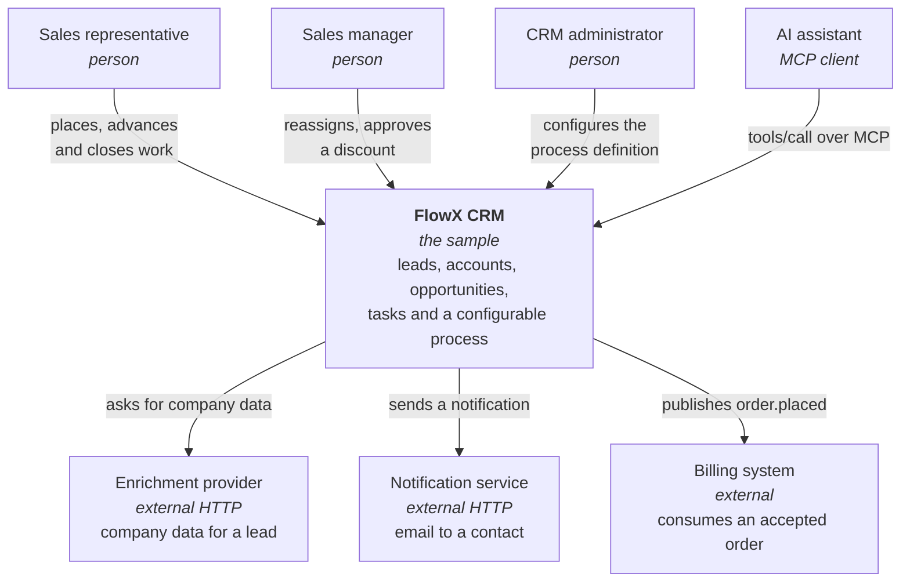

Three things in that picture are load-bearing later.

**The administrator is a separate actor from the representative.** They change the process,
not the data, and §7 turns that into a different authorisation stance and a different table.

**The enrichment provider is slow and out of our control.** It is what makes §8.2 a
suspension rather than a step — the design's only honest use of a wait.

**The AI assistant enters through the same door as everyone else.** There is no second
permission system; the stance that refuses a representative refuses the agent
([ADR-0047](adr/ADR-0047-internal-is-a-composition-stance.md)).

---

## 3. Containers

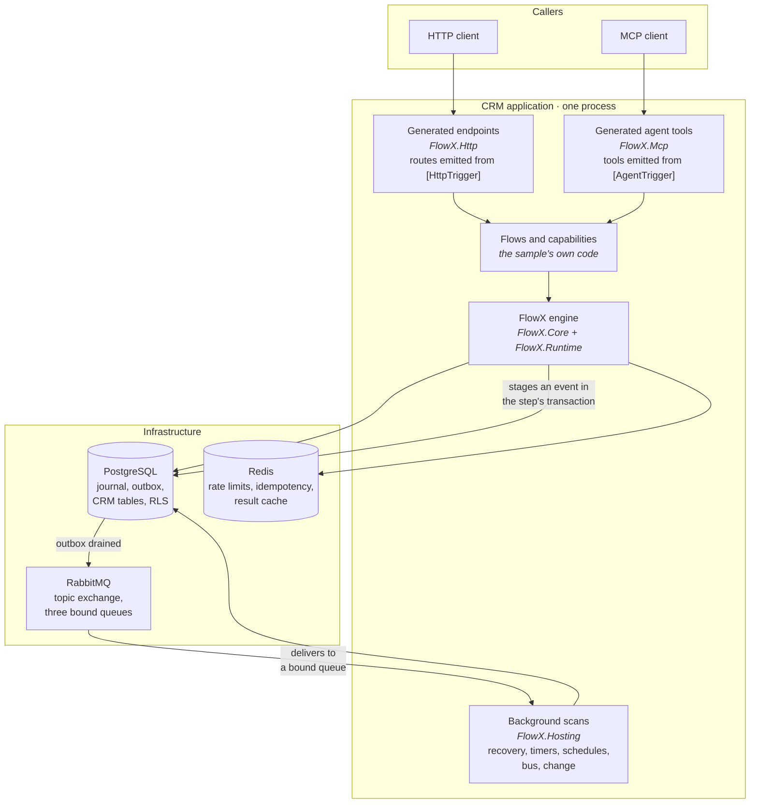

**The event never leaves the database before the step commits.** An event is staged in the
outbox inside the step's own transaction and drained afterwards, so a publisher crash
cannot produce an event for work that rolled back. That is the shipped behaviour, not a
design intention.

**Redis holds only what is allowed to be lost.** Rate-limit buckets, idempotency records
and cached results. Nothing whose loss changes a business outcome.

---

## 4. Components

The CRM application's own inside. Each box is a flow or a group of capabilities.

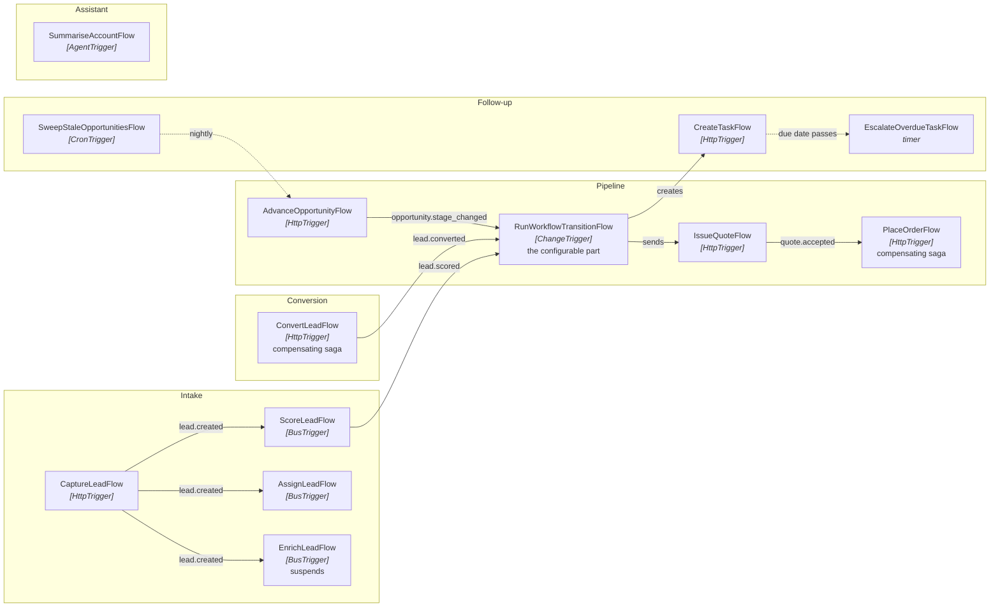

`lead.created` reaching three flows is one event and three subscriptions. On RabbitMQ that
is one publish to a topic exchange and three queues bound to it — §9 is why that matters
and why Redis Streams answers it differently.

---

## 5. The domain model

Split into four diagrams because one diagram of eight aggregates is a picture nobody reads.

### 5.1 Parties — lead, contact, account, customer

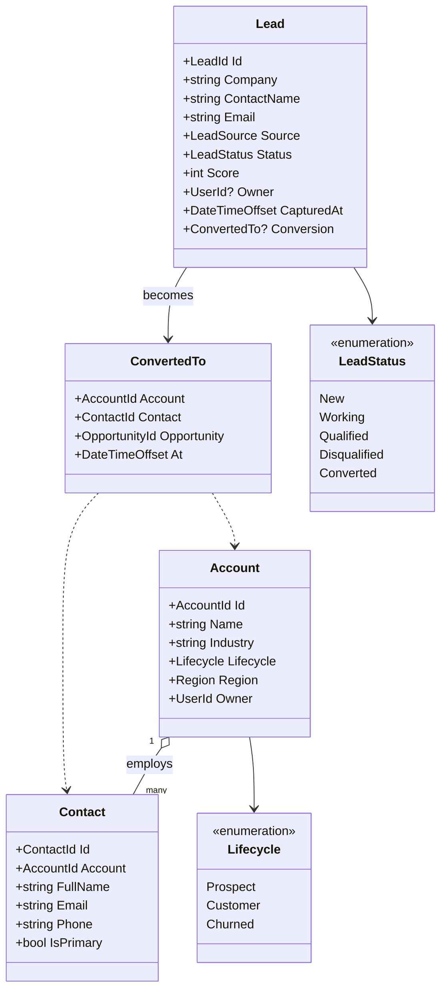

**There is no `Customer` entity, and that is a decision.** A customer is an `Account` whose
`Lifecycle` has reached `Customer` — the same row, the same identity, one field different.
Modelling it as a separate table would mean either duplicating every account field or
carrying a foreign key that is always one-to-one, and it would make the moment of becoming
a customer a *move* rather than a *transition*. The read model in §6 exposes
`customer_account` as a view for the reports that want one.

**No entity record carries a tenant, and the first draft of this document was wrong about
that.** It gave `TenantId Tenant` to lead, account, activity and process definition. A
tenant on a contract is a value the caller sets, and
[ADR-0046](adr/ADR-0046-a-tenant-is-resolved-at-admission.md) resolves it from validated
claims instead. It lives on `CapabilityContext.TenantId` and in the `tenant_id` column,
and `ContractTests.NoEntityRecordCarriesATenant` keeps it off the contracts.

`Contact.Email` and `Contact.Phone` carry `[Sensitive]`. That is not a comment: it puts
them behind `JournalPayload`'s redaction pass, which has one exit and no accessor, so they
are absent from journal rows, outbox rows, audit records and RFC 7807 problem documents
without any capability having to remember.

### 5.2 Pipeline — opportunity, quote, order

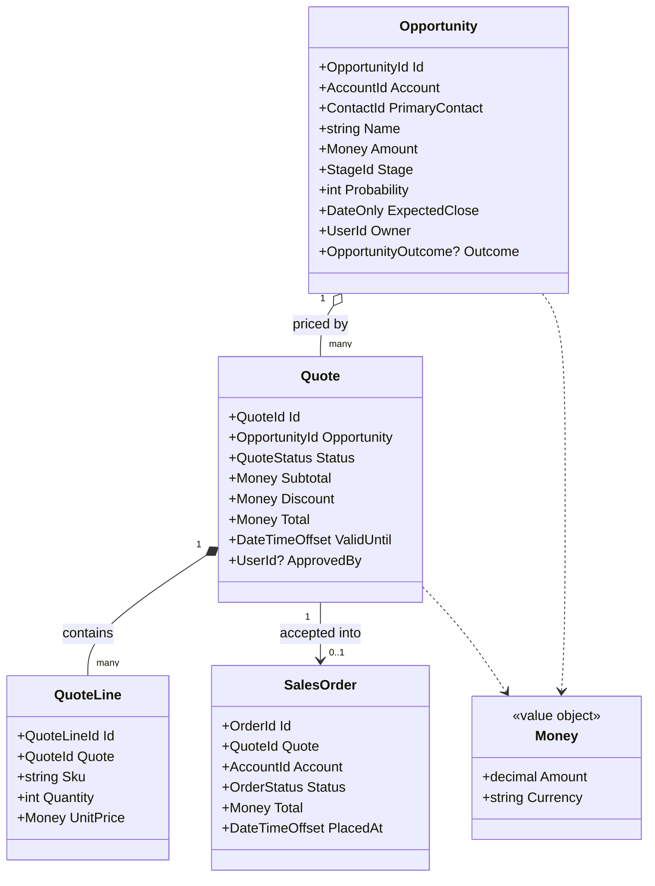

`Money` is a value object carrying its currency. The `event-driven` sample already found
what happens when a currency is hard-coded: four transports agreed with each other and all
four were wrong. Amounts here are never bare decimals.

A `Quote` above a discount threshold needs `ApprovedBy`. That is the sample's second
authorisation stance: `Permission("crm.discount.approve")`, which a representative does not
hold and a manager does.

### 5.3 Work — tasks and activities

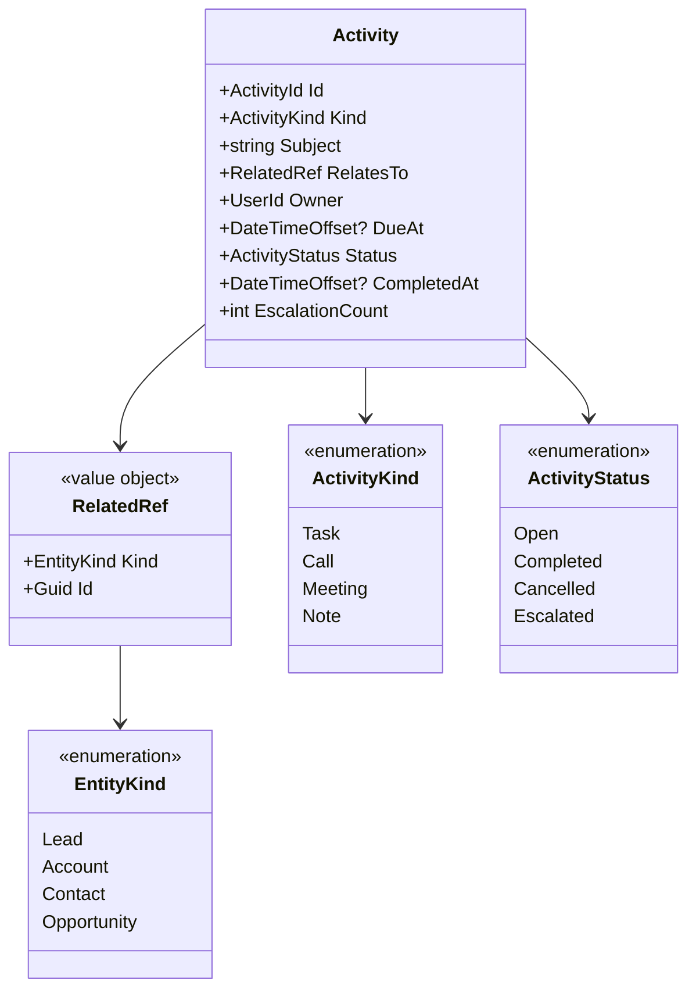

**`RelatedRef` is a discriminated reference, not a foreign key**, because a task may hang
off any of four entity kinds. §6 shows what that costs in the schema: referential integrity
for this one relationship is enforced by a trigger rather than by a constraint, and that is
stated rather than hidden.

### 5.4 The configurable process

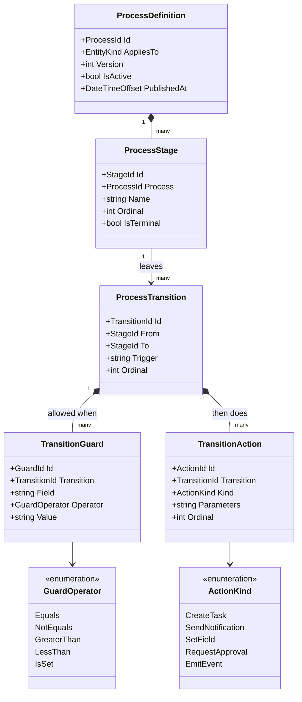

`ActionKind` is a **closed** enumeration and that is the whole of §7.

---

## 6. The data model

One schema, one diagram. `tenant_id` is on every root and is what row-level security
filters on.

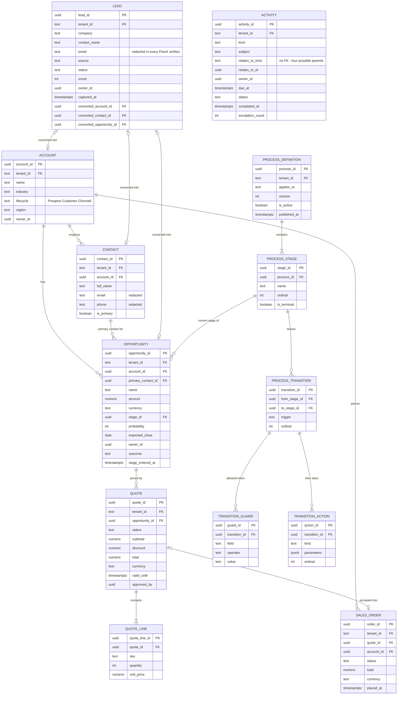

Three notes a reader needs and would otherwise have to infer.

**`ACTIVITY.relates_to_id` has no foreign key.** Four possible parents means either four
nullable columns with a check constraint, or one polymorphic pair with integrity enforced
in a trigger. This design takes the second and pays for it with a trigger, because the
first makes every query against activities read four columns to find the one that is set.

**`PROCESS_DEFINITION` is versioned and `is_active` is partial-unique per tenant and
entity kind.** An administrator publishes a new version; opportunities already in flight
keep the version they started on, exactly as `flow_instance` pins `flow_version`.

**`tenant_id` is `NOT NULL` on every root, and the five child tables do not carry one.**
The diagram above draws it nullable, copying `flow_instance`; that is wrong for this schema.
A composite foreign key containing a NULL is not checked at all under MATCH SIMPLE, which
would make the cross-tenant guards decoration. The child tables — quote lines, stages,
transitions, guards, actions — reach their tenant through the foreign key rather than
copying it, because a copy can disagree with the row it came from.

**Every root table carries `tenant_id` and is covered by row-level security.** The existing
migration pattern applies unchanged: `FORCE` row-level security and an unprivileged
`flowx_tenant` role, because a policy a superuser bypasses is decoration.

---

## 7. Dynamic workflow — where configuration stops

This is the section that decides whether the sample is honest.

### 7.1 What a CRM buyer means by "dynamic workflow"

An administrator opens a screen and says: *when an opportunity moves to `Negotiation`, if
the amount is over 50 000, create a task for the manager and require an approval.* They
expect that to take effect without a deployment.

### 7.2 What FlowX compiles, and therefore what configuration cannot add

FlowX's orchestration is compiled ([ADR-0002](adr/ADR-0002-compile-time-orchestration.md)):
the step graph, its compensations, its policies and its manifest are build artifacts. A
configured process **cannot** introduce a step the compiler never saw, because there is no
runtime that could dispatch it, no manifest entry that could describe it, and no
compensation the engine could unwind.

That is not a limitation to route around. It is the property the whole platform is bought
for — the reason a flow's shape is diffable, its cost is knowable before it runs, and its
authorisation is decidable at build time.

### 7.3 The resolution

**The graph is compiled. The path is data. The action set is closed.**

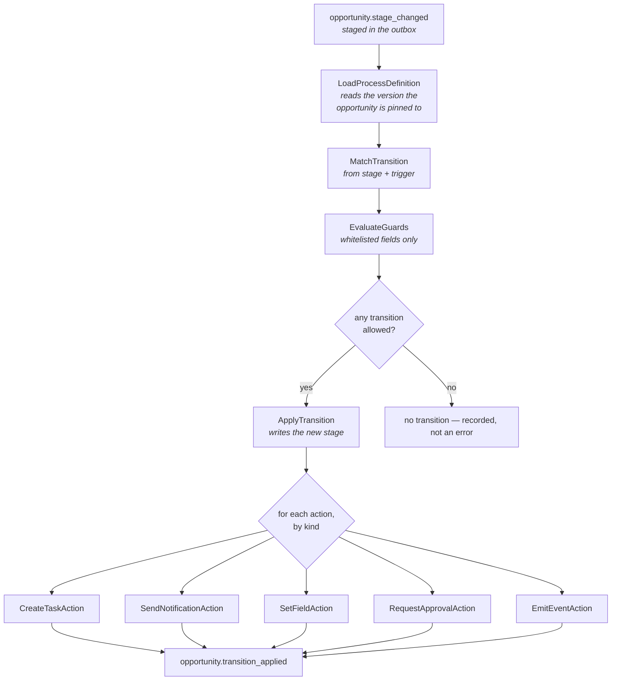

Every box in that diagram is a compiled step. `dispatch` is a `Switch` over `ActionKind`,
which is a closed enumeration — the compiler sees all five branches, the manifest publishes
all five, and `flowx diff` can tell you when one changes.

**What an administrator can change without a deployment**

- which stages exist, and their order
- which transitions are legal, and from where to where
- the guards on a transition, over a whitelisted set of fields and five operators
- which actions run, in what order, with what parameters
- publishing a new version, leaving in-flight opportunities on the old one

**What requires a code change, a build and a deployment**

- a new `ActionKind` — a sixth kind of side effect
- a new guard operator, or a guard over a field not on the whitelist
- an action that calls a system the deployment has no capability for

### 7.4 Why the guard language is not an expression evaluator

A general expression language over the entity graph would be a second execution engine:
untyped, unbounded, invisible to the manifest, unreachable by `FLOWX1011`'s
ambient-read analysis, and impossible to authorise at build time. Five operators over a
whitelisted field set is what can be *checked* — the whitelist is a compile-time constant,
so a guard naming a field that does not exist is refused when the definition is published,
not when an opportunity happens to reach that stage at three in the morning.

**This is a contested decision and needs an ADR** — it is the first time this repository
answers "can FlowX do dynamic workflows?", and a future reader will otherwise redo the
argument.

---

## 8. Sequences

### 8.1 Lead conversion — a saga across three aggregates

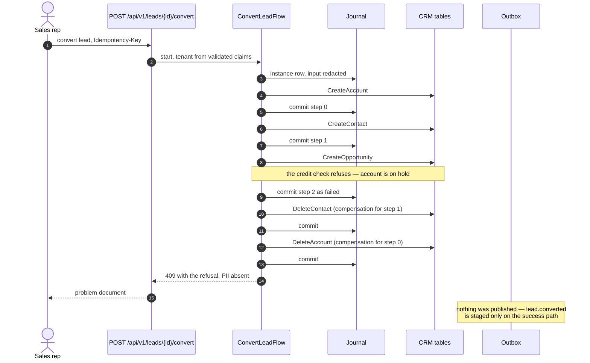

The compensations run in strict reverse order and are rebuilt from the journal, so a node
that dies mid-unwind resumes the unwind rather than restarting the flow. On the success
path the last step stages `lead.converted` in its own transaction.

### 8.2 Enrichment — waiting without holding anything

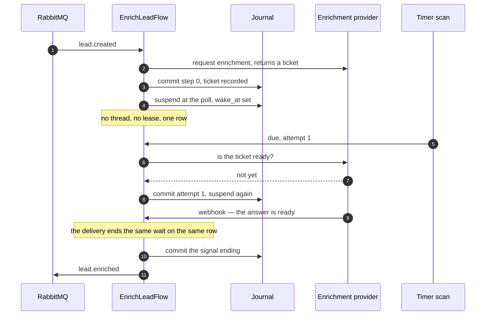

The poll and the webhook are **one wait with two endings**, not two waits. The instance
carries one `wake_at`, and a delivery arriving between attempts ends that wait rather than
starting another.

### 8.3 A configured transition

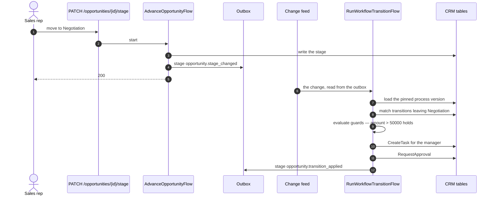

The transition is driven by the **change feed reading the outbox**, not by a broker. The
event is already durable when the transition runs, so a broker outage cannot lose a
configured action, and the cursor advances only past changes that reached an outcome.

### 8.4 A task that nobody does

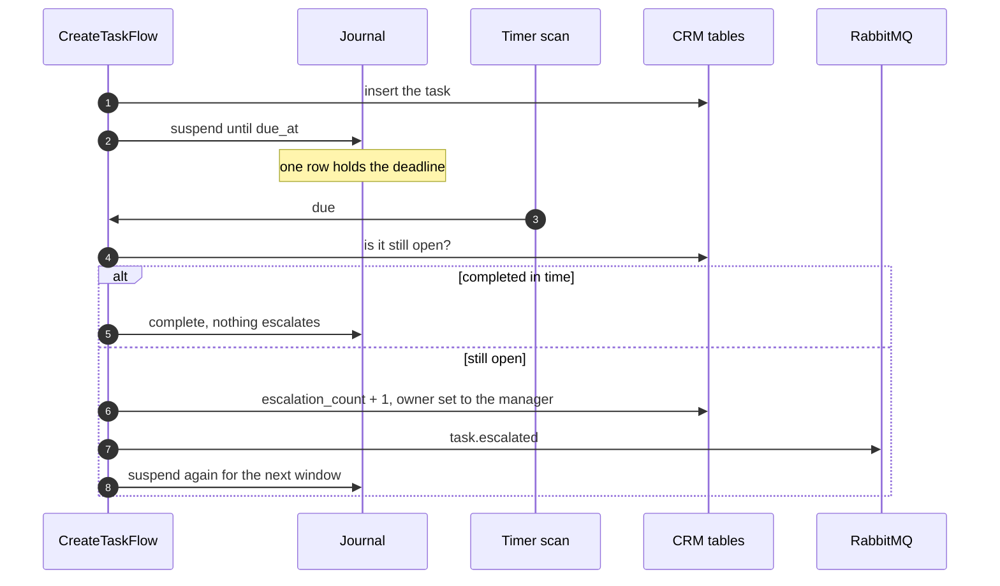

### 8.5 Fan-out on one publish

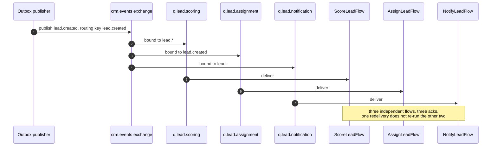

This is what the RabbitMQ plugin buys over Redis Streams: **the broker does the fan-out by
routing key**, and each consumer acknowledges independently. Redis Streams reaches the same
outcome with one consumer group per subscriber over one stream, which works and is what
`FlowX.Redis` does — but the topology is the application's to arrange rather than the
broker's, and a wildcard binding has no equivalent.

---

## 9. The RabbitMQ plugin

`plugins/FlowX.Redis` already implements `IEventPublisher`, `IBusConsumer`, `IStreamSource`,
`ILeaseStore`, `IRateLimiterStore`, `IIdempotencyStore` and `IResultCache`. The event-driven
sample proved that a flow does not change when the transport does. So `FlowX.RabbitMq` is
**two interfaces, not seven**:

| Interface | What RabbitMQ brings |
|---|---|
| `IEventPublisher` | publish to a topic exchange with the event type as the routing key, publisher confirms on |
| `IBusConsumer` | one queue per subscription, manual ack, a dead-letter exchange after the delivery limit |

Everything else stays where it is. A deployment running this sample uses PostgreSQL for
durability, RabbitMQ for events and Redis for policy stores, and no flow in the sample
knows which of the three it is talking to.

**What must be decided before it is written**

- **Ack ordering.** `IBusConsumer`'s contract offers per-key order. RabbitMQ delivers per
  queue, so per-key order means one queue per key or a single consumer per queue. The
  contract's conformance suite already holds two implementations to the same rules; a third
  must pass unchanged or the contract is wrong.
- **Dead-lettering.** Redis derives the dead-letter destination from the source stream.
  RabbitMQ has a first-class DLX. Whether `DeadLetter` finally reaches an artifact — it
  currently reaches none — is a manifest question and therefore an ADR.
- **Publisher confirms and the outbox.** The outbox marks a row published after the
  publisher returns. With confirms off that is a lie. Confirms on, or the row is marked
  before the broker has it.

**A refusal, stated in advance:** this plugin ships only with a suite that runs against a
real broker. A conformance suite that skips its own subject is a failing gate, not a
passing one — the same rule that kept Kafka out of `samples/event-driven`.

---

## 10. Implementation plan

Ordered by what unblocks what. Each package is a branch, and each names the test that says
it is done.

| # | Package | Deliverable | Done when |
|---|---|---|---|
| 1 | **`FlowX.RabbitMq` publisher + consumer** | `IEventPublisher`, `IBusConsumer`, options, DI extensions | `PublisherConformance` and the bus consumer suite pass against a real broker, zero skips |
| 2 | **Dead-letter and ack decisions** | ADR for the two questions in §9 | the ADR is written and the code matches it |
| 3 | **CRM schema and entities** | migrations, entity records, `[Sensitive]` on contact PII, RLS on every table | cross-tenant read is refused against a real PostgreSQL, in both directions |
| 4 | **Intake** | `CaptureLeadFlow`, `ScoreLeadFlow`, `AssignLeadFlow`, fan-out over RabbitMQ | one publish reaches three flows, and a redelivery to one does not re-run the others |
| 5 | **Conversion saga** | `ConvertLeadFlow` with compensations | a failure at step 2 leaves no account and no contact, asserted on the tables |
| 6 | **Enrichment wait** | `EnrichLeadFlow` using `PollUntil … OrSignal` | a webhook between attempts ends the wait on the same row, and no lease is held |
| 7 | **Process definition** | tables, publishing, versioning, guard whitelist validation | a guard naming an unknown field is refused at publish time |
| 8 | **Transition engine** | `RunWorkflowTransitionFlow` over the change feed, five action kinds | an administrator's change of the definition changes behaviour with no rebuild |
| 9 | **Pipeline and sales** | `AdvanceOpportunityFlow`, `IssueQuoteFlow`, `PlaceOrderFlow`, discount approval | a representative is refused the discount a manager is allowed |
| 10 | **Tasks and SLA** | `CreateTaskFlow`, escalation timer, `SweepStaleOpportunitiesFlow` | an overdue task escalates once per window and the sweep fires once across a fleet |
| 11 | **Assistant** | `SummariseAccountFlow` behind `[AgentTrigger]` | the tool is refused for a caller the HTTP route also refuses |
| 12 | **Sample README and wiring** | `samples/crm/README.md`, `dotnet run` against PostgreSQL + RabbitMQ + Redis | the documented `curl` sequence works as written |

**Sequencing.** 1 and 3 are independent and can run in parallel. 2 blocks nothing but must
land before 1 is called finished. 4 needs 1 and 3. 5, 6 and 9 need 3. 7 blocks 8. 10 and 11
need 3 only. 12 is last by definition.

**The risk worth naming now.** Package 1 depends on a reachable RabbitMQ. If none can be
run in the build environment, the plugin does not ship and packages 4 and 12 fall back to
Redis Streams — the sample still works, and §9's fan-out sequence becomes one consumer
group per subscriber instead of three queue bindings. That is a smaller sample, honestly
labelled, rather than an untested plugin.

---

**See also:** [09 — Trigger Model](09-Trigger-Model.md) ·
[10 — Policy Framework](10-Policy-Framework.md) ·
[16 — Multi-Tenancy](16-Multi-Tenant.md) ·
[17 — Plugin System](17-Plugin-System.md) ·
[samples/event-driven](../samples/event-driven/README.md)
