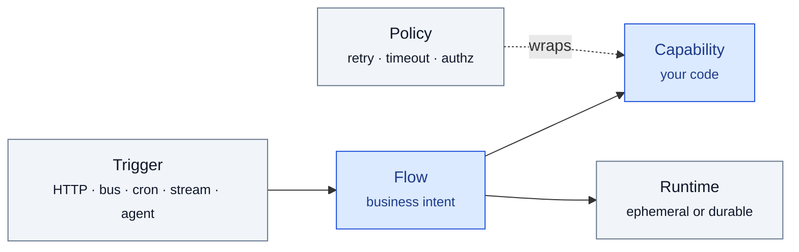
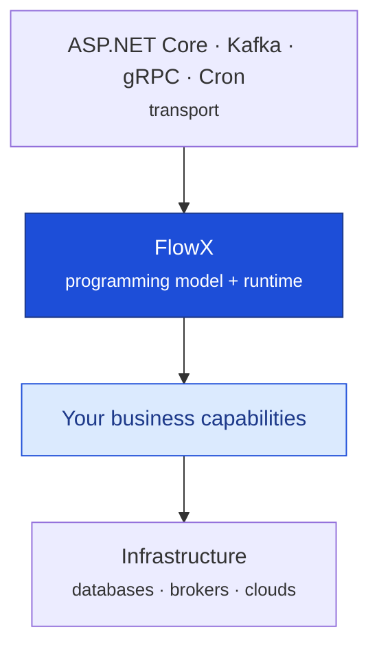
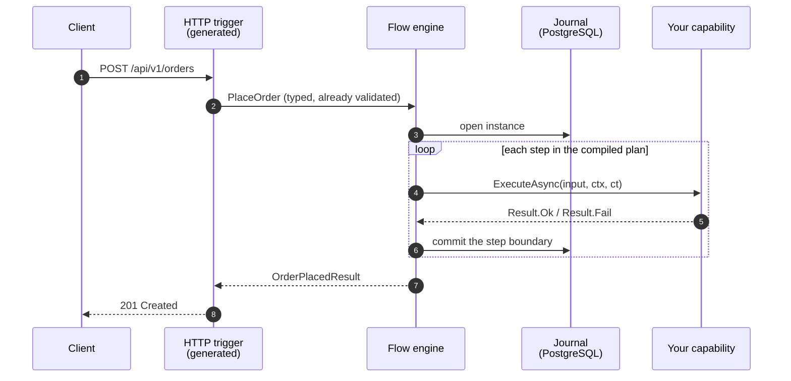
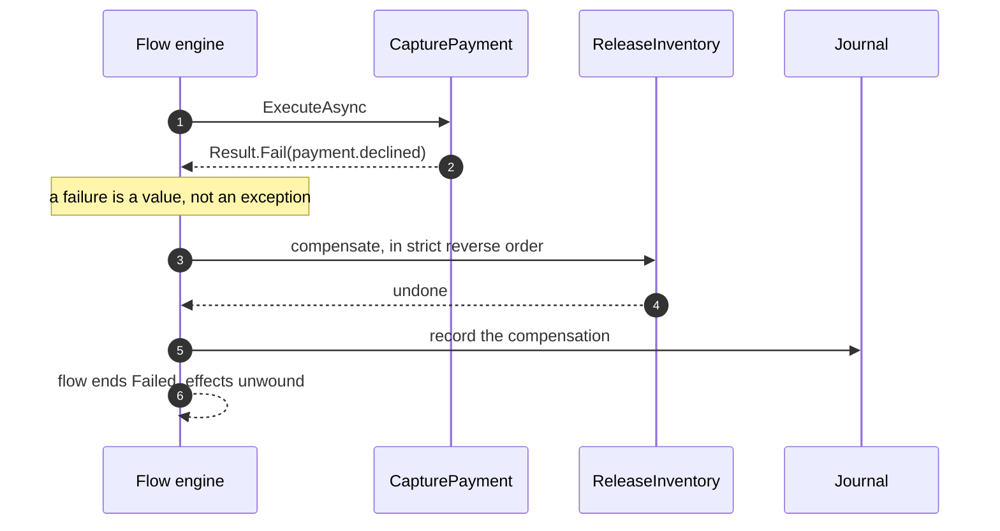
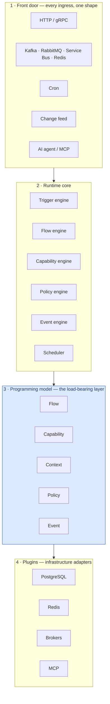
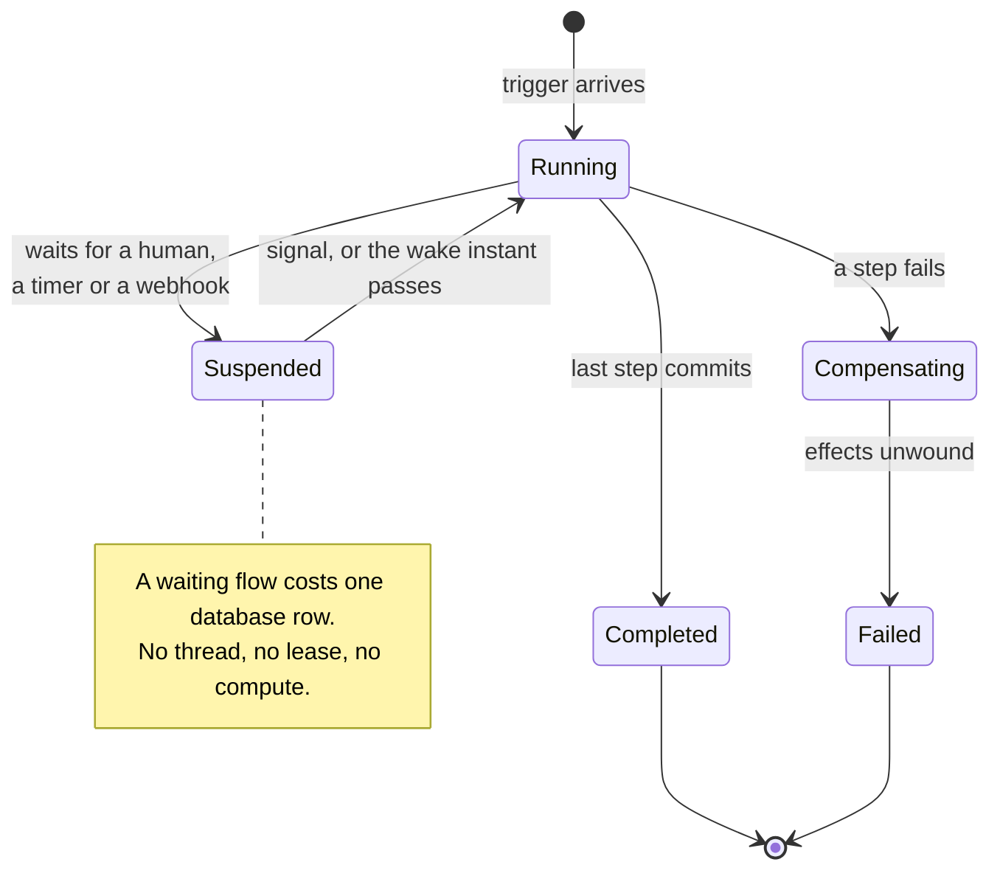
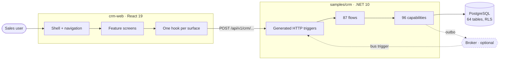
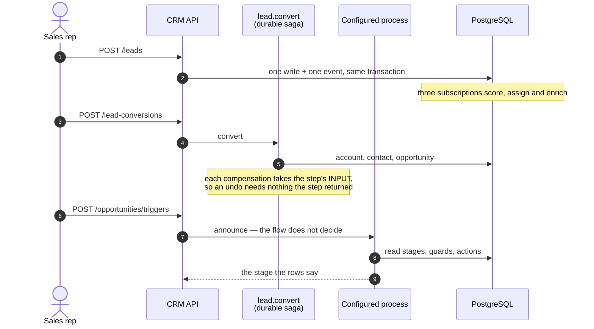
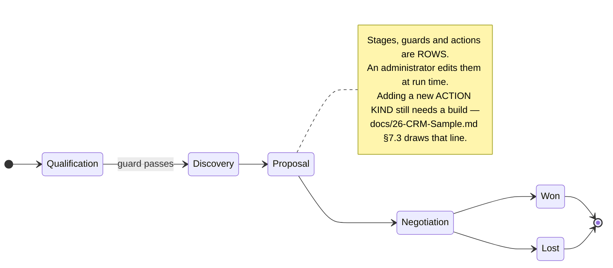

<div align="center">

# FlowX

**The Universal Application Platform**

*Write Business. Compile Intelligence. Run Everywhere.*

[](LICENSE)
[](docs/05-Architecture.md)
[](docs/21-Quality-Gates.md)
[](docs/21-Quality-Gates.md#3-owasp-top-10-mapping)

</div>



**You write the blue boxes. FlowX compiles the rest.**

<div align="center">

### [See it running →](#the-crm--a-real-application-not-a-demo)

</div>

[](#the-crm--a-real-application-not-a-demo)

<div align="center"><sub><b>samples/crm</b> — 87 flows, 96 capabilities, 64 tables and a 46-screen web client, all built on FlowX.<br/><a href="docs/screenshots/crm-web/">Every screen, in both roles →</a></sub></div>

> [!IMPORTANT]
> **Planning a production deployment? Talk to the author first** —
> [votrongdao@gmail.com](mailto:votrongdao@gmail.com). FlowX is Apache-2.0 and
> yours to run, but the choices that decide whether it goes well — execution
> profiles, tenant isolation, journal sizing, which performance budgets actually
> apply to you — are easy to get wrong from the outside and usually surface in
> production. [What to ask about](#going-to-production).

---

## Table of contents

- [What FlowX is](#what-flowx-is)
- [Five minutes to a running application](#five-minutes-to-a-running-application)
- [Architecture, from simple to complex](#architecture-from-simple-to-complex)
- [The CRM — a real application, not a demo](#the-crm--a-real-application-not-a-demo)
- [Why this is not "another MediatR"](#why-this-is-not-another-mediatr)
- [Documentation](#documentation)
- [Where the project actually is](#where-the-project-actually-is)
- [Going to production](#going-to-production)

---

## What FlowX is

FlowX is a **universal application runtime** for building AI-native, cloud-native,
event-driven business applications using **compile-time orchestration**.

> Applications are not collections of services.
> Applications are **networks of business capabilities connected by executable flows**.

FlowX turns that sentence into a runtime.

### The core equation

```
Application  =  Trigger  +  Flow  +  Capability  +  Policy  +  Runtime
```

There is no Controller, no Mediator, no Handler, no Consumer, no Scheduler.
Those are not architectural concepts — they are **transport details**, and FlowX
models all of them as one thing: a **Trigger**.

---

## Five minutes to a running application

### 1. Write a capability — one unit of business meaning

```csharp
[Capability("inventory.reserve", Version = "1.0")]
public sealed class ReserveInventory : ICapability<ReserveRequest, Reservation>
{
    private readonly IInventoryStore _store;
    public ReserveInventory(IInventoryStore store) => _store = store;

    public async ValueTask<Result<Reservation>> ExecuteAsync(
        ReserveRequest input, CapabilityContext ctx, CancellationToken ct)
    {
        var ok = await _store.TryReserveAsync(input.Sku, input.Quantity, ct);
        return ok
            ? Result.Ok(new Reservation(input.Sku, input.Quantity))
            : Result.Fail<Reservation>(InventoryErrors.OutOfStock(input.Sku));
    }
}
```

It knows nothing about HTTP, Kafka or databases. You can test it with `new`.

### 2. Compose a flow — business intent, not plumbing

```csharp
[Flow("order.place", Profile = ExecutionProfile.Durable)]
[HttpTrigger("POST", "/api/v1/orders", Idempotent = true)]
[KafkaTrigger("orders.requested", Group = "order-placement")]
public sealed partial class PlaceOrderFlow : Flow<PlaceOrder, OrderPlacedResult>
{
    protected override void Define(IFlowBuilder<PlaceOrder, OrderPlacedResult> flow) => flow
        .Step<ValidateOrder>()
        .Step<ReserveInventory>().CompensateWith<ReleaseInventory>()
        .Step<CapturePayment>().WithPolicy(Policies.PaymentGateway)
        .Emit<OrderPlaced>()
        .Return(ctx => new OrderPlacedResult(ctx.Get<OrderId>()));
}
```

### 3. Run it

```bash
dotnet run --project samples/ecommerce
```

That is the whole application. The HTTP endpoint, the Kafka consumer, the retry
policy, the saga compensation, the OpenTelemetry spans, the OpenAPI document and
the machine-readable manifest are **generated at compile time** from those two
files. Nothing is discovered by reflection at start-up.

> The `ecommerce` sample needs no infrastructure at all — no database, no broker.
> Samples that use durability need PostgreSQL; [samples/README.md](samples/README.md)
> says which, and why.

---

## Architecture, from simple to complex

Four views of the same system. Read them in order; each adds one layer of detail.

### View 1 — where FlowX sits



FlowX does not sit where MediatR sits. It sits one layer above: it owns the shape
of the application, not the dispatch of a message.

### View 2 — one request, end to end

The happy path, and its failure twin. Both are the same compiled plan.





### View 3 — the runtime, layered



Everything above layer 3 is an adapter and everything below it is a detail. That
is why the same flow runs behind HTTP, Kafka or a cron schedule with no change to
its body, and why the whole graph can be emitted as a machine-readable manifest at
build time.

### View 4 — the life of a durable instance



A node that dies mid-flow loses nothing: the journal holds every committed step
boundary, and another node picks the instance up and resumes from the frontier.
Measured rehydration cost is **p99 3.6 ms** —
[B7-B8-durability.md](docs/benchmarks/B7-B8-durability.md).

The full specification behind these pictures, in diffable Mermaid, is
[05-Architecture](docs/05-Architecture.md). Where the two disagree, the
specification wins.

---

## The CRM — a real application, not a demo

Most platforms are introduced with a to-do list. FlowX is introduced with a CRM,
because the interesting questions only appear at that size: dozens of flows,
several roles, a saga that has to undo itself, scheduled sweeps, an agent surface,
row-level security, and a business process the customer expects to change **without
calling a developer**.

`samples/crm` is that application. It exists to prove one claim:

> **A sales process whose transitions, guards and actions are rows an administrator
> rewrites at run time — while the set of actions stays a closed enumeration the
> compiler sees the whole of.**

Both halves matter. Configuration that can do anything is a scripting engine with
no type system; configuration that can do nothing is a rebuild. The CRM draws the
line in one place and defends it with a test.

| | |
|---|---|
| Flows | **87** |
| Capabilities | **96** |
| HTTP routes | **79**, plus 4 cron sweeps, 3 bus subscriptions, 1 agent surface, 1 change feed |
| Tables | **64**, under row-level security |
| Web client | React 19 + TanStack Router/Query, **46 screens** |
| Tests | **591** for the API, **246** for the client |

What it covers, end to end: capture a lead → three subscriptions score, assign and
enrich it → convert it into an account, contact and opportunity as a compensating
saga → quote it, with a discount a representative may not approve → order it →
advance it through a process an administrator configured → sweep what went overdue
→ answer a question about the account from an AI agent.

### The claim, in two screens

**1. The process is data.** Nine stages and nine transitions, each with what has to
hold and what it does — rows in a table, published as a version, with the live deal
count beside each stage.


**2. The same process, being worked.** Nothing in the board is hard-coded: the
columns are the rows above.


Change the rows and the board changes — no rebuild, no deployment. Add a *new kind
of action* and you need a build, because that is a compile-time enumeration on
purpose. [26-CRM-Sample §7.3](docs/26-CRM-Sample.md) argues the line;
`ProcessPublishing.Validate` enforces it.

### The screens

**Sales.** Pipeline, weighted forecast, open work and the largest deal, all from
the tenant's own rows.


**Executive.** The same data, aggregated for a director.


**Service.** A case queue with SLA state — open, breached and awaiting first
response — computed by the server, not by the browser.


**Setup.** Declaring an entity this build has never heard of, at run time.


### Authorisation is a server answer, not a UI state

The client never decides what you may do. It asks, the server decides, and the
client renders the server's own sentence — down to the error code.

**What the signed-in token actually holds**, resolved per request, including the
two fields this caller may read but not write:


**And the same screen for someone who does not hold it.** This is the picture worth
having: a refusal that names the capability, the permission and the code.


### Every screen, both roles

All 46 screens were captured twice — once as a representative, once as an
administrator — against the running backend on a seeded tenant. Six differ between
the two, and [the index says which](docs/screenshots/crm-web/).

| Area | Screens |
|---|---|
| Sales | [console](docs/screenshots/crm-web/admin/index.png) · [kanban](docs/screenshots/crm-web/admin/kanban.png) · [search](docs/screenshots/crm-web/admin/search.png) |
| Records | [leads](docs/screenshots/crm-web/admin/records-lead.png) · [accounts](docs/screenshots/crm-web/admin/records-account.png) · [contacts](docs/screenshots/crm-web/admin/records-contact.png) · [opportunities](docs/screenshots/crm-web/admin/records-opportunity.png) · [quotes](docs/screenshots/crm-web/admin/records-quote.png) · [tasks](docs/screenshots/crm-web/admin/records-task.png) · [work orders](docs/screenshots/crm-web/admin/records-workorder.png) |
| Service | [case queue](docs/screenshots/crm-web/admin/service-cases.png) · [board](docs/screenshots/crm-web/admin/service-board.png) · [SLA](docs/screenshots/crm-web/admin/service-sla.png) |
| Work | [inbox](docs/screenshots/crm-web/admin/work-inbox.png) · [calendar](docs/screenshots/crm-web/admin/work-calendar.png) · [mobile](docs/screenshots/crm-web/admin/work-mobile.png) |
| Executive | [home](docs/screenshots/crm-web/admin/exec.png) · [board](docs/screenshots/crm-web/admin/exec-board.png) · [forecast](docs/screenshots/crm-web/admin/exec-forecast.png) · [KPIs](docs/screenshots/crm-web/admin/exec-kpis.png) · [reviews](docs/screenshots/crm-web/admin/exec-reviews.png) · [insights](docs/screenshots/crm-web/admin/exec-insights.png) · [org](docs/screenshots/crm-web/admin/exec-org.png) · [sales performance](docs/screenshots/crm-web/admin/exec-sales-performance.png) · [deal performance](docs/screenshots/crm-web/admin/exec-deal-performance.png) |
| Planning | [portfolio](docs/screenshots/crm-web/admin/plan-portfolio.png) · [strategy](docs/screenshots/crm-web/admin/plan-strategy.png) · [accounts](docs/screenshots/crm-web/admin/plan-accounts.png) · [leads](docs/screenshots/crm-web/admin/plan-leads.png) · [opportunities](docs/screenshots/crm-web/admin/plan-opportunities.png) · [operations](docs/screenshots/crm-web/admin/plan-operations.png) |
| Analytics | [reports](docs/screenshots/crm-web/admin/analytics-reports.png) · [campaigns](docs/screenshots/crm-web/admin/analytics-campaigns.png) |
| Setup | [home](docs/screenshots/crm-web/admin/setup.png) · [objects](docs/screenshots/crm-web/admin/setup-objects.png) · [fields](docs/screenshots/crm-web/admin/setup-fields.png) · [layout](docs/screenshots/crm-web/admin/setup-layout.png) · [list views](docs/screenshots/crm-web/admin/setup-list-views.png) · [flows](docs/screenshots/crm-web/admin/setup-flows.png) · [stages](docs/screenshots/crm-web/admin/setup-stages.png) · [approvals](docs/screenshots/crm-web/admin/setup-approvals.png) · [permissions](docs/screenshots/crm-web/admin/setup-permissions.png) · [validation](docs/screenshots/crm-web/admin/setup-validation.png) · [schema](docs/screenshots/crm-web/admin/setup-schema.png) · [quality](docs/screenshots/crm-web/admin/setup-quality.png) · [onboarding](docs/screenshots/crm-web/admin/setup-onboarding.png) |

> Some list screens carry rows left behind by the API test suite, which ran against
> the same database. They are real rows through the real API — just not pretty
> demo data.

### How the CRM is put together



The broker is dashed on purpose. Leave it out and the configured process still
runs — it is driven by the change feed over the outbox. Only the three
`lead.created` subscriptions go quiet, and the sample says so rather than hiding it.

### Lead to cash, as the flows actually run



The seam is the last exchange. The flow **announces**; the configured process
**decides**. That is what lets an administrator rewrite the process at run time
with no rebuild and no deployment — while `ProcessPublishing.Validate` keeps the
set of *actions* a closed enumeration the compiler checked.



### Running the CRM yourself

```bash
# 1. The API, against PostgreSQL, seeded with a demo tenant.
FLOWX_POSTGRES_CONNECTION="Host=localhost;Port=5432;Database=postgres;Username=postgres" \
CRM_SEED_FILE="$PWD/samples/crm/seed/northwind.json" \
ASPNETCORE_ENVIRONMENT=Development \
  dotnet run --project samples/crm

# 2. The web client. It proxies /api to the server above.
cd samples/crm-web && npm install && npm run dev     # http://localhost:5173
```

Or the whole stack — database, API, client — with `cp .env.example .env` and
`docker compose up --build`.

The full design, with C4 views, the domain and data models and the sequences, is
[26-CRM-Sample](docs/26-CRM-Sample.md).

---

## The other samples

Ten applications, each named for a claim in the specification it proves — not to
demonstrate syntax. **All ten run.**

| Sample | Proves | Needs |
|---|---|---|
| [ecommerce](samples/ecommerce/) | An ephemeral saga with compensation, over HTTP *and* MCP | nothing |
| [ai-agent](samples/ai-agent/) | Capabilities as agent tools, with real authorisation | nothing |
| [banking](samples/banking/) | A durable transfer saga, redaction reaching a real outbox row | PostgreSQL |
| [workflow](samples/workflow/) | The whole DSL: `Switch`, `Parallel`, `ForEach`, `SubFlow`, human waits | PostgreSQL |
| [scheduler](samples/scheduler/) | Cron at fleet scale: overlap, jitter, missed fires, **no leader election** | PostgreSQL |
| [polling](samples/polling/) | Waiting costs one database row — no thread, no lease | PostgreSQL |
| [healthcare](samples/healthcare/) | Consent, PII redaction, erasure by subject | PostgreSQL |
| [event-driven](samples/event-driven/) | HTTP → broker → change → cron with zero logic changes | PostgreSQL + Redis |
| [realtime-stream](samples/realtime-stream/) | Bounded memory under a slow sink | PostgreSQL + Redis |
| [crm](samples/crm/) | A process an administrator rewrites at run time | PostgreSQL |

[samples/README.md](samples/README.md) carries the full column of what each one
cost, including the four things the platform **refuses** rather than lacks, each
argued in an ADR.

---

## Why this is not "another MediatR"

| Concern | MediatR | MassTransit | Temporal / Dapr Workflow | **FlowX** |
|---|---|---|---|---|
| Dispatch | runtime reflection | runtime | remote worker | **compile-time, zero-reflection** |
| Durability | none | none | always-on (heavy) | **per-flow profile: ephemeral *or* durable** |
| Triggers | in-proc only | message bus | signals/schedules | **one model for HTTP, bus, cron, stream, AI agent** |
| Policies | manual pipeline behaviors | pipe config | code | **declarative policy graph, compile-composed** |
| Machine-readable architecture | no | no | partial | **`flowx.manifest.json` — first-class artifact** |
| Cost when you don't need it | low | medium | very high | **pay-per-profile** |

The differentiator is not "faster mediator". It is: **one programming model whose
architecture is a compiled, queryable artifact** — see
[13-AI-Native](docs/13-AI-Native.md).

---

## Documentation

Start here, in order:

| # | Document | What it answers |
|---|---|---|
| 01 | [Vision](docs/01-Vision.md) | What problem justifies a new platform |
| 02 | [Manifesto](docs/02-Manifesto.md) | What FlowX believes |
| 03 | [Design Principles](docs/03-Design-Principles.md) | The 12 principles, each with its enforcement mechanism |
| 04 | [Core Concepts](docs/04-Core-Concepts.md) | Trigger, Flow, Capability, Policy, Context, Manifest |
| 05 | [Architecture](docs/05-Architecture.md) | **arc42 + C4 — the main design document** |
| 06 | [Execution Engine](docs/06-Execution-Engine.md) | How a flow actually runs; determinism; replay |
| 07 | [Capability Model](docs/07-Capability-Model.md) | Contracts, versioning, compensation, testing |
| 08 | [Flow Definition](docs/08-Flow-Definition.md) | The DSL, control flow, the compiled graph |
| 09 | [Trigger Model](docs/09-Trigger-Model.md) | Universal ingress: HTTP, bus, cron, stream, agent |
| 10 | [Policy Framework](docs/10-Policy-Framework.md) | Retry, timeout, breaker, authz, idempotency, cache |
| 11 | [Distributed Runtime](docs/11-Distributed-Runtime.md) | Partitioning, journal, leases, exactly-once |
| 12 | [Observability](docs/12-Observability.md) | Traces, metrics, flow replay, live topology |
| 13 | [AI-Native](docs/13-AI-Native.md) | The manifest, the knowledge graph, agent surface |
| 14 | [Performance](docs/14-Performance.md) | Budgets, benchmarks, allocation discipline |
| 15 | [Security](docs/15-Security.md) | Zero-trust, STRIDE per boundary, supply chain |
| 16 | [Multi-Tenancy](docs/16-Multi-Tenant.md) | Isolation levels, noisy neighbours, data residency |
| 17 | [Plugin System](docs/17-Plugin-System.md) | Extension contracts and compatibility rules |
| 18 | [Cloud-Native](docs/18-Cloud-Native.md) | Kubernetes, KEDA, rollout strategies |
| 19 | [SDK](docs/19-SDK.md) | Developer surface, CLI, testing kit |
| 20 | [Roadmap](docs/20-Roadmap.md) | Risk-first delivery plan, from walking skeleton to v1 |
| 21 | [Quality Gates](docs/21-Quality-Gates.md) | SonarQube thresholds, OWASP Top 10 mapping, SAST/DAST |
| 26 | [CRM Sample](docs/26-CRM-Sample.md) | The CRM's C4 views, domain model, data model and sequences |
| 27 | [CRM Reference Architecture](docs/27-CRM-Reference-Architecture.md) | A wider CRM read against what FlowX compiles |
| 28 | [Azure Hosting](docs/28-Azure-Hosting.md) | Functions, App Service, Container Apps or AKS — scored against what the runtime needs |
| 29 | [From Zero to Production](docs/29-From-Zero-To-Production.md) | **Start here to adopt it** — the learning path, DevSecOps on GitHub, and shipping |
| — | [ADR index](docs/adr/README.md) | 68 decisions, each with its trade-off and its revisit trigger |
| — | [Samples](samples/README.md) | Ten reference applications and what each one cost |

**Working documents** — these change as the build progresses:

| Document | What it answers |
|---|---|
| [PLAN.md](PLAN.md) | Work packages, each with a mechanically checkable exit criterion |
| [CHECKLIST.md](CHECKLIST.md) | **Where the project actually is right now** |

## Repository layout

```
src/
├── FlowX.Abstractions/        # contracts only — zero dependencies
├── FlowX.Core/                # flow graph, context, result, policy model
├── FlowX.Compiler/            # Roslyn source generators + analyzers
├── FlowX.Compiler.CodeFixes/  # the fix for every analyzer that has one
├── FlowX.Runtime/             # engines: flow, capability, policy, event, tenancy
├── FlowX.Hosting/             # composition root, options, health, scans
├── FlowX.Ai/                  # the agent surface and the manifest it serves
├── FlowX.Logging/             # structured logging bridge
├── FlowX.Testing/             # the testing kit
└── FlowX.Cli/                 # flowx new | graph | diff | replay | verify
plugins/
└── FlowX.Http/ FlowX.Postgres/ FlowX.Redis/ FlowX.Kafka/
    FlowX.RabbitMq/ FlowX.AzureServiceBus/ FlowX.Mcp/
tests/                         # 31 projects, including:
├── FlowX.Architecture.Tests/  # 99 fitness functions — the rules, executable
├── FlowX.Compiler.Tests/      # 841 generator tests
├── FlowX.Chaos/               # SIGKILL a node at a step boundary, 10 000 times
└── FlowX.Durability.Bench/    # the durable-commit and rehydration budgets
docs/                          # 30 documents + 68 ADRs
samples/                       # ten applications and one web client
```

---

## Where the project actually is

The runtime exists and runs. Ten sample applications run against it, the largest
being the CRM above. The full suite is green: architecture fitness functions,
generator tests, runtime tests, and the sample suites against a real PostgreSQL.

What is **not** finished is stated plainly rather than implied:

- **Build cost is over budget.** The generator adds +46.5 % at 50 flows and
  +67.1 % at 200, against a stated +8 %. The budget has been re-expressed in
  bytes-per-flow and is gated; the percentage is what it is —
  [B12-scale.md](docs/benchmarks/B12-scale.md),
  [ADR-0014](docs/adr/ADR-0014-derived-error-catalogue-vs-build-budget.md).
- **Six of fourteen performance budgets are measured.** The rest have a number and
  no gate, and [14-Performance](docs/14-Performance.md) says which is which in the
  `Gate` column rather than implying they are all enforced.
- **No published NuGet packages yet.** You build from source.

[CHECKLIST.md](CHECKLIST.md) carries the honest current state, including what is
blocked and why. The specification is the contract: code that contradicts it is a
bug in the code, or an ADR that has not been written yet.

---

## Going to production

> [!IMPORTANT]
> **If you are planning a production deployment, talk to the author first.**
>
> FlowX is Apache-2.0 and you are free to run it however you like — but the
> platform makes deliberate, load-bearing choices that are easy to get wrong from
> the outside. Which execution profile a flow should carry; how tenants are
> isolated; where the journal lives and how it is sized; which of the fourteen
> performance budgets actually applies to your workload and which is still
> unmeasured; what a schedule does when a node dies. Every one of those has a
> right answer for your system, and the wrong answer usually surfaces in
> production rather than in a test.
>
> The author has that context and is glad to help — architecture review, sizing,
> a migration path, or simply a second opinion before you commit. Reach out at
> **[votrongdao@gmail.com](mailto:votrongdao@gmail.com)**, or via
> [GitHub issues](https://github.com/votrongdao/FlowX/issues) and
> [@votrongdao](https://github.com/votrongdao). You will get a far better result
> than reverse-engineering it from the documents.
>
> Read [18-Cloud-Native](docs/18-Cloud-Native.md),
> [15-Security](docs/15-Security.md) and [16-Multi-Tenancy](docs/16-Multi-Tenant.md)
> before you start — and then still ask.

## License

Apache License 2.0 — see [LICENSE](LICENSE). Rationale in
[ADR-0012](docs/adr/ADR-0012-apache-2-license.md).
