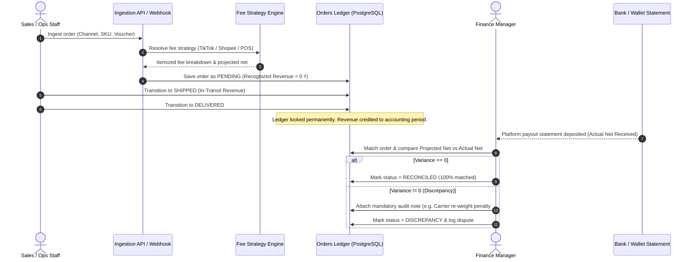
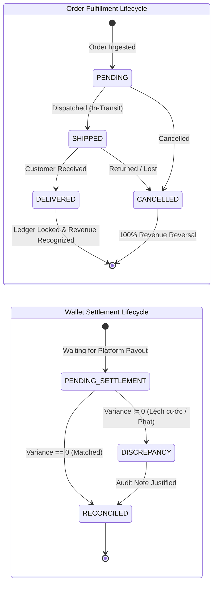

<div align="center">

# FASHION-WEB

**Multi-Channel Revenue & Cash Flow Settlement Management Platform**

*Eradicate Phantom Revenue. Automate Marketplace Fee Deductions. Audit Wallet Settlements.*

[](docs/usecase.md)
[](docs/requirements_invest.md)
[](docs/uiux_specifications.md)
[](docs/information_architecture.md)
[](docs/stitch_prototype.html)

</div>



<div align="center">

```mermaid
flowchart LR
    subgraph Ingestion["1 · Multi-Channel Stream"]
        direction TB
        TK["TikTok Shop API"]
        SP["Shopee Open Platform"]
        POS["In-Store POS Swipes"]
        MAN["Manual Entry (MOD-01)"]
    end

    subgraph Engine["2 · Dynamic Fee Engine"]
        STRAT["Strategy Pattern<br/><small>Commission · Payment · Freeship Cap</small>"]
    end

    subgraph Ledger["3 · Realized Cashflow Ledger"]
        DELIV["Delivered Orders Only<br/><small>Anti-Phantom Rule · Immutable</small>"]
    end

    subgraph Audit["4 · Settlement Audit"]
        REC["Bank Statement Reconcile<br/><small>Variance Justification (#DIS)</small>"]
    end

    Ingestion --> STRAT --> DELIV --> REC

    classDef channel fill:#f8fafc,stroke:#94a3b8,color:#0f172a
    classDef core fill:#dbeafe,stroke:#1d4ed8,color:#1e3a8a
    classDef strict fill:#fee2e2,stroke:#b91c1c,color:#7f1d1d
    class Ingestion channel
    class Engine,Ledger core
    class Audit strict
```

**You sell across channels. FASHION-WEB protects your cash flow and eliminates phantom profits.**

<sub><b>Author / Intern:</b> Dang Duc Hoa · <b>Program:</b> VSF Internship Program · <b>Platform:</b> FASHION-WEB Multi-Channel Revenue & Settlement</sub>

### [See Interactive Prototype Running →](docs/stitch_prototype.html)

</div>

[](#screen-3-revenue-dashboard--executive-reporting-scr-03)

<div align="center"><sub><b>FASHION-WEB</b> — Multi-channel order orchestration across TikTok Shop, Shopee, and POS, automated fee unbundling via Strategy Pattern, and bank wallet discrepancy auditing.</sub></div>

---

## Table of Contents

- [What FASHION-WEB is](#what-fashion-web-is)
  - [The core equation](#the-core-equation)
  - [5 Core Accounting Data Integrity Rules](#5-core-accounting-data-integrity-rules)
- [Architecture, from simple to complex](#architecture-from-simple-to-complex)
  - [View 1 — Automated Multi-Channel Fee Schedule Matrix](#view-1--automated-multi-channel-fee-schedule-matrix)
  - [View 2 — One Order, End-to-End Financial Lifecycle](#view-2--one-order-end-to-end-financial-lifecycle)
  - [View 3 — 3 Core Business Domains](#view-3--3-core-business-domains)
  - [View 4 — Financial State Machine](#view-4--financial-state-machine)
- [Requirements, Actors & Use Case Specifications](#requirements-actors--use-case-specifications)
  - [System Use Case Diagram](#system-use-case-diagram)
  - [Actors & Role-Based Access Control (RBAC)](#actors--role-based-access-control-rbac)
  - [RBAC Permissions Matrix](#rbac-permissions-matrix)
- [The Application — 3 Core Screens & Production UI](#the-application--3-core-screens--production-ui)
  - [Screens Hierarchy Tree](#screens-hierarchy-tree)
  - [Financial Numerical Typography Rule](#financial-numerical-typography-rule)
  - [Screen 1: Multi-Channel Orders Management (SCR-01)](#screen-1-multi-channel-orders-management-scr-01)
  - [Screen 2: Marketplace Fees & Wallet Settlement (SCR-02)](#screen-2-marketplace-fees--wallet-settlement-scr-02)
  - [Screen 3: Revenue Dashboard & Executive Reporting (SCR-03)](#screen-3-revenue-dashboard--executive-reporting-scr-03)
  - [5 Operational Modals & Action Drawers](#5-operational-modals--action-drawers)
- [Documentation & Traceability](#documentation--traceability)
- [Repository Layout](#repository-layout)
- [Engineering Roadmap (Phase 3)](#engineering-roadmap-phase-3)

---

## What FASHION-WEB is

In multi-channel fashion retail, businesses constantly suffer from the **"Paper Profit, Negative Cash Flow"** paradox: GMV sales appear high, but actual bank balances shrink due to hidden marketplace deductions, shipping weight surcharges, and revenue recognized before delivery.

FASHION-WEB is an **automated cash flow control & marketplace reconciliation platform** designed to:
1. **Eliminate phantom revenue** by recognizing income strictly upon successful customer delivery (`DELIVERED`).
2. **Unbundle itemized channel deductions** (commissions, payment fees, shipping service fees) automatically using the **Strategy Pattern**.
3. **Audit bank wallet statements** against expected payouts to isolate discrepancy variances (e.g., carrier dimensional re-weighing penalties).

### The core equation

```text
Realized Cash Flow  =  Delivered Gross Sales  -  Platform Fees  -  Shop Vouchers  ±  Discrepancy Variance
```

> **Zero Phantom Revenue Rule:** Orders in `PENDING`, `SHIPPED`, or `CANCELLED` status contribute exactly **0 ₫** to realized revenue. Revenue is officially recognized if and only if an order transitions to `DELIVERED`.

---

### 5 Core Accounting Data Integrity Rules

| # | Rule | Accounting Constraint | Financial Control Objective |
|---|---|---|---|
| **1** | **Phantom Revenue Elimination** | Exclude 100% of `PENDING`, `SHIPPED`, `CANCELLED` orders from revenue KPIs and executive charts. | Prevents paying taxes or making inventory commitments on unearned income. |
| **2** | **Immutable Realized Ledger** | Lock all item prices, quantities, and discounts permanently once an order reaches `DELIVERED`. | Guarantees audit reproducibility for tax and accounting compliance. |
| **3** | **Shop Voucher Boundary** | Mathematically enforce $0 \le \text{Shop Voucher} \le \text{Subtotal}$ (enforced on `shop_voucher`). | Prevents negative net payable balance exploits and calculation overflow. |
| **4** | **Mandatory Variance Justification** | If $\text{Variance} \ne 0$ during reconciliation, finance staff must provide written root-cause notes. | Prevents silent fund leakages caused by platform penalties or carrier re-weighing. |
| **5** | **Instant In-Store Settlement** | In-store POS cash/swipe orders transition immediately to `DELIVERED`. | Eliminates fictitious shipping delays for physical on-site counter sales. |

---

## Architecture, from simple to complex

### View 1 — Automated Multi-Channel Fee Schedule Matrix

The fee engine dynamically selects the deduction formula using the **Strategy Pattern** based on order channel and payment method:

| Sales Channel | Commission Fee | Payment Processing Fee | Service / Fixed Fees | Offline / Gateway Surcharge |
|---|---|---|---|---|
| **TikTok Shop** | 4.0% $\times$ Subtotal | 3.0% $\times$ Gross | 2,000 ₫ / fulfilled order | 0 ₫ |
| **Shopee (Mall & Standard)** | 4.5% $\times$ Subtotal | 4.0% $\times$ Gross | Freeship Xtra 2.0% (Cap at 20,000 ₫) | 0 ₫ |
| **In-Store POS** | 0% | 1.0% $\times$ Gross (Only on Card/QR payments) | 0 ₫ | Cash payment: 0% fee |

$$\text{Total Platform Fees} = \text{Commission Fee} + \text{Payment Processing Fee} + \text{Service / Fixed Fees}$$

$$\text{Projected Net Payout} = \text{Gross Sales} - \text{Total Platform Fees}$$

---

### View 2 — One Order, End-to-End Financial Lifecycle

From initial multi-channel placement to bank wallet reconciliation:




---

### View 3 — 3 Core Business Domains

The platform decouples operational responsibilities into 3 distinct bounded contexts to prevent data contamination:


1. **Domain 1: Multi-Channel Orders & Line Items (SCR-01)** — Captures multi-item order streams, calculates gross sales, and enforces fulfillment milestones.
2. **Domain 2: Marketplace Fees & Wallet Settlement (SCR-02)** — Unbundles fee structures, matches bank wallet deposits, and flags variances.
3. **Domain 3: Analytics & Executive Reporting (SCR-03)** — Delivers real-time net take-home margins and channel revenue distribution.

---

### View 4 — Financial State Machine



---

## Requirements, Actors & Use Case Specifications

### System Use Case Diagram


### Actors & Role-Based Access Control (RBAC)

* **Sales & Operations Staff (Sales/Ops):** Ingests and monitors orders across sales channels, performs manual order entry (livestreams, hotlines, physical counter sales), updates fulfillment milestones (Packaging, Shipped, Delivered), and executes cancellation workflows.
* **Finance Manager:** Audits platform deduction policies, imports bank/wallet transaction statements, executes automated settlement matching, and files dispute justification notes for discrepancies (Variance).
* **Shop Owner / Executive Board:** Tracks executive revenue health KPIs, analyzes take-home unit margins, approves settlement variances, and configures channel commission parameters.
* **Marketplace API Engine (Automated Subsystem):** Ingests orders via webhooks, executes dynamic fee calculation per itemized order row, and computes reconciliation variances.

### RBAC Permissions Matrix

| Business Operation | UI Screen Workspace | Sales & Ops Staff | Finance Manager | Shop Owner |
|---|---|:---:|:---:|:---:|
| **Create & edit orders** | Screen 1 (Orders) | Full Access | Read-Only | Full Access |
| **Update status (Shipped/Delivered/Cancel)** | Screen 1 (Orders) | Full Access | Read-Only | Approval |
| **View detailed fee deduction breakdown** | Screen 2 (Settlement) | No Access | Full Access | Full Access |
| **Reconcile & confirm actual payout** | Screen 2 (Settlement) | No Access | Full Access | Approval |
| **View KPI cards & Revenue charts** | Screen 3 (Dashboard) | No Access | Full Access | Full Access |
| **Filter revenue & Export CSV reports** | Screen 3 (Dashboard) | No Access | Full Access | Full Access |
| **Configure fee schedules & commission** | Modal (MOD-04) | No Access | Read-Only | Full Access |

---

## The Application — 3 Core Screens & Production UI

### Screens Hierarchy Tree

A 5-tier interaction architecture structured under the 3-click rule for fast operational access:


### Financial Numerical Typography Rule

Adhering to enterprise B2B SaaS standards (inspired by Salesforce Lightning & FlowX), the interface enforces strict numerical coloring:

* **Crimson Red (`#c5221f`):** Reserved exclusively for costs, liabilities, and deductions borne by the merchant (platform commission, payment fees, fixed fees, shop vouchers, carrier weight penalties/negative variances) and loss incident counts (`3 orders` discrepancy, cancelled orders).
* **Uniform Dark Neutral (`#0f172a`):** Applied to ALL standard statistical metrics (Gross sales, net settlement payout, total orders, delivered order volume, in-transit count, average order value, SKU unit sales). No decorative green or blue text is used for standard figures.

---

### Screen 1: Multi-Channel Orders Management (SCR-01)

Engineered for Sales and Fulfillment teams to track multi-channel order streams across TikTok Shop, Shopee, and In-Store POS:
* **Top Action Bar:** Prominent primary action **`[+ Create New Order]`** (Brand Blue `#0052cc`) for manual order creation, accompanied by view toggles `[Customer Switch]`, `[Kanban View]`, `[Dashboard View]`, and `[Refresh]`.
* **5 Operational Metric Cards:** Total Orders (1,248), Delivered (1,180), Gross Sales (184.5M ₫), In Transit (42), Cancelled (26).
* **Operational Rhythm Strip & Vertical Bar Chart:** Shows channel order distribution (TikTok 45%, Shopee 38%, POS 17%) with a high-value priority order watchlist (Largest Orders).
* **Multi-Channel Orders Ledger:** Master table with inline quick-action buttons `[Ship]`, `[Delivered]`, `[Cancel]`.


---

### Screen 2: Marketplace Fees & Wallet Settlement (SCR-02)

Engineered for Finance teams to audit platform deductions and execute bank statement reconciliation:
* **3 Settlement Summary Cards:** Pending Settlement (18 orders), 100% Reconciled (1,159 orders), Discrepancy (3 orders - Red).
* **Granular Fee Deduction Ledger:** Unbundles Commission Fee, Payment Processing Fee, Freeship/Service Fee, Total Platform Fees (Red), Projected Net, Actual Net Received, and Variance.
* **Audit Resolution Card (#DIS-002):** Documents root-cause audit records (such as carrier dimensional re-weighing penalties).


---

### Screen 3: Revenue Dashboard & Executive Reporting (SCR-03)

Engineered for Shop Owners and Executives to evaluate financial health and net realized cash flow:
* **4 Executive KPI Cards:** Total Gross Sales (184,500,000 ₫), Total Platform Fees Deducted (28,620,000 ₫ - Red), Net Cash Realized (155,880,000 ₫), Delivered Volume (1,180 orders).
* **7-Day Grouped Bar Chart:** Daily side-by-side comparison between Gross Sales (Gross) vs Net Realized Cash (Net) illustrating fee erosion trends.
* **Donut Chart & Leaderboard:** Revenue contribution by channel (TikTok 48%, Shopee 37%, POS 15%) with click-to-drilldown capability and Top 5 Best-Selling SKUs leaderboard.


---

### 5 Operational Modals & Action Drawers

Action windows supporting real-world operational workflows triggered by interface buttons:

| Modal ID | Name | Trigger & Actor | Operational Purpose & Constraints |
|---|---|---|---|
| **MOD-01** | **Create Order Modal** | `[+ Create New Order]`<br>*(Sales / Ops)* | Manual order entry for livestreams, hotlines, or POS with real-time fee preview: Subtotal $\rightarrow$ Less Voucher (Red) $\rightarrow$ Gross $\rightarrow$ Platform Fees (Red) $\rightarrow$ Projected Net. POS cash/card orders transition immediately to `DELIVERED`. |
| **MOD-02** | **Cancel Order Modal** | `[Cancel]`<br>*(Sales / Ops)* | Enforces cancellation reason tracking and excludes cancelled orders 100% from revenue recognition. |
| **MOD-03** | **Bank Statement Import** | `[Import Statement (.xlsx)]`<br>*(Finance)* | Uploads bank statement spreadsheets (.xlsx, .csv) for automated matching and variance flagging. |
| **MOD-04** | **Fee Schedule Config** | `[Configure Fees >]`<br>*(Owner / Finance)* | Configures commission percentages, payment gateway fees, and fixed service fees per channel in real time (Strategy Pattern). |
| **MOD-05** | **Source Order Drilldown** | `[Trace Source Orders]` / Donut<br>*(Owner / Finance)* | Displays granular constituent `DELIVERED` orders driving executive KPI cards with CSV export support. |

> **Multi-Channel Operational Note:** The architecture supports a hybrid workflow: automated ingestion via API/Webhooks where available, paired with mandatory manual order creation (MOD-01) to flexibly handle unintegrated channels, livestreams, and walk-in sales without depending on complex TikTok/Shopee developer approvals.

---

## Documentation & Traceability

All specifications, user stories, and design assets are fully cross-referenced:

| Document | Standard / Methodology | Contents |
|---|---|---|
| [docs/requirements_invest.md](docs/requirements_invest.md) | **INVEST & BDD Gherkin** | 10 Detailed User Stories with Given-When-Then testable acceptance criteria. |
| [docs/usecase.md](docs/usecase.md) | **UML Use Case Specification** | Actor boundaries, 3-Way Traceability Matrix (Screen - Use Case - Role), RBAC. |
| [docs/information_architecture.md](docs/information_architecture.md) | **IA & Data Integrity** | 3 Core Domains, field data dictionary, 5 Accounting Control Rules. |
| [docs/uiux_specifications.md](docs/uiux_specifications.md) | **Design System & Tokens** | Salesforce Lightning color tokens, Crimson Red rules, modal form specs. |
| [docs/stitch_prototype.html](docs/stitch_prototype.html) | **Interactive UI Prototype** | Standalone production-grade HTML/CSS/JS interactive dashboard console. |

---

## Repository Layout

```plaintext
Quanly_DoanhThu_LoiNhuan_DangDucHoa_VSF/
├── README.md                              # Main platform architecture & design report
├── README_en.md                           # English source specification
├── docs/                                  # Specifications and design documentation
│   ├── requirements_invest.md             # 10 User Stories under INVEST & BDD Gherkin
│   ├── usecase.md                         # UML Use Case specifications & RBAC matrix
│   ├── information_architecture.md        # 3 Domains, Data dictionary & Accounting rules
│   ├── uiux_specifications.md             # UI/UX design tokens & screen specifications
│   ├── uiux_specifications_en.md          # English UI/UX specifications
│   ├── stitch_prototype.html              # Standalone interactive UI prototype
│   ├── architecture/                      # (Planned) C4 diagrams & Arc42 architecture spec
│   └── screenshots/                       # Architectural diagrams and interface screenshots
│       ├── Multi-Channel Revenue-domain.png
│       ├── Multi-Channel Revenue-endtoend.png
│       ├── Multi-Channel Revenue-Screens Hierarchy Tree.png
│       ├── usecase_multi_channel_revenue.png
│       ├── scr_1.png                      # Screen 1: Multi-Channel Orders Management
│       ├── scr_2.png                      # Screen 2: Marketplace Fees & Wallet Settlement
│       └── scr_3.png                      # Screen 3: Revenue Dashboard & Executive Reporting
└── Tham khảo sơ đồ mẫu/                   # Enterprise reference architecture (FlowX & arc42)
    ├── 05-Architecture.md
    ├── 26-CRM-Sample.md
    └── README.md
```

---

## Engineering Roadmap (Phase 3)

1. **System Architecture Design under Arc42 & C4 Model Standards:**
   * **Level 1 (System Context):** External boundaries connecting TikTok Open API, Shopee Open Platform, POS, and Banking Gateways.
   * **Level 2 (Container Diagram):** Web SPA, Backend API, Asynchronous Message Queue / Worker, PostgreSQL, and Redis.
   * **Level 3 (Component Diagram):** Granular internals of the Webhook Ingestion Controller, Dynamic Fee Engine, and Settlement Reconciliation Engine.
   * **Level 4 (Deployment View):** Docker / Cloud production deployment topology with OTel observability.
2. **Relational Database Design & Data Modeling:**
   * Finalize relational schema definition (`schema.dbml`).
   * Compile formal Data Dictionary, enforce exact currency storage using `DECIMAL(15,2)`, specify foreign key constraints, establish performance indexes for high-volume settlement querying, and output PostgreSQL DDL migration scripts.
