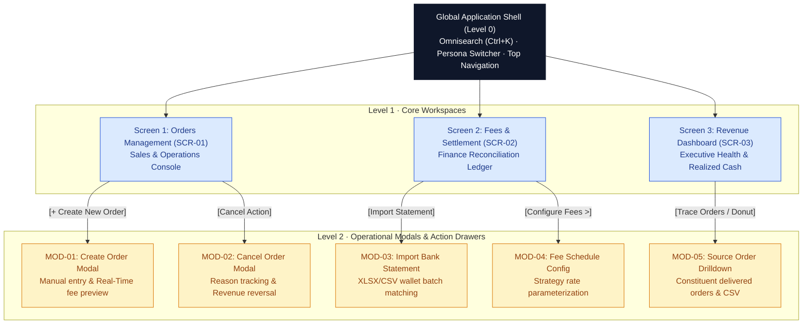
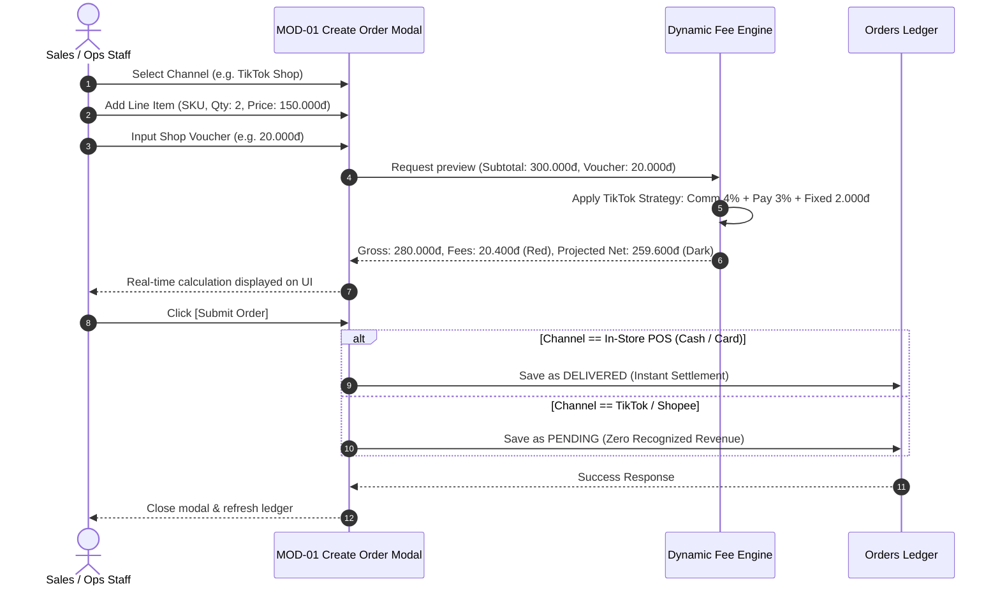
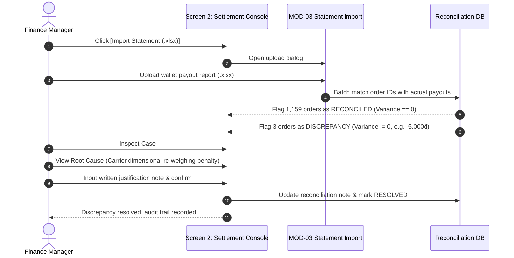

# UI/UX Specifications & Enterprise Design System

**FASHION-WEB — Multi-Channel Revenue & Settlement Management Platform**

*High-Density B2B SaaS Architecture · Salesforce Lightning & FlowX Tokens · Corporate Financial Rigor*

---

## Table of Contents

- [1. Design Philosophy & Numerical Typography Rules](#1-design-philosophy--numerical-typography-rules)
  - [1.1. Enterprise B2B SaaS Console Style](#11-enterprise-b2b-saas-console-style)
  - [1.2. Strict Financial Numerical Typography Rule](#12-strict-financial-numerical-typography-rule)
  - [1.3. Standalone Interactive Code Artifact](#13-standalone-interactive-code-artifact)
- [2. Design System Tokens](#2-design-system-tokens)
  - [2.1. Curated Enterprise Color Palette](#21-curated-enterprise-color-palette)
  - [2.2. Semantic Status & Tint Tokens](#22-semantic-status--tint-tokens)
  - [2.3. Typography Scale & Corner Radius](#23-typography-scale--corner-radius)
- [3. Screen Hierarchy & Interaction Architecture](#3-screen-hierarchy--interaction-architecture)
  - [3.1. Navigation & Modal Trigger Architecture](#31-navigation--modal-trigger-architecture)
  - [3.2. Role-Based Screen & Action Visibility (RBAC)](#32-role-based-screen--action-visibility-rbac)
- [4. Screen Layout Specifications](#4-screen-layout-specifications)
  - [4.1. Global Shell (Level 0)](#41-global-shell-level-0)
  - [4.2. Screen 1: Multi-Channel Orders Management (SCR-01)](#42-screen-1-multi-channel-orders-management-scr-01)
  - [4.3. Screen 2: Marketplace Fees & Wallet Settlement (SCR-02)](#43-screen-2-marketplace-fees--wallet-settlement-scr-02)
  - [4.4. Screen 3: Revenue Dashboard & Executive Reporting (SCR-03)](#44-screen-3-revenue-dashboard--executive-reporting-scr-03)
- [5. Modal Window Specifications (Modals & Action Drawers)](#5-modal-window-specifications-modals--action-drawers)
  - [5.1. MOD-01: Create Order Modal (Manual & Multi-Channel)](#51-mod-01-create-order-modal-manual--multi-channel)
  - [5.2. MOD-02: Order Cancellation Confirmation Modal](#52-mod-02-order-cancellation-confirmation-modal)
  - [5.3. MOD-03: Bank Statement Import Modal](#53-mod-03-bank-statement-import-modal)
  - [5.4. MOD-04: Fee Schedule Configuration Modal](#54-mod-04-fee-schedule-configuration-modal)
  - [5.5. MOD-05: Source Order Drilldown Modal](#55-mod-05-source-order-drilldown-modal)
  - [5.6. Multi-Channel Operational Hybrid Ingestion Note](#56-multi-channel-operational-hybrid-ingestion-note)
- [6. Interaction Flows & State Transitions](#6-interaction-flows--state-transitions)
  - [6.1. MOD-01 Real-Time Fee Calculation & Cash Flow Preview](#61-mod-01-real-time-fee-calculation--cash-flow-preview)
  - [6.2. SCR-02 Discrepancy Auditing & Resolution Workflow](#62-scr-02-discrepancy-auditing--resolution-workflow)

---

## 1. Design Philosophy & Numerical Typography Rules

### 1.1. Enterprise B2B SaaS Console Style
* **Inspiration:** Architectured under enterprise console standards inspired by Salesforce Lightning, SAP Fiori, and FlowX. Strictly utilitarian, minimalist, and designed for operational velocity.
* **No Superficial Styling:** Eliminates distracting AI gradients, neon drop-shadows, glow effects, or decorative animations that compromise data scannability.
* **High Information Density:** Employs compact capsule filter pills, flat clean metric cards, and sharp 1px hairline border data tables under the **3-click rule** for fast task completion.

### 1.2. Strict Financial Numerical Typography Rule
Adhering to professional financial accounting principles, numerical colors communicate explicit balance-sheet semantics:

* **Crimson Red (`#c5221f`):** Exclusively applied to costs, liabilities, and deductions borne by the merchant:
  * Platform commission fees, payment gateway fees, and fixed shipping service fees.
  * Shop-funded vouchers and discounts.
  * Carrier dimensional re-weighing penalties and negative reconciliation variances (`-5.000 ₫`).
  * Loss counts and incident flags (`3 orders` discrepancy, cancelled order volume).
* **Uniform Dark Neutral (`#0f172a`):** Applied to ALL standard statistical metrics:
  * Gross sales, net settlement payout, total orders, delivered order volume, in-transit count, average order value (AOV), SKU unit quantities.
  * Decorative green or blue is strictly forbidden for standard numbers, eliminating visual clutter and maintaining corporate audit rigor.

### 1.3. Standalone Interactive Code Artifact
* A fully functional, zero-dependency standalone prototype is authored and accessible directly at [docs/stitch_prototype.html](stitch_prototype.html).
* Ready for immediate embedding and demonstration in production consoles, Figma Stitch, or browser walkthroughs.

---

## 2. Design System Tokens

### 2.1. Curated Enterprise Color Palette

| Token Name | HEX Value | Semantic Usage & Scope |
|---|---|---|
| `--color-canvas-bg` | `#f4f5f7` | Soft neutral background creating contrast with elevated white cards |
| `--color-surface` | `#ffffff` | Metric cards, master data tables, modal dialogs, toolbars |
| `--color-border-hairline` | `#e2e8f0` | 1px clean dividing borders separating tables, columns, and metric cards |
| `--color-border-subtle` | `#cbd5e1` | Input field outlines, table row dividers, inactive pill borders |
| `--color-text-primary` | `#0f172a` | Headers, table values, and ALL standard financial numerical metrics |
| `--color-text-muted` | `#475569` | Column headers, field labels, metadata descriptions, timestamps |
| `--color-text-subtle` | `#64748b` | Watermarks, disabled icons, placeholder text |
| `--color-brand-primary` | `#0052cc` | Primary call-to-action buttons (`[+ Create New Order]`), active tabs, links |
| `--color-status-success` | `#107c41` | Completed states: `DELIVERED` badge, `100% Reconciled` settlement badge |
| `--color-status-warning` | `#b06000` | In-progress states: `PENDING` badge, `Pending Settlement` badge |
| `--color-status-danger` | `#c5221f` | Platform fees, shop vouchers, negative variances, `CANCELLED` badge |

### 2.2. Semantic Status & Tint Tokens

| State / Category | Foreground Token | Tint Background Token | Applied Component |
|---|---|---|---|
| **Delivered / Reconciled** | `#107c41` | `#e6f4ea` | Status badge, success toast, matched indicator |
| **Pending / In-Transit** | `#b06000` | `#fef7e0` | Status badge, warning banner, awaiting fulfillment |
| **Deduction / Discrepancy** | `#c5221f` | `#fce8e6` | Fee column, variance pill, cancellation badge |
| **Brand Active Selection** | `#0052cc` | `#deebff` | Selected tab, focused capsule filter pill |

### 2.3. Typography Scale & Corner Radius

* **Typeface Family:** `Inter`, `-apple-system`, `BlinkMacSystemFont`, `Segoe UI`, `Roboto`, sans-serif.
* **Numerical Font Feature:** `font-feature-settings: "tnum" 1, "cv05" 1;` (Tabular figures for strict vertical column alignment).

| Element | Font Size | Line Height | Weight | Letter Spacing |
|---|---|---|---|---|
| **Screen Main Title** | `22px` (1.375rem) | `28px` | Bold 700 | `-0.015em` |
| **Section & Card Title** | `13px - 14px` | `18px` | SemiBold 600 | `0` |
| **Large KPI Metrics** | `24px` (1.5rem) | `30px` | Bold 700 | `-0.02em` |
| **Data Tables & Forms** | `12px` (0.75rem) | `16px` | Regular 400 / Medium 500 | `0` |
| **Badges & Table Headers** | `11px` (0.6875rem) | `14px` | SemiBold 600 | `+0.04em` (Uppercase) |

* **Corner Radius Geometry:**
  * Interactive Controls (`Button`, `Input`, `Select`): `4px`
  * Structural Surfaces (`Card`, `Modal Container`, `Table Wrapper`): `6px`
  * Capsule Filter Pills & Status Badges: `9999px` (Full Pill)

---

## 3. Screen Hierarchy & Interaction Architecture

### 3.1. Navigation & Modal Trigger Architecture

A 5-tier interaction architecture structured under the **3-click rule** ensuring any operational ledger or modal can be reached within 3 interactions:

### 3.2. Role-Based Screen & Action Visibility (RBAC)

| UI Component / Action | Sales & Operations Staff | Finance Manager | Shop Owner / Executive |
|---|:---:|:---:|:---:|
| **Screen 1: Orders (SCR-01)** | Full Operational Access | Read-Only | Full Access |
| **`[+ Create New Order]` (MOD-01)** | Allowed | Hidden | Allowed |
| **Inline Status Transitions (`[Ship]`, `[Delivered]`)** | Allowed | Hidden | Allowed |
| **Cancel Order (`[Cancel]` - MOD-02)** | Allowed | Hidden | Requires Approval |
| **Screen 2: Settlement (SCR-02)** | Hidden (No Access) | Full Operational Access | Full Access |
| **`[Import Statement]` (MOD-03)** | Hidden | Allowed | Allowed |
| **Confirm Settlement & Discrepancy Audit Note** | Hidden | Allowed | Approval Required |
| **`[Configure Fees >]` (MOD-04)** | Hidden | Read-Only | Full Edit Access |
| **Screen 3: Revenue Dashboard (SCR-03)** | Hidden (No Access) | Full Access | Full Access |
| **`[Export Reconciliation CSV]` (MOD-05)** | Hidden | Allowed | Allowed |

---

## 4. Screen Layout Specifications

### 4.1. Global Shell (Level 0)
* **Top Header Bar (48px Height):**
  * Brand badge `FSW` in primary brand blue (`#0052cc`).
  * Omnisearch input box (`Ctrl+K` shortcut) supporting instant lookup by `order_id`, `sku_code`, or customer name.
  * Persona Switcher (`Sales/Ops` | `Finance` | `Shop Owner`) allowing instant UI role switching with staff avatar.
* **Horizontal Navigation Bar (40px Height):**
  * 3 primary tabs: `Orders Management (SCR-01)`, `Fees & Settlement (SCR-02)`, `Revenue Dashboard (SCR-03)`.
  * Real-time multi-channel connectivity indicators (`TikTok API: Online`, `Shopee API: Online`, `POS Sync: Active`).
* **Slim Sidebar Rail (54px Width):**
  * Quick-access vertical icon shortcuts for Orders, Settlement, Reports, and Settings.

---

### 4.2. Screen 1: Multi-Channel Orders Management (SCR-01)

Designed for Sales and Fulfillment teams to track multi-channel order streams across TikTok Shop, Shopee, and In-Store POS:

* **Top Action Bar:**
  * Primary Action: **`[+ Create New Order]`** (Brand Blue `#0052cc`, prominent button): Triggers modal MOD-01 for manual order entry during livestreams, hotlines, in-store POS, or before API integrations.
  * View Switchers: `[Customer Switch]`, `[Kanban View]`, `[Dashboard View]`, and `[Refresh]`.
* **Capsule Filter Bar:**
  * Channel Filter: `[All Channels]`, `[TikTok Shop]`, `[Shopee]`, `[In-Store POS]`.
  * Order Status: `[All Statuses]`, `[Pending]`, `[Shipped]`, `[Delivered]`, `[Cancelled]`.
  * Date range selector: `[Today]`, `[Last 7 Days]`, `[This Month]`.
* **5 Operational Metric Cards:**
  1. **Total Orders:** `1,248` (Uniform Dark `#0f172a`).
  2. **Delivered Orders:** `1,180` (Uniform Dark `#0f172a` — official recognized revenue volume).
  3. **Gross Revenue:** `184.5M ₫` (Uniform Dark `#0f172a`).
  4. **In Transit:** `42` (Uniform Dark `#0f172a` — awaiting customer delivery).
  5. **Cancelled Orders:** `26` (Crimson Red `#c5221f` — 100% excluded from revenue).
* **Operational Rhythm Strip:**
  * 6 real-time progress indicators: Awaiting Prep (14), Courier Transit (42), Delivered (1,180), Completion Rate (94.5%), AOV (156k ₫), Cancellation Rate (2.1% with overdue order alert).
* **Charts & Priority Order Cards:**
  * *Left Column:* Vertical Bar Chart showing order distribution by channel (TikTok 560 orders - 45%, Shopee 480 orders - 38%, POS 208 orders - 17%).
  * *Right Column:* Highest-value order watchlist requiring fulfillment attention (Largest Orders).
* **Master Orders Data Table:**
  * Columns: `Order ID`, `Channel Badge`, `External ID`, `Timestamp`, `Customer`, `SKU Line Items`, `Customer Payment`, `Order Status`, `Inline Quick Actions`.
  * Inline Action Buttons:
    * `[Ship]`: Transitions `PENDING` $\rightarrow$ `SHIPPED` (Revenue flagged as *In-Transit*).
    * `[Delivered]`: Transitions `SHIPPED` $\rightarrow$ `DELIVERED` (Officially credits revenue and permanently locks ledger row).
    * `[Cancel]`: Opens modal MOD-02 to record reason and reverse revenue.

---

### 4.3. Screen 2: Marketplace Fees & Wallet Settlement (SCR-02)

Designed for Finance teams to audit platform deductions and execute bank statement reconciliation:

* **Settlement Filters:** Filter by Reconciliation Status (`Pending Settlement`, `100% Reconciled`, `Discrepancy`), Settlement Period, and Channel.
* **3 Settlement Summary Cards:**
  1. **Pending Settlement:** `18 orders` (Warning Amber `#b06000` / Dark `#0f172a`).
  2. **100% Reconciled:** `1,159 orders` (Success Green `#107c41`).
  3. **Discrepancy Orders:** `3 orders` (Crimson Red `#c5221f` — Requires written audit explanation).
* **Automated Fee Schedule Strip:** Displays automated fee formulas applied by Strategy Pattern (TikTok 4% Comm + 3% Pay + 2,000đ; Shopee 4.5% Comm + 4% Pay + 2% Freeship; POS 1% Card/QR).
* **Granular Fee Deduction Ledger Table:**
  * `Order ID`, `Channel Badge`, `Paid Amount`.
  * **Merchant-Borne Costs (Crimson Red `#c5221f`):** Commission Fee, Payment Processing Fee, Service/Freeship Fee, Total Platform Fees.
  * **Realized Cash Flow (Uniform Dark `#0f172a`):** Projected Net Settlement, Actual Net Received.
  * **Variance:** Highlighted in Crimson Red if discrepancies/penalties occur (e.g., `-5.000 ₫`).
  * **Reconciliation Status:** Badges for `100% Matched` (Green), `Discrepancy` (Red), `Pending Arrival` (Amber).
* **Discrepancy Resolution Audit Panel:** Displays the latest audit resolution case (#DIS-002) with root-cause explanations from carrier/platform re-weighing penalties for financial transparency.

---

### 4.4. Screen 3: Revenue Dashboard & Executive Reporting (SCR-03)

Designed for Shop Owners and Executives to evaluate financial health and net realized cash flow:

* **4 Executive KPI Cards:**
  1. **Total Gross Sales:** `184.500.000 ₫` (strictly calculated on 1,180 DELIVERED orders).
  2. **Total Platform Fees Deducted:** `28.620.000 ₫` (Crimson Red `#c5221f` — representing a 15.5% platform erosion rate).
  3. **Net Cash Realized:** `155.880.000 ₫` (Uniform Dark `#0f172a` — net take-home cash after all fee subtractions).
  4. **Delivered Volume:** `1,180 orders` (Uniform Dark `#0f172a` — 94.5% fulfillment delivery rate).
* **Financial Integrity Banner:** Explicit accounting reminder: *Only DELIVERED orders are recognized in revenue; PENDING, SHIPPED, and CANCELLED orders are 100% excluded to prevent phantom revenue recognition.*
* **Grouped Bar Chart (7-Day Cash Flow Trend):** Daily side-by-side comparison of Gross Revenue (Blue Bar) vs. Net Realized Cash (Green Bar) to track platform deduction volatility over time.
* **Two-Column Analytics Panel:**
  * *Left Column:* Donut Chart showing revenue contribution by channel (TikTok 48.0%, Shopee 37.0%, POS 15.0%) with total revenue `184.5M ₫` at the center. Clickable slices open Drilldown Modal MOD-05.
  * *Right Column:* Leaderboard ranking Top 5 Best-Selling SKUs by volume and gross revenue.

---

## 5. Modal Window Specifications (Modals & Action Drawers)

### 5.1. MOD-01: Create Order Modal (Manual & Multi-Channel)
* **Trigger:** Primary button `[+ Create New Order]` on SCR-01.
* **Primary Persona:** `Sales & Operations Staff` / `Shop Owner`.
* **Operational Purpose:** Enables staff to manually record orders taken via livestreams, hotlines, direct messages, in-store POS, or before marketplace API integrations are activated.
* **Form Fields:**
  * Sales Channel (`TikTok Shop`, `Shopee`, `In-Store POS`) & External Order ID (`ext_order_id`).
  * Customer Name & Payment Method (`Cash`, `Card/QR`, `Marketplace Wallet`).
  * Product Line Items (Multi-line row repeater): SKU Code, Product Title, Quantity, Unit Price.
  * Shop Voucher Discount (`shop_voucher`).
* **Real-Time Cash Flow & Fee Preview:**
  * Automatically calculates: $\text{Subtotal} \rightarrow \text{Less Shop Voucher (Red)} \rightarrow \text{Gross Payment (Dark)} \rightarrow \text{Itemized Platform Fees (Red)} \rightarrow \text{Projected Net Settlement (Dark)}$.
  * **POS Rule:** POS orders with cash/card payment automatically transition to `DELIVERED` upon saving; marketplace orders enter `PENDING` awaiting fulfillment.

---

### 5.2. MOD-02: Order Cancellation Confirmation Modal
* **Trigger:** Inline quick-action button `[Cancel]` on any order row in SCR-01.
* **Primary Persona:** `Sales & Operations Staff` / `Shop Owner`.
* **Purpose:** Controls cancellations and prevents false revenue recognition.
* **Content & Validation:**
  * Displays order financial summary.
  * Requires selecting a mandatory cancellation reason: `Customer Unreachable`, `Wrong Address`, `Out of Stock`, `Customer Request`.
  * Requires entering an explanation note before confirmation.
  * Enforces immediate 100% exclusion from recognized revenue and KPI cards.

---

### 5.3. MOD-03: Bank Statement Import Modal
* **Trigger:** Action button `[Import Statement (.xlsx)]` on SCR-02.
* **Primary Persona:** `Finance Manager`.
* **Purpose:** Uploads bank transaction statement files or TikTok/Shopee wallet payout reports (.xlsx, .csv) for automated matching and variance identification.
* **Automated Logic:**
  * Parses external order IDs and transaction amounts.
  * Matches against internal `projected_net_settlement`.
  * If matched: Flags order as `RECONCILED`.
  * If mismatch: Flags order as `DISCREPANCY` and prompts for root-cause note.

---

### 5.4. MOD-04: Fee Schedule Configuration Modal
* **Trigger:** Button `[Configure Fees >]` on SCR-02.
* **Primary Persona:** `Shop Owner` / `Finance Manager` (Read-Only).
* **Purpose:** Dynamically updates platform commission rates, payment fees, fixed fees, and Freeship Xtra charges across channels (Strategy Pattern).
* **Audit Trail:** Logs timestamp, user ID, and previous vs. new rate parameters.

---

### 5.5. MOD-05: Source Order Drilldown Modal
* **Trigger:** Button `[Trace Source Orders]` or clicking channel slices on the SCR-03 Donut Chart.
* **Primary Persona:** `Shop Owner` / `Finance Manager`.
* **Purpose:** Auditing tool displaying granular itemized DELIVERED orders contributing to revenue KPIs (Gross, Platform Fees, Net Payout) with CSV export capability.

---

### 5.6. Multi-Channel Operational Hybrid Ingestion Note
The architecture supports a **hybrid workflow**:
* **Automated Ingestion:** Asynchronous ingestion via webhook connectors for high-volume Shopee and TikTok Shop channels.
* **Mandatory Manual Order Creation (MOD-01):** Flexibly handles unintegrated channels, livestreams, hotline phone orders, and walk-in counter sales without depending on complex TikTok/Shopee developer app approvals.

---

## 6. Interaction Flows & State Transitions

### 6.1. MOD-01 Real-Time Fee Calculation & Cash Flow Preview

---

### 6.2. SCR-02 Discrepancy Auditing & Resolution Workflow

---

## 7. Accessibility (a11y) & Usability Standards

* **Contrast Ratios:** All text tokens adhere to WCAG 2.1 Level AA contrast requirements:
  * Primary text (`#0f172a`) on canvas (`#ffffff`): `15.8:1` (Exceeds `4.5:1` minimum).
  * Crimson Red (`#c5221f`) on surface (`#ffffff`): `5.9:1` (Passes AA).
* **Keyboard Navigation:**
  * `Ctrl + K`: Global Omnisearch focus.
  * `Esc`: Dismiss any open modal drawer (`MOD-01` through `MOD-05`).
  * `Tab` / `Shift + Tab`: Logical tab index traversal across input fields and action buttons.
* **Financial Data Precision:** All currency amounts format with thousands separators (e.g., `184.500.000 ₫`), right-aligned in table columns to guarantee rapid visual comparison.
