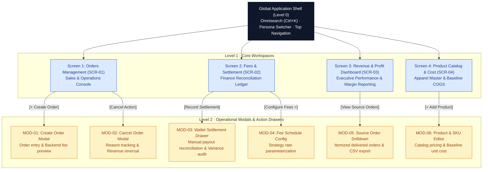

# UI/UX Specifications: Fashion Revenue & Profit Management System

---

## 1. Document Overview & Scope

### 1.1. Purpose
This document establishes the authoritative User Interface (UI) and User Experience (UX) specification for the **Fashion Revenue & Profit Management System**. It specifies layout hierarchies, design tokens, interaction flows, and strict financial accounting copy across multi-channel retail operations (TikTok Shop, Shopee, and In-Store POS).

### 1.2. Engineering Principles
* **State of the Art Visual Excellence:** Sleek, high-density dashboard layouts adhering to WCAG 2.1 Level AA compliance.
* **Deterministic Financial Copy:** Zero tolerance for ambiguous financial terminology. All metrics, deductions, and settlement figures must strictly mirror the Canonical Dictionary defined in Section 2.
* **Responsive Breakpoints:** Optimized for desktop operations (`1440px` baseline) down to tablet viewports (`1024px`). Mobile viewports are restricted to read-only operational summaries.

---

## 2. Approved UI Terminology (Canonical Dictionary)

To ensure strict conceptual consistency across all screens, modals, and notifications, only terms from this canonical dictionary may be utilized in user interfaces:

### 2.1. Navigation & Page Titles
- **Primary Workspace Tabs:**
  - `Orders` *(or `Orders Management`)*
  - `Fees & Settlement` *(Discrepancies are reviewed within this workspace)*
  - `Revenue & Profit Dashboard`
  - `Product Catalog & Cost`
- **Canonical Page Titles:**
  - SCR-01: **Orders Management**
  - SCR-02: **Fees & Settlement**
  - SCR-03: **Revenue & Profit Dashboard**
  - SCR-04: **Product Catalog & Cost Management**

### 2.2. Financial & Accounting Terminology
To prevent confusing operational staff and auditors, financial metrics must use fixed, distinct terminology. **Never mix or interchange Net Profit, Net Income, Net Cash, or Net Revenue.**

| Canonical UI Term | Strict Operational Definition | Prohibited Synonyms (Do NOT Use) |
|---|---|---|
| **Gross Revenue** | Total customer payment before any fee deductions on delivered orders (`Subtotal - Shop Voucher`). | Gross Sales, Turnover, Total Sales |
| **Platform Commission** | Percentage fee retained by marketplace platform for hosting the sale. | Marketplace Cut, Platform Tax |
| **Payment Fee** | Transaction processing fee charged for payment gateway / card processing. | Card Fee, Gateway Charge |
| **Service Fee** | Supplementary platform fees (e.g., Freeship Xtra, campaign package). | Shipping Fee, Voucher Fee |
| **Shop Voucher** | Merchant-funded discount coupon absorbed entirely by the shop. | Seller Discount, Promo Code |
| **Total Platform Fees** | Aggregate sum of commission, payment, service, and fixed fees. | Total Deductions, Platform Toll |
| **Projected Settlement** | Expected net payout calculated upon order delivery before bank payout. | Estimated Payout, Expected Cash |
| **Actual Settlement** | Actual cash amount disbursed to platform wallet / merchant bank account. | Realized Cash, Wallet Inflow |
| **Settlement Variance** | Discrepancy between Projected Settlement and Actual Settlement (`Projected - Actual`). | Fee Gap, Loss Amount, Mismatch |
| **Net Realized Revenue** | Official recognized net revenue realized after subtracting all verified channel fees (`Gross Revenue - Total Platform Fees`). | Net Profit, Net Income, True Cash |
| **COGS** | Cost of Goods Sold — direct baseline merchandise cost associated with delivered order items (`Σ(Quantity × Unit Cost Snapshot)`). | Inventory Valuation, Warehouse Cost |
| **Contribution Profit** | Order or channel commercial profit realized after platform fees and COGS (`Projected Settlement - COGS`). | Net Profit, Net Income, Operating Profit |
| **Contribution Margin** | Percentage ratio of Contribution Profit to Gross Revenue (`(Contribution Profit / Gross Revenue) × 100`). | Profit Margin, Net Margin |

> [!NOTE]
> **Canonical Profit Definition:**
> **Contribution Profit** represents order/channel profitability after deducting marketplace fees and direct merchandise COGS, but before corporate operating expenses (rent, staff salaries, marketing OPEX) and corporate taxes. It is strictly distinct from accounting Net Profit.

### 2.3. Lifecycle & Operational Statuses
- **Order Lifecycle Statuses:**
  - `Pending`: Order created, awaiting fulfillment and carrier dispatch.
  - `Shipped`: Package handed over to courier; revenue tagged as *In-Transit*.
  - `Delivered`: Customer received parcel; **revenue, COGS, and Contribution Profit are officially recognized**.
  - `Cancelled`: Order aborted prior to delivery; 100% excluded from recognized revenue and profit.
- **Reconciliation Statuses:**
  - `Pending Settlement`: Order delivered, awaiting platform wallet disbursement statement.
  - `Reconciled`: Actual settlement deposit matches projected settlement amount (`Variance = 0 ₫`).
  - `Discrepancy`: Payout shortfall detected (`Variance != 0 ₫`), requiring operational review note.

### 2.4. Action Labels & Interactive Controls
- **Primary Operational Actions:**
  - `Create Order` *(Trigger modal MOD-01)*
  - `Ship Order` *(Advance status to Shipped)*
  - `Mark as Delivered` *(Advance status to Delivered & freeze fee/cost snapshot)*
  - `Cancel Order` *(Open cancellation modal MOD-02)*
  - `Record Settlement` *(Open wallet payout recording modal MOD-03)*
  - `Configure Fees` *(Open fee schedule configuration modal MOD-04)*
  - `View Source Orders` *(Trigger order drilldown modal MOD-05)*
  - `Add Product` *(Open product & SKU editor modal MOD-06)*
  - `Export CSV` *(Download financial ledger or reconciliation file)*
- **Standard Dialog Buttons:**
  - `Confirm`, `Cancel`, `Save`, `Close`, `Apply`, `Reset`

---

## 3. Visual Identity & Brand Design Tokens

### 3.1. Color System (Dark Slate Precision Theme)
The application employs a curated corporate palette optimized for dense financial and audit data:

* **Canvas & Surface Backgrounds:**
  * Application Canvas (`bg-canvas`): `#f8fafc` (Slate 50)
  * Elevated Card Surface (`bg-surface`): `#ffffff` (Pure White)
  * Inactive / Muted Surface (`bg-muted`): `#f1f5f9` (Slate 100)
  * Dark Topbar Background (`bg-header`): `#0f172a` (Slate 900)
* **Border & Separator Tokens:**
  * Subtle Structural Border (`border-subtle`): `#e2e8f0` (Slate 200)
  * Table Header Border (`border-table`): `#cbd5e1` (Slate 300)
  * Active Input Focus Ring (`border-focus`): `#0052cc` (Brand Blue)
* **Text & Typography Hierarchy:**
  * Headline / Metric Values (`text-primary`): `#0f172a` (Slate 900)
  * Secondary Descriptive Copy (`text-secondary`): `#475569` (Slate 600)
  * Muted Metadata / SKU Subtext (`text-muted`): `#64748b` (Slate 500)
* **Functional Semantic Accents:**
  * Primary Action / Brand (`action-primary`): `#0052cc` (Atlassian Blue)
  * Positive Match / Cash Received (`semantic-success`): `#107c41` (MS Excel Emerald)
  * Fee Deductions / Discrepancy Shortfall (`semantic-danger`): `#c5221f` (Crimson Red)
  * In-Transit / Pending State (`semantic-warning`): `#b06000` (Amber 700)

### 3.2. Uniformity Rule for Badges & Numeric Tables
To avoid chaotic rainbow interfaces, channel tags and status chips follow uniform layout styling:

| UI Component | Container Background | Border | Text Color | State Indicator |
|---|---|---|---|---|
| **Channel Tag** | `#f8fafc` | `1px solid #e2e8f0` | `#334155` (600) | Identical for TikTok, Shopee, POS |
| **Status Badge** | `#ffffff` | `1px solid #e2e8f0` | `#334155` (600) | 5px semantic dot (`Delivered`: Green, `Shipped`: Blue, `Pending`: Amber, `Cancelled`: Red) |
| **Row Action Button** | `#ffffff` | `1px solid #d0d7de` | `#24292f` (600) | Subtle hover: `#f6f8fa`, border `#0969da` |
| **Numeric Values (Gross/Payout)** | Transparent | None | `#0f172a` (700) | Tabular figures (`tnum`), comma grouping |
| **Deductions / Fees / Variances** | Transparent | None | `#c5221f` (600) | Tabular figures (`tnum`), minus sign `−` |
| **COGS / Profit Metrics** | Transparent | None | `#0f172a` (700) | Tabular figures (`tnum`), comma grouping |

### 3.3. Typography Scale & Corner Radius
* **Typeface Family:** `Inter`, `-apple-system`, `BlinkMacSystemFont`, `Segoe UI`, `Roboto`, sans-serif.
* **Numerical Font Feature:** `font-feature-settings: "tnum" 1, "cv05" 1;` (Tabular figures for strict vertical alignment).

| Element | Font Size | Line Height | Weight | Letter Spacing |
|---|---|---|---|---|
| **Screen Main Title** | `22px` (1.375rem) | `28px` | Bold 700 | `-0.015em` |
| **Section & Card Title** | `13px - 14px` | `18px` | SemiBold 600 | `0` |
| **Large KPI Metrics** | `24px` (1.5rem) | `30px` | Bold 700 | `-0.02em` |
| **Data Tables & Forms** | `12px` (0.75rem) | `16px` | Regular 400 / Medium 500 | `0` |
| **Badges & Table Headers** | `11px` (0.6875rem) | `14px` | SemiBold 600 | `+0.04em` (Uppercase) |

---

## 4. Screen Hierarchy & Interaction Architecture

### 4.1. Navigation & Modal Trigger Architecture

### 4.2. Role-Based Screen & Action Visibility (RBAC)

| UI Component / Action | Sales & Operations Staff | Finance Manager | Shop Owner / Executive |
|---|:---:|:---:|:---:|
| **Screen 1: Orders Management (SCR-01)** | Full Operational Access | Read-Only | Full Access |
| **`[+ Create Order]` (MOD-01)** | Allowed (Cost Hidden) | Hidden | Allowed |
| **Inline Status Transitions (`[Ship]`, `[Delivered]`)** | Allowed | Hidden | Allowed |
| **Cancel Order (`[Cancel]` - MOD-02)** | Allowed | Hidden | Allowed |
| **Screen 2: Fees & Settlement (SCR-02)** | Hidden (No Access) | Full Operational Access | Full Access |
| **`[Record Settlement]` (MOD-03)** | Hidden | Allowed | Allowed/Review |
| **Confirm Settlement & Discrepancy Note** | Hidden | Allowed | Full Review Access |
| **`[Configure Fees >]` (MOD-04)** | Hidden | Read-Only | Full Edit Access |
| **Screen 3: Revenue & Profit Dashboard (SCR-03)** | Hidden (No Access) | Full Access | Full Access |
| **`[Export CSV]` (Drilldown / Ledger)** | Hidden | Allowed | Allowed |
| **Screen 4: Product Catalog & Cost (SCR-04)** | Hidden (No Access) | Full Access | Full Access |
| **`[+ Add / Edit Product]` (MOD-06)** | Hidden | Allowed | Allowed |
| **View Baseline Unit Cost (`cost_price`)** | **Hidden (No Access)** | Full Access | Full Access |

---

## 5. Screen Layout Specifications

### 5.1. Global Shell (Level 0)
* **Top Header Bar (48px Height):**
  * Brand badge `FSW` in primary brand blue (`#0052cc`).
  * Omnisearch input box (`Ctrl+K` shortcut) supporting lookup by `Order ID`, `SKU`, or `Customer Name`.
  * Operational Mode Tag: `Workflow: Manual Entry & Assisted Audit`.
  * Persona Switcher (`Sales/Ops` | `Finance` | `Shop Owner`) allowing instant role-based view simulation with avatar.
* **Horizontal Navigation Bar (40px Height):**
  * 4 primary tabs: `Orders Management (SCR-01)`, `Fees & Settlement (SCR-02)`, `Revenue & Profit Dashboard (SCR-03)`, `Product Catalog & Cost (SCR-04)`.

---

### 5.2. Screen 1: Orders Management (SCR-01)
* **Top Action Bar:**
  * Primary Action: **`[+ Create Order]`** (Brand Blue `#0052cc`): Triggers modal MOD-01 for multi-channel order entry.
  * View Controls: `[Refresh]` button and view filter toggles.
* **Capsule Filter Bar:**
  * Sales Channel: `[All Channels]`, `[TikTok Shop]`, `[Shopee]`, `[In-Store POS]`.
  * Order Status: `[All Statuses]`, `[Pending]`, `[Shipped]`, `[Delivered]`, `[Cancelled]`.
  * Timeframe: `[Today]`, `[Last 7 Days]`, `[This Month]`.
* **5 Operational Metric Cards:**
  1. **Total Orders:** `1,248` (Uniform Dark `#0f172a`).
  2. **Delivered Orders:** `1,180` (Uniform Dark `#0f172a` — officially recognized revenue & profit).
  3. **Gross Revenue:** `184,500,000 ₫` (Uniform Dark `#0f172a`).
  4. **In Transit:** `42` (Uniform Dark `#0f172a` — packages with courier).
  5. **Cancelled Orders:** `26` (Crimson Red `#c5221f` — 100% excluded from revenue).
* **Master Orders Data Table:**
  * Columns: `Order ID`, `Channel`, `External ID`, `Order Date`, `Customer`, `SKU Line Items`, `Gross Revenue`, `Status`, `Actions`.
  * Inline Action Buttons:
    * `[Ship]`: Advances `Pending` $\rightarrow$ `Shipped`.
    * `[Delivered]`: Advances `Shipped` $\rightarrow$ `Delivered` (Requests frozen fee/cost snapshot from backend and locks record).
    * `[Cancel]`: Opens modal MOD-02 to capture cancellation reason.

---

### 5.3. Screen 2: Fees & Settlement (SCR-02)
* **Settlement Filter Bar:** Filter by Reconciliation Status (`Pending Settlement`, `Reconciled`, `Discrepancy`), Settlement Period, and Channel.
* **3 Settlement Summary Cards:**
  1. **Pending Settlement:** `18 orders` (Warning Amber `#b06000`).
  2. **Reconciled:** `1,159 orders` (Success Green `#107c41`).
  3. **Discrepancy:** `3 orders` (Crimson Red `#c5221f` — Requires operational review).
* **Applied Fee Schedule Strip:** Displays active channel fee rules (TikTok: 4% Comm + 3% Pay + 3,000 ₫; Shopee: 4.5% Comm + 4% Pay + 2% Service; POS: 0 ₫ Cash / 1% Card & QR).
* **Granular Fee Deduction Ledger Table:**
  * Columns: `Order ID`, `Channel`, `Gross Revenue`, `Commission Fee`, `Payment Fee`, `Service Fee`, `Total Platform Fees`, `Projected Settlement`, `Actual Settlement`, `Variance`, `Status`, `Action`.
  * Deduction columns rendered in Crimson Red (`#c5221f`).
  * Variance column highlights shortfalls in Crimson Red (e.g., `-20,000 ₫`).
  * Reconciliation Badges: `Reconciled` (Green), `Discrepancy` (Red), `Pending Settlement` (Amber).

---

### 5.4. Screen 3: Revenue & Profit Dashboard (SCR-03)
* **5 Core Financial KPI Cards:**
  1. **Gross Revenue:** `184,500,000 ₫` (Calculated strictly on Delivered orders).
  2. **Total Platform Fees:** `28,620,000 ₫` (Crimson Red `#c5221f` — 15.5% channel fee erosion).
  3. **Net Realized Revenue:** `155,880,000 ₫` (Projected settlement recognized).
  4. **Total COGS:** `92,400,000 ₫` (Direct merchandise cost based on unit cost snapshots).
  5. **Contribution Profit:** `63,480,000 ₫` (Emerald Green `#107c41` / Dark `#0f172a`; Margin: `34.4%`).
* **Secondary Operational Badge:** `1,180 Delivered Orders` (94.5% fulfillment rate).
* **Financial Integrity Banner:** *Revenue, COGS, and Contribution Profit are recognized exclusively upon confirmed Delivery. Pending, Shipped, and Cancelled orders are strictly excluded.*
* **Cash Flow & Profit Trend Chart:** Grouped bar/line chart comparing Gross Revenue vs. Net Realized Revenue vs. Contribution Profit per day.
* **Analytics Breakdown Panel:**
  * *Channel Share Donut Chart:* Revenue and profit contribution by channel (TikTok 48.0%, Shopee 37.0%, In-Store POS 15.0%). Clickable slices open MOD-05.
  * *Top SKU Leaderboard:* Table ranking Top 5 Best-Selling SKUs:
    * Columns: `Rank`, `SKU Code`, `Product Name`, `Units Sold`, `Gross Revenue`, `Total COGS`, `Contribution Profit`, `Margin %`.

---

### 5.5. Screen 4: Product Catalog & Cost Management (SCR-04)
* **Toolbar & Action Bar:**
  * Primary Action: **`[+ Add Product]`**: Triggers modal MOD-06 for product and SKU creation.
  * Filter & Search: Search input for Product Name or SKU code, Active status filter.
* **SKU Master Data Table:**
  * Columns: `Product Name`, `SKU Code`, `Color`, `Size`, `Retail Price`, `Baseline Unit Cost`, `Status`, `Actions`.
  * Security Rule: `Baseline Unit Cost` is visible exclusively to `Shop Owner` and `Finance Manager`. For unauthorized roles, this column is omitted.
  * Inline Action: `[Edit]` button opening MOD-06 in edit mode.

---

## 6. Modal Window Specifications

### 6.1. MOD-01: Create Order Modal
* **Trigger:** Button `[+ Create Order]` on SCR-01.
* **Primary Persona:** `Sales & Operations Staff` / `Shop Owner`.
* **Form Inputs:**
  * Sales Channel (`TikTok Shop`, `Shopee`, `In-Store POS`) and External Order ID.
  * Customer Name, Phone, and Payment Method (`Cash`, `Card / QR`, `Marketplace Wallet`).
  * Line Item Repeater using **ProductSelector**: SKU dropdown auto-populates product name and retail price. (Baseline unit cost is frozen by the backend and never exposed to sales staff).
  * Shop Voucher Discount (`VND`).
* **Real-Time Fee Preview:**
  * UI submits form values to backend `POST /api/orders/preview-fee` and displays the returned breakdown: Subtotal $\rightarrow$ Less Voucher $\rightarrow$ Gross Revenue $\rightarrow$ Platform Fees $\rightarrow$ Projected Settlement.

### 6.2. MOD-02: Cancel Order Modal
* **Trigger:** Inline quick-action `[Cancel]` on SCR-01.
* **Validation & Rules:**
  * Mandatory cancellation reason selection: `Customer Unreachable`, `Wrong Address`, `Out of Stock`, `Customer Request`.
  * Detailed explanation note input required.
  * **Guard Clause:** Delivered orders cannot be cancelled.

### 6.3. MOD-03: Wallet Settlement Drawer / Record & Reconcile Settlement
* **Trigger:** Action button `[Record Settlement]` on SCR-02 row.
* **Primary Persona:** `Finance Manager` (Operational) / `Shop Owner` (Review).
* **Purpose:** Manual recording of `Actual Settlement Amount` verified from platform wallet / bank statement.
* **Reconciliation Flow:**
  * Auto-calculates: $\text{Variance} = \text{Projected Settlement} - \text{Actual Settlement}$.
  * If `Variance == 0 ₫`, order is flagged as `Reconciled`.
  * If `Variance != 0 ₫`, enforces mandatory explanation note detailing discrepancy cause (e.g. rate mismatch, unexpected fee) and sets status to `Discrepancy`.
* **Action Buttons:** `[Record Settlement]`, `[Reconcile]`, `[Cancel]`.

### 6.4. MOD-04: Fee Schedule Configuration Modal
* **Trigger:** Button `[Configure Fees >]` on SCR-02.
* **Primary Persona:** `Shop Owner` / `Finance Manager`.
* **Purpose:** Form for configuring commission rates, payment processing fees, percentage service fees (with caps), and fixed charges.

### 6.5. MOD-05: Source Order Drilldown Modal
* **Trigger:** Button `[View Source Orders]` or clicking channel slices on SCR-03 charts.
* **Purpose:** Itemized inspection of delivered orders with full revenue, fee, COGS, and Contribution Profit figures, plus `[Export CSV]`.

### 6.6. MOD-06: Product & SKU Editor Modal
* **Trigger:** Button `[+ Add Product]` or `[Edit]` on SCR-04.
* **Primary Persona:** `Shop Owner` / `Finance Manager`.
* **Form Inputs:** Product Model Name, SKU Code, Color, Size, Retail Selling Price (`numeric`), Baseline Unit Cost (`cost_price`, `numeric`), Active Toggle. (Category is omitted from Target MVP UI to strictly mirror database schema).

---

## 7. Accessibility & Usability Standards

* **Contrast Ratios:** Text tokens adhere strictly to WCAG 2.1 Level AA:
  * Primary text (`#0f172a`) on white (`#ffffff`): `15.8:1`.
  * Crimson Red (`#c5221f`) on white (`#ffffff`): `5.9:1`.
  * Emerald Green (`#107c41`) on white (`#ffffff`): `4.6:1`.
* **Keyboard Navigation:** `Ctrl + K` for Omnisearch; `Esc` for modals; `Tab` for focus.
* **Financial Alignment:** All monetary amounts format with comma grouping (`184,500,000 ₫`) and right-align in tables.
