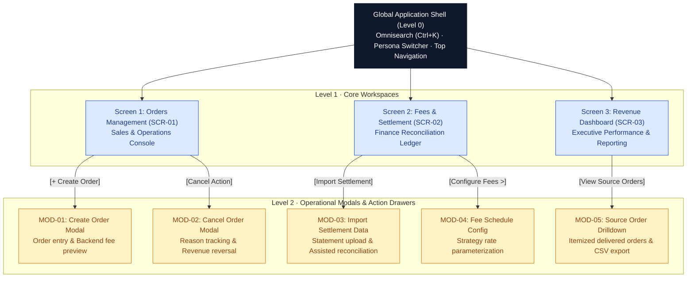
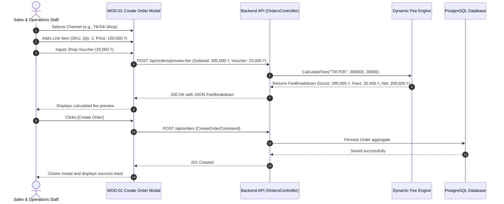
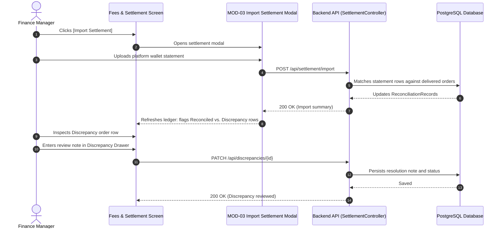

# UI/UX Specifications & Enterprise Design System

**FASHION-WEB — Fashion Revenue & Profit Management System**

*High-Density B2B SaaS Architecture · Salesforce Lightning & FlowX Tokens · Corporate Financial Rigor*

---

## Table of Contents

- [1. UI Language & Localization Policy](#1-ui-language--localization-policy)
  - [1.1. English-Only UI Rule](#11-english-only-ui-rule)
  - [1.2. Business Locale & Formatting Standards](#12-business-locale--formatting-standards)
- [2. Approved UI Terminology (Canonical Dictionary)](#2-approved-ui-terminology-canonical-dictionary)
  - [2.1. Navigation & Page Titles](#21-navigation--page-titles)
  - [2.2. Financial & Accounting Terminology](#22-financial--accounting-terminology)
  - [2.3. Lifecycle & Operational Statuses](#23-lifecycle--operational-statuses)
  - [2.4. Action Labels & Interactive Controls](#24-action-labels--interactive-controls)
  - [2.5. Standard System Copy & Feedback Messages](#25-standard-system-copy--feedback-messages)
- [3. Design Philosophy & Numerical Typography Rules](#3-design-philosophy--numerical-typography-rules)
  - [3.1. Enterprise B2B SaaS Console Style](#31-enterprise-b2b-saas-console-style)
  - [3.2. Strict Financial Numerical Typography Rule](#32-strict-financial-numerical-typography-rule)
- [4. Design System Tokens](#4-design-system-tokens)
  - [4.1. Curated Enterprise Color Palette](#41-curated-enterprise-color-palette)
  - [4.2. Semantic Status & Tint Tokens](#42-semantic-status--tint-tokens)
  - [4.3. Typography Scale & Corner Radius](#43-typography-scale--corner-radius)
- [5. Screen Hierarchy & Interaction Architecture](#5-screen-hierarchy--interaction-architecture)
  - [5.1. Navigation & Modal Trigger Architecture](#51-navigation--modal-trigger-architecture)
  - [5.2. Role-Based Screen & Action Visibility (RBAC)](#52-role-based-screen--action-visibility-rbac)
- [6. Screen Layout Specifications](#6-screen-layout-specifications)
  - [6.1. Global Shell (Level 0)](#61-global-shell-level-0)
  - [6.2. Screen 1: Orders Management (SCR-01)](#62-screen-1-orders-management-scr-01)
  - [6.3. Screen 2: Fees & Settlement (SCR-02)](#63-screen-2-fees--settlement-scr-02)
  - [6.4. Screen 3: Revenue Dashboard (SCR-03)](#64-screen-3-revenue-dashboard-scr-03)
- [7. Modal Window Specifications (Modals & Action Drawers)](#7-modal-window-specifications-modals--action-drawers)
  - [7.1. MOD-01: Create Order Modal](#71-mod-01-create-order-modal)
  - [7.2. MOD-02: Cancel Order Modal](#72-mod-02-cancel-order-modal)
  - [7.3. MOD-03: Import Settlement Data Modal](#73-mod-03-import-settlement-data-modal)
  - [7.4. MOD-04: Fee Schedule Configuration Modal](#74-mod-04-fee-schedule-configuration-modal)
  - [7.5. MOD-05: Source Order Drilldown Modal](#75-mod-05-source-order-drilldown-modal)
  - [7.6. Multi-Channel Operational Workflow Note](#76-multi-channel-operational-workflow-note)
- [8. Interaction Flows & State Transitions](#8-interaction-flows--state-transitions)
  - [8.1. Order Creation & Backend Fee Preview Flow](#81-order-creation--backend-fee-preview-flow)
  - [8.2. Settlement Reconciliation & Discrepancy Flow](#82-settlement-reconciliation--discrepancy-flow)
- [9. Accessibility (a11y) & Usability Standards](#9-accessibility-a11y--usability-standards)

---

## 1. UI Language & Localization Policy

### 1.1. English-Only UI Rule
To establish an enterprise-grade, internationally audited operational standard, **all user-facing interface copy MUST be written exclusively in English**.

- **Scope of Policy:** This rule applies without exception to:
  - Top and sidebar navigation links, page titles, breadcrumbs, and tabs.
  - Action buttons, icon tooltips, and dropdown menu items.
  - Form labels, input placeholders, field helper texts, and validation errors.
  - Table headers, column labels, row action triggers, and sorting indicators.
  - Operational badges, lifecycle statuses, and reconciliation tags.
  - Modal headers, dialog text, confirmation prompts, and action drawers.
  - Toast notifications, alert banners, empty states, and loading indicators.
  - Chart titles, axis labels, legends, and tooltip popovers.
  - Export action triggers and downloaded file naming conventions.
- **Strict Invariant:** Under no circumstance may English and Vietnamese interface text be mixed on the same screen.
- **Code vs. UI Separation:** Internal database identifiers, C# property names, and REST API attributes (e.g., `projected_net_settlement`, `fee_snapshot`) belong to technical infrastructure; the client-side presentation must map these to canonical English copy (e.g., `Projected Settlement`).

### 1.2. Business Locale & Formatting Standards
While the interface language is English, the operational business environment is Vietnam. The formatting rules below reconcile English UI presentation with Vietnamese commercial accounting realities:

| Localization Parameter | Standard Convention | Display Example | Architectural Rule |
|---|---|---|---|
| **Business Locale** | `vi-VN` (Commercial Region) | Vietnam Market | Defines business rules, currency unit, and tax calendar. |
| **Display Currency** | Vietnamese Đồng (`VND` / `₫`) | `184,500,000 ₫` | Currency must remain VND. **Do NOT convert to USD** simply because the interface language is English. Amounts use comma thousands separators and non-breaking space before `₫`. |
| **Timezone** | `Asia/Ho_Chi_Minh` (UTC+7) | `17 Sep 2026, 14:30` | All server timestamps are stored in UTC and rendered to operators in Indochina Time. |
| **Date Format** | `DD MMM YYYY` | `17 Sep 2026` | Unambiguous alphanumeric format preventing DD/MM vs. MM/DD confusion across international auditors. |
| **Datetime Format** | `DD MMM YYYY, HH:mm` | `17 Sep 2026, 14:30` | 24-hour military timestamp with alphanumeric date. |
| **Percentage Format** | `##.#%` | `15.5%`, `94.5%` | Single-decimal precision with standard percentage symbol. |

---

## 2. Approved UI Terminology (Canonical Dictionary)

To ensure strict conceptual consistency across all screens, modals, and notifications, only terms from this canonical dictionary may be utilized in user interfaces:

### 2.1. Navigation & Page Titles
- **Primary Workspace Tabs:**
  - `Orders` *(or `Orders Management`)*
  - `Fees & Settlement` *(Discrepancies are reviewed within this workspace)*
  - `Revenue Dashboard`
- **Canonical Page Titles:**
  - SCR-01: **Orders Management**
  - SCR-02: **Fees & Settlement**
  - SCR-03: **Revenue Dashboard**

### 2.2. Financial & Accounting Terminology
To prevent confusing operational staff and auditors, financial metrics must use fixed, distinct terminology. **Never mix or interchange Net Profit, Net Income, Net Cash, or Net Revenue.**

| Canonical UI Term | Strict Operational Definition | Prohibited Synonyms (Do NOT Use) |
|---|---|---|
| **Gross Revenue** | Total customer payment before any fee deductions on delivered orders. | Gross Sales, Turnover, Total Sales |
| **Platform Commission** | Percentage fee retained by marketplace platform for hosting the sale. | Marketplace Cut, Platform Tax |
| **Payment Fee** | Transaction processing fee charged for payment gateway / card processing. | Card Fee, Gateway Charge |
| **Service Fee** | Supplementary platform fees (e.g., Freeship Xtra, campaign package). | Shipping Fee, Voucher Fee |
| **Shop Voucher** | Merchant-funded discount coupon absorbed entirely by the shop. | Seller Discount, Promo Code |
| **Total Platform Fees** | Aggregate sum of commission, payment, service, and fixed fees. | Total Deductions, Platform Toll |
| **Projected Settlement** | Expected net payout calculated upon order delivery before bank payout. | Estimated Payout, Expected Cash |
| **Actual Settlement** | Actual cash amount disbursed to platform wallet / merchant bank account. | Realized Cash, Wallet Inflow |
| **Settlement Variance** | Discrepancy between Projected Settlement and Actual Settlement (`Projected - Actual`). | Fee Gap, Loss Amount, Mismatch |
| **Net Realized Revenue** | Official recognized net revenue realized after subtracting all verified channel fees. | Net Profit, Net Income, True Cash |

### 2.3. Lifecycle & Operational Statuses
- **Order Lifecycle Statuses:**
  - `Pending`: Order created, awaiting fulfillment and carrier dispatch.
  - `Shipped`: Package handed over to courier; revenue tagged as *In-Transit*.
  - `Delivered`: Customer received parcel; **revenue is officially recognized**.
  - `Cancelled`: Order aborted prior to delivery; 100% excluded from recognized revenue.
- **Reconciliation Statuses:**
  - `Pending Settlement`: Order delivered, awaiting platform wallet disbursement statement.
  - `Reconciled`: Actual settlement deposit matches projected settlement amount (`Variance = 0 ₫`).
  - `Discrepancy`: Payout shortfall detected (`Variance != 0 ₫`), requiring operational review note.

### 2.4. Action Labels & Interactive Controls
- **Primary Operational Actions:**
  - `Create Order` *(Trigger modal MOD-01)*
  - `Ship Order` *(Advance status to Shipped)*
  - `Mark as Delivered` *(Advance status to Delivered & freeze fee snapshot)*
  - `Cancel Order` *(Open cancellation modal MOD-02)*
  - `Import Settlement` *(Open settlement data import modal MOD-03)*
  - `Configure Fees` *(Open fee schedule configuration modal MOD-04)*
  - `View Source Orders` *(Trigger order drilldown modal MOD-05)*
  - `Export CSV` *(Download financial ledger or reconciliation file)*
- **Standard Dialog Buttons:**
  - `Confirm`, `Cancel`, `Save`, `Close`, `Apply`, `Reset`

### 2.5. Standard System Copy & Feedback Messages
- **Loading Copy:**
  - `Loading orders...`
  - `Loading settlement data...`
  - `Loading analytics...`
- **Empty States:**
  - `No orders found.`
  - `No settlement records found.`
  - `No discrepancies found.`
  - `No analytics data available.`
- **Success Feedback:**
  - `Order created successfully.`
  - `Order status updated successfully.`
  - `Settlement updated successfully.`
  - `Fee schedule saved successfully.`
- **Validation & Error Messages (User-Friendly, No Raw Exceptions):**
  - `Customer name is required.`
  - `At least one order item is required.`
  - `Settlement amount cannot be negative.`
  - `Delivered orders cannot be cancelled.`
  - `Failed to connect to server. Please try again.`

---

## 3. Design Philosophy & Numerical Typography Rules

### 3.1. Enterprise B2B SaaS Console Style
* **Inspiration:** Designed under enterprise console standards inspired by Salesforce Lightning, SAP Fiori, and FlowX. Strictly utilitarian, minimalist, and optimized for operational velocity.
* **No Superficial Styling:** Eliminates distracting AI gradients, neon drop-shadows, glow effects, or decorative animations that compromise data scannability.
* **High Information Density:** Employs compact capsule filter pills, flat clean metric cards, and sharp 1px hairline border data tables under the **3-click rule** for fast task completion.

### 3.2. Strict Financial Numerical Typography Rule
Adhering to professional financial accounting principles, numerical colors communicate explicit balance-sheet semantics:

* **Crimson Red (`#c5221f`):** STRICTLY reserved for expenses, liabilities, and deductions where the merchant loses money:
  * Active platform commission fees, payment gateway fees, and fixed shipping service fees (`−21,600 ₫`).
  * Shop-funded vouchers and promotional discounts (`−30,000 ₫`).
  * Courier dimensional weight surcharges and negative reconciliation variances / payout shortfalls (`−20,000 ₫`).
  * Cancelled order volume and open discrepancy counts.
* **Neutral Muted Slate (`#64748b`) for Zero Values (`0 ₫` / `0`):**
  * **Strict Rule ("Chỉ shop mất tiền mới là số đỏ"):** When a platform fee, service fee, or settlement variance is `0 ₫`, it MUST be rendered in neutral muted slate (`#64748b`) and strictly NEVER colored red. A value of zero represents zero incurred cost—the merchant has not lost money.
* **Uniform Dark Neutral (`#0f172a`):** Applied to ALL standard statistical and positive financial metrics:
  * Gross revenue, net settlement payout, customer payment, total orders, delivered order volume, in-transit count, average order value (AOV), SKU unit quantities.
  * Decorative green or blue is strictly forbidden for standard numbers, eliminating visual clutter and maintaining corporate audit rigor.
* **Tabular Figures (`tnum`):** All numerical displays MUST enforce `font-variant-numeric: tabular-nums; font-feature-settings: "tnum" 1;` for precise vertical alignment in financial ledgers.

### 3.3. Unified Non-Colorful Data Grid Policy (Channel, Status, Actions, Spacing)
To prevent visual fatigue and maintain enterprise financial console rigor, data table columns must strictly avoid carnival/rainbow color palettes:

* **Header Spacing & Column Demarcation:**
  * To prevent column titles from merging or crowding together (e.g., `Customer Payment`, `Platform Commission`, `Payment Fee`, `Service Fee`), all table headers (`th`) must enforce generous horizontal padding (`padding: 9px 16px`), a minimum table container width (`min-width: 1420px` with horizontal scroll), and subtle hairline column dividers (`border-right: 1px solid #eef2f6`).
  * Financial numerical columns are right-aligned, text metadata columns are left-aligned, and status/action columns are centered.

* **CHANNEL Column (Unified Neutral Tag):**
  * Brand color fills (Shopee orange, TikTok dark, POS blue/grey) are strictly prohibited in data table rows.
  * All channels (`TikTok Shop`, `Shopee`, `POS · QR`) render with identical neutral styling:
    * Background: `--color-badge-neutral-bg` (`#f8fafc`)
    * Border: 1px solid `--color-border-hairline` (`#e2e8f0`)
    * Text: `--color-badge-neutral-text` (`#334155`), SemiBold 600, 9px.
    * No brand-specific background or border tints in table records.

* **STATUS Column (Neutral Container + 5px Semantic Status Dot):**
  * Solid pastel background rectangles (yellow, blue, green, pink) are strictly prohibited.
  * All statuses (`Pending`, `Shipped`, `Delivered`, `Cancelled`, `Reconciled`, `Discrepancy`) share identical neutral pill containers:
    * Background: `--color-surface` (`#ffffff`)
    * Border: 1px solid `--color-border-hairline` (`#e2e8f0`)
    * Text: `--color-badge-neutral-text` (`#334155`), SemiBold 600, 9px.
  * State differentiation is communicated exclusively via a subtle 5px circular indicator dot (`::before` element):
    * `Delivered` / `Reconciled`: Emerald Green (`#107c41`) dot.
    * `Shipped`: Sky Blue (`#0284c7`) dot.
    * `Pending` / `Pending Settlement`: Amber (`#d97706`) dot.
    * `Cancelled` / `Discrepancy`: Crimson Red (`#dc2626`) dot.

* **ACTIONS Column (Unified Secondary Button):**
  * Fragmented multi-color action buttons (blue Ship, red Cancel, green Reconcile) within table rows are strictly prohibited.
  * All table row action buttons (`Ship`, `Mark Delivered`, `Cancel`, `View`, `Details`, `Reconcile`, `Review Note`) share an identical, clean secondary button style:
    * Background: `--color-surface` (`#ffffff`)
    * Border: 1px solid `--color-btn-border` (`#d0d7de`)
    * Text: `--color-btn-text` (`#24292f`), SemiBold 600, 9.5px.
    * Hover State: `#f6f8fa` background with subtle brand blue hairline border (`#0969da`).
  * Read-only lifecycle labels (`✓ Locked`, `Customer Cancelled`) use neutral muted slate (`#64748b`).

---

## 4. Design System Tokens

### 4.1. Curated Enterprise Color Palette

| Token Name | HEX Value | Semantic Usage & Scope |
|---|---|---|
| `--color-canvas-bg` | `#f4f5f7` | Soft neutral background creating contrast with elevated white cards |
| `--color-surface` | `#ffffff` | Metric cards, master data tables, modal dialogs, toolbars |
| `--color-border-hairline` | `#e2e8f0` | 1px clean dividing borders separating tables, columns, and metric cards |
| `--color-border-subtle` | `#cbd5e1` | Input field outlines, table row dividers, inactive pill borders |
| `--color-text-primary` | `#0f172a` | Headers, table values, and ALL standard financial numerical metrics |
| `--color-text-muted` | `#475569` | Column headers, field labels, metadata descriptions, timestamps |
| `--color-text-subtle` | `#64748b` | Watermarks, disabled icons, placeholder text, secondary metadata |
| `--color-brand-primary` | `#0052cc` | Primary call-to-action buttons (`[+ Create Order]`), active tabs, links |
| `--color-btn-border` | `#d0d7de` | Hairline border for unified table action buttons |
| `--color-btn-text` | `#24292f` | High-contrast neutral text for secondary buttons |
| `--color-status-success` | `#107c41` | Semantic dot for `Delivered` and `Reconciled` |
| `--color-status-info` | `#0284c7` | Semantic dot for `Shipped` |
| `--color-status-warning` | `#d97706` | Semantic dot for `Pending` and `Pending Settlement` |
| `--color-status-danger` | `#dc2626` | Semantic dot for `Cancelled` and `Discrepancy`; negative financial metrics |

### 4.2. Data Grid Element Tokens (Non-Colorful & Unified)

| UI Component | Container Background | Border | Text Color | State Indicator |
|---|---|---|---|---|
| **Channel Tag** | `#f8fafc` | `1px solid #e2e8f0` | `#334155` (600) | Identical for TikTok, Shopee, POS |
| **Status Badge** | `#ffffff` | `1px solid #e2e8f0` | `#334155` (600) | 5px semantic dot (`Delivered`: Green, `Shipped`: Blue, `Pending`: Amber, `Cancelled`: Red) |
| **Row Action Button** | `#ffffff` | `1px solid #d0d7de` | `#24292f` (600) | Subtle hover: `#f6f8fa`, border `#0969da` |
| **Numeric Values (Gross/Payout)** | Transparent | None | `#0f172a` (700) | Tabular figures (`tnum`), comma grouping |
| **Deductions / Fees / Variances** | Transparent | None | `#c5221f` (600) | Tabular figures (`tnum`), minus sign `−` |
| **Muted Metadata** | Transparent | None | `#64748b` (500) | Subtext, SKU codes, timestamps |

### 4.3. Typography Scale & Corner Radius

* **Typeface Family:** `Inter`, `-apple-system`, `BlinkMacSystemFont`, `Segoe UI`, `Roboto`, sans-serif.
* **Numerical Font Feature:** `font-feature-settings: "tnum" 1, "cv05" 1;` (Tabular figures for strict vertical column alignment).

| Element | Font Size | Line Height | Weight | Letter Spacing |
|---|---|---|---|---|
| **Screen Main Title** | `22px` (1.375rem) | `28px` | Bold 700 | `-0.015em` |
| **Section & Card Title** | `13px - 14px` | `18px` | SemiBold 600 | `0` |
| **Large KPI Metrics** | `24px` (1.5rem) | `30px` | Bold 700 | `-0.02em` |
| **Data Tables & Forms** | `12px` (0.75rem) | `16px` | Regular 400 / Medium 500 | `0` |
| **Badges & Table Headers** | `11px` (0.6875rem) | `14px` | SemiBold 600 | `+0.04em` (Uppercase) |

---

## 5. Screen Hierarchy & Interaction Architecture

### 5.1. Navigation & Modal Trigger Architecture

### 5.2. Role-Based Screen & Action Visibility (RBAC)

| UI Component / Action | Sales & Operations Staff | Finance Manager | Shop Owner / Executive |
|---|:---:|:---:|:---:|
| **Screen 1: Orders Management (SCR-01)** | Full Operational Access | Read-Only | Full Access |
| **`[+ Create Order]` (MOD-01)** | Allowed | Hidden | Allowed |
| **Inline Status Transitions (`[Ship]`, `[Delivered]`)** | Allowed | Hidden | Allowed |
| **Cancel Order (`[Cancel]` - MOD-02)** | Allowed | Hidden | Allowed |
| **Screen 2: Fees & Settlement (SCR-02)** | Hidden (No Access) | Full Operational Access | Full Access |
| **`[Import Settlement]` (MOD-03)** | Hidden | Allowed | Allowed |
| **Confirm Settlement & Discrepancy Note** | Hidden | Allowed | Full Review Access |
| **`[Configure Fees >]` (MOD-04)** | Hidden | Read-Only | Full Edit Access |
| **Screen 3: Revenue Dashboard (SCR-03)** | Hidden (No Access) | Full Access | Full Access |
| **`[Export CSV]` (Drilldown / Ledger)** | Hidden | Allowed | Allowed |

---

## 6. Screen Layout Specifications

### 6.1. Global Shell (Level 0)
* **Top Header Bar (48px Height):**
  * Brand badge `FSW` in primary brand blue (`#0052cc`).
  * Omnisearch input box (`Ctrl+K` shortcut) supporting instant lookup by `Order ID`, `SKU`, or `Customer Name`.
  * Operational Mode Tag: `Workflow: Manual Entry & Assisted Audit` *(Accurately communicates MVP target scope without simulating fake live API connections)*.
  * Persona Switcher (`Sales/Ops` | `Finance` | `Shop Owner`) allowing instant role-based view simulation with staff avatar.
* **Horizontal Navigation Bar (40px Height):**
  * 3 primary tabs: `Orders Management (SCR-01)`, `Fees & Settlement (SCR-02)`, `Revenue Dashboard (SCR-03)`.
* **Slim Sidebar Rail (54px Width):**
  * Quick-access vertical icon shortcuts for Orders, Settlement, Reports, and Settings.

---

### 6.2. Screen 1: Orders Management (SCR-01)

* **Top Action Bar:**
  * Primary Action: **`[+ Create Order]`** (Brand Blue `#0052cc`): Triggers modal MOD-01 for multi-channel order entry.
  * View Controls: `[Refresh]` button and view filter toggles.
* **Capsule Filter Bar:**
  * Sales Channel: `[All Channels]`, `[TikTok Shop]`, `[Shopee]`, `[In-Store POS]`.
  * Order Status: `[All Statuses]`, `[Pending]`, `[Shipped]`, `[Delivered]`, `[Cancelled]`.
  * Timeframe: `[Today]`, `[Last 7 Days]`, `[This Month]`.
* **5 Operational Metric Cards:**
  1. **Total Orders:** `1,248` (Uniform Dark `#0f172a`).
  2. **Delivered Orders:** `1,180` (Uniform Dark `#0f172a` — officially recognized revenue).
  3. **Gross Revenue:** `184,500,000 ₫` (Uniform Dark `#0f172a`).
  4. **In Transit:** `42` (Uniform Dark `#0f172a` — packages with courier).
  5. **Cancelled Orders:** `26` (Crimson Red `#c5221f` — 100% excluded from revenue).
* **Master Orders Data Table:**
  * Columns: `Order ID`, `Channel`, `External ID`, `Created Date`, `Customer`, `SKU Line Items`, `Customer Payment`, `Status`, `Actions`.
  * Inline Action Buttons:
    * `[Ship]`: Advances `Pending` $\rightarrow$ `Shipped`.
    * `[Delivered]`: Advances `Shipped` $\rightarrow$ `Delivered` (Requests frozen fee snapshot from backend and locks record).
    * `[Cancel]`: Opens modal MOD-02 to capture cancellation reason.

---

### 6.3. Screen 2: Fees & Settlement (SCR-02)

* **Settlement Filter Bar:** Filter by Reconciliation Status (`Pending Settlement`, `Reconciled`, `Discrepancy`), Settlement Period, and Channel.
* **3 Settlement Summary Cards:**
  1. **Pending Settlement:** `18 orders` (Warning Amber `#b06000` / Dark `#0f172a`).
  2. **Reconciled:** `1,159 orders` (Success Green `#107c41`).
  3. **Discrepancy:** `3 orders` (Crimson Red `#c5221f` — Requires operational review).
* **Applied Fee Schedule Strip:** Displays active channel fee rules (TikTok: 4% Comm + 3% Pay + 2,000 ₫; Shopee: 4.5% Comm + 4% Pay + 2% Freeship; POS: 0 ₫ Cash / 1% Card & QR).
* **Granular Fee Deduction Ledger Table:**
  * Columns: `Order ID`, `Channel`, `Customer Payment`, `Commission Fee`, `Payment Fee`, `Service Fee`, `Total Platform Fees`, `Projected Settlement`, `Actual Settlement`, `Variance`, `Status`, `Action`.
  * Deduction columns rendered in Crimson Red (`#c5221f`).
  * Variance column highlights shortfalls in Crimson Red (e.g., `-20,000 ₫`).
  * Reconciliation Badges: `Reconciled` (Green), `Discrepancy` (Red), `Pending Settlement` (Amber).
* **Discrepancy Review Drawer:** Slide-over panel displaying discrepancy details, courier penalty reasons, and input field for authorized review notes.

---

### 6.4. Screen 3: Revenue Dashboard (SCR-03)

* **4 Executive KPI Cards:**
  1. **Gross Revenue:** `184,500,000 ₫` (Calculated strictly on Delivered orders).
  2. **Total Platform Fees:** `28,620,000 ₫` (Crimson Red `#c5221f` — 15.5% channel fee erosion).
  3. **Net Realized Revenue:** `155,880,000 ₫` (Uniform Dark `#0f172a` — net recognized revenue).
  4. **Delivered Orders:** `1,180` (94.5% completion rate).
* **Financial Integrity Banner:** *Revenue is recognized exclusively upon confirmed Delivery. Pending, Shipped, and Cancelled orders are strictly excluded.*
* **7-Day Cash Flow Trend Chart:** Grouped bar chart comparing Gross Revenue vs. Net Realized Revenue per day.
* **Analytics Breakdown Panel:**
  * *Channel Share Donut Chart:* Revenue contribution by channel (TikTok 48.0%, Shopee 37.0%, In-Store POS 15.0%). Clickable slices open MOD-05.
  * *Top SKU Leaderboard:* Table ranking Top 5 Best-Selling SKUs by volume and revenue contribution.

---

## 7. Modal Window Specifications (Modals & Action Drawers)

### 7.1. MOD-01: Create Order Modal
* **Trigger:** Button `[+ Create Order]` on SCR-01.
* **Primary Persona:** `Sales & Operations Staff` / `Shop Owner`.
* **Form Inputs:**
  * Sales Channel (`TikTok Shop`, `Shopee`, `In-Store POS`) and External Order ID.
  * Customer Name and Payment Method (`Cash`, `Card / QR`, `Marketplace Wallet`).
  * Line Item Repeater: Product SKU, Title, Quantity, Unit Price.
  * Shop Voucher Discount (`VND`).
* **Real-Time Fee Preview:**
  * UI submits current form values to backend `POST /api/orders/preview-fee` and displays the returned itemized breakdown: Subtotal $\rightarrow$ Less Voucher $\rightarrow$ Customer Payment $\rightarrow$ Platform Fees $\rightarrow$ Projected Settlement.
  * **Architectural Rule:** The frontend does **not** compute canonical fees; it requests and renders the backend calculation.

### 7.2. MOD-02: Cancel Order Modal
* **Trigger:** Inline quick-action `[Cancel]` on SCR-01.
* **Primary Persona:** `Sales & Operations Staff` / `Shop Owner`.
* **Validation & Rules:**
  * Order summary displayed.
  * Mandatory reason selection: `Customer Unreachable`, `Wrong Address`, `Out of Stock`, `Customer Request`.
  * Explanation note input required.
  * **Guard Clause:** If order is already `Delivered`, cancellation is blocked with warning: *"Delivered orders cannot be cancelled."*

### 7.3. MOD-03: Import Settlement Data Modal
* **Trigger:** Action button `[Import Settlement]` on SCR-02.
* **Primary Persona:** `Finance Manager`.
* **Purpose:** Allows the operator to upload platform wallet statement files (.xlsx, .csv) or manually record settlement payout totals for assisted reconciliation against delivered orders.
* **Assisted Matching:**
  * Compares imported transaction rows with internal `Projected Settlement`.
  * Matches flagged as `Reconciled` (`Variance = 0 ₫`).
  * Mismatches flagged as `Discrepancy` with variance amount calculated.

### 7.4. MOD-04: Fee Schedule Configuration Modal
* **Trigger:** Button `[Configure Fees >]` on SCR-02.
* **Primary Persona:** `Shop Owner` / `Finance Manager` (Read-Only).
* **Purpose:** Form for configuring channel-specific commission rates, payment processing fees, and service charges across TikTok Shop, Shopee, and In-Store POS.

### 7.5. MOD-05: Source Order Drilldown Modal
* **Trigger:** Button `[View Source Orders]` or clicking channel slices on the SCR-03 Donut Chart.
* **Primary Persona:** `Shop Owner` / `Finance Manager`.
* **Purpose:** Auditing modal displaying the itemized delivered orders that constitute aggregated KPI totals, with `[Export CSV]` capability.

### 7.6. Multi-Channel Operational Workflow Note
In alignment with the P01 and P02 Target MVP architecture, all marketplace orders and settlement statements are captured through user-assisted web workflows. Programmatic API webhook streaming is cataloged in the Future Roadmap.

---

## 8. Interaction Flows & State Transitions

### 8.1. Order Creation & Backend Fee Preview Flow

### 8.2. Settlement Reconciliation & Discrepancy Flow

---

## 9. Accessibility (a11y) & Usability Standards

* **Contrast Ratios:** All text tokens adhere to WCAG 2.1 Level AA contrast requirements:
  * Primary text (`#0f172a`) on canvas (`#ffffff`): `15.8:1` (Exceeds `4.5:1` minimum).
  * Crimson Red (`#c5221f`) on surface (`#ffffff`): `5.9:1` (Passes AA).
* **Keyboard Navigation:**
  * `Ctrl + K`: Global Omnisearch focus.
  * `Esc`: Dismiss open modal dialogs or drawers.
  * `Tab` / `Shift + Tab`: Logical tab order traversal.
* **Financial Alignment:** All numerical amounts format with comma separators (`184,500,000 ₫`) and right-align in table cells to enable instant visual column scanning.
