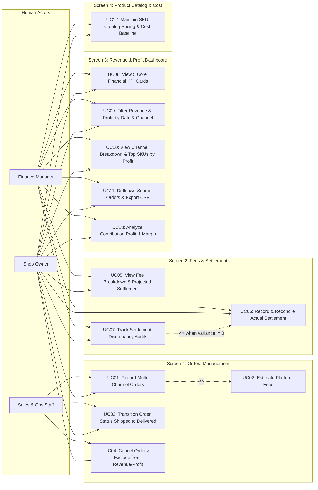

# Business Architecture & Use Case Specification: Fashion Revenue & Profit Management System

> **System:** Fashion Revenue & Profit Management System  
> **Objective:** Streamline multi-channel order revenue streams (TikTok Shop, Shopee, POS), calculate marketplace fee deductions, freeze immutable COGS baselines, determine Contribution Profit, and manually reconcile actual wallet payouts against projected settlements.

---

## 1. Use Case Diagram

The diagram illustrates the interaction between 3 Human Actors (`Sales & Ops Staff`, `Finance Manager`, and `Shop Owner`) across 4 primary UI workspaces. Internal services (such as the Fee Calculation Engine) operate as system capabilities rather than external actors:

> **Relationship Rules & Invariants:**
> - `UC01 <<include>> UC02`: During order creation, real-time platform fee estimation is invoked as an integral sub-flow.
> - `UC01` reads active catalog SKU data managed by `UC12`; however, order recording does not include catalog maintenance (no `<<include>>` relationship).
> - `UC03` officially recognizes revenue, COGS, and profit upon delivery; however, analyzing financial performance (`UC13`) is an independent management activity performed by `Finance Manager` and `Shop Owner` (no `<<include>>` relationship).
> - `UC07 <<extend>> UC06`: Discrepancy audit logging is triggered conditionally when a financial variance exists ($\text{Variance} \neq 0 \text{ ₫}$) between projected settlement and actual wallet disbursement.

> **Canonical Financial Equations:**
> - $\text{Gross Revenue} = \text{Subtotal} - \text{Shop Voucher}$
> - $\text{COGS} = \sum (\text{Quantity} \times \text{Unit Cost Snapshot})$
> - $\text{Projected Settlement (Net Realized Revenue)} = \text{Gross Revenue} - \text{Total Platform Fees}$
> - $\text{Contribution Profit} = \text{Projected Settlement} - \text{COGS} = \text{Gross Revenue} - \text{Total Platform Fees} - \text{COGS}$
> - $\text{Contribution Margin \%} = \frac{\text{Contribution Profit}}{\text{Gross Revenue}} \times 100 \quad (\text{when } \text{Gross Revenue} > 0)$
>
> *(Note: Contribution Profit reflects order/channel profitability after marketplace deductions and direct merchandise costs; it is strictly distinct from company-wide Net Profit).*

---

## 2. 3-Way Traceability Matrix: Screen — Use Case — Role

| UI Screen (Workspace) | Use Case / Feature Name | User Role | Business Responsibility & Controls |
|---|---|:---:|---|
| **Screen 1: Orders Management** *(Orders Tab)* | **UC01: Record Multi-Channel Orders** | `Sales & Ops Staff` `Shop Owner` | Records commercial orders from TikTok Shop, Shopee, and POS. Snapshots SKU selling prices and unit baseline costs. |
| | **UC02: Estimate Platform Fees** | *(System Automated / Backend)* | Computes channel fee deductions (commission, payment, service fees, and fixed charges). The backend may implement this via the Strategy Pattern. |
| | **UC03: Transition Order Status (Shipped $\rightarrow$ Delivered)** | `Sales & Ops Staff` `Shop Owner` | Advances order lifecycle. Upon `DELIVERED`, the system **officially recognizes Gross Revenue, COGS, and Contribution Profit**. |
| | **UC04: Cancel Order & Exclude from Revenue/Profit** | `Sales & Ops Staff` `Shop Owner` | Records customer cancellations before fulfillment, strictly excluding unfulfilled orders from revenue, COGS, and profit metrics. |
| **Screen 2: Fees & Settlement** *(Settlement Tab)* | **UC05: View Fee Breakdown & Projected Settlement** | `Finance Manager` `Shop Owner` | Inspects fee deductions: Gross Revenue $\rightarrow$ Commission $\rightarrow$ Payment $\rightarrow$ Service $\rightarrow$ Projected Settlement. |
| | **UC06: Record & Reconcile Actual Settlement** | `Finance Manager` `Shop Owner` | Manually records verified cash payout figures (`Actual Settlement`) from wallet/bank statements and reconciles against projected payout. |
| | **UC07: Track Settlement Discrepancy Audits** | `Finance Manager` `Shop Owner` | Investigates variances between projected settlement and actual wallet deposit, enforcing mandatory root-cause explanation notes. |
| **Screen 3: Revenue & Profit Dashboard** *(Dashboard Tab)* | **UC08: View 5 Core Financial KPI Cards** | `Shop Owner` `Finance Manager` | Monitors 5 headline KPIs: **Gross Revenue**, **Total Platform Fees**, **Net Realized Revenue**, **COGS**, **Contribution Profit** (with Margin %). |
| | **UC09: Filter Revenue & Profit by Date & Channel** | `Shop Owner` `Finance Manager` | Dynamically filters financial performance by timeframe (Today, 7 Days, Month) and sales channel. |
| | **UC10: View Channel Breakdown & Top SKUs by Profit** | `Shop Owner` `Finance Manager` | Visualizes channel revenue/profit contribution shares and ranks top-performing SKUs by revenue and Contribution Profit. |
| | **UC11: Drilldown Source Orders & Export CSV** | `Finance Manager` `Shop Owner` | Drills through KPI totals to inspect granular delivered source orders and exports financial CSV ledgers. |
| | **UC13: Analyze Contribution Profit & Margin** | `Shop Owner` `Finance Manager` | Assesses channel profitability and margin percentage after marketplace deductions and merchandise baseline costs. |
| **Screen 4: Product Catalog & Cost** *(Catalog Tab)* | **UC12: Maintain SKU Catalog Pricing & Cost Baseline** | `Shop Owner` `Finance Manager` | Manages apparel products, SKU variants, retail selling prices, and baseline unit costs (`cost_price \ge 0`) for COGS calculation. |

---

## 3. Functional Scope Matrix

| Subsystem Module | In-Scope Features (MVP Release) | Deliberately Out-of-Scope (Excluded) |
|---|---|---|
| **1. Catalog & Pricing** | • Master product apparel model management. • SKU variants (color, size, retail price). • Baseline unit cost configuration (`cost_price \ge 0`). • Role-sensitive cost hiding (Sales & Ops cannot view baseline costs). | • Raw material Bill of Materials (BOM). • Automated production costing. • Multi-currency catalog pricing. |
| **2. Multi-Channel Orders** | • Order recording from TikTok Shop, Shopee, and POS channels. • Multi-item line order support using ProductSelector. • Immutable snapshots: SKU, product title, unit price, baseline unit cost. • Lifecycle: `PENDING` $\rightarrow$ `SHIPPED` $\rightarrow$ `DELIVERED` / `CANCELLED`. • Revenue, COGS, and profit recognition strictly upon `DELIVERED`. | • Real-time live open API webhook connectors. • Automated warehouse wave routing and dispatch. • Return & refund operational workflows (`RETURNED` / `REFUNDED`). |
| **3. Platform Fees & Audit** | • Automated channel fee deduction calculation. • Fee policy matrix (TikTok, Shopee, POS Cash/Card). • Manual actual wallet payout entry (`RecordSettlementModal`). • Variance auto-calculation ($\text{Projected} - \text{Actual}$). • Mandatory discrepancy explanation notes when variance $\neq 0$. | • Automated bulk Excel bank statement file parsing. • Direct commercial banking API integrations. • Automated bank reconciliation feeds. |
| **4. Revenue & Profit Analytics** | • 5 core executive KPI cards (Gross Revenue, Total Platform Fees, Net Realized Revenue, COGS, Contribution Profit). • Contribution Margin % analysis. • Channel revenue and profit share breakdown charts. • Top SKU rankings by Gross Revenue and Contribution Profit. • Source order drillthrough & CSV export. | • **EXCLUDED:** Automated inventory valuation methods (FIFO/LIFO/Moving Weighted Average). • **EXCLUDED:** Company-wide net margin accounting (Rent, Payroll, Marketing OPEX, Corporate Tax, Depreciation). |

---

## 4. Core Use Case Scenarios & RBAC Matrix

### 4.1. Scenario 1: Multi-Channel Order Recording & Cost Freezing (UC01)
* **Primary Actors:** `Sales & Ops Staff`, `Shop Owner`
* **Workspace:** Screen 1: Orders Management
* **Main Flow:**
  1. Operator selects Channel (*TikTok Shop, Shopee, or POS*) and records external Order ID.
  2. Uses `ProductSelector` to add order line items (SKU code, quantity, agreed unit selling price) and inputs shop voucher. (Baseline unit cost is hidden from operator).
  3. System automatically retrieves current baseline cost and freezes immutable `unit_cost_snapshot`:
     $$\text{Line COGS} = \text{Quantity} \times \text{Unit Cost Snapshot}$$
  4. System triggers backend fee preview calculation (`UC02`) to display estimated fees and projected settlement:
     $$\text{Estimated Fees} = \text{Commission} + \text{Payment Fee} + \text{Service Fee} + \text{Fixed Fee}$$
     $$\text{Projected Settlement} = \text{Gross Revenue} - \text{Estimated Fees}$$
     *(Note: Fee Preview at order creation is an interactive estimation; official platform fee snapshots are authoritatively frozen upon reaching `DELIVERED` status).*
  5. Order is saved with `PENDING` status.

### 4.2. Scenario 2: Order Lifecycle & Revenue/Profit Recognition (UC03)
* **Primary Actors:** `Sales & Ops Staff`, `Shop Owner`
* **Workspace:** Screen 1: Orders Management
* **Rules:**
  1. **Dispatch (`SHIPPED`):** Order is marked in-transit; revenue, COGS, and profit remain provisional.
  2. **Delivery (`DELIVERED`):** System **officially credits Gross Revenue, COGS, and Contribution Profit** to executive dashboards. Platform fee snapshots are permanently frozen.
  3. **Cancellation (`CANCELLED`):** System enforces mandatory cancellation reason; cancelled order contributes 0 VND to Gross Revenue, COGS, and Contribution Profit.

### 4.3. Scenario 3: Manual Settlement Reconciliation & CSV Export (UC06, UC07, UC11)
* **Primary Actors:** `Finance Manager`, `Shop Owner`
* **Workspace:** Screen 2 (Fees & Settlement) & Screen 3 (Revenue & Profit Dashboard)
* **Main Flow:**
  1. Accountant reviews delivered orders on Screen 2 and opens the Wallet Settlement Drawer (`RecordSettlementModal`). *(The order lifecycle status remains strictly `DELIVERED` throughout this process).*
  2. Enters verified cash disbursement amount (`Actual Settlement`) from the platform wallet / bank statement.
  3. System calculates variance:
     $$\text{Variance} = \text{Projected Settlement} - \text{Actual Settlement}$$
  4. **Reconciliation Status Determination:**
     - If $\text{Variance} = 0 \text{ ₫}$, reconciliation status becomes `RECONCILED`.
     - If $\text{Variance} \neq 0 \text{ ₫}$, reconciliation status becomes `DISCREPANCY`, and the system mandates logging a root-cause explanation note (`UC07`).
     *(Note: `RECONCILED` and `DISCREPANCY` govern the financial reconciliation audit state; the order lifecycle status remains authoritatively `DELIVERED`).*
  5. User navigates to Screen 3 (`Revenue & Profit Dashboard`), applies reporting filters, and clicks **Export CSV** (`UC11`) for accounting audit trails.

---

### 4.4. Role-Based Access Control Matrix (RBAC)

| Business Operation | UI Screen Workspace | Sales & Ops Staff | Finance Manager | Shop Owner |
|---|---|:---:|:---:|:---:|
| **Create and edit orders (UC01)** | Screen 1 (Orders) | Full Access | Read-Only | Full Access |
| **Update status - Shipped/Delivered/Cancel (UC03, UC04)** | Screen 1 (Orders) | Full Access | Read-Only | Full Access |
| **View detailed fee deduction breakdown (UC05)** | Screen 2 (Settlement) | No Access | Full Access | Full Access |
| **Record & reconcile actual settlement (UC06)** | Screen 2 (Settlement) | No Access | Full Access | Full Access |
| **Investigate and resolve discrepancies (UC07)** | Screen 2 (Settlement) | No Access | Full Access | Full Access |
| **View 5 Financial KPI cards & Charts (UC08, UC10, UC13)**| Screen 3 (Dashboard) | No Access | Full Access | Full Access |
| **Filter revenue & Export CSV reports (UC09, UC11)** | Screen 3 (Dashboard) | No Access | Full Access | Full Access |
| **Select SKUs for order creation** | Modal (`ProductSelector`) | Full Access | Full Access | Full Access |
| **View baseline unit costs (`cost_price`)** | Screen 4 (Catalog) | **No Access (Hidden)**| Full Access | Full Access |
| **Manage products, SKUs, and baseline costs (UC12)** | Screen 4 (Catalog) | No Access | Full Access | Full Access |
