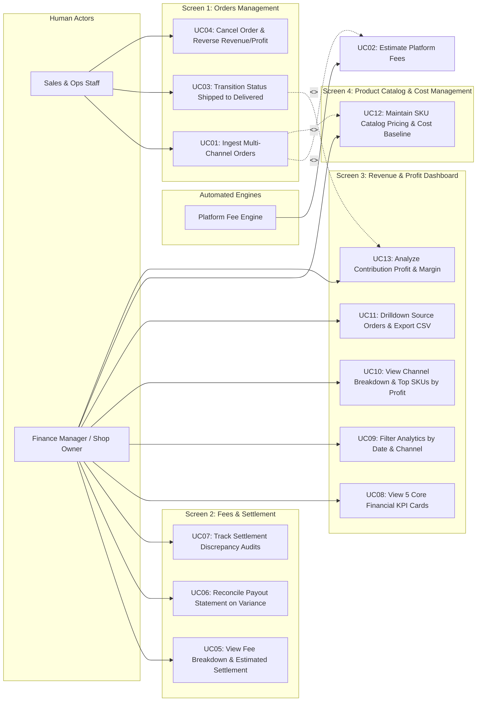

# Business Architecture & Use Case Specification: Fashion Revenue & Profit Management System

> **System:** Fashion Revenue & Profit Management System  
> **Objective:** Streamline multi-channel order revenue streams (TikTok Shop, Shopee, POS), automate marketplace fee deductions via Strategy Pattern, freeze immutable COGS baselines, calculate Contribution Profit, and reconcile net wallet payouts.

---

## 1. Use Case Diagram (UML Standard)

The diagram illustrates the interaction between 2 Human Actors (Sales & Ops Staff, Finance Manager & Shop Owner) and 1 Automated Engine (Platform Fee Engine), grouped across 4 primary UI workspaces:

> **Canonical Financial Equations:**
> - $\text{Gross Revenue} = \text{Subtotal} - \text{Shop Voucher}$
> - $\text{COGS} = \sum (\text{Quantity} \times \text{Unit Cost Snapshot})$
> - $\text{Projected Settlement (Net Realized Revenue)} = \text{Gross Revenue} - \text{Total Platform Fees}$
> - $\text{Contribution Profit} = \text{Projected Settlement} - \text{COGS} = \text{Gross Revenue} - \text{Platform Fees} - \text{COGS}$
> - $\text{Contribution Margin \%} = \frac{\text{Contribution Profit}}{\text{Gross Revenue}} \times 100 \quad (\text{when } \text{Gross Revenue} > 0)$

---

## 2. 3-Way Traceability Matrix: Screen — Use Case — Role

| UI Screen (Workspace) | Use Case / Feature Name | User Role | Business Responsibility & Controls |
|---|---|:---:|---|
| **Screen 1: Orders Management** *(Orders Tab)* | **UC01: Ingest Multi-Channel Orders (TikTok/Shopee/POS)** | `Sales / Ops` `Shop Owner` | Records orders from TikTok, Shopee, and POS. Snapshots SKU selling prices and unit cost baselines. |
| | **UC02: Automated Platform Fee Estimation (Strategy)** | `Platform Fee Engine` *(Automated Engine)* | Automatically applies channel-specific fee deduction formulas (commission, payment, service fees). |
| | **UC03: Update Order Status (Shipped $\rightarrow$ Delivered)** | `Sales / Ops` | Upon `DELIVERED`, the system **officially recognizes revenue, COGS, and Contribution Profit**. |
| | **UC04: Cancel Order & Exclude from Revenue/Profit** | `Sales / Ops` | Handles customer cancellations before fulfillment, strictly excluding them from revenue and profit metrics. |
| **Screen 2: Fees & Settlement** *(Settlement Tab)* | **UC05: View Fee Breakdown & Estimated Settlement** | `Finance Manager` `Shop Owner` | Inspects fee deductions: Gross Revenue $\rightarrow$ Commission $\rightarrow$ Payment $\rightarrow$ Service $\rightarrow$ Net Payout. |
| | **UC06: Reconcile Payout Statement (On Variance)** | `Finance Manager` | Audits payout statements and enters `Actual Settlement Amount` to reconcile cash receipts. |
| | **UC07: Track Settlement Discrepancy Audits** | `Finance Manager` `Shop Owner` | Investigates variances between projected payout vs. actual wallet deposit and records explanation notes. |
| **Screen 3: Revenue Dashboard** *(Dashboard Tab)* | **UC08: View 5 Core Financial KPI Cards** | `Shop Owner` `Finance Manager` | Monitors 5 headline KPIs: **Gross Revenue**, **Platform Fees**, **Net Realized Revenue**, **COGS**, **Contribution Profit**. |
| | **UC09: Filter Revenue & Profit by Date & Channel** | `Shop Owner` `Finance Manager` | Dynamically filters financial performance by timeframe (Today, 7 Days, Month) and sales channel. |
| | **UC10: View Channel Breakdown & Top SKUs by Profit** | `Shop Owner` `Finance Manager` | Visualizes channel contribution shares and ranks top-performing SKUs by revenue and Contribution Profit. |
| | **UC11: Drilldown Source Orders & Export CSV** | `Finance Manager` `Shop Owner` | Drills through KPI totals to inspect granular source orders and exports reconciliation CSV files. |
| | **UC13: Analyze Contribution Profit & Margin** | `Shop Owner` `Finance Manager` | Assesses channel profitability and margin percentage after marketplace fees and merchandise costs. |
| **Screen 4: Product Catalog & Cost** *(Catalog Tab)* | **UC12: Maintain SKU Catalog Pricing & Cost Baseline** | `Shop Owner` `Finance Manager` | Manages apparel products, SKU variants, retail selling prices, and baseline unit costs for COGS calculation. |

---

## 3. Functional Scope Matrix

| Subsystem Module | In-Scope Features (MVP Release) | Deliberately Out-of-Scope (Excluded) |
|---|---|---|
| **1. Catalog & Pricing** | • Master product apparel model management. • SKU variants (color, size, retail price). • Baseline unit cost configuration (`cost_price`). • Role-sensitive cost hiding (Sales cannot view costs). | • Raw material Bill of Materials (BOM). • Automated production costing. • Multi-currency catalog pricing. |
| **2. Multi-Channel Orders** | • Order ingestion from TikTok Shop, Shopee, POS. • Multi-item multi-line order support. • Immutable snapshots: SKU, product title, unit price, unit cost. • Lifecycle: `PENDING` $\rightarrow$ `SHIPPED` $\rightarrow$ `DELIVERED` / `CANCELLED`. • Revenue, COGS, and profit recognition upon `DELIVERED`. | • Real-time live open API webhook connectors. • Automated warehouse wave routing and dispatch. • Return & refund operational workflows (`RETURNED`). |
| **3. Platform Fees & Audit** | • Automated Strategy Pattern fee deduction. • Channel matrix (TikTok, Shopee, POS Cash/Card). • Actual wallet payout manual entry and variance reporting. • Mandatory discrepancy explanation notes. | • Automated bulk Excel bank statement file parsing. • Direct commercial banking API integrations. |
| **4. Revenue & Profit Analytics** | • 5 core executive KPI cards (Gross, Fees, Net, COGS, Contribution Profit). • Channel revenue and profit share breakdown charts. • Top SKU rankings by Gross Revenue and Contribution Profit. • Source order drillthrough & CSV export. | • **EXCLUDED:** Automated inventory valuation methods (FIFO/LIFO/Moving Weighted Average). • **EXCLUDED:** Company-wide net margin accounting (Rent, Payroll, Marketing OPEX, Corporate Tax, Depreciation). |

---

## 4. Core Use Case Scenarios & RBAC Matrix

### 4.1. Scenario 1: Multi-Channel Order Ingestion & Cost Freezing (UC-ORDER-01)
* **Primary Actor:** `Sales & Ops Staff`
* **Workspace:** Screen 1: Orders Management
* **Main Flow:**
  1. Operator selects Channel (*TikTok Shop, Shopee, or POS*) and enters external Order ID.
  2. Adds order line items (SKU, quantity, unit selling price) and enters shop voucher.
  3. System automatically freezes `unit_cost_snapshot` from master catalog baseline:
     $$\text{Line COGS} = \text{Quantity} \times \text{unit\_cost\_snapshot}$$
  4. System triggers `Platform Fee Engine` via Strategy Pattern:
     $$\text{Estimated Fees} = \text{Commission} + \text{Payment Fee} + \text{Service Fee} + \text{Fixed Fee}$$
     $$\text{Projected Settlement} = \text{Gross Revenue} - \text{Estimated Fees}$$
  5. Order is saved with `PENDING` status.

### 4.2. Scenario 2: Order Lifecycle & Revenue/Profit Recognition (UC-REV-02)
* **Primary Actor:** `Sales & Ops Staff`
* **Workspace:** Screen 1: Orders Management
* **Rules:**
  1. **Dispatch (`SHIPPED`):** Order is marked in-transit; financial amounts remain provisional.
  2. **Delivery (`DELIVERED`):** System **officially credits Gross Revenue, COGS, and Contribution Profit** to the period financial dashboard.
  3. **Cancellation (`CANCELLED`):** System requires a cancellation reason; order contributes 0 VND to Gross Revenue, COGS, and Contribution Profit.

### 4.3. Scenario 3: Platform Wallet Reconciliation & CSV Export (UC-AUDIT-03)
* **Primary Actor:** `Finance Manager` / `Shop Owner`
* **Workspace:** Screen 2 (Settlement) & Screen 3 (Dashboard)
* **Main Flow:**
  1. Accountant reviews delivered orders, inputs actual deposit amount (`Actual Settlement Amount`) from platform wallet payout statement.
  2. System calculates variance: $\text{Variance} = \text{Projected Settlement} - \text{Actual Deposit}$.
  3. If variance $\neq 0$, accountant logs mandatory explanation notes.
  4. Navigates to Dashboard, filters reporting timeframe, and clicks **Export CSV** for accounting audit trails.

---

### 4.4. Role-Based Access Control Matrix (RBAC)

| Business Operation | UI Screen Workspace | Sales & Ops Staff | Finance Manager | Shop Owner |
|---|---|:---:|:---:|:---:|
| **Create and edit orders** | Screen 1 (Orders) | Full Access | Read-Only | Full Access |
| **Update status (Shipped/Delivered/Cancel)** | Screen 1 (Orders) | Full Access | Read-Only | Full Access |
| **View detailed fee deduction breakdown** | Screen 2 (Settlement) | No Access | Full Access | Full Access |
| **Reconcile and confirm actual payout** | Screen 2 (Settlement) | No Access | Full Access | Full Access |
| **View 5 Financial KPI cards & Charts** | Screen 3 (Dashboard) | No Access | Full Access | Full Access |
| **Filter revenue & Export CSV reports** | Screen 3 (Dashboard) | No Access | Full Access | Full Access |
| **Select SKUs for order creation** | Modal (Order Ingestion) | Full Access | Full Access | Full Access |
| **View baseline unit costs (`cost_price`)** | Screen 4 (Catalog) | **No Access (Hidden)** | Full Access | Full Access |
| **Manage products, SKUs, and baseline costs**| Screen 4 (Catalog) | No Access | Full Access | Full Access |
