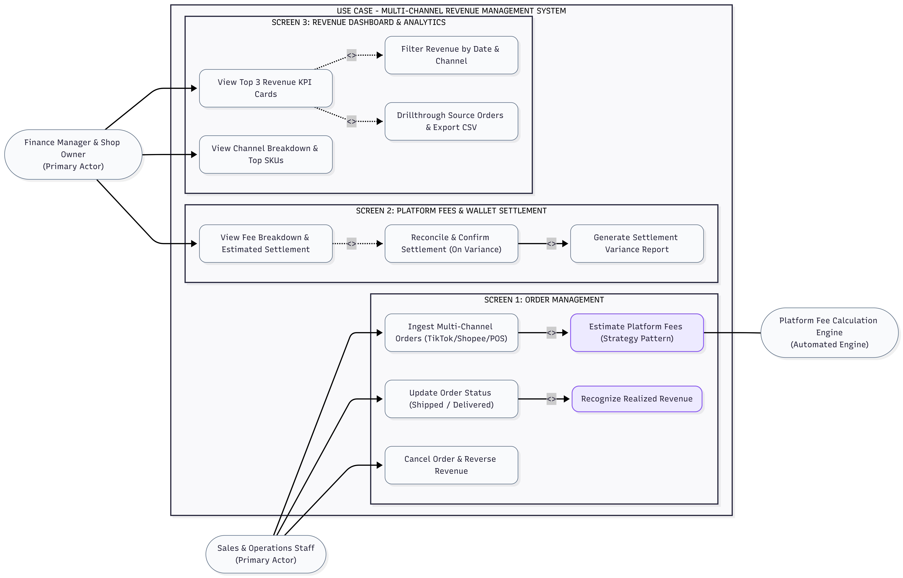

# Business Architecture & Use Case Specification: Multi-Channel Revenue Management System

> **System:** Multi-Channel Revenue Management System  
> **Objective:** Streamline multi-channel order revenue streams (TikTok Shop, Shopee, Facebook POS), automate marketplace fee deductions via Strategy Pattern, and reconcile net wallet payouts.

---

## 1. Use Case Diagram (UML Standard)

The diagram illustrates the interaction between 2 Human Actors (Sales & Ops Staff, Finance Manager & Shop Owner) and 1 Automated Engine (Platform Fee Engine), grouped across 3 primary UI screens:

> **Diagram Conventions (Concise):**
> * **Screen Boundaries:** Dedicated workspace tailored for specific user roles.
> * **`<<include>>` (Mandatory):** Automated sub-process executed automatically (e.g., Order ingestion automatically triggers fee estimation; Order delivery automatically triggers revenue recognition).
> * **`<<extend>>` (Optional):** User-invoked extension upon specific conditions (e.g., Reconciling settlement payout on variance; Filtering and exporting CSV reports).

---

## 2. 3-Way Traceability Matrix: Screen — Use Case — Role

The matrix defines **Which Feature is performed by Which Role on Which Screen**:

| UI Screen (Workspace) | Use Case / Feature Name | User Role | Business Responsibility & Controls |
|---|---|:---:|---|
| **Screen 1: Order Management** *(Orders Tab)* | **UC01: Ingest Multi-Channel Orders (TikTok/Shopee/POS)** | `Sales / Ops` `Shop Owner` | Records order details from TikTok Shop, Shopee, and POS (SKU, quantity, unit price, discounts). Supports multi-line items. |
| | **UC02: Automated Platform Fee Estimation (Strategy)** | `Platform Fee Engine` *(Automated Engine)* | Automatically applies channel-specific fee deduction formulas (commission, payment, service fees). |
| | **UC03: Update Order Status (Shipped $\rightarrow$ Delivered)** | `Sales / Ops` | Upon successful delivery (`DELIVERED`), the system **officially recognizes revenue** into the accounting period. |
| | **UC04: Cancel Order & Reverse Revenue (Cancelled)** | `Sales / Ops` | Handles customer cancellations/returns before fulfillment, automatically excluding them from realized revenue. |
| **Screen 2: Fees & Settlement** *(Settlement Tab)* | **UC05: View Fee Breakdown & Estimated Settlement** | `Finance Manager` `Shop Owner` | Transparently breaks down: Gross Sales $\rightarrow$ Commission Fees $\rightarrow$ Transaction Fees $\rightarrow$ Net Payout. |
| | **UC06: Reconcile & Confirm Settlement (On Variance)** | `Finance Manager` | Audits platform wallet payout statements and updates `Actual Settlement Amount` if unexpected deductions occur. |
| | **UC07: Generate Settlement Variance Report** | `Finance Manager` `Shop Owner` | Analyzes variances between projected payout vs. actual wallet deposit to identify discrepancies. |
| **Screen 3: Revenue Dashboard** *(Dashboard Tab)* | **UC08: View Top 3 Revenue KPI Cards** | `Shop Owner` `Finance Manager` | Monitors 3 core financial KPIs: **Gross Sales**, **Total Platform Fees Deducted**, **Net Realized Revenue**. |
| | **UC09: Filter Revenue by Date & Channel** | `Shop Owner` `Finance Manager` | Filters financial metrics dynamically by timeframe (Today, Last 7 Days, This Month) and by sales channel. |
| | **UC10: View Channel Breakdown & Top SKUs** | `Shop Owner` `Finance Manager` | Visualizes revenue share pie/bar charts across channels and ranks top-performing product SKUs. |
| | **UC11: Drillthrough Source Orders & Export CSV** | `Finance Manager` `Shop Owner` | Drills through KPI totals to inspect granular source orders and exports reconciliation CSV/Excel files. |

---

## 3. Functional Scope Matrix

| Subsystem Module | In-Scope Features (MVP Release) | Deliberately Out-of-Scope (Excluded) |
|---|---|---|
| **1. Catalog & Pricing** | • Product, Color/Size Variant SKU management. • Retail base price configuration. • Active/Discontinued status toggles. | • Raw material Bill of Materials (BOM) management. • Complex multi-subsidiary enterprise structures. |
| **2. Multi-Channel Orders** | • Order ingestion from TikTok Shop, Shopee, POS. • Multi-item multi-line order support. • Lifecycle: `PENDING` $\rightarrow$ `SHIPPED` $\rightarrow$ `DELIVERED` / `CANCELLED`. • Official revenue recognition on `DELIVERED`. | • Real-time live open API webhook connectors. • Automated warehouse wave routing and dispatch. |
| **3. Platform Fees & Audit** | • Automated Strategy Pattern fee deduction. • 0đ fee handling (Shop subsidized free shipping). • Actual wallet payout audit and variance reporting. | • Automated bulk Excel bank statement parsing. • Direct commercial banking API integrations. |
| **4. Revenue Analytics** | • Top 3 executive KPI cards (Gross Sales, Fees, Net). • Multi-channel revenue share charts. • Top revenue-generating SKU rankings. • Source order drillthrough & CSV export. | • EXCLUDED: Truck freight landed cost allocation. • EXCLUDED: Moving weighted average inventory costing (COGS). • EXCLUDED: Company-wide net margin accounting (Rent, Payroll). |

---

## 4. Core Use Case Scenarios & RBAC Matrix

### 4.1. Scenario 1: Multi-Channel Order Ingestion & Fee Estimation (UC-ORDER-01)
* **Primary Actor:** `Sales & Ops Staff`
* **Workspace:** Screen 1: Order Management
* **Main Flow:**
  1. Operator selects Channel (*TikTok Shop, Shopee, or POS*) and enters external Order ID.
  2. Adds order line items (SKU, quantity, unit price) and inputs voucher discounts.
  3. System triggers `Platform Fee Engine` via Strategy Pattern:
     $$\text{Estimated Fees} = \text{Commission Fee} + \text{Transaction Fee} + \text{Service/FreeShip Fee}$$
     $$\text{Projected Net Revenue} = \text{Gross Customer Payment} - \text{Estimated Fees} - \text{Voucher}$$
  4. Order is saved with `PENDING` status.

### 4.2. Scenario 2: Order Lifecycle & Revenue Recognition (UC-REV-02)
* **Primary Actor:** `Sales & Ops Staff`
* **Workspace:** Screen 1: Order Management
* **Rules:**
  1. **Dispatch (`SHIPPED`):** Revenue is marked as *In-Transit Revenue*.
  2. **Delivery (`DELIVERED`):** System **officially credits realized revenue** to the accounting dashboard.
  3. **Cancellation (`CANCELLED`):** System immediately reverses and excludes the amount from realized revenue.

### 4.3. Scenario 3: Platform Wallet Reconciliation & CSV Export (UC-AUDIT-03)
* **Primary Actor:** `Finance Manager` / `Shop Owner`
* **Workspace:** Screen 2 (Settlement) & Screen 3 (Dashboard)
* **Main Flow:**
  1. Accountant reviews settled orders, inputs actual deposit amount (`Actual Settlement Amount`) from platform wallet statement.
  2. System calculates variance: $\text{Variance} = \text{Projected Net} - \text{Actual Deposit}$.
  3. Navigates to Dashboard, filters desired reporting timeframe, and clicks **Export CSV** for accounting books.

---

### 4.4. Role-Based Access Control Matrix (RBAC)

| Business Operation | UI Screen Workspace | Sales & Ops Staff | Finance Manager | Shop Owner |
|---|---|:---:|:---:|:---:|
| **Create and edit orders** | Screen 1 (Orders) | Full Access | Read-Only | Full Access |
| **Update status (Shipped/Delivered/Cancel)** | Screen 1 (Orders) | Full Access | Read-Only | Approval |
| **View detailed fee deduction breakdown** | Screen 2 (Settlement) | No Access | Full Access | Full Access |
| **Reconcile and confirm actual payout** | Screen 2 (Settlement) | No Access | Full Access | Approval |
| **View 3 KPI cards & Revenue charts** | Screen 3 (Dashboard) | No Access | Full Access | Full Access |
| **Filter revenue & Export CSV reports** | Screen 3 (Dashboard) | No Access | Full Access | Full Access |
| **Manage SKU catalog and retail prices** | Modal (Catalog) | Full Access | Read-Only | Full Access |
