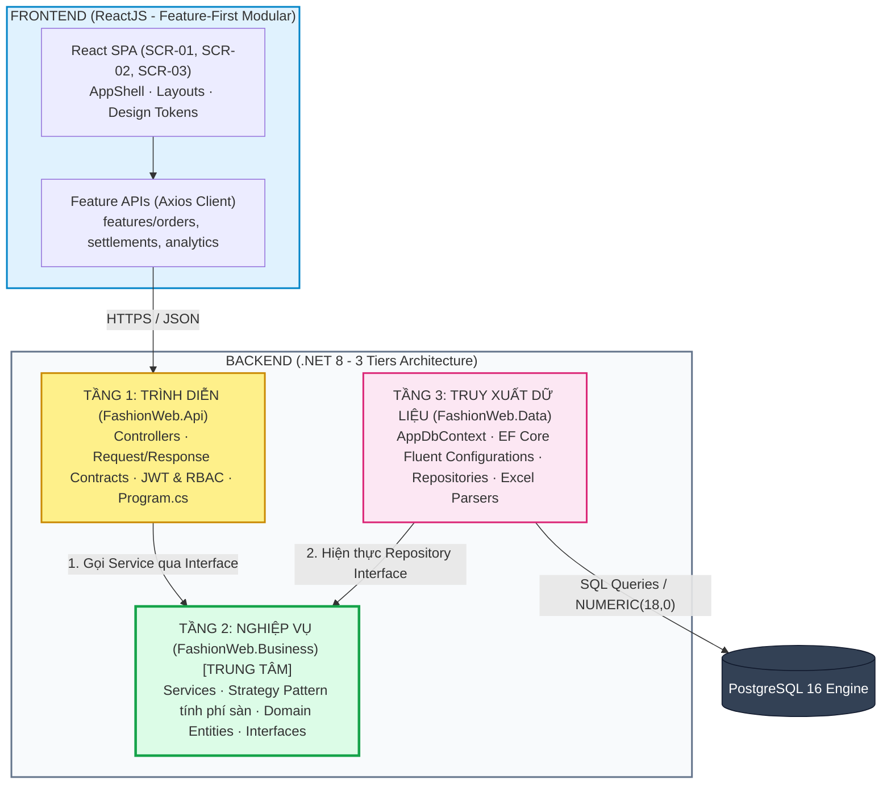

# 07 — Thiết Kế Cấu Trúc Thư Mục (Frontend ReactJS & Backend .NET 3-Tiers)

> **Dự án:** FASHION-WEB — Nền Tảng Quản Lý Doanh Thu & Đối Soát Bán Hàng Đa Kênh  
> **Kiến trúc mục tiêu:** ReactJS (Feature-First) + ASP.NET Core Web API (.NET 8 3-Tiers) + EF Core + PostgreSQL 16  
---

## 1. Tổng Quan Kiến Trúc Phân Tầng

Hệ thống được quy hoạch thành 2 khối độc lập tuyệt đối giữa **Client (Frontend)** và **Server (Backend)**, giao tiếp hoàn toàn qua giao thức chuẩn **RESTful HTTP / JSON**:



### Nguyên tắc Phụ thuộc Bất biến (Dependency Inversion Rule):
```text
FashionWeb.Api      --> phụ thuộc --> FashionWeb.Business
FashionWeb.Data     --> phụ thuộc --> FashionWeb.Business
FashionWeb.Business --> ĐỘC LẬP TUYỆT ĐỐI (Không phụ thuộc Api hoặc Data)
```
* **Ý nghĩa kiến trúc:** Tầng nghiệp vụ (`Business`) là trái tim độc lập. Toàn bộ logic tính toán phí sàn (Strategy Pattern), kiểm soát doanh thu ảo, và quy tắc bất biến của sổ cái kế toán được bảo vệ nguyên vẹn, không bị phụ thuộc vào giao diện API hay cơ chế lưu trữ của Database.

---

## 2. Cây Thư Mục Dự Án Hoàn Chỉnh

```text
Quanly_DoanhThu_LoiNhuan_DangDucHoa_VSF/
│
├── frontend/                                # ỨNG DỤNG CLIENT REACTJS (TYPESCRIPT + VITE)
│   ├── public/                              # Tài nguyên tĩnh (favicon, index.html)
│   ├── src/
│   │   ├── app/                             # Khởi tạo ứng dụng & cấu hình toàn cục
│   │   │   ├── App.tsx                      # Root component gắn kết Router và Layout
│   │   │   ├── router.tsx                   # Định tuyến đường dẫn (/orders, /settlements, /analytics)
│   │   │   └── providers.tsx                # TanStack React Query Client, Auth Provider
│   │   │
│   │   ├── layouts/                         # Khung giao diện toàn cục (Level 0 Shell)
│   │   │   ├── AppShell.tsx                 # Khung sườn tổng hợp (Sidebar + Topbar + Content)
│   │   │   ├── Sidebar.tsx                  # Thanh menu dọc icon-rail (Orders, Settlement, Dashboard)
│   │   │   └── Topbar.tsx                   # Header tìm kiếm (Ctrl+K), Role Switcher, Staff Profile
│   │   │
│   │   ├── features/                        # CÁC MÔ-ĐUN NGHIỆP VỤ (FEATURE-FIRST)
│   │   │   ├── orders/                      # Màn hình SCR-01: Quản lý đơn hàng đa kênh
│   │   │   │   ├── api/ordersApi.ts         # Gọi GET/POST /orders, PATCH /status, POST /cancel
│   │   │   │   ├── components/
│   │   │   │   │   ├── OrderTable.tsx       # Bảng danh sách đơn hàng đa kênh
│   │   │   │   │   ├── OrderFilterPills.tsx # Thanh lọc capsule: Tất cả, TikTok, Shopee, POS
│   │   │   │   │   ├── RhythmStrip.tsx      # Thanh tiến độ nhịp vận hành đơn hàng (6 chỉ số)
│   │   │   │   │   ├── CreateOrderModal.tsx # Modal tạo đơn thủ công có live fee preview (MOD-01)
│   │   │   │   │   └── CancelOrderModal.tsx # Modal hủy đơn hàng & nhập lý do bắt buộc (MOD-02)
│   │   │   │   ├── hooks/useOrders.ts       # React Query hook xử lý phân trang, lọc dữ liệu
│   │   │   │   ├── schemas/orderSchema.ts   # Zod validation schema cho form tạo đơn
│   │   │   │   ├── types/order.types.ts     # TypeScript Interfaces (Order, OrderItem, OrderStatus)
│   │   │   │   ├── OrdersPage.tsx           # Entry point màn hình SCR-01
│   │   │   │   └── index.ts
│   │   │   │
│   │   │   ├── fees/                        # Quản lý Động cơ bóc tách phí sàn & Biểu phí
│   │   │   │   ├── api/feesApi.ts           # Gọi POST /orders/preview-fee, GET/PUT /fee-schedules
│   │   │   │   ├── components/
│   │   │   │   │   └── FeeScheduleModal.tsx # Modal cấu hình % hoa hồng, phí sàn các kênh (MOD-04)
│   │   │   │   ├── hooks/useFeePreview.ts   # Hook tính nhẩm phí sàn theo thời gian thực
│   │   │   │   └── types/fee.types.ts       # Interface FeeBreakdown, FeeSchedule
│   │   │   │
│   │   │   ├── settlements/                 # Màn hình SCR-02: Quyết toán ví & Bảng kê đối soát
│   │   │   │   ├── api/settlementsApi.ts    # Gọi GET /settlement/ledger, POST /statements/import
│   │   │   │   ├── components/
│   │   │   │   │   ├── SettlementSummaryCards.tsx # 3 Thẻ: Chờ đối soát, Đã khớp 100%, Bị lệch
│   │   │   │   │   ├── SettlementLedgerTable.tsx  # Bảng kê bóc tách chi phí & chênh lệch ví
│   │   │   │   │   └── ImportStatementModal.tsx   # Modal kéo thả nạp file Excel sao kê ví (MOD-03)
│   │   │   │   ├── hooks/useSettlements.ts  # Hook quản lý tiến trình nạp file và đối soát
│   │   │   │   ├── types/settlement.types.ts# Interface SettlementLine, StatementImport
│   │   │   │   ├── SettlementsPage.tsx      # Entry point màn hình SCR-02
│   │   │   │   └── index.ts
│   │   │   │
│   │   │   ├── discrepancies/               # Quản lý hồ sơ kiểm toán sai lệch dòng tiền
│   │   │   │   ├── api/discrepanciesApi.ts  # Gọi GET /discrepancies, POST /audit, PATCH /approve
│   │   │   │   ├── components/
│   │   │   │   │   ├── DiscrepancyAuditModal.tsx # Form nhập giải trình phạt cân nặng (#DIS-002)
│   │   │   │   │   └── DisputeApprovalBadge.tsx  # Huy hiệu trạng thái duyệt hồ sơ
│   │   │   │   └── types/discrepancy.types.ts
│   │   │   │
│   │   │   └── analytics/                   # Màn hình SCR-03: Dashboard doanh thu điều hành
│   │   │       ├── api/analyticsApi.ts      # Gọi GET /analytics/kpis, /trend, /export-csv
│   │   │       ├── components/
│   │   │       │   ├── KpiMetricsGrid.tsx   # 4 Thẻ KPI: Gross Sales, Fees, Net Cash, Delivered
│   │   │       │   ├── CashFlowTrendBar.tsx # Biểu đồ cột đôi so sánh Gross vs Net 7 ngày
│   │   │       │   ├── ChannelShareDonut.tsx# Biểu đồ tròn thị phần TikTok, Shopee, POS
│   │   │       │   ├── TopSkusLeaderboard.tsx# Bảng xếp hạng Top 5 SKU bán chạy nhất
│   │   │       │   └── SourceOrderDrilldownModal.tsx # Modal truy vết đơn hàng cấu thành KPI (MOD-05)
│   │   │       ├── hooks/useAnalytics.ts    # Hook nạp dữ liệu phân tích và xuất tệp CSV
│   │   │       ├── AnalyticsDashboardPage.tsx # Entry point màn hình SCR-03
│   │   │       └── index.ts
│   │   │
│   │   ├── shared/                          # THÀNH PHẦN DÙNG CHUNG TOÀN ỨNG DỤNG
│   │   │   ├── api/
│   │   │   │   ├── httpClient.ts            # Cấu hình Axios instance + Interceptors bắt lỗi
│   │   │   │   └── apiEndpoints.ts          # Hằng số định danh URL Endpoint
│   │   │   ├── ui/                          # Thư viện component nguyên tử (Atomic UI)
│   │   │   │   ├── Button.tsx               # Nút bấm chuẩn Apple pill / Enterprise style
│   │   │   │   ├── Table.tsx                # Khung bảng dữ liệu hairline 1px
│   │   │   │   ├── Modal.tsx                # Khung hộp thoại Modal chuẩn accessible (Esc/Overlay)
│   │   │   │   ├── Badge.tsx                # Huy hiệu kênh (TikTok, Shopee) và trạng thái
│   │   │   │   └── MoneyText.tsx            # Hiển thị số tiền với font số học Tabular Figures
│   │   │   ├── auth/
│   │   │   │   └── PermissionGate.tsx       # Ẩn/hiện nút và màn hình theo vai trò (RBAC)
│   │   │   ├── hooks/
│   │   │   │   └── useDebounce.ts           # Tối ưu hóa ô tìm kiếm và tính nhẩm phí sàn
│   │   │   ├── lib/
│   │   │   │   ├── formatters.ts            # Hàm format tiền VNĐ (`184.500.000 ₫`), ngày giờ
│   │   │   │   └── math.ts                  # Hàm tính tỷ lệ % và phương trình kế toán
│   │   │   ├── constants/
│   │   │   │   └── channels.ts              # ENUM kênh bán hàng và mã màu nhận diện
│   │   │   └── types/
│   │   │       └── common.types.ts          # Cấu trúc phản hồi API (ApiResponse, PaginatedResult)
│   │   │
│   │   ├── styles/
│   │   │   ├── tokens.css                   # Định nghĩa biến CSS (Màu sắc, Font chữ, Border 1px)
│   │   │   └── globals.css                  # Thiết lập CSS reset và giao diện chung
│   │   │
│   │   └── assets/                          # Hình ảnh minh họa, icon SVG
│   │
│   ├── package.json
│   └── tsconfig.json
│
├── backend/                                 # MÃ NGUỒN BACKEND .NET 8 (3 TIERS ARCHITECTURE)
│   ├── FashionWeb.sln                       # Solution tập trung quản lý 3 project con và project test
│   │
│   ├── src/
│   │   ├── FashionWeb.Api/                  # [TẦNG 1: TRÌNH DIỄN - PRESENTATION TIER]
│   │   │   ├── Controllers/                 # REST Controllers (Nhận HTTP Request từ Client)
│   │   │   │   ├── BaseApiController.cs     # Controller cơ sở cấu hình route chuẩn /api/v1/[controller]
│   │   │   │   ├── OrdersController.cs      # Tiếp nhận tạo đơn, chuyển bước giao hàng, hủy đơn
│   │   │   │   ├── SettlementController.cs  # Tiếp nhận nạp file Excel sao kê, tra cứu sổ cái
│   │   │   │   ├── DiscrepanciesController.cs # Tiếp nhận lập hồ sơ và phê duyệt giải trình
│   │   │   │   └── AnalyticsController.cs   # Cung cấp số liệu 4 KPI, biểu đồ và xuất tệp CSV
│   │   │   ├── Contracts/                   # Request & Response Data Transfer Objects (DTOs)
│   │   │   │   ├── Orders/                  # CreateOrderRequest, OrderResponse, FeePreviewRequest
│   │   │   │   ├── Settlement/              # StatementImportResponse, SettlementLedgerResponse
│   │   │   │   ├── Discrepancies/           # CreateDiscrepancyRequest, DiscrepancyAuditResponse
│   │   │   │   └── Analytics/               # ExecutiveKpisResponse, DailyTrendPointResponse
│   │   │   ├── Authorization/               # Quản lý bảo mật phân quyền theo vai trò (RBAC)
│   │   │   │   ├── Roles.cs                 # Hằng số vai trò: SalesOps, FinanceManager, ShopOwner
│   │   │   │   └── Policies.cs              # Chính sách truy cập (RequireOwner, RequireFinance)
│   │   │   ├── Middleware/                  # Phần mềm trung gian xử lý ngoại lệ và logging
│   │   │   │   └── GlobalExceptionMiddleware.cs # Bắt lỗi nghiệp vụ, trả về mã 400/404/409/422 JSON
│   │   │   ├── Program.cs                   # Điểm khởi động ứng dụng, cấu hình DI, Swagger, CORS
│   │   │   ├── appsettings.json             # Chuỗi kết nối PostgreSQL (ConnectionStrings)
│   │   │   └── FashionWeb.Api.csproj
│   │   │
│   │   ├── FashionWeb.Business/             # [TẦNG 2: NGHIỆP VỤ LÕI - BUSINESS LOGIC TIER]
│   │   │   ├── Services/                    # Triển khai xử lý nghiệp vụ thực tế
│   │   │   │   ├── OrderService.cs          # Quản lý vòng đời đơn, kiểm tra voucher, snapshot
│   │   │   │   ├── DynamicFeeEngine.cs      # Phân phối Strategy tính phí sàn theo kênh
│   │   │   │   ├── StatementMatchingService.cs # Thuật toán so khớp đối soát 2 chiều tự động
│   │   │   │   ├── DiscrepancyService.cs    # Xử lý quy trình lập biên bản và phê duyệt lệch tiền
│   │   │   │   └── AnalyticsService.cs      # Tính toán 4 KPI (chỉ lấy đơn DELIVERED)
│   │   │   ├── Interfaces/                  # Hợp đồng giao tiếp (Contracts & Repositories)
│   │   │   │   ├── Services/                # IOrderService, IDynamicFeeEngine, ISettlementService
│   │   │   │   └── Repositories/            # IOrderRepository, IReconciliationRepository, IFeeRepository
│   │   │   ├── Strategies/                  # MẪU THIẾT KẾ STRATEGY PATTERN BÓC TÁCH PHÍ SÀN
│   │   │   │   ├── IPlatformFeeStrategy.cs  # Interface chung: CalculateFees(decimal subtotal, decimal voucher)
│   │   │   │   ├── TikTokShopFeeStrategy.cs # Hoa hồng 4% + Phí TT 3% + Phí cố định 2.000đ
│   │   │   │   ├── ShopeeFeeStrategy.cs     # Hoa hồng 4.5% + Phí TT 4% + Freeship Xtra 2% (max 20k)
│   │   │   │   ├── POSFeeStrategy.cs        # Quẹt thẻ/QR 1% - Tiền mặt 0đ
│   │   │   │   └── FeeStrategyFactory.cs    # Factory ánh xạ ChannelCode thành Strategy tương ứng
│   │   │   ├── Domain/                      # Thực thể miền nghiệp vụ (Entities & Enums)
│   │   │   │   ├── Entities/                # Order, OrderItem, OrderFeeSnapshot, StatementImport...
│   │   │   │   ├── Enums/                   # OrderStatus, ChannelType, ReconciliationStatus
│   │   │   │   └── ValueObjects/            # Money (NUMERIC 18,0), FeeBreakdown
│   │   │   └── FashionWeb.Business.csproj
│   │   │
│   │   └── FashionWeb.Data/                 # [TẦNG 3: TRUY XUẤT DỮ LIỆU - DATA ACCESS TIER]
│   │       ├── Context/
│   │       │   └── AppDbContext.cs          # Kế thừa DbContext của EF Core, quản lý DbSet
│   │       ├── Configurations/              # Cấu hình Fluent API kiểu PostgreSQL
│   │       │   ├── OrderConfiguration.cs    # HasPrecision(18,0), ràng buộc Check, Foreign Key
│   │       │   ├── OrderFeeSnapshotConfiguration.cs
│   │       │   └── ReconciliationRecordConfiguration.cs
│   │       ├── Repositories/                # Triển khai truy vấn CSDL qua EF Core
│   │       │   ├── OrderRepository.cs       # Kế thừa IOrderRepository
│   │       │   ├── ReconciliationRepository.cs
│   │       │   └── FeeScheduleRepository.cs
│   │       ├── Migrations/                  # Lịch sử migration tự sinh của EF Core xuống PostgreSQL
│   │       ├── Storage/                     # Quản lý lưu trữ tệp sao kê vật lý & băm SHA-256
│   │       │   └── FileStorageService.cs
│   │       ├── Parsers/                     # Đọc dữ liệu bảng kê Excel/CSV
│   │       │   ├── ExcelStatementParser.cs  # Thư viện ClosedXML/EPPlus bóc tách dòng sao kê
│   │       │   └── CsvStatementParser.cs
│   │       └── FashionWeb.Data.csproj
│   │
│   └── tests/                               # DỰ ÁN KIỂM THỬ TỰ ĐỘNG (AUTOMATED TESTING)
│       ├── FashionWeb.Business.Tests/       # Unit Tests (xUnit + Moq): Kiểm thử Strategy, Voucher
│       └── FashionWeb.Api.Tests/            # Integration Tests (WebApplicationFactory): Test Endpoint
│
└── docs/                                    # TÀI LIỆU KIẾN TRÚC & ĐẶC TẢ
    ├── architecture/
    │   ├── arc42_c4_en.md                   # Kiến trúc tổng quan arc42 + C4 Model (L1 -> L4)
    │   ├── database_erd.md                  # Bản vẽ CSDL PostgreSQL 16
    │   ├── openapi_spec.yaml                # Đặc tả API chuẩn OpenAPI 3.0 (Swagger)
    │   ├── implementation_plan_dotnet.md    # Kế hoạch chi tiết .NET 3 Tiers
    │   └── folder_structures.md             # TÀI LIỆU THIẾT KẾ CẤU TRÚC NÀY
    └── uiux_specifications.md               # Đặc tả giao diện & Tokens UI/UX
```

---

## 3. Ma Trận Ánh Xạ Xuyên Suốt (End-to-End Traceability Matrix)

Mọi tính năng từ giao diện đến database đều đi qua một luồng xử lý đồng bộ và kiểm soát chặt chẽ:

| Chức Năng Nghiệp Vụ | Màn hình Frontend (React) | Tầng 1: Controller (`FashionWeb.Api`) | Tầng 2: Service / Strategy (`FashionWeb.Business`) | Tầng 3: Repository & Entity (`FashionWeb.Data`) |
|---|---|---|---|---|
| **Xem trước phí sàn real-time** | `features/orders/CreateOrderModal.tsx` | `OrdersController.PreviewFee()` | `DynamicFeeEngine` $\rightarrow$ `IPlatformFeeStrategy` | `FeeScheduleRepository` (`fee_schedules`) |
| **Tạo mới đơn hàng đa kênh** | `features/orders/CreateOrderModal.tsx` | `OrdersController.CreateOrder()` | `OrderService.CreateOrderAsync()` | `OrderRepository.AddAsync()` (`orders`, `order_items`) |
| **Giao hàng & Ghi nhận doanh thu** | `features/orders/OrdersPage.tsx` | `OrdersController.UpdateStatus()` | `OrderService.TransitionToDelivered()` (Tạo snapshot) | `OrderRepository.UpdateAsync()` (`order_fee_snapshots`) |
| **Hủy đơn hàng & Trừ doanh thu** | `features/orders/CancelOrderModal.tsx` | `OrdersController.CancelOrder()` | `OrderService.CancelOrderAsync()` (Loại trừ 100%) | `OrderRepository.UpdateAsync()` (`orders`) |
| **Nạp file sao kê ngân hàng/ví sàn** | `features/settlements/ImportStatementModal.tsx` | `SettlementController.ImportStatement()` | `StatementMatchingService.ReconcileAsync()` | `ExcelStatementParser`, `ReconciliationRepository` |
| **Lập hồ sơ giải trình chênh lệch** | `features/discrepancies/DiscrepancyAuditModal.tsx` | `DiscrepanciesController.CreateAudit()` | `DiscrepancyService.LogDisputeAsync()` | `DiscrepancyRepository` (`discrepancy_audits`) |
| **Phê duyệt biên bản chênh lệch** | `features/discrepancies/DiscrepanciesPage.tsx` | `DiscrepanciesController.Approve()` | `DiscrepancyService.ApproveDisputeAsync()` | `DiscrepancyRepository` (`discrepancy_audits`) |
| **4 Thẻ KPI Doanh thu điều hành** | `features/analytics/KpiMetricsGrid.tsx` | `AnalyticsController.GetKpis()` | `AnalyticsService.CalculateKpisAsync()` (Lọc `DELIVERED`) | `AnalyticsRepository` |
| **Xuất tệp CSV sổ cái đối soát** | `features/analytics/AnalyticsDashboardPage.tsx` | `AnalyticsController.ExportCsv()` | `AnalyticsService.GenerateCsvReportAsync()` | `ReconciliationRepository` |

---

## 4. Quy Tắc Đặt Tên & Chuẩn Lập Trình (Coding Conventions)

### 4.1. Quy tắc Backend (.NET 8 C#):
* **Controllers:** Đặt tên dạng số nhiều + `Controller` (ví dụ: `OrdersController.cs`, `SettlementController.cs`).
* **Services & Interfaces:** Interface bắt đầu bằng tiền tố `I` (ví dụ: `IOrderService.cs`, `IPlatformFeeStrategy.cs`), class triển khai cùng tên bỏ `I` (ví dụ: `OrderService.cs`).
* **Data Transfer Objects (DTOs):** Đặt tên tường minh theo mục đích: `CreateOrderRequest.cs`, `OrderDetailResponse.cs`.
* **Tiền tệ & Số học:** Tuyệt đối dùng kiểu `decimal` trong C# và cấu hình `.HasPrecision(18, 0)` trong EF Core Fluent API. Nghiêm cấm dùng `double` hoặc `float`.
* **Xử lý bất đồng bộ:** Toàn bộ các phương thức I/O (Database, đọc file) đều phải sử dụng `async/await` và có hậu tố `Async` (ví dụ: `GetOrderByIdAsync()`).

### 4.2. Quy tắc Frontend (ReactJS TypeScript):
* **Components:** Đặt tên theo chuẩn `PascalCase` đại diện cho khối UI (ví dụ: `CreateOrderModal.tsx`, `SettlementTable.tsx`).
* **Custom Hooks:** Bắt đầu bằng tiền tố `use` theo chuẩn `camelCase` (ví dụ: `useOrders.ts`, `useFeePreview.ts`).
* **API Modules:** Đặt tên theo domain + `Api.ts` (ví dụ: `ordersApi.ts`, `settlementsApi.ts`).
* **Định dạng số tiền:** 100% hiển thị tiền tệ qua hàm dùng chung `formatMoney(value)` để đảm bảo hiển thị đúng định dạng VNĐ (`184.500.000 ₫`) và tuân thủ thuộc tính CSS `font-feature-settings: "tnum" 1`.
