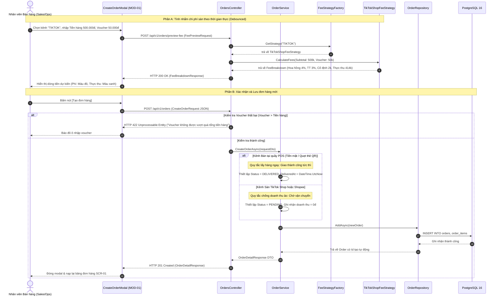
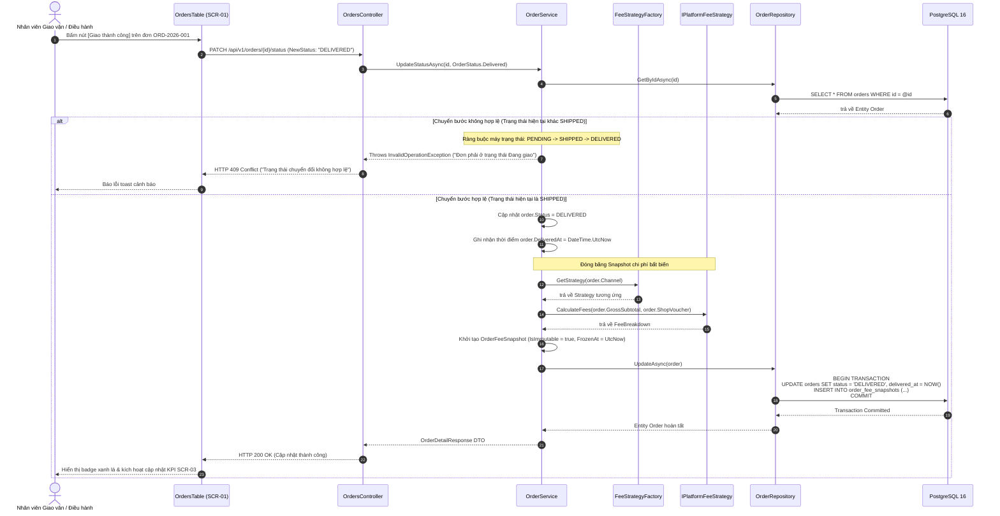
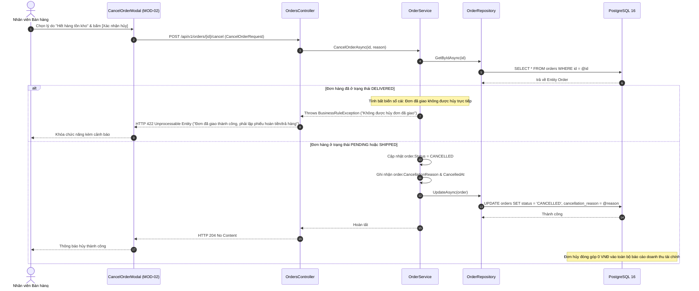
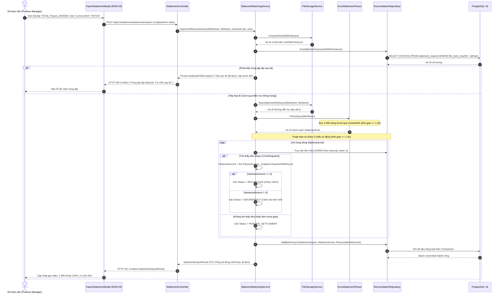
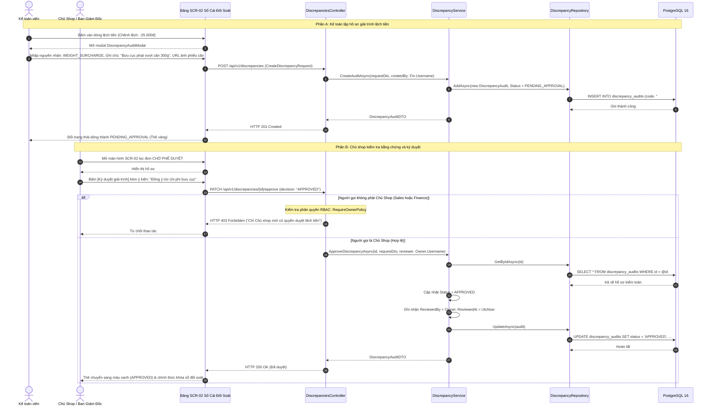

# 05 — Sơ Đồ Tuần Tự: Các Luồng Nghiệp Vụ API Trọng Yếu (Sequence Diagrams)

> **Dự án:** FASHION-WEB — Nền Tảng Quản Lý Doanh Thu & Đối Soát Bán Hàng Đa Kênh  
> **Phạm vi tầng:** Client SPA, Presentation (`FashionWeb.Api`), Business (`FashionWeb.Business`), Data (`FashionWeb.Data`), PostgreSQL 16  
> **Mẫu kiến trúc:** Clean Architecture 3 Tầng, Mẫu Chiến lược (Strategy), Kiểm soát giao dịch ACID, Kiểm tra bảo mật RBAC

---

## 1. Danh Mục Các Kịch Bản Nghiệp Vụ

Tài liệu này mô tả chi tiết trình tự gọi phương thức, điều kiện kiểm tra dữ liệu và các nhánh lỗi HTTP cho 6 luồng hoạt động chính:
1. **Kịch bản 1:** Xem trước phí sàn trực tiếp & Tạo đơn hàng đa kênh (`MOD-01`)
2. **Kịch bản 2:** Chuyển trạng thái giao hàng `DELIVERED` & Đóng băng Snapshot chi phí (`SCR-01`)
3. **Kịch bản 3:** Hủy đơn hàng & Loại trừ 100% doanh thu ảo (`MOD-02`)
4. **Kịch bản 4:** Nạp sao kê Excel, băm SHA-256 chống trùng & So khớp 2 chiều tự động (`MOD-03`)
5. **Kịch bản 5:** Lập biên bản giải trình chênh lệch & Phê duyệt cấp Chủ shop (`#DIS-002`)
6. **Kịch bản 6:** Tổng hợp 4 KPI tài chính & Truy xuất tệp CSV kiểm toán dạng Stream (`SCR-03`)

---

## 2. Kịch Bản 1: Xem Trước Phí Sàn Trực Tiếp & Tạo Đơn Hàng Đa Kênh (MOD-01)



---

## 3. Kịch Bản 2: Chuyển Trạng Thái Giao Hàng DELIVERED & Đóng Băng Snapshot Chi Phí



---

## 4. Kịch Bản 3: Hủy Đơn Hàng & Loại Trừ 100% Doanh Thu Ảo (MOD-02)



---

## 5. Kịch Bản 4: Nạp Sao Kê Excel, Băm SHA-256 & So Khớp 2 Chiều Tự Động (MOD-03)



---

## 6. Kịch Bản 5: Lập Biên Bản Giải Trình Chênh Lệch & Phê Duyệt Cấp Chủ Shop (#DIS-002)



---

## 7. Kịch Bản 6: Tổng Hợp 4 KPI Tài Chính & Xuất Tệp CSV Dạng Stream (SCR-03)

```mermaid
sequenceDiagram
    autonumber
    actor Owner as Chủ Shop / Điều Hành
    participant UI as RevenueDashboard (SCR-03)
    participant API as AnalyticsController
    participant Svc as AnalyticsService
    participant Repo as AnalyticsRepository
    participant DB as PostgreSQL 16

    Owner->>UI: Chọn bộ lọc: "Tháng này", Kênh: "TẤT CẢ"
    UI->>API: GET /api/v1/analytics/kpis?from=2026-09-01&to=2026-09-30&channel=ALL

    API->>Svc: GetKPIsAsync(fromDate, toDate, channel)
    Svc->>Repo: GetDeliveredOrdersAggregateAsync(fromDate, toDate, channel)
    
    Note over Repo, DB: Chống doanh thu ảo: Lọc chặt chẽ điều kiện DELIVERED
    Repo->>DB: SELECT SUM(gross_subtotal - shop_voucher) as Gross,<br/>SUM(total_platform_fees) as Fees,<br/>SUM(expected_net_payout) as Net<br/>FROM orders o JOIN order_fee_snapshots s ON o.id = s.order_id<br/>WHERE o.status = 'DELIVERED' AND o.delivered_at BETWEEN @from AND @to
    DB-->>Repo: trả về dòng số liệu tổng hợp
    Repo-->>Svc: KpiAggregateData
    Svc-->>API: ExecutiveKPIsResponse DTO
    API-->>UI: HTTP 200 OK (ExecutiveKPIsResponse)
    UI-->>Owner: Renders 4 thẻ KPI (Doanh thu gộp, Phí sàn, Thực thu, Số đơn đã giao)

    %% Xuất tệp CSV
    Note over Owner, DB: Xuất báo cáo CSV dạng Stream trực tiếp
    Owner->>UI: Bấm nút [Xuất Sổ Cái CSV]
    UI->>API: GET /api/v1/analytics/export-csv
    API->>Svc: ExportReconciliationCsvAsync()
    Svc->>Repo: StreamReconciliationRecordsAsync()
    Repo->>DB: Mở con trỏ đọc tuần tự (Read-only cursor)
    DB-->>Repo: Trả về từng khối dòng dữ liệu
    Repo-->>Svc: Chuyển đổi thành dòng văn bản CSV
    Svc-->>API: Luồng Byte array stream (text/csv)
    API-->>UI: HTTP 200 OK kèm Content-Disposition: attachment; filename="Reconciliation_Report_20260917.csv"
    UI-->>Owner: Tự động tải tệp xuống máy tính (Không gây tràn bộ nhớ RAM)
```
